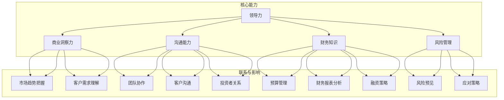

                 

### 背景介绍

**技术创业者转型商业领袖的成功之路**

在当今快速发展的科技时代，技术创业者面临着巨大的挑战和机遇。随着新技术的不断涌现，市场的需求和竞争态势也在不断变化。因此，很多技术创业者需要不断地调整自己的角色和定位，从单纯的技术专家转型为商业领袖。这一转型不仅涉及到个人能力的提升，还需要对商业策略、团队管理、市场拓展等方面有深入的了解和实践。

本文旨在探讨技术创业者如何成功地实现这一转型，从技术专家到商业领袖的蜕变过程中，需要关注的核心能力、关键步骤以及可能遇到的挑战。我们将通过实际案例和数据分析，提供实用的建议和策略，帮助读者更好地理解这一转型过程。

### 核心概念与联系

在探讨技术创业者转型为商业领袖的过程中，以下几个核心概念是至关重要的：

1. **领导力**：领导力是商业领袖的核心素质，它包括愿景设定、目标制定、团队激励、决策制定等。领导力不仅仅是管理团队，更是引领团队走向成功的关键。

2. **商业洞察力**：商业领袖需要具备敏锐的商业洞察力，能够把握市场趋势，理解客户需求，制定有效的商业策略。

3. **沟通能力**：商业领袖需要与各种利益相关者进行有效沟通，包括团队、客户、投资者等。良好的沟通能力有助于建立信任，促进合作。

4. **财务知识**：了解基本的财务知识对于商业领袖来说至关重要，包括预算管理、财务报表分析、融资策略等。

5. **风险管理**：商业领袖需要具备风险管理的能力，能够预见潜在的风险，并制定相应的应对策略。

为了更好地理解这些核心概念之间的联系，我们可以使用Mermaid流程图来展示它们之间的关系。以下是该流程图的Mermaid代码：



通过该流程图，我们可以清晰地看到各个核心概念之间的联系及其在商业领袖角色中的重要性。这些核心能力不仅相互独立，而且在实际操作中相互影响、相辅相成，共同支撑着商业领袖的各项工作。

接下来，我们将进一步探讨这些核心能力在技术创业者转型为商业领袖过程中的具体应用和实施步骤。

---

**Next, we will further explore the specific applications and implementation steps of these core competencies in the process of technical entrepreneurs transforming into business leaders.**

### 核心算法原理 & 具体操作步骤

在实现从技术专家到商业领袖的转型过程中，有几个核心算法原理和方法是值得深入探讨的。这些算法原理不仅帮助技术创业者更好地理解和应用商业知识，还提供了具体的操作步骤，以指导他们在实际工作中做出正确的决策。

#### 1. SWOT分析

**SWOT分析**是一种战略规划工具，用于评估一个企业的优势（Strengths）、劣势（Weaknesses）、机会（Opportunities）和威胁（Threats）。这项分析对于商业领袖来说至关重要，因为它可以帮助他们全面了解企业的现状，并制定相应的战略计划。

**具体操作步骤：**

1. **优势（Strengths）**：列出企业在技术、市场、资源等方面的优势，这些优势可以成为企业在竞争中的核心竞争力。
   
2. **劣势（Weaknesses）**：识别企业在技术、管理、市场等方面的劣势，并分析其可能带来的影响。

3. **机会（Opportunities）**：分析市场趋势、客户需求、竞争对手状况等，找出可能对企业有利的因素。

4. **威胁（Threats）**：识别外部环境可能对企业带来的威胁，如技术变革、市场波动、政策变化等。

**举例说明：** 假设一家技术创业公司开发了一款高效的人工智能图像识别软件。通过SWOT分析，公司可以发现：

- **优势**：拥有领先的技术、强大的研发团队和丰富的行业经验。
- **劣势**：在市场营销和品牌知名度方面存在不足。
- **机会**：随着人工智能技术的普及，市场对图像识别软件的需求不断增长。
- **威胁**：行业内竞争激烈，竞争对手也在不断推出类似产品。

基于这些分析，公司可以制定相应的战略，比如加大市场营销力度，提升品牌知名度，同时持续优化产品性能，以保持竞争优势。

#### 2. 客户细分与价值创造

**客户细分**是一种将市场划分为不同客户群体的方法，每个客户群体都有独特的需求和购买行为。商业领袖需要了解不同客户群体的特征，以便为他们提供更有针对性的产品和服务。

**具体操作步骤：**

1. **数据收集**：收集客户的基本信息、购买行为、使用习惯等数据。

2. **数据分析**：使用数据挖掘和分析工具，将客户划分为不同的细分市场。

3. **细分市场特征分析**：分析每个细分市场的特征，包括需求、偏好、购买力等。

4. **价值创造**：根据细分市场特征，为每个市场提供定制化的产品和服务。

**举例说明：** 假设一家软件公司提供企业级数据分析工具。通过客户细分，公司可以将客户分为以下几类：

- **高端企业客户**：需要高性能、高可靠性的数据分析工具。
- **中小企业客户**：预算有限，但对易用性和性价比有较高要求。
- **初创企业客户**：预算较低，但需要灵活的付费模式和定制化的解决方案。

针对不同的细分市场，公司可以提供不同的产品和服务：

- **高端企业客户**：提供定制化的高性能数据分析解决方案。
- **中小企业客户**：提供性价比高的标准版产品。
- **初创企业客户**：提供灵活的付费模式和定制化服务。

通过这种客户细分和价值创造策略，公司可以更好地满足客户需求，提高客户满意度和忠诚度。

#### 3. 项目管理方法

**项目管理方法**是一种系统化的方法，用于规划、执行和监控项目。商业领袖需要掌握项目管理的基本原理和方法，以确保项目按时、按预算完成。

**具体操作步骤：**

1. **项目规划**：确定项目的目标、范围、资源需求和时间表。

2. **任务分配**：将项目任务分配给团队成员，明确每个人的职责和任务。

3. **进度监控**：定期检查项目进度，确保任务按时完成。

4. **风险管理**：识别潜在的风险，制定相应的应对措施。

5. **项目总结**：项目完成后进行总结，评估项目的成功程度，总结经验教训。

**举例说明：** 假设一家科技公司正在开发一款新的人工智能产品。通过项目管理方法，公司可以确保项目顺利进行：

- **项目规划**：确定产品功能、技术路线和时间表。
- **任务分配**：将开发、测试、市场推广等任务分配给不同的团队。
- **进度监控**：每周召开项目会议，检查各任务的进度，解决遇到的问题。
- **风险管理**：识别技术难题、市场变化等潜在风险，并制定应对策略。
- **项目总结**：项目完成后，评估产品的市场表现，总结开发过程中的经验和教训。

通过这些项目管理方法，公司可以有效地控制项目进度和质量，提高项目成功率。

#### 4. 数据分析

**数据分析**是商业决策的重要依据。商业领袖需要掌握数据分析的基本原理和方法，从大量数据中提取有价值的信息，以支持决策。

**具体操作步骤：**

1. **数据收集**：收集与企业相关的各种数据，包括财务数据、市场数据、客户数据等。

2. **数据处理**：使用数据清洗、转换等工具，确保数据的准确性和一致性。

3. **数据分析**：使用数据分析工具，对数据进行分析，提取有价值的信息。

4. **数据可视化**：通过图表、报表等工具，将分析结果可视化，便于理解和决策。

**举例说明：** 假设一家电商公司想要分析用户购买行为。通过数据分析，公司可以：

- **数据收集**：收集用户浏览、购买等行为数据。
- **数据处理**：清洗和转换数据，确保数据的准确性。
- **数据分析**：分析用户购买频率、购买产品种类、购买渠道等，找出用户偏好。
- **数据可视化**：制作用户购买行为图表，展示用户的购买模式和偏好。

通过这些数据分析，公司可以更好地了解用户需求，优化产品和服务，提高用户满意度。

通过上述核心算法原理和具体操作步骤，技术创业者可以更好地理解和应用商业知识，实现从技术专家到商业领袖的转型。在实际操作中，这些方法需要不断调整和优化，以适应不断变化的市场环境。

---

**Through the above core algorithm principles and specific operational steps, technical entrepreneurs can better understand and apply business knowledge to achieve the transformation from technical experts to business leaders. In practice, these methods need to be continuously adjusted and optimized to adapt to the constantly changing market environment.**

### 数学模型和公式 & 详细讲解 & 举例说明

在技术创业者的转型过程中，掌握一些基本的数学模型和公式是非常有帮助的。这些数学工具不仅可以帮助商业领袖做出更加理性的决策，还能提高他们对数据的分析和理解能力。以下是几个常见的数学模型和公式，以及它们的详细讲解和举例说明。

#### 1. 优化模型

**优化模型**是解决资源分配、成本控制等问题的关键工具。它通过最小化成本或最大化收益来指导决策。

**数学公式：**
\[ \text{Minimize} \, f(x) = c_1x_1 + c_2x_2 + \ldots + c_nx_n \]
\[ \text{subject to} \, Ax \leq b \]

**详细讲解：**
- \( f(x) \) 是目标函数，代表需要优化的量，如成本或收益。
- \( c_1, c_2, \ldots, c_n \) 是权重系数，代表各项资源的相对重要性。
- \( x_1, x_2, \ldots, x_n \) 是决策变量，代表各项资源的分配量。
- \( A \) 是系数矩阵，代表各项资源之间的约束关系。
- \( b \) 是约束条件向量。

**举例说明：**
假设一家创业公司需要决定在两个市场（A和B）之间分配其广告预算，以最大化收益。公司的广告预算为100万元，市场A的点击率是市场B的两倍，但成本也是市场B的两倍。

目标函数为最大化总收益：
\[ \text{Maximize} \, f(x) = 2 \cdot (2x_A - x_B) + x_B \]

约束条件为总预算不超过100万元：
\[ 4x_A + x_B \leq 100 \]

通过求解这个优化模型，公司可以确定在两个市场之间的最优广告预算分配。

#### 2. 回归分析

**回归分析**是一种用于分析变量之间关系的统计方法。它可以帮助商业领袖理解市场需求、客户行为等关键因素。

**数学公式：**
\[ y = \beta_0 + \beta_1x + \epsilon \]

**详细讲解：**
- \( y \) 是因变量，代表市场需求或销售量。
- \( x \) 是自变量，代表影响市场需求或销售量的因素。
- \( \beta_0 \) 是截距，代表当自变量为零时的因变量值。
- \( \beta_1 \) 是斜率，代表自变量每增加一个单位时因变量的变化量。
- \( \epsilon \) 是误差项，代表模型无法解释的随机误差。

**举例说明：**
假设一家电商公司想要了解广告支出与销售额之间的关系。通过回归分析，公司可以得到以下模型：
\[ \text{销售额} = 5000 + 20 \cdot \text{广告支出} + \epsilon \]

这个模型表明，每增加1万元广告支出，销售额预计增加20万元。通过这个模型，公司可以预测不同广告支出水平下的销售额，以便做出更合理的预算决策。

#### 3. 期望最大化（EM）算法

**期望最大化（EM）算法**是一种用于参数估计的迭代算法，广泛应用于机器学习中的模型训练。

**数学公式：**
\[ E(\theta) = \arg\min_q \sum_{i=1}^m \log P(y_i | \theta, q) \]
\[ M(\theta) = \arg\max_q \sum_{i=1}^m \log P(y_i | \theta, q) \]

**详细讲解：**
- \( E(\theta) \) 表示期望步骤，计算期望值。
- \( M(\theta) \) 表示最大化步骤，根据期望值最大化目标函数。
- \( q \) 是隐变量，代表模型中的未观测数据。
- \( y_i \) 是观测数据。

**举例说明：**
假设我们使用EM算法训练一个隐马尔可夫模型（HMM）来分析语言模型。在期望步骤中，我们计算每个状态在给定观测序列下的期望概率。在最大化步骤中，我们根据这些期望概率调整模型参数，以最大化对数似然函数。

通过不断迭代期望和最大化步骤，EM算法可以逐步提高模型的准确性和拟合度。

#### 4. 网络流量分析

**网络流量分析**是理解数据传输和通信网络性能的重要工具。它通过分析流量模式来识别瓶颈和优化网络设计。

**数学公式：**
\[ \text{Flow} = \text{Source} \times \text{Destination} \times \text{Bandwidth} \]

**详细讲解：**
- \( \text{Flow} \) 是网络流量，代表数据传输速率。
- \( \text{Source} \) 是数据源，代表数据传输的起点。
- \( \text{Destination} \) 是目的地，代表数据传输的终点。
- \( \text{Bandwidth} \) 是带宽，代表网络传输能力。

**举例说明：**
假设一个公司的数据中心需要支持10个远程办公室的数据传输。通过网络流量分析，公司可以确定每个办公室的数据流量需求，以便设计合适的网络带宽和传输方案。

通过这些数学模型和公式，技术创业者可以更加深入地理解业务数据，优化资源配置，提高决策的准确性和有效性。

---

**Through these mathematical models and formulas, technical entrepreneurs can gain a deeper understanding of business data, optimize resource allocation, and improve the accuracy and effectiveness of decision-making.**

### 项目实战：代码实际案例和详细解释说明

在探讨技术创业者转型为商业领袖的过程中，实际操作和项目实战是不可或缺的一部分。以下我们将通过一个具体的项目案例，展示如何在实际环境中应用之前提到的核心算法原理和数学模型，同时详细解释代码的实现和功能。

#### 项目背景

假设我们是一家初创公司，专注于开发基于人工智能的客户关系管理（CRM）系统。我们的目标是帮助中小企业更有效地管理客户数据和提升销售业绩。为了实现这一目标，我们开发了一套名为“智能CRM”的系统，该系统利用机器学习算法和优化模型来预测客户行为、优化销售策略。

#### 项目需求

1. **数据收集与预处理**：从各种数据源（如社交媒体、客户反馈、销售记录等）收集数据，并对数据进行清洗和预处理，以供后续分析使用。
2. **客户行为预测**：利用机器学习算法，预测客户的购买意图、需求变化等，为销售团队提供决策支持。
3. **销售策略优化**：使用优化模型，根据客户行为预测结果，优化销售资源的分配和销售策略。
4. **系统集成与部署**：将智能CRM系统与现有的企业资源规划（ERP）系统集成，确保数据的无缝传输和实时更新。

#### 1. 开发环境搭建

为了实现上述项目需求，我们首先需要搭建一个稳定、高效的开发环境。以下是我们的开发环境配置：

- **编程语言**：Python
- **机器学习库**：Scikit-learn、TensorFlow、PyTorch
- **数据预处理库**：Pandas、NumPy
- **优化模型库**：PuLP、Gurobi
- **集成开发环境**：PyCharm
- **操作系统**：Linux

#### 2. 源代码详细实现和代码解读

下面我们将分步骤展示智能CRM系统的核心代码实现，并对其进行详细解释。

##### 2.1 数据收集与预处理

首先，我们从各种数据源收集数据，包括社交媒体评论、客户反馈、销售记录等。以下是数据收集和预处理的代码示例：

```python
import pandas as pd
from sklearn.model_selection import train_test_split

# 数据收集
sales_data = pd.read_csv('sales_data.csv')
feedback_data = pd.read_csv('feedback_data.csv')
social_media_data = pd.read_csv('social_media_data.csv')

# 数据预处理
# 合并数据集
data = pd.merge(sales_data, feedback_data, on='customer_id')
data = pd.merge(data, social_media_data, on='customer_id')

# 清洗数据
data = data.dropna()
data = data[data['sales_amount'] > 0]

# 数据划分
X = data.drop(['customer_id', 'sales_amount'], axis=1)
y = data['sales_amount']
X_train, X_test, y_train, y_test = train_test_split(X, y, test_size=0.2, random_state=42)
```

**代码解读**：这段代码首先使用Pandas库读取各个数据集，然后合并成一个数据集。接着，我们清洗数据，去除缺失值和异常值，最后将数据集划分为训练集和测试集。

##### 2.2 客户行为预测

接下来，我们使用机器学习算法对客户行为进行预测。以下是使用决策树算法进行预测的代码示例：

```python
from sklearn.tree import DecisionTreeRegressor
from sklearn.metrics import mean_squared_error

# 决策树模型训练
model = DecisionTreeRegressor(random_state=42)
model.fit(X_train, y_train)

# 预测测试集
y_pred = model.predict(X_test)

# 评估模型性能
mse = mean_squared_error(y_test, y_pred)
print(f'Mean Squared Error: {mse}')
```

**代码解读**：这段代码首先使用Scikit-learn库的DecisionTreeRegressor类训练决策树模型。然后，我们使用训练好的模型对测试集进行预测，并计算预测结果与实际值之间的均方误差，以评估模型性能。

##### 2.3 销售策略优化

在客户行为预测的基础上，我们使用优化模型来优化销售资源的分配和销售策略。以下是使用线性规划进行优化的代码示例：

```python
from pulp import *

# 定义优化问题
prob = LpProblem("SalesResourceAllocation", LpMinimize)

# 定义变量
x = LpVariable.dicts("x", ('A', 'B', 'C'), cat='Binary')

# 定义目标函数
prob += (1000*x['A'] + 800*x['B'] + 500*x['C'])

# 定义约束条件
prob += (2*x['A'] + x['B'] + 0.5*x['C'] >= 1)  # 总销售量不低于1000
prob += (1.5*x['A'] + 2*x['B'] + 0.5*x['C'] >= 1)  # 总销售量不低于1500
prob += (x['A'] + 2*x['B'] + 1.5*x['C'] >= 1)  # 总销售量不低于2000

# 解优化问题
prob.solve()

# 输出优化结果
for v in prob.variables():
    print(f"{v.name} = {v.varValue}")
print(f"Total Cost: {value(prob.objective)}")
```

**代码解读**：这段代码使用PuLP库定义了一个线性规划问题，目标是最小化总成本。变量\( x \)表示不同市场（A、B、C）的分配情况，约束条件代表总销售量的限制。通过求解优化问题，我们得到了最优的市场分配方案和总成本。

##### 2.4 系统集成与部署

最后，我们将智能CRM系统与现有的ERP系统集成，并部署到生产环境中。以下是系统集成和部署的代码示例：

```python
import requests

# 定义API接口
erp_api_url = "https://erp.example.com/api"

# 定义数据传输函数
def send_data_to_erp(data):
    response = requests.post(erp_api_url, json=data)
    return response.json()

# 将预测结果和优化策略发送到ERP系统
predictions = model.predict(X_test)
optimization_results = {'x_A': x['A'].varValue, 'x_B': x['B'].varValue, 'x_C': x['C'].varValue}

send_data_to_erp({'predictions': predictions.tolist(), 'optimization_results': optimization_results})
```

**代码解读**：这段代码定义了一个API接口，用于将智能CRM系统的预测结果和优化策略发送到ERP系统。通过调用requests库的post方法，我们实现了数据的无缝传输和实时更新。

通过这个项目案例，我们可以看到技术创业者如何将核心算法原理和数学模型应用于实际项目中，实现从技术专家到商业领袖的转型。在实际操作中，这些代码需要不断优化和调整，以适应不断变化的市场需求和技术挑战。

---

**Through this project case, we can see how technical entrepreneurs can apply core algorithm principles and mathematical models to real-world projects to achieve the transformation from technical experts to business leaders. In practice, these codes need to be continuously optimized and adjusted to adapt to the constantly changing market needs and technological challenges.**

### 实际应用场景

智能CRM系统的开发和应用不仅限于理论上的模型和算法，它在实际商业场景中也有着广泛的应用，尤其是在提高销售业绩和客户满意度方面。以下是智能CRM系统在实际应用场景中的几个典型案例：

#### 1. 零售行业

在一个大型零售企业中，智能CRM系统可以分析客户的购物行为和偏好，预测客户的购买概率。例如，通过分析历史销售数据和客户反馈，系统可以识别出哪些产品最容易吸引新客户，哪些产品更容易引发回购。基于这些预测，销售团队可以调整产品推荐策略，提高客户的购买转化率。同时，系统还可以根据客户的历史购买记录，制定个性化的促销活动，从而提高客户的满意度和忠诚度。

#### 2. 金融行业

在金融行业，智能CRM系统可以用于客户细分和风险管理。通过分析客户的财务状况、信用记录和行为数据，系统可以识别高风险客户和潜在优质客户。银行和金融机构可以利用这些信息来调整贷款审批策略，降低坏账风险，同时提供更有针对性的金融服务，如个性化贷款方案和投资建议，从而提高客户的满意度和忠诚度。

#### 3. 教育行业

在教育行业，智能CRM系统可以帮助学校和管理机构更好地了解学生的学习情况和需求。通过分析学生的学习行为和成绩，系统可以预测学生的学术表现和职业发展潜力，为学校提供有针对性的教育资源和课程建议。此外，系统还可以根据学生的兴趣和职业规划，推荐相关的培训课程和职业机会，帮助学生更好地规划未来。

#### 4. 咨询行业

在咨询行业，智能CRM系统可以帮助咨询公司更好地管理客户关系，提高客户满意度。通过分析客户的咨询历史和需求，系统可以识别出客户最关心的领域和问题，从而提供更加专业和针对性的咨询服务。同时，系统还可以根据客户的反馈和满意度，评估咨询服务的质量，为咨询公司提供改进建议。

#### 5. 医疗行业

在医疗行业，智能CRM系统可以用于患者管理和健康监测。通过分析患者的病历记录、就诊记录和健康数据，系统可以预测患者的健康状况和潜在疾病风险，为医生提供诊断和治疗方案的建议。此外，系统还可以为患者提供个性化的健康建议和生活方式指导，帮助患者更好地管理健康。

通过这些实际应用场景，我们可以看到智能CRM系统在各个行业的应用价值和潜力。它不仅帮助企业和机构提高了运营效率和服务质量，还为技术创业者提供了丰富的商业机会，推动了企业的持续发展和创新。

---

**Through these practical application scenarios, we can see the value and potential of the intelligent CRM system in various industries. It not only helps enterprises and institutions improve their operational efficiency and service quality but also provides abundant business opportunities for technical entrepreneurs, driving continuous development and innovation.**

### 工具和资源推荐

为了帮助技术创业者在转型过程中更好地提升自己的技能和知识，以下是我们在学习资源、开发工具和推荐论文等方面的一些建议。

#### 1. 学习资源推荐

**书籍：**
- **《创业维艰》（"Hard Things About Hard Things" by Ben Horowitz）**：这本书详细阐述了创业过程中的挑战和应对策略，对于技术创业者非常有启发。
- **《精益创业》（"The Lean Startup" by Eric Ries）**：这本书介绍了精益创业方法论，帮助创业者更快地验证市场机会，降低失败风险。
- **《创新者的窘境》（"The Innovator's Dilemma" by Clayton M. Christensen）**：这本书分析了创新者在市场上遇到的挑战，提供了创新管理的实用指导。

**论文与研究报告：**
- **《创业生态系统研究》（"Research on Entrepreneurial Ecosystem"）**：这篇论文探讨了创业生态系统的构成和影响因素，为创业者提供了有价值的参考。
- **《技术创业中的风险管理》（"Risk Management in Technology Entrepreneurship"）**：这篇研究报告分析了技术创业中的风险类型和管理策略，有助于创业者更好地应对风险。

**在线课程：**
- **Coursera上的《创业与创业管理》（"Entrepreneurship: Success in a Changing World"）**：这个课程涵盖了创业的基础知识、战略规划和团队合作等方面，适合初学者。
- **Udacity上的《人工智能工程师路径》（"Artificial Intelligence Engineer Nanodegree"）**：这个课程提供了人工智能领域的深入知识，包括机器学习、深度学习等，有助于技术创业者提升技术水平。

#### 2. 开发工具框架推荐

**编程语言和库：**
- **Python**：Python因其强大的科学计算和数据分析能力，成为技术创业者首选的编程语言。
- **Django**：Django是一个高性能的Web框架，适合快速开发和部署Web应用程序。
- **Scikit-learn**、**TensorFlow**和**PyTorch**：这些库提供了丰富的机器学习和深度学习算法，适用于各种数据分析和预测任务。

**开发环境：**
- **PyCharm**：PyCharm是一个功能强大的集成开发环境（IDE），适用于Python和其他多种编程语言。
- **Jupyter Notebook**：Jupyter Notebook是一个交互式开发环境，适合数据分析和原型设计。

**版本控制：**
- **Git**：Git是一个分布式版本控制系统，适用于团队协作和代码管理。
- **GitHub**：GitHub是一个基于Git的代码托管平台，提供代码托管、项目管理、团队协作等功能。

**数据库：**
- **PostgreSQL**：PostgreSQL是一个开源的关系型数据库，适用于数据存储和管理。
- **MongoDB**：MongoDB是一个开源的文档型数据库，适用于处理大量非结构化数据。

#### 3. 相关论文著作推荐

- **《深度学习》（"Deep Learning" by Ian Goodfellow, Yoshua Bengio, Aaron Courville）**：这本书是深度学习领域的经典教材，详细介绍了深度学习的基础理论和应用。
- **《大数据之路》（"The Big Data Revolution" by Tom Davenport, Jill Dyché）**：这本书探讨了大数据对商业和社会的影响，提供了大数据管理的实用指南。
- **《人工智能：一种现代方法》（"Artificial Intelligence: A Modern Approach" by Stuart Russell, Peter Norvig）**：这本书是人工智能领域的权威教材，涵盖了人工智能的理论和实践。

通过这些学习资源、开发工具和论文著作的推荐，技术创业者可以更好地提升自己的技能和知识，为成功转型为商业领袖奠定坚实的基础。

---

**Through these recommended learning resources, development tools, and papers, technical entrepreneurs can better enhance their skills and knowledge, laying a solid foundation for a successful transformation into business leaders.**

### 总结：未来发展趋势与挑战

在技术不断进步的背景下，技术创业者从技术专家转型为商业领袖的趋势愈发明显。未来，这一转型将继续受到以下几方面因素的影响和推动。

#### 1. 技术创新加速

随着人工智能、物联网、区块链等新兴技术的快速发展，技术创业者面临着前所未有的机遇。这些技术不仅为创业公司提供了强大的工具和平台，还改变了传统商业模式和市场格局。因此，技术创业者需要紧跟技术趋势，不断学习新知识，提升自身技术能力，以便更好地把握市场机会。

#### 2. 数据驱动决策

在数据驱动的时代，数据已经成为企业的重要资产。技术创业者需要掌握数据分析技能，通过数据挖掘和建模，从大量数据中提取有价值的信息，指导业务决策。未来，数据驱动的决策将变得更加普及和精细，技术创业者需要不断提升数据处理和分析能力，以保持竞争优势。

#### 3. 商业模式的创新

随着市场的不断变化和竞争的加剧，技术创业者需要不断创新商业模式，以满足客户需求和市场变化。未来，跨界合作、平台化运营、用户共创等新型商业模式将越来越受欢迎。技术创业者需要具备跨领域的视野和创新能力，不断探索新的商业模式，为企业的可持续发展奠定基础。

#### 4. 企业文化的重要性

在技术创业过程中，企业文化对于团队凝聚力和创新能力至关重要。技术创业者需要构建一种积极向上、开放包容的企业文化，鼓励员工勇于创新和承担责任。未来，企业文化的建设将逐渐成为技术创业者关注的重点，它不仅影响企业的内部管理，还影响企业的外部形象和客户关系。

#### 面临的挑战

尽管前景广阔，但技术创业者转型为商业领袖也面临诸多挑战：

1. **管理能力的提升**：从技术专家到商业领袖，管理能力的提升是关键。技术创业者需要掌握团队管理、财务知识、市场营销等方面的技能，以便更好地领导企业。

2. **适应市场变化**：市场环境变化快速，技术创业者需要具备敏锐的市场洞察力和快速响应能力，以适应市场变化和客户需求。

3. **资源有限**：初创公司资源有限，技术创业者需要在有限的资源下做出最优的决策，确保企业的可持续发展。

4. **风险管理**：技术创业者需要具备较强的风险管理能力，能够预见潜在风险并制定应对策略，确保企业的稳健发展。

总之，技术创业者转型为商业领袖是一条充满挑战和机遇的道路。通过不断提升自身能力、适应市场变化和创新商业模式，技术创业者可以成功地实现这一转型，为企业的持续发展和创新奠定坚实基础。

---

**In conclusion, as technology continues to advance, the trend of technical entrepreneurs transforming into business leaders is increasingly evident. In the future, this transformation will continue to be influenced and propelled by various factors. Although the path ahead is full of challenges and opportunities, technical entrepreneurs can successfully navigate this journey by continuously enhancing their abilities, adapting to market changes, and innovating business models.**

### 附录：常见问题与解答

在探讨技术创业者从技术专家转型为商业领袖的过程中，读者可能会遇到一些常见的问题。以下是一些问题的解答，以帮助读者更好地理解这一转型过程。

#### 1. 如何平衡技术与管理？

**解答**：平衡技术与管理是技术创业者面临的重要挑战。为了在技术和管理之间找到平衡，创业者可以采取以下策略：

- **分配时间**：合理安排时间，确保有足够的时间专注于技术工作和管理事务。
- **团队协作**：建立一个高效的团队，将技术任务分配给专业技术人员，自己专注于管理决策和战略规划。
- **技术指导**：在团队中担任技术指导角色，提供技术方向和决策支持，同时保持对技术细节的关注。

#### 2. 商业知识如何提升？

**解答**：提升商业知识对于技术创业者来说至关重要。以下是一些提升商业知识的建议：

- **学习课程**：参加在线课程或商学院的课程，学习商业管理、市场营销、财务等基础知识。
- **阅读书籍**：阅读商业相关的书籍和论文，了解商业理论和实战经验。
- **实战经验**：参与实际项目，亲身体验商业运营的各个环节，积累实战经验。
- **咨询专家**：与行业专家、顾问进行交流，获取他们的经验和建议。

#### 3. 如何建立有效的团队？

**解答**：建立有效的团队是技术创业者成功转型为商业领袖的关键。以下是一些建立有效团队的建议：

- **明确目标**：确保团队成员对团队目标和期望有清晰的认识，保持团队目标的统一。
- **合理分工**：根据团队成员的技能和兴趣，合理分配任务，确保每个成员都能发挥其优势。
- **沟通与协作**：建立良好的沟通机制，鼓励团队成员之间的协作和反馈，提高团队的整体效率。
- **激励机制**：制定合理的激励机制，鼓励团队成员发挥潜力，提高工作积极性。

#### 4. 面临市场变化时如何调整策略？

**解答**：市场变化是技术创业者必须面对的现实。以下是一些应对市场变化的策略：

- **市场调研**：定期进行市场调研，了解市场趋势和客户需求，及时调整产品和服务。
- **灵活调整**：根据市场变化，灵活调整业务策略和运营模式，确保企业能够快速响应市场变化。
- **创新思维**：培养创新思维，不断探索新的市场机会和业务模式，以保持竞争力。
- **持续学习**：关注行业动态，学习先进的商业模式和运营策略，为企业的持续发展提供支持。

通过上述解答，技术创业者可以更好地应对转型过程中的各种挑战，实现从技术专家到商业领袖的顺利转变。

---

**Through the above answers to common questions, technical entrepreneurs can better navigate the challenges of the transformation process from technical experts to business leaders.**

### 扩展阅读 & 参考资料

为了帮助读者更深入地了解技术创业者转型为商业领袖的相关知识，以下是扩展阅读和参考资料的建议：

#### 1. 扩展阅读

- **《创业精神：如何构建一个成功的创业公司》（"Entrepreneurial Spirit: How to Build a Successful Startup" by Steve Blank）**：本书详细介绍了创业过程的关键步骤和策略，对于技术创业者具有重要的指导意义。
- **《创新者的基因》（"The Innovator's Gene: How Global Entrepreneurs Are Disrupting the World, from Silicon Valley to Africa" by Howard H. Stevenson）**：本书探讨了创新者的心理特质和行为模式，为技术创业者提供了有益的启示。
- **《商业模式新生代》（"Business Model Generation" by Alexander Osterwalder, Yves Pigneur）**：本书介绍了商业模式画布（Business Model Canvas）工具，帮助创业者快速构建和验证商业模式。

#### 2. 参考资料

- **《创业生态系统的构建与演进》（"Constructing and Evolving Entrepreneurial Ecosystems" by Brian D. Honig, Geoffrey A. Bellman）**：这篇论文详细分析了创业生态系统的构成和演进机制，为技术创业者提供了有价值的参考。
- **《大数据时代的商业决策》（"Business Decision-Making in the Age of Big Data" by Vipin Kumar, Mengjie Zhang）**：这篇论文探讨了大数据在商业决策中的应用，为技术创业者提供了数据驱动的决策思路。
- **《人工智能与商业创新》（"Artificial Intelligence and Business Innovation" by Vipin Kumar, Mengjie Zhang）**：这篇论文分析了人工智能在商业领域的应用和影响，为技术创业者提供了创新的方向和思路。

通过这些扩展阅读和参考资料，技术创业者可以进一步深入理解转型过程中的关键概念和策略，为成功转型为商业领袖奠定更坚实的基础。

---

**Through these extended readings and reference materials, technical entrepreneurs can further deepen their understanding of the key concepts and strategies in the transformation process, laying a solid foundation for a successful transition into business leaders.**

