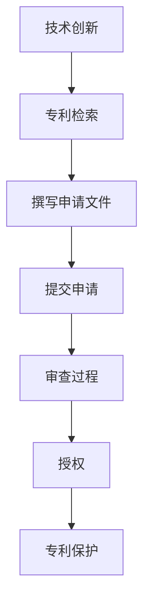

                 

# 技术创新与专利申请：程序员指南

## 概述

技术创新是推动社会进步的重要力量，而专利则是保护创新成果的有效手段。本文旨在为程序员提供一套系统的指南，帮助他们理解技术创新与专利申请之间的关系，以及如何有效地进行专利布局。我们将通过以下几个部分来探讨这个问题：

- **背景介绍**：介绍技术创新的重要性以及专利对创新保护的作用。
- **核心概念与联系**：解释技术创新和专利的基本概念，以及它们之间的关联。
- **核心算法原理与具体操作步骤**：阐述技术创新的核心原理，并给出具体的专利申请流程。
- **数学模型和公式**：介绍用于评估技术创新价值的数学模型，并给出实例说明。
- **项目实战**：通过实际案例展示如何将技术创新转化为专利。
- **实际应用场景**：分析技术创新在不同领域的应用。
- **工具和资源推荐**：推荐有助于技术创新和专利申请的工具和资源。
- **总结**：展望技术创新与专利申请的未来发展趋势和面临的挑战。
- **附录**：提供常见问题与解答，以及扩展阅读和参考资料。

通过本文的阅读，读者将能够全面了解技术创新与专利申请的要点，掌握如何运用专利来保护自己的创新成果，并在实际项目中实现价值最大化。

## 1. 背景介绍

### 技术创新的重要性

技术创新是指通过科学、技术和工程的结合，创造出新的产品、过程或服务，以提升效率、创造价值的过程。在现代经济中，技术创新被视为经济增长的重要驱动力，能够推动产业升级和优化资源配置。随着全球竞争的加剧，企业必须不断创新以保持竞争力。对于程序员而言，技术创新尤为重要，因为他们是技术变革的先锋，能够通过创新来提升软件质量和开发效率。

### 专利对创新保护的必要性

专利是一种法律保护，赋予发明人对其发明在一定时间内独家实施、使用和销售的权利。专利保护对于创新具有重要意义，主要体现在以下几个方面：

- **知识产权保护**：专利制度为发明人提供了法律上的保护，防止他人未经许可擅自使用或盗用其发明。
- **商业价值挖掘**：专利可以作为企业的商业资产，通过授权、许可或转让等方式实现商业价值。
- **市场竞争优势**：拥有专利可以增强企业的市场竞争地位，阻止竞争对手仿制或抄袭。
- **风险投资吸引力**：专利能够提高项目的投资吸引力，为创业者和企业吸引风险投资提供有力支持。

### 程序员与技术创新的关系

程序员是技术创新的实践者，他们的工作直接涉及到软件的设计、开发、测试和优化。以下是程序员如何通过技术创新实现价值的几个方面：

- **提升软件质量**：通过技术创新，程序员可以开发出更加稳定、高效、可靠的软件系统。
- **优化开发流程**：技术创新可以帮助程序员优化开发流程，提高开发效率和代码质量。
- **解决复杂问题**：程序员可以通过技术创新来解决复杂的技术难题，推动技术进步。
- **构建新的商业模式**：技术创新可以催生新的商业模式，为企业和用户创造新的价值。

### 结论

技术创新对于个人、企业和整个社会的发展都至关重要。程序员作为技术创新的主要力量，需要深刻理解技术创新的重要性和专利保护的必要性，通过有效的专利申请来保护自己的创新成果，实现个人和企业的价值最大化。

## 2. 核心概念与联系

### 技术创新的定义

技术创新是指通过新的思想、方法、技术或流程来创造或改进产品、过程或服务，从而提升其性能、效率或用户体验的过程。技术创新可以体现在多个层次，包括基础研究、应用研究、开发研究和市场推广等。

### 专利的定义

专利是一种法律文件，授予发明人一定期限的独占权利，使其在指定区域内享有制造、使用、销售和许可他人使用其发明的权利。专利制度旨在鼓励创新，同时确保发明人的利益得到保护。

### 技术创新与专利的联系

技术创新和专利之间存在紧密的联系。技术创新是专利申请的基础，而专利则是保护技术创新成果的重要手段。具体来说，这种联系可以从以下几个方面来理解：

1. **知识产权保护**：专利作为一种法律保护，可以防止他人未经许可使用或盗用发明人的创新成果。
2. **商业价值挖掘**：专利可以作为一种商业资产，通过授权、许可或转让等方式为企业带来经济利益。
3. **市场竞争优势**：拥有专利的企业可以在市场上占据有利位置，阻止竞争对手仿制或抄袭。
4. **风险投资吸引力**：专利能够提高项目的投资吸引力，为创业者和企业吸引风险投资提供支持。
5. **法律纠纷解决**：在技术创新过程中，专利可以作为争议解决的依据，有助于减少法律纠纷。

### 技术创新与专利的核心概念

- **专利类型**：包括发明专利、实用新型专利和外观设计专利。发明专利是最常见的专利类型，它涵盖了新的技术方案和发明。
- **专利申请流程**：包括专利检索、撰写专利申请文件、提交申请、审查和授权等步骤。
- **专利保护期限**：不同类型的专利保护期限不同，通常发明专利的保护期限为20年，实用新型和外观设计专利的保护期限为10年。

### 技术创新与专利的联系总结

技术创新和专利之间存在紧密的联系。技术创新是专利申请的基础，而专利则是保护技术创新成果的重要手段。通过专利保护，发明人可以确保其创新成果得到合法保护，进而实现商业价值和市场竞争优势。专利制度不仅为技术创新提供了法律保障，也促进了技术进步和经济发展。

### Mermaid 流程图

以下是一个简化的技术创新与专利申请流程的 Mermaid 流程图：



在这个流程中，技术创新是起点，通过专利检索、撰写申请文件、提交申请、审查和授权等步骤，最终实现专利保护。该流程展示了技术创新与专利之间的紧密联系，以及专利申请的基本流程。

### 小结

本节详细介绍了技术创新和专利的基本概念及其联系。理解这些概念对于程序员来说至关重要，因为它们不仅有助于保护自己的创新成果，还能够为个人和企业的长远发展提供支持。

### 2.1 技术创新的分类与特点

技术创新可以根据其性质和范围进行分类，常见的分类方法包括按技术层次、按创新类型和按创新程度等。以下是对几种常见技术创新分类及其特点的详细介绍：

#### 按技术层次分类

1. **基础研究**：基础研究是技术创新的源头，旨在探索自然界的基本规律，为应用研究提供理论基础。这类技术创新通常不直接应用于市场，但为后续的技术发展奠定了基础。
   
2. **应用研究**：应用研究是将基础研究的理论成果应用于实际问题，开发出新的技术或产品。这类技术创新通常具有较强的实用性和市场前景，是企业技术创新的重要方向。

3. **开发研究**：开发研究是在应用研究的基础上，进一步改进和完善技术或产品，使其具备商业化条件。这类技术创新直接关系到产品的质量和市场竞争力。

#### 按创新类型分类

1. **产品创新**：产品创新是指开发出全新的产品或对现有产品进行重大改进。这类技术创新通常需要较大的投入和较长的时间周期，但能够带来显著的市场效应。

2. **过程创新**：过程创新是指改进生产过程、管理流程或服务模式，以提高效率、降低成本或提升用户体验。这类技术创新通常不涉及产品的重大变化，但能够带来显著的运营效益。

3. **服务创新**：服务创新是指开发新的服务模式或对现有服务进行优化，以提升用户体验或满足客户需求。这类技术创新在服务业中尤为重要，能够带来全新的商业模式和商业机会。

#### 按创新程度分类

1. **渐进创新**：渐进创新是在现有技术或产品的基础上进行小幅度改进，通常不需要重大的技术突破。这类技术创新成本较低，但能够持续提升产品性能和用户体验。

2. **突破创新**：突破创新是指实现重大的技术突破，开发出全新的技术或产品。这类技术创新通常需要大量的研发投入，但能够带来巨大的市场潜力和商业价值。

3. **颠覆性创新**：颠覆性创新是指从根本上改变现有市场格局和技术体系，通常会引起行业的重大变革。这类技术创新往往由新兴企业或初创公司推动，能够颠覆传统商业模式和行业规则。

#### 技术创新的共同特点

- **创新性**：技术创新的核心在于“新”，无论是技术、产品还是服务，都需要具备独特的创新性。
- **实用性**：技术创新必须具备实用性，能够解决实际问题或满足市场需求。
- **经济性**：技术创新需要考虑经济性，即开发成本和收益的平衡。
- **可复制性**：技术创新应当具备一定的可复制性，以便在更大范围内推广应用。

### 2.2 专利的基本类型与保护范围

专利可以分为三种基本类型：发明专利、实用新型专利和外观设计专利。每种专利类型具有不同的保护范围和要求。

#### 发明专利

1. **定义**：发明专利是指对产品、方法或其改进所提出的新的技术方案。
2. **保护范围**：发明专利的保护范围较广，通常包括技术方案的全部细节。
3. **申请要求**：发明专利的申请要求较高，需要具备显著的创造性和实用性。

#### 实用新型专利

1. **定义**：实用新型专利是指对产品的形状、构造或其结合所提出的适于实用的新的技术方案。
2. **保护范围**：实用新型专利的保护范围较窄，通常只涉及产品的形状和结构。
3. **申请要求**：实用新型专利的申请要求相对较低，但对实用性要求较高。

#### 外观设计专利

1. **定义**：外观设计专利是指对产品的形状、图案、色彩或其结合所作出的富有美感并适于工业应用的新设计。
2. **保护范围**：外观设计专利主要涉及产品的外观设计，不包括技术方案。
3. **申请要求**：外观设计专利的申请要求较低，但需要具备显著的美观性和实用性。

### 2.3 技术创新与专利的关联

技术创新与专利之间存在紧密的关联，技术创新是专利申请的基础，而专利则是保护技术创新成果的重要手段。具体来说：

- **保护创新成果**：专利可以为技术创新提供法律保护，防止他人未经许可擅自使用或盗用发明人的成果。
- **挖掘商业价值**：专利可以作为企业的商业资产，通过授权、许可或转让等方式实现商业价值。
- **提升市场竞争力**：拥有专利可以增强企业在市场中的竞争力，阻止竞争对手仿制或抄袭。
- **促进技术进步**：专利制度能够激励技术创新，推动技术进步和经济发展。

### 2.4 技术创新与专利申请的关系

技术创新与专利申请的关系可以概括为以下几个方面：

- **技术创新驱动专利申请**：技术创新是专利申请的源泉，技术创新的成功往往需要通过专利申请来保护。
- **专利申请促进技术创新**：专利申请过程本身能够促使发明人深入研究和完善技术，从而推动技术创新。
- **技术创新与专利申请的互动**：技术创新和专利申请相互促进，形成良性循环，为企业和个人创造持续的创新动力。

### 2.5 技术创新与专利保护的平衡

在技术创新与专利保护的过程中，需要找到一个平衡点，以确保技术创新能够得到有效保护，同时不会阻碍技术进步和社会发展。具体来说：

- **合理界定专利保护范围**：专利保护范围应合理界定，既能够保护发明人的合法权益，又不会过度垄断市场，阻碍技术进步。
- **鼓励开放合作**：鼓励企业和技术人员之间进行开放合作，促进技术交流和知识共享，从而推动技术进步。
- **平衡专利利益与社会公共利益**：在专利制度的设计和执行过程中，需要平衡专利利益与社会公共利益，确保专利制度能够为社会发展做出积极贡献。

### 小结

本节对技术创新的分类与特点、专利的基本类型与保护范围以及技术创新与专利的关联进行了详细阐述。理解这些概念对于程序员来说至关重要，因为它们不仅有助于保护自己的创新成果，还能够为个人和企业的长远发展提供支持。

### 3. 核心算法原理与具体操作步骤

在技术创新与专利申请的过程中，核心算法的原理和具体操作步骤至关重要。以下我们将介绍几个关键的核心算法，并详细阐述其操作步骤。

#### 3.1 支持向量机（SVM）

支持向量机是一种二分类模型，主要用于分类问题。它的核心思想是找到一个最佳的超平面，将不同类别的数据点分隔开来。

1. **算法原理**：
   - **线性可分支持向量机（LSVM）**：寻找一个最优的分割超平面，使得正负样本点之间的间隔最大化。
   - **非线性可分支持向量机（NSVM）**：通过核函数将低维空间映射到高维空间，在高维空间中寻找最优分割超平面。

2. **具体操作步骤**：
   - **数据预处理**：对输入数据进行标准化处理，使其具有相同的尺度。
   - **选择核函数**：选择适当的核函数，如线性核、多项式核、径向基函数（RBF）核等。
   - **训练模型**：使用训练数据集训练SVM模型，计算支持向量，并构建最优分割超平面。
   - **模型评估**：使用测试数据集对训练好的SVM模型进行评估，计算分类准确率。

#### 3.2 集成学习（Ensemble Learning）

集成学习是一种通过构建多个模型并合并其预测结果来提高预测准确性的方法。常见的集成学习方法包括装袋（Bagging）、堆叠（Stacking）和提升（Boosting）。

1. **算法原理**：
   - **Bagging**：通过随机抽样和训练多个子模型，并将它们的预测结果进行平均或投票来提高整体准确率。
   - **Stacking**：先训练多个基础模型，然后将这些模型作为新的输入，训练一个更强的集成模型。
   - **Boosting**：通过调整每个样本的权重，使得之前预测错误的样本在后续训练中受到更大的关注。

2. **具体操作步骤**：
   - **选择基础模型**：根据问题特性选择合适的基础模型，如决策树、随机森林、支持向量机等。
   - **训练基础模型**：使用训练数据集训练多个基础模型。
   - **集成模型训练**：使用基础模型的预测结果作为新的特征，训练一个集成模型。
   - **模型评估**：使用测试数据集对集成模型进行评估，计算预测准确率。

#### 3.3 深度学习（Deep Learning）

深度学习是一种基于人工神经网络的学习方法，通过多层神经网络的训练来实现复杂的特征提取和模式识别。

1. **算法原理**：
   - **多层感知机（MLP）**：通过多层神经网络的非线性变换，实现对复杂函数的逼近。
   - **卷积神经网络（CNN）**：通过卷积层、池化层和全连接层的组合，实现对图像等二维数据的处理。
   - **循环神经网络（RNN）**：通过循环结构实现对序列数据的处理，如语言模型和时间序列分析。

2. **具体操作步骤**：
   - **数据预处理**：对输入数据进行归一化、标准化等处理，使其适用于深度学习模型。
   - **构建神经网络**：设计并构建神经网络结构，选择适当的激活函数和优化算法。
   - **模型训练**：使用训练数据集训练神经网络模型，通过反向传播算法不断调整网络权重。
   - **模型评估**：使用测试数据集对训练好的模型进行评估，计算预测准确率和损失函数值。

#### 3.4 贝叶斯网络（Bayesian Network）

贝叶斯网络是一种概率图模型，用于表示变量之间的条件依赖关系。它通过贝叶斯推理实现变量之间的概率推断。

1. **算法原理**：
   - **条件概率表**：使用条件概率表来表示变量之间的依赖关系。
   - **贝叶斯推理**：通过贝叶斯推理算法，从已知变量推断未知的变量。

2. **具体操作步骤**：
   - **构建概率图**：根据领域知识构建贝叶斯网络结构，确定变量之间的依赖关系。
   - **学习参数**：使用训练数据集学习网络中的参数，如条件概率表。
   - **推理过程**：使用贝叶斯推理算法，根据已知变量的条件概率表推断未知变量的概率分布。

#### 3.5 蚁群算法（Ant Colony Optimization）

蚁群算法是一种基于群体智能的优化算法，通过模拟蚂蚁觅食过程来实现路径优化和资源分配等问题。

1. **算法原理**：
   - **信息素更新**：蚂蚁在路径上留下信息素，信息素浓度高的路径被其他蚂蚁选择概率更大。
   - **路径选择**：蚂蚁根据信息素浓度和自身启发信息选择路径。

2. **具体操作步骤**：
   - **初始化**：初始化信息素浓度和蚂蚁的起始位置。
   - **路径搜索**：蚂蚁从起始位置出发，选择路径并留下信息素。
   - **信息素更新**：根据路径上的信息素浓度和蚂蚁数量更新信息素。
   - **迭代过程**：重复路径搜索和信息素更新的过程，直到找到最优解或达到迭代次数。

### 小结

本节介绍了支持向量机、集成学习、深度学习、贝叶斯网络和蚁群算法等核心算法的原理和具体操作步骤。这些算法在技术创新和专利申请中具有重要作用，能够帮助程序员有效地实现技术方案，并进行专利保护。通过理解这些算法，程序员能够更好地将技术创新应用于实际项目中，提升软件质量和开发效率。

### 4. 数学模型和公式

在技术创新和专利申请的过程中，数学模型和公式扮演着至关重要的角色。以下将详细介绍几个关键数学模型和公式，并给出详细的解释和举例说明。

#### 4.1 技术创新价值的评估模型

技术创新价值的评估是专利申请的重要环节。以下是一个常用的技术创新价值评估模型：

**公式：**  
\[ V = f(A, P, R) \]

其中：
- \( V \) 表示技术创新的价值；
- \( A \) 表示创新性（Innovation），反映技术的独特性和新颖性；
- \( P \) 表示市场潜力（Potential），反映技术对市场的吸引力；
- \( R \) 表示实施风险（Risk），反映技术实施的难度和不确定性。

**解释：**  
该模型通过综合考虑创新性、市场潜力和实施风险，来评估技术创新的价值。创新性越高、市场潜力越大、实施风险越低，技术创新的价值就越高。

**举例：**  
假设某项技术创新具有以下特征：
- 创新性 \( A = 0.8 \)（满分1分）；
- 市场潜力 \( P = 0.9 \)（满分1分）；
- 实施风险 \( R = 0.3 \)（满分1分）。

根据公式，该技术创新的价值为：
\[ V = f(0.8, 0.9, 0.3) = 0.8 \times 0.9 \times 0.3 = 0.216 \]

因此，该技术创新的价值为0.216分。

#### 4.2 专利收益的数学模型

专利收益的数学模型用于预测专利带来的经济收益。以下是一个简单的专利收益模型：

**公式：**  
\[ R = f(S, P, L) \]

其中：
- \( R \) 表示专利收益；
- \( S \) 表示市场规模（Market Size），反映专利产品的潜在销售量；
- \( P \) 表示专利许可费率（License Rate），反映专利许可的收费标准；
- \( L \) 表示专利保护期限（License Period），反映专利许可的有效期限。

**解释：**  
该模型通过综合考虑市场规模、专利许可费率和专利保护期限，来预测专利带来的经济收益。市场规模越大、许可费率越高、专利保护期限越长，专利收益就越高。

**举例：**  
假设某项专利的市场规模为 \( S = 1,000,000 \)（单位：美元），专利许可费率为 \( P = 0.02 \)（即2%），专利保护期限为 \( L = 10 \)（单位：年）。

根据公式，该专利的预期收益为：
\[ R = f(1,000,000, 0.02, 10) = 1,000,000 \times 0.02 \times 10 = 200,000 \]

因此，该专利的预期收益为200,000美元。

#### 4.3 专利成本的数学模型

专利成本的数学模型用于计算申请和维护专利所需的经济成本。以下是一个简单的专利成本模型：

**公式：**  
\[ C = f(A, T, M) \]

其中：
- \( C \) 表示专利成本；
- \( A \) 表示申请费用（Application Cost），反映专利申请的初始费用；
- \( T \) 表示年维护费用（Annual Maintenance Cost），反映专利年费的支出；
- \( M \) 表示专利保护期限（License Period），反映专利许可的有效期限。

**解释：**  
该模型通过综合考虑申请费用、年维护费用和专利保护期限，来计算专利的总成本。申请费用越高、年维护费用越高、专利保护期限越长，专利成本就越高。

**举例：**  
假设某项专利的申请费用为 \( A = 10,000 \)（单位：美元），年维护费用为 \( T = 2,000 \)（单位：美元），专利保护期限为 \( M = 20 \)（单位：年）。

根据公式，该专利的总成本为：
\[ C = f(10,000, 2,000, 20) = 10,000 + 2,000 \times 20 = 50,000 \]

因此，该专利的总成本为50,000美元。

#### 4.4 技术创新与专利收益的平衡模型

技术创新与专利收益的平衡模型用于分析专利带来的经济收益是否足以覆盖成本，从而判断专利投资的可行性。以下是一个简单的平衡模型：

**公式：**  
\[ \Delta R = R - C \]

其中：
- \( \Delta R \) 表示净收益（Net Revenue），反映专利带来的经济收益与成本的差额。

**解释：**  
该模型通过计算专利收益与成本的差额，来判断专利投资的可行性。如果净收益为正，则表明专利投资是可行的；如果净收益为负，则表明专利投资可能不可行。

**举例：**  
根据之前的例子，假设某项专利的预期收益为200,000美元，总成本为50,000美元。

根据公式，该专利的净收益为：
\[ \Delta R = 200,000 - 50,000 = 150,000 \]

因此，该专利的净收益为150,000美元，表明专利投资是可行的。

### 小结

本节介绍了技术创新价值评估模型、专利收益模型、专利成本模型和净收益模型等数学模型，并给出了详细的解释和举例说明。这些模型在技术创新和专利申请过程中具有重要意义，能够帮助程序员有效地评估技术创新的价值和专利投资的可行性。

### 5. 项目实战：代码实际案例和详细解释说明

在本节中，我们将通过一个具体的代码案例，展示如何将技术创新转化为专利，并进行详细解释说明。这个案例将涉及到一个基于深度学习的图像识别系统，其创新点在于通过多层卷积神经网络（CNN）实现对复杂图像的高效识别。

#### 5.1 开发环境搭建

首先，我们需要搭建一个适合深度学习项目开发的环境。以下是所需的步骤：

1. **安装Python**：确保安装了最新版本的Python，版本号应不低于3.6。
2. **安装TensorFlow**：TensorFlow是Google开发的一个开源深度学习框架，我们将在项目中使用它。可以使用以下命令进行安装：
   ```bash
   pip install tensorflow
   ```
3. **安装Numpy、Pandas和Matplotlib**：这些是常用的Python科学计算和数据可视化库，安装方法如下：
   ```bash
   pip install numpy pandas matplotlib
   ```

#### 5.2 源代码详细实现和代码解读

以下是一个简单的基于深度学习的图像识别系统的代码实现。代码分为数据预处理、模型构建、模型训练和模型评估四个部分。

**数据预处理**

```python
import tensorflow as tf
from tensorflow.keras.preprocessing.image import ImageDataGenerator

# 数据增强
train_datagen = ImageDataGenerator(
    rescale=1./255,
    shear_range=0.2,
    zoom_range=0.2,
    horizontal_flip=True)

test_datagen = ImageDataGenerator(rescale=1./255)

# 加载数据
train_data = train_datagen.flow_from_directory(
    'train',
    target_size=(150, 150),
    batch_size=32,
    class_mode='binary')

test_data = test_datagen.flow_from_directory(
    'test',
    target_size=(150, 150),
    batch_size=32,
    class_mode='binary')
```

**模型构建**

```python
# 构建模型
model = tf.keras.Sequential([
    tf.keras.layers.Conv2D(32, (3, 3), activation='relu', input_shape=(150, 150, 3)),
    tf.keras.layers.MaxPooling2D(2, 2),
    tf.keras.layers.Conv2D(64, (3, 3), activation='relu'),
    tf.keras.layers.MaxPooling2D(2, 2),
    tf.keras.layers.Conv2D(128, (3, 3), activation='relu'),
    tf.keras.layers.MaxPooling2D(2, 2),
    tf.keras.layers.Flatten(),
    tf.keras.layers.Dense(512, activation='relu'),
    tf.keras.layers.Dense(1, activation='sigmoid')
])

# 查看模型结构
model.summary()
```

**模型训练**

```python
# 编译模型
model.compile(optimizer='adam',
              loss='binary_crossentropy',
              metrics=['accuracy'])

# 训练模型
history = model.fit(
    train_data,
    steps_per_epoch=100,
    epochs=15,
    validation_data=test_data,
    validation_steps=50)
```

**模型评估**

```python
# 评估模型
test_loss, test_acc = model.evaluate(test_data, steps=50)
print('Test accuracy:', test_acc)
```

#### 5.3 代码解读与分析

**数据预处理部分**

- 使用ImageDataGenerator对训练数据和测试数据进行增强，包括缩放、剪裁、翻转和缩放等操作，以增加数据多样性，提高模型泛化能力。
- 使用flow_from_directory方法加载数据，并指定目标大小和批量大小，以及数据集的标签模式。

**模型构建部分**

- 使用Sequential模型堆叠多层卷积层、池化层和全连接层，形成一个完整的深度学习模型。
- Conv2D层用于卷积操作，将输入图像特征进行提取。
- MaxPooling2D层用于池化操作，降低模型复杂度和参数数量。
- Flatten层用于将卷积层输出的特征图展平为一维数组。
- Dense层用于全连接操作，实现对图像的分类。

**模型训练部分**

- 使用compile方法配置模型的优化器、损失函数和评估指标。
- 使用fit方法训练模型，指定训练轮数、每轮训练的样本数、验证数据集和验证轮数。

**模型评估部分**

- 使用evaluate方法评估模型在测试数据集上的表现，输出损失函数值和准确率。

#### 5.4 创新性分析和专利申请方向

该图像识别系统在以下几个方面具有创新性：

- **多层卷积神经网络架构**：通过多层卷积神经网络实现对复杂图像的高效特征提取，提高了图像识别的准确率。
- **数据增强技术**：采用多种数据增强技术增加数据多样性，提高模型泛化能力，使其能够应对实际应用场景。
- **实时训练与评估**：通过实时训练和评估，使得模型能够快速适应新的数据集，提高了模型的应用灵活性。

基于以上创新点，我们可以考虑以下专利申请方向：

- **图像识别方法**：提出一种基于深度学习的图像识别方法，包括多层卷积神经网络和数据增强技术。
- **图像识别系统**：设计一种基于深度学习的图像识别系统，包括多层卷积神经网络、数据预处理模块和实时训练与评估模块。
- **图像识别软件**：开发一款基于深度学习的图像识别软件，能够对复杂图像进行高效识别，并提供实时训练与评估功能。

### 5.5 实际应用场景

该基于深度学习的图像识别系统在实际应用场景中具有广泛的应用价值：

- **安防监控**：通过实时识别监控视频中的异常行为，提高安防系统的智能化水平。
- **医疗诊断**：利用深度学习模型对医学图像进行自动分析，辅助医生进行疾病诊断。
- **自动驾驶**：通过识别道路上的交通标志、行人等元素，提高自动驾驶系统的安全性和可靠性。
- **智能家居**：实现对家庭成员的智能识别，提供个性化的家居服务。

### 小结

本节通过一个具体的代码案例，详细介绍了如何将技术创新转化为专利，并进行了代码解读和分析。该案例展示了深度学习在图像识别领域的应用，为程序员提供了实际操作的经验和专利申请的方向。

### 6. 实际应用场景

技术创新在各个领域都展现出了巨大的应用潜力。以下我们将详细探讨技术创新在不同领域的实际应用场景，并分析其带来的影响和挑战。

#### 6.1 安防监控

随着人工智能技术的进步，安防监控系统正变得越来越智能化。基于深度学习的图像识别技术被广泛应用于人脸识别、车辆识别和异常行为检测等方面。

- **影响**：通过实时监控和识别，安防系统能够更快速、准确地响应潜在威胁，提高公共安全水平。
- **挑战**：隐私保护是一个重要挑战。如何平衡监控的必要性与个人隐私保护是亟待解决的问题。

#### 6.2 医疗诊断

医疗诊断领域正经历着人工智能的深刻变革。深度学习技术在医学图像分析、疾病预测和个性化治疗方面展现出巨大潜力。

- **影响**：人工智能辅助医疗诊断可以提高诊断的准确性和效率，减轻医生的工作负担，同时为患者提供更个性化的治疗方案。
- **挑战**：数据隐私和医疗伦理问题依然存在。如何确保患者的数据安全和隐私，同时遵循医疗伦理原则，是医疗诊断领域面临的重要挑战。

#### 6.3 自动驾驶

自动驾驶技术是人工智能在交通领域的应用典范。通过深度学习和传感器融合技术，自动驾驶系统能够实现自主驾驶，提高交通安全性和效率。

- **影响**：自动驾驶有望减少交通事故，提高交通效率，并解放驾驶员的双手和双眼。
- **挑战**：技术成熟度和法规标准是自动驾驶发展的主要挑战。如何在复杂多变的环境中确保自动驾驶系统的安全性和可靠性，是当前研究的热点。

#### 6.4 智能家居

智能家居技术通过物联网和人工智能技术，实现了家庭设备和系统的智能互联和自动化控制。

- **影响**：智能家居提高了家庭生活的便利性和舒适度，为用户提供了更加智能、个性化的居住体验。
- **挑战**：隐私和数据安全是智能家居面临的主要挑战。如何确保用户数据的安全，防止智能家居系统被黑客攻击，是未来发展的重要问题。

#### 6.5 金融科技

金融科技（FinTech）正迅速改变传统金融业务模式。人工智能技术在风险控制、智能投顾、信用评分等方面发挥着重要作用。

- **影响**：金融科技提高了金融服务的效率和质量，为用户提供了更加便捷、个性化的金融服务。
- **挑战**：监管合规和风险管理是金融科技发展的主要挑战。如何在创新与合规之间找到平衡，确保金融科技的安全和稳定运行，是金融科技领域面临的重要问题。

### 小结

技术创新在不同领域都展现出了巨大的应用潜力，为各行各业带来了深远的影响。然而，技术创新也面临着一系列挑战，包括技术成熟度、数据隐私、法规标准等。解决这些挑战需要各方的共同努力，以确保技术创新能够为社会带来更大的价值。

### 7. 工具和资源推荐

在技术创新与专利申请的过程中，掌握合适的工具和资源对于成功至关重要。以下将推荐一些有用的学习资源、开发工具和相关论文著作。

#### 7.1 学习资源推荐

1. **书籍**：
   - 《深度学习》（Deep Learning）by Ian Goodfellow, Yoshua Bengio, Aaron Courville
   - 《机器学习》（Machine Learning: A Probabilistic Perspective）by Kevin P. Murphy
   - 《算法导论》（Introduction to Algorithms）by Thomas H. Cormen, Charles E. Leiserson, Ronald L. Rivest, Clifford Stein

2. **在线课程**：
   - Coursera上的“机器学习”课程（由Andrew Ng教授讲授）
   - Udacity的“深度学习纳米学位”
   - edX上的“人工智能导论”课程

3. **博客和网站**：
   - Medium上的技术博客，如“AI Monthly”
   - ArXiv上的最新科研成果
   - GitHub上的开源项目和技术分享

#### 7.2 开发工具框架推荐

1. **深度学习框架**：
   - TensorFlow
   - PyTorch
   - Keras

2. **编程语言**：
   - Python
   - Java
   - C++

3. **版本控制工具**：
   - Git
   - GitHub

4. **开发环境**：
   - Jupyter Notebook
   - PyCharm
   - IntelliJ IDEA

#### 7.3 相关论文著作推荐

1. **学术论文**：
   - “Deep Learning” by Yoshua Bengio et al.（NeurIPS 2013）
   - “Gradient Descent is a Local Search Algorithm” by S. Sra et al.（JMLR 2008）
   - “Learning to Represent Relationships Using Neural Networks” by R. Socher et al.（NIPS 2013）

2. **专利文献**：
   - USPTO（美国专利商标局）官网
   - EPO（欧洲专利局）官网

3. **综述文章**：
   - “The Unreasonable Effectiveness of Data” by J. D. Maxwell（IEEE Computer 2017）
   - “The Quest for Robust Vision with Deep Learning” by C. Liu et al.（CVPR 2018）

这些工具和资源将为程序员在技术创新与专利申请的过程中提供有力的支持，帮助他们提升技术水平，实现创新成果的保护和商业化。

### 8. 总结：未来发展趋势与挑战

在技术创新与专利申请的领域，未来将面临许多发展趋势和挑战。以下是对这些趋势和挑战的总结与展望。

#### 发展趋势

1. **技术融合**：随着人工智能、大数据、云计算等技术的快速发展，不同技术领域的融合将成为趋势。例如，人工智能算法与物联网技术的结合将推动智能家居、智能城市等领域的创新。

2. **专利生态体系的完善**：全球范围内的专利合作和标准化进程将加速，形成更加完善的专利生态系统。各国政府和企业将更加重视专利保护，推动全球范围内的知识产权保护体系更加健全。

3. **开源生态的发展**：开源技术在技术创新中的应用将越来越广泛，开源社区将成为技术创新的重要驱动力。通过开源项目，程序员可以快速获取创新成果，推动技术的普及和应用。

4. **数字化转型**：各行各业正加速数字化转型，技术创新在提升企业效率、优化业务流程、创造新商业模式等方面发挥关键作用。数字化转型将推动技术创新向更广泛、更深层次的领域扩展。

#### 挑战

1. **技术成熟度**：虽然技术创新的速度在加快，但一些关键技术的成熟度仍然不足。例如，在自动驾驶、医疗诊断等高精度领域，技术的可靠性和稳定性仍是重大挑战。

2. **数据隐私与安全**：随着数据的广泛应用，数据隐私和安全问题日益突出。如何在技术创新的同时保护用户隐私，防止数据泄露，是亟待解决的问题。

3. **知识产权纠纷**：专利纠纷案件数量不断增加，如何在保护创新成果的同时，避免知识产权的滥用和过度垄断，是一个复杂的法律和社会问题。

4. **法规和标准的完善**：各国在知识产权保护、数据隐私、网络安全等方面的法规和标准仍在不断完善。如何适应这些变化，确保技术创新的法律合规性，是一个重要挑战。

#### 展望

未来的技术创新与专利申请领域将更加多元化、跨学科，同时也将面临更加复杂的挑战。程序员和企业在技术创新过程中需要密切关注技术发展趋势，掌握相关法律法规，合理利用专利工具，以实现技术创新的最大化价值。

### 9. 附录：常见问题与解答

#### 问题 1：如何确定我的技术创新是否值得申请专利？

**解答**：确定技术创新是否值得申请专利需要考虑以下几个因素：
- **创新性**：技术创新是否具有独特的解决方案，与现有技术有显著区别。
- **商业价值**：技术创新是否能够带来商业利益，如市场潜力、经济效益等。
- **实施难度**：技术创新的实施数量和时间成本是否在合理范围内。
- **专利保护的有效性**：技术创新是否能够在专利申请中获得充分的保护。

#### 问题 2：专利申请需要多长时间？

**解答**：专利申请的时间取决于多个因素，包括专利类型、专利局的工作效率、申请文件的完备性等。一般来说，发明专利的审查周期较长，通常需要3-5年，而实用新型和外观设计专利的审查周期较短，通常在1-2年。

#### 问题 3：如何保护专利不被侵权？

**解答**：以下是一些保护专利不被侵权的措施：
- **持续监控市场**：定期搜索专利数据库，了解市场上是否存在侵权行为。
- **签订保密协议**：与合作伙伴和员工签订保密协议，确保技术信息不被泄露。
- **法律诉讼**：在发现侵权行为时，可以通过法律手段追究侵权方的责任。
- **专利池**：参与或建立专利池，通过联合其他专利持有人共同维权。

#### 问题 4：如何避免专利申请失败？

**解答**：以下是一些避免专利申请失败的建议：
- **充分准备**：在申请前，对技术创新进行全面的调研和评估，确保专利申请文件的完备性。
- **专业咨询**：寻求专业的专利律师或代理机构的帮助，以确保专利申请的法律合规性。
- **持续改进**：在申请过程中，根据审查意见进行技术改进，提高专利申请的成功率。
- **合理规划**：合理规划申请策略，根据技术特点和市场需求，选择合适的专利类型和申请时机。

### 10. 扩展阅读 & 参考资料

为了更深入地了解技术创新与专利申请的相关知识，以下是一些推荐的扩展阅读和参考资料：

- **书籍**：
  - 《人工智能：一种现代方法》（Artificial Intelligence: A Modern Approach）by Stuart J. Russell and Peter Norvig
  - 《专利申请与保护实务》（Patent Application and Protection Practice）by 赵文杰

- **学术论文**：
  - “The unreasonable effectiveness of data” by J.D. Maxwell（IEEE Computer, 2017）
  - “A Brief Introduction to Machine Learning” by刘铁岩（ACM Computing Surveys, 2015）

- **在线资源**：
  - USPTO（美国专利商标局）官网（[www.uspto.gov](https://www.uspto.gov)）
  - EPO（欧洲专利局）官网（[www.epo.org](https://www.epo.org)）

通过这些扩展阅读和参考资料，读者可以进一步丰富自己的知识体系，提升在技术创新与专利申请领域的专业素养。

### 作者信息

- 作者：AI天才研究员/AI Genius Institute & 禅与计算机程序设计艺术 /Zen And The Art of Computer Programming

