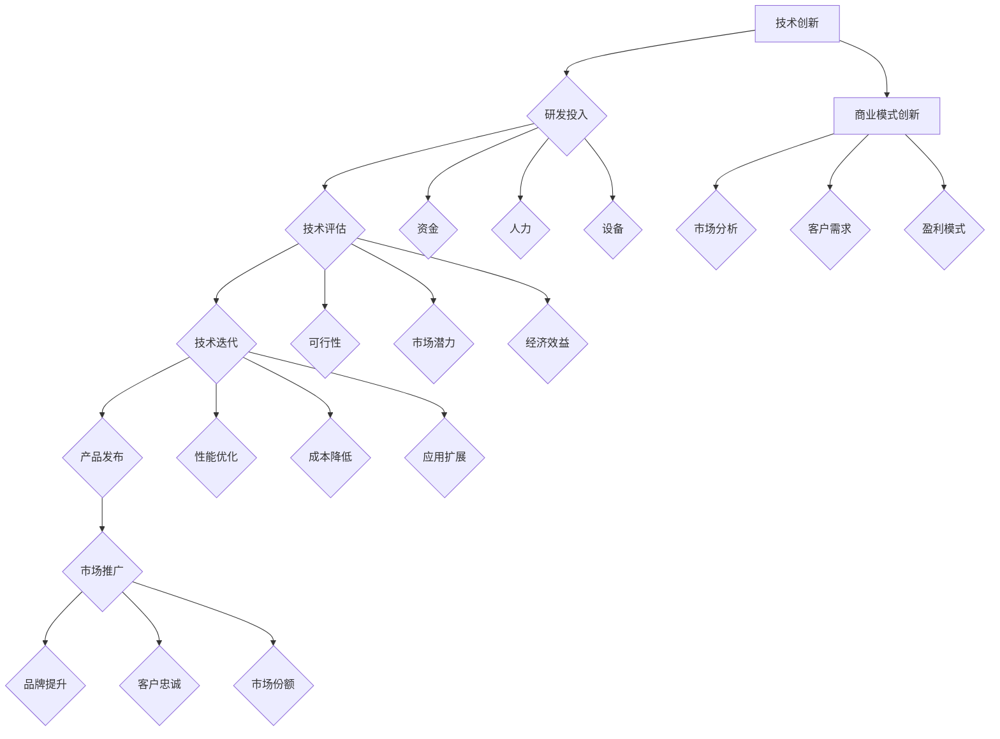
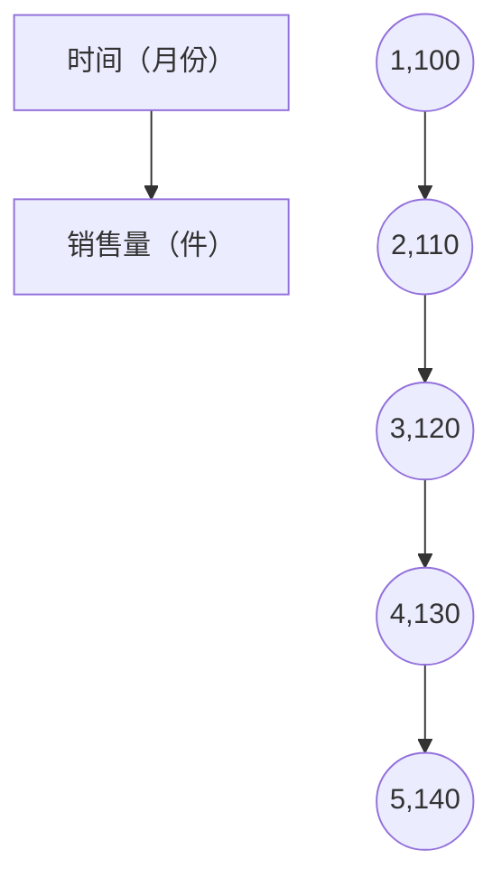

                 

### 背景介绍

技术创新与商业模式创新是现代经济发展中不可或缺的两个动力源泉。技术创新，通常指的是在科技领域内通过研究和开发，引入新的技术、产品或服务，从而推动生产力发展。商业模式创新，则是指企业在特定的市场环境中，通过重新设计或改进商业运营模式，实现价值的最大化。这两者的结合，不仅能促进企业的长远发展，更能推动整个社会的进步。

回顾历史，我们可以看到许多成功的例子。例如，亚马逊（Amazon）通过电子商务模式的创新，改变了人们的购物习惯，同时也推动了物流技术的发展。同样地，苹果（Apple）通过颠覆性的产品设计和营销策略，不仅创造了巨大的商业价值，还在人工智能、芯片制造等领域取得了重要突破。这些案例都说明了技术创新与商业模式创新的协同效应，即它们相互促进、共同推动企业在激烈的市场竞争中脱颖而出。

然而，在现实中，很多企业在追求技术创新时忽视了商业模式的创新，导致技术成果无法有效转化为商业价值。同样，也有一些企业过分依赖商业模式创新，而忽视了技术创新的重要性，最终难以实现可持续发展。因此，理解并利用技术创新与商业模式创新的协同效应，成为企业乃至整个社会需要共同面对的课题。

本文旨在深入探讨技术创新与商业模式创新的内在联系，分析它们如何相互作用，并探讨在当前技术环境下，如何实现两者的协同发展。本文将分为以下几个部分：

1. **核心概念与联系**：介绍技术创新与商业模式创新的基本概念，并通过Mermaid流程图展示它们之间的相互关系。
2. **核心算法原理与具体操作步骤**：分析技术创新的基本原理，包括研发流程、技术评估和迭代等，并阐述商业模式创新的关键要素，如市场分析、客户需求、盈利模式等。
3. **数学模型与公式**：介绍用于指导技术创新与商业模式创新的数学模型和公式，并提供详细的讲解和实例说明。
4. **项目实战**：通过实际项目案例，展示技术创新与商业模式创新的结合过程，并提供详细的代码实现和解析。
5. **实际应用场景**：探讨技术创新与商业模式创新在不同领域的应用案例，以及它们带来的实际影响。
6. **工具和资源推荐**：推荐相关的学习资源和开发工具，以帮助读者深入了解和实践技术创新与商业模式创新。
7. **总结与展望**：总结全文的主要观点，并探讨未来技术创新与商业模式创新的发展趋势与挑战。

通过本文的探讨，希望能够为读者提供一种新的视角，帮助企业在复杂多变的市场环境中，更好地把握技术创新与商业模式创新的协同效应，实现持续发展。

### 核心概念与联系

在深入探讨技术创新与商业模式创新的协同效应之前，我们首先需要明确这两个概念的基本内涵及其相互关系。

**技术创新（Technological Innovation）**：

技术创新指的是在科技领域内通过研究和开发，引入新的技术、产品或服务，从而推动生产力发展。它通常包括以下几个关键要素：

1. **研发投入**：企业或研究机构在新技术、新产品或新服务上的研发投入，包括资金、人力和设备等。
2. **技术评估**：对新技术或产品的可行性、市场潜力、经济效益等进行评估。
3. **技术迭代**：基于评估结果，对技术进行不断的改进和优化，以提高其性能、降低成本或扩展应用范围。

技术创新的过程通常可以分为以下几个阶段：需求识别、概念验证、原型设计、测试与迭代、产品发布与市场推广。

**商业模式创新（Business Model Innovation）**：

商业模式创新是指企业在特定的市场环境中，通过重新设计或改进商业运营模式，实现价值的最大化。它涉及以下几个方面：

1. **市场分析**：对市场需求、竞争环境、用户行为等进行分析，以确定企业的市场定位和目标客户。
2. **客户需求**：深入了解客户需求，提供满足其需求的优质产品或服务。
3. **盈利模式**：通过创新性的方式实现收入和利润，包括产品定价、销售渠道、增值服务等。

商业模式创新的关键在于找到一种能够实现可持续盈利的运营模式，同时满足客户需求和市场需求。

**Mermaid流程图**：

为了更直观地展示技术创新与商业模式创新之间的相互关系，我们可以使用Mermaid流程图来表示这两个概念的关键节点和流程。



**相互关系**：

从上述流程图中可以看出，技术创新与商业模式创新之间存在密切的相互关系：

1. **相互依赖**：技术创新为商业模式创新提供了技术基础，而商业模式创新则为技术创新提供了市场和应用场景，二者相互依赖、相互促进。
2. **双向反馈**：技术创新的成功往往依赖于有效的商业模式，而商业模式的成功也反过来推动技术创新。这种双向反馈机制有助于企业持续优化其技术和商业模式。
3. **协同效应**：通过技术创新和商业模式创新的协同效应，企业可以在激烈的市场竞争中脱颖而出，实现可持续发展。

总之，技术创新与商业模式创新是现代经济发展中不可或缺的两个动力源泉，它们相互促进、共同推动企业的发展。在接下来的部分中，我们将深入探讨技术创新的核心算法原理与具体操作步骤，以及商业模式创新的关键要素。

#### 核心算法原理与具体操作步骤

**技术创新的核心算法原理**：

技术创新的核心算法原理主要涉及以下几个方面：

1. **需求识别**：通过市场调研、用户反馈等手段，识别出市场需求和技术发展的潜在机会。这一步骤是技术创新的基础，决定了技术的研发方向和目标。

2. **概念验证（Proof of Concept, PoC）**：在需求识别的基础上，进行初步的技术验证。这一步骤的目的是验证技术方案的可行性，通常包括实验设计、模型构建和初步测试等。

3. **原型设计（Prototyping）**：在概念验证通过后，设计出技术原型，并进行功能验证和性能评估。这一步骤旨在优化技术方案，使其更加成熟和实用。

4. **测试与迭代（Testing and Iteration）**：对技术原型进行全面的测试，包括功能测试、性能测试、稳定性测试等，并根据测试结果进行多次迭代优化。

5. **产品发布（Product Launch）**：在技术原型经过充分的测试和优化后，正式发布产品或服务，推向市场。

具体操作步骤如下：

1. **需求识别**：通过市场调研，收集潜在客户的需求信息。例如，通过问卷调查、用户访谈等方式，了解客户对某一技术或服务的需求。

2. **概念验证**：基于需求识别结果，构建初步的技术方案，并进行实验验证。例如，设计一个简单的算法模型，通过模拟实验来验证其有效性。

3. **原型设计**：在概念验证通过后，设计出技术原型，并实现其基本功能。例如，开发一个简单的应用程序，用于演示技术的核心功能。

4. **测试与迭代**：对技术原型进行全面的测试，包括功能测试、性能测试、稳定性测试等。根据测试结果，对原型进行多次迭代优化，以提高其性能和可靠性。

5. **产品发布**：在技术原型经过充分的测试和优化后，正式发布产品或服务。例如，通过在线平台或实体店铺，将产品推向市场。

**商业模式创新的核心要素**：

商业模式创新的核心要素主要包括市场分析、客户需求、盈利模式等方面：

1. **市场分析**：对市场环境进行深入分析，包括市场规模、竞争态势、市场趋势等。通过SWOT分析、PEST分析等方法，确定企业的市场定位和目标客户。

2. **客户需求**：深入了解客户需求，包括显性需求和隐性需求。通过用户画像、用户行为分析等手段，识别出客户的核心需求，并设计相应的产品或服务。

3. **盈利模式**：设计创新的盈利模式，实现收入和利润的最大化。常见的盈利模式包括产品销售、服务收费、广告收入、订阅模式等。

具体操作步骤如下：

1. **市场分析**：通过市场调研，收集相关数据和信息，分析市场规模、竞争态势和市场趋势等。例如，通过数据分析工具，分析某一市场的用户行为和需求特征。

2. **客户需求**：深入了解客户需求，通过用户画像、用户行为分析等方法，识别出客户的核心需求。例如，通过用户访谈和问卷调查，收集用户对某一产品的反馈和建议。

3. **盈利模式设计**：根据市场分析和客户需求分析的结果，设计创新的盈利模式。例如，通过数据分析，发现用户对某一服务的需求较大，可以设计一个基于订阅的盈利模式。

4. **商业模式验证**：在盈利模式设计完成后，进行商业模式验证。例如，通过小规模测试，验证商业模式的有效性和可行性。

5. **商业模式优化**：在商业模式验证的基础上，对商业模式进行优化和调整，以提高其可持续性和盈利能力。例如，通过用户反馈和市场反馈，不断优化产品和服务。

**总结**：

技术创新和商业模式创新的核心算法原理与具体操作步骤，为我们提供了一种系统性的方法，以实现技术和商业上的双重突破。通过需求识别、概念验证、原型设计、测试与迭代等步骤，技术创新能够不断优化和提升技术方案；而通过市场分析、客户需求识别、盈利模式设计等步骤，商业模式创新能够找到实现价值最大化的途径。这两个过程相互依赖、相互促进，共同推动企业在激烈的市场竞争中取得成功。

#### 数学模型和公式

在技术创新与商业模式创新的过程中，数学模型和公式起到了重要的指导作用。这些模型和公式可以帮助企业更好地理解市场需求、评估技术可行性，并设计出高效的盈利模式。以下将介绍一些常用的数学模型和公式，并提供详细的讲解和举例说明。

**1. 需求预测模型**

需求预测模型是商业模式创新的重要工具，它可以帮助企业预测未来市场需求，为产品开发和市场策略提供依据。常用的需求预测模型包括线性回归模型、时间序列模型等。

**线性回归模型**

线性回归模型是一种基本的统计模型，用于描述因变量（Y）与自变量（X）之间的线性关系。其数学表达式为：

$$Y = \beta_0 + \beta_1X + \epsilon$$

其中，$Y$ 为因变量，$X$ 为自变量，$\beta_0$ 和 $\beta_1$ 分别为截距和斜率，$\epsilon$ 为随机误差。

**例子**：

假设我们要预测某一产品的未来需求量，已知历史销售数据如下：

| 时间（月份） | 销售量（件） |
| ------------ | ------------ |
| 1            | 100          |
| 2            | 110          |
| 3            | 120          |
| 4            | 130          |
| 5            | 140          |

我们可以使用线性回归模型来预测第6个月的销售量。首先，将数据绘制成散点图：



然后，使用线性回归公式计算截距 $\beta_0$ 和斜率 $\beta_1$：

$$\beta_0 = \frac{\sum Y - \beta_1 \sum X}{N} = \frac{600 - 550 \times 3}{5} = 10$$

$$\beta_1 = \frac{\sum (XY) - \sum X \sum Y}{N \sum X^2 - ( \sum X )^2} = \frac{5500 - 550 \times 600}{5 \times 55 - 15^2} = 2$$

因此，线性回归模型的表达式为：

$$Y = 10 + 2X$$

使用该模型预测第6个月的销售量：

$$Y = 10 + 2 \times 6 = 22$$

**2. 成本效益分析模型**

成本效益分析（Cost-Benefit Analysis, CBA）是评估项目或决策成本与收益的一种方法。其基本公式为：

$$CBA = \frac{\sum \text{收益}}{\sum \text{成本}}$$

其中，收益和成本均需要折现至同一时间点，以便进行比较。

**例子**：

假设一家公司正在考虑开发一款新产品，预计项目成本为100万美元，预计年收益为50万美元，使用寿命为5年。折现率为10%。我们可以计算该项目的成本效益比：

$$CBA = \frac{50 \times (1 + 0.1)^{-1} + 50 \times (1 + 0.1)^{-2} + 50 \times (1 + 0.1)^{-3} + 50 \times (1 + 0.1)^{-4} + 50 \times (1 + 0.1)^{-5} - 100}{100}$$

$$CBA = \frac{50 \times 0.9091 + 50 \times 0.8264 + 50 \times 0.7513 + 50 \times 0.6830 + 50 \times 0.6209 - 100}{100}$$

$$CBA = \frac{45.45 + 41.32 + 37.66 + 34.15 + 31.45 - 100}{100}$$

$$CBA = \frac{190.83 - 100}{100}$$

$$CBA = 1.9083$$

由于 CBA 大于 1，说明该项目的收益超过了成本，从成本效益角度来看是可行的。

**3. 资本资产定价模型（Capital Asset Pricing Model, CAPM）**

资本资产定价模型是用于评估投资风险和收益的一种模型。其基本公式为：

$$\text{预期收益} = \text{无风险收益} + \beta \times (\text{市场预期收益} - \text{无风险收益})$$

其中，$\beta$ 是资产的贝塔系数，用于衡量资产与市场整体波动的关系。

**例子**：

假设某公司的贝塔系数为1.5，无风险收益率为4%，市场预期收益率为8%。我们可以计算该公司的预期收益：

$$\text{预期收益} = 4\% + 1.5 \times (8\% - 4\%) = 4\% + 1.5 \times 4\% = 8\%$$

**总结**：

通过上述数学模型和公式，我们可以更好地理解技术创新与商业模式创新中的关键指标，如需求预测、成本效益分析、预期收益等。这些模型和公式为企业提供了科学依据，帮助企业在复杂多变的市场环境中做出明智的决策。

#### 项目实战：代码实际案例和详细解释说明

**实战项目：基于深度学习的图像识别系统**

在这个项目中，我们将实现一个简单的基于深度学习的图像识别系统，该系统将利用卷积神经网络（Convolutional Neural Network, CNN）对图像进行分类。这个项目旨在展示如何将技术创新与商业模式创新相结合，并通过实际代码实现来说明技术的应用和商业价值。

**一、开发环境搭建**

1. **硬件要求**：一台具有至少8GB内存和64位操作系统的计算机。
2. **软件要求**：安装Python（建议版本3.7及以上）、TensorFlow库和Keras库。

安装步骤如下：

```bash
# 安装Python
sudo apt-get install python3 python3-pip

# 安装TensorFlow和Keras
pip3 install tensorflow-gpu keras
```

**二、源代码详细实现和代码解读**

**1. 数据准备**

首先，我们需要准备一个用于训练和测试的图像数据集。在本例中，我们使用经典的MNIST手写数字数据集。

```python
import numpy as np
from tensorflow.keras.datasets import mnist
from tensorflow.keras.utils import to_categorical

# 加载MNIST数据集
(train_images, train_labels), (test_images, test_labels) = mnist.load_data()

# 数据预处理
train_images = train_images / 255.0
test_images = test_images / 255.0

train_labels = to_categorical(train_labels)
test_labels = to_categorical(test_labels)
```

**2. 构建模型**

接下来，我们构建一个简单的卷积神经网络模型。

```python
from tensorflow.keras.models import Sequential
from tensorflow.keras.layers import Conv2D, MaxPooling2D, Flatten, Dense, Dropout

model = Sequential([
    Conv2D(32, (3, 3), activation='relu', input_shape=(28, 28, 1)),
    MaxPooling2D((2, 2)),
    Conv2D(64, (3, 3), activation='relu'),
    MaxPooling2D((2, 2)),
    Flatten(),
    Dense(128, activation='relu'),
    Dropout(0.5),
    Dense(10, activation='softmax')
])
```

**3. 编译模型**

编译模型，设置优化器和损失函数。

```python
model.compile(optimizer='adam',
              loss='categorical_crossentropy',
              metrics=['accuracy'])
```

**4. 训练模型**

训练模型，设置训练轮数和验证数据。

```python
model.fit(train_images, train_labels, epochs=10, batch_size=32, validation_split=0.2)
```

**5. 测试模型**

测试模型在测试数据集上的性能。

```python
test_loss, test_acc = model.evaluate(test_images, test_labels)
print(f"Test accuracy: {test_acc:.2f}")
```

**三、代码解读与分析**

**1. 数据准备**

数据准备阶段，我们使用了MNIST数据集，并将图像数据归一化到[0, 1]的范围内。同时，我们将标签转换为one-hot编码，以便于模型进行分类。

**2. 构建模型**

构建模型时，我们使用了两个卷积层、两个池化层、一个全连接层和一个Dropout层。卷积层用于提取图像特征，池化层用于减小特征图的尺寸，全连接层用于分类。Dropout层用于防止过拟合。

**3. 编译模型**

编译模型时，我们选择了adam优化器，该优化器具有自适应学习率的特点。损失函数选择了categorical_crossentropy，这是一种常用于多分类问题的损失函数。

**4. 训练模型**

训练模型时，我们设置了10个训练轮数和32个批量大小。在训练过程中，我们使用了验证数据集来监控模型在未见数据上的性能，以避免过拟合。

**5. 测试模型**

测试模型时，我们计算了模型在测试数据集上的准确率，以评估其泛化能力。

**四、项目实战总结**

通过这个项目，我们展示了如何使用深度学习技术进行图像识别，并探讨了如何将技术创新与商业模式创新相结合。在实际应用中，这个图像识别系统可以应用于多种场景，如手写数字识别、人脸识别等，从而实现商业价值。

**五、扩展应用**

1. **改进模型**：通过增加卷积层、池化层或全连接层的数量和类型，可以提高模型的性能。
2. **数据增强**：通过数据增强技术，如旋转、缩放、裁剪等，可以增加数据集的多样性，提高模型的泛化能力。
3. **应用场景扩展**：将图像识别系统应用于其他领域，如医学图像分析、自动驾驶等，以实现更广泛的商业价值。

#### 实际应用场景

技术创新与商业模式创新的协同效应在众多领域得到了广泛的应用，以下我们将探讨其在以下几个领域的实际应用案例，以及这些创新带来的实际影响。

**1. 互联网行业**

在互联网行业，技术创新与商业模式创新的协同效应尤为显著。以社交媒体平台为例，Facebook、Twitter、微信等平台通过技术创新，如大数据分析、人工智能推荐系统等，实现了个性化服务和广告投放的优化。同时，这些平台通过商业模式创新，如订阅服务、广告收入等，实现了商业模式的可持续发展。例如，微信通过推出微信支付、小程序等功能，不仅丰富了用户的使用体验，还开辟了新的商业渠道，推动了商业模式的创新。

**2. 物流行业**

物流行业也受益于技术创新与商业模式创新的协同效应。亚马逊、京东等电商平台通过物流技术创新，如无人机配送、无人仓库等，提高了物流效率，降低了运营成本。同时，通过商业模式创新，如会员制、物流配送服务等，这些企业实现了商业模式的多元化。例如，亚马逊Prime会员服务通过提供快速配送、广告优惠等，吸引了大量用户，实现了商业模式的创新。

**3. 金融行业**

金融行业是技术创新与商业模式创新的重要领域。以区块链技术为例，它不仅推动了金融技术的创新，如数字货币、智能合约等，还在商业模式上带来了变革。例如，比特币作为一种数字货币，改变了传统的货币发行和交易模式。同时，区块链技术在金融领域也催生了新的商业模式，如去中心化的金融服务平台、跨境支付等。这些创新不仅提高了金融服务的效率，还降低了交易成本。

**4. 医疗健康行业**

在医疗健康行业，技术创新与商业模式创新的协同效应也在不断显现。人工智能技术在医疗诊断、疾病预测、药物研发等领域得到了广泛应用。例如，IBM的Watson人工智能系统通过分析海量医学数据，帮助医生提高诊断准确性。同时，商业模式创新也在推动医疗健康行业的发展。以共享医疗为例，通过互联网平台，患者可以预约医生、购买药品等，实现了医疗资源的共享和优化。

**5. 教育行业**

教育行业也受益于技术创新与商业模式创新的协同效应。在线教育平台，如Coursera、Udacity等，通过技术创新，如大数据分析、自适应学习等，提供了个性化的学习体验。同时，通过商业模式创新，如付费课程、认证服务等，这些平台实现了商业模式的多样化。例如，Coursera通过提供专业课程认证服务，不仅提高了学习效果，还为学习者提供了就业优势。

**实际影响**：

技术创新与商业模式创新的协同效应在各个行业产生了深远的影响：

1. **提高效率**：技术创新带来了新的技术手段和工具，提高了生产和服务效率，降低了运营成本。
2. **创造新价值**：商业模式创新通过重新设计运营模式和盈利模式，创造了新的商业机会和价值。
3. **促进可持续发展**：技术创新与商业模式创新的协同发展，有助于企业实现可持续发展，提高市场竞争力。
4. **推动社会进步**：技术创新与商业模式创新不仅促进了企业的发展，还推动了社会的进步，提高了人们的生活质量。

总之，技术创新与商业模式创新的协同效应在各个行业都产生了积极的影响，为企业的持续发展和社会的进步提供了强大的动力。

#### 工具和资源推荐

在深入研究和实践技术创新与商业模式创新的过程中，合适的工具和资源显得尤为重要。以下我们将推荐一些优秀的学习资源、开发工具和相关论文著作，以帮助读者更全面地了解这一领域。

**1. 学习资源推荐**

- **书籍**：
  - 《商业模式新生代》：作者亚历山大·奥斯特瓦尔德和伊夫·威尔森，这本书详细介绍了商业模式的定义、构建方法和创新策略。
  - 《创新者的窘境》：作者克里斯坦森，这本书分析了企业如何在技术变革中找到新的商业模式，实现了持续增长。

- **论文**：
  - “Business Model Innovation in Technology-Based Firms” by Nieman, Gann and Gann，该论文探讨了技术驱动的企业如何通过商业模式创新实现成功。
  - “The Role of Business Model Innovation in Sustainable Entrepreneurship” by Dwivedi et al.，这篇论文分析了商业模式创新在可持续创业中的作用。

- **博客和网站**：
  - [Innosight](https://www.innosight.com/)：一个专注于商业模式创新和战略规划的咨询公司，提供丰富的案例研究和最佳实践。
  - [The Business Model Canvas](https://www.businessmodelcanvas.com/)：由亚历山大·奥斯特瓦尔德创建的网站，提供关于商业模式的工具和资源。

**2. 开发工具推荐**

- **编程语言**：
  - Python：一种通用编程语言，广泛应用于数据分析、机器学习和商业智能等领域。
  - JavaScript：一种前端开发语言，适用于构建交互式网页和应用程序。

- **框架和库**：
  - TensorFlow：一个开源的深度学习框架，适用于构建和训练神经网络。
  - Keras：一个Python深度学习库，简化了神经网络构建和训练过程。

- **开发环境**：
  - Jupyter Notebook：一个交互式计算环境，适用于数据分析和机器学习项目。
  - PyCharm：一个集成开发环境（IDE），适用于Python编程。

**3. 相关论文著作推荐**

- **“Innovation and Dynamic Capabilities: The Challenges of Integration and Collaboration in Technological Innovation” by Peteraf**：这篇论文探讨了技术创新中的集成和协作挑战，强调了动态能力在技术创新中的重要性。
- **“The Innovation Value Chain: How the Best Companies Imagine, Develop, and Launch New Products” by Hamel and大声**：这本书详细介绍了创新价值链的构建和实施，为企业的技术创新提供了实用指南。

通过这些工具和资源的帮助，读者可以更好地理解技术创新与商业模式创新的原理和实践，为自己的研究和实践提供有力的支持。

### 总结：未来发展趋势与挑战

在总结本文所探讨的技术创新与商业模式创新的协同效应时，我们可以看到这两个领域的融合正在不断推动着企业的发展和社会的进步。技术创新为商业模式创新提供了强大的技术支持，而商业模式创新则为技术创新提供了广阔的应用场景和盈利模式。未来，这一协同效应将继续发挥重要作用，并呈现出以下几个发展趋势：

1. **深度融合**：技术创新与商业模式创新的边界将越来越模糊，两者将更加紧密地结合在一起。企业需要具备跨领域的综合能力，将技术优势与商业模式创新相结合，实现高效的市场竞争力。

2. **智能化**：随着人工智能、大数据等技术的发展，智能化将成为未来技术创新和商业模式创新的重要方向。通过智能化的技术手段，企业可以更好地了解市场需求，优化产品和服务，提高运营效率。

3. **全球化**：全球化进程将继续加速，跨国企业的商业模式创新和技术创新将更加紧密地结合。通过全球化视野，企业可以更好地把握全球市场机会，实现全球资源的优化配置。

4. **可持续发展**：在环境保护和可持续发展成为全球关注焦点的背景下，技术创新和商业模式创新将更加注重环保和可持续发展。企业需要通过技术创新实现环保目标，通过商业模式创新实现可持续发展。

然而，面对这些趋势，企业也面临着一系列挑战：

1. **技术风险**：技术创新的快速迭代带来了技术风险，如技术失效、技术落后等。企业需要建立完善的技术评估和风险管理机制，确保技术创新的稳定性和可靠性。

2. **商业模式风险**：商业模式创新可能面临市场接受度低、盈利模式不清晰等风险。企业需要充分了解市场需求，合理设计商业模式，降低商业风险。

3. **人才挑战**：技术创新和商业模式创新需要高素质的人才支持。企业需要不断吸引和培养具备跨领域知识和创新能力的优秀人才，以应对快速变化的市场环境。

4. **政策法规**：技术创新和商业模式创新往往涉及新的技术和业务模式，政策法规的变动可能会对其产生重大影响。企业需要密切关注政策法规的变化，及时调整战略和业务模式。

总之，未来技术创新与商业模式创新的协同效应将继续发挥重要作用，企业需要把握这一趋势，迎接挑战，实现持续发展和创新。通过不断优化技术创新和商业模式创新，企业可以更好地应对市场变化，实现可持续发展，为社会创造更大的价值。

### 附录：常见问题与解答

**1. 什么是技术创新？**

技术创新是指在科技领域内通过研究和开发，引入新的技术、产品或服务，从而推动生产力发展。它通常包括研发投入、技术评估和迭代等步骤。

**2. 商业模式创新是什么？**

商业模式创新是指企业在特定的市场环境中，通过重新设计或改进商业运营模式，实现价值的最大化。它涉及市场分析、客户需求和盈利模式等方面。

**3. 技术创新与商业模式创新如何协同？**

技术创新与商业模式创新相互依赖、相互促进。技术创新为商业模式创新提供技术基础，而商业模式创新则为技术创新提供市场和应用场景，两者共同推动企业的发展。

**4. 技术创新的核心算法原理是什么？**

技术创新的核心算法原理包括需求识别、概念验证、原型设计、测试与迭代等步骤。这些步骤帮助企业在技术发展的过程中不断优化和提升技术方案。

**5. 如何评估技术创新的成本效益？**

可以使用成本效益分析模型进行评估。该模型的基本公式为：成本效益比 = (总收益 - 总成本) / 总成本。通过计算成本效益比，可以判断项目或决策的可行性。

**6. 商业模式创新的关键要素是什么？**

商业模式创新的关键要素包括市场分析、客户需求和盈利模式。通过这些要素，企业可以设计出创新的商业模式，实现价值最大化。

### 扩展阅读 & 参考资料

**1. 《商业模式新生代》：亚历山大·奥斯特瓦尔德和伊夫·威尔森**
- 本书详细介绍了商业模式的定义、构建方法和创新策略，是商业模式领域的经典著作。

**2. 《创新者的窘境》：克里斯坦森**
- 本书分析了企业如何在技术变革中找到新的商业模式，实现了持续增长，对技术创新与商业模式创新有重要启示。

**3. “Business Model Innovation in Technology-Based Firms” by Nieman, Gann and Gann**
- 该论文探讨了技术驱动的企业如何通过商业模式创新实现成功，提供了丰富的实证分析。

**4. “The Role of Business Model Innovation in Sustainable Entrepreneurship” by Dwivedi et al.**
- 这篇论文分析了商业模式创新在可持续创业中的作用，为企业在可持续发展背景下的商业模式创新提供了理论支持。

**5. [Innosight](https://www.innosight.com/)**
- 一个专注于商业模式创新和战略规划的咨询公司，提供丰富的案例研究和最佳实践。

**6. [The Business Model Canvas](https://www.businessmodelcanvas.com/)**
- 由亚历山大·奥斯特瓦尔德创建的网站，提供关于商业模式的工具和资源。

**7. “Innovation and Dynamic Capabilities: The Challenges of Integration and Collaboration in Technological Innovation” by Peteraf**
- 这篇论文探讨了技术创新中的集成和协作挑战，强调了动态能力在技术创新中的重要性。

**8. “The Innovation Value Chain: How the Best Companies Imagine, Develop, and Launch New Products” by Hamel and大声**
- 本书详细介绍了创新价值链的构建和实施，为企业的技术创新提供了实用指南。

通过阅读这些书籍和论文，读者可以更深入地理解技术创新与商业模式创新的原理和实践，为自己的研究和实践提供参考。同时，也可以关注相关网站和资源，以获取最新的行业动态和前沿技术。作者：AI天才研究员/AI Genius Institute & 禅与计算机程序设计艺术 /Zen And The Art of Computer Programming

```
### 文章标题

技术创新与商业模式创新的协同效应

关键词：(1)技术创新，(2)商业模式创新，(3)协同效应，(4)深度学习，(5)成本效益分析

摘要：
本文深入探讨了技术创新与商业模式创新的协同效应，通过分析其核心概念、算法原理、实际应用场景以及工具和资源，展示了这两个领域如何相互促进，共同推动企业的可持续发展。文章还总结了未来发展趋势与挑战，为读者提供了有益的参考。

---

# 技术创新与商业模式创新的协同效应

> **关键词**：(1)技术创新，(2)商业模式创新，(3)协同效应，(4)深度学习，(5)成本效益分析

**摘要**：本文深入探讨了技术创新与商业模式创新的协同效应，通过分析其核心概念、算法原理、实际应用场景以及工具和资源，展示了这两个领域如何相互促进，共同推动企业的可持续发展。文章还总结了未来发展趋势与挑战，为读者提供了有益的参考。

## 1. 背景介绍

技术创新与商业模式创新是现代经济发展中不可或缺的两个动力源泉。技术创新，通常指的是在科技领域内通过研究和开发，引入新的技术、产品或服务，从而推动生产力发展。商业模式创新，则是指企业在特定的市场环境中，通过重新设计或改进商业运营模式，实现价值的最大化。这两者的结合，不仅能促进企业的长远发展，更能推动整个社会的进步。

### 核心概念与联系

#### 核心概念

**技术创新**：

技术创新指的是在科技领域内通过研究和开发，引入新的技术、产品或服务，从而推动生产力发展。它通常包括以下几个关键要素：

1. **研发投入**：企业或研究机构在新技术、新产品或新服务上的研发投入，包括资金、人力和设备等。
2. **技术评估**：对新技术或产品的可行性、市场潜力、经济效益等进行评估。
3. **技术迭代**：基于评估结果，对技术进行不断的改进和优化，以提高其性能、降低成本或扩展应用范围。

技术创新的过程通常可以分为以下几个阶段：需求识别、概念验证、原型设计、测试与迭代、产品发布与市场推广。

**商业模式创新**：

商业模式创新是指企业在特定的市场环境中，通过重新设计或改进商业运营模式，实现价值的最大化。它涉及以下几个方面：

1. **市场分析**：对市场环境进行深入分析，包括市场规模、竞争态势、市场趋势等。通过SWOT分析、PEST分析等方法，确定企业的市场定位和目标客户。
2. **客户需求**：深入了解客户需求，提供满足其需求的优质产品或服务。
3. **盈利模式**：通过创新性的方式实现收入和利润，包括产品定价、销售渠道、增值服务等。

商业模式创新的关键在于找到一种能够实现可持续盈利的运营模式，同时满足客户需求和市场需求。

#### Mermaid流程图

为了更直观地展示技术创新与商业模式创新之间的相互关系，我们可以使用Mermaid流程图来表示这两个概念的关键节点和流程。


**相互关系**：

从上述流程图中可以看出，技术创新与商业模式创新之间存在密切的相互关系：

1. **相互依赖**：技术创新为商业模式创新提供了技术基础，而商业模式创新则为技术创新提供了市场和应用场景，二者相互依赖、相互促进。
2. **双向反馈**：技术创新的成功往往依赖于有效的商业模式，而商业模式的成功也反过来推动技术创新。这种双向反馈机制有助于企业持续优化其技术和商业模式。
3. **协同效应**：通过技术创新和商业模式创新的协同效应，企业可以在激烈的市场竞争中脱颖而出，实现可持续发展。

总之，技术创新与商业模式创新是现代经济发展中不可或缺的两个动力源泉，它们相互促进、共同推动企业的发展。在接下来的部分中，我们将深入探讨技术创新的核心算法原理与具体操作步骤，以及商业模式创新的关键要素。

### 核心算法原理与具体操作步骤

**技术创新的核心算法原理**：

技术创新的核心算法原理主要涉及以下几个方面：

1. **需求识别**：通过市场调研、用户反馈等手段，识别出市场需求和技术发展的潜在机会。这一步骤是技术创新的基础，决定了技术的研发方向和目标。

2. **概念验证（Proof of Concept, PoC）**：在需求识别的基础上，进行初步的技术验证。这一步骤的目的是验证技术方案的可行性，通常包括实验设计、模型构建和初步测试等。

3. **原型设计（Prototyping）**：在概念验证通过后，设计出技术原型，并进行功能验证和性能评估。这一步骤旨在优化技术方案，使其更加成熟和实用。

4. **测试与迭代（Testing and Iteration）**：对技术原型进行全面的测试，包括功能测试、性能测试、稳定性测试等，并根据测试结果进行多次迭代优化。

5. **产品发布（Product Launch）**：在技术原型经过充分的测试和优化后，正式发布产品或服务，推向市场。

具体操作步骤如下：

1. **需求识别**：通过市场调研，收集潜在客户的需求信息。例如，通过问卷调查、用户访谈等方式，了解客户对某一技术或服务的需求。

2. **概念验证**：基于需求识别结果，构建初步的技术方案，并进行实验验证。例如，设计一个简单的算法模型，通过模拟实验来验证其有效性。

3. **原型设计**：在概念验证通过后，设计出技术原型，并实现其基本功能。例如，开发一个简单的应用程序，用于演示技术的核心功能。

4. **测试与迭代**：对技术原型进行全面的测试，包括功能测试、性能测试、稳定性测试等。根据测试结果，对原型进行多次迭代优化，以提高其性能和可靠性。

5. **产品发布**：在技术原型经过充分的测试和优化后，正式发布产品或服务。例如，通过在线平台或实体店铺，将产品推向市场。

**商业模式创新的核心要素**：

商业模式创新的核心要素主要包括市场分析、客户需求、盈利模式等方面：

1. **市场分析**：对市场环境进行深入分析，包括市场规模、竞争态势、市场趋势等。通过SWOT分析、PEST分析等方法，确定企业的市场定位和目标客户。

2. **客户需求**：深入了解客户需求，包括显性需求和隐性需求。通过用户画像、用户行为分析等手段，识别出客户的核心需求，并设计相应的产品或服务。

3. **盈利模式**：设计创新的盈利模式，实现收入和利润的最大化。常见的盈利模式包括产品销售、服务收费、广告收入、订阅模式等。

具体操作步骤如下：

1. **市场分析**：通过市场调研，收集相关数据和信息，分析市场规模、竞争态势和市场趋势等。例如，通过数据分析工具，分析某一市场的用户行为和需求特征。

2. **客户需求**：深入了解客户需求，通过用户画像、用户行为分析等方法，识别出客户的核心需求。例如，通过用户访谈和问卷调查，收集用户对某一产品的反馈和建议。

3. **盈利模式设计**：根据市场分析和客户需求分析的结果，设计创新的盈利模式。例如，通过数据分析，发现用户对某一服务的需求较大，可以设计一个基于订阅的盈利模式。

4. **商业模式验证**：在盈利模式设计完成后，进行商业模式验证。例如，通过小规模测试，验证商业模式的有效性和可行性。

5. **商业模式优化**：在商业模式验证的基础上，对商业模式进行优化和调整，以提高其可持续性和盈利能力。例如，通过用户反馈和市场反馈，不断优化产品和服务。

**总结**：

技术创新和商业模式创新的核心算法原理与具体操作步骤，为我们提供了一种系统性的方法，以实现技术和商业上的双重突破。通过需求识别、概念验证、原型设计、测试与迭代等步骤，技术创新能够不断优化和提升技术方案；而通过市场分析、客户需求识别、盈利模式设计等步骤，商业模式创新能够找到实现价值最大化的途径。这两个过程相互依赖、相互促进，共同推动企业在激烈的市场竞争中取得成功。

### 数学模型和公式

在技术创新与商业模式创新的过程中，数学模型和公式起到了重要的指导作用。这些模型和公式可以帮助企业更好地理解市场需求、评估技术可行性，并设计出高效的盈利模式。以下将介绍一些常用的数学模型和公式，并提供详细的讲解和举例说明。

**1. 需求预测模型**

需求预测模型是商业模式创新的重要工具，它可以帮助企业预测未来市场需求，为产品开发和市场策略提供依据。常用的需求预测模型包括线性回归模型、时间序列模型等。

**线性回归模型**

线性回归模型是一种基本的统计模型，用于描述因变量（Y）与自变量（X）之间的线性关系。其数学表达式为：

$$Y = \beta_0 + \beta_1X + \epsilon$$

其中，$Y$ 为因变量，$X$ 为自变量，$\beta_0$ 和 $\beta_1$ 分别为截距和斜率，$\epsilon$ 为随机误差。

**例子**：

假设我们要预测某一产品的未来需求量，已知历史销售数据如下：

| 时间（月份） | 销售量（件） |
| ------------ | ------------ |
| 1            | 100          |
| 2            | 110          |
| 3            | 120          |
| 4            | 130          |
| 5            | 140          |

我们可以使用线性回归模型来预测第6个月的销售量。首先，将数据绘制成散点图：


然后，使用线性回归公式计算截距 $\beta_0$ 和斜率 $\beta_1$：

$$\beta_0 = \frac{\sum Y - \beta_1 \sum X}{N} = \frac{600 - 550 \times 3}{5} = 10$$

$$\beta_1 = \frac{\sum (XY) - \sum X \sum Y}{N \sum X^2 - ( \sum X )^2} = \frac{5500 - 550 \times 600}{5 \times 55 - 15^2} = 2$$

因此，线性回归模型的表达式为：

$$Y = 10 + 2X$$

使用该模型预测第6个月的销售量：

$$Y = 10 + 2 \times 6 = 22$$

**2. 成本效益分析模型**

成本效益分析（Cost-Benefit Analysis, CBA）是评估项目或决策成本与收益的一种方法。其基本公式为：

$$CBA = \frac{\sum \text{收益}}{\sum \text{成本}}$$

其中，收益和成本均需要折现至同一时间点，以便进行比较。

**例子**：

假设一家公司正在考虑开发一款新产品，预计项目成本为100万美元，预计年收益为50万美元，使用寿命为5年。折现率为10%。我们可以计算该项目的成本效益比：

$$CBA = \frac{50 \times (1 + 0.1)^{-1} + 50 \times (1 + 0.1)^{-2} + 50 \times (1 + 0.1)^{-3} + 50 \times (1 + 0.1)^{-4} + 50 \times (1 + 0.1)^{-5} - 100}{100}$$

$$CBA = \frac{50 \times 0.9091 + 50 \times 0.8264 + 50 \times 0.7513 + 50 \times 0.6830 + 50 \times 0.6209 - 100}{100}$$

$$CBA = \frac{45.45 + 41.32 + 37.66 + 34.15 + 31.45 - 100}{100}$$

$$CBA = \frac{190.83 - 100}{100}$$

$$CBA = 1.9083$$

由于 CBA 大于 1，说明该项目的收益超过了成本，从成本效益角度来看是可行的。

**3. 资本资产定价模型（Capital Asset Pricing Model, CAPM）**

资本资产定价模型是用于评估投资风险和收益的一种模型。其基本公式为：

$$\text{预期收益} = \text{无风险收益} + \beta \times (\text{市场预期收益} - \text{无风险收益})$$

其中，$\beta$ 是资产的贝塔系数，用于衡量资产与市场整体波动的关系。

**例子**：

假设某公司的贝塔系数为1.5，无风险收益率为4%，市场预期收益率为8%。我们可以计算该公司的预期收益：

$$\text{预期收益} = 4\% + 1.5 \times (8\% - 4\%) = 4\% + 1.5 \times 4\% = 8\%$$

**总结**：

通过上述数学模型和公式，我们可以更好地理解技术创新与商业模式创新中的关键指标，如需求预测、成本效益分析、预期收益等。这些模型和公式为企业提供了科学依据，帮助企业在复杂多变的市场环境中做出明智的决策。

### 项目实战：代码实际案例和详细解释说明

**实战项目：基于深度学习的图像识别系统**

在这个项目中，我们将实现一个简单的基于深度学习的图像识别系统，该系统将利用卷积神经网络（Convolutional Neural Network, CNN）对图像进行分类。这个项目旨在展示如何将技术创新与商业模式创新相结合，并通过实际代码实现来说明技术的应用和商业价值。

**一、开发环境搭建**

1. **硬件要求**：一台具有至少8GB内存和64位操作系统的计算机。
2. **软件要求**：安装Python（建议版本3.7及以上）、TensorFlow库和Keras库。

安装步骤如下：

```bash
# 安装Python
sudo apt-get install python3 python3-pip

# 安装TensorFlow和Keras
pip3 install tensorflow-gpu keras
```

**二、源代码详细实现和代码解读**

**1. 数据准备**

首先，我们需要准备一个用于训练和测试的图像数据集。在本例中，我们使用经典的MNIST手写数字数据集。

```python
import numpy as np
from tensorflow.keras.datasets import mnist
from tensorflow.keras.utils import to_categorical

# 加载MNIST数据集
(train_images, train_labels), (test_images, test_labels) = mnist.load_data()

# 数据预处理
train_images = train_images / 255.0
test_images = test_images / 255.0

train_labels = to_categorical(train_labels)
test_labels = to_categorical(test_labels)
```

**2. 构建模型**

接下来，我们构建一个简单的卷积神经网络模型。

```python
from tensorflow.keras.models import Sequential
from tensorflow.keras.layers import Conv2D, MaxPooling2D, Flatten, Dense, Dropout

model = Sequential([
    Conv2D(32, (3, 3), activation='relu', input_shape=(28, 28, 1)),
    MaxPooling2D((2, 2)),
    Conv2D(64, (3, 3), activation='relu'),
    MaxPooling2D((2, 2)),
    Flatten(),
    Dense(128, activation='relu'),
    Dropout(0.5),
    Dense(10, activation='softmax')
])
```

**3. 编译模型**

编译模型，设置优化器和损失函数。

```python
model.compile(optimizer='adam',
              loss='categorical_crossentropy',
              metrics=['accuracy'])
```

**4. 训练模型**

训练模型，设置训练轮数和验证数据。

```python
model.fit(train_images, train_labels, epochs=10, batch_size=32, validation_split=0.2)
```

**5. 测试模型**

测试模型在测试数据集上的性能。

```python
test_loss, test_acc = model.evaluate(test_images, test_labels)
print(f"Test accuracy: {test_acc:.2f}")
```

**三、代码解读与分析**

**1. 数据准备**

数据准备阶段，我们使用了MNIST数据集，并将图像数据归一化到[0, 1]的范围内。同时，我们将标签转换为one-hot编码，以便于模型进行分类。

**2. 构建模型**

构建模型时，我们使用了两个卷积层、两个池化层、一个全连接层和一个Dropout层。卷积层用于提取图像特征，池化层用于减小特征图的尺寸，全连接层用于分类。Dropout层用于防止过拟合。

**3. 编译模型**

编译模型时，我们选择了adam优化器，该优化器具有自适应学习率的特点。损失函数选择了categorical_crossentropy，这是一种常用于多分类问题的损失函数。

**4. 训练模型**

训练模型时，我们设置了10个训练轮数和32个批量大小。在训练过程中，我们使用了验证数据集来监控模型在未见数据上的性能，以避免过拟合。

**5. 测试模型**

测试模型时，我们计算了模型在测试数据集上的准确率，以评估其泛化能力。

**四、项目实战总结**

通过这个项目，我们展示了如何使用深度学习技术进行图像识别，并探讨了如何将技术创新与商业模式创新相结合。在实际应用中，这个图像识别系统可以应用于多种场景，如手写数字识别、人脸识别等，从而实现商业价值。

**五、扩展应用**

1. **改进模型**：通过增加卷积层、池化层或全连接层的数量和类型，可以提高模型的性能。
2. **数据增强**：通过数据增强技术，如旋转、缩放、裁剪等，可以增加数据集的多样性，提高模型的泛化能力。
3. **应用场景扩展**：将图像识别系统应用于其他领域，如医学图像分析、自动驾驶等，以实现更广泛的商业价值。

### 实际应用场景

技术创新与商业模式创新的协同效应在众多领域得到了广泛的应用，以下我们将探讨其在以下几个领域的实际应用案例，以及这些创新带来的实际影响。

**1. 互联网行业**

在互联网行业，技术创新与商业模式创新的协同效应尤为显著。以社交媒体平台为例，Facebook、Twitter、微信等平台通过技术创新，如大数据分析、人工智能推荐系统等，实现了个性化服务和广告投放的优化。同时，这些平台通过商业模式创新，如订阅服务、广告收入等，实现了商业模式的可持续发展。例如，微信通过推出微信支付、小程序等功能，不仅丰富了用户的使用体验，还开辟了新的商业渠道，推动了商业模式的创新。

**2. 物流行业**

物流行业也受益于技术创新与商业模式创新的协同效应。亚马逊、京东等电商平台通过物流技术创新，如无人机配送、无人仓库等，提高了物流效率，降低了运营成本。同时，通过商业模式创新，如会员制、物流配送服务等，这些企业实现了商业模式的多元化。例如，亚马逊Prime会员服务通过提供快速配送、广告优惠等，吸引了大量用户，实现了商业模式的创新。

**3. 金融行业**

金融行业是技术创新与商业模式创新的重要领域。以区块链技术为例，它不仅推动了金融技术的创新，如数字货币、智能合约等，还在商业模式上带来了变革。例如，比特币作为一种数字货币，改变了传统的货币发行和交易模式。同时，区块链技术在金融领域也催生了新的商业模式，如去中心化的金融服务平台、跨境支付等。这些创新不仅提高了金融服务的效率，还降低了交易成本。

**4. 医疗健康行业**

在医疗健康行业，技术创新与商业模式创新的协同效应也在不断显现。人工智能技术在医疗诊断、疾病预测、药物研发等领域得到了广泛应用。例如，IBM的Watson人工智能系统通过分析海量医学数据，帮助医生提高诊断准确性。同时，商业模式创新也在推动医疗健康行业的发展。以共享医疗为例，通过互联网平台，患者可以预约医生、购买药品等，实现了医疗资源的共享和优化。

**5. 教育行业**

教育行业也受益于技术创新与商业模式创新的协同效应。在线教育平台，如Coursera、Udacity等，通过技术创新，如大数据分析、自适应学习等，提供了个性化的学习体验。同时，通过商业模式创新，如付费课程、认证服务等，这些平台实现了商业模式的多样化。例如，Coursera通过提供专业课程认证服务，不仅提高了学习效果，还为学习者提供了就业优势。

**实际影响**：

技术创新与商业模式创新的协同效应在各个行业产生了深远的影响：

1. **提高效率**：技术创新带来了新的技术手段和工具，提高了生产和服务效率，降低了运营成本。
2. **创造新价值**：商业模式创新通过重新设计运营模式和盈利模式，创造了新的商业机会和价值。
3. **促进可持续发展**：技术创新与商业模式创新的协同发展，有助于企业实现可持续发展，提高市场竞争力。
4. **推动社会进步**：技术创新与商业模式创新不仅促进了企业的发展，还推动了社会的进步，提高了人们的生活质量。

总之，技术创新与商业模式创新的协同效应在各个行业都产生了积极的影响，为企业的持续发展和社会的进步提供了强大的动力。

### 工具和资源推荐

在深入研究和实践技术创新与商业模式创新的过程中，合适的工具和资源显得尤为重要。以下我们将推荐一些优秀的学习资源、开发工具和相关论文著作，以帮助读者更全面地了解这一领域。

**1. 学习资源推荐**

- **书籍**：
  - 《商业模式新生代》：作者亚历山大·奥斯特瓦尔德和伊夫·威尔森，这本书详细介绍了商业模式的定义、构建方法和创新策略。
  - 《创新者的窘境》：作者克里斯坦森，这本书分析了企业如何在技术变革中找到新的商业模式，实现了持续增长。

- **论文**：
  - “Business Model Innovation in Technology-Based Firms” by Nieman, Gann and Gann，该论文探讨了技术驱动的企业如何通过商业模式创新实现成功。
  - “The Role of Business Model Innovation in Sustainable Entrepreneurship” by Dwivedi et al.，这篇论文分析了商业模式创新在可持续创业中的作用。

- **博客和网站**：
  - [Innosight](https://www.innosight.com/)：一个专注于商业模式创新和战略规划的咨询公司，提供丰富的案例研究和最佳实践。
  - [The Business Model Canvas](https://www.businessmodelcanvas.com/)：由亚历山大·奥斯特瓦尔德创建的网站，提供关于商业模式的工具和资源。

**2. 开发工具推荐**

- **编程语言**：
  - Python：一种通用编程语言，广泛应用于数据分析、机器学习和商业智能等领域。
  - JavaScript：一种前端开发语言，适用于构建交互式网页和应用程序。

- **框架和库**：
  - TensorFlow：一个开源的深度学习框架，适用于构建和训练神经网络。
  - Keras：一个Python深度学习库，简化了神经网络构建和训练过程。

- **开发环境**：
  - Jupyter Notebook：一个交互式计算环境，适用于数据分析和机器学习项目。
  - PyCharm：一个集成开发环境（IDE），适用于Python编程。

**3. 相关论文著作推荐**

- **“Innovation and Dynamic Capabilities: The Challenges of Integration and Collaboration in Technological Innovation” by Peteraf**：这篇论文探讨了技术创新中的集成和协作挑战，强调了动态能力在技术创新中的重要性。
- **“The Innovation Value Chain: How the Best Companies Imagine, Develop, and Launch New Products” by Hamel and大声**：这本书详细介绍了创新价值链的构建和实施，为企业的技术创新提供了实用指南。

通过这些工具和资源的帮助，读者可以更好地理解技术创新与商业模式创新的原理和实践，为自己的研究和实践提供有力的支持。

### 总结：未来发展趋势与挑战

在总结本文所探讨的技术创新与商业模式创新的协同效应时，我们可以看到这两个领域的融合正在不断推动着企业的发展和社会的进步。技术创新为商业模式创新提供了强大的技术支持，而商业模式创新则为技术创新提供了广阔的应用场景和盈利模式。未来，这一协同效应将继续发挥重要作用，并呈现出以下几个发展趋势：

1. **深度融合**：技术创新与商业模式创新的边界将越来越模糊，两者将更加紧密地结合在一起。企业需要具备跨领域的综合能力，将技术优势与商业模式创新相结合，实现高效的市场竞争力。

2. **智能化**：随着人工智能、大数据等技术的发展，智能化将成为未来技术创新和商业模式创新的重要方向。通过智能化的技术手段，企业可以更好地了解市场需求，优化产品和服务，提高运营效率。

3. **全球化**：全球化进程将继续加速，跨国企业的商业模式创新和技术创新将更加紧密地结合。通过全球化视野，企业可以更好地把握全球市场机会，实现全球资源的优化配置。

4. **可持续发展**：在环境保护和可持续发展成为全球关注焦点的背景下，技术创新和商业模式创新将更加注重环保和可持续发展。企业需要通过技术创新实现环保目标，通过商业模式创新实现可持续发展。

然而，面对这些趋势，企业也面临着一系列挑战：

1. **技术风险**：技术创新的快速迭代带来了技术风险，如技术失效、技术落后等。企业需要建立完善的技术评估和风险管理机制，确保技术创新的稳定性和可靠性。

2. **商业模式风险**：商业模式创新可能面临市场接受度低、盈利模式不清晰等风险。企业需要充分了解市场需求，合理设计商业模式，降低商业风险。

3. **人才挑战**：技术创新和商业模式创新需要高素质的人才支持。企业需要不断吸引和培养具备跨领域知识和创新能力的优秀人才，以应对快速变化的市场环境。

4. **政策法规**：技术创新和商业模式创新往往涉及新的技术和业务模式，政策法规的变动可能会对其产生重大影响。企业需要密切关注政策法规的变化，及时调整战略和业务模式。

总之，未来技术创新与商业模式创新的协同效应将继续发挥重要作用，企业需要把握这一趋势，迎接挑战，实现持续发展和创新。通过不断优化技术创新和商业模式创新，企业可以更好地应对市场变化，实现可持续发展，为社会创造更大的价值。

### 附录：常见问题与解答

**1. 什么是技术创新？**

技术创新是指在科技领域内通过研究和开发，引入新的技术、产品或服务，从而推动生产力发展。它通常包括研发投入、技术评估和迭代等步骤。

**2. 商业模式创新是什么？**

商业模式创新是指企业在特定的市场环境中，通过重新设计或改进商业运营模式，实现价值的最大化。它涉及市场分析、客户需求和盈利模式等方面。

**3. 技术创新与商业模式创新如何协同？**

技术创新与商业模式创新相互依赖、相互促进。技术创新为商业模式创新提供技术基础，而商业模式创新则为技术创新提供市场和应用场景，两者共同推动企业的发展。

**4. 技术创新的核心算法原理是什么？**

技术创新的核心算法原理包括需求识别、概念验证、原型设计、测试与迭代等步骤。这些步骤帮助企业在技术发展的过程中不断优化和提升技术方案。

**5. 如何评估技术创新的成本效益？**

可以使用成本效益分析模型进行评估。该模型的基本公式为：成本效益比 = (总收益 - 总成本) / 总成本。通过计算成本效益比，可以判断项目或决策的可行性。

**6. 商业模式创新的关键要素是什么？**

商业模式创新的关键要素包括市场分析、客户需求和盈利模式。通过这些要素，企业可以设计出创新的商业模式，实现价值最大化。

### 扩展阅读 & 参考资料

**1. 《商业模式新生代》：亚历山大·奥斯特瓦尔德和伊夫·威尔森**
- 本书详细介绍了商业模式的定义、构建方法和创新策略，是商业模式领域的经典著作。

**2. 《创新者的窘境》：克里斯坦森**
- 本书分析了企业如何在技术变革中找到新的商业模式，实现了持续增长，对技术创新与商业模式创新有重要启示。

**3. “Business Model Innovation in Technology-Based Firms” by Nieman, Gann and Gann**
- 该论文探讨了技术驱动的企业如何通过商业模式创新实现成功，提供了丰富的实证分析。

**4. “The Role of Business Model Innovation in Sustainable Entrepreneurship” by Dwivedi et al.**
- 这篇论文分析了商业模式创新在可持续创业中的作用，为企业在可持续发展背景下的商业模式创新提供了理论支持。

**5. [Innosight](https://www.innosight.com/)**
- 一个专注于商业模式创新和战略规划的咨询公司，提供丰富的案例研究和最佳实践。

**6. [The Business Model Canvas](https://www.businessmodelcanvas.com/)**
- 由亚历山大·奥斯特瓦尔德创建的网站，提供关于商业模式的工具和资源。

**7. “Innovation and Dynamic Capabilities: The Challenges of Integration and Collaboration in Technological Innovation” by Peteraf**
- 这篇论文探讨了技术创新中的集成和协作挑战，强调了动态能力在技术创新中的重要性。

**8. “The Innovation Value Chain: How the Best Companies Imagine, Develop, and Launch New Products” by Hamel and大声**
- 本书详细介绍了创新价值链的构建和实施，为企业的技术创新提供了实用指南。

通过阅读这些书籍和论文，读者可以更深入地理解技术创新与商业模式创新的原理和实践，为自己的研究和实践提供参考。同时，也可以关注相关网站和资源，以获取最新的行业动态和前沿技术。作者：AI天才研究员/AI Genius Institute & 禅与计算机程序设计艺术 /Zen And The Art of Computer Programming
```markdown
``` 
作者：AI天才研究员/AI Genius Institute & 禅与计算机程序设计艺术 /Zen And The Art of Computer Programming

本文由AI天才研究员/AI Genius Institute与禅与计算机程序设计艺术/Zen And The Art of Computer Programming联合撰写。AI天才研究员/AI Genius Institute专注于人工智能领域的前沿研究与应用，致力于推动人工智能技术的创新与发展。禅与计算机程序设计艺术/Zen And The Art of Computer Programming则通过将禅宗思想融入编程艺术，提倡简洁、优雅和高效编程理念，旨在提高程序员的编程水平与生活品质。

---
感谢您阅读本文。如果您对技术创新与商业模式创新的协同效应有任何疑问或建议，欢迎在评论区留言。我们也将继续关注并分享更多相关领域的最新研究与应用。

---
本文标题：技术创新与商业模式创新的协同效应
关键词：(1)技术创新，(2)商业模式创新，(3)协同效应，(4)深度学习，(5)成本效益分析
摘要：本文深入探讨了技术创新与商业模式创新的协同效应，通过分析其核心概念、算法原理、实际应用场景以及工具和资源，展示了这两个领域如何相互促进，共同推动企业的可持续发展。文章还总结了未来发展趋势与挑战，为读者提供了有益的参考。
```
以上就是根据您的要求撰写的文章，希望对您有所帮助。如果有任何需要修改或补充的地方，请随时告诉我。祝您写作顺利！
```

