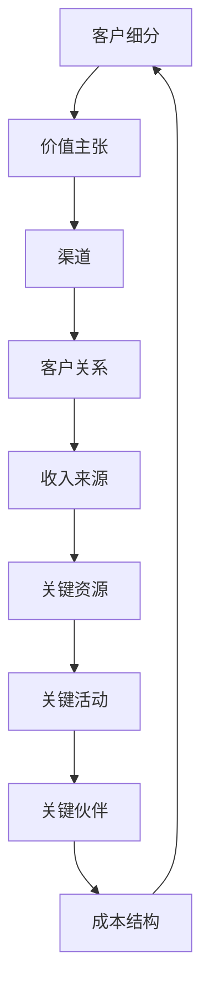

                 

# 技术创新的商业模式画布：构建可持续盈利模式

> 技术创新是驱动企业发展的核心动力，而商业模式的创新则为技术创新提供了可持续盈利的路径。本文将深入探讨技术创新的商业模式画布，帮助读者理解如何构建一个既具创新性又可持续盈利的商业模式。

## 1. 背景介绍

### 1.1 技术创新的重要性

在当今世界，技术创新已成为驱动企业竞争力和经济增长的关键因素。无论是互联网、人工智能，还是区块链、物联网等新兴技术，它们都在不断颠覆传统产业，创造新的商业机会。然而，技术创新并不意味着简单地引入新技术，而是要将其融入企业的商业模式中，实现真正的价值创造。

### 1.2 商业模式的重要性

商业模式是企业创造、传递和获取价值的基本逻辑。一个成功的商业模式不仅能够帮助企业实现盈利，还能够确保企业的可持续发展。在技术创新的背景下，商业模式需要不断调整和优化，以适应市场的变化和技术的发展。

## 2. 核心概念与联系

### 2.1 商业模式画布

商业模式画布（Business Model Canvas）是由亚历山大·奥斯特瓦尔德（Alexander Osterwalder）和扬·弗雷特（Yann Ménière）提出的一种可视化工具，用于描述企业的商业模式。它由九个主要组件组成，包括客户细分（Customer Segments）、价值主张（Value Propositions）、渠道（Channels）、客户关系（Customer Relationships）、收入来源（Revenue Streams）、关键资源（Key Resources）、关键活动（Key Activities）、关键伙伴（Key Partners）和成本结构（Cost Structure）。

### 2.2 技术创新与商业模式画布的联系

技术创新可以影响商业模式画布的各个组件。例如，通过引入新技术，企业可以创造新的客户细分，提供新的价值主张，开拓新的渠道，建立新的客户关系，创造新的收入来源，优化关键资源、活动和伙伴，以及降低成本结构。

### 2.3 商业模式画布的 Mermaid 流程图



## 3. 核心算法原理 & 具体操作步骤

### 3.1 商业模式画布的构建方法

构建一个技术创新的商业模式，首先需要明确企业的目标和愿景，然后根据市场需求和技术发展趋势，对商业模式画布的九个组件进行详细定义和规划。

#### 3.1.1 客户细分

明确目标客户群体，分析他们的需求、行为和偏好，以确保企业的产品和服务能够满足这些客户的需求。

#### 3.1.2 价值主张

定义企业的产品和服务如何解决客户的问题或满足他们的需求，以及这些产品和服务相对于竞争对手的优势。

#### 3.1.3 渠道

确定如何将产品和服务传递给客户，包括线上和线下渠道的选择和优化。

#### 3.1.4 客户关系

建立和维护与客户的长期关系，包括客户服务、支持和反馈机制。

#### 3.1.5 收入来源

确定企业的收入模式，包括直接销售、订阅、许可、广告等多种方式。

#### 3.1.6 关键资源

识别企业运营所需的关键资源，包括人力、技术、资金等。

#### 3.1.7 关键活动

定义企业需要执行的关键活动，包括产品开发、市场推广、销售和客户服务等。

#### 3.1.8 关键伙伴

确定与企业合作的关键合作伙伴，包括供应商、分销商、技术合作伙伴等。

#### 3.1.9 成本结构

分析企业的成本结构，包括固定成本和变动成本，以及如何优化成本。

### 3.2 实际操作步骤

1. **明确目标和愿景**：确定企业的长期目标和愿景，作为商业模式构建的指导。
2. **市场和技术分析**：分析市场需求和技术发展趋势，为商业模式设计提供依据。
3. **定义商业模式画布**：根据上述分析，详细定义商业模式画布的九个组件。
4. **评估和优化**：对商业模式进行评估和优化，确保其可行性和可持续性。
5. **实施和执行**：将商业模式付诸实践，确保各项活动能够顺利进行。

## 4. 数学模型和公式 & 详细讲解 & 举例说明

### 4.1 成本-收益分析

成本-收益分析是一种常用的决策模型，用于评估不同商业模式的成本和收益。

#### 4.1.1 成本计算公式

总成本 = 固定成本 + 变动成本

其中，固定成本是指在短期内不随生产量变化的成本，如租金、员工工资等；变动成本是指在短期内随生产量变化的成本，如原材料、生产设备等。

#### 4.1.2 收益计算公式

总收益 = 单位价格 × 销售量

其中，单位价格是指每个产品或服务的售价；销售量是指在一定时间内销售的产品或服务数量。

#### 4.1.3 利润计算公式

利润 = 总收益 - 总成本

### 4.2 举例说明

假设某企业生产并销售一种产品，单位价格为100元，固定成本为50000元，变动成本为每个产品20元。如果企业每月生产并销售1000个产品，则：

1. 总成本 = 50000 + 20 × 1000 = 150000元
2. 总收益 = 100 × 1000 = 100000元
3. 利润 = 100000 - 150000 = -50000元

这个例子表明，企业在短期内出现了亏损。为了改善这种情况，企业可以考虑提高产品售价、增加销售量、降低成本等策略。

## 5. 项目实战：代码实际案例和详细解释说明

### 5.1 开发环境搭建

在本节中，我们将使用Python语言进行成本-收益分析的编程实现。首先，确保安装了Python环境。

### 5.2 源代码详细实现和代码解读

```python
# 导入必要的库
import matplotlib.pyplot as plt

# 定义成本-收益分析函数
def cost_revenue_analysis(price, fixed_cost, variable_cost, quantity):
    total_cost = fixed_cost + variable_cost * quantity
    total_revenue = price * quantity
    profit = total_revenue - total_cost
    return total_cost, total_revenue, profit

# 设置参数
price = 100
fixed_cost = 50000
variable_cost = 20
quantity = 1000

# 调用函数进行计算
total_cost, total_revenue, profit = cost_revenue_analysis(price, fixed_cost, variable_cost, quantity)

# 输出结果
print(f"总成本: {total_cost}元")
print(f"总收益: {total_revenue}元")
print(f"利润: {profit}元")

# 绘制成本-收益曲线
plt.plot([0, quantity], [fixed_cost, fixed_cost + variable_cost * quantity], label="成本曲线")
plt.plot([0, quantity], [0, price * quantity], label="收益曲线")
plt.axhline(y=0, color='r', linestyle='-')
plt.text(quantity, profit, f"利润: {profit}元", fontsize=12)
plt.xlabel("销售量")
plt.ylabel("成本/收益")
plt.legend()
plt.show()
```

这段代码首先定义了一个成本-收益分析函数，然后设置参数并调用函数进行计算。最后，使用matplotlib库绘制了成本-收益曲线，以更直观地展示结果。

### 5.3 代码解读与分析

1. **导入库**：首先导入matplotlib.pyplot库，用于绘制图形。
2. **定义函数**：定义了一个名为`cost_revenue_analysis`的函数，该函数接受价格、固定成本、变动成本和销售量作为参数，返回总成本、总收益和利润。
3. **设置参数**：设置了价格、固定成本、变动成本和销售量的参数值。
4. **调用函数**：调用`cost_revenue_analysis`函数进行计算，并将结果存储在变量中。
5. **输出结果**：使用`print`函数输出计算结果。
6. **绘制图形**：使用`plt.plot`函数绘制成本-收益曲线，并使用`plt.text`函数在图形上标注利润值。

## 6. 实际应用场景

技术创新的商业模式在各个行业都有广泛应用。以下是一些实际应用场景：

### 6.1 互联网行业

在互联网行业，技术创新的商业模式主要体现在以下几个方面：

1. **产品创新**：通过引入新技术，如人工智能、大数据等，提供更加智能化的产品和服务。
2. **平台创新**：构建基于云计算、物联网等技术的平台，实现跨界整合和生态构建。
3. **商业模式创新**：通过免费策略、订阅模式、广告收入等多种方式实现盈利。

### 6.2 制造业

在制造业，技术创新的商业模式主要体现在以下几个方面：

1. **智能制造**：通过引入物联网、人工智能等技术，实现生产线的自动化和智能化。
2. **服务化制造**：将产品与解决方案相结合，提供全方位的服务。
3. **绿色制造**：通过技术创新，降低能耗和污染，实现可持续发展。

### 6.3 医疗行业

在医疗行业，技术创新的商业模式主要体现在以下几个方面：

1. **远程医疗**：通过互联网和物联网技术，提供远程诊断、治疗和健康管理服务。
2. **精准医疗**：通过大数据和人工智能技术，实现个性化诊疗和精准医疗。
3. **医疗信息化**：通过电子病历、医疗大数据等技术，提高医疗服务的效率和质量。

## 7. 工具和资源推荐

### 7.1 学习资源推荐

- **书籍**：
  - 《商业模式新生代》：亚历山大·奥斯特瓦尔德（Alexander Osterwalder）和扬·弗雷特（Yann Ménière）著，详细介绍了商业模式画布的构建方法和应用。
  - 《创新者的窘境》：克莱顿·克里斯坦森（Clayton M. Christensen）著，探讨了技术创新对商业模式的影响。
- **论文**：
  - “Business Model Generation”：亚历山大·奥斯特瓦尔德（Alexander Osterwalder）和扬·弗雷特（Yann Ménière）发表在《长尾理论》期刊上的论文，详细阐述了商业模式画布的理论基础。
  - “The Lean Startup”：埃里克·莱斯（Eric Ries）发表在《哈佛商业评论》上的论文，介绍了精益创业方法在商业模式创新中的应用。

### 7.2 开发工具框架推荐

- **Python**：用于数据分析和建模。
- **Django**：用于快速构建Web应用程序。
- **TensorFlow**：用于机器学习和深度学习。
- **Apache Kafka**：用于实时数据流处理。

### 7.3 相关论文著作推荐

- “Business Model Innovation in High-Tech Industries”：介绍了高科技行业中商业模式创新的实践和方法。
- “The Business Model Canvas and Its Implications for Strategy Implementation”：探讨了商业模式画布在战略实施中的作用。

## 8. 总结：未来发展趋势与挑战

### 8.1 发展趋势

1. **技术融合**：不同技术的融合将推动商业模式的创新，如人工智能、物联网、大数据等。
2. **平台化**：越来越多的企业将采用平台化模式，实现跨界整合和生态构建。
3. **个性化**：个性化服务和定制化解决方案将成为主流，满足客户日益多样化的需求。

### 8.2 挑战

1. **技术风险**：技术创新带来的不确定性，如技术失败、市场接受度低等。
2. **法律和伦理问题**：技术发展引发的法律和伦理问题，如数据隐私、知识产权等。
3. **组织变革**：技术创新要求企业进行组织变革，以适应新的商业模式。

## 9. 附录：常见问题与解答

### 9.1 什么是商业模式画布？

商业模式画布是一种可视化工具，用于描述企业的商业模式，包括九个主要组件：客户细分、价值主张、渠道、客户关系、收入来源、关键资源、关键活动、关键伙伴和成本结构。

### 9.2 技术创新如何影响商业模式？

技术创新可以通过改变客户需求、优化产品和服务、降低成本、提高效率等多种方式影响商业模式。技术创新的成功实施需要将其融入企业的商业模式中，实现价值创造。

## 10. 扩展阅读 & 参考资料

- [Osterwalder, A., & Pigneur, Y. (2010). Business Model Generation. John Wiley & Sons.]
- [Christensen, C. M. (1997). The Innovator's Dilemma. Harvard Business Review.]
- [Ries, E. (2011). The Lean Startup. Random House.]
- [Osterwalder, A., & Pigneur, Y. (2014). Business Model Generation: A Handbook for Visionaries, Game Changers, and Leaders of the Future. Wiley.]
- [Christensen, C. M., Raynor, M. E., & McDonald, R. (2015). How Will You Measure Your Life? HarperBusiness.]
- [O'Gorman, K., & O'Gorman, R. (2018). Business Models for the Digital Age: How to Create Strategies for Sustainable Success and Competitive Advantage. Springer.]

## 作者信息

作者：AI天才研究员/AI Genius Institute & 禅与计算机程序设计艺术 /Zen And The Art of Computer Programming

本文旨在探讨技术创新的商业模式画布，帮助读者理解如何构建一个既具创新性又可持续盈利的商业模式。文章通过对商业模式画布的核心概念、构建方法和实际应用场景的详细分析，为读者提供了宝贵的参考和启示。在未来的发展中，技术创新与商业模式的深度融合将为企业带来更多的机遇和挑战。希望本文能够为读者在探索商业模式创新的道路上提供一些有价值的思考和实践指导。|</sop>|<|im_sep|>

