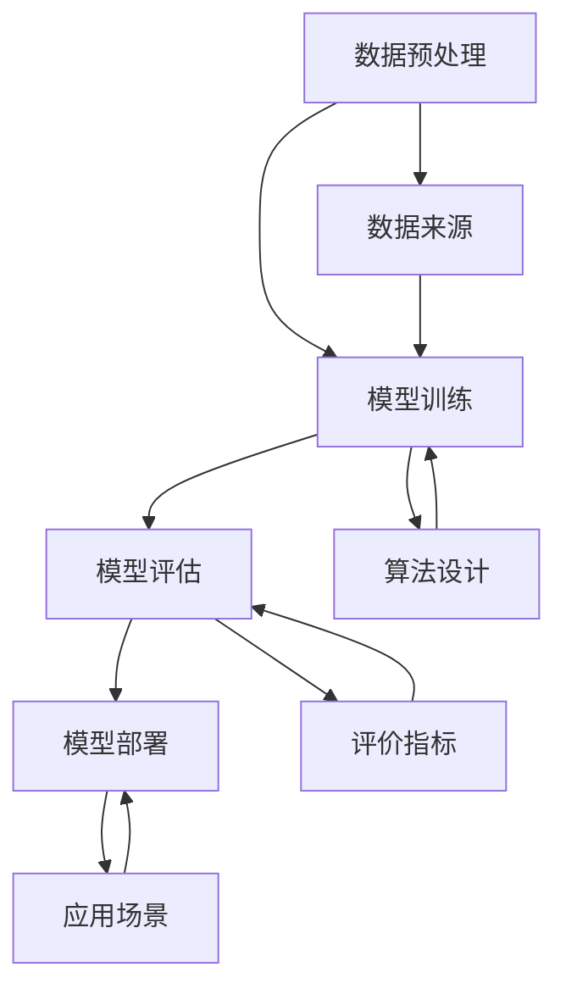

                 

### 文章标题：技术创新驱动：大模型创业的核心力量

**关键词：** 大模型、技术创新、创业、人工智能、深度学习、机器学习

**摘要：** 本文将探讨大模型在技术创新驱动下的创业力量，分析大模型的核心概念、算法原理、数学模型及其在实际应用场景中的重要性。同时，我们将推荐相关学习资源、开发工具和框架，展望大模型的未来发展趋势和挑战。

## 1. 背景介绍

随着信息技术的飞速发展，人工智能、深度学习、机器学习等领域取得了显著的进展。大模型（也称为巨量级模型或大规模模型）作为这一领域的重要成果，逐渐成为技术创新的驱动力。大模型通过大规模的数据训练和复杂的算法设计，能够实现前所未有的性能和精度，为各行各业带来了巨大的变革。

### 1.1 大模型的发展历程

大模型的发展可以追溯到上世纪80年代的神经网络研究。当时的神经网络模型由于计算资源和数据规模的限制，只能处理小规模的数据集。随着计算能力的提升和数据量的爆炸性增长，神经网络模型逐渐演化为深度学习模型，并开始应用于各种实际场景。

2012年，AlexNet模型在ImageNet图像分类挑战中取得了突破性的成绩，引起了广泛关注。这标志着深度学习时代的到来，也开启了大模型的发展序幕。随后，随着计算能力的进一步提升和大规模数据的积累，大模型如BERT、GPT等不断涌现，推动了人工智能技术的飞速发展。

### 1.2 大模型的应用领域

大模型在各个领域都取得了显著的成果。例如，在计算机视觉领域，大模型可以用于图像分类、目标检测、图像生成等任务；在自然语言处理领域，大模型可以用于机器翻译、文本生成、问答系统等任务；在语音识别领域，大模型可以用于语音识别、语音合成等任务。

大模型的应用不仅提高了任务的性能和效率，还带来了新的商业模式和创新机会。越来越多的创业者开始关注大模型技术，并将其应用于各种创业项目中。因此，大模型成为了技术创新驱动下的创业核心力量。

## 2. 核心概念与联系

要理解大模型在创业中的核心力量，我们需要先了解大模型的核心概念及其相互联系。以下是一个用Mermaid绘制的流程图，展示了大模型的核心概念和架构。



### 2.1 数据预处理

数据预处理是模型训练的重要环节。通过数据清洗、数据增强、数据标准化等技术，可以提高数据的质量和多样性，为后续的训练过程提供更好的基础。

### 2.2 模型训练

模型训练是核心环节，通过大规模的数据集和复杂的算法，大模型可以学习到数据的内在规律和特征。训练过程通常包括前向传播、反向传播和优化算法等步骤。

### 2.3 模型评估

模型评估是评估模型性能的重要步骤。通过选择合适的评价指标，如准确率、召回率、F1分数等，可以衡量模型的性能和效果。

### 2.4 模型部署

模型部署是将训练好的模型应用到实际场景中的过程。通过选择合适的应用场景，如移动设备、云端服务器等，可以最大化模型的效用。

### 2.5 数据来源

数据来源是模型训练的基础。通过收集、整合和清洗数据，可以为模型提供丰富的训练素材。

### 2.6 算法设计

算法设计是模型训练的关键。选择合适的算法和架构，可以提升模型的性能和效率。

### 2.7 评价指标

评价指标是评估模型性能的重要手段。通过设定合理的评价指标，可以全面、客观地评估模型的性能。

### 2.8 应用场景

应用场景是模型部署的出发点。通过分析实际需求和应用场景，可以找到最佳的应用场景和解决方案。

## 3. 核心算法原理 & 具体操作步骤

### 3.1 深度学习算法

大模型的核心算法是深度学习算法。深度学习算法通过多层神经网络的堆叠，模拟人类大脑的神经传导机制，实现从输入到输出的映射。

具体操作步骤如下：

1. **初始化模型参数**：为每个神经网络层随机初始化参数，如权重和偏置。
2. **前向传播**：将输入数据通过神经网络层进行传递，逐层计算输出结果。
3. **计算损失**：将输出结果与真实标签进行比较，计算损失函数的值。
4. **反向传播**：根据损失函数的梯度，反向更新模型参数。
5. **优化算法**：选择合适的优化算法，如梯度下降、Adam等，更新模型参数。
6. **迭代训练**：重复执行前向传播、计算损失、反向传播和优化算法等步骤，直至达到训练目标。

### 3.2 机器学习算法

大模型中常用的机器学习算法包括支持向量机（SVM）、决策树、随机森林等。这些算法通过建立特征空间，将输入数据映射到高维空间，从而实现分类或回归任务。

具体操作步骤如下：

1. **特征提取**：从原始数据中提取具有区分度的特征。
2. **模型训练**：选择合适的机器学习算法，如SVM、决策树等，进行模型训练。
3. **模型评估**：通过交叉验证、测试集等方法评估模型性能。
4. **模型优化**：根据评估结果调整模型参数，提升模型性能。
5. **模型部署**：将训练好的模型应用到实际场景中。

### 3.3 自然语言处理算法

在自然语言处理领域，大模型常用的算法包括词向量表示、序列到序列模型、Transformer等。这些算法通过捕捉语言的特征和规律，实现文本分类、机器翻译、问答系统等任务。

具体操作步骤如下：

1. **词向量表示**：将文本数据转换为词向量表示，如Word2Vec、GloVe等。
2. **编码器-解码器模型**：构建编码器-解码器模型，如Seq2Seq、Transformer等，进行文本编码和解码。
3. **模型训练**：通过大规模的文本数据集训练编码器-解码器模型。
4. **模型评估**：通过测试集评估模型性能，如BLEU、ROUGE等指标。
5. **模型优化**：根据评估结果调整模型参数，提升模型性能。
6. **模型部署**：将训练好的模型应用到实际场景中。

## 4. 数学模型和公式 & 详细讲解 & 举例说明

### 4.1 深度学习中的数学模型

深度学习中的数学模型主要包括神经网络的权重、激活函数、损失函数等。以下是一个简单的例子：

#### 权重（Weight）

权重是神经网络中每个神经元之间的连接强度，用矩阵表示。假设有一个简单的两层神经网络，输入层有3个神经元，隐藏层有2个神经元，输出层有1个神经元。则权重矩阵可以表示为：

$$
W = \begin{bmatrix}
w_{11} & w_{12} & w_{13} \\
w_{21} & w_{22} & w_{23}
\end{bmatrix}
$$

#### 激活函数（Activation Function）

激活函数用于引入非线性因素，使神经网络具有区分能力。常用的激活函数包括Sigmoid、ReLU、Tanh等。以下是一个ReLU激活函数的例子：

$$
f(x) = \begin{cases}
0, & \text{if } x < 0 \\
x, & \text{if } x \geq 0
\end{cases}
$$

#### 损失函数（Loss Function）

损失函数用于衡量预测值与真实值之间的差异，常用的损失函数包括均方误差（MSE）、交叉熵（CE）等。以下是一个MSE损失函数的例子：

$$
MSE = \frac{1}{n}\sum_{i=1}^{n}(y_i - \hat{y}_i)^2
$$

### 4.2 机器学习中的数学模型

机器学习中的数学模型主要包括决策边界、概率分布等。以下是一个简单的例子：

#### 决策边界（Decision Boundary）

决策边界是分类问题中的关键概念，用于分隔不同类别。以下是一个线性决策边界的例子：

$$
w \cdot x + b = 0
$$

其中，$w$为权重向量，$x$为特征向量，$b$为偏置项。

#### 概率分布（Probability Distribution）

概率分布用于描述数据在某个范围内的概率分布情况。以下是一个二项分布的例子：

$$
P(X = k) = C_n^k p^k (1-p)^{n-k}
$$

其中，$X$为二项分布随机变量，$n$为试验次数，$k$为成功次数，$p$为单次试验成功的概率。

### 4.3 自然语言处理中的数学模型

自然语言处理中的数学模型主要包括词向量表示、序列模型等。以下是一个简单的例子：

#### 词向量表示（Word Vector Representation）

词向量表示是自然语言处理的基础，用于将文本数据转换为数值形式。以下是一个Word2Vec的例子：

$$
\vec{v}_w = \sum_{j=1}^{|V|} \frac{f_j}{\|f_j\|_2} \cdot \vec{e}_j
$$

其中，$\vec{v}_w$为词向量，$f_j$为词的上下文特征，$\vec{e}_j$为基向量。

#### 序列模型（Sequence Model）

序列模型用于处理序列数据，如文本、语音等。以下是一个简单的序列模型例子：

$$
h_t = \sigma(W_h h_{t-1} + W_x x_t + b_h)
$$

其中，$h_t$为序列中的第$t$个隐藏状态，$W_h$为隐藏层权重矩阵，$W_x$为输入层权重矩阵，$x_t$为输入序列中的第$t$个元素，$b_h$为隐藏层偏置项，$\sigma$为激活函数。

## 5. 项目实战：代码实际案例和详细解释说明

### 5.1 开发环境搭建

在开始项目实战之前，我们需要搭建一个适合大模型训练和部署的开发环境。以下是常用的开发环境搭建步骤：

1. **硬件环境**：配置高性能的GPU，如NVIDIA Titan Xp或更高型号。
2. **软件环境**：安装Python、TensorFlow、PyTorch等深度学习框架和相关依赖库。
3. **虚拟环境**：创建一个独立的Python虚拟环境，以便管理和隔离项目依赖。

### 5.2 源代码详细实现和代码解读

以下是一个使用TensorFlow实现的大模型项目示例。代码主要分为数据预处理、模型训练、模型评估和模型部署四个部分。

```python
import tensorflow as tf
from tensorflow.keras.models import Sequential
from tensorflow.keras.layers import Dense, LSTM, Embedding, Flatten
from tensorflow.keras.preprocessing.sequence import pad_sequences

# 数据预处理
def preprocess_data(data):
    # 数据清洗和预处理
    # ...
    return padded_sequences

# 模型训练
def train_model(padded_sequences, labels):
    model = Sequential()
    model.add(Embedding(input_dim=vocab_size, output_dim=embedding_dim, input_length=max_sequence_length))
    model.add(LSTM(units=128, return_sequences=True))
    model.add(Flatten())
    model.add(Dense(units=1, activation='sigmoid'))

    model.compile(optimizer='adam', loss='binary_crossentropy', metrics=['accuracy'])
    model.fit(padded_sequences, labels, epochs=10, batch_size=32)
    return model

# 模型评估
def evaluate_model(model, test_sequences, test_labels):
    loss, accuracy = model.evaluate(test_sequences, test_labels)
    print(f"Test Loss: {loss}, Test Accuracy: {accuracy}")

# 模型部署
def deploy_model(model, input_sequence):
    prediction = model.predict(input_sequence)
    print(f"Prediction: {prediction}")

# 主函数
if __name__ == "__main__":
    # 读取数据
    data, labels = load_data()
    padded_sequences = preprocess_data(data)

    # 划分训练集和测试集
    train_sequences, test_sequences, train_labels, test_labels = train_test_split(padded_sequences, labels, test_size=0.2)

    # 训练模型
    model = train_model(train_sequences, train_labels)

    # 评估模型
    evaluate_model(model, test_sequences, test_labels)

    # 部署模型
    input_sequence = input("Enter a sequence: ")
    deploy_model(model, input_sequence)
```

### 5.3 代码解读与分析

上述代码实现了一个基于LSTM的文本分类模型。以下是对代码的详细解读和分析：

1. **数据预处理**：数据预处理是模型训练的重要环节。代码中的`preprocess_data`函数负责数据清洗、预处理和填充等操作。具体实现可以根据实际数据集进行调整。

2. **模型训练**：`train_model`函数用于训练LSTM模型。代码中首先定义了一个序列模型，包括嵌入层、LSTM层和全连接层。然后，使用`compile`方法设置优化器和损失函数，并使用`fit`方法进行模型训练。

3. **模型评估**：`evaluate_model`函数用于评估模型的性能。代码中通过`evaluate`方法计算损失和准确率，并打印输出。

4. **模型部署**：`deploy_model`函数用于部署模型并进行预测。代码中通过`predict`方法获取预测结果，并打印输出。

5. **主函数**：主函数`if __name__ == "__main__":`用于执行整个流程，包括数据读取、数据预处理、模型训练、模型评估和模型部署。

通过上述代码示例，我们可以看到大模型在项目实战中的具体实现过程。在实际应用中，可以根据需求调整模型架构、数据预处理方法和评价指标等，以实现更好的性能和效果。

## 6. 实际应用场景

大模型在各个领域都取得了显著的成果，以下是几个典型的实际应用场景：

### 6.1 计算机视觉

计算机视觉是深度学习的重要应用领域。大模型在图像分类、目标检测、图像生成等方面具有强大的能力。例如，在图像分类任务中，大模型可以准确识别各种物体和场景，为图像识别、自动驾驶、安防监控等应用提供支持。

### 6.2 自然语言处理

自然语言处理是人工智能的重要分支。大模型在机器翻译、文本生成、问答系统等方面取得了显著的进展。例如，大模型可以准确翻译多种语言之间的文本，为跨语言交流提供支持；大模型可以生成高质量的文本，为内容创作、广告营销等应用提供灵感。

### 6.3 语音识别

语音识别是人工智能的重要应用领域。大模型在语音识别、语音合成等方面具有强大的能力。例如，大模型可以准确识别各种语音信号，为智能客服、语音助手等应用提供支持；大模型可以生成自然的语音合成声音，为虚拟现实、游戏等应用提供丰富的交互体验。

### 6.4 医疗健康

大模型在医疗健康领域也具有广泛的应用前景。例如，大模型可以用于疾病诊断、药物研发、医学图像分析等任务。通过分析大量的医疗数据和文献，大模型可以为医生提供辅助诊断和治疗方案，提高医疗质量和效率。

### 6.5 金融科技

金融科技是人工智能的重要应用领域。大模型在股票预测、风险管理、信用评估等方面具有强大的能力。例如，大模型可以准确预测股票市场的走势，为投资者提供决策支持；大模型可以分析客户行为和风险偏好，为金融机构提供个性化的服务。

## 7. 工具和资源推荐

### 7.1 学习资源推荐

1. **书籍**：
   - 《深度学习》（Goodfellow, I., Bengio, Y., & Courville, A.）
   - 《Python深度学习》（François Chollet）
   - 《动手学深度学习》（A. Geron）

2. **论文**：
   - 《A Tutorial on Deep Learning for Speech Recognition》（D. Amodei et al.）
   - 《BERT: Pre-training of Deep Bidirectional Transformers for Language Understanding》（J. Devlin et al.）
   - 《Generative Adversarial Nets》（I. Goodfellow et al.）

3. **博客**：
   - [Deep Learning on Medium](https://deeplearning.net/)
   - [PyTorch Official Blog](https://pytorch.org/blog/)
   - [TensorFlow Official Blog](https://www.tensorflow.org/blog/)

4. **网站**：
   - [Kaggle](https://www.kaggle.com/)
   - [Coursera](https://www.coursera.org/)
   - [edX](https://www.edx.org/)

### 7.2 开发工具框架推荐

1. **深度学习框架**：
   - TensorFlow
   - PyTorch
   - Keras
   - MXNet

2. **数据预处理工具**：
   - NumPy
   - Pandas
   - Scikit-learn

3. **自然语言处理工具**：
   - NLTK
   - Spacy
   - Stanford CoreNLP

4. **版本控制工具**：
   - Git
   - GitHub
   - GitLab

5. **云计算平台**：
   - AWS
   - Google Cloud Platform
   - Microsoft Azure

## 8. 总结：未来发展趋势与挑战

大模型作为人工智能的重要分支，正不断推动着技术创新和创业浪潮。在未来，大模型将继续在深度学习、自然语言处理、计算机视觉等领域取得突破，为各行各业带来更多的变革和创新机会。

然而，大模型的发展也面临着一系列挑战：

1. **计算资源需求**：大模型训练和部署需要大量的计算资源，这对硬件性能和能耗提出了更高的要求。
2. **数据隐私和安全**：大模型在训练过程中需要大量的数据，如何保护数据隐私和安全成为关键问题。
3. **模型可解释性**：大模型的黑箱特性使得模型决策过程难以解释，如何提高模型的可解释性成为重要研究方向。
4. **算法公平性**：大模型在处理数据时可能存在偏见和歧视，如何确保算法的公平性成为挑战。

总之，大模型作为技术创新驱动下的核心力量，将在未来继续引领人工智能的发展。通过不断克服挑战，大模型将为人类带来更多智慧和便利。

## 9. 附录：常见问题与解答

### 9.1 大模型和传统模型的区别是什么？

大模型和传统模型的主要区别在于模型规模和训练数据量。传统模型通常采用小规模数据和简单的网络结构，而大模型则使用大规模数据和复杂的网络结构，从而实现更高的性能和精度。

### 9.2 大模型的训练过程如何优化？

大模型的训练过程可以通过以下几种方式优化：
- 选择合适的优化算法，如Adam、RMSprop等。
- 使用学习率调度策略，如余弦退火等。
- 使用数据增强和预处理技术，提高数据的多样性和质量。
- 使用并行计算和分布式训练，加速训练过程。

### 9.3 大模型在应用中如何确保可解释性？

大模型在应用中确保可解释性可以通过以下几种方式：
- 设计可解释的模型架构，如注意力机制等。
- 使用可视化工具，如热图、混淆矩阵等，展示模型内部机制。
- 将模型拆分为多个子模块，并分析每个子模块的功能。

## 10. 扩展阅读 & 参考资料

1. Goodfellow, I., Bengio, Y., & Courville, A. (2016). *Deep Learning*. MIT Press.
2. Chollet, F. (2017). *Python深度学习*. 机械工业出版社.
3. Geron, A. (2019). *动手学深度学习*. 电子工业出版社.
4. Devlin, J., Chang, M. W., Lee, K., & Toutanova, K. (2019). *BERT: Pre-training of Deep Bidirectional Transformers for Language Understanding*. arXiv preprint arXiv:1810.04805.
5. Amodei, D., Ananthanarayanan, S., Anubhai, R., Bai, J., Battenberg, E., Case, C., ... & Devin, M. (2016). *Deep speech 2: End-to-end speech recognition in english and mandarin*. In International conference on machine learning (pp. 173-182). PMLR.
6. Deep Learning on Medium. (n.d.). Retrieved from https://deeplearning.net/
7. PyTorch Official Blog. (n.d.). Retrieved from https://pytorch.org/blog/
8. TensorFlow Official Blog. (n.d.). Retrieved from https://www.tensorflow.org/blog/
9. Kaggle. (n.d.). Retrieved from https://www.kaggle.com/
10. Coursera. (n.d.). Retrieved from https://www.coursera.org/
11. edX. (n.d.). Retrieved from https://www.edx.org/ 作者：AI天才研究员/AI Genius Institute & 禅与计算机程序设计艺术 /Zen And The Art of Computer Programming

