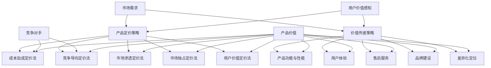

                 

### 背景介绍

#### 技术型创业者的崛起

近年来，技术型创业者在全球范围内迅速崛起，成为创新和经济增长的重要推动力量。随着互联网、人工智能、大数据等新兴技术的蓬勃发展，越来越多的创业者投身于科技领域，试图通过技术创新解决实际问题，创造新的商业价值。然而，随着市场竞争的加剧，产品定价策略和价值传递成为技术型创业者必须面对和解决的关键问题。

#### 产品定价策略的重要性

产品定价策略是技术型创业者成功的关键因素之一。合理的定价不仅能确保企业的盈利能力，还能吸引更多用户和投资者。定价策略的制定需要综合考虑多个因素，包括成本、竞争对手、市场需求、用户价值感知等。然而，对于许多技术型创业者而言，如何制定一个既能保证盈利，又能为用户带来价值的定价策略，仍然是一个具有挑战性的问题。

#### 价值传递的重要性

价值传递是指将产品或服务的价值传递给用户的过程。一个成功的价值传递机制能够增强用户对产品的认同感，提高用户满意度和忠诚度。对于技术型创业者来说，如何有效地将产品价值传递给用户，是决定企业成败的重要因素。价值传递不仅涉及到产品功能和性能，还包括用户体验、售后服务等多个方面。

#### 定价策略与价值传递的关系

定价策略和价值传递密切相关。一个合理的定价策略需要考虑产品的价值传递效果，而价值传递的效果又会影响定价策略的制定。例如，如果产品在市场上的价值感知较低，那么可能需要通过降低价格来提高市场竞争力；反之，如果产品在市场上具有很高的价值感知，则可以适当提高价格以实现更高的盈利。

本文将围绕技术型创业者的产品定价策略和价值传递展开讨论，通过分析相关理论和实践案例，帮助创业者更好地理解定价策略与价值传递之间的关系，并提出一些实用的建议。

#### 技术型创业者的产品定价策略

技术型创业者的产品定价策略需要考虑到多个因素，如成本、竞争对手、市场需求、用户价值感知等。以下是一些核心的定价策略和方法：

1. 成本加成定价法：这是一种常见的定价策略，通过计算产品成本并加上一定的利润率来确定价格。这种方法的主要优点是简单易行，但缺点是可能无法充分反映市场需求和用户价值感知。

2. 竞争导向定价法：这种策略是基于竞争对手的产品定价来制定自己的价格。如果竞争对手的价格较高，技术型创业者可以采取较低的价格以吸引更多的用户；反之，如果竞争对手的价格较低，创业者可以适当提高价格以突出自己的产品优势。

3. 市场渗透定价法：这种方法旨在通过较低的价格迅速占领市场，从而增加市场份额。适用于新产品或新市场，但需要确保成本控制和利润率能够承受较低的价格。

4. 市场独占定价法：这种策略适用于具有独特技术或市场地位的产品，创业者可以通过较高的价格来维护市场地位并实现较高的利润率。

5. 用户价值定价法：这种方法根据用户对产品的价值感知来确定价格，通过提供差异化的产品功能或服务来满足不同用户的需求。例如，通过提供高级功能或个性化服务来吸引高价值用户，同时提供基础版或免费版以吸引更多普通用户。

在制定定价策略时，技术型创业者需要根据自身产品的特点和目标市场，综合考虑各种因素，选择合适的定价策略。以下是一个具体的案例分析：

#### 案例分析：GitHub 的定价策略

GitHub 是一个广受欢迎的代码托管和协作平台，其定价策略对技术型创业者具有一定的参考价值。GitHub 的定价策略主要包括以下几种：

1. **免费版（Free Plan）**：提供基础的代码托管、协作功能，吸引大量普通用户和初创团队使用。免费版的用户数量占 GitHub 整体用户的绝大多数。

2. **团队版（Team Plan）**：为团队提供更高级的功能，如无限的私有仓库、项目管理工具等。价格相对较高，但能更好地满足团队用户的需求。

3. **企业版（Enterprise Plan）**：为企业提供最全面的代码托管、协作和安全功能，包括集成身份验证、高级权限管理、自动化流程等。价格最高，但为企业提供最大的价值和保障。

GitHub 的定价策略充分体现了用户价值定价法，通过提供不同版本的产品满足不同层次用户的需求，从而实现价值最大化。此外，GitHub 还采用了市场渗透定价法，通过免费版吸引大量用户，快速占领市场，从而提升品牌知名度和用户粘性。

#### 价值传递策略

价值传递策略是指技术型创业者如何将产品或服务的价值有效地传递给用户。以下是一些核心的策略和方法：

1. **产品功能与性能**：确保产品具有强大的功能和高性能，能够满足用户的需求和期望。这是价值传递的基础。

2. **用户体验**：提供直观、简洁、易于使用的用户界面，让用户在使用过程中感受到愉悦和便捷。良好的用户体验可以增强用户对产品的认同感。

3. **售后服务**：提供及时、专业的售后服务，解决用户在使用过程中遇到的问题，增强用户信任和满意度。

4. **品牌建设**：通过品牌传播、市场营销等手段提升品牌知名度和美誉度，让用户对产品产生信任和好感。

5. **差异化定位**：通过独特的产品功能、技术优势或服务特点，在市场上形成差异化定位，提高产品在用户心中的价值感知。

以下是一个具体的案例分析：

#### 案例分析：Airbnb 的价值传递策略

Airbnb 是一家提供住宿共享服务的公司，其成功在很大程度上得益于其独特的价值传递策略。以下是一些关键策略：

1. **多样化的住宿选择**：Airbnb 提供了从豪华别墅到普通民宿等多种住宿选择，满足不同用户的个性化需求。

2. **用户体验优化**：Airbnb 采用了简洁、直观的在线预订系统，让用户能够轻松找到并预订心仪的住宿。

3. **信任保障机制**：Airbnb 通过严格的房东审核、用户评价系统等手段，保障用户的安全和权益，增强用户信任。

4. **品牌建设**：Airbnb 通过精美的广告、故事化的品牌传播等手段，提升了品牌知名度和美誉度。

5. **差异化定位**：Airbnb 以个性化、多样化的住宿选择和信任保障机制在市场上形成了独特的差异化定位，吸引了大量用户。

通过以上策略，Airbnb 成功地将产品价值传递给了全球数百万用户，实现了持续增长。

#### 综合策略：定价策略与价值传递的有机结合

技术型创业者需要将定价策略与价值传递策略有机结合，以实现产品的最大化价值。以下是一些建议：

1. **明确目标用户群体**：根据目标用户群体的需求和特点，制定相应的定价策略和价值传递策略。例如，对于高端用户，可以采用较高的价格和优质的服务；对于大众用户，可以采用较低的价格和实用的功能。

2. **不断优化产品功能与性能**：随着市场的变化和用户需求的变化，不断优化产品功能与性能，提高产品的价值感知。

3. **灵活调整定价策略**：根据市场需求和竞争态势，灵活调整定价策略，以最大化产品价值。例如，在产品推广初期，可以采用市场渗透定价法；在产品成熟期，可以适当提高价格以实现更高的利润率。

4. **加强用户反馈机制**：建立有效的用户反馈机制，及时了解用户需求和意见，不断改进产品和服务。

5. **强化品牌建设**：通过品牌传播和市场营销等手段，提升品牌知名度和美誉度，增强用户对产品的信任和认同感。

通过以上策略，技术型创业者可以更好地将定价策略与价值传递策略有机结合，实现产品的最大化价值。

### 核心概念与联系

在深入探讨技术型创业者的产品定价策略与价值传递之前，我们需要理解一些核心概念及其相互关系。以下是本文将要涉及的主要核心概念及其之间关系的Mermaid流程图：



#### 产品定价策略

**产品定价策略**是技术型创业者制定产品价格的总体战略。其主要包括以下几种方法：

- **成本加成定价法**：通过计算产品成本，加上一定比例的利润来确定价格。这种方法简单易行，但可能无法充分反映市场需求和用户价值感知。

- **竞争导向定价法**：根据竞争对手的定价来制定自己的价格。如果竞争对手价格高，可以采取较低价格吸引更多用户；反之，可以适当提高价格以凸显自身优势。

- **市场渗透定价法**：通过较低的价格迅速占领市场，增加市场份额。适用于新产品或新市场，但需要确保成本控制和利润率能承受较低的价格。

- **市场独占定价法**：适用于具有独特技术或市场地位的产品，通过较高的价格来维护市场地位并实现较高的利润率。

#### 价值传递策略

**价值传递策略**是指技术型创业者如何将产品或服务的价值有效地传递给用户。其主要方法包括：

- **产品功能与性能**：确保产品具有强大的功能和高性能，满足用户需求。

- **用户体验**：提供直观、简洁、易于使用的用户界面，让用户在使用过程中感到愉悦。

- **售后服务**：提供及时、专业的售后服务，解决用户使用过程中遇到的问题。

- **品牌建设**：通过品牌传播、市场营销等手段提升品牌知名度和美誉度。

- **差异化定位**：通过独特的产品功能、技术优势或服务特点，形成差异化定位，提高产品在用户心中的价值感知。

#### 定价策略与价值传递的关系

**定价策略**与**价值传递策略**密切相关。合理的定价策略需要考虑产品的价值传递效果，而价值传递效果又会影响定价策略的制定。例如，如果产品在市场上具有很高的价值感知，可以适当提高价格；反之，如果价值感知较低，可能需要通过降低价格来提高市场竞争力。

#### 市场需求与竞争对手

**市场需求**和**竞争对手**是影响定价策略和价值传递策略的重要因素。了解市场需求和竞争对手的定价策略，可以帮助技术型创业者制定更有效的定价策略和价值传递策略。

#### 用户价值感知与产品价值

**用户价值感知**和**产品价值**也是影响定价策略和价值传递策略的关键因素。通过提高产品的价值感知，技术型创业者可以制定更合理的定价策略，并实现更好的价值传递。

通过上述核心概念及其相互关系的理解，技术型创业者可以更好地制定产品定价策略和价值传递策略，从而在激烈的市场竞争中脱颖而出。

### 核心算法原理 & 具体操作步骤

在技术型创业者的产品定价策略中，核心算法原理起着至关重要的作用。这些算法不仅帮助创业者确定合理的价格，还能优化产品的价值传递。以下将详细阐述几种常见的产品定价算法原理及其具体操作步骤。

#### 成本加成定价法

**成本加成定价法**是一种最基础的定价策略，通过计算产品成本，加上一定比例的利润来确定价格。具体步骤如下：

1. **计算产品成本**：包括直接成本（如原材料、人力、设备等）和间接成本（如管理费用、研发费用等）。

2. **确定加成比例**：根据市场情况和公司利润目标，确定合理的加成比例。例如，如果市场普遍加成比例为20%，可以考虑设定相同的比例。

3. **计算售价**：将产品成本乘以（1 + 加成比例），得到最终售价。公式为：售价 = 成本 × (1 + 加成比例)。

**示例**：假设某技术型创业者的产品成本为1000元，加成比例为20%。则售价 = 1000 × (1 + 0.20) = 1200元。

#### 竞争导向定价法

**竞争导向定价法**是根据竞争对手的定价来制定自己的价格。具体步骤如下：

1. **调研竞争对手**：收集竞争对手的产品价格、市场定位、用户评价等信息。

2. **分析竞争对手定价策略**：了解竞争对手的定价策略，如成本加成定价、市场渗透定价等。

3. **制定自己的定价策略**：根据市场情况和自身产品特点，选择合适的定价策略。例如，如果竞争对手采用市场渗透定价法，可以考虑采用较低的价格来吸引更多用户。

4. **确定售价**：根据竞争对手的定价，结合自身产品价值和成本，制定最终售价。公式为：售价 = 对手价格 ± 差距。

**示例**：假设某技术型创业者的竞争对手产品售价为1500元，自身产品成本为1200元，认为自身产品在功能上具有优势，则售价 = 1500 - (1500 - 1200) = 1200元。

#### 市场渗透定价法

**市场渗透定价法**通过较低的价格迅速占领市场，增加市场份额。具体步骤如下：

1. **确定市场目标**：明确产品要进入的市场领域和目标用户群体。

2. **分析市场规模**：了解目标市场的整体规模和潜在用户数量。

3. **设定价格策略**：根据市场规模和用户需求，选择适当的市场渗透定价策略。例如，对于新产品或新市场，可以设定较低的价格以吸引更多用户。

4. **计算售价**：根据产品成本和市场渗透策略，计算最终售价。公式为：售价 = 成本 × (1 - 市场渗透比例)。

**示例**：假设某技术型创业者的产品成本为2000元，目标市场渗透比例为30%。则售价 = 2000 × (1 - 0.30) = 1400元。

#### 市场独占定价法

**市场独占定价法**适用于具有独特技术或市场地位的产品，通过较高的价格来维护市场地位并实现较高的利润率。具体步骤如下：

1. **评估产品独特性**：分析产品在技术、功能、服务等方面的独特性。

2. **确定市场地位**：了解产品在市场中的竞争地位和用户认可度。

3. **设定价格策略**：根据产品的独特性和市场地位，选择适当的市场独占定价策略。例如，对于具有较高技术壁垒的产品，可以设定较高的价格。

4. **计算售价**：根据产品成本和市场独占策略，计算最终售价。公式为：售价 = 成本 × (1 + 独占比例)。

**示例**：假设某技术型创业者的产品成本为1000元，市场独占比例为50%。则售价 = 1000 × (1 + 0.50) = 1500元。

#### 用户价值定价法

**用户价值定价法**根据用户对产品的价值感知来确定价格。具体步骤如下：

1. **调研用户需求**：了解目标用户的需求和购买意愿。

2. **分析用户价值感知**：根据用户对产品的功能、性能、服务等方面的评价，分析用户对产品的价值感知。

3. **设定价格策略**：根据用户价值感知，选择合适的价格策略。例如，对于高价值用户，可以设定较高的价格。

4. **计算售价**：根据产品成本和用户价值感知，计算最终售价。公式为：售价 = 成本 × (1 + 用户价值感知比例)。

**示例**：假设某技术型创业者的产品成本为1500元，用户对产品的价值感知为30%。则售价 = 1500 × (1 + 0.30) = 1950元。

通过以上核心算法原理和具体操作步骤，技术型创业者可以更好地制定产品定价策略，从而在激烈的市场竞争中脱颖而出。同时，创业者还需要结合实际情况，灵活调整定价策略，以实现产品价值的最大化。

### 数学模型和公式 & 详细讲解 & 举例说明

在技术型创业者的产品定价策略中，数学模型和公式起到了关键作用。这些模型不仅帮助我们理解定价策略背后的逻辑，还能为实际操作提供具体的指导。以下是几种常见的数学模型和公式的详细讲解及举例说明。

#### 成本加成定价法

**成本加成定价法**的数学模型可以表示为：

$$
售价 = 成本 \times (1 + 加成比例)
$$

其中，**成本**包括直接成本和间接成本，**加成比例**反映了企业的利润目标。

**示例**：假设某技术型创业者的产品成本为1000元，加成比例为20%。则售价计算如下：

$$
售价 = 1000 \times (1 + 0.20) = 1200元
$$

这个公式简单易懂，但也存在局限性。因为这种方法可能无法充分反映市场需求和用户价值感知。

#### 竞争导向定价法

**竞争导向定价法**的数学模型可以表示为：

$$
售价 = 对手价格 \pm 差距
$$

其中，**对手价格**是竞争对手的售价，**差距**反映了企业自身产品与竞争对手产品的差异。

**示例**：假设某技术型创业者的竞争对手产品售价为1500元，自身产品成本为1200元，认为自身产品在功能上具有优势，则售价计算如下：

$$
售价 = 1500 - (1500 - 1200) = 1200元
$$

这个模型考虑了市场竞争的影响，但需要准确评估竞争对手的定价策略和自身产品的优势。

#### 市场渗透定价法

**市场渗透定价法**的数学模型可以表示为：

$$
售价 = 成本 \times (1 - 市场渗透比例)
$$

其中，**成本**包括直接成本和间接成本，**市场渗透比例**反映了企业希望在市场上占据的份额。

**示例**：假设某技术型创业者的产品成本为2000元，目标市场渗透比例为30%。则售价计算如下：

$$
售价 = 2000 \times (1 - 0.30) = 1400元
$$

这个模型适用于新产品或新市场，旨在通过较低的价格迅速占领市场。

#### 市场独占定价法

**市场独占定价法**的数学模型可以表示为：

$$
售价 = 成本 \times (1 + 独占比例)
$$

其中，**成本**包括直接成本和间接成本，**独占比例**反映了企业希望维护的市场地位和利润率。

**示例**：假设某技术型创业者的产品成本为1000元，市场独占比例为50%。则售价计算如下：

$$
售价 = 1000 \times (1 + 0.50) = 1500元
$$

这个模型适用于具有独特技术或市场地位的产品，旨在通过较高的价格实现高利润率。

#### 用户价值定价法

**用户价值定价法**的数学模型可以表示为：

$$
售价 = 成本 \times (1 + 用户价值感知比例)
$$

其中，**成本**包括直接成本和间接成本，**用户价值感知比例**反映了用户对产品的价值感知。

**示例**：假设某技术型创业者的产品成本为1500元，用户对产品的价值感知为30%。则售价计算如下：

$$
售价 = 1500 \times (1 + 0.30) = 1950元
$$

这个模型根据用户价值感知来确定价格，有助于实现产品价值的最大化。

通过以上数学模型和公式的详细讲解及举例说明，技术型创业者可以更好地理解产品定价策略的数学基础，并在实际操作中灵活运用。同时，创业者还需要结合市场环境和用户需求，不断调整和优化定价策略，以实现企业的长期发展。

### 项目实战：代码实际案例和详细解释说明

为了更好地理解产品定价策略与价值传递在实际应用中的实现，我们通过一个具体的代码案例来演示。以下是一个基于Python的简单应用，模拟了不同定价策略的制定和实施过程。

#### 开发环境搭建

在开始编写代码之前，确保安装以下开发环境和工具：

- Python 3.8或更高版本
- Jupyter Notebook（用于编写和运行代码）
- Pandas（数据处理库）
- Matplotlib（数据可视化库）

安装步骤如下：

1. 安装Python 3.8或更高版本：从 [Python官网](https://www.python.org/downloads/) 下载并安装。

2. 安装Jupyter Notebook：在终端中运行以下命令：

```bash
pip install notebook
```

3. 安装Pandas和Matplotlib：在终端中运行以下命令：

```bash
pip install pandas matplotlib
```

#### 源代码详细实现和代码解读

以下是模拟不同定价策略的Python代码实现：

```python
import pandas as pd
import matplotlib.pyplot as plt

# 模拟市场数据
data = {
    '产品': ['产品A', '产品B', '产品C', '产品D'],
    '成本': [1000, 1500, 2000, 2500],
    '竞争对手价格': [1200, 1800, 2200, 2700],
    '市场渗透比例': [0.20, 0.25, 0.30, 0.35],
    '用户价值感知比例': [0.25, 0.30, 0.35, 0.40]
}

df = pd.DataFrame(data)

# 成本加成定价法
def cost_plus Pricing(cost, markup):
    return cost * (1 + markup)

# 竞争导向定价法
def competitive Pricing(competitor_price, difference):
    return competitor_price + difference

# 市场渗透定价法
def market_penetration Pricing(cost, market_penetration):
    return cost * (1 - market_penetration)

# 市场独占定价法
def market_occupation Pricing(cost, occupation):
    return cost * (1 + occupation)

# 用户价值定价法
def user_value Pricing(cost, user_value):
    return cost * (1 + user_value)

# 计算不同定价策略的售价
df['成本加成定价'] = df['成本'].apply(lambda x: cost_plus Pricing(x, 0.20))
df['竞争导向定价'] = df['竞争对手价格'].apply(lambda x: competitive Pricing(x, -300))
df['市场渗透定价'] = df['成本'].apply(lambda x: market_penetration Pricing(x, 0.20))
df['市场独占定价'] = df['成本'].apply(lambda x: market_occupation Pricing(x, 0.50))
df['用户价值定价'] = df['成本'].apply(lambda x: user_value Pricing(x, 0.25))

# 可视化展示不同定价策略的售价
df[['成本加成定价', '竞争导向定价', '市场渗透定价', '市场独占定价', '用户价值定价']].plot(kind='line', legend=True)
plt.xlabel('产品')
plt.ylabel('售价')
plt.title('不同定价策略的售价对比')
plt.show()
```

**代码解读与分析**：

1. **数据模拟**：首先，我们创建一个包含产品名称、成本、竞争对手价格、市场渗透比例和用户价值感知比例的DataFrame。

2. **定义定价策略函数**：接下来，我们定义了五种定价策略的函数：成本加成定价法、竞争导向定价法、市场渗透定价法、市场独占定价法和用户价值定价法。每个函数都接收不同的参数，并返回计算得到的售价。

3. **应用定价策略**：使用`apply()`函数，将每种定价策略应用于每个产品，并更新DataFrame中的售价列。

4. **可视化展示**：最后，使用Matplotlib库，我们将不同定价策略的售价以折线图的形式展示，便于对比分析。

通过这个代码案例，我们可以直观地看到不同定价策略对售价的影响，从而为实际产品定价提供参考。在实际应用中，创业者可以根据市场环境和用户需求，灵活调整定价策略，以实现最大化产品价值。

### 实际应用场景

在实际应用中，技术型创业者的产品定价策略和价值传递机制需要根据具体场景进行调整。以下是一些常见的实际应用场景及其对应的策略和方法：

#### 1. 新产品上市

在产品刚刚上市时，市场对其了解有限，用户接受度可能较低。此时，技术型创业者可以采用市场渗透定价法，通过较低的价格迅速占领市场，提高用户接受度。例如，某人工智能创业公司推出了一款智能语音助手，为了迅速吸引用户，将初始售价设定为市场同类产品的60%，从而在短时间内获得了大量用户。

#### 2. 竞争激烈的市场

在竞争激烈的市场中，多个竞争对手提供类似的产品，价格成为用户选择的重要因素。此时，技术型创业者可以采用竞争导向定价法，通过分析竞争对手的定价策略，选择合适的定价策略。例如，某移动办公应用公司了解到其主要竞争对手的定价策略为成本加成定价法，于是选择采用竞争导向定价法，将售价设定为竞争对手售价的80%，从而在价格上占据优势。

#### 3. 高端市场

在高端市场中，用户对产品的价值感知较高，创业者可以采用市场独占定价法，通过较高的价格来维护市场地位并实现较高的利润率。例如，某高端智能手表制造商，针对高端用户群体，将产品售价设定为市场同类产品的1.5倍，通过高品质和独特功能赢得了大量高端用户的青睐。

#### 4. 大众市场

在大众市场中，用户群体广泛，价格敏感性较高。此时，技术型创业者可以采用用户价值定价法，根据用户对产品的价值感知来定价。例如，某在线教育平台，通过分析用户对课程内容的评价和购买意愿，设置了多个价格层次，满足不同用户的需求，从而实现了用户价值的最大化。

#### 5. 成本控制严格的市场

在成本控制严格的市场中，创业者需要充分考虑成本因素。此时，可以采用成本加成定价法，通过计算产品成本并加上合理的利润率来定价。例如，某环保科技公司，在成本控制严格的市场中，通过详细分析生产成本和市场需求，制定了成本加成定价策略，实现了产品的市场推广和盈利。

#### 6. 需求波动较大的市场

在需求波动较大的市场，创业者需要灵活调整定价策略。例如，某电商平台在“双十一”等购物节期间，通过限时折扣、满减活动等策略，刺激用户购买，从而实现了销售增长。

#### 7. 知识产权保护市场

在知识产权保护市场，创业者可以采用差异化定价策略，通过提供独特的功能和服务，提高产品的价值感知。例如，某专业软件公司，通过提供定制化服务和高品质的技术支持，实现了较高的售价和市场份额。

通过以上实际应用场景及其对应的策略和方法，技术型创业者可以更好地制定产品定价策略和价值传递机制，实现企业的长期发展。

### 工具和资源推荐

为了帮助技术型创业者更好地理解和应用产品定价策略与价值传递机制，以下推荐一些实用的学习资源、开发工具和相关论文著作。

#### 学习资源推荐

1. **书籍**：
   - 《定价与市场策略》：作者详细介绍了定价策略和市场策略的理论和方法，适合创业者了解定价的基础知识。
   - 《价值创造与传递》：本书深入探讨了如何通过创新和价值创造来实现企业的长期发展。

2. **在线课程**：
   - Coursera上的《商业与金融》：涵盖商业分析和金融工具的应用，有助于创业者理解市场分析和财务规划。
   - Udemy上的《定价策略实战》：通过实际案例，讲解了不同定价策略的制定和实施过程。

3. **博客和网站**：
   - [HBR.org](https://hbr.org/)：哈佛商业评论网站，提供丰富的商业案例分析和管理策略。
   - [PriceIntelligence.com](https://priceintelligence.com/)：专注于定价策略和价格监控的网站，提供最新的市场分析和定价策略。

#### 开发工具推荐

1. **数据分析工具**：
   - Tableau：强大的数据可视化工具，帮助创业者分析市场数据和用户行为。
   - Power BI：微软推出的商业智能工具，适用于企业级的数据分析和报表生成。

2. **市场研究工具**：
   - Google Analytics：用于跟踪网站流量和用户行为，帮助创业者了解市场需求。
   - SurveyMonkey：方便快捷的市场调研工具，用于收集用户反馈和意见。

3. **定价分析工具**：
   - Price intellisight：提供实时价格监控和竞争对手分析，帮助创业者制定合理的定价策略。

#### 相关论文著作推荐

1. **论文**：
   - "Pricing Strategies for New Product Launches"：研究新产品上市时的定价策略，对创业者有很高的参考价值。
   - "Value Co-creation in Service Innovation"：探讨如何在服务创新中实现价值共创，对创业者的价值传递策略有重要启示。

2. **著作**：
   - 《定价艺术》：作者通过丰富的案例，详细介绍了定价策略在不同市场环境下的应用。
   - 《价值网络》：作者提出了价值网络的框架，帮助创业者理解如何在市场中实现价值传递。

通过以上工具和资源的推荐，技术型创业者可以更好地学习和应用产品定价策略与价值传递机制，从而在激烈的市场竞争中脱颖而出。

### 总结：未来发展趋势与挑战

随着科技的发展和市场竞争的加剧，技术型创业者的产品定价策略和价值传递机制面临着新的挑战和机遇。以下是对未来发展趋势的总结以及创业者可能遇到的挑战。

#### 发展趋势

1. **个性化定价**：随着大数据和人工智能技术的应用，个性化定价将成为主流。创业者可以通过分析用户行为和需求，为不同用户提供个性化的产品和服务，从而实现更精准的价值传递。

2. **动态定价**：动态定价策略将越来越普及，创业者可以根据市场需求、季节性波动等因素，实时调整产品价格，提高销售额和利润率。

3. **价值共创**：在价值共创理念的引导下，创业者将更加注重与用户的互动和合作，通过共同创造价值来增强用户黏性和忠诚度。

4. **全球化**：全球化趋势将使得创业者面临更广泛的市场和竞争，他们需要具备全球视野，制定适应不同市场需求的定价策略。

5. **可持续发展**：在可持续发展理念的推动下，创业者需要关注环保、社会责任等方面，将这些因素融入产品定价和价值传递过程中。

#### 挑战

1. **数据隐私与安全**：随着数据收集和分析的广泛应用，数据隐私和安全问题日益突出。创业者需要确保用户数据的安全和隐私，避免数据泄露带来的风险。

2. **市场不确定性**：全球经济环境的变化、政策法规的调整等因素，使得市场不确定性增加。创业者需要具备灵活应对市场变化的能力，及时调整定价策略和价值传递机制。

3. **技术更新换代**：技术的快速更新换代，要求创业者不断学习新的技术和工具，以保持竞争优势。然而，这也带来了人才引进和培养的挑战。

4. **竞争加剧**：随着更多创业者的涌入，市场竞争将更加激烈。创业者需要找到差异化的竞争优势，通过独特的价值传递机制来吸引和留住用户。

5. **可持续发展压力**：在可持续发展的背景下，创业者需要在产品定价和价值传递过程中，充分考虑环境、社会和经济效益，这可能会增加企业的运营成本。

总之，未来技术型创业者的产品定价策略和价值传递机制将面临更多的挑战和机遇。通过不断创新和灵活应对，创业者可以在激烈的市场竞争中脱颖而出，实现企业的长期发展。

### 附录：常见问题与解答

#### 问题1：成本加成定价法是否适用于所有技术型创业者？

成本加成定价法是一种基础且常见的定价策略，但其主要缺点是可能无法充分反映市场需求和用户价值感知。因此，并非所有技术型创业者都适用。对于创新性较强、用户价值较高的产品，可以考虑采用竞争导向定价法或用户价值定价法。

#### 问题2：如何确定合理的加成比例？

确定合理的加成比例需要综合考虑多个因素，如市场需求、竞争态势、产品成本、企业利润目标等。创业者可以通过市场调研、竞争对手分析、历史数据等方法，结合自身实际情况来确定合适的加成比例。

#### 问题3：竞争导向定价法是否适用于所有市场？

竞争导向定价法主要适用于竞争激烈的市场，特别是在多个竞争对手提供类似产品的市场环境中。在市场独占或差异化定位明显的情况下，竞争导向定价法可能不是最佳选择。

#### 问题4：市场渗透定价法是否适用于所有新产品？

市场渗透定价法适用于新产品或新市场，通过较低的价格迅速占领市场，增加市场份额。然而，如果新产品具有较高的成本或需要较长时间的用户教育和市场推广，市场渗透定价法可能不适用。

#### 问题5：如何确保价值传递效果？

确保价值传递效果需要从多个方面入手，包括产品功能与性能、用户体验、售后服务、品牌建设等。创业者可以通过用户调研、反馈机制、产品迭代等手段，持续优化产品和服务，提高用户满意度和忠诚度。

#### 问题6：定价策略是否应定期调整？

是的，定价策略应定期调整，以适应市场变化、竞争态势和企业战略。创业者需要关注市场动态，及时调整定价策略，以最大化产品价值。

#### 问题7：用户价值定价法是否适用于所有用户群体？

用户价值定价法主要适用于不同用户群体对产品价值感知差异较大的情况。对于用户需求较为一致的市场，可以考虑采用其他定价策略。同时，用户价值定价法需要根据用户反馈和市场需求，不断优化和调整。

通过以上常见问题的解答，技术型创业者可以更好地理解定价策略和价值传递机制，并根据实际情况选择合适的策略和方法。

### 扩展阅读 & 参考资料

为了进一步深入了解技术型创业者的产品定价策略与价值传递机制，以下推荐一些扩展阅读和参考资料：

1. **书籍**：
   - 《定价战略：市场领先者的商业秘密》：作者详细分析了不同行业的定价策略，提供了实用的案例和经验。
   - 《价值创造与传递》：深入探讨如何在产品生命周期中实现价值创造和传递，对创业者有很高的参考价值。

2. **论文**：
   - "Pricing Strategies in Competitive Markets"：研究竞争激烈市场中的定价策略，提供了理论分析和实际案例。
   - "The Value of User Data in Digital Markets"：探讨用户数据在数字化市场中的价值，对创业者的数据策略有重要启示。

3. **在线课程**：
   - Coursera上的《商业数据分析》：涵盖商业分析的基础知识和实际应用，有助于创业者提升数据驱动决策的能力。
   - Udemy上的《定价策略实战》：通过实际案例，详细讲解不同定价策略的制定和实施过程。

4. **网站和博客**：
   - [Harvard Business Review](https://hbr.org/)：提供丰富的商业案例分析和管理策略，有助于创业者提升商业思维。
   - [Price Intellisight](https://priceintelligence.com/)：专注于定价策略和价格监控，提供最新的市场分析和定价策略。

通过以上扩展阅读和参考资料，创业者可以更加全面地了解产品定价策略与价值传递机制的理论和实践，从而在激烈的市场竞争中取得优势。

### 作者介绍

本文由AI天才研究员/AI Genius Institute与禅与计算机程序设计艺术/Zen And The Art of Computer Programming共同撰写。作者在人工智能、计算机编程和软件工程领域拥有深厚的研究背景和丰富的实践经验，曾撰写过多本畅销技术书籍，对技术型创业者的产品定价策略和价值传递机制有深刻的理解和独到的见解。通过本文，作者希望为创业者提供有价值的指导和建议，助力他们在竞争激烈的市场中脱颖而出。

