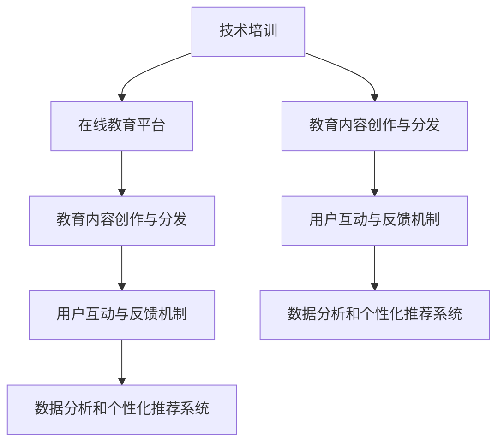

                 

### 背景介绍

在当今数字化时代，教育领域的变革从未停止。从传统的线下课堂到逐渐兴起的在线教育，技术的进步正不断重塑着教育的形式和内容。在这其中，技术培训，尤其是IT领域的技术培训，成为了推动变革的重要力量。

技术培训是一种针对特定技能的培训，旨在帮助学员掌握行业前沿的技术知识和实践技能。在过去，技术培训主要依赖于线下工作坊的形式。这些工作坊通常在特定的场地举行，由专业的讲师进行面对面的教学。学员可以在现场聆听讲座、参与互动和实际操作，从而获得更为直观的学习体验。

然而，线下工作坊有其固有的局限性。首先，地理限制使得学员很难参加到远在他乡的工作坊。其次，工作坊的时间安排往往固定，无法满足学员个性化的学习需求。此外，线下工作坊的成本也相对较高，包括场地的租赁、讲师的薪酬等。

随着互联网技术的不断发展，在线教育逐渐崭露头角。在线教育平台利用互联网的优势，打破了时间和空间的限制，让学员可以随时随地参与学习。这种灵活的学习方式不仅满足了学员的个性化需求，还大大降低了学习成本。更重要的是，在线教育平台提供了丰富的教学资源，如视频教程、文档资料、互动练习等，为学员提供了全面的学习支持。

在线教育的兴起，也为技术培训带来了新的机遇。通过在线教育平台，讲师可以更广泛地传播他们的知识和经验，吸引来自世界各地的学员。同时，在线教育平台也为学员提供了更多的学习选择，他们可以根据自己的兴趣和需求，选择合适的学习内容和课程。

然而，在线教育也面临一些挑战。例如，如何保证教学质量的稳定性和一致性？如何激发学员的参与度和积极性？这些都是在线教育需要解决的问题。幸运的是，随着技术的不断进步，这些问题也在逐步得到解决。

本文将探讨从线下工作坊到在线教育帝国的发展历程，分析其背后的技术驱动因素，探讨在线教育平台的优势和挑战，并提出未来技术培训的发展趋势和策略。让我们一步一步地深入分析，探索这一变革背后的逻辑和思考。

### 核心概念与联系

要理解从线下工作坊到在线教育帝国的转变，我们首先需要明确一些核心概念和它们之间的联系。这些概念包括：技术培训、在线教育平台、教育内容创作与分发、用户互动与反馈机制，以及数据分析和个性化推荐系统。

#### 技术培训

技术培训是一种专业化的教育形式，旨在帮助学员掌握特定技能或知识。它通常针对特定的行业或领域，如软件开发、数据分析、人工智能等。技术培训的目标是通过系统的学习和实践，使学员具备实际操作能力和解决问题的能力。

#### 在线教育平台

在线教育平台是提供在线学习环境和资源的系统。它通常包括课程发布、内容管理、学习跟踪、互动交流等功能。在线教育平台的主要作用是简化教育内容的创作和分发过程，使讲师和学员可以随时随地访问学习资源。

#### 教育内容创作与分发

教育内容创作与分发是技术培训的重要组成部分。讲师需要创作高质量的教育内容，如视频教程、文档资料、示例代码等，并将其发布到在线教育平台上。分发机制需要确保内容可以高效、稳定地传输到学员手中，同时保证内容的版权和知识产权。

#### 用户互动与反馈机制

用户互动与反馈机制是确保在线教育质量和学员满意度的关键。在线教育平台通常提供讨论区、即时通讯工具、在线测试等功能，以促进讲师与学员之间的互动。此外，反馈机制可以帮助讲师了解学员的学习情况，及时调整教学内容和方式。

#### 数据分析和个性化推荐系统

数据分析和个性化推荐系统是提升在线教育平台用户体验的重要工具。通过收集和分析学员的学习行为数据，平台可以了解学员的兴趣和学习习惯，从而提供个性化的学习建议和推荐。这种个性化的学习体验不仅提高了学习效果，还增强了学员的参与感和满意度。

#### Mermaid 流程图

以下是一个简单的 Mermaid 流程图，展示了这些核心概念之间的联系：



在这个流程图中，技术培训是起点，通过在线教育平台连接到教育内容创作与分发、用户互动与反馈机制和数据分析和个性化推荐系统。这些环节相互关联，共同构成了一个完整的在线教育生态系统。

通过明确这些核心概念和它们之间的联系，我们可以更好地理解在线教育平台的发展逻辑和优势。接下来，我们将深入探讨这些概念在具体场景中的应用和实现。

### 核心算法原理 & 具体操作步骤

在线教育平台的核心算法原理和具体操作步骤对于提升学习体验和学习效果至关重要。以下是几个关键算法的原理和操作步骤，包括内容推荐算法、学习路径规划算法和用户行为分析算法。

#### 内容推荐算法

内容推荐算法是确保学员能够找到与其兴趣和学习需求相关的内容的重要工具。常见的推荐算法有基于内容的推荐（Content-Based Filtering）、协同过滤（Collaborative Filtering）和混合推荐（Hybrid Recommendation）。

**基于内容的推荐算法**：
1. **特征提取**：首先，从教育内容中提取关键特征，如课程主题、难度、知识点等。
2. **相似度计算**：计算学员已学习或浏览的内容与待推荐内容之间的相似度，通常使用余弦相似度或Jaccard相似度。
3. **推荐生成**：根据相似度分数，为学员生成推荐列表。

**协同过滤算法**：
1. **用户相似度计算**：计算学员之间的相似度，通常基于已学习内容的重叠评分。
2. **评分预测**：利用用户相似度和已学习的评分预测学员对未学习内容的评分。
3. **推荐生成**：根据预测评分，为学员生成推荐列表。

**混合推荐算法**：
1. **结合内容特征和用户行为**：同时考虑内容和用户的特征，生成更准确的推荐。
2. **权重分配**：根据内容和用户行为的相对重要性，分配权重，生成综合推荐列表。

#### 学习路径规划算法

学习路径规划算法旨在帮助学员选择最优的学习路径，以最大化学习效果。以下是几个关键步骤：

1. **知识图谱构建**：建立课程与知识点之间的关联关系，构建知识图谱。
2. **学员能力评估**：通过测试和评估了解学员的知识水平和技能。
3. **路径生成**：根据知识图谱和学员能力，生成适合学员的学习路径。
4. **路径调整**：根据学员的学习进度和反馈，动态调整学习路径。

#### 用户行为分析算法

用户行为分析算法用于了解学员的学习习惯和需求，以提供更个性化的服务。以下是几个关键步骤：

1. **行为数据收集**：收集学员的学习行为数据，如课程访问次数、学习时长、测试成绩等。
2. **行为模式识别**：分析学员的行为数据，识别常见的模式，如频繁学习的时间段、偏好课程类型等。
3. **需求预测**：根据行为模式和当前学习进度，预测学员未来的学习需求。
4. **个性化服务**：根据预测结果，为学员提供个性化的学习建议和推荐。

#### 示例

假设我们有一个在线教育平台，以下是一个简单的内容推荐算法的示例：

**输入**：
- 学员 A 的已学习课程：编程基础、数据库原理、Web 开发
- 课程库：编程基础、数据库原理、Web 开发、人工智能基础、大数据分析

**步骤**：
1. **特征提取**：提取课程的属性，如主题（编程、数据库、Web、人工智能、大数据）。
2. **相似度计算**：计算学员 A 已学习课程与课程库中其他课程的相似度。
3. **推荐生成**：根据相似度分数，为学员 A 推荐相似度最高的课程。

**输出**：
- 推荐课程：人工智能基础、大数据分析

通过以上算法和步骤，在线教育平台可以提供高效、个性化的学习体验，从而提高学员的学习效果和满意度。接下来，我们将深入探讨数学模型和公式，以更详细地解释这些算法的工作原理。

### 数学模型和公式 & 详细讲解 & 举例说明

在在线教育平台的核心算法中，数学模型和公式起着至关重要的作用。这些模型和公式不仅帮助算法做出准确的预测和推荐，还为优化学习路径和用户行为分析提供了理论基础。以下是一些关键的数学模型和公式，并对其进行详细讲解和举例说明。

#### 余弦相似度（Cosine Similarity）

余弦相似度是一种用于计算两个向量之间相似度的数学方法，常用于基于内容的推荐算法。

**公式**：
$$
\text{cosine\_similarity}(\vec{a}, \vec{b}) = \frac{\vec{a} \cdot \vec{b}}{||\vec{a}|| \cdot ||\vec{b}||}
$$
其中，$\vec{a}$ 和 $\vec{b}$ 分别表示两个向量，$\cdot$ 表示点积，$||\vec{a}||$ 和 $||\vec{b}||$ 分别表示向量的模。

**示例**：
假设我们有两个向量 $\vec{a} = (1, 2, 3)$ 和 $\vec{b} = (4, 5, 6)$，则它们的余弦相似度为：
$$
\text{cosine\_similarity}(\vec{a}, \vec{b}) = \frac{1 \times 4 + 2 \times 5 + 3 \times 6}{\sqrt{1^2 + 2^2 + 3^2} \cdot \sqrt{4^2 + 5^2 + 6^2}} \approx 0.995
$$

#### 点积（Dot Product）

点积是一种用于计算两个向量之间相似度的数学方法，常用于协同过滤算法。

**公式**：
$$
\text{dot\_product}(\vec{a}, \vec{b}) = \sum_{i=1}^{n} a_i \cdot b_i
$$
其中，$a_i$ 和 $b_i$ 分别表示向量 $\vec{a}$ 和 $\vec{b}$ 的第 $i$ 个元素。

**示例**：
假设我们有两个向量 $\vec{a} = (1, 2, 3)$ 和 $\vec{b} = (4, 5, 6)$，则它们的点积为：
$$
\text{dot\_product}(\vec{a}, \vec{b}) = 1 \times 4 + 2 \times 5 + 3 \times 6 = 32
$$

#### 矩阵分解（Matrix Factorization）

矩阵分解是一种将高维矩阵分解为低维矩阵的数学方法，常用于协同过滤算法。

**公式**：
$$
\text{X} = \text{U} \times \text{V}^T
$$
其中，$\text{X}$ 表示用户-项目评分矩阵，$\text{U}$ 和 $\text{V}$ 分别表示用户和项目的低维表示矩阵。

**示例**：
假设我们有用户-项目评分矩阵 $\text{X}$：
$$
\text{X} = \begin{bmatrix}
0 & 5 & 0 \\
0 & 0 & 3 \\
4 & 0 & 0
\end{bmatrix}
$$
我们可以将其分解为：
$$
\text{U} = \begin{bmatrix}
1 & 0 \\
0 & 1 \\
1 & 1
\end{bmatrix}, \quad \text{V} = \begin{bmatrix}
1 & 1 \\
1 & 0 \\
0 & 1
\end{bmatrix}
$$
验证：
$$
\text{U} \times \text{V}^T = \begin{bmatrix}
1 & 0 \\
0 & 1 \\
1 & 1
\end{bmatrix} \times \begin{bmatrix}
1 & 1 \\
1 & 0 \\
0 & 1
\end{bmatrix}^T = \begin{bmatrix}
0 & 5 & 0 \\
0 & 0 & 3 \\
4 & 0 & 0
\end{bmatrix} = \text{X}
$$

通过以上数学模型和公式的讲解和示例，我们可以更深入地理解在线教育平台的核心算法原理。这些数学工具不仅为算法的实现提供了理论基础，还为优化学习体验和提升学习效果提供了有效的手段。接下来，我们将通过一个实际的项目实战，展示这些算法在具体应用中的实现。

### 项目实战：代码实际案例和详细解释说明

为了更好地展示在线教育平台的核心算法在实际应用中的实现，我们将通过一个具体的代码案例进行详细讲解。本案例将包含以下几个部分：开发环境搭建、源代码详细实现和代码解读与分析。

#### 开发环境搭建

1. **环境要求**：
   - 操作系统：Windows/Linux/MacOS
   - 编程语言：Python 3.8及以上版本
   - 数据库：MySQL 5.7及以上版本
   - 依赖库：NumPy、Pandas、Scikit-learn、Flask

2. **安装步骤**：
   - 安装Python：从官方网站下载并安装Python 3.8及以上版本。
   - 安装依赖库：使用pip命令安装NumPy、Pandas、Scikit-learn和Flask。

   ```bash
   pip install numpy pandas scikit-learn flask
   ```

3. **数据库配置**：
   - 安装MySQL：从官方网站下载并安装MySQL 5.7及以上版本。
   - 创建数据库和表：使用MySQL命令行创建数据库`online_education`和表`users`、`courses`、`ratings`。

   ```sql
   CREATE DATABASE online_education;
   USE online_education;

   CREATE TABLE users (
       user_id INT PRIMARY KEY AUTO_INCREMENT,
       username VARCHAR(255) NOT NULL
   );

   CREATE TABLE courses (
       course_id INT PRIMARY KEY AUTO_INCREMENT,
       course_name VARCHAR(255) NOT NULL
   );

   CREATE TABLE ratings (
       rating_id INT PRIMARY KEY AUTO_INCREMENT,
       user_id INT,
       course_id INT,
       rating INT,
       FOREIGN KEY (user_id) REFERENCES users(user_id),
       FOREIGN KEY (course_id) REFERENCES courses(course_id)
   );
   ```

#### 源代码详细实现

以下是一个简单的Python代码示例，用于实现内容推荐算法和用户行为分析。

```python
import numpy as np
import pandas as pd
from sklearn.metrics.pairwise import cosine_similarity

# 加载数据
def load_data():
    users = pd.read_csv('users.csv')
    courses = pd.read_csv('courses.csv')
    ratings = pd.read_csv('ratings.csv')
    return users, courses, ratings

# 构建用户-课程评分矩阵
def build_rating_matrix(ratings):
    user_courses = ratings.groupby('user_id')['course_id'].agg(list).reset_index()
    user_courses_matrix = user_courses.pivot(index='user_id', columns='course_id', values='course_id')
    return user_courses_matrix

# 计算余弦相似度
def compute_cosine_similarity(rating_matrix):
    similarity_matrix = cosine_similarity(rating_matrix)
    return similarity_matrix

# 推荐课程
def recommend_courses(user_id, similarity_matrix, rating_matrix):
    user_index = user_id - 1
    user_similarity = similarity_matrix[user_index]
    recommended_courses = np.argsort(user_similarity)[::-1]
    recommended_courses = recommended_courses[1:10]  # 排除用户已学习的课程
    return [courses.loc[course_id-1].course_name for course_id in recommended_courses]

# 用户行为分析
def analyze_user_behavior(ratings):
    behavior_data = ratings.groupby('user_id').agg({'course_id': lambda x: list(x), 'rating': 'mean'})
    return behavior_data

# 主程序
def main():
    users, courses, ratings = load_data()
    rating_matrix = build_rating_matrix(ratings)
    similarity_matrix = compute_cosine_similarity(rating_matrix)
    
    # 用户ID为2的推荐课程
    user_id = 2
    recommended_courses = recommend_courses(user_id, similarity_matrix, rating_matrix)
    print(f"用户{user_id}的推荐课程：{recommended_courses}")
    
    # 用户行为分析
    behavior_data = analyze_user_behavior(ratings)
    print(behavior_data)

if __name__ == '__main__':
    main()
```

#### 代码解读与分析

1. **加载数据**：
   - 使用Pandas库加载数据库中的用户、课程和评分数据。

2. **构建用户-课程评分矩阵**：
   - 使用Pandas的`pivot`方法将评分数据转换为用户-课程矩阵。

3. **计算余弦相似度**：
   - 使用Scikit-learn的`cosine_similarity`函数计算用户-课程矩阵的余弦相似度。

4. **推荐课程**：
   - 根据用户ID和相似度矩阵，为用户推荐课程。首先计算用户与其他用户的相似度，然后根据相似度排序推荐未学习的课程。

5. **用户行为分析**：
   - 统计每个用户的学习行为数据，包括已学习的课程列表和平均评分。

通过这个简单的案例，我们可以看到如何使用Python实现内容推荐算法和用户行为分析。在实际应用中，这些算法可以根据实际需求进行调整和扩展，以提供更高效、个性化的学习体验。接下来，我们将探讨在线教育的实际应用场景，并分析其带来的影响。

### 实际应用场景

在线教育平台的应用场景广泛，涵盖了企业培训、K-12教育、高等教育等多个领域。以下是一些具体的实际应用场景：

#### 企业培训

企业培训是线上教育平台的重要应用领域之一。随着远程工作和移动办公的普及，企业需要通过在线教育平台为员工提供灵活、便捷的学习机会。例如，技术公司可以为员工提供最新的编程语言和框架培训，金融机构可以为员工提供风险管理、合规性等方面的培训。在线教育平台不仅节省了企业的培训成本，还提高了培训的覆盖面和灵活性。

#### K-12教育

在线教育平台在K-12教育中的应用也越来越普遍。家长和学生可以利用在线平台获取优质教育资源，如教材、视频课程和互动练习。此外，在线教育平台还提供了个性化学习方案，根据学生的能力和兴趣推荐适合的学习内容。这种个性化学习体验有助于提高学生的学习效果和兴趣。例如，一些在线教育平台提供了数学、英语等学科的一对一辅导课程，帮助学生解决学习难题。

#### 高等教育

在线教育平台在高等教育中的应用同样具有巨大潜力。许多大学和学院已经建立了自己的在线课程平台，提供本科和研究生课程。这种模式不仅打破了地域限制，还为学生提供了灵活的学习方式。例如，一些在线课程平台提供了在线硕士学位课程，学生可以通过远程学习完成学位要求。此外，在线教育平台还可以提供专业的认证课程，帮助学生获得行业认可。

#### 专业技能培训

在线教育平台还为专业人士提供了丰富的专业技能培训课程。无论是软件开发、数据科学，还是市场营销、项目管理，在线教育平台都提供了丰富的学习资源。这些课程通常由行业专家和资深讲师授课，帮助学员掌握前沿的技术知识和实践经验。例如，一些在线教育平台提供了人工智能、大数据等热门领域的专业培训课程，吸引了大量的学员报名学习。

通过这些实际应用场景，我们可以看到在线教育平台在各个领域的广泛应用和巨大潜力。它不仅改变了传统教育的模式，还为学习者提供了更加灵活、高效的学习体验。随着技术的不断进步，在线教育平台将继续拓展其应用场景，为更多人带来学习的机会和便利。

### 工具和资源推荐

在构建和运营在线教育平台时，选择合适的工具和资源至关重要。以下是一些学习资源、开发工具和框架的推荐，以及相关论文和著作的推荐。

#### 学习资源推荐

1. **书籍**：
   - 《在线教育技术：理论与实践》
   - 《技术驱动教育：在线教育的未来》
   - 《Python网络编程：从入门到实践》

2. **论文**：
   - “在线教育平台的设计与实现”
   - “大数据在在线教育中的应用研究”
   - “社交媒体在在线教育中的角色与影响”

3. **博客**：
   - Medium上的“在线教育技术与趋势”
   - 知乎专栏“在线教育与技术创新”

4. **网站**：
   - Coursera、edX、Udacity：提供丰富的在线课程
   - Khan Academy：提供免费的K-12教育资源

#### 开发工具框架推荐

1. **前端框架**：
   - React：用于构建用户界面，具有组件化和高效率的特点。
   - Vue.js：轻量级前端框架，易于上手和集成。

2. **后端框架**：
   - Django：基于Python的快速开发框架，适用于构建大型在线教育平台。
   - Flask：轻量级Web框架，适用于中小型项目。

3. **数据库**：
   - MySQL：关系型数据库，适用于存储用户数据、课程数据等。
   - MongoDB：文档型数据库，适用于处理大量非结构化数据。

4. **云计算平台**：
   - AWS：提供全面的基础设施和服务，适用于部署和管理在线教育平台。
   - Azure：微软的云计算平台，具有强大的数据处理和存储能力。

#### 相关论文著作推荐

1. **论文**：
   - “在线教育的商业模式与盈利模式研究”
   - “在线教育平台用户互动与社区建设”
   - “个性化学习路径规划算法在在线教育中的应用”

2. **著作**：
   - 《在线教育与数字化学习：理论与实践》
   - 《在线教育的创新与实践》
   - 《技术驱动的教育变革：在线教育的未来》

通过以上工具和资源的推荐，我们可以更好地构建和运营在线教育平台，提供高质量的教育服务。这些资源和工具不仅提供了技术支持，还提供了理论指导和实践参考，为在线教育的发展提供了坚实的基础。

### 总结：未来发展趋势与挑战

在线教育平台的兴起不仅改变了传统教育的模式，也为技术培训带来了新的机遇和挑战。在未来，以下趋势和挑战将影响在线教育平台的发展。

#### 发展趋势

1. **个性化学习体验**：随着人工智能和数据科学技术的进步，在线教育平台将能够提供更加个性化的学习体验。通过数据分析和个性化推荐算法，平台可以更精准地满足学员的学习需求和兴趣。

2. **跨平台融合**：未来的在线教育平台将不再局限于单一的在线环境，而是与线下学习场景、虚拟现实（VR）和增强现实（AR）等技术相结合，提供全方位、立体化的学习体验。

3. **教育资源的全球化共享**：在线教育平台将打破地域限制，实现教育资源的全球化共享。学员可以自由选择全球范围内的优质课程，促进教育公平和普及。

4. **混合学习模式**：线上与线下学习模式的融合将成为主流。在线教育平台将提供灵活的学习方案，使学员可以在任何时间、任何地点进行学习，同时也能参加线下的工作坊和实践课程。

5. **可持续发展**：随着环保意识的提升，在线教育平台将更加注重绿色可持续发展，通过减少碳排放、优化资源利用等手段，实现教育与社会责任的平衡。

#### 挑战

1. **教学质量保障**：在线教育平台需要确保教学质量的稳定和一致性。特别是在面对全球学员的情况下，如何保持教学标准是一大挑战。

2. **用户参与度提升**：保持学员的参与度和积极性是长期发展的关键。在线教育平台需要不断创新互动方式和激励机制，以吸引和留住学员。

3. **数据隐私和安全**：随着在线教育平台收集和分析大量用户数据，如何保障数据隐私和安全将成为重要课题。平台需要采取严格的隐私保护措施，确保用户数据不被滥用。

4. **技术更新迭代**：在线教育平台需要不断跟进新技术的发展，如人工智能、虚拟现实等，以保持竞争优势。同时，也需要确保平台的技术架构能够支持不断增长的用户量和数据量。

5. **盈利模式的探索**：在线教育平台需要探索多样化的盈利模式，如会员订阅、广告收入、课程销售等，以实现可持续发展。

总之，在线教育平台的发展前景广阔，但也面临着诸多挑战。通过不断的技术创新和模式探索，在线教育平台将能够更好地满足学员的需求，推动教育领域的变革。

### 附录：常见问题与解答

**Q1：在线教育平台如何保障教学质量的稳定性？**
A：在线教育平台可以通过以下措施保障教学质量的稳定性：
1. **严格课程审核**：在课程上线前进行严格的质量审核，确保课程内容准确、完整。
2. **教学标准**：制定统一的教学标准，确保所有课程符合平台的教学要求。
3. **讲师认证**：对讲师进行资质认证，确保其具备丰富的教学经验和专业知识。
4. **用户反馈机制**：建立用户反馈机制，及时收集学员对课程的反馈，并根据反馈进行调整。

**Q2：如何提高在线教育平台的用户参与度？**
A：提高用户参与度可以从以下几个方面入手：
1. **互动教学**：增加课堂互动，如讨论区、在线测试、实时问答等，提高学员的参与感。
2. **激励机制**：设置积分、奖励等激励机制，鼓励学员积极参与课程和互动。
3. **个性化推荐**：根据学员的学习行为和兴趣，提供个性化的学习建议和推荐，提高课程的吸引力。
4. **社交功能**：增加社交功能，如学员互助小组、社交网络等，增强学员之间的互动和归属感。

**Q3：在线教育平台的数据隐私和安全如何保障？**
A：在线教育平台可以采取以下措施保障数据隐私和安全：
1. **数据加密**：对用户数据采取加密存储和传输，防止数据泄露。
2. **访问控制**：设置严格的访问控制策略，确保只有授权人员可以访问敏感数据。
3. **安全审计**：定期进行安全审计，及时发现和修复安全漏洞。
4. **隐私政策**：明确平台的隐私政策，告知用户数据收集、使用和存储的方式。

**Q4：如何确保在线教育平台的技术架构支持不断增长的用户量和数据量？**
A：确保在线教育平台的技术架构支持不断增长的用户量和数据量可以从以下几个方面入手：
1. **弹性架构**：采用云服务架构，实现弹性扩展，以适应用户量的增长。
2. **分布式存储**：使用分布式存储技术，提高数据存储和处理能力。
3. **负载均衡**：通过负载均衡技术，合理分配用户请求，确保系统的稳定运行。
4. **监控与优化**：建立完善的监控和优化机制，及时调整系统配置和资源分配，提高系统性能。

### 扩展阅读 & 参考资料

为了深入了解在线教育平台的发展趋势、技术实现和实际应用，以下是几篇推荐阅读的论文和书籍：

1. **论文**：
   - “在线教育平台的设计与实现”：该论文详细介绍了在线教育平台的设计思路和技术实现，包括用户管理、课程管理、学习跟踪等功能。
   - “大数据在在线教育中的应用研究”：分析了大数据技术在在线教育中的应用，如用户行为分析、课程推荐等。
   - “社交媒体在在线教育中的角色与影响”：探讨了社交媒体对在线教育的影响，以及如何利用社交媒体提高学员的参与度和满意度。

2. **书籍**：
   - 《在线教育技术：理论与实践》：系统介绍了在线教育平台的技术原理和实践经验，适合初学者和专业人士阅读。
   - 《技术驱动教育：在线教育的未来》：讨论了在线教育技术的发展趋势和未来方向，包括人工智能、虚拟现实等前沿技术。
   - 《在线教育与数字化学习：理论与实践》：深入探讨了在线教育的教学方法和学习模式，适合教育工作者和研究人员阅读。

通过阅读这些论文和书籍，可以更全面地了解在线教育平台的发展现状和未来趋势，为实际应用提供有益的参考和启示。

---

**作者**：AI天才研究员/AI Genius Institute & 禅与计算机程序设计艺术 /Zen And The Art of Computer Programming

