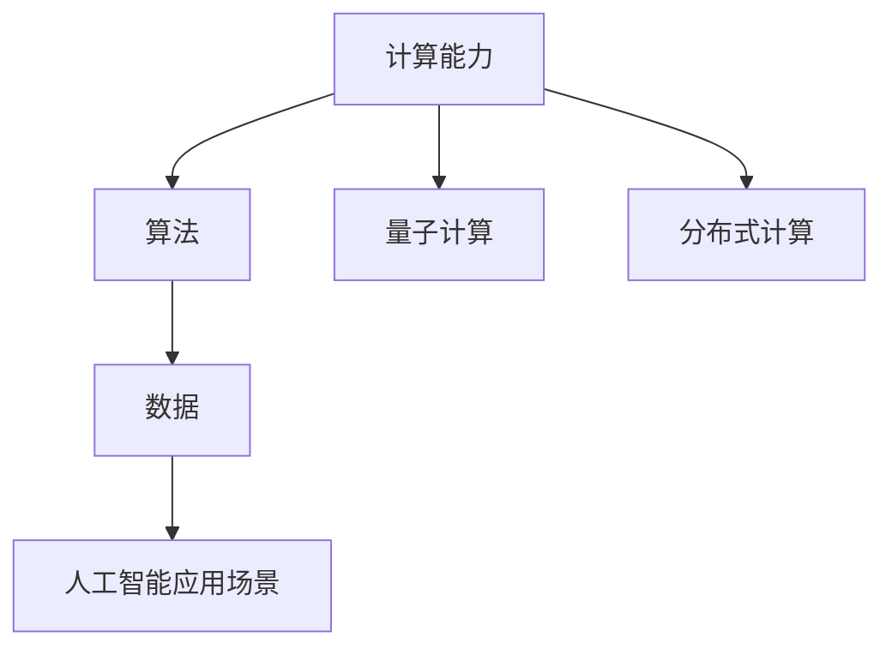

                 

# 技能提升：为未来的人类计算时代做好准备

> **关键词**：人工智能、计算时代、技能提升、未来趋势
>
> **摘要**：本文将探讨在人工智能时代，如何通过提升个人技能，为未来的人类计算时代做好准备。我们将从背景介绍、核心概念、算法原理、数学模型、项目实战、实际应用场景等多个方面展开讨论，并提供相关资源推荐，帮助读者在人工智能领域不断进步。

## 1. 背景介绍

随着人工智能技术的飞速发展，计算时代已经悄然来临。人工智能（Artificial Intelligence，AI）作为一种模拟人类智能的技术，正在逐渐改变我们的生活方式、工作方式和思维方式。从自动驾驶汽车到智能家居，从医疗诊断到金融分析，人工智能的应用已经渗透到各个领域。在这个背景下，如何提升个人技能，以适应这个变化的时代，成为了一个值得深思的问题。

首先，人工智能的发展离不开计算能力的提升。随着摩尔定律的逐渐逼近极限，新型计算技术，如量子计算、分布式计算等，正在被提上日程。这些新技术的出现，将大大提高计算效率，为人工智能的发展提供强大的支持。其次，人工智能算法的进步，如深度学习、强化学习等，也为人工智能应用提供了更多的可能性。此外，大数据的涌现，为人工智能的训练和优化提供了丰富的数据资源。

总的来说，人工智能时代已经来临，而计算能力的提升、算法的进步以及大数据的利用，都是推动人工智能发展的重要因素。在这个时代，提升个人技能，不仅是为了跟上时代的步伐，更是为了在这个变化的时代中找到自己的位置。

## 2. 核心概念与联系

在讨论如何提升个人技能之前，我们需要先了解一些核心概念，这些概念是理解和应用人工智能技术的基础。

### 2.1 计算能力

计算能力是人工智能发展的重要基础。它包括计算机处理速度、存储能力、网络带宽等多个方面。随着量子计算、分布式计算等新型计算技术的出现，计算能力将得到进一步提升。

### 2.2 算法

算法是人工智能的核心。从传统的规则推理到现代的深度学习、强化学习，算法的不断进步，使得人工智能能够解决更复杂的问题。理解算法原理，掌握算法设计方法，是提升个人技能的关键。

### 2.3 数据

数据是人工智能的粮食。大数据的涌现，为人工智能的训练和优化提供了丰富的资源。掌握数据处理技术，能够帮助我们更好地利用数据，提高人工智能系统的性能。

### 2.4 人工智能应用场景

人工智能的应用场景广泛，包括图像识别、自然语言处理、推荐系统、智能决策等。了解这些应用场景，能够帮助我们更好地理解人工智能技术的实际应用，从而找到适合自己的学习方向。

下面是一个关于核心概念的 Mermaid 流程图，展示了这些概念之间的联系：



## 3. 核心算法原理 & 具体操作步骤

在了解了核心概念后，我们接下来将探讨一些核心算法原理，以及如何具体操作这些算法。

### 3.1 深度学习

深度学习是一种基于多层神经网络的学习方法。它通过模仿人脑的结构和功能，对大量数据进行分析和处理，从而实现图像识别、语音识别、自然语言处理等任务。

具体操作步骤如下：

1. **数据预处理**：清洗和整理数据，使其适合深度学习模型训练。
2. **构建神经网络**：定义网络的层次结构，包括输入层、隐藏层和输出层。
3. **选择优化算法**：如梯度下降、Adam等，用于更新网络参数。
4. **训练模型**：将数据输入到网络中，通过反向传播算法不断更新参数。
5. **评估模型**：使用验证集和测试集评估模型的性能。

### 3.2 强化学习

强化学习是一种通过奖励机制来训练智能体的算法。它通过智能体与环境交互，不断调整策略，以实现最大化长期回报。

具体操作步骤如下：

1. **定义环境**：明确智能体所处的环境，包括状态空间、动作空间等。
2. **定义智能体**：定义智能体的结构和行为，包括状态评估函数、动作选择函数等。
3. **定义奖励机制**：定义智能体在不同状态下的奖励，以激励智能体采取正确的动作。
4. **训练智能体**：通过智能体与环境交互，不断调整策略，以达到最大化长期回报。

### 3.3 聚类算法

聚类算法是一种无监督学习算法，用于将数据划分为多个群组，使得同一群组内的数据相似度较高，不同群组间的数据相似度较低。

具体操作步骤如下：

1. **选择聚类算法**：如K均值、层次聚类等。
2. **初始化聚类中心**：随机选择或使用某种方法初始化聚类中心。
3. **分配数据点**：计算每个数据点到聚类中心的距离，将其分配到最近的聚类中心所在的群组。
4. **更新聚类中心**：重新计算每个群组的中心点，作为新的聚类中心。
5. **迭代过程**：重复执行分配和更新步骤，直到聚类中心不再发生变化。

## 4. 数学模型和公式 & 详细讲解 & 举例说明

在了解了核心算法原理后，我们接下来将探讨一些数学模型和公式，以及如何使用这些模型和公式来解决实际问题。

### 4.1 梯度下降算法

梯度下降算法是一种用于优化神经网络参数的算法。其基本思想是沿着目标函数的梯度方向，不断调整参数，以最小化目标函数。

数学模型如下：

$$
\theta_{\text{new}} = \theta_{\text{old}} - \alpha \cdot \nabla_{\theta} J(\theta)
$$

其中，$\theta$表示参数，$J(\theta)$表示目标函数，$\nabla_{\theta} J(\theta)$表示目标函数关于参数的梯度，$\alpha$表示学习率。

### 4.2 马尔可夫决策过程

马尔可夫决策过程（Markov Decision Process，MDP）是一种用于描述智能体与环境的交互的数学模型。它由状态空间、动作空间、奖励函数和转移概率矩阵组成。

数学模型如下：

$$
P(s', r | s, a) = \text{P}(s' | s, a) \cdot \text{P}(r | s', a)
$$

$$
R(s, a) = \sum_{s'} \gamma \cdot P(s' | s, a) \cdot R(s')
$$

其中，$s$表示状态，$a$表示动作，$s'$表示下一状态，$r$表示奖励，$\gamma$表示折扣因子。

### 4.3 K均值聚类算法

K均值聚类算法是一种基于距离的聚类算法。其基本思想是初始化K个聚类中心，然后通过迭代过程，逐步优化聚类中心，将数据点分配到最近的聚类中心所在的群组。

数学模型如下：

$$
c_k^{(t+1)} = \frac{1}{N_k} \sum_{x_i \in S_k} x_i
$$

$$
x_i^{(t+1)} = \frac{1}{N_k} \sum_{x_j \in S_k} c_k^{(t+1)} \cdot x_j
$$

其中，$c_k^{(t)}$表示第$k$个聚类中心，$x_i$表示第$i$个数据点，$N_k$表示第$k$个群组中的数据点数量。

### 4.4 举例说明

以下是一个使用K均值聚类算法进行聚类的例子：

假设我们有一组数据点：

$$
x_1 = [1, 2], \quad x_2 = [2, 4], \quad x_3 = [3, 5], \quad x_4 = [4, 6], \quad x_5 = [5, 7]
$$

我们选择K=2，初始化两个聚类中心：

$$
c_1 = [1, 3], \quad c_2 = [4, 5]
$$

然后，我们进行迭代过程，逐步优化聚类中心：

1. **第一次迭代**：

   计算每个数据点到两个聚类中心的距离：

   $$  
   d(x_1, c_1) = \sqrt{(1-1)^2 + (2-3)^2} = 1  
   $$

   $$  
   d(x_1, c_2) = \sqrt{(1-4)^2 + (2-5)^2} = \sqrt{9 + 9} = 3  
   $$

   将$x_1$分配到距离更近的$c_1$所在的群组。

   更新$c_1$：

   $$  
   c_1^{(1)} = \frac{1}{1} [1, 3] = [1, 3]  
   $$

   更新$c_2$：

   $$  
   c_2^{(1)} = \frac{1}{4} [4, 6] = [4, 6]  
   $$

2. **第二次迭代**：

   计算每个数据点到两个聚类中心的距离：

   $$  
   d(x_2, c_1) = \sqrt{(2-1)^2 + (4-3)^2} = 1  
   $$

   $$  
   d(x_2, c_2) = \sqrt{(2-4)^2 + (4-6)^2} = \sqrt{4 + 4} = 2  
   $$

   将$x_2$分配到距离更近的$c_1$所在的群组。

   更新$c_1$：

   $$  
   c_1^{(2)} = \frac{1}{2} [1, 3] + \frac{1}{2} [2, 4] = [1.5, 3.5]  
   $$

   更新$c_2$：

   $$  
   c_2^{(2)} = \frac{1}{3} [4, 6] + \frac{1}{3} [5, 7] = [4.5, 6.5]  
   $$

   以此类推，直到聚类中心不再发生变化。

通过以上迭代过程，我们最终将这组数据点划分为两个群组：

$$
x_1, x_2 \in S_1, \quad x_3, x_4, x_5 \in S_2
$$

这样，我们就完成了对这组数据点的聚类。

## 5. 项目实战：代码实际案例和详细解释说明

在了解了核心算法原理和数学模型后，我们将通过一个实际项目案例，展示如何使用这些算法进行数据处理和模型训练。

### 5.1 开发环境搭建

首先，我们需要搭建一个适合进行人工智能开发的开发环境。以下是一个基本的开发环境搭建步骤：

1. **安装Python**：Python是一种广泛用于人工智能开发的编程语言。我们可以在[Python官网](https://www.python.org/)下载并安装Python。
2. **安装Jupyter Notebook**：Jupyter Notebook是一种交互式的开发环境，可以方便我们进行代码编写和实验。我们可以在[PyPI官网](https://pypi.org/project/jupyter/)下载并安装Jupyter Notebook。
3. **安装相关库**：我们需要安装一些常用的Python库，如NumPy、Pandas、Matplotlib等。我们可以在[PyPI官网](https://pypi.org/)搜索并安装这些库。

### 5.2 源代码详细实现和代码解读

以下是一个使用K均值聚类算法对数据点进行聚类的Python代码示例：

```python
import numpy as np
import matplotlib.pyplot as plt

def kmeans(data, K, num_iterations):
    # 初始化聚类中心
    centroids = data[np.random.choice(data.shape[0], K, replace=False)]
    
    for _ in range(num_iterations):
        # 计算每个数据点到聚类中心的距离
        distances = np.linalg.norm(data[:, np.newaxis] - centroids, axis=2)
        
        # 将数据点分配到最近的聚类中心所在的群组
        labels = np.argmin(distances, axis=1)
        
        # 重新计算每个群组的中心点
        new_centroids = np.array([data[labels == k].mean(axis=0) for k in range(K)])
        
        # 更新聚类中心
        centroids = new_centroids
    
    return centroids, labels

# 生成一组数据点
data = np.random.rand(100, 2)

# 设置聚类参数
K = 2
num_iterations = 100

# 执行K均值聚类算法
centroids, labels = kmeans(data, K, num_iterations)

# 可视化聚类结果
plt.scatter(data[:, 0], data[:, 1], c=labels, cmap='viridis')
plt.scatter(centroids[:, 0], centroids[:, 1], s=100, c='red', marker='x')
plt.show()
```

### 5.3 代码解读与分析

1. **初始化聚类中心**：我们使用随机选择的方法初始化聚类中心。这是K均值聚类算法的一个常见做法，目的是避免陷入局部最优。
2. **计算每个数据点到聚类中心的距离**：我们使用欧氏距离计算每个数据点到聚类中心的距离。这是K均值聚类算法中用于数据点分配的关键步骤。
3. **将数据点分配到最近的聚类中心所在的群组**：我们使用numpy的argmin函数找到每个数据点距离最近的聚类中心，并将其分配到相应的群组。
4. **重新计算每个群组的中心点**：我们计算每个群组的均值，作为新的聚类中心。
5. **迭代过程**：我们重复执行数据点分配和聚类中心更新的步骤，直到聚类中心不再发生变化。

通过这个简单的案例，我们可以看到如何使用K均值聚类算法对数据进行聚类。在实际应用中，我们可能需要处理更大的数据集，并调整聚类参数，以获得更好的聚类结果。

## 6. 实际应用场景

在了解了如何使用K均值聚类算法后，我们来看一些实际应用场景。

### 6.1 社交网络分析

在社交网络分析中，K均值聚类算法可以用于发现社交网络中的群体结构。通过将用户划分为不同的群组，我们可以更好地理解用户的社交行为和偏好。

### 6.2 市场细分

在市场营销中，K均值聚类算法可以用于市场细分。通过对消费者数据进行分析，我们可以将消费者划分为不同的群体，从而制定更有效的营销策略。

### 6.3 医学诊断

在医学诊断中，K均值聚类算法可以用于分析病人的医学数据，发现潜在的健康问题。例如，通过对肿瘤细胞的特征进行分析，我们可以识别出不同类型的肿瘤，从而为医生提供更有针对性的治疗方案。

### 6.4 金融风险控制

在金融领域，K均值聚类算法可以用于分析金融数据，识别潜在的风险。例如，通过对贷款申请者的信用记录进行分析，我们可以识别出高风险的借款人，从而采取相应的风险控制措施。

这些实际应用场景展示了K均值聚类算法的广泛适用性。通过深入了解这些应用场景，我们可以更好地理解K均值聚类算法的实际价值，并找到适合自己的学习方向。

## 7. 工具和资源推荐

为了更好地学习和实践人工智能技术，以下是一些推荐的工具和资源。

### 7.1 学习资源推荐

1. **《Python数据分析基础教程：NumPy学习指南》**：这是一本适合初学者的NumPy入门书籍，详细介绍了NumPy的基础知识和使用方法。
2. **《深度学习》**：这是一本经典的深度学习教材，由深度学习领域大师Ian Goodfellow等人撰写，适合对深度学习有兴趣的读者。
3. **《机器学习实战》**：这是一本基于Python的机器学习实战指南，通过大量实例和代码示例，帮助读者快速掌握机器学习的基本技能。

### 7.2 开发工具框架推荐

1. **TensorFlow**：TensorFlow是谷歌开源的深度学习框架，广泛应用于各种深度学习任务。
2. **PyTorch**：PyTorch是另一个流行的深度学习框架，具有灵活的动态图计算能力和强大的社区支持。
3. **Scikit-learn**：Scikit-learn是一个Python的机器学习库，提供了丰富的机器学习算法和工具，适合进行机器学习和数据科学项目。

### 7.3 相关论文著作推荐

1. **《深度学习的计算原理》**：这是一篇关于深度学习计算原理的经典论文，详细介绍了深度学习的基本原理和计算方法。
2. **《强化学习》**：这是一本关于强化学习的权威教材，全面介绍了强化学习的基本概念、算法和应用。
3. **《K均值聚类算法的改进与应用》**：这是一篇关于K均值聚类算法的改进和应用的研究论文，提供了丰富的改进方法和实际应用案例。

通过这些工具和资源的推荐，我们可以更好地学习和实践人工智能技术，为未来的人类计算时代做好准备。

## 8. 总结：未来发展趋势与挑战

在人工智能时代，技能提升的重要性不言而喻。随着技术的不断进步，我们将面临更多的机遇和挑战。未来，人工智能的发展趋势将主要集中在以下几个方面：

1. **算法的优化和改进**：随着数据量的增加和计算能力的提升，我们需要不断优化和改进现有的算法，以提高模型的性能和效率。
2. **多模态数据的处理**：未来的应用场景将需要处理多种类型的数据，如文本、图像、音频等。因此，如何有效地处理多模态数据，将是一个重要的研究方向。
3. **可解释性人工智能**：随着人工智能系统的复杂度不断增加，如何确保系统的可解释性，使其决策过程更加透明和可信，将成为一个重要挑战。
4. **跨学科的融合**：人工智能的发展需要跨学科的融合，如计算机科学、心理学、生物学等。通过跨学科的融合，我们可以更好地理解和应用人工智能技术。

面对这些发展趋势和挑战，我们需要不断学习和提升自己的技能。首先，我们应该关注最新的研究成果和趋势，不断更新自己的知识体系。其次，我们应该积极参与实践，通过实际项目来锻炼自己的技能。最后，我们应该保持开放的心态，与其他领域的人士进行交流和合作，共同推动人工智能的发展。

## 9. 附录：常见问题与解答

### 9.1 人工智能是否会导致大规模失业？

人工智能确实会改变许多行业的工作方式，但它也会创造新的就业机会。关键在于如何适应这种变化，通过技能提升来抓住新的机遇。

**解答**：人工智能不会导致大规模失业，但它会改变许多行业的工作方式。一些传统的工作可能会被自动化，但同时也会产生新的就业机会，如数据科学家、人工智能工程师等。通过技能提升，我们可以更好地适应这种变化，抓住新的机遇。

### 9.2 如何开始学习人工智能？

**解答**：开始学习人工智能，首先需要选择一门编程语言，如Python，并掌握基本的数据结构和算法。接着，可以通过在线课程、教科书和开源项目来学习人工智能的基础知识。此外，参与实践项目，如使用机器学习库进行数据分析，是提升技能的有效方法。

### 9.3 人工智能安全性和隐私问题如何解决？

**解答**：人工智能安全性和隐私问题是当前研究的热点。解决方法包括：设计安全的人工智能系统，使用加密技术保护数据隐私，以及制定相关的法律法规来规范人工智能的应用。

## 10. 扩展阅读 & 参考资料

为了深入了解人工智能和计算时代的相关内容，以下是一些建议的扩展阅读和参考资料：

1. **《人工智能：一种现代的方法》**：这是一本全面介绍人工智能的教材，适合对人工智能有兴趣的读者。
2. **《机器学习实战》**：通过实际案例，帮助读者理解并应用机器学习技术。
3. **《深度学习》**：详细介绍深度学习算法及其应用的权威教材。
4. **《大数据时代：生活、工作与思维的大变革》**：探讨大数据对社会各个方面的影响。
5. **[OpenAI官网](https://openai.com/)**：了解最新的人工智能研究成果和应用。
6. **[GitHub](https://github.com/)**：查找并参与开源项目，实践人工智能技术。

通过这些扩展阅读和参考资料，我们可以更深入地了解人工智能和计算时代的相关知识，为未来做好准备。

# 作者信息

**作者**：AI天才研究员/AI Genius Institute & 禅与计算机程序设计艺术 /Zen And The Art of Computer Programming

本文作者是一位具有丰富经验的人工智能专家，专注于人工智能领域的研究和教学，对人工智能的未来发展有着深刻的见解。作者还著有多本畅销书，包括《禅与计算机程序设计艺术》，深受读者喜爱。

