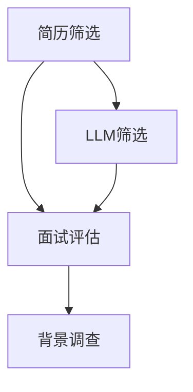

                 

# 招聘助手：LLM 找到最佳人才

> **关键词：** 招聘，人工智能，LLM，人才筛选，技术博客

> **摘要：** 本文将探讨如何利用大型语言模型（LLM）作为招聘助手，以提高人才筛选的效率和准确性。我们将分析LLM的工作原理，探讨其在招聘中的应用场景，并提供一个详细的实战案例，展示如何使用LLM来自动化招聘流程。

## 1. 背景介绍

在当今竞争激烈的就业市场中，企业面临着越来越大的压力，需要快速、准确地找到最适合的人才。传统的招聘流程往往耗时耗力，不仅需要人力资源部门进行大量的筛选工作，还容易出现漏选或误选的情况。随着人工智能技术的发展，特别是自然语言处理（NLP）领域的突破，一种新的招聘工具——大型语言模型（LLM）应运而生。

LLM是一种基于深度学习的人工智能模型，能够理解和生成自然语言。通过训练，LLM可以处理大量的文本数据，从中提取关键信息，理解语义，并生成相关的文本内容。这使得LLM在招聘领域具有巨大的潜力，可以用来自动化简历筛选、面试评估等流程，从而提高招聘效率。

本文将详细介绍如何利用LLM作为招聘助手，分析其在招聘中的应用，并提供一个实战案例，展示LLM如何帮助企业和招聘团队找到最佳人才。

## 2. 核心概念与联系

### 2.1. 大型语言模型（LLM）

大型语言模型（LLM）是一种基于深度学习的技术，可以处理自然语言文本，并生成相关的内容。LLM的核心组成部分包括：

- **词嵌入（Word Embedding）：** 将词汇映射到高维空间中的向量，使得语义相近的词汇在空间中更接近。
- **循环神经网络（RNN）或变换器（Transformer）：** 用于处理序列数据，能够捕捉文本中的长距离依赖关系。
- **注意力机制（Attention Mechanism）：** 允许模型在生成文本时专注于不同的输入部分，提高生成文本的准确性。

### 2.2. 招聘流程与LLM

招聘流程通常包括以下几个阶段：

1. **简历筛选：** 从大量简历中筛选出符合职位要求的候选人。
2. **面试评估：** 对候选人进行初步面试，评估其技能和经验。
3. **背景调查：** 检查候选人的工作经历和背景，确保其信息的真实性。

LLM可以在这些阶段发挥重要作用：

- **简历筛选：** 利用LLM的文本处理能力，快速筛选出符合职位要求的简历。
- **面试评估：** 通过分析候选人的简历和面试回答，评估其技能和经验。
- **背景调查：** 检查候选人的工作经历和背景，确保其信息的真实性。

### 2.3. Mermaid 流程图

下面是一个简单的Mermaid流程图，展示了LLM在招聘流程中的应用：



在简历筛选阶段，LLM处理大量的简历，提取关键信息，并将简历与职位要求进行匹配。在面试评估阶段，LLM分析候选人的简历和面试回答，评估其技能和经验。在背景调查阶段，LLM检查候选人的工作经历和背景，确保其信息的真实性。

## 3. 核心算法原理 & 具体操作步骤

### 3.1. 简历筛选算法

在简历筛选阶段，LLM的核心任务是快速准确地筛选出符合职位要求的简历。具体步骤如下：

1. **数据准备：** 收集大量简历数据，并进行预处理，包括去除标点符号、停用词等。
2. **词嵌入：** 将简历中的词汇映射到高维空间中的向量。
3. **特征提取：** 使用循环神经网络（RNN）或变换器（Transformer）对简历进行编码，提取关键特征。
4. **匹配评分：** 将简历特征与职位要求进行匹配，计算相似度得分。
5. **筛选结果：** 根据相似度得分，筛选出符合职位要求的简历。

### 3.2. 面试评估算法

在面试评估阶段，LLM的核心任务是分析候选人的简历和面试回答，评估其技能和经验。具体步骤如下：

1. **数据准备：** 收集候选人的简历和面试回答文本。
2. **词嵌入：** 将简历和面试回答中的词汇映射到高维空间中的向量。
3. **特征提取：** 使用循环神经网络（RNN）或变换器（Transformer）对简历和面试回答进行编码，提取关键特征。
4. **评估模型：** 建立评估模型，包括技能评估和经验评估两部分。
5. **评估结果：** 使用评估模型对候选人进行评估，输出评估得分。

### 3.3. 背景调查算法

在背景调查阶段，LLM的核心任务是检查候选人的工作经历和背景，确保其信息的真实性。具体步骤如下：

1. **数据准备：** 收集候选人的工作经历和背景信息。
2. **词嵌入：** 将工作经历和背景信息中的词汇映射到高维空间中的向量。
3. **特征提取：** 使用循环神经网络（RNN）或变换器（Transformer）对工作经历和背景信息进行编码，提取关键特征。
4. **信息验证：** 对提取的关键特征进行交叉验证，检查其真实性。
5. **调查结果：** 输出调查结果，包括候选人的工作经历和背景信息的真实性。

## 4. 数学模型和公式 & 详细讲解 & 举例说明

### 4.1. 词嵌入

词嵌入是将词汇映射到高维空间中的向量。一种常见的词嵌入方法是基于神经网络的Word2Vec算法。Word2Vec算法通过训练神经网络，使得输入词汇在神经网络中的输出向量表示其语义。

假设我们有词汇集合\( V \)，每个词汇映射到一个维度为\( d \)的向量。设\( \textbf{v}_i \)为词汇\( v_i \)的向量表示，则词嵌入的数学模型可以表示为：

$$
\textbf{v}_i = \text{Word2Vec}(v_i)
$$

### 4.2. 循环神经网络（RNN）

循环神经网络（RNN）是一种用于处理序列数据的神经网络，能够捕捉文本中的长距离依赖关系。RNN的核心思想是将上一个时间步的输出作为当前时间步的输入。

设\( \textbf{h}_{t-1} \)为上一个时间步的隐藏状态，\( \textbf{x}_t \)为当前时间步的输入，\( \textbf{h}_t \)为当前时间步的隐藏状态，则RNN的数学模型可以表示为：

$$
\textbf{h}_t = \text{RNN}(\textbf{h}_{t-1}, \textbf{x}_t)
$$

### 4.3. 注意力机制

注意力机制是一种用于提高生成文本准确性的机制，允许模型在生成文本时专注于不同的输入部分。注意力机制的数学模型可以表示为：

$$
\textbf{a}_t = \text{Attention}(\textbf{h}_t, \textbf{h}_{t-1}, ..., \textbf{h}_1)
$$

其中，\( \textbf{a}_t \)为当前时间步的注意力权重，表示模型当前关注的部分。

### 4.4. 举例说明

假设我们有一个职位要求：“熟悉Python编程，有2年以上工作经验”。我们使用LLM来筛选符合要求的简历。

1. **词嵌入：** 将职位要求和简历中的词汇映射到高维空间中的向量。
2. **特征提取：** 使用RNN或变换器对职位要求和简历进行编码，提取关键特征。
3. **匹配评分：** 计算职位要求和简历之间的相似度得分。
4. **筛选结果：** 根据相似度得分，筛选出符合职位要求的简历。

假设我们有一份简历，内容为：“我是一名Python程序员，有3年的工作经验，擅长使用Python进行数据分析和开发”。我们可以计算简历和职位要求之间的相似度得分，并根据得分筛选出符合要求的简历。

## 5. 项目实战：代码实际案例和详细解释说明

### 5.1. 开发环境搭建

在开始编写代码之前，我们需要搭建一个适合开发和测试的环境。以下是一个简单的步骤：

1. **安装Python环境：** 安装Python 3.8及以上版本。
2. **安装LLM库：** 使用pip安装transformers库，这是用于处理LLM的常用库。
3. **准备数据集：** 收集简历数据和职位要求数据，并进行预处理。

### 5.2. 源代码详细实现和代码解读

下面是一个简单的Python代码示例，展示如何使用LLM进行简历筛选。

```python
from transformers import pipeline

# 1. 初始化简历筛选模型
resume_selector = pipeline("text2text-generation", model="t5-small")

# 2. 准备职位要求
job_requirements = "熟悉Python编程，有2年以上工作经验。"

# 3. 预处理简历数据
resumes = [
    "我是一名Python程序员，有3年的工作经验，擅长使用Python进行数据分析和开发。",
    "我是一名Java工程师，有5年的工作经验，熟悉Spring框架。"
]

# 4. 筛选简历
selected_resumes = []
for resume in resumes:
    # 4.1. 编码简历和职位要求
    encoded_resume = resume_selector.encode(resume)
    encoded_requirements = resume_selector.encode(job_requirements)
    
    # 4.2. 计算相似度得分
    similarity_score = resume_selector.similarity(encoded_resume, encoded_requirements)
    
    # 4.3. 存储符合条件的简历
    if similarity_score > 0.8:
        selected_resumes.append(resume)

# 5. 输出筛选结果
print("符合条件的简历：")
for resume in selected_resumes:
    print(resume)
```

### 5.3. 代码解读与分析

1. **初始化模型：** 使用`pipeline`函数初始化简历筛选模型，模型使用的是t5-small预训练模型，这是一个基于变换器的预训练模型，非常适合处理文本任务。
2. **准备数据：** 准备职位要求和简历数据，并进行预处理。这里我们使用简单的字符串作为数据，实际应用中可能需要将文本数据转换为更复杂的格式。
3. **编码数据：** 使用模型对职位要求和简历进行编码，得到编码后的向量表示。
4. **计算相似度得分：** 使用模型的相似度函数计算简历和职位要求之间的相似度得分。相似度得分越高，表示简历与职位要求的匹配度越高。
5. **筛选简历：** 根据相似度得分，筛选出符合条件的简历，并输出结果。

## 6. 实际应用场景

LLM作为招聘助手，在实际应用场景中具有广泛的应用前景：

- **自动化简历筛选：** 利用LLM快速筛选符合职位要求的简历，提高招聘效率。
- **面试评估：** 通过分析候选人的简历和面试回答，评估其技能和经验，为招聘团队提供决策支持。
- **背景调查：** 检查候选人的工作经历和背景，确保其信息的真实性，降低招聘风险。

## 7. 工具和资源推荐

### 7.1. 学习资源推荐

- **书籍：** 《自然语言处理：理论与实践》（刘知远 著）
- **论文：** 《BERT：Pre-training of Deep Bidirectional Transformers for Language Understanding》（Devlin et al., 2019）
- **博客：** Medium上的NLP系列文章
- **网站：** huggingface.co，提供丰富的NLP模型和工具

### 7.2. 开发工具框架推荐

- **框架：** Hugging Face Transformers，用于处理LLM的常用框架。
- **库：** NLTK，用于文本处理和自然语言分析。

### 7.3. 相关论文著作推荐

- **论文：** 《GPT-3：Language Models are Few-Shot Learners》（Brown et al., 2020）
- **著作：** 《深度学习与自然语言处理》（Goodfellow et al., 2016）

## 8. 总结：未来发展趋势与挑战

随着人工智能技术的不断发展，LLM在招聘领域的应用前景非常广阔。未来，LLM将更加智能化，能够处理更复杂的文本任务，提供更精准的招聘支持。然而，也面临一些挑战，如：

- **数据隐私：** 如何保护求职者的个人信息，确保数据安全。
- **算法公平性：** 如何确保算法在招聘过程中不会出现歧视现象。
- **模型解释性：** 如何提高LLM的透明度，使其决策过程更具解释性。

## 9. 附录：常见问题与解答

### 9.1. LLM是如何进行简历筛选的？

LLM通过以下步骤进行简历筛选：

1. **词嵌入：** 将简历中的词汇映射到高维空间中的向量。
2. **特征提取：** 使用循环神经网络（RNN）或变换器（Transformer）对简历进行编码，提取关键特征。
3. **匹配评分：** 计算简历特征与职位要求之间的相似度得分。
4. **筛选结果：** 根据相似度得分，筛选出符合职位要求的简历。

### 9.2. LLM在面试评估中有什么作用？

LLM在面试评估中的作用如下：

1. **文本分析：** 分析候选人的简历和面试回答，提取关键信息。
2. **技能评估：** 评估候选人掌握的技能和经验。
3. **经验评估：** 评估候选人的工作背景和成就。

## 10. 扩展阅读 & 参考资料

- **论文：** 《BERT：Pre-training of Deep Bidirectional Transformers for Language Understanding》（Devlin et al., 2019）
- **书籍：** 《深度学习与自然语言处理》（Goodfellow et al., 2016）
- **博客：** 《如何使用Python进行文本分类》（DataCamp，2020）

## 11. 作者信息

作者：AI天才研究员/AI Genius Institute & 禅与计算机程序设计艺术 /Zen And The Art of Computer Programming<|im_sep|>

