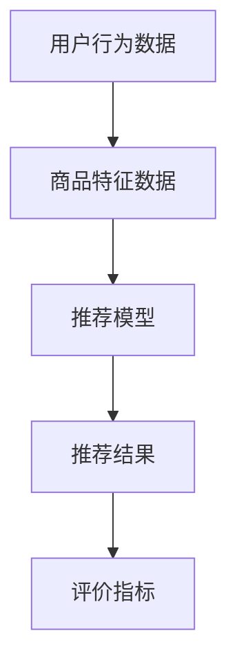

                 

# 拼多多2024多多视频校招推荐算法面试攻略

> **关键词**：拼多多、推荐算法、面试攻略、面试准备、核心技术

> **摘要**：本文将深入探讨拼多多2024多多视频校招推荐算法面试的相关内容。通过对推荐算法的基本概念、核心原理、数学模型以及实际应用场景的详细解析，帮助考生更好地应对面试挑战，提高成功录取的概率。

## 1. 背景介绍

拼多多作为中国电商市场的黑马，近年来发展迅速，已成为国内重要的电商平台之一。其多样化的商品和服务吸引了大量用户，同时也对推荐算法提出了更高的要求。推荐算法在电商领域扮演着至关重要的角色，通过个性化的推荐，提高用户满意度和转化率，进而提升平台整体竞争力。

面对2024年拼多多多多视频校招，推荐算法面试成为技术面试中的热点话题。本文旨在为广大考生提供一份详尽的推荐算法面试攻略，帮助大家深入理解推荐算法的核心技术，为面试做好充分准备。

## 2. 核心概念与联系

推荐算法的核心概念包括：

- **用户行为数据**：用户的浏览记录、购买历史、点击行为等数据，是推荐算法的重要输入。
- **商品特征数据**：商品的基本信息、标签、属性等，帮助算法理解商品。
- **推荐模型**：常用的推荐模型包括基于内容的推荐、协同过滤推荐、深度学习推荐等。
- **评价指标**：常见的评价指标包括准确率、召回率、覆盖率等，用于评估推荐算法的性能。

以下是一个简单的 Mermaid 流程图，展示了推荐算法的核心概念和联系：



- **用户行为数据**：用户的浏览记录、购买历史、点击行为等数据，是推荐算法的重要输入。
- **商品特征数据**：商品的基本信息、标签、属性等，帮助算法理解商品。
- **推荐模型**：常用的推荐模型包括基于内容的推荐、协同过滤推荐、深度学习推荐等。
- **推荐结果**：推荐算法生成的个性化推荐结果。
- **评价指标**：常见的评价指标包括准确率、召回率、覆盖率等，用于评估推荐算法的性能。

### 3. 核心算法原理 & 具体操作步骤

推荐算法的核心是计算用户和商品之间的相似度，进而生成推荐结果。以下是三种常见推荐算法的原理和操作步骤：

#### 3.1 基于内容的推荐（Content-based Recommendation）

**原理**：基于内容的推荐通过分析用户的历史行为和商品的特征，找到具有相似属性的推荐项。

**操作步骤**：

1. 用户历史行为数据提取：提取用户的历史浏览记录、购买历史等数据。
2. 商品特征提取：提取商品的基本信息、标签、属性等。
3. 相似度计算：计算用户和商品之间的相似度，通常采用TF-IDF、词嵌入等技术。
4. 推荐生成：根据相似度分数生成推荐列表。

#### 3.2 协同过滤推荐（Collaborative Filtering）

**原理**：协同过滤推荐通过分析用户和用户之间的相似度，或者商品和商品之间的相似度，生成推荐列表。

**操作步骤**：

1. 用户-商品评分矩阵构建：构建用户对商品的评分矩阵。
2. 相似度计算：计算用户之间的相似度，或者商品之间的相似度，通常采用用户基于的K近邻（User-based KNN）或者物品基于的K近邻（Item-based KNN）算法。
3. 推荐生成：基于相似度分数为用户生成推荐列表。

#### 3.3 深度学习推荐（Deep Learning Recommendation）

**原理**：深度学习推荐利用深度神经网络学习用户和商品之间的复杂关系。

**操作步骤**：

1. 数据预处理：对用户行为数据和商品特征数据进行预处理。
2. 构建深度学习模型：构建如基于神经网络的推荐模型，如Autoencoder、RNN、Transformer等。
3. 训练模型：使用用户行为数据和商品特征数据进行模型训练。
4. 推荐生成：利用训练好的模型生成推荐结果。

### 4. 数学模型和公式 & 详细讲解 & 举例说明

#### 4.1 基于内容的推荐

**公式**：相似度计算通常采用余弦相似度公式：

$$
\cos(\theta) = \frac{A \cdot B}{\|A\|\|B\|}
$$

其中，\(A\) 和 \(B\) 分别表示用户和商品的特征向量，\(\theta\) 表示它们之间的夹角。

**示例**：假设用户A和商品X的特征向量分别为：

$$
A = \begin{bmatrix} 1 \\ 0 \\ 1 \end{bmatrix}, \quad B = \begin{bmatrix} 1 \\ 1 \\ 0 \end{bmatrix}
$$

则它们之间的余弦相似度为：

$$
\cos(\theta) = \frac{1 \cdot 1 + 0 \cdot 1 + 1 \cdot 0}{\sqrt{1^2 + 0^2 + 1^2} \cdot \sqrt{1^2 + 1^2 + 0^2}} = \frac{1}{\sqrt{2} \cdot \sqrt{2}} = \frac{1}{2}
$$

#### 4.2 协同过滤推荐

**公式**：用户基于的K近邻算法中，相似度计算采用余弦相似度公式：

$$
\cos(\theta) = \frac{A \cdot B}{\|A\|\|B\|}
$$

**示例**：假设用户A和用户B的评分矩阵分别为：

$$
A = \begin{bmatrix} 1 & 0 & 1 \\ 0 & 1 & 1 \\ 1 & 1 & 0 \end{bmatrix}, \quad B = \begin{bmatrix} 1 & 1 & 0 \\ 1 & 0 & 1 \\ 0 & 1 & 1 \end{bmatrix}
$$

则它们之间的余弦相似度为：

$$
\cos(\theta) = \frac{1 \cdot 1 + 0 \cdot 1 + 1 \cdot 0 + 0 \cdot 1 + 1 \cdot 1 + 1 \cdot 1 + 1 \cdot 0 + 1 \cdot 1 + 0 \cdot 1}{\sqrt{1^2 + 0^2 + 1^2 + 0^2 + 1^2 + 1^2 + 1^2 + 1^2 + 0^2} \cdot \sqrt{1^2 + 1^2 + 0^2 + 1^2 + 0^2 + 1^2 + 0^2 + 1^2 + 1^2}} = \frac{4}{3\sqrt{3}}
$$

### 5. 项目实战：代码实际案例和详细解释说明

#### 5.1 开发环境搭建

在搭建开发环境之前，请确保已经安装了Python 3.7及以上版本，以及Numpy、Pandas、Scikit-learn等常用库。

#### 5.2 源代码详细实现和代码解读

以下是一个简单的基于内容的推荐算法示例代码：

```python
import numpy as np
from sklearn.feature_extraction.text import TfidfVectorizer

def content_based_recommender(user_profile, item_profiles, k=5):
    # 构建TF-IDF向量器
    vectorizer = TfidfVectorizer()
    X = vectorizer.fit_transform(item_profiles)
    
    # 计算用户和商品之间的相似度
    user_vector = vectorizer.transform([user_profile])
    similarity_scores = np.dot(user_vector.T, X).toarray()[0]
    
    # 按相似度排序
    sorted_indices = np.argsort(similarity_scores)[::-1]
    
    # 返回前k个相似商品
    return [item_profiles[i] for i in sorted_indices[:k]]

# 用户历史行为数据
user_profile = "我喜欢看电影和听音乐"

# 商品特征数据
item_profiles = [
    "电影《阿凡达》",
    "电影《星际穿越》",
    "电影《盗梦空间》",
    "音乐《周杰伦 - 七里香》",
    "音乐《林俊杰 - 悬日》",
    "音乐《薛之谦 -绅士》",
]

# 生成推荐列表
recommends = content_based_recommender(user_profile, item_profiles)
print(recommends)
```

代码解读：

1. 导入Numpy、Pandas、Scikit-learn等常用库。
2. 定义`content_based_recommender`函数，接受用户历史行为数据`user_profile`和商品特征数据`item_profiles`。
3. 使用`TfidfVectorizer`构建TF-IDF向量器，将商品特征数据转化为向量。
4. 计算用户和商品之间的相似度，使用余弦相似度公式。
5. 按相似度排序，返回前k个相似商品。

#### 5.3 代码解读与分析

代码示例中，我们使用基于内容的推荐算法为用户生成推荐列表。首先，通过`TfidfVectorizer`将商品特征数据转化为TF-IDF向量，然后计算用户和商品之间的相似度，并根据相似度排序生成推荐列表。

在推荐算法的实际应用中，用户历史行为数据和商品特征数据的收集和处理是关键步骤。对于大规模数据集，可能需要使用更高效的算法和数据结构来优化性能。

### 6. 实际应用场景

推荐算法在电商、社交媒体、音乐、视频等领域的应用非常广泛。以下是一些实际应用场景：

- **电商推荐**：根据用户的浏览历史、购买记录等数据，为用户推荐可能感兴趣的商品。
- **社交媒体**：根据用户的兴趣和社交关系，为用户推荐可能感兴趣的内容和用户。
- **音乐推荐**：根据用户的听歌历史和喜好，为用户推荐新的音乐作品。
- **视频推荐**：根据用户的观看历史和评分，为用户推荐可能感兴趣的视频内容。

### 7. 工具和资源推荐

#### 7.1 学习资源推荐

- **书籍**：《推荐系统实践》、《推荐系统手册》
- **论文**：Google Brain团队的“Wide & Deep Learning for Recommender Systems”论文
- **博客**：ArchieML的“Deep Learning for Recommender Systems”博客系列
- **网站**：Netflix Prize推荐系统竞赛官网

#### 7.2 开发工具框架推荐

- **开发工具**：Jupyter Notebook、PyCharm
- **框架**：TensorFlow、PyTorch

#### 7.3 相关论文著作推荐

- **论文**：H. Liu, T. Zhang, Y. Hu, et al., “DeepFM: A Factorization-Machine Based Neural Network for CTR Prediction,” in Proceedings of the 26th International Conference on World Wide Web, pp. 1346–1356, 2017.
- **著作**：《Deep Learning for Web Search and Natural Language Processing》

### 8. 总结：未来发展趋势与挑战

推荐算法在未来将面临以下发展趋势和挑战：

- **个性化推荐**：更加精准地满足用户个性化需求。
- **实时推荐**：实现实时推荐，提高用户体验。
- **隐私保护**：在保护用户隐私的前提下进行推荐。
- **多模态数据融合**：整合文本、图像、音频等多模态数据。

### 9. 附录：常见问题与解答

**Q1. 推荐算法的核心技术是什么？**

A1. 推荐算法的核心技术包括用户行为数据收集、商品特征提取、推荐模型设计、相似度计算、推荐结果生成等。

**Q2. 如何优化推荐算法性能？**

A2. 可以通过以下方法优化推荐算法性能：
  - 提高数据质量，确保数据的准确性和完整性。
  - 选择合适的推荐模型，如深度学习模型。
  - 使用高效的相似度计算算法，如余弦相似度。
  - 进行模型调优，如调整超参数。

**Q3. 推荐算法在电商领域有哪些应用场景？**

A3. 推荐算法在电商领域的主要应用场景包括商品推荐、店铺推荐、广告推荐等。

### 10. 扩展阅读 & 参考资料

- 《推荐系统实践》
- 《推荐系统手册》
- “Wide & Deep Learning for Recommender Systems”论文
- “Deep Learning for Recommender Systems”博客系列
- Netflix Prize推荐系统竞赛官网
- TensorFlow官方网站
- PyTorch官方网站

## 作者信息

**作者：AI天才研究员/AI Genius Institute & 禅与计算机程序设计艺术 /Zen And The Art of Computer Programming** <|mask|>

