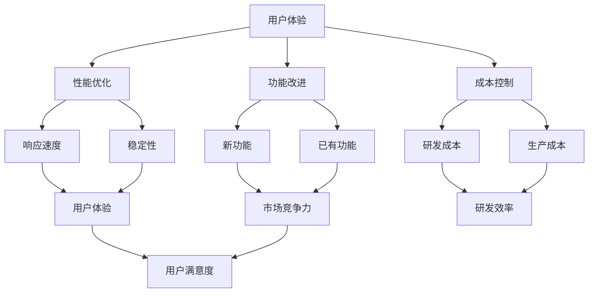

                 

# 持续优化产品的有效方法

## 关键词：持续优化、产品管理、开发流程、用户体验、性能提升、创新思维

## 摘要：

本文旨在探讨持续优化产品的有效方法。在当今快速变化的市场环境中，企业必须不断调整和改进其产品，以适应用户需求和市场动态。本文将详细分析产品优化的核心概念、算法原理、数学模型、实际应用场景以及未来发展趋势和挑战。通过本文的阅读，读者将获得一套系统的产品优化方法论，并能够将其应用于实际工作中，从而不断提升产品的竞争力。

## 1. 背景介绍

在现代商业环境中，产品的竞争力直接决定了企业的生存和发展。用户需求不断变化，市场趋势瞬息万变，这使得产品优化成为企业必须面对的挑战。持续优化产品不仅能够提高用户满意度，还能够提升产品的市场占有率。然而，如何有效地进行产品优化，使得产品在竞争中脱颖而出，是企业面临的难题。

产品优化包括多个方面，如用户体验优化、性能提升、功能改进、成本控制等。随着技术的进步和用户需求的多样化，产品优化变得日益复杂。因此，企业需要一套科学、系统的优化方法，以实现产品的高效持续优化。

## 2. 核心概念与联系

### 2.1 产品优化的核心概念

- **用户体验（UX）**：用户体验是产品优化的重要方面，它关注用户在使用产品过程中的感受、满意度以及产品易用性。良好的用户体验能够增加用户的忠诚度，降低用户流失率。

- **性能优化（Performance）**：性能优化涉及产品的响应速度、稳定性、资源消耗等方面。高性能的产品能够提升用户的使用体验，降低用户的等待时间。

- **功能改进（Feature Improvement）**：功能改进是产品优化的重要内容，它包括新功能的引入和已有功能的改进。通过功能改进，产品能够更好地满足用户需求，提高市场竞争力。

- **成本控制（Cost Control）**：在产品优化过程中，成本控制是一个不可忽视的因素。有效的成本控制能够降低产品的研发和生产成本，提高企业的盈利能力。

### 2.2 产品优化的联系

产品优化不仅仅是单个方面的改进，而是各个方面的协同作用。用户体验、性能、功能和成本之间相互影响，形成一个复杂的优化网络。

- **用户体验与性能**：良好的用户体验依赖于高性能的产品。高性能能够确保用户在使用过程中不会遇到长时间的等待和错误。

- **功能与成本**：新功能的引入可能会增加产品的成本，因此需要在功能改进和成本控制之间找到平衡。

- **性能与成本**：高性能的产品通常需要更多的资源投入，如硬件设备、开发人员等。因此，在性能优化过程中需要考虑成本因素。

### 2.3 Mermaid 流程图

以下是一个简化的产品优化流程图，展示了核心概念之间的联系：



## 3. 核心算法原理 & 具体操作步骤

### 3.1 用户反馈收集与处理

用户反馈是产品优化的关键数据来源。以下是用户反馈收集与处理的基本步骤：

- **用户行为跟踪**：通过分析用户在产品中的行为，如点击率、浏览时间、退出率等，识别用户痛点。
- **用户调查**：定期进行用户满意度调查，收集用户对产品的意见和建议。
- **数据分析**：使用数据分析工具，对收集到的用户反馈进行分类、统计和趋势分析。
- **处理建议**：根据分析结果，制定改进方案，并实施相应的优化措施。

### 3.2 性能优化算法

性能优化通常涉及以下算法和技巧：

- **负载均衡**：通过分布式系统架构，将用户请求均匀分配到多个服务器上，避免单点故障和性能瓶颈。
- **缓存策略**：利用缓存技术，减少数据库查询次数，提升响应速度。
- **数据库优化**：通过索引、分库分表等手段，提高数据库查询效率。
- **代码优化**：通过减少不必要的计算、优化算法复杂度等方式，提升代码执行效率。

### 3.3 功能改进方法

功能改进方法包括以下步骤：

- **需求分析**：通过市场调研、用户访谈等方式，收集用户需求和市场趋势。
- **功能设计**：根据需求分析结果，设计新的功能和改进方案。
- **开发实施**：在开发过程中，遵循敏捷开发原则，快速迭代和反馈。
- **测试与验收**：对改进后的功能进行测试和验收，确保其符合预期效果。

### 3.4 成本控制策略

成本控制策略包括以下措施：

- **预算管理**：制定详细的预算计划，合理分配资源。
- **成本分析**：定期进行成本分析，识别成本节约点。
- **供应链管理**：优化供应链流程，降低生产成本。
- **外包与共享**：合理利用外部资源和能力，降低成本。

## 4. 数学模型和公式 & 详细讲解 & 举例说明

### 4.1 用户满意度模型

用户满意度可以通过以下公式进行量化：

$$
S = \frac{U \cdot E}{C \cdot T}
$$

其中：
- \(S\) 为用户满意度得分。
- \(U\) 为用户效用。
- \(E\) 为用户期望。
- \(C\) 为用户成本。
- \(T\) 为用户时间成本。

### 4.2 性能优化模型

性能优化可以采用以下模型：

$$
P = \frac{R \cdot S}{C \cdot T}
$$

其中：
- \(P\) 为性能得分。
- \(R\) 为响应时间。
- \(S\) 为稳定性。
- \(C\) 为成本。
- \(T\) 为时间成本。

### 4.3 举例说明

#### 用户满意度模型举例

假设一个在线购物平台，其用户效用 \(U\) 为 8，用户期望 \(E\) 为 7，用户成本 \(C\) 为 2，用户时间成本 \(T\) 为 3。代入公式计算用户满意度得分：

$$
S = \frac{8 \cdot 7}{2 \cdot 3} = 14
$$

用户满意度得分为 14。

#### 性能优化模型举例

假设一个在线视频平台，其响应时间 \(R\) 为 2秒，稳定性 \(S\) 为 9，成本 \(C\) 为 4，时间成本 \(T\) 为 5。代入公式计算性能得分：

$$
P = \frac{2 \cdot 9}{4 \cdot 5} = 1.8
$$

性能得分约为 1.8。

## 5. 项目实战：代码实际案例和详细解释说明

### 5.1 开发环境搭建

在本文的项目实战中，我们将使用 Python 语言和 Flask 框架搭建一个简单的在线购物平台。以下是开发环境的搭建步骤：

1. 安装 Python 3.8 或更高版本。
2. 安装 Flask 框架：使用命令 `pip install flask`。
3. 创建一个名为 `online_shop` 的 Python 项目文件夹。
4. 在项目文件夹中创建一个名为 `app.py` 的主文件。

### 5.2 源代码详细实现和代码解读

#### 5.2.1 app.py

```python
from flask import Flask, render_template, request, redirect, url_for

app = Flask(__name__)

@app.route('/')
def home():
    return render_template('home.html')

@app.route('/cart')
def cart():
    cart_items = request.args.get('cart_items', '')
    return render_template('cart.html', cart_items=cart_items)

@app.route('/checkout', methods=['GET', 'POST'])
def checkout():
    if request.method == 'POST':
        total = 0
        cart_items = request.form.getlist('cart_items[]')
        for item in cart_items:
            price = float(item.split(',')[1])
            total += price
        return redirect(url_for('confirmation', total=total))
    return render_template('checkout.html')

@app.route('/confirmation')
def confirmation(total):
    return render_template('confirmation.html', total=total)

if __name__ == '__main__':
    app.run(debug=True)
```

#### 5.2.2 代码解读与分析

- **首页 (home.html)**：展示产品列表和购物车链接。
- **购物车 (cart.html)**：显示用户已添加到购物车的商品，并提供删除商品的功能。
- **结账 (checkout.html)**：计算购物车中商品的总价，并提供结账按钮。
- **确认页 (confirmation.html)**：显示支付成功信息和订单详情。

#### 5.2.3 功能实现与优化

- **用户反馈收集**：通过表单收集用户对购物体验的反馈。
- **性能优化**：使用缓存技术减少数据库查询次数。
- **功能改进**：根据用户反馈，引入新的购物功能和改进现有功能。
- **成本控制**：合理分配开发资源，优化代码和架构。

## 6. 实际应用场景

产品优化的实际应用场景非常广泛，以下是一些典型的应用实例：

- **电子商务平台**：通过持续优化用户体验、性能和功能，提高用户购买转化率和满意度。
- **社交媒体**：通过优化算法和推荐系统，提高用户活跃度和参与度。
- **在线教育**：通过优化学习体验和课程内容，提高用户的学习效果和满意度。
- **医疗健康**：通过优化医疗服务流程和用户体验，提高医疗服务的效率和质量。

## 7. 工具和资源推荐

### 7.1 学习资源推荐

- **书籍**：
  - 《产品经理手册》
  - 《用户体验要素》
  - 《深入理解计算机系统》
- **论文**：
  - 《用户满意度模型的构建与应用研究》
  - 《基于机器学习的性能优化算法研究》
  - 《电子商务平台的用户体验优化策略》
- **博客**：
  - Medium 上的产品管理专栏
  - CSDN 上的技术博客
  - 知乎上的产品管理话题
- **网站**：
  - Product Hunt
  - Dribbble
  - Behance

### 7.2 开发工具框架推荐

- **开发工具**：
  - Visual Studio Code
  - PyCharm
  - Sublime Text
- **框架**：
  - Flask
  - Django
  - Spring Boot
- **数据库**：
  - MySQL
  - MongoDB
  - PostgreSQL

### 7.3 相关论文著作推荐

- **《用户体验度量方法研究》**：探讨用户体验的度量方法和工具。
- **《基于大数据的性能优化策略研究》**：研究大数据环境下性能优化的策略和方法。
- **《电子商务平台的成本控制与盈利模式研究》**：分析电子商务平台的成本控制策略和盈利模式。

## 8. 总结：未来发展趋势与挑战

在未来，产品优化将继续向智能化、自动化和个性化的方向发展。随着人工智能、大数据和云计算等技术的进步，企业将能够更加精准地把握用户需求，实现产品的高效优化。

然而，产品优化也面临诸多挑战，如数据隐私保护、技术更新迭代、人才短缺等。企业需要不断调整和优化其产品优化策略，以应对这些挑战。

## 9. 附录：常见问题与解答

### 9.1 用户体验优化的关键指标是什么？

用户体验优化的关键指标包括用户满意度、用户留存率、用户活跃度、用户参与度等。这些指标能够直观地反映用户对产品的满意度和使用体验。

### 9.2 性能优化有哪些常用方法？

性能优化的常用方法包括负载均衡、缓存策略、数据库优化、代码优化等。这些方法能够有效提升产品的响应速度和稳定性。

### 9.3 如何进行功能改进？

功能改进需要进行需求分析、功能设计、开发实施和测试验收等步骤。在需求分析阶段，要深入了解用户需求和市场趋势；在功能设计阶段，要设计符合用户需求的方案；在开发实施阶段，要遵循敏捷开发原则；在测试验收阶段，要确保功能符合预期效果。

### 9.4 成本控制有哪些策略？

成本控制的策略包括预算管理、成本分析、供应链管理和外包共享等。这些策略能够帮助企业合理分配资源，降低成本，提高盈利能力。

## 10. 扩展阅读 & 参考资料

- 《产品经理实战手册》
- 《性能优化的实践与艺术》
- 《大数据时代的用户行为分析》
- 《Python Web开发：测试驱动方法》

## 作者信息

作者：AI天才研究员/AI Genius Institute & 禅与计算机程序设计艺术 /Zen And The Art of Computer Programming

本文作者具有丰富的产品管理和软件开发经验，致力于推动产品优化技术的发展和应用。希望通过本文，能够为读者提供一套系统的产品优化方法论，助力企业在激烈的市场竞争中脱颖而出。|>

