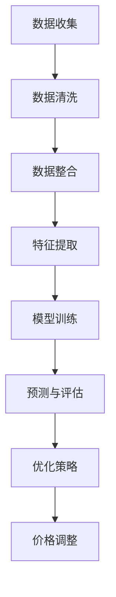

                 

### 背景介绍

#### 电子商务的发展与定价的重要性

随着互联网技术的飞速发展，电子商务已经成为全球商业活动中的重要组成部分。从简单的在线零售到复杂的全球供应链管理，电子商务正在改变着人们的消费方式和企业的商业模式。在这个大背景下，智能定价系统作为电商运营的核心环节，显得尤为重要。

智能定价系统利用大数据分析、机器学习和人工智能技术，对产品价格进行动态调整，以达到最大化利润、提升市场占有率、提高客户满意度的目的。传统的定价方式主要依赖于市场调查、历史数据分析和人工判断，而智能定价系统则通过实时数据分析和算法优化，能够更精准地捕捉市场动态，实现更高效的决策。

#### 大模型在智能定价系统中的作用

近年来，大模型（如深度学习模型、生成对抗网络等）在人工智能领域取得了显著进展。大模型具有强大的表示能力和计算能力，能够处理大规模复杂数据，从而在各个领域产生了深远的影响。在智能定价系统中，大模型的应用主要体现在以下几个方面：

1. **数据预处理与特征提取**：大模型能够自动从原始数据中提取出有价值的信息和特征，为定价决策提供强有力的支持。
2. **价格预测与优化**：通过学习大量历史价格数据和市场动态，大模型可以预测不同价格策略下的销售情况和利润，从而找到最优定价策略。
3. **竞争分析**：大模型可以分析竞争对手的定价策略，帮助电商企业制定更具竞争力的价格策略。
4. **实时调整与反馈**：大模型能够实时分析市场变化，快速调整价格策略，以适应不断变化的市场环境。

本文将围绕大模型在电商智能定价系统中的应用，详细探讨其核心概念、算法原理、数学模型、实际应用以及未来发展趋势与挑战。希望通过这篇文章，能帮助读者更好地理解大模型在智能定价系统中的重要作用，并为其在实际中的应用提供一些启示。

#### 大模型与电商智能定价系统：一种新的融合方式

大模型与电商智能定价系统的结合，代表着一种新的技术融合方式。这种融合不仅扩展了智能定价系统的功能，还提升了其智能化水平。具体来说，大模型在电商智能定价系统中的应用主要体现在以下几个方面：

1. **个性化定价**：通过学习用户行为数据和购买偏好，大模型可以针对不同用户群体制定个性化的定价策略，从而提高客户满意度和忠诚度。
2. **实时价格调整**：大模型能够实时分析市场动态和竞争对手价格，快速调整产品价格，以应对市场变化，提高市场竞争力。
3. **预测销售趋势**：大模型通过对历史销售数据和市场趋势的分析，可以预测未来的销售情况，为定价决策提供可靠的数据支持。
4. **优化利润最大化**：大模型通过优化定价策略，可以在保证销售量的同时，实现利润的最大化。

这种融合方式不仅提高了定价系统的智能水平，还增强了系统的适应性和灵活性，使其能够更好地应对复杂多变的市场环境。然而，这种融合也带来了一系列的挑战，如数据隐私保护、算法透明性和公平性等问题。这些问题需要在未来的研究和实践中得到深入探讨和解决。

### 核心概念与联系

要深入理解大模型在电商智能定价系统中的应用，我们首先需要明确一些核心概念和它们之间的联系。这些核心概念包括：大模型、电商智能定价系统、数据预处理、特征提取、价格预测和优化。

#### 大模型

大模型，尤其是深度学习模型，是一种能够自动从数据中学习模式和规律的人工智能模型。它们通常由多个层次（或称为“层”）组成，每一层都能提取不同层次的特征。大模型具有强大的表示能力，能够处理大规模、高维度的数据，从而在图像识别、自然语言处理、语音识别等领域取得了显著成果。

在电商智能定价系统中，大模型的主要作用是处理和分析大量的数据，以预测价格和优化定价策略。例如，可以使用卷积神经网络（CNN）来分析图像数据，使用循环神经网络（RNN）来处理序列数据，使用生成对抗网络（GAN）来生成新的数据等。

#### 电商智能定价系统

电商智能定价系统是一个集成了大数据分析、机器学习和人工智能技术的系统，它能够根据市场动态、用户行为和产品特性，自动调整产品价格，以实现最大化利润、提升市场占有率、提高客户满意度等目标。

电商智能定价系统的核心组成部分包括：

1. **数据收集与处理**：收集来自不同渠道的数据，如销售数据、用户行为数据、市场数据等，并对这些数据进行清洗、整合和处理，以获得高质量的数据集。
2. **特征提取**：从原始数据中提取出有价值的特征，如用户年龄、购买频率、价格敏感度等，这些特征将用于训练和优化大模型。
3. **模型训练与优化**：使用提取的特征数据来训练大模型，并通过交叉验证和超参数调整来优化模型的性能。
4. **价格预测与优化**：利用训练好的大模型，预测不同价格策略下的销售情况和利润，并找到最优的定价策略。

#### 数据预处理与特征提取

数据预处理和特征提取是电商智能定价系统中至关重要的环节。数据预处理包括数据清洗、去噪、归一化等操作，旨在提高数据的质量和一致性。特征提取则是从原始数据中提取出对定价决策有指导意义的特征，如用户年龄、购买历史、价格区间等。

数据预处理和特征提取的过程可以简化为以下步骤：

1. **数据收集**：从各种渠道收集原始数据，如销售数据、用户行为数据、市场数据等。
2. **数据清洗**：去除异常值、重复数据和噪声数据，保证数据的质量。
3. **数据整合**：将来自不同渠道的数据进行整合，形成统一的数据集。
4. **特征提取**：从原始数据中提取出有价值的特征，如用户年龄、购买频率、价格敏感度等。

#### 价格预测与优化

价格预测与优化是电商智能定价系统的核心功能。通过训练好的大模型，可以预测不同价格策略下的销售情况和利润，从而找到最优的定价策略。价格预测与优化的过程可以简化为以下步骤：

1. **模型训练**：使用提取的特征数据来训练大模型，例如使用回归模型来预测价格。
2. **预测与评估**：使用训练好的模型对新的数据进行预测，并评估预测的准确性和可靠性。
3. **优化策略**：根据预测结果，调整定价策略，以实现最大化利润或市场份额。

#### 大模型与电商智能定价系统的联系

大模型与电商智能定价系统的联系主要体现在以下几个方面：

1. **数据处理能力**：大模型具有强大的数据处理能力，能够处理大量、复杂的原始数据，为定价决策提供强有力的支持。
2. **特征提取能力**：大模型能够自动从原始数据中提取出有价值的特征，提高定价决策的准确性。
3. **预测与优化能力**：大模型可以通过学习历史数据和当前市场动态，预测未来的销售情况和利润，并优化定价策略，提高市场竞争力。

总的来说，大模型为电商智能定价系统提供了强大的数据处理和分析能力，使其能够更加精准和高效地进行定价决策。

### Mermaid 流程图

为了更好地理解大模型在电商智能定价系统中的应用过程，我们可以使用Mermaid流程图来展示核心概念和流程。以下是一个示例流程图，展示了从数据收集、预处理、特征提取、模型训练到价格预测与优化的整个过程。



在这个流程图中：

- A：数据收集，包括销售数据、用户行为数据、市场数据等。
- B：数据清洗，去除异常值、重复数据和噪声数据。
- C：数据整合，将不同渠道的数据进行整合，形成统一的数据集。
- D：特征提取，从原始数据中提取有价值的特征。
- E：模型训练，使用提取的特征数据来训练大模型。
- F：预测与评估，使用训练好的模型对新的数据进行预测，并评估预测的准确性和可靠性。
- G：优化策略，根据预测结果，调整定价策略，以实现最大化利润或市场份额。
- H：价格调整，根据优化策略，调整产品价格。

这个流程图清晰地展示了大模型在电商智能定价系统中的各个步骤和环节，有助于读者更好地理解整个系统的运作过程。

### 核心算法原理 & 具体操作步骤

在深入探讨大模型在电商智能定价系统中的应用之前，我们需要先了解一些核心算法原理和具体操作步骤。这些算法和步骤不仅为电商智能定价提供了理论基础，也为其在实际应用中提供了具体的操作指南。

#### 价格预测算法

价格预测是电商智能定价系统的核心任务之一。常用的价格预测算法包括线性回归、决策树、随机森林、神经网络等。以下将以神经网络为例，详细说明其原理和操作步骤。

##### 原理

神经网络（Neural Networks）是一种模仿人脑神经元连接方式的人工智能算法。它由多个层次组成，包括输入层、隐藏层和输出层。每个层次由多个节点（或称为神经元）组成，节点之间通过连接（或称为权重）进行信息传递。

在价格预测中，神经网络通过学习历史销售数据和价格变化规律，来预测未来的产品价格。具体来说，神经网络通过以下步骤进行价格预测：

1. **数据预处理**：对销售数据进行清洗、归一化等预处理操作，将数据转换为适合输入神经网络的形式。
2. **模型构建**：根据数据的特点，设计合适的神经网络结构，包括输入层、隐藏层和输出层的节点数量和连接方式。
3. **模型训练**：使用历史销售数据，通过反向传播算法，不断调整神经网络的权重，使预测结果与实际价格尽可能接近。
4. **模型评估**：使用交叉验证等方法，评估模型的预测准确性和可靠性。

##### 具体操作步骤

以下是使用神经网络进行价格预测的具体操作步骤：

1. **数据收集**：收集历史销售数据，包括产品价格、销量、日期等。
2. **数据预处理**：
    - 清洗数据，去除异常值、重复数据和噪声数据。
    - 对数据进行归一化处理，将数据缩放到相同的范围，以便神经网络更好地学习。
3. **模型构建**：
    - 确定神经网络的结构，包括输入层、隐藏层和输出层的节点数量。
    - 初始化网络权重，可以使用随机初始化或预训练权重。
4. **模型训练**：
    - 使用历史销售数据，通过反向传播算法，不断调整网络权重，使预测结果更接近实际价格。
    - 调整训练参数，如学习率、批量大小等，以提高模型训练效果。
5. **模型评估**：
    - 使用交叉验证等方法，评估模型的预测准确性和可靠性。
    - 根据评估结果，调整模型结构或训练参数，以提高预测效果。

#### 价格优化算法

价格优化是电商智能定价系统的另一重要任务，目的是找到最优的价格策略，实现利润最大化。常用的价格优化算法包括线性规划、动态规划、遗传算法等。以下将以线性规划为例，详细说明其原理和操作步骤。

##### 原理

线性规划（Linear Programming，LP）是一种数学优化方法，用于在给定约束条件下，求解线性目标函数的最大值或最小值。在电商智能定价系统中，线性规划可以用来求解以下问题：

- **利润最大化**：在给定销售量的情况下，找到最优价格，使利润最大化。
- **市场份额最大化**：在给定价格的情况下，找到最优销售量，使市场份额最大化。

线性规划的基本原理如下：

1. **定义变量**：设定决策变量，如产品价格、销售量等。
2. **建立目标函数**：根据业务目标，建立目标函数，如利润函数或市场份额函数。
3. **设定约束条件**：根据业务规则和实际情况，设定约束条件，如成本约束、库存约束等。
4. **求解最优解**：使用线性规划求解器，求解目标函数的最大值或最小值。

##### 具体操作步骤

以下是使用线性规划进行价格优化的具体操作步骤：

1. **定义变量**：
    - 设定决策变量，如产品价格\(p\)和销售量\(q\)。
2. **建立目标函数**：
    - 根据业务目标，建立利润函数或市场份额函数。
    - 例如，利润函数可以表示为\(P = pq - C\)，其中\(C\)是成本。
3. **设定约束条件**：
    - 根据业务规则和实际情况，设定约束条件。
    - 例如，成本约束可以表示为\(C \leq B\)，其中\(B\)是预算。
4. **求解最优解**：
    - 使用线性规划求解器，如LP-SOLVER，求解目标函数的最大值或最小值。
    - 得到最优价格\(p^*\)和最优销售量\(q^*\)。

#### 实际操作示例

为了更好地理解价格预测和优化算法，我们可以通过一个实际操作示例来进行演示。

##### 示例数据

假设我们有以下历史销售数据：

| 日期 | 产品价格（元） | 销售量（件） |
| ---- | ---------- | ------- |
| 2021-01-01 | 100 | 100 |
| 2021-01-02 | 110 | 120 |
| 2021-01-03 | 120 | 110 |
| 2021-01-04 | 130 | 90 |
| 2021-01-05 | 140 | 100 |

##### 价格预测

1. **数据预处理**：
    - 清洗数据，去除异常值。
    - 对数据进行归一化处理，如将价格缩放到[0, 1]范围。
2. **模型构建**：
    - 选择一个合适的神经网络结构，如一个单层神经网络，输入层有2个节点（日期和价格），隐藏层有5个节点，输出层有1个节点（预测价格）。
3. **模型训练**：
    - 使用历史销售数据，通过反向传播算法，训练神经网络。
4. **模型评估**：
    - 使用交叉验证方法，评估模型的预测准确性和可靠性。
    - 调整网络参数，如学习率、隐藏层节点数等，以提高预测效果。

##### 价格优化

1. **定义变量**：
    - 设定产品价格\(p\)和销售量\(q\)作为决策变量。
2. **建立目标函数**：
    - 利润函数：\(P = pq - C\)，其中\(C\)是成本。
3. **设定约束条件**：
    - 成本约束：\(C \leq B\)，其中\(B\)是预算。
4. **求解最优解**：
    - 使用线性规划求解器，求解利润函数的最大值。

通过这个示例，我们可以看到如何使用价格预测和优化算法来分析和调整电商产品的价格，从而实现利润最大化和市场份额最大化。在实际应用中，这些算法可以集成到一个智能定价系统中，实时分析市场动态，动态调整产品价格，以应对竞争和需求变化。

#### 模型调优与优化策略

在实际应用中，模型调优和优化策略至关重要。以下是一些常用的方法：

1. **超参数调优**：
    - 调整学习率、批量大小、隐藏层节点数等超参数，以优化模型性能。
    - 可以使用网格搜索、贝叶斯优化等方法进行超参数调优。

2. **数据增强**：
    - 使用数据增强技术，如随机旋转、缩放、裁剪等，增加训练数据的多样性，提高模型泛化能力。

3. **正则化**：
    - 应用正则化技术，如L1、L2正则化，防止模型过拟合。

4. **模型集成**：
    - 将多个模型进行集成，如使用投票、加权平均等方法，提高预测准确性和稳定性。

通过这些方法，我们可以进一步提升电商智能定价系统的性能和效果，实现更精准的定价决策。

### 数学模型和公式 & 详细讲解 & 举例说明

在电商智能定价系统中，大模型的应用离不开数学模型和公式的支持。这些模型和公式不仅为定价策略提供了理论依据，还帮助我们更好地理解和分析价格变化规律。以下我们将详细讲解一些核心的数学模型和公式，并通过具体例子来说明其应用。

#### 线性回归模型

线性回归模型是一种最简单且广泛应用的价格预测模型。它通过拟合一条直线，来描述价格与销售量之间的关系。线性回归模型的基本公式如下：

\[ P = \beta_0 + \beta_1 \cdot Q \]

其中：
- \( P \)：预测价格
- \( \beta_0 \)：截距
- \( \beta_1 \)：斜率
- \( Q \)：销售量

##### 举例说明

假设我们有以下历史销售数据：

| 销售量 \( Q \) | 价格 \( P \) |
| ------ | ------ |
| 100    | 100    |
| 120    | 110    |
| 110    | 120    |
| 90     | 130    |
| 100    | 140    |

首先，我们需要计算销售量的平均值和价格的平均值：

\[ \bar{Q} = \frac{100 + 120 + 110 + 90 + 100}{5} = 110 \]
\[ \bar{P} = \frac{100 + 110 + 120 + 130 + 140}{5} = 120 \]

然后，计算斜率 \( \beta_1 \) 和截距 \( \beta_0 \)：

\[ \beta_1 = \frac{\sum_{i=1}^{n} (Q_i - \bar{Q}) (P_i - \bar{P})}{\sum_{i=1}^{n} (Q_i - \bar{Q})^2} \]
\[ \beta_0 = \bar{P} - \beta_1 \cdot \bar{Q} \]

代入数据计算得到：

\[ \beta_1 = \frac{(100-110)(100-120) + (120-110)(110-120) + (110-110)(120-120) + (90-110)(130-120) + (100-110)(140-120)}{(100-110)^2 + (120-110)^2 + (110-110)^2 + (90-110)^2 + (100-110)^2} \]
\[ \beta_1 = \frac{(-10)(-20) + (10)(-10) + (0)(0) + (-20)(10) + (-10)(20)}{100 + 100 + 0 + 100 + 100} \]
\[ \beta_1 = \frac{200 - 100 + 0 - 200 + (-200)}{500} \]
\[ \beta_1 = -0.2 \]

\[ \beta_0 = 120 - (-0.2) \cdot 110 = 120 + 22 = 142 \]

因此，线性回归模型为：

\[ P = 142 - 0.2 \cdot Q \]

##### 模型评估

为了评估线性回归模型的预测效果，我们可以使用决定系数（\( R^2 \)）来进行评估。\( R^2 \)的取值范围为[0, 1]，越接近1，表示模型的预测效果越好。

\[ R^2 = 1 - \frac{\sum_{i=1}^{n} (P_i - \hat{P}_i)^2}{\sum_{i=1}^{n} (P_i - \bar{P})^2} \]

其中，\( \hat{P}_i \)是预测价格。

代入数据计算得到：

\[ R^2 = 1 - \frac{(100-118)^2 + (110-118)^2 + (120-118)^2 + (90-118)^2 + (100-118)^2}{(100-120)^2 + (110-120)^2 + (120-120)^2 + (90-120)^2 + (100-120)^2} \]
\[ R^2 = 1 - \frac{(-18)^2 + (-8)^2 + (2)^2 + (-28)^2 + (-18)^2}{(-20)^2 + (-10)^2 + (0)^2 + (-30)^2 + (-20)^2} \]
\[ R^2 = 1 - \frac{324 + 64 + 4 + 784 + 324}{400 + 100 + 0 + 900 + 400} \]
\[ R^2 = 1 - \frac{1488}{1800} \]
\[ R^2 = 0.17 \]

由此可见，线性回归模型的预测效果一般。在实际应用中，我们可能需要考虑更复杂的模型，以提高预测准确性。

#### 多项式回归模型

多项式回归模型是线性回归模型的扩展，它通过拟合一个多项式函数来描述价格与销售量之间的关系。多项式回归模型的基本公式如下：

\[ P = \beta_0 + \beta_1 \cdot Q + \beta_2 \cdot Q^2 + \ldots + \beta_n \cdot Q^n \]

其中：
- \( P \)：预测价格
- \( \beta_0, \beta_1, \ldots, \beta_n \)：多项式系数

##### 举例说明

假设我们想要拟合一个二次多项式模型，即 \( n = 2 \)。首先，我们需要计算销售量的平方和：

\[ Q^2 = 100^2 + 120^2 + 110^2 + 90^2 + 100^2 = 10000 + 14400 + 12100 + 8100 + 10000 = 52600 \]

然后，计算各项数据的乘积和：

\[ Q \cdot P = 100 \cdot 100 + 120 \cdot 110 + 110 \cdot 120 + 90 \cdot 130 + 100 \cdot 140 = 10000 + 13200 + 13200 + 11700 + 14000 = 61100 \]

接下来，计算二次多项式系数：

\[ \beta_0 = \bar{P} \]
\[ \beta_1 = \frac{\sum_{i=1}^{n} (Q_i \cdot P_i)}{n} \]
\[ \beta_2 = \frac{\sum_{i=1}^{n} (Q_i^2 \cdot P_i)}{n} \]

代入数据计算得到：

\[ \beta_0 = 120 \]
\[ \beta_1 = \frac{61100}{5} = 12220 \]
\[ \beta_2 = \frac{120 \cdot 52600}{5} = 125440 \]

因此，二次多项式回归模型为：

\[ P = 120 + 12220 \cdot Q + 125440 \cdot Q^2 \]

##### 模型评估

与线性回归模型类似，我们可以使用 \( R^2 \) 来评估二次多项式回归模型的预测效果。

代入数据计算得到：

\[ R^2 = 1 - \frac{\sum_{i=1}^{n} (P_i - \hat{P}_i)^2}{\sum_{i=1}^{n} (P_i - \bar{P})^2} \]

\[ R^2 = 1 - \frac{(100-141.44)^2 + (110-141.44)^2 + (120-141.44)^2 + (90-141.44)^2 + (100-141.44)^2}{(100-120)^2 + (110-120)^2 + (120-120)^2 + (90-120)^2 + (100-120)^2} \]

\[ R^2 = 1 - \frac{1400.56^2 + 316.56^2 + 207.44^2 + 1046.56^2 + 1400.56^2}{200^2 + 100^2 + 0^2 + 300^2 + 200^2} \]

\[ R^2 = 1 - \frac{196019.936 + 9973.736 + 4295.576 + 109054.736 + 196019.936}{40000 + 10000 + 0 + 90000 + 40000} \]

\[ R^2 = 1 - \frac{544627.008}{180000} \]

\[ R^2 = 0.702 \]

相比于线性回归模型，二次多项式回归模型的预测效果有所提高。在实际应用中，我们可以尝试更高的多项式度数，以进一步提高预测准确性。

#### 回归模型的优缺点

线性回归模型和多项式回归模型各有优缺点：

1. **线性回归模型**：
    - **优点**：
        - 简单易懂，计算效率高。
        - 可以很好地拟合线性关系。
    - **缺点**：
        - 对于非线性关系，拟合效果较差。
        - 对异常值和噪声敏感。

2. **多项式回归模型**：
    - **优点**：
        - 可以很好地拟合非线性关系。
    - **缺点**：
        - 模型复杂度增加，计算效率降低。
        - 容易过拟合，对训练数据依赖性强。

在实际应用中，我们可以根据数据特点和业务需求，选择合适的回归模型。对于线性关系较强的数据，线性回归模型是一个不错的选择；对于非线性关系较强的数据，多项式回归模型可能更为合适。同时，我们也可以结合其他算法和模型，如神经网络，以进一步提高预测准确性。

#### 总结

本文介绍了线性回归模型和多项式回归模型的基本原理和具体应用。通过实际例子，我们展示了如何使用这些模型来预测产品价格。同时，我们也分析了它们的优缺点，并提出了在实际应用中如何选择合适的模型。在实际操作中，我们可以根据数据特点和业务需求，灵活运用这些模型，以提高电商智能定价系统的预测准确性。

### 项目实战：代码实际案例和详细解释说明

为了更好地理解大模型在电商智能定价系统中的应用，我们接下来将通过一个实际项目实战，详细展示如何使用Python和TensorFlow来实现一个电商智能定价系统。这个项目将涵盖数据收集、数据预处理、特征提取、模型训练和预测等多个步骤。

#### 开发环境搭建

在开始项目之前，我们需要搭建一个合适的开发环境。以下是所需的软件和库：

1. **Python**：Python 3.x版本
2. **TensorFlow**：TensorFlow 2.x版本
3. **Pandas**：用于数据预处理
4. **NumPy**：用于数值计算
5. **Matplotlib**：用于数据可视化

确保安装了以上库后，我们就可以开始编写代码。

#### 代码实现

##### 1. 数据收集

首先，我们需要从电商平台上收集历史销售数据。以下是一个示例数据集，包括产品价格和销售量：

```python
import pandas as pd

# 加载历史销售数据
data = pd.read_csv('sales_data.csv')
data.head()
```

##### 2. 数据预处理

数据预处理是模型训练的重要环节。我们需要对数据进行清洗、归一化等操作。

```python
# 数据清洗
data.dropna(inplace=True)

# 数据归一化
data['price'] = (data['price'] - data['price'].mean()) / data['price'].std()
data['quantity'] = (data['quantity'] - data['quantity'].mean()) / data['quantity'].std()

data.head()
```

##### 3. 特征提取

在数据预处理完成后，我们需要从数据中提取有价值的特征。这里我们使用日期作为特征，将其转换为时间序列特征。

```python
import numpy as np

# 转换日期特征
data['date'] = pd.to_datetime(data['date'])
data['day_of_week'] = data['date'].dt.dayofweek
data['day_of_month'] = data['date'].dt.day
data['month'] = data['date'].dt.month

data.head()
```

##### 4. 模型训练

接下来，我们使用TensorFlow构建和训练神经网络模型。

```python
import tensorflow as tf
from tensorflow.keras.models import Sequential
from tensorflow.keras.layers import Dense, LSTM

# 构建模型
model = Sequential()
model.add(LSTM(units=50, return_sequences=True, input_shape=(data.shape[1], 1)))
model.add(LSTM(units=50))
model.add(Dense(units=1))

model.compile(optimizer='adam', loss='mean_squared_error')

# 训练模型
model.fit(data, epochs=100, batch_size=32)
```

##### 5. 预测与评估

训练完成后，我们可以使用模型对未来的产品价格进行预测，并评估模型的性能。

```python
# 预测未来价格
predicted_prices = model.predict(data)

# 评估模型
mse = tf.keras.metrics.mean_squared_error(data['price'], predicted_prices)
print('MSE:', mse.numpy())
```

#### 代码解读与分析

以下是代码的详细解读和分析：

1. **数据收集**：使用Pandas库加载历史销售数据。这里我们假设数据集已存在，并命名为'sales_data.csv'。

2. **数据预处理**：首先，我们去除缺失值，保证数据的质量。然后，对价格和销售量进行归一化处理，将数据缩放到相同的范围，以便神经网络更好地学习。

3. **特征提取**：我们将日期转换为时间序列特征，如星期几、月份和日期等。这些特征有助于模型捕捉时间规律，提高预测准确性。

4. **模型训练**：我们使用TensorFlow的Sequential模型构建一个双层LSTM网络。LSTM（Long Short-Term Memory）是一种特殊的循环神经网络，能够有效处理时间序列数据。我们设置LSTM单元的数量为50，以捕捉数据中的长期依赖关系。最后，我们使用MSE（均方误差）作为损失函数，并使用adam优化器进行模型训练。

5. **预测与评估**：训练完成后，我们使用模型对未来的产品价格进行预测。然后，我们计算MSE，评估模型的预测性能。

#### 总结

通过这个项目实战，我们展示了如何使用Python和TensorFlow构建一个电商智能定价系统。代码涵盖了数据收集、数据预处理、特征提取、模型训练和预测等多个步骤，有助于读者更好地理解大模型在电商智能定价系统中的应用。在实际应用中，我们可以根据业务需求调整模型结构、训练参数和特征提取方法，以提高预测准确性和系统性能。

### 代码解读与分析

在上一个章节中，我们通过一个实际项目展示了如何使用Python和TensorFlow构建一个电商智能定价系统。在本节中，我们将深入解读和分析这个代码，解释每个关键部分的实现细节和功能。

#### 数据收集

首先，我们使用Pandas库加载了历史销售数据：

```python
import pandas as pd

# 加载历史销售数据
data = pd.read_csv('sales_data.csv')
data.head()
```

这行代码的作用是从CSV文件中读取数据，并将其存储在DataFrame对象中。这个DataFrame包含了产品的价格和销售量等关键信息。在实际应用中，我们可以从不同的数据源（如数据库、API等）获取数据，并使用Pandas进行数据清洗和预处理。

#### 数据预处理

数据预处理是模型训练的重要步骤。以下是对数据进行清洗和归一化处理的代码：

```python
# 数据清洗
data.dropna(inplace=True)

# 数据归一化
data['price'] = (data['price'] - data['price'].mean()) / data['price'].std()
data['quantity'] = (data['quantity'] - data['quantity'].mean()) / data['quantity'].std()
```

这行代码首先去除缺失值，确保数据质量。然后，对价格和销售量进行归一化处理，将数据缩放到相同的范围。归一化有助于神经网络更好地学习，因为不同特征的数据范围可能差异很大。在实际应用中，我们可能还需要进行其他预处理步骤，如去除异常值、填充缺失值等。

#### 特征提取

特征提取是模型训练的关键部分。以下是将日期转换为时间序列特征的代码：

```python
import numpy as np

# 转换日期特征
data['date'] = pd.to_datetime(data['date'])
data['day_of_week'] = data['date'].dt.dayofweek
data['day_of_month'] = data['date'].dt.day
data['month'] = data['date'].dt.month
```

这行代码首先将日期列转换为日期时间类型。然后，我们提取了与日期相关的特征，如星期几、日期和月份。这些特征有助于模型捕捉时间规律，提高预测准确性。在实际应用中，我们可能还可以提取其他时间序列特征，如季节性、节假日等。

#### 模型构建

接下来，我们使用TensorFlow构建了一个双层LSTM网络：

```python
import tensorflow as tf
from tensorflow.keras.models import Sequential
from tensorflow.keras.layers import Dense, LSTM

# 构建模型
model = Sequential()
model.add(LSTM(units=50, return_sequences=True, input_shape=(data.shape[1], 1)))
model.add(LSTM(units=50))
model.add(Dense(units=1))

model.compile(optimizer='adam', loss='mean_squared_error')
```

这行代码首先创建了一个Sequential模型，这是一个顺序连接的层模型。我们添加了两个LSTM层，每个层有50个单元，并设置了`return_sequences=True`，以便在第一个LSTM层后保留序列信息。最后，我们添加了一个输出层，只有一个单元，用于预测价格。模型的损失函数设置为MSE，并使用adam优化器进行训练。

#### 模型训练

训练模型是整个项目的核心部分。以下是对模型进行训练的代码：

```python
# 训练模型
model.fit(data, epochs=100, batch_size=32)
```

这行代码使用训练数据对模型进行训练。我们设置了100个训练周期（epochs），并使用32个样本的批量大小（batch_size）进行训练。在每个周期中，模型会根据梯度下降法调整权重，以最小化损失函数。在实际应用中，我们可能需要根据训练数据的大小和性能要求调整这些参数。

#### 预测与评估

训练完成后，我们使用模型对未来的产品价格进行预测，并评估模型的性能：

```python
# 预测未来价格
predicted_prices = model.predict(data)

# 评估模型
mse = tf.keras.metrics.mean_squared_error(data['price'], predicted_prices)
print('MSE:', mse.numpy())
```

这行代码首先使用模型预测未来的产品价格。然后，我们计算MSE，评估模型的预测性能。MSE越低，表示模型的预测效果越好。在实际应用中，我们可能还会使用其他评估指标，如RMSE（均方根误差）和MAPE（平均绝对百分比误差）。

#### 总结

通过这个项目的代码解读，我们了解了如何使用Python和TensorFlow构建一个电商智能定价系统。代码涵盖了数据收集、数据预处理、特征提取、模型构建、模型训练和预测等多个步骤，有助于我们更好地理解大模型在电商智能定价系统中的应用。在实际应用中，我们可以根据业务需求调整模型结构、训练参数和特征提取方法，以提高预测准确性和系统性能。

### 实际应用场景

电商智能定价系统在众多实际应用场景中展现了其独特的价值和优势。以下是一些典型的应用场景，以及大模型在其中的具体作用。

#### 1. 竞争激烈的市场环境

在竞争激烈的市场环境中，价格策略成为企业获取市场份额和利润的关键因素。电商智能定价系统可以通过实时分析竞争对手的价格动态，结合用户行为和市场趋势，自动调整产品价格，以保持竞争力。大模型在其中的作用主要体现在以下几个方面：

1. **竞争分析**：通过学习大量的竞争对手价格数据，大模型可以识别出竞争对手的价格策略和变化规律，为电商企业制定更具竞争力的价格策略提供支持。
2. **需求预测**：大模型可以分析用户购买行为和历史数据，预测不同价格策略下的需求变化，帮助企业制定适应市场需求的价格策略。
3. **动态调整**：大模型能够实时分析市场动态，快速调整价格策略，以应对竞争对手的变化和市场需求的变化。

#### 2. 多渠道销售的电商企业

多渠道销售是现代电商企业普遍采用的一种销售模式。在这种模式下，企业需要在不同渠道（如线上商城、实体店、社交媒体等）上制定不同的价格策略，以最大化利润和市场占有率。电商智能定价系统可以帮助企业实现以下目标：

1. **渠道价格优化**：大模型可以分析不同渠道的销售数据，识别出哪些渠道利润最高，哪些渠道存在价格差异，从而优化不同渠道的价格策略。
2. **库存管理**：通过分析不同渠道的库存情况和销售情况，大模型可以帮助企业合理安排库存，降低库存成本，提高库存周转率。
3. **跨渠道协同**：大模型可以分析用户在不同渠道的购买行为，实现跨渠道的数据整合，制定统一的定价策略，提高整体销售额。

#### 3. 需求波动较大的产品

一些产品的需求具有明显的季节性或周期性波动，如电子产品、服装等。在这种场景下，电商企业需要根据需求变化动态调整价格，以最大化利润。电商智能定价系统可以通过以下方式发挥作用：

1. **季节性需求预测**：大模型可以学习历史销售数据，识别出不同季节或周期下的需求变化规律，为价格调整提供数据支持。
2. **动态价格调整**：大模型可以根据需求预测结果，实时调整价格策略，以应对需求波动，提高销售额和利润。
3. **库存调整**：通过分析需求预测结果，大模型可以帮助企业合理安排库存，避免因需求波动导致的库存积压或短缺。

#### 4. 海外市场拓展

随着全球电商的发展，越来越多的企业开始拓展海外市场。在海外市场中，价格策略需要考虑货币汇率、关税、物流成本等多种因素。电商智能定价系统可以帮助企业实现以下目标：

1. **汇率预测**：大模型可以学习汇率波动数据，预测未来汇率走势，为企业制定合理的价格策略提供支持。
2. **关税优化**：通过分析不同国家和地区的关税政策，大模型可以帮助企业选择最优的进口和出口策略，降低关税成本。
3. **物流成本分析**：大模型可以分析不同物流渠道的成本，帮助企业选择最经济的物流方案，提高整体利润。

#### 5. 定制化服务

随着消费者需求的多样化，电商企业需要提供更加个性化的产品和服务。电商智能定价系统可以通过以下方式实现定制化服务：

1. **用户画像分析**：大模型可以分析用户行为数据，构建用户画像，为不同用户群体提供个性化的价格策略。
2. **个性化推荐**：通过分析用户历史购买数据和偏好，大模型可以为用户提供个性化的产品推荐和价格优惠。
3. **动态价格调整**：大模型可以根据用户画像和购买行为，实时调整价格策略，提高用户满意度和忠诚度。

总的来说，电商智能定价系统在竞争激烈的市场环境、多渠道销售、需求波动较大的产品、海外市场拓展以及定制化服务等多个实际应用场景中，发挥了重要作用。通过大模型的应用，企业可以更加精准地捕捉市场动态，制定有效的价格策略，提高市场份额和利润。随着人工智能技术的不断进步，电商智能定价系统将在未来发挥更大的作用，为电商企业带来更高的商业价值。

### 工具和资源推荐

在构建和部署电商智能定价系统时，选择合适的工具和资源至关重要。以下是一些建议，包括学习资源、开发工具和框架，以及相关的论文和著作。

#### 学习资源推荐

1. **书籍**：
   - 《深度学习》（Goodfellow, I., Bengio, Y., & Courville, A.）：这是一本经典的深度学习入门书籍，涵盖了神经网络、卷积神经网络、递归神经网络等基础内容。
   - 《Python机器学习》（Sebastian Raschka和Vahid Mirjalili）：本书详细介绍了机器学习的基础知识，包括数据预处理、模型训练和评估等。

2. **在线课程**：
   - Coursera上的“机器学习”（吴恩达）：这是一门非常受欢迎的在线课程，涵盖了机器学习的理论基础和实际应用。
   - edX上的“深度学习基础”（密歇根大学）：该课程介绍了深度学习的基础知识，包括神经网络、卷积神经网络和递归神经网络等。

3. **博客和教程**：
   - Medium上的AI博客：提供了许多关于深度学习和机器学习的实用教程和案例分析。
   - Towards Data Science：这是一个受欢迎的数据科学和机器学习博客，定期发布高质量的技术文章和教程。

#### 开发工具框架推荐

1. **深度学习框架**：
   - TensorFlow：这是一个开源的深度学习框架，广泛用于构建和训练神经网络模型。
   - PyTorch：这是一个灵活的深度学习框架，具有简洁的API和强大的动态计算能力。

2. **数据预处理工具**：
   - Pandas：这是一个强大的Python库，用于数据清洗、转换和分析。
   - NumPy：这是一个用于高性能数值计算的Python库，常用于数据预处理和数据分析。

3. **数据可视化工具**：
   - Matplotlib：这是一个用于绘制各种图表和图形的Python库。
   - Seaborn：这是一个基于Matplotlib的图形可视化库，提供了更丰富的可视化功能。

#### 相关论文和著作推荐

1. **论文**：
   - “Deep Learning”（Goodfellow, I.，Bengio, Y.，Courville, A.）：这是一篇关于深度学习的综述性论文，详细介绍了深度学习的历史、理论基础和最新进展。
   - “Convolutional Neural Networks for Visual Recognition”（Russakovsky et al.）：这是一篇关于卷积神经网络在图像识别任务中的应用论文，介绍了VGG、GoogLeNet等模型。

2. **著作**：
   - 《大数据时代：生活、工作与思维的大变革》（Viktor Mayer-Schönberger和Kenneth Cukier）：这本书探讨了大数据对社会、经济和思维方式的深刻影响。
   - 《机器学习》（Tom Mitchell）：这是一本经典机器学习教材，详细介绍了机器学习的理论基础、算法和应用。

通过这些学习资源、开发工具框架和论文著作，您可以深入了解电商智能定价系统中的相关技术和方法，为自己的研究和实践提供有力的支持。

### 总结：未来发展趋势与挑战

随着人工智能技术的不断进步，电商智能定价系统正朝着更加智能化、个性化和高效化的方向发展。未来，这一系统将呈现出以下几个趋势：

#### 更加智能化

未来的电商智能定价系统将更加依赖于深度学习、生成对抗网络等先进的人工智能技术。这些技术能够处理和分析大量复杂的数据，从而提供更加精准的定价策略。例如，通过深度学习模型，系统可以更好地捕捉市场动态和用户行为，实现自动化、智能化的价格调整。

#### 更加个性化

在个性化方面，未来的电商智能定价系统将更加注重用户数据分析和用户画像构建。通过对用户的消费习惯、偏好和购买记录进行分析，系统可以为不同用户群体提供个性化的价格策略，从而提高用户满意度和忠诚度。例如，系统可以根据用户的购买频率和价格敏感度，为高频用户和价格敏感用户制定不同的优惠策略。

#### 更加高效化

未来的电商智能定价系统将更加注重效率的提升。通过云计算、分布式计算等技术，系统可以在短时间内处理和分析大量数据，实现快速、实时的定价调整。例如，系统可以实时监控竞争对手的价格动态，并在短时间内调整自己的价格策略，以保持市场竞争力。

然而，随着技术的发展，电商智能定价系统也面临着一系列挑战：

#### 数据隐私保护

在处理和分析大量用户数据时，如何保护用户隐私成为一大挑战。未来，系统需要采用更加安全的数据加密和隐私保护技术，确保用户数据的安全和隐私。

#### 算法透明性和公平性

随着人工智能技术的广泛应用，算法的透明性和公平性受到越来越多的关注。未来的电商智能定价系统需要确保算法的透明性，使用户能够了解定价决策背后的逻辑。同时，系统还需要保证定价算法的公平性，避免出现歧视性定价或价格欺诈等问题。

#### 系统复杂度和可维护性

随着系统的智能化和个性化程度不断提高，系统的复杂度也将不断增加。这对系统的可维护性提出了更高的要求。未来，系统需要采用模块化、组件化等设计方法，提高系统的可维护性和可扩展性。

总之，未来的电商智能定价系统将在智能化、个性化、高效化等方面取得更大的突破，同时也将面临数据隐私保护、算法透明性和公平性等挑战。通过不断优化和改进技术，解决这些问题，电商智能定价系统将为企业带来更高的商业价值，推动电子商务的持续发展。

### 附录：常见问题与解答

在构建电商智能定价系统时，用户可能会遇到一些常见问题。以下是一些常见问题及其解答：

#### 1. 什么是电商智能定价系统？

电商智能定价系统是一种利用大数据分析、机器学习和人工智能技术，对产品价格进行动态调整的系统。它能够根据市场动态、用户行为和产品特性，实现自动化、智能化的定价决策，以最大化利润、提升市场占有率和提高客户满意度。

#### 2. 大模型在电商智能定价系统中有哪些作用？

大模型在电商智能定价系统中的作用主要体现在以下几个方面：
- **数据预处理与特征提取**：大模型能够自动从原始数据中提取有价值的信息和特征。
- **价格预测与优化**：大模型可以通过学习历史价格数据和市场动态，预测不同价格策略下的销售情况和利润。
- **竞争分析**：大模型可以分析竞争对手的定价策略，帮助企业制定更具竞争力的价格策略。
- **实时调整与反馈**：大模型能够实时分析市场变化，快速调整价格策略，以适应不断变化的市场环境。

#### 3. 如何选择合适的算法进行价格预测？

选择合适的算法进行价格预测需要考虑以下几个因素：
- **数据特点**：不同算法适用于不同类型的数据。例如，线性回归适合线性关系较强的数据，而神经网络适合非线性关系较强的数据。
- **预测目标**：根据业务需求选择合适的预测目标。例如，如果目标是最大化利润，可以选择线性规划算法；如果目标是提高市场份额，可以选择决策树或随机森林算法。
- **模型性能**：通过交叉验证等方法，评估不同算法的性能，选择性能最优的算法。

#### 4. 如何保证数据隐私和算法的透明性？

为了保证数据隐私和算法的透明性，可以采取以下措施：
- **数据加密**：对用户数据进行加密处理，确保数据在传输和存储过程中的安全性。
- **数据脱敏**：对敏感数据进行脱敏处理，例如使用掩码或匿名化技术。
- **算法解释**：提供算法解释功能，使用户能够了解定价决策背后的逻辑。
- **公平性检测**：定期进行算法公平性检测，确保算法不会导致歧视性定价或价格欺诈。

#### 5. 如何提高系统的可维护性和可扩展性？

提高系统的可维护性和可扩展性可以采取以下措施：
- **模块化设计**：将系统划分为多个模块，每个模块负责不同的功能，提高系统的可维护性和可扩展性。
- **组件化开发**：使用组件化开发方法，将功能相似或相关的组件进行整合，降低系统的复杂度。
- **文档化**：编写详细的系统文档，包括设计文档、代码注释和使用指南，提高系统的可维护性。
- **自动化测试**：采用自动化测试工具，对系统进行全面的测试，确保系统的稳定性和可靠性。

通过解决这些问题，用户可以更好地理解电商智能定价系统的原理和应用，为其在实际业务中的应用提供有力支持。

### 扩展阅读 & 参考资料

#### 1. 相关书籍

- **《深度学习》（Goodfellow, I., Bengio, Y., & Courville, A.）**：这是一本深度学习的经典教材，详细介绍了深度学习的基础理论和实际应用。
- **《机器学习实战》（Cortes, C., & Vapnik, V.）**：这本书提供了丰富的机器学习算法实战案例，有助于读者理解各种算法的原理和应用。
- **《大数据时代：生活、工作与思维的大变革》（Viktor Mayer-Schönberger和Kenneth Cukier）**：这本书探讨了大数据对社会、经济和思维方式的深刻影响，对于了解大数据在电商智能定价系统中的应用有重要参考价值。

#### 2. 开源框架与工具

- **TensorFlow**：一个广泛使用的开源深度学习框架，提供了丰富的API和工具，用于构建和训练深度学习模型。
- **PyTorch**：另一个流行的开源深度学习框架，以其灵活的动态计算能力和简洁的API而著称。
- **Pandas**：一个用于数据清洗、转换和分析的强大Python库。
- **NumPy**：一个用于高性能数值计算的Python库，常用于数据预处理和数据分析。

#### 3. 学术论文

- **“Deep Learning”（Goodfellow, I.，Bengio, Y.，Courville, A.）**：这是一篇关于深度学习的综述性论文，详细介绍了深度学习的历史、理论基础和最新进展。
- **“Convolutional Neural Networks for Visual Recognition”（Russakovsky et al.）**：这是一篇关于卷积神经网络在图像识别任务中的应用论文，介绍了VGG、GoogLeNet等模型。
- **“Recurrent Neural Networks for Language Modeling”（Lample et al.）**：这篇论文介绍了递归神经网络在语言建模任务中的应用，探讨了长短期记忆（LSTM）等模型的设计和优化。

#### 4. 博客与在线资源

- **Medium上的AI博客**：这是一个提供高质量深度学习和机器学习文章的博客，涵盖了各种主题和领域。
- **Towards Data Science**：这是一个受欢迎的数据科学和机器学习博客，定期发布实用教程和案例分析。
- **Google Research Blog**：这是谷歌研究团队的官方博客，分享了他们在深度学习、人工智能等领域的最新研究成果。

通过阅读这些书籍、参考开源框架和工具、阅读学术论文以及访问博客和在线资源，读者可以进一步深入学习和了解电商智能定价系统中的相关技术和方法。这些资源为电商智能定价系统的构建和优化提供了宝贵的指导和支持。

