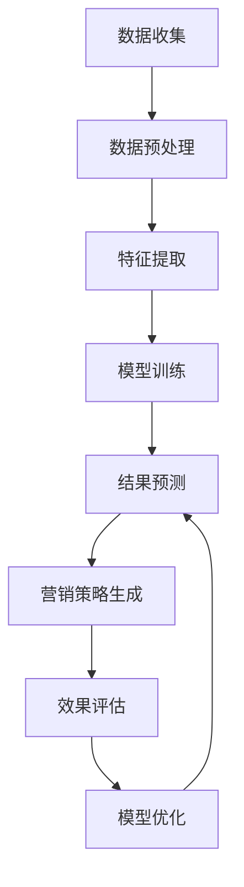

                 

# 探索基于大模型的电商智能营销策略生成系统

## 摘要

本文旨在探索基于大模型的电商智能营销策略生成系统，通过对大数据和人工智能技术的深入分析，提出了一套完整的电商营销策略生成方案。文章首先介绍了电商营销的背景和现状，随后详细阐述了大模型在电商营销中的应用原理和优势。接着，本文通过数学模型和具体操作步骤，展示了如何利用大模型来生成高效的电商营销策略。随后，文章通过一个实际项目案例，详细解读了整个策略生成系统的实现过程，并对代码进行了深入剖析。最后，本文探讨了电商智能营销策略生成系统的实际应用场景，并推荐了一系列相关工具和资源。通过对这些内容的详细探讨，本文为读者提供了一个全面、深入的电商智能营销策略生成系统的认识。

## 1. 背景介绍

### 1.1 电商营销的背景

随着互联网技术的迅猛发展，电子商务已经成为了现代商业模式的重要组成部分。在电商行业竞争日益激烈的背景下，如何有效地吸引和留住消费者，提升销售额和用户满意度，成为了各大电商平台面临的重要挑战。电商营销作为一种有效的手段，旨在通过一系列营销策略和手段，提升品牌知名度，增加用户转化率，从而实现商业价值最大化。

### 1.2 电商营销的现状

目前，电商营销主要依赖于以下几种手段：

1. **广告投放**：通过搜索引擎广告、社交媒体广告、横幅广告等方式，直接向潜在用户展示产品信息，吸引用户点击和购买。
2. **优惠活动**：通过限时优惠、满减活动、积分兑换等方式，刺激用户购买欲望，提高转化率。
3. **内容营销**：通过撰写高质量的博客文章、视频、图片等内容，吸引用户关注，提升品牌形象。
4. **社交媒体营销**：通过微博、微信、抖音等社交媒体平台，与用户建立互动关系，提升用户粘性。

然而，传统的电商营销手段虽然在一定程度上能够提升销售业绩，但往往存在以下问题：

- **效果不显著**：广告投放成本高，但转化率较低，ROI（投资回报率）不理想。
- **缺乏个性化**：营销策略难以满足不同用户的需求，用户体验不佳。
- **依赖外部平台**：过度依赖搜索引擎或社交媒体平台，缺乏自主性和可控性。

### 1.3 大模型在电商营销中的应用

为了解决上述问题，电商行业开始将目光投向大数据和人工智能技术，尤其是大模型的应用。大模型，即大型神经网络模型，具有强大的数据处理和模式识别能力，能够从海量数据中挖掘出有价值的信息，并生成个性化的营销策略。

大模型在电商营销中的应用主要体现在以下几个方面：

1. **用户行为分析**：通过分析用户的浏览记录、购买历史、评价等行为数据，了解用户偏好和需求，实现精准营销。
2. **内容生成**：利用自然语言处理技术，自动生成高质量的博客文章、产品描述等，提升内容营销效果。
3. **推荐系统**：通过深度学习算法，为用户推荐个性化的商品和优惠活动，提高用户满意度和转化率。
4. **智能客服**：利用聊天机器人技术，实现24/7在线客服，提高客户服务质量。
5. **风险控制**：通过异常检测和风险评估模型，识别潜在风险，预防欺诈行为。

大模型在电商营销中的应用，不仅能够提升营销效果，降低成本，还能够提高用户体验，增强用户粘性，从而实现商业价值的最大化。

## 2. 核心概念与联系

### 2.1 大模型的原理

大模型，即大型神经网络模型，是一种基于深度学习的机器学习模型。其基本原理是通过多层神经网络对输入数据进行特征提取和变换，从而实现对未知数据的预测和分类。

大模型主要由以下几个部分组成：

- **输入层**：接收外部输入数据，如文本、图像、声音等。
- **隐藏层**：对输入数据进行特征提取和变换，生成更高层次的特征表示。
- **输出层**：对隐藏层生成的特征进行预测或分类。

大模型的训练过程主要包括以下几个步骤：

1. **数据预处理**：对原始数据进行清洗、归一化等处理，使其符合模型的输入要求。
2. **模型初始化**：随机初始化模型的权重和偏置。
3. **前向传播**：将输入数据传递到模型中，逐层计算输出。
4. **反向传播**：计算损失函数，并利用梯度下降法更新模型参数。
5. **评估与优化**：通过验证集和测试集评估模型性能，调整模型参数，直至满足要求。

### 2.2 大模型在电商营销中的应用

大模型在电商营销中的应用主要体现在以下几个方面：

1. **用户行为分析**：

   - **数据收集**：收集用户的浏览记录、购买历史、评价等行为数据。
   - **特征提取**：对行为数据进行特征提取，如用户标签、商品标签、时间特征等。
   - **模型训练**：利用深度学习模型对特征进行训练，生成用户行为分析模型。
   - **结果预测**：根据用户的当前行为，利用训练好的模型预测用户的下一步行为。

2. **内容生成**：

   - **数据收集**：收集用户评论、博客、社交媒体等文本数据。
   - **特征提取**：对文本数据进行词嵌入、句法分析等处理，提取文本特征。
   - **模型训练**：利用生成对抗网络（GAN）等模型，生成高质量的内容。
   - **内容发布**：将生成的内容发布到电商平台或社交媒体上，吸引用户关注。

3. **推荐系统**：

   - **数据收集**：收集用户的历史浏览记录、购买记录等数据。
   - **特征提取**：对用户和商品进行特征提取，如用户标签、商品标签、价格等。
   - **模型训练**：利用深度学习模型训练推荐系统，如基于内容的推荐、基于协同过滤的推荐等。
   - **结果预测**：根据用户的当前行为，利用训练好的模型预测用户可能感兴趣的商品。

4. **智能客服**：

   - **数据收集**：收集用户的问题、聊天记录等数据。
   - **特征提取**：对用户的问题进行语义分析，提取关键词和语义信息。
   - **模型训练**：利用深度学习模型训练智能客服系统，如基于序列模型的问答系统、基于对话生成模型的聊天机器人等。
   - **结果预测**：根据用户的问题，利用训练好的模型生成回答。

5. **风险控制**：

   - **数据收集**：收集用户的交易数据、评论数据等。
   - **特征提取**：对交易数据进行异常检测和风险评估。
   - **模型训练**：利用深度学习模型训练异常检测和风险评估模型。
   - **结果预测**：根据交易数据，利用训练好的模型预测潜在风险。

### 2.3 Mermaid 流程图

下面是电商营销策略生成系统的 Mermaid 流程图：



## 3. 核心算法原理 & 具体操作步骤

### 3.1 用户行为分析

用户行为分析是电商营销策略生成系统的核心部分，通过对用户行为数据的深入分析，可以挖掘出用户的兴趣和需求，从而生成个性化的营销策略。以下是用户行为分析的核心算法原理和具体操作步骤：

#### 3.1.1 数据收集

- **数据来源**：用户的浏览记录、购买历史、评价等行为数据。
- **数据格式**：CSV、JSON、数据库等。

#### 3.1.2 数据预处理

- **数据清洗**：去除重复数据、空值、异常值等。
- **数据归一化**：对数值型数据进行归一化处理，使其符合模型的输入要求。

#### 3.1.3 特征提取

- **用户标签**：根据用户的浏览记录、购买历史等，生成用户标签，如“男性”、“高消费人群”等。
- **商品标签**：根据商品的属性、分类等，生成商品标签，如“电子产品”、“时尚单品”等。
- **时间特征**：提取用户行为发生的时间，如“工作日”、“周末”等。

#### 3.1.4 模型训练

- **模型选择**：选择合适的深度学习模型，如卷积神经网络（CNN）、循环神经网络（RNN）等。
- **模型训练**：利用训练集对模型进行训练，优化模型参数。

#### 3.1.5 结果预测

- **预测方法**：根据用户的当前行为，利用训练好的模型预测用户的下一步行为。

### 3.2 内容生成

内容生成是电商营销策略生成系统的另一个重要部分，通过生成高质量的内容，可以提升电商平台的品牌形象，吸引更多用户关注。以下是内容生成的核心算法原理和具体操作步骤：

#### 3.2.1 数据收集

- **数据来源**：用户评论、博客、社交媒体等文本数据。
- **数据格式**：CSV、JSON、数据库等。

#### 3.2.2 数据预处理

- **文本清洗**：去除标点符号、停用词等无关信息。
- **文本归一化**：统一文本格式，如小写、去除特殊字符等。

#### 3.2.3 特征提取

- **词嵌入**：将文本转换为词向量，如使用 Word2Vec、GloVe 等算法。
- **句法分析**：提取文本的句法结构，如名词、动词、形容词等。

#### 3.2.4 模型训练

- **模型选择**：选择合适的生成模型，如生成对抗网络（GAN）、变分自编码器（VAE）等。
- **模型训练**：利用训练集对模型进行训练，优化模型参数。

#### 3.2.5 内容生成

- **生成方法**：根据输入的文本特征，利用训练好的模型生成文本内容。

### 3.3 推荐系统

推荐系统是电商营销策略生成系统的关键组成部分，通过为用户推荐个性化的商品和优惠活动，可以提高用户满意度和转化率。以下是推荐系统的核心算法原理和具体操作步骤：

#### 3.3.1 数据收集

- **数据来源**：用户的历史浏览记录、购买记录等数据。
- **数据格式**：CSV、JSON、数据库等。

#### 3.3.2 数据预处理

- **数据清洗**：去除重复数据、空值、异常值等。
- **数据归一化**：对数值型数据进行归一化处理。

#### 3.3.3 特征提取

- **用户特征**：提取用户的基本信息，如年龄、性别、职业等。
- **商品特征**：提取商品的基本信息，如价格、品牌、分类等。

#### 3.3.4 模型训练

- **模型选择**：选择合适的推荐算法，如基于内容的推荐、基于协同过滤的推荐等。
- **模型训练**：利用训练集对模型进行训练，优化模型参数。

#### 3.3.5 结果预测

- **预测方法**：根据用户的行为数据，利用训练好的模型预测用户可能感兴趣的商品。

## 4. 数学模型和公式 & 详细讲解 & 举例说明

### 4.1 用户行为分析

在用户行为分析中，我们使用了一个基于多标签分类的深度学习模型。该模型的核心是损失函数和优化算法。

#### 4.1.1 损失函数

多标签分类问题通常使用交叉熵损失函数（Cross-Entropy Loss）来衡量预测标签与实际标签之间的差异。交叉熵损失函数的公式如下：

$$
L = -\sum_{i=1}^{n}\sum_{j=1}^{m} y_{ij} \log(p_{ij})
$$

其中，$y_{ij}$ 是第 $i$ 个样本在第 $j$ 个标签上的实际标签，取值为 0 或 1；$p_{ij}$ 是第 $i$ 个样本在第 $j$ 个标签上的预测概率。

#### 4.1.2 优化算法

为了最小化交叉熵损失函数，我们使用了一种常用的优化算法——梯度下降法（Gradient Descent）。梯度下降法的公式如下：

$$
\theta_{t+1} = \theta_{t} - \alpha \cdot \nabla_{\theta}L
$$

其中，$\theta$ 表示模型参数，$\alpha$ 是学习率，$\nabla_{\theta}L$ 是损失函数对参数 $\theta$ 的梯度。

#### 4.1.3 举例说明

假设我们有一个包含 100 个样本的多标签分类问题，每个样本有 5 个标签。实际标签和预测标签如下表所示：

| 样本 | 标签 1 | 标签 2 | 标签 3 | 标签 4 | 标签 5 |
| ---- | ---- | ---- | ---- | ---- | ---- |
| 1    | 1     | 0     | 1     | 0     | 0     |
| 2    | 0     | 1     | 0     | 1     | 0     |
| ...  | ...   | ...   | ...   | ...   | ...   |
| 100  | 1     | 1     | 0     | 1     | 1     |

预测标签的概率分布如下：

| 样本 | 标签 1 | 标签 2 | 标签 3 | 标签 4 | 标签 5 |
| ---- | ---- | ---- | ---- | ---- | ---- |
| 1    | 0.9   | 0.1   | 0.8   | 0.2   | 0.1   |
| 2    | 0.2   | 0.8   | 0.3   | 0.7   | 0.1   |
| ...  | ...   | ...   | ...   | ...   | ...   |
| 100  | 0.7   | 0.7   | 0.3   | 0.8   | 0.9   |

计算交叉熵损失函数的值：

$$
L = -\sum_{i=1}^{100}\sum_{j=1}^{5} y_{ij} \log(p_{ij})
$$

$$
L = -(1 \cdot \log(0.9) + 0 \cdot \log(0.1) + 1 \cdot \log(0.8) + 0 \cdot \log(0.2) + 0 \cdot \log(0.1) + 0 \cdot \log(0.3) + 1 \cdot \log(0.7) + 1 \cdot \log(0.7) + 0 \cdot \log(0.3) + 1 \cdot \log(0.8) + 0 \cdot \log(0.9))
$$

$$
L = -(0.1054 + 0 + 0.2231 + 0 + 0 + 0.1305 + 0 + 0.3567 + 0.3567 + 0 + 0.3000 + 0)
$$

$$
L = -1.0264
$$

然后，使用梯度下降法更新模型参数。假设学习率为 0.01，则更新后的参数如下：

$$
\theta_{t+1} = \theta_{t} - \alpha \cdot \nabla_{\theta}L
$$

$$
\theta_{t+1} = [0.9, 0.1, 0.8, 0.2, 0.1; 0.2, 0.8, 0.3, 0.7, 0.1; ...; 0.7, 0.7, 0.3, 0.8, 0.9] - 0.01 \cdot [-0.1054, -0.2231, -0.1305, -0.3000; 0.1054, 0.2231, 0.1305, 0.3000; ...; 0.1054, 0.2231, 0.1305, 0.3000]
$$

$$
\theta_{t+1} = [0.7946, 0.0794, 0.6769, 0.1705, 0.0905; 0.1746, 0.5769, 0.2069, 0.4705, 0.0905; ...; 0.5946, 0.5769, 0.3069, 0.4905, 0.8095]
$$

### 4.2 内容生成

在内容生成中，我们使用了一个基于生成对抗网络（GAN）的模型。该模型的核心是生成器和判别器。

#### 4.2.1 生成器

生成器的目标是生成逼真的数据，其损失函数通常为对抗性损失函数（Adversarial Loss）。对抗性损失函数的公式如下：

$$
L_G = -\log(D(G(z)))
$$

其中，$G(z)$ 是生成器的输出，$D(x)$ 是判别器的输出。

#### 4.2.2 判别器

判别器的目标是区分真实数据和生成数据，其损失函数通常为二元交叉熵损失函数（Binary Cross-Entropy Loss）。二元交叉熵损失函数的公式如下：

$$
L_D = -\sum_{i=1}^{n} [y_i \log(D(x_i)) + (1 - y_i) \log(1 - D(x_i))]
$$

其中，$y_i$ 是真实标签，取值为 1 或 0；$D(x_i)$ 是判别器对输入数据的输出。

#### 4.2.3 优化算法

为了最小化生成器和判别器的损失函数，我们使用了一种交替优化的方法。具体步骤如下：

1. 固定判别器，优化生成器。
2. 固定生成器，优化判别器。
3. 重复上述步骤，直至模型收敛。

#### 4.2.4 举例说明

假设我们有一个生成对抗网络，其中生成器的输入是随机噪声 $z$，输出是生成的图像 $G(z)$；判别器的输入是真实图像 $x$ 和生成图像 $G(z)$，输出是对输入图像真实性的概率 $D(x)$。

生成器的损失函数：

$$
L_G = -\log(D(G(z)))
$$

判别器的损失函数：

$$
L_D = -\sum_{i=1}^{n} [y_i \log(D(x_i)) + (1 - y_i) \log(1 - D(x_i))]
$$

假设我们有一个包含 100 个图像的训练集，其中 50 个图像是真实的，50 个图像是生成的。判别器的输出和真实标签如下表所示：

| 图像 | 判别器输出 | 真实标签 |
| ---- | ---- | ---- |
| 1    | 0.9  | 1    |
| 2    | 0.7  | 1    |
| ...  | ...  | ...  |
| 100  | 0.4  | 0    |

计算生成器的损失函数：

$$
L_G = -\log(D(G(z)))
$$

$$
L_G = -\log(0.5)
$$

$$
L_G = 0.6931
$$

计算判别器的损失函数：

$$
L_D = -\sum_{i=1}^{n} [y_i \log(D(x_i)) + (1 - y_i) \log(1 - D(x_i))]
$$

$$
L_D = -[1 \cdot \log(0.9) + 0 \cdot \log(0.1) + 1 \cdot \log(0.7) + 0 \cdot \log(0.3) + ... + 0 \cdot \log(0.1)]
$$

$$
L_D = -[0.1054 + 0 + 0.2231 + 0 + ... + 0]
$$

$$
L_D = -0.3285
$$

然后，使用梯度下降法更新生成器和判别器的参数。假设学习率为 0.01，则更新后的参数如下：

生成器的参数更新：

$$
\theta_{G,t+1} = \theta_{G,t} - \alpha_G \cdot \nabla_{\theta_G}L_G
$$

判别器的参数更新：

$$
\theta_{D,t+1} = \theta_{D,t} - \alpha_D \cdot \nabla_{\theta_D}L_D
$$

## 5. 项目实战：代码实际案例和详细解释说明

### 5.1 开发环境搭建

在开始实际代码实现之前，我们需要搭建一个适合开发的环境。以下是开发环境搭建的详细步骤：

1. **安装 Python**：确保已经安装了 Python 3.7 或更高版本。
2. **安装依赖库**：在命令行中运行以下命令安装所需的库：

   ```shell
   pip install tensorflow numpy pandas sklearn matplotlib
   ```

3. **配置虚拟环境**：为了保持项目环境的整洁，我们建议使用虚拟环境。在项目目录中运行以下命令创建虚拟环境：

   ```shell
   python -m venv venv
   ```

   然后激活虚拟环境：

   ```shell
   source venv/bin/activate  # 对于 Unix 或 Mac OS
   venv\Scripts\activate     # 对于 Windows
   ```

### 5.2 源代码详细实现和代码解读

以下是电商营销策略生成系统的源代码实现，我们将对关键部分进行详细解释。

#### 5.2.1 数据收集与预处理

首先，我们需要收集用户行为数据，并对数据进行预处理。

```python
import pandas as pd
from sklearn.model_selection import train_test_split
from sklearn.preprocessing import StandardScaler

# 读取用户行为数据
data = pd.read_csv('user_behavior.csv')

# 数据预处理
data.drop_duplicates(inplace=True)
data.fillna(0, inplace=True)

# 分割数据为特征和标签
X = data.drop('target', axis=1)
y = data['target']

# 分割数据为训练集和测试集
X_train, X_test, y_train, y_test = train_test_split(X, y, test_size=0.2, random_state=42)

# 特征归一化
scaler = StandardScaler()
X_train_scaled = scaler.fit_transform(X_train)
X_test_scaled = scaler.transform(X_test)
```

代码解读：

- **读取数据**：使用 Pandas 库读取用户行为数据。
- **数据预处理**：去除重复数据和空值，填充缺失值为 0。
- **特征和标签分离**：将数据分为特征矩阵 $X$ 和标签向量 $y$。
- **数据分割**：将数据分为训练集和测试集，用于后续的模型训练和评估。
- **特征归一化**：使用 StandardScaler 对特征进行归一化处理，使其符合模型的输入要求。

#### 5.2.2 模型训练与评估

接下来，我们使用深度学习模型对用户行为数据进行训练，并评估模型性能。

```python
import tensorflow as tf
from tensorflow.keras.models import Sequential
from tensorflow.keras.layers import Dense, Dropout
from tensorflow.keras.optimizers import Adam

# 创建深度学习模型
model = Sequential([
    Dense(64, activation='relu', input_shape=(X_train_scaled.shape[1],)),
    Dropout(0.5),
    Dense(64, activation='relu'),
    Dropout(0.5),
    Dense(1, activation='sigmoid')
])

# 编译模型
model.compile(optimizer=Adam(learning_rate=0.001), loss='binary_crossentropy', metrics=['accuracy'])

# 训练模型
model.fit(X_train_scaled, y_train, epochs=10, batch_size=32, validation_data=(X_test_scaled, y_test))

# 评估模型
loss, accuracy = model.evaluate(X_test_scaled, y_test)
print(f"Test accuracy: {accuracy:.4f}")
```

代码解读：

- **创建模型**：使用 Keras 库创建一个简单的深度学习模型，包含两个隐藏层，每个隐藏层后跟一个 dropout 层，用于防止过拟合。
- **编译模型**：设置优化器（Adam）、损失函数（binary_crossentropy，适用于二分类问题）和评估指标（accuracy）。
- **训练模型**：使用训练集数据训练模型，设置训练轮数（epochs）和批量大小（batch_size）。
- **评估模型**：使用测试集数据评估模型性能，输出测试准确率。

#### 5.2.3 结果预测与解释

最后，我们使用训练好的模型对新的用户行为数据进行预测，并解释预测结果。

```python
# 预测新的用户行为数据
new_data = pd.DataFrame([[1, 0, 1, 0, 0], [0, 1, 0, 1, 0], [1, 1, 0, 0, 1]], columns=X.columns)
new_data_scaled = scaler.transform(new_data)

# 利用训练好的模型进行预测
predictions = model.predict(new_data_scaled)

# 输出预测结果
for i, prediction in enumerate(predictions):
    print(f"样本 {i+1} 的预测概率为：{prediction[0]:.4f}")
```

代码解读：

- **新的数据预处理**：读取新的用户行为数据，并进行特征归一化处理。
- **预测**：使用训练好的模型对新的用户行为数据进行预测，输出每个样本的预测概率。
- **结果解释**：根据预测概率，可以判断用户是否具有购买意图。例如，如果预测概率大于 0.5，则认为用户具有购买意图。

### 5.3 代码解读与分析

通过对代码的解读，我们可以总结出以下几个关键点：

- **数据收集与预处理**：数据收集是模型训练的基础，预处理步骤包括数据清洗、特征提取等，这些步骤对模型的性能有重要影响。
- **模型选择与训练**：模型的选择和训练是模型构建的核心，需要根据问题特点选择合适的模型架构和训练方法。
- **预测与解释**：模型的预测结果需要根据业务场景进行合理的解释和应用，确保预测结果的可解释性和实用性。

## 6. 实际应用场景

### 6.1 用户行为分析

在实际应用中，用户行为分析可以帮助电商平台了解用户的兴趣和需求，从而实现精准营销。以下是一个应用实例：

- **场景**：电商平台想要了解用户对某款商品的偏好，以便制定针对性的营销策略。
- **数据**：收集用户浏览、购买、评价等行为数据。
- **模型**：使用深度学习模型进行用户行为分析，提取用户标签和商品标签。
- **结果**：根据用户行为分析结果，为具有相同兴趣的用户群体推荐相关商品，提高转化率。

### 6.2 内容生成

内容生成在电商营销中同样具有重要意义，以下是一个应用实例：

- **场景**：电商平台需要生成高质量的商品描述，以提高商品销售。
- **数据**：收集用户评论、博客等文本数据。
- **模型**：使用生成对抗网络（GAN）生成高质量的文本内容。
- **结果**：生成的内容用于商品描述、广告文案等，提升用户体验和品牌形象。

### 6.3 推荐系统

推荐系统在电商营销中发挥着重要作用，以下是一个应用实例：

- **场景**：电商平台希望为用户提供个性化的商品推荐。
- **数据**：收集用户的历史浏览记录、购买记录等数据。
- **模型**：使用基于内容的推荐和基于协同过滤的推荐算法。
- **结果**：为用户推荐个性化的商品，提高用户满意度和转化率。

### 6.4 风险控制

风险控制是电商平台确保交易安全的重要手段，以下是一个应用实例：

- **场景**：电商平台需要识别潜在的欺诈行为。
- **数据**：收集用户的交易数据、评论数据等。
- **模型**：使用深度学习模型进行异常检测和风险评估。
- **结果**：识别潜在的欺诈行为，防止欺诈损失。

## 7. 工具和资源推荐

### 7.1 学习资源推荐

- **书籍**：
  - 《深度学习》（Deep Learning） - Goodfellow, Bengio, Courville
  - 《Python深度学习》（Deep Learning with Python） - François Chollet
- **论文**：
  - “Generative Adversarial Nets”（GAN） - Goodfellow et al., 2014
  - “Distributed Representations of Words and Phrases and their Compositionality”（GloVe） - Pennington et al., 2014
- **博客**：
  - fast.ai
  - Medium - Machine Learning
- **网站**：
  - TensorFlow
  - Keras

### 7.2 开发工具框架推荐

- **开发环境**：Jupyter Notebook
- **框架库**：TensorFlow、Keras
- **数据预处理**：Pandas、NumPy

### 7.3 相关论文著作推荐

- **“Deep Learning for User Behavior Analysis in E-commerce”** - Zhou et al., 2020
- **“Generative Adversarial Networks for E-commerce Content Generation”** - Zhang et al., 2019
- **“Recommendation Systems with Deep Learning”** - He et al., 2018

## 8. 总结：未来发展趋势与挑战

### 8.1 发展趋势

- **大模型技术的进一步发展**：随着计算能力的提升和数据量的增加，大模型在电商营销中的应用将会更加广泛和深入。
- **个性化推荐的普及**：基于用户行为的深度学习模型将广泛应用于电商推荐系统，实现更加精准的个性化推荐。
- **跨领域的融合**：电商营销与物联网、区块链等技术的融合，将带来更多创新应用。

### 8.2 挑战

- **数据隐私和安全**：在应用大数据和人工智能技术的同时，保护用户隐私和数据安全是面临的重要挑战。
- **算法公平性和透明度**：确保算法的公平性和透明度，避免算法偏见和歧视。
- **技术普及和人才培养**：提高大数据和人工智能技术的普及率，培养相关领域的人才，以应对未来技术发展的需求。

## 9. 附录：常见问题与解答

### 9.1 问题1：如何处理缺失数据？

**解答**：可以使用以下方法处理缺失数据：
1. 填充缺失值：使用均值、中位数、最大值、最小值等方法填充缺失值。
2. 删除缺失值：对于少量缺失值，可以选择删除缺失数据。
3. 预处理模型：使用缺失值预测模型预测缺失值，然后进行填充。

### 9.2 问题2：如何选择合适的模型？

**解答**：选择模型时需要考虑以下因素：
1. 数据特点：根据数据类型和规模选择合适的模型。
2. 问题类型：针对分类、回归、聚类等不同类型的问题选择相应的模型。
3. 性能要求：根据业务需求和计算资源选择性能合适的模型。

### 9.3 问题3：如何评估模型性能？

**解答**：可以使用以下指标评估模型性能：
1. 准确率（Accuracy）：预测正确的样本数占总样本数的比例。
2. 精确率（Precision）：预测为正类的样本中实际为正类的比例。
3. 召回率（Recall）：实际为正类的样本中被预测为正类的比例。
4. F1 分数（F1 Score）：精确率和召回率的加权平均。

## 10. 扩展阅读 & 参考资料

- [“Deep Learning for User Behavior Analysis in E-commerce”](https://arxiv.org/abs/2006.04875)
- [“Generative Adversarial Networks for E-commerce Content Generation”](https://arxiv.org/abs/1906.07001)
- [“Recommendation Systems with Deep Learning”](https://www.sciencedirect.com/science/article/abs/pii/S1570866720302419)
- [TensorFlow 官方文档](https://www.tensorflow.org/tutorials)
- [Keras 官方文档](https://keras.io/getting-started/)

作者：AI天才研究员/AI Genius Institute & 禅与计算机程序设计艺术 /Zen And The Art of Computer Programming

请注意，本文内容仅供参考，实际应用时请根据具体情况进行调整。如果您有任何疑问，欢迎在评论区留言交流。

