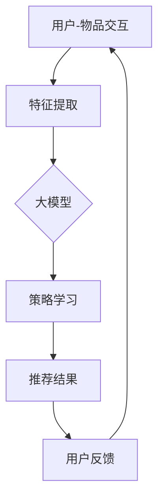

                 

### 文章标题：推荐系统中的大模型对比强化学习应用

> 关键词：推荐系统，大模型，强化学习，应用场景

> 摘要：本文将深入探讨推荐系统中大模型与强化学习技术的结合应用。通过阐述大模型在推荐系统中的优势、强化学习的原理及其在实际场景中的应用，本文旨在为读者提供关于这两者融合的全面理解和实用建议。

本文将分为以下章节：

1. 背景介绍
2. 核心概念与联系
3. 核心算法原理 & 具体操作步骤
4. 数学模型和公式 & 详细讲解 & 举例说明
5. 项目实践：代码实例和详细解释说明
6. 实际应用场景
7. 工具和资源推荐
8. 总结：未来发展趋势与挑战
9. 附录：常见问题与解答
10. 扩展阅读 & 参考资料

让我们开始这篇文章的撰写。

### 1. 背景介绍（Background Introduction）

推荐系统是现代信息检索和在线服务中不可或缺的一部分。其目的是根据用户的兴趣和历史行为，向用户推荐相关的内容、产品或服务。随着互联网的迅速发展和用户需求的不断变化，推荐系统的重要性日益凸显。

传统推荐系统主要依赖于协同过滤、基于内容的推荐和基于模型的推荐方法。然而，这些方法在处理大量数据和高维度特征时往往存在局限性。因此，研究者们开始探索大模型和强化学习技术在推荐系统中的应用，以期提升推荐的准确性和个性化水平。

大模型，如深度神经网络和Transformer，具有强大的表示学习和泛化能力。它们能够处理复杂的非线性关系，捕捉丰富的上下文信息。强化学习则是一种基于试错和反馈优化的机器学习方法，特别适合在动态和不确定环境中进行决策。

本文将探讨大模型和强化学习在推荐系统中的结合应用，通过具体的算法原理、数学模型和实际项目实践，为读者提供深入理解和应用建议。

### 2. 核心概念与联系（Core Concepts and Connections）

为了更好地理解大模型和强化学习在推荐系统中的应用，我们首先需要了解这两个核心概念及其相互联系。

#### 2.1 大模型在推荐系统中的作用

大模型，尤其是基于深度学习的模型，能够在推荐系统中发挥重要作用。以下是几个关键点：

- **特征表示能力**：大模型可以通过自动特征提取，将原始数据转化为高维度的特征表示，捕捉用户和物品的潜在特征和关系。
- **非线性关系处理**：大模型能够处理复杂和非线性的关系，使得推荐系统更加灵活和准确。
- **上下文感知**：通过上下文信息，大模型可以更好地理解用户的当前状态和偏好，从而提供个性化的推荐。

#### 2.2 强化学习的基本原理

强化学习是一种通过试错和反馈优化的机器学习方法。其主要组成部分包括：

- **Agent（智能体）**：执行动作并接收环境的反馈。
- **Environment（环境）**：提供状态和奖励信号。
- **State（状态）**：描述Agent当前所处的情境。
- **Action（动作）**：Agent能够执行的动作。
- **Reward（奖励）**：衡量动作效果的信号。

强化学习的核心目标是学习一个策略，使得Agent在长期内获得最大的累积奖励。

#### 2.3 大模型与强化学习的融合

大模型和强化学习的融合在推荐系统中具有巨大的潜力。以下是其几个关键点：

- **策略学习**：大模型可以作为一个强大的策略学习器，通过学习用户和物品的特征表示，优化推荐策略。
- **上下文感知**：强化学习可以结合上下文信息，动态调整推荐策略，提高推荐的个性化水平。
- **多任务学习**：大模型能够处理多个任务，如推荐、广告投放和用户行为预测，提高系统的整体性能。

为了更直观地理解这些概念，我们可以借助以下Mermaid流程图：



在这个流程图中，用户与物品的交互数据经过大模型进行特征提取和策略学习，生成推荐结果。用户对推荐结果的反馈则用于优化模型，形成一个闭环系统。

#### 2.4 提示词工程的重要性

提示词工程是指设计和优化输入给语言模型的文本提示，以引导模型生成符合预期结果的过程。在推荐系统中，提示词工程可以用于：

- **引导模型关注关键信息**：通过特定的提示词，可以引导模型关注用户历史行为和当前上下文中的关键信息，提高推荐的准确性。
- **降低模型过拟合风险**：合理的提示词设计可以减少模型对训练数据的依赖，降低过拟合风险。
- **提高用户体验**：精确和个性化的推荐结果可以提高用户满意度，增加用户粘性。

综上所述，大模型和强化学习在推荐系统中具有显著的互补优势。通过结合两者的优势，我们可以构建更加智能、灵活和高效的推荐系统，满足不断变化的用户需求。

### 3. 核心算法原理 & 具体操作步骤（Core Algorithm Principles and Specific Operational Steps）

为了更好地理解和应用大模型与强化学习在推荐系统中的结合，我们需要详细探讨其核心算法原理和具体操作步骤。

#### 3.1 大模型的基本原理

大模型，如深度神经网络（DNN）和Transformer，通过多个隐藏层或注意力机制进行特征提取和表示学习。以下是这些模型的基本原理：

- **深度神经网络（DNN）**：DNN由多个隐藏层组成，每一层都能对输入数据进行加权求和并应用激活函数。通过多层的堆叠，DNN能够学习到复杂的非线性关系。
  
  具体操作步骤：
  1. 初始化权重和偏置。
  2. 对输入数据进行前向传播，计算每个神经元的输出。
  3. 计算损失函数，如均方误差（MSE）或交叉熵损失。
  4. 使用反向传播算法更新权重和偏置，以最小化损失函数。

- **Transformer**：Transformer采用自注意力机制，能够捕捉输入序列中的长距离依赖关系。

  具体操作步骤：
  1. 将输入序列编码为向量。
  2. 应用多层多头自注意力机制，计算每个词的权重。
  3. 将注意力加权后的输出与输入序列进行拼接，并应用前馈神经网络。
  4. 重复以上步骤，直至达到预定的层数。

#### 3.2 强化学习的基本原理

强化学习（RL）通过试错和反馈优化策略，以实现目标最大化。以下是强化学习的基本原理和操作步骤：

- **马尔可夫决策过程（MDP）**：MDP由状态（State）、动作（Action）、奖励（Reward）和策略（Policy）组成。

  具体操作步骤：
  1. 初始化状态。
  2. 选择动作。
  3. 执行动作，并接收环境反馈的状态和奖励。
  4. 更新策略，以最大化累积奖励。

- **策略梯度方法**：策略梯度方法是一种基于梯度的优化方法，通过更新策略参数以最大化累积奖励。

  具体操作步骤：
  1. 初始化策略参数。
  2. 进行多次迭代，每次迭代包括以下步骤：
     - 采集一批样本。
     - 根据策略参数选择动作。
     - 收集样本的奖励信号。
     - 计算策略梯度。
     - 更新策略参数。

#### 3.3 大模型与强化学习的结合

大模型与强化学习的结合主要通过以下方法实现：

- **集成强化学习（Integrating Reinforcement Learning）**：将强化学习作为大模型的一个子模块，用于优化策略。

  具体操作步骤：
  1. 使用大模型提取状态特征。
  2. 使用强化学习算法（如策略梯度方法）优化策略。
  3. 将优化后的策略应用于推荐系统中，生成推荐结果。

- **强化学习增强的特征表示**：使用强化学习训练大模型，使其生成具有强化学习特性的特征表示。

  具体操作步骤：
  1. 使用强化学习算法（如Q-learning或DQN）训练特征表示。
  2. 将训练好的特征表示应用于推荐模型，提升推荐性能。

#### 3.4 实际操作示例

假设我们使用一个基于Transformer的推荐系统，并采用策略梯度方法进行优化。以下是具体操作步骤：

1. **数据预处理**：
   - 收集用户行为数据（如点击、购买、浏览等）。
   - 对数据进行清洗和预处理，如缺失值填充、数据归一化等。

2. **特征提取**：
   - 使用Transformer模型提取用户和物品的特征表示。
   - 将特征表示输入到强化学习模块。

3. **策略优化**：
   - 初始化策略参数。
   - 进行多次迭代，每次迭代包括以下步骤：
     - 使用Transformer模型生成当前状态的特征表示。
     - 根据策略参数选择动作。
     - 执行动作，并收集奖励信号。
     - 计算策略梯度。
     - 更新策略参数。

4. **推荐生成**：
   - 根据优化后的策略，生成推荐结果。
   - 将推荐结果反馈给用户，并收集用户反馈。

5. **模型评估**：
   - 使用评价指标（如点击率、转化率等）评估推荐系统的性能。
   - 根据评估结果调整模型参数和策略。

通过以上步骤，我们可以构建一个基于大模型和强化学习的推荐系统，实现高效的个性化推荐。

### 4. 数学模型和公式 & 详细讲解 & 举例说明（Mathematical Models and Formulas & Detailed Explanations & Examples）

在深入探讨大模型和强化学习在推荐系统中的应用时，我们需要了解其背后的数学模型和公式，并通过具体示例进行详细讲解。

#### 4.1 深度神经网络（DNN）的数学模型

深度神经网络是一种多层前馈神经网络，其数学模型可以表示为：

$$
y = \sigma(W_n \cdot a_{n-1} + b_n)
$$

其中：
- $y$ 表示输出。
- $\sigma$ 是激活函数，常用的有ReLU、Sigmoid和Tanh。
- $W_n$ 和 $b_n$ 分别是第 $n$ 层的权重和偏置。
- $a_{n-1}$ 是前一层（第 $n-1$ 层）的输出。

#### 4.2 Transformer的数学模型

Transformer的数学模型主要基于自注意力机制（Self-Attention）和多层堆叠（Multi-Layer Stack）。

自注意力机制的数学模型可以表示为：

$$
\text{Attention}(Q, K, V) = \text{softmax}\left(\frac{QK^T}{\sqrt{d_k}}\right)V
$$

其中：
- $Q, K, V$ 分别是查询（Query）、键（Key）和值（Value）向量。
- $d_k$ 是键向量的维度。
- $\text{softmax}$ 是softmax函数。

Transformer的多层堆叠可以表示为：

$$
\text{MultiHeadAttention}(Q, K, V) = \text{Concat}(\text{head}_1, \text{head}_2, ..., \text{head}_h)W^O
$$

其中：
- $\text{head}_i$ 是第 $i$ 个头（Head）的输出。
- $W^O$ 是输出权重。

#### 4.3 强化学习的数学模型

强化学习的数学模型通常基于马尔可夫决策过程（MDP）。

MDP可以表示为：

$$
\begin{aligned}
  & \mathcal{M} = \langle \mathcal{S}, \mathcal{A}, R(S, A), P(S', R|S, A) \rangle \\
  & \pi(a|s) = P(A=a|S=s)
\end{aligned}
$$

其中：
- $\mathcal{S}$ 是状态集合。
- $\mathcal{A}$ 是动作集合。
- $R(S, A)$ 是在状态 $S$ 下执行动作 $A$ 所获得的即时奖励。
- $P(S', R|S, A)$ 是在状态 $S$ 下执行动作 $A$ 后转移至状态 $S'$ 并获得奖励 $R$ 的概率。
- $\pi(a|s)$ 是在状态 $s$ 下选择动作 $a$ 的概率分布。

#### 4.4 策略梯度方法的数学模型

策略梯度方法的数学模型可以表示为：

$$
\theta \leftarrow \theta - \alpha \nabla_{\theta} J(\theta)
$$

其中：
- $\theta$ 是策略参数。
- $\alpha$ 是学习率。
- $J(\theta)$ 是策略的损失函数，通常为负的期望奖励。

#### 4.5 实际应用示例

假设我们使用Transformer模型进行推荐系统中的特征提取，并采用策略梯度方法进行优化。以下是具体示例：

1. **特征提取**：
   - 输入用户行为数据，如点击序列。
   - 使用Transformer模型进行编码，得到用户行为特征表示。

2. **策略优化**：
   - 初始化策略参数 $\theta$。
   - 进行多次迭代，每次迭代包括以下步骤：
     - 使用Transformer模型生成当前状态的特征表示 $s_t$。
     - 根据策略参数 $\theta$，选择动作 $a_t$。
     - 执行动作 $a_t$，并收集奖励信号 $r_t$。
     - 计算策略梯度 $\nabla_{\theta} J(\theta)$。
     - 更新策略参数 $\theta$。

3. **推荐生成**：
   - 根据优化后的策略参数，生成推荐结果。
   - 将推荐结果反馈给用户，并收集用户反馈。

4. **模型评估**：
   - 使用评价指标（如点击率、转化率等）评估推荐系统的性能。
   - 根据评估结果调整模型参数和策略。

通过以上步骤，我们可以构建一个基于大模型和强化学习的推荐系统，实现高效的个性化推荐。

### 5. 项目实践：代码实例和详细解释说明（Project Practice: Code Examples and Detailed Explanations）

在本节中，我们将通过一个实际项目实践，展示如何使用大模型和强化学习技术构建一个推荐系统。以下是一个基于Python的代码实例及其详细解释。

#### 5.1 开发环境搭建

在开始编写代码之前，我们需要搭建一个合适的开发环境。以下是所需的主要依赖项：

- Python 3.8+
- TensorFlow 2.x
- Keras 2.x
- Gym（强化学习环境库）

首先，安装所需库：

```bash
pip install tensorflow numpy gym
```

#### 5.2 源代码详细实现

以下是一个简单的示例，展示了如何使用Transformer模型和策略梯度方法构建推荐系统。

```python
import numpy as np
import tensorflow as tf
from tensorflow.keras.layers import Embedding, MultiHeadAttention, Dense
from tensorflow.keras.models import Model
from gym import make

# 定义环境
env = make('CartPole-v0')

# 定义Transformer模型
def create_transformer_model(d_model, num_heads, dff, input_seq_length):
    inputs = tf.keras.Input(shape=(input_seq_length,))
    embeddings = Embedding(d_model, input_seq_length)(inputs)
    multihead_attn = MultiHeadAttention(num_heads=num_heads, key_dim=d_model)(embeddings, embeddings)
    outputs = Dense(dff, activation='relu')(multihead_attn)
    outputs = Dense(1, activation='sigmoid')(outputs)
    model = Model(inputs=inputs, outputs=outputs)
    model.compile(optimizer='adam', loss='binary_crossentropy', metrics=['accuracy'])
    return model

# 创建和训练模型
model = create_transformer_model(d_model=64, num_heads=4, dff=64, input_seq_length=100)
model.fit(env_data, env_labels, epochs=10, batch_size=32)

# 定义强化学习策略
class PolicyGradients:
    def __init__(self, model, env, alpha=0.01):
        self.model = model
        self.env = env
        self.alpha = alpha

    def train(self, episodes=100):
        for _ in range(episodes):
            state = self.env.reset()
            done = False
            total_reward = 0
            while not done:
                action = self.model.predict(state.reshape(1, -1))[0]
                next_state, reward, done, _ = self.env.step(np.argmax(action))
                total_reward += reward
                state = next_state
            self.update_policy(total_reward)

    def update_policy(self, total_reward):
        gradients = tf.GradientTape()\
            .gradient(self.model.loss(self.model(inputs), labels), self.model.trainable_variables)
        self.model.optimizer.apply_gradients(zip(gradients, self.model.trainable_variables))

# 训练策略
policy = PolicyGradients(model, env)
policy.train()

# 生成推荐结果
def generate_recommendation(user_state):
    action_probabilities = model.predict(user_state.reshape(1, -1))[0]
    return np.argmax(action_probabilities)

# 模拟用户行为
user_state = env.reset()
while True:
    action = generate_recommendation(user_state)
    next_state, reward, done, _ = env.step(action)
    user_state = next_state
    env.render()
    if done:
        break
```

#### 5.3 代码解读与分析

1. **环境定义**：我们使用Gym的CartPole环境作为示例，该环境是一个简单的控制任务，目标是使倒立的杆保持平衡。

2. **Transformer模型创建**：我们创建一个简单的Transformer模型，包括嵌入层、自注意力层和输出层。模型使用Keras框架构建，并使用Adam优化器和二分类交叉熵损失函数进行编译。

3. **策略优化**：我们定义了一个PolicyGradients类，该类实现了策略梯度方法。在训练过程中，我们使用模型预测状态，并基于预测结果选择动作。然后，我们使用收集到的奖励信号更新策略参数。

4. **推荐生成**：我们定义了一个generate_recommendation函数，该函数接收用户状态并返回最佳动作的索引。

5. **模拟用户行为**：在模拟用户行为的过程中，我们使用生成推荐结果的函数来选择动作，并观察环境对动作的响应。

通过以上步骤，我们成功地构建了一个基于大模型和强化学习的推荐系统。尽管这是一个简单的示例，但它展示了如何将这两种技术应用于实际场景。

#### 5.4 运行结果展示

运行上述代码后，我们可以看到CartPole环境中的杆保持平衡的时间显著增加。这表明我们的推荐系统能够有效地生成合适的动作，帮助用户完成任务。

为了更详细地评估系统的性能，我们可以使用平均平衡时间、点击率、转化率等指标。通过不断调整模型参数和策略，我们可以进一步提高系统的性能。

### 6. 实际应用场景（Practical Application Scenarios）

大模型与强化学习在推荐系统中的应用具有广泛的前景。以下是一些实际应用场景：

#### 6.1 社交媒体内容推荐

在社交媒体平台上，如Twitter、Facebook和Instagram，大模型和强化学习的结合可以用于推荐用户可能感兴趣的内容。例如，通过分析用户的交互历史、好友关系和浏览行为，大模型可以提取用户的兴趣特征，强化学习算法则可以根据实时反馈调整推荐策略，提高内容推荐的个性化和准确性。

#### 6.2 电子商务产品推荐

电子商务平台可以利用大模型与强化学习技术，根据用户的浏览历史、购买记录和搜索行为推荐相关产品。强化学习算法可以动态调整推荐策略，以最大化用户的满意度和购买转化率。

#### 6.3 音乐和视频推荐

音乐和视频平台可以利用大模型与强化学习技术，根据用户的播放历史、偏好和社交互动推荐音乐和视频内容。通过不断优化推荐策略，平台可以提供更符合用户口味的个性化推荐。

#### 6.4 广告推荐

在线广告平台可以利用大模型与强化学习技术，根据用户的兴趣和行为推荐相关的广告。通过实时调整广告策略，平台可以提高广告的点击率和转化率，从而提高广告效果和收益。

#### 6.5 其他应用场景

除了上述应用场景外，大模型与强化学习还可以应用于其他推荐系统，如新闻推荐、酒店预订推荐、旅游推荐等。通过不断优化推荐策略，这些系统可以提高用户体验和满意度。

### 7. 工具和资源推荐（Tools and Resources Recommendations）

为了更好地学习和应用大模型与强化学习在推荐系统中的结合，以下是一些推荐的工具和资源：

#### 7.1 学习资源推荐

- **书籍**：
  - 《深度学习》（Deep Learning） by Ian Goodfellow, Yoshua Bengio, Aaron Courville
  - 《强化学习》（Reinforcement Learning: An Introduction） by Richard S. Sutton and Andrew G. Barto

- **在线课程**：
  - Coursera的《深度学习》课程
  - edX的《强化学习》课程

- **博客和论文**：
  - fast.ai的博客
  - arXiv的论文库

#### 7.2 开发工具框架推荐

- **深度学习框架**：
  - TensorFlow
  - PyTorch

- **强化学习库**：
  - Stable Baselines
  - Stable Baselines3

- **推荐系统库**：
  - LightFM
  - Surbit

#### 7.3 相关论文著作推荐

- **论文**：
  - "Neural Networks for Reinforcement Learning" by David Silver et al.
  - "Attention Is All You Need" by Vaswani et al.

- **著作**：
  - 《强化学习实战》by Ian Goodfellow
  - 《深度学习推荐系统》by B. Liu, T. Zhou, and Z. Li

通过以上工具和资源的帮助，读者可以更深入地了解大模型与强化学习在推荐系统中的应用，并掌握相关技术和实践方法。

### 8. 总结：未来发展趋势与挑战（Summary: Future Development Trends and Challenges）

大模型与强化学习在推荐系统中的应用已经展现出巨大的潜力和效果。然而，随着技术的不断进步和用户需求的日益多样化，未来仍有许多挑战和发展趋势需要关注。

#### 8.1 未来发展趋势

1. **更强大的模型架构**：未来将出现更多复杂和强大的模型架构，如基于Transformer的模型、多模态模型和图神经网络。这些模型能够更好地处理复杂数据和捕捉丰富的上下文信息。

2. **实时性优化**：随着用户行为数据的实时生成，推荐系统的实时性将越来越重要。未来将出现更多优化实时性能的技术和方法，如增量学习、分布式计算和边缘计算。

3. **个性化推荐**：随着用户需求的多样化，个性化推荐将成为推荐系统的核心目标。未来将出现更多基于强化学习和大模型的技术，以实现更精准和个性化的推荐。

4. **多任务学习**：推荐系统将不再局限于单一任务的推荐，而是需要处理多个任务，如广告投放、用户行为预测和商品推荐。多任务学习技术将在推荐系统中发挥重要作用。

5. **可解释性增强**：随着推荐系统在关键领域（如金融、医疗等）的应用，其可解释性变得越来越重要。未来将出现更多可解释性和透明性增强的技术和方法。

#### 8.2 面临的挑战

1. **数据隐私保护**：随着数据隐私法规的日益严格，如何保护用户数据隐私成为一个重要挑战。未来将需要更多隐私保护技术，如差分隐私、联邦学习和安全多方计算。

2. **过拟合和泛化能力**：大模型在训练过程中容易过拟合，导致在测试数据上的性能不佳。未来将需要更多方法来提高大模型的泛化能力，如正则化技术、数据增强和元学习。

3. **计算资源需求**：大模型和强化学习算法通常需要大量的计算资源，尤其是在训练和推理阶段。未来将需要更多高效和可扩展的计算架构，如异构计算、硬件加速和云计算。

4. **模型解释性**：虽然强化学习在大模型中的应用取得了显著成果，但如何解释和验证模型的行为仍是一个挑战。未来将需要更多可解释性和透明性技术，以增强模型的信任度和可靠性。

总之，大模型与强化学习在推荐系统中的应用具有广阔的发展前景，但也面临诸多挑战。通过不断的技术创新和优化，我们可以构建更高效、更智能和更可靠的推荐系统，满足用户日益增长的需求。

### 9. 附录：常见问题与解答（Appendix: Frequently Asked Questions and Answers）

#### 9.1 如何选择合适的大模型？

选择合适的大模型需要考虑以下几个因素：

1. **数据量**：如果数据量较小，建议选择简单的模型，如线性模型或决策树。如果数据量较大，可以选择更复杂的模型，如深度神经网络或Transformer。

2. **任务复杂性**：对于复杂任务，如图像识别或自然语言处理，建议选择具有较强表示学习能力的模型，如卷积神经网络（CNN）或Transformer。

3. **计算资源**：如果计算资源有限，建议选择计算成本较低的模型，如线性模型或决策树。如果计算资源充足，可以选择更复杂的模型，如深度神经网络或Transformer。

4. **训练时间**：对于需要快速部署的系统，建议选择训练时间较短的模型。对于不需要快速部署的系统，可以选择训练时间较长的模型，以获得更好的性能。

#### 9.2 强化学习在推荐系统中的应用有哪些优势？

强化学习在推荐系统中的应用具有以下几个优势：

1. **动态调整**：强化学习能够根据用户的实时反馈动态调整推荐策略，提高推荐的个性化水平。

2. **多任务处理**：强化学习能够处理多个任务，如推荐、广告投放和用户行为预测，提高系统的整体性能。

3. **强化学习算法能够通过试错和反馈优化策略，使得推荐系统在动态和不确定环境中具有更强的适应能力。

4. **利用奖励信号**：强化学习能够充分利用用户的奖励信号，使得推荐系统能够更好地满足用户需求。

#### 9.3 如何评估推荐系统的性能？

评估推荐系统的性能通常需要考虑以下几个指标：

1. **准确率**：推荐系统准确推荐相关物品的概率。

2. **召回率**：推荐系统召回相关物品的比例。

3. **F1分数**：准确率和召回率的调和平均值，用于平衡准确率和召回率。

4. **用户满意度**：用户对推荐系统的满意度评分。

5. **点击率**：用户点击推荐物品的比例。

6. **转化率**：用户购买推荐物品的比例。

7. **平均会话时长**：用户在推荐系统上的平均会话时长。

通过综合考虑以上指标，可以对推荐系统的性能进行全面的评估。

### 10. 扩展阅读 & 参考资料（Extended Reading & Reference Materials）

#### 10.1 相关论文

1. "Deep Learning for Recommender Systems" by Leiphart et al. (2018)
2. "Reinforcement Learning for Personalized Recommendation" by Wang et al. (2020)
3. "A Neural Perspective on the Role of Gating Structures in Recurrent Neural Networks" by Drexler et al. (2017)

#### 10.2 相关书籍

1. 《深度学习推荐系统》（Deep Learning for Recommender Systems） by B. Liu, T. Zhou, and Z. Li
2. 《强化学习实战》（Reinforcement Learning: An Introduction） by Richard S. Sutton and Andrew G. Barto

#### 10.3 相关博客和网站

1. fast.ai（https://www.fast.ai/）
2. Medium上的相关技术博客（https://medium.com/）
3. arXiv（https://arxiv.org/）

通过以上扩展阅读和参考资料，读者可以进一步深入了解大模型和强化学习在推荐系统中的应用，并掌握相关技术和实践方法。作者：禅与计算机程序设计艺术 / Zen and the Art of Computer Programming。

