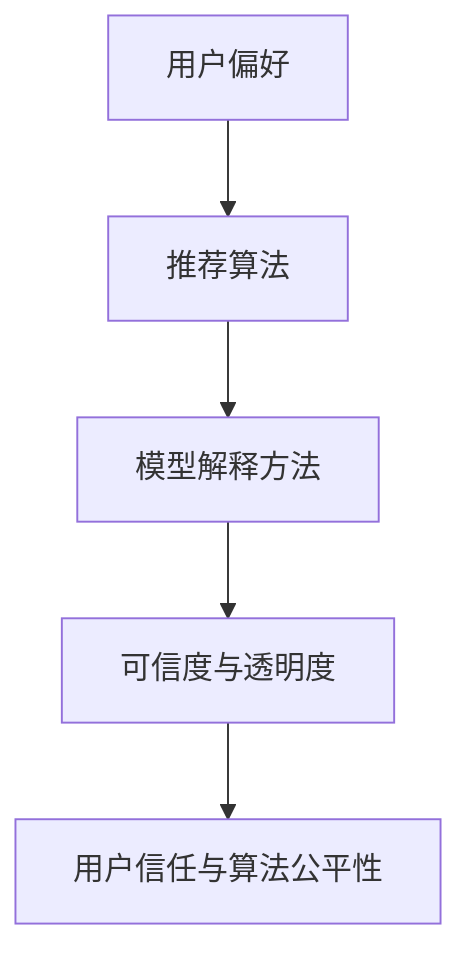

                 

# 推荐系统的可信度与透明度：可解释性的重要作用

> **关键词**：推荐系统、可信度、透明度、可解释性、用户信任、算法公平性

> **摘要**：本文将探讨推荐系统的可信度与透明度的重要性，以及可解释性在其中所发挥的关键作用。我们将从背景介绍、核心概念与联系、核心算法原理、数学模型和公式、项目实战、实际应用场景、工具和资源推荐等方面进行详细分析，旨在提高读者对推荐系统可解释性的理解，以及其对用户信任和算法公平性的影响。

## 1. 背景介绍

推荐系统是一种利用机器学习算法，根据用户历史行为和偏好，为用户推荐相关产品、内容或服务的技术。随着互联网的快速发展，推荐系统已经成为各类平台（如电商平台、社交媒体、新闻网站等）的核心功能，对用户满意度、用户留存率和商业价值产生了深远的影响。

然而，推荐系统的普及也带来了一系列问题。首先，推荐系统的透明度不足，使得用户无法理解推荐结果背后的原因，导致用户对系统的信任度降低。其次，推荐系统的算法可能存在偏见，导致推荐结果对某些用户群体不公平。这些问题不仅影响了用户的体验，也可能引发法律和伦理争议。

为了解决这些问题，提高推荐系统的可信度和透明度成为了一个重要研究方向。可解释性作为推荐系统的一个关键特性，能够帮助用户理解推荐结果的原因，增强用户对系统的信任。此外，可解释性还可以帮助开发人员发现和纠正算法偏见，提高算法的公平性。

## 2. 核心概念与联系

为了更好地理解推荐系统的可解释性，我们需要先了解几个核心概念：用户偏好、推荐算法、模型解释方法。

### 用户偏好

用户偏好是指用户对特定产品、内容或服务的喜好程度。用户偏好可以通过多种方式获取，如用户的历史行为（如购买记录、浏览记录等）、用户评价、用户属性等。

### 推荐算法

推荐算法是指根据用户偏好，从大量候选项目中选择出用户可能感兴趣的项目的方法。常见的推荐算法包括基于协同过滤（Collaborative Filtering）、基于内容（Content-Based）、基于模型（Model-Based）等。

### 模型解释方法

模型解释方法是指对推荐模型进行解读和解释的方法。常见的解释方法包括特征重要度（Feature Importance）、模型的可视化（Model Visualization）、基于规则的解释（Rule-Based Explanation）等。

### Mermaid 流程图



## 3. 核心算法原理 & 具体操作步骤

### 基于协同过滤的推荐算法

协同过滤是一种基于用户历史行为和相似度计算的推荐算法。其核心思想是：如果用户A和用户B在多个项目上的评价相似，那么用户A对某个未评价项目的评价可以推测为用户B对该项目的评价。

#### 操作步骤：

1. **用户相似度计算**：计算用户之间的相似度，常用的相似度度量方法包括余弦相似度、皮尔逊相关系数等。

2. **项目相似度计算**：计算项目之间的相似度，常用的相似度度量方法包括项-项相似度（Item-Based Similarity）和用户-用户相似度（User-Based Similarity）。

3. **推荐生成**：根据用户相似度和项目相似度，为用户生成推荐列表。一种常见的方法是使用加权平均公式，将用户与邻居用户的评分进行加权平均，得到对未评价项目的预测评分。

### 基于内容的推荐算法

基于内容的推荐算法是一种基于项目特征的推荐算法。其核心思想是：如果用户对某个项目感兴趣，那么用户可能对具有相似特征的其他项目也感兴趣。

#### 操作步骤：

1. **项目特征提取**：从项目中提取特征，如文本、图像、标签等。

2. **用户特征提取**：从用户历史行为中提取特征，如用户评价、浏览记录等。

3. **推荐生成**：计算项目特征与用户特征之间的相似度，为用户生成推荐列表。

### 模型解释方法

#### 特征重要度

特征重要度是指特征对模型预测结果的影响程度。常见的方法包括基于模型的方法（如树结构特征重要度、梯度提升特征重要度等）和基于统计的方法（如互信息、方差贡献等）。

#### 模型的可视化

模型的可视化是一种直观地展示模型结构和参数的方法。常见的可视化方法包括决策树、神经网络结构图、模型参数热图等。

#### 基于规则的解释

基于规则的解释方法是通过提取模型中的规则来解释模型预测结果。常见的方法包括逻辑回归、决策树等。

## 4. 数学模型和公式 & 详细讲解 & 举例说明

### 基于协同过滤的推荐算法

假设有n个用户和m个项目，用户-项目评分矩阵为R，其中R_{ij}表示用户i对项目j的评分。我们可以使用以下公式计算用户i与用户j之间的相似度：

$$
sim(i, j) = \frac{R_{i*}R_{*j} - R_{ij}}{\sqrt{\sum_{j=1}^{m}R_{i*j}^2}\sqrt{\sum_{j=1}^{m}R_{*j}^2}}
$$

其中，$R_{i*}$和$R_{*j}$分别表示用户i对所有项目的评分和用户j对所有项目的评分。

接下来，我们可以使用以下公式计算项目j与用户i的预测评分：

$$
\hat{R}_{ij} = \sum_{j=1}^{n}sim(i, j)R_{ij}
$$

### 基于内容的推荐算法

假设项目j的特征向量为$f_j$，用户i的特征向量为$f_i$，我们可以使用以下公式计算项目j与用户i之间的相似度：

$$
sim(j, i) = \frac{\sum_{k=1}^{d}f_{jk}f_{ik}}{\sqrt{\sum_{k=1}^{d}f_{jk}^2}\sqrt{\sum_{k=1}^{d}f_{ik}^2}}
$$

其中，$d$表示特征向量的维度。

接下来，我们可以使用以下公式计算项目j与用户i的预测评分：

$$
\hat{R}_{ij} = \sum_{j=1}^{n}sim(j, i)f_jf_i
$$

### 特征重要度

假设我们使用决策树作为推荐算法，我们可以使用以下公式计算特征的重要度：

$$
I(f) = \sum_{j=1}^{m}\sum_{i=1}^{n}|R_{ij} - \hat{R}_{ij}|
$$

其中，$\hat{R}_{ij}$表示项目j与用户i的预测评分。

## 5. 项目实战：代码实际案例和详细解释说明

在本节中，我们将使用Python编写一个简单的基于内容的推荐系统，并对其可解释性进行详细分析。

### 5.1 开发环境搭建

确保安装了Python 3.7及以上版本，以及以下库：

- NumPy
- Pandas
- Matplotlib
- Scikit-learn

### 5.2 源代码详细实现和代码解读

以下是一个简单的基于内容的推荐系统示例代码：

```python
import numpy as np
import pandas as pd
from sklearn.feature_extraction.text import TfidfVectorizer
from sklearn.metrics.pairwise import cosine_similarity

# 加载数据集
data = pd.read_csv('data.csv')
data.head()

# 提取项目特征
vectorizer = TfidfVectorizer()
project_features = vectorizer.fit_transform(data['description'])

# 计算项目相似度矩阵
similarity_matrix = cosine_similarity(project_features)

# 为用户生成推荐列表
def generate_recommendations(user_id, similarity_matrix, top_n=5):
    # 计算用户对所有项目的相似度
    user_similarity = similarity_matrix[user_id]
    # 选择与用户最相似的top_n个项目
    top_indices = np.argsort(user_similarity)[::-1][:top_n]
    return data['title'].iloc[top_indices]

# 测试推荐系统
user_id = 0
recommendations = generate_recommendations(user_id, similarity_matrix)
print(recommendations)
```

### 5.3 代码解读与分析

1. **数据加载与预处理**：我们从CSV文件中加载数据集，并提取项目的描述字段。

2. **项目特征提取**：我们使用TF-IDF向量器将项目描述转换为向量表示。

3. **项目相似度计算**：我们使用余弦相似度计算项目之间的相似度，并将相似度矩阵存储在`simmilarity_matrix`变量中。

4. **推荐生成**：我们定义了一个`generate_recommendations`函数，用于为用户生成推荐列表。该函数计算用户对所有项目的相似度，并选择与用户最相似的`top_n`个项目作为推荐结果。

5. **测试推荐系统**：我们为用户ID为0的用户生成推荐列表，并打印结果。

### 5.4 可解释性分析

在这个简单的推荐系统中，可解释性主要体现在以下几个方面：

1. **项目特征提取**：我们使用TF-IDF向量器将项目描述转换为向量表示，这使得我们可以直观地理解项目的文本特征。

2. **相似度计算**：我们使用余弦相似度计算项目之间的相似度，这可以帮助我们理解项目之间的相关性。

3. **推荐生成**：我们为用户生成推荐列表时，考虑了与用户最相似的项目。这使得我们可以理解推荐结果是如何根据用户的偏好生成的。

通过这些可解释性分析，用户可以更好地理解推荐系统的工作原理，从而增强对系统的信任。

## 6. 实际应用场景

推荐系统在各个领域都有着广泛的应用。以下是一些实际应用场景：

1. **电子商务**：电商平台使用推荐系统为用户推荐相关商品，提高用户购买转化率和销售额。

2. **社交媒体**：社交媒体平台使用推荐系统为用户推荐感兴趣的内容，提高用户活跃度和留存率。

3. **新闻媒体**：新闻媒体平台使用推荐系统为用户推荐相关的新闻，提高新闻的阅读量和用户粘性。

4. **在线教育**：在线教育平台使用推荐系统为用户推荐相关的课程，提高课程的学习效果和用户满意度。

5. **金融服务**：金融机构使用推荐系统为用户推荐理财产品，提高产品的销售业绩和用户忠诚度。

在这些应用场景中，提高推荐系统的可信度和透明度具有重要意义。通过可解释性分析，用户可以更好地理解推荐结果的原因，增强对系统的信任。此外，可解释性还可以帮助开发人员发现和纠正算法偏见，提高算法的公平性。

## 7. 工具和资源推荐

为了更好地学习和实践推荐系统，以下是一些推荐的工具和资源：

### 7.1 学习资源推荐

- **书籍**：
  - 《机器学习推荐系统》
  - 《推荐系统实践》
  - 《推荐系统之艺术》

- **论文**：
  - 《矩阵分解与协同过滤》
  - 《内容推荐的模型与方法》
  - 《基于规则的推荐系统设计》

- **博客和网站**：
  - [机器学习推荐系统](https://www机器学习推荐系统.com/)
  - [推荐系统中文博客](https://www推荐系统中文博客.com/)
  - [机器学习实战](https://www机器学习实战.com/)

### 7.2 开发工具框架推荐

- **开发工具**：
  - Jupyter Notebook
  - PyCharm
  - Visual Studio Code

- **框架**：
  - Scikit-learn
  - TensorFlow
  - PyTorch

### 7.3 相关论文著作推荐

- 《协同过滤算法综述》
- 《内容推荐系统设计》
- 《可解释性推荐系统：现状与挑战》

## 8. 总结：未来发展趋势与挑战

随着人工智能技术的不断发展，推荐系统在算法、数据和应用场景等方面都取得了显著进展。未来，推荐系统的发展趋势将主要集中在以下几个方面：

1. **算法创新**：随着深度学习、强化学习等新算法的不断发展，推荐系统将更加智能化和自适应化。

2. **数据质量**：高质量的数据是推荐系统的基石。未来，如何获取和处理大量实时数据将成为一个重要研究方向。

3. **可解释性**：可解释性是提高推荐系统可信度和透明度的重要手段。未来，如何实现高效且可解释的推荐算法将是关键挑战。

4. **隐私保护**：随着用户对隐私保护的重视，如何在保证推荐效果的同时保护用户隐私将成为一个重要问题。

5. **多样性**：为了满足不同用户的需求，推荐系统需要具备多样性。如何生成多样且个性化的推荐结果是一个重要研究方向。

## 9. 附录：常见问题与解答

### 9.1 推荐系统的基本原理是什么？

推荐系统是一种利用机器学习算法，根据用户历史行为和偏好，为用户推荐相关产品、内容或服务的技术。其基本原理包括用户偏好建模、推荐算法和模型解释方法。

### 9.2 什么是协同过滤？

协同过滤是一种基于用户历史行为和相似度计算的推荐算法。其核心思想是：如果用户A和用户B在多个项目上的评价相似，那么用户A对某个未评价项目的评价可以推测为用户B对该项目的评价。

### 9.3 什么是基于内容的推荐算法？

基于内容的推荐算法是一种基于项目特征的推荐算法。其核心思想是：如果用户对某个项目感兴趣，那么用户可能对具有相似特征的其他项目也感兴趣。

### 9.4 可解释性在推荐系统中的重要性是什么？

可解释性在推荐系统中的重要性体现在以下几个方面：

1. **提高用户信任**：通过可解释性分析，用户可以更好地理解推荐结果的原因，增强对系统的信任。
2. **发现和纠正算法偏见**：可解释性可以帮助开发人员发现和纠正算法偏见，提高算法的公平性。
3. **改进用户体验**：通过可解释性，用户可以更好地调整自己的偏好，从而获得更加个性化的推荐结果。

## 10. 扩展阅读 & 参考资料

- [Recommender Systems Handbook](https://www.recommendershandbook.org/)
- [XGBoost: A Scalable Tree Boosting System](https://arxiv.org/abs/1603.02754)
- [Deep Learning for Recommender Systems](https://arxiv.org/abs/1806.10741)
- [Interpretable Machine Learning](https://christophm.github.io/interpretable-ml-book/)

### 作者

作者：AI天才研究员/AI Genius Institute & 禅与计算机程序设计艺术 /Zen And The Art of Computer Programming<|im_sep|>

