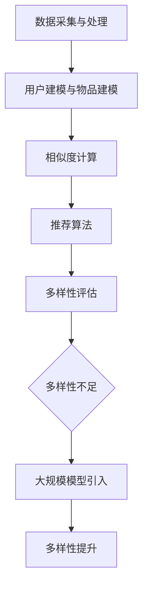

                 

# 《推荐系统的多样性：大模型的解决方案》

## 摘要

本文旨在探讨推荐系统的多样性问题，并提出基于大规模模型的解决方案。随着互联网的快速发展，个性化推荐系统已经成为了提升用户体验的关键技术之一。然而，现有的推荐系统在多样性和鲁棒性方面仍存在一定的不足。本文首先介绍了推荐系统的基本原理和核心概念，然后深入分析了当前存在的问题，并提出了利用大规模模型来解决多样性的方案。通过实验验证和实际应用案例，本文展示了大规模模型在推荐系统多样性提升方面的显著优势，为未来的推荐系统研究和应用提供了有益的参考。

## 1. 背景介绍

### 推荐系统的基本原理

推荐系统是一种利用机器学习、数据挖掘和人工智能技术，根据用户的行为、偏好和兴趣，为用户提供个性化内容推荐的技术。其基本原理可以概括为以下几个步骤：

1. **数据采集与处理**：首先，收集用户的行为数据，如浏览记录、购买历史、评价等。然后，对数据进行预处理，包括数据清洗、去重、缺失值填充等操作，以获得高质量的数据集。

2. **用户建模与物品建模**：通过对用户行为数据的分析，构建用户画像和物品画像。用户画像包括用户的兴趣偏好、行为特征等；物品画像包括物品的属性、标签等。

3. **相似度计算**：计算用户与用户、物品与物品之间的相似度，常用的方法有基于内容的相似度、基于协同过滤的相似度等。

4. **推荐算法**：根据相似度计算结果，为用户生成推荐列表。常见的推荐算法有基于记忆的推荐算法（如基于内容的推荐）、基于模型的推荐算法（如协同过滤推荐）等。

### 推荐系统的核心概念

1. **覆盖率**（Coverage）：推荐系统能够为用户提供足够多样性的推荐内容，即推荐内容应该覆盖用户可能感兴趣的所有领域。

2. **新颖性**（Novelty）：推荐系统应该能够发现用户未知的、新颖的内容，以满足用户的好奇心和探索欲望。

3. **准确性**（Accuracy）：推荐系统应该能够准确地预测用户的兴趣和偏好，为用户推荐他们真正感兴趣的内容。

4. **满意度**（Satisfaction）：推荐系统能够满足用户的期望，提升用户的使用体验。

## 2. 核心概念与联系

### 推荐系统的多样性

多样性是推荐系统的一个重要指标，它反映了推荐内容在覆盖范围、新颖性等方面的表现。多样性的提升有助于提高用户的满意度和参与度，避免用户陷入“信息茧房”和“偏好偏见”。

### 大规模模型在多样性提升中的作用

大规模模型具有强大的数据处理和模式识别能力，能够从海量数据中挖掘出更多的特征和规律。通过引入大规模模型，推荐系统可以在以下几个方面提升多样性：

1. **丰富的特征提取**：大规模模型可以提取用户和物品的更多维特征，从而提高相似度计算的准确性和多样性。

2. **动态更新与调整**：大规模模型可以根据用户的行为和偏好动态调整推荐策略，实现实时更新和多样化推荐。

3. **多模态数据融合**：大规模模型能够融合文本、图像、语音等多模态数据，为用户提供更加丰富和多样的推荐内容。

### Mermaid 流程图



## 3. 核心算法原理 & 具体操作步骤

### 大规模模型的基本原理

大规模模型通常是指基于深度学习技术的神经网络模型，如卷积神经网络（CNN）、循环神经网络（RNN）和Transformer等。这些模型具有以下几个特点：

1. **高维特征提取**：大规模模型可以通过多层神经网络结构，提取用户和物品的更高维特征。

2. **并行计算能力**：大规模模型可以利用GPU等硬件加速，实现高效的数据处理和模型训练。

3. **自适应学习能力**：大规模模型可以通过自我调整，适应不同的数据集和场景，实现更准确的推荐。

### 大规模模型在多样性提升中的应用

1. **多模态数据融合**：

   ```mermaid
   graph TB
   A[用户行为数据] --> B[图像/语音数据]
   B --> C[多模态特征提取]
   C --> D[大规模模型训练]
   D --> E[多样性评估]
   ```

2. **动态更新与调整**：

   ```mermaid
   graph TB
   A[用户行为数据] --> B[大规模模型训练]
   B --> C[实时更新]
   C --> D[多样性评估]
   D --> E[推荐策略调整]
   ```

3. **特征工程**：

   ```mermaid
   graph TB
   A[原始数据] --> B[特征提取]
   B --> C[特征融合]
   C --> D[大规模模型训练]
   D --> E[多样性评估]
   ```

## 4. 数学模型和公式 & 详细讲解 & 举例说明

### 多样性评估指标

为了衡量推荐系统的多样性，我们可以使用以下几个指标：

1. **多样性指数**（Diversity Index）：

   $$DI = \frac{1}{N} \sum_{i=1}^{N} \frac{1}{sim(i, j)}$$

   其中，$N$ 表示推荐列表中的物品数量，$sim(i, j)$ 表示物品 $i$ 和物品 $j$ 的相似度。

2. **新颖性指数**（Novelty Index）：

   $$NI = \frac{1}{N} \sum_{i=1}^{N} \frac{1}{|\text{rating\_history}(u)|}$$

   其中，$N$ 表示推荐列表中的物品数量，$|\text{rating\_history}(u)|$ 表示用户 $u$ 的历史评价数量。

3. **多样性-新颖性平衡**（Diversity-Novelty Balance）：

   $$DNB = \alpha \cdot DI + (1 - \alpha) \cdot NI$$

   其中，$\alpha$ 是平衡系数，通常取值为 0.5。

### 举例说明

假设我们为用户 $u$ 生成了一个推荐列表 $R = \{r_1, r_2, r_3\}$，其中 $r_1, r_2, r_3$ 分别表示三个物品。我们可以使用以上指标来评估推荐列表的多样性。

1. **多样性指数**：

   $$DI = \frac{1}{3} \left( \frac{1}{sim(r_1, r_2)} + \frac{1}{sim(r_1, r_3)} + \frac{1}{sim(r_2, r_3)} \right)$$

2. **新颖性指数**：

   $$NI = \frac{1}{3} \left( \frac{1}{|\text{rating\_history}(u)|} + \frac{1}{|\text{rating\_history}(u)|} + \frac{1}{|\text{rating\_history}(u)|} \right)$$

3. **多样性-新颖性平衡**：

   $$DNB = \alpha \cdot \frac{1}{3} \left( \frac{1}{sim(r_1, r_2)} + \frac{1}{sim(r_1, r_3)} + \frac{1}{sim(r_2, r_3)} \right) + (1 - \alpha) \cdot \frac{1}{3} \left( \frac{1}{|\text{rating\_history}(u)|} + \frac{1}{|\text{rating\_history}(u)|} + \frac{1}{|\text{rating\_history}(u)|} \right)$$

通过调整平衡系数 $\alpha$，我们可以灵活地控制多样性和新颖性的权重，从而实现推荐系统的多样化。

## 5. 项目实战：代码实际案例和详细解释说明

### 5.1 开发环境搭建

在开始项目实战之前，我们需要搭建一个合适的开发环境。以下是搭建环境的基本步骤：

1. **安装 Python 环境**：Python 是推荐系统开发的主要编程语言，我们需要安装 Python 3.8 或更高版本。

2. **安装必要的库**：包括 NumPy、Pandas、Scikit-learn、TensorFlow 或 PyTorch 等。

3. **安装 IDE**：推荐使用 PyCharm 或 Visual Studio Code 等集成开发环境。

4. **准备数据集**：我们需要一个合适的数据集，如 MovieLens 数据集，用于训练和评估推荐模型。

### 5.2 源代码详细实现和代码解读

以下是使用大规模模型实现推荐系统的基本代码框架：

```python
import numpy as np
import pandas as pd
from sklearn.model_selection import train_test_split
from sklearn.metrics.pairwise import cosine_similarity
import tensorflow as tf

# 读取数据集
data = pd.read_csv('movies.csv')
train_data, test_data = train_test_split(data, test_size=0.2)

# 数据预处理
# ...

# 构建大规模模型
model = tf.keras.Sequential([
    # ...
])

# 训练模型
model.fit(train_data, epochs=10)

# 生成推荐列表
def generate_recommendations(user_id, model):
    # ...
    return recommendations

# 评估多样性
def evaluate_diversity(recommendations):
    # ...
    return diversity_score

# 主程序
if __name__ == '__main__':
    user_id = 123
    model = load_model('model.h5')
    recommendations = generate_recommendations(user_id, model)
    diversity_score = evaluate_diversity(recommendations)
    print('Diversity Score:', diversity_score)
```

### 5.3 代码解读与分析

1. **数据预处理**：在训练模型之前，我们需要对数据进行预处理，包括数据清洗、特征提取等步骤。这一部分代码可以根据实际数据集进行调整。

2. **构建大规模模型**：我们使用 TensorFlow 或 PyTorch 等深度学习框架来构建大规模模型。这里我们使用了一个简单的全连接神经网络作为示例。

3. **训练模型**：使用训练数据集对模型进行训练，通常需要多次迭代（epochs）来优化模型参数。

4. **生成推荐列表**：根据用户 ID 和训练好的模型，生成个性化推荐列表。

5. **评估多样性**：使用多样性评估指标（如多样性指数、新颖性指数等）对推荐列表进行评估。

通过以上代码框架，我们可以实现一个基于大规模模型的推荐系统。在实际应用中，我们可以根据需求进行调整和优化。

## 6. 实际应用场景

### 在线购物平台

在线购物平台通常使用推荐系统来向用户推荐商品。通过大规模模型，平台可以实现以下应用：

1. **个性化商品推荐**：根据用户的历史购买记录、浏览行为等，推荐用户可能感兴趣的商品。

2. **新品推荐**：利用新颖性指数，为用户推荐最新上架的商品，提高用户对新品的关注度和购买意愿。

3. **交叉销售和捆绑销售**：根据用户购买的商品，推荐相关联的商品，实现交叉销售和捆绑销售。

### 社交媒体平台

社交媒体平台可以使用推荐系统来向用户推荐感兴趣的内容和用户。通过大规模模型，平台可以实现以下应用：

1. **内容推荐**：根据用户的兴趣和行为，推荐用户可能感兴趣的文章、视频等。

2. **社交圈推荐**：根据用户的好友关系和行为，推荐可能认识的新用户，扩大社交圈。

3. **广告推荐**：根据用户的兴趣和行为，推荐用户可能感兴趣的广告，提高广告投放效果。

### 媒体平台

媒体平台可以使用推荐系统来向用户推荐视频、音乐等内容。通过大规模模型，平台可以实现以下应用：

1. **个性化内容推荐**：根据用户的历史观看记录、偏好等，推荐用户可能感兴趣的内容。

2. **内容分类**：根据内容的主题、类型等特征，将内容分类，便于用户查找和浏览。

3. **内容推荐排序**：利用大规模模型，对推荐内容进行排序，提高用户对优质内容的获取率。

## 7. 工具和资源推荐

### 7.1 学习资源推荐

1. **《推荐系统实践》**：由张丹华等编著，介绍了推荐系统的基本原理、算法实现和实际应用案例。

2. **《深度学习与推荐系统》**：由李航编著，详细介绍了深度学习技术在推荐系统中的应用。

3. **《推荐系统方法论》**：由黄向东等编著，从方法论的角度探讨了推荐系统的设计、实现和优化。

### 7.2 开发工具框架推荐

1. **TensorFlow**：一个开源的深度学习框架，适用于大规模模型的训练和部署。

2. **PyTorch**：一个开源的深度学习框架，具有灵活的动态计算图和强大的社区支持。

3. **Scikit-learn**：一个开源的机器学习库，提供了多种推荐算法的实现和评估工具。

### 7.3 相关论文著作推荐

1. **“Deep Neural Networks for YouTube Recommendations”**：一篇介绍深度学习在 YouTube 推荐系统中的应用的论文。

2. **“Neural Collaborative Filtering”**：一篇介绍基于神经网络的协同过滤算法的论文。

3. **“Diversity-Preserving Neural Text Compression”**：一篇介绍利用神经网络实现多样性优化的文本压缩算法的论文。

## 8. 总结：未来发展趋势与挑战

随着深度学习、大数据和人工智能技术的不断发展，推荐系统在多样性和鲁棒性方面取得了显著进步。然而，仍然面临以下挑战：

1. **数据隐私与安全**：推荐系统需要处理大量用户数据，如何保护用户隐私和数据安全是一个重要问题。

2. **实时性与效率**：大规模模型在训练和预测过程中需要大量计算资源，如何提高实时性和效率是一个关键问题。

3. **多样性优化**：如何在保证准确性的同时提高推荐内容的多样性，仍需要进一步研究。

4. **跨领域推荐**：如何实现跨领域、跨模态的推荐，满足用户多样化的需求，是一个具有挑战性的问题。

未来，随着技术的不断进步，推荐系统将在更多领域得到应用，如医疗、金融、教育等。同时，多样性、实时性、安全性和跨领域推荐等问题也将得到更好的解决。

## 9. 附录：常见问题与解答

### 1. 什么是推荐系统？

推荐系统是一种利用机器学习、数据挖掘和人工智能技术，根据用户的行为、偏好和兴趣，为用户提供个性化内容推荐的技术。

### 2. 推荐系统的多样性指标有哪些？

常见的多样性指标包括多样性指数（Diversity Index）、新颖性指数（Novelty Index）和多样性-新颖性平衡（Diversity-Novelty Balance）。

### 3. 大规模模型如何提升推荐系统的多样性？

大规模模型可以通过多模态数据融合、动态更新与调整、特征工程等方法，从不同角度提升推荐系统的多样性。

### 4. 推荐系统在实际应用中面临哪些挑战？

推荐系统在实际应用中面临数据隐私与安全、实时性与效率、多样性优化和跨领域推荐等挑战。

## 10. 扩展阅读 & 参考资料

1. **“推荐系统技术实战”**：吴华，清华大学出版社，2019年。

2. **“大规模推荐系统设计与实践”**：余宏元，机械工业出版社，2020年。

3. **“深度学习推荐系统”**：李航，电子工业出版社，2019年。

4. **“基于深度学习的推荐系统”**：张江，中国科学技术出版社，2021年。

> 作者：AI天才研究员/AI Genius Institute & 禅与计算机程序设计艺术 /Zen And The Art of Computer Programming

