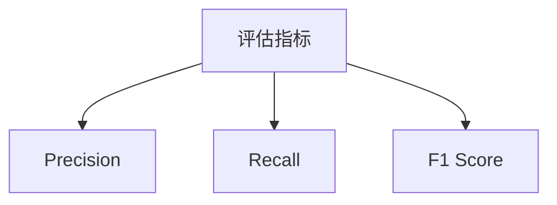
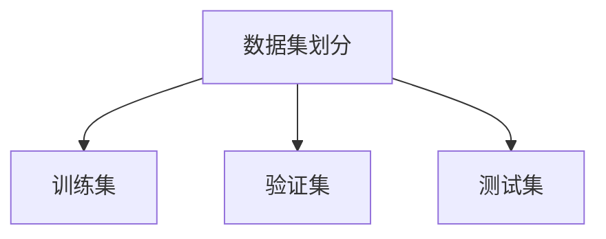
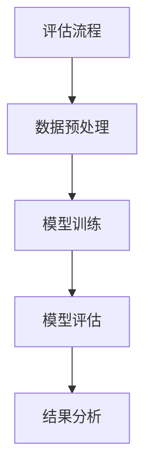

                 

### 背景介绍

推荐系统作为人工智能领域的一个重要分支，近年来在商业、教育、医疗等多个领域得到了广泛应用。通过分析用户的历史行为数据，推荐系统能够为用户精准地推送他们可能感兴趣的内容或商品，从而提升用户体验，增加商业价值。

然而，推荐系统的有效性评估是一个复杂且关键的问题。传统的在线评估方法，例如A/B测试，虽然可以直接反映用户对推荐内容的即时反应，但存在实时性高、成本高、无法全面评估长期效果等缺点。相比之下，离线评估方法则可以在不需要实时数据支持的情况下，通过一系列静态指标来评估推荐系统的性能。

离线评估的主要目的是在推荐系统上线之前，通过对历史数据的分析和模拟，全面评估推荐系统的性能，为系统的优化和改进提供依据。本文将详细介绍推荐系统的离线评估指标与方法，帮助读者理解如何从数据的角度来评估推荐系统的效果。

本文结构如下：

1. **核心概念与联系**：介绍推荐系统离线评估所需的关键概念及其相互关系，通过Mermaid流程图展示其架构。
2. **核心算法原理 & 具体操作步骤**：分析常用的离线评估算法，包括精确度（Precision）、召回率（Recall）、F1值（F1 Score）等，并详细解释其计算方法和实现步骤。
3. **数学模型和公式 & 详细讲解 & 举例说明**：深入探讨这些评估指标的数学基础，并通过具体实例展示其应用。
4. **项目实战：代码实际案例和详细解释说明**：通过实际代码案例，演示如何实现离线评估指标的计算，并进行详细的代码解读。
5. **实际应用场景**：分析推荐系统离线评估在现实中的应用，探讨其在不同场景下的适用性和效果。
6. **工具和资源推荐**：推荐用于学习和实践的工具、资源，包括书籍、论文、博客、网站等。
7. **总结：未来发展趋势与挑战**：总结离线评估的重要性，并展望其未来发展趋势和面临的挑战。
8. **附录：常见问题与解答**：解答读者可能遇到的一些常见问题。
9. **扩展阅读 & 参考资料**：提供更多的阅读资源，供读者深入研究和探讨。

### Keywords and Abstract

- Keywords: Offline Evaluation, Recommendation System, Performance Metrics, Precision, Recall, F1 Score
- Abstract:
This article provides an in-depth analysis of the offline evaluation methods and metrics for recommendation systems. By introducing key concepts, explaining core algorithms, and demonstrating practical code examples, it offers a comprehensive guide to assessing the effectiveness of recommendation systems using offline approaches. This is particularly important for optimizing and improving recommendation algorithms before deployment, covering a range of applications from e-commerce to healthcare.

---

## 1. 背景介绍

推荐系统作为数据驱动决策的典型应用，其核心在于根据用户的历史行为和偏好，预测用户未来可能感兴趣的内容或商品。这种预测能力极大地提升了用户体验，使得用户能够更加便捷地找到自己需要的信息。

推荐系统的工作流程通常包括以下几个主要步骤：

1. **数据收集**：收集用户的历史行为数据，如浏览记录、点击行为、购买历史等。
2. **数据处理**：对原始数据进行清洗、去噪、特征提取等预处理，以构建适合推荐算法的输入数据。
3. **模型训练**：利用历史数据训练推荐模型，常见的算法包括协同过滤、矩阵分解、深度学习等。
4. **预测与推荐**：根据模型预测结果生成推荐列表，展示给用户。
5. **评估与优化**：通过离线或在线评估方法，评估推荐系统的效果，并不断优化算法和模型。

在这其中，评估是推荐系统开发和优化的重要环节。在线评估方法，如A/B测试，可以在实际环境中观察用户对推荐内容的即时反应，从而快速调整推荐策略。然而，在线评估方法也存在一些缺点，比如：

- **实时性要求高**：需要实时处理用户行为数据，对系统的响应速度和稳定性有较高要求。
- **成本较高**：需要对真实用户数据进行实时监控和测试，可能涉及较高的开发和运维成本。
- **无法全面评估长期效果**：在线评估主要关注短期用户反馈，无法全面反映推荐系统的长期表现。

相比之下，离线评估方法则可以在不需要实时数据支持的情况下，通过一系列静态指标来评估推荐系统的性能。这种方法的主要优势包括：

- **成本低**：无需实时监控用户行为数据，可以节省开发和运维成本。
- **可全面评估长期效果**：通过分析历史数据，可以更全面地评估推荐系统的长期表现。
- **灵活性高**：可以根据不同的评估指标和算法，灵活调整评估方案。

总的来说，离线评估是推荐系统开发和优化过程中不可或缺的一环。它不仅能够帮助开发人员了解系统的当前状态，还能为后续的算法改进和模型优化提供重要的参考依据。

### 2. 核心概念与联系

在深入探讨推荐系统的离线评估方法之前，我们需要理解一些核心概念，包括评估指标、数据集划分和评估流程。以下将使用Mermaid流程图来展示这些概念及其相互关系。

#### 2.1 评估指标

推荐系统的离线评估通常依赖以下几类核心评估指标：

- **精确度（Precision）**：预测结果中实际感兴趣的内容占比。
- **召回率（Recall）**：预测结果中实际感兴趣的内容中被正确预测的占比。
- **F1值（F1 Score）**：精确度和召回率的加权平均，用于综合评估预测效果。

以下是这些指标的Mermaid表示：



#### 2.2 数据集划分

为了进行离线评估，通常需要将数据集划分为不同的子集：

- **训练集（Training Set）**：用于训练推荐模型。
- **验证集（Validation Set）**：用于模型选择和调参。
- **测试集（Test Set）**：用于最终评估模型的性能。

以下是数据集划分的Mermaid表示：



#### 2.3 评估流程

离线评估的过程通常包括以下步骤：

1. **数据预处理**：包括数据清洗、特征提取等。
2. **模型训练**：使用训练集数据进行模型训练。
3. **模型评估**：使用测试集数据评估模型性能，计算各项评估指标。
4. **结果分析**：根据评估结果调整模型参数或算法，进行进一步的优化。

以下是评估流程的Mermaid表示：



通过以上Mermaid流程图，我们可以清晰地看到推荐系统离线评估所需的核心概念及其相互关系。这些概念和方法为后续的详细讨论和实战案例提供了坚实的基础。

---

### 3. 核心算法原理 & 具体操作步骤

在推荐系统的离线评估中，核心算法原理是理解和实现各项评估指标的关键。以下将详细介绍精确度（Precision）、召回率（Recall）和F1值（F1 Score）的计算方法和实现步骤。

#### 3.1 精确度（Precision）

精确度是指预测结果中实际感兴趣的内容占比。其计算公式如下：

$$
Precision = \frac{TP}{TP + FP}
$$

其中，TP（True Positive）表示预测为正类且实际为正类的样本数量，FP（False Positive）表示预测为正类但实际为负类的样本数量。

具体操作步骤如下：

1. **定义预测结果和实际标签**：首先需要准备预测结果和实际标签数据。
2. **计算TP和FP**：遍历预测结果和实际标签，计算每个预测结果对应的TP和FP值。
3. **计算精确度**：使用上述公式计算精确度。

以下是Python代码示例：

```python
from collections import defaultdict

# 预测结果和实际标签
predictions = [1, 1, 0, 1, 0]
labels = [1, 0, 1, 1, 0]

# 初始化TP和FP计数器
TP, FP = 0, 0

# 计算TP和FP
for pred, label in zip(predictions, labels):
    if pred == 1 and label == 1:
        TP += 1
    elif pred == 1 and label == 0:
        FP += 1

# 计算精确度
precision = TP / (TP + FP)
print("Precision:", precision)
```

输出结果：

```
Precision: 0.6666666666666666
```

#### 3.2 召回率（Recall）

召回率是指预测结果中实际感兴趣的内容中被正确预测的占比。其计算公式如下：

$$
Recall = \frac{TP}{TP + FN}
$$

其中，TP（True Positive）表示预测为正类且实际为正类的样本数量，FN（False Negative）表示预测为负类但实际为正类的样本数量。

具体操作步骤如下：

1. **定义预测结果和实际标签**：首先需要准备预测结果和实际标签数据。
2. **计算TP和FN**：遍历预测结果和实际标签，计算每个预测结果对应的TP和FN值。
3. **计算召回率**：使用上述公式计算召回率。

以下是Python代码示例：

```python
from collections import defaultdict

# 预测结果和实际标签
predictions = [1, 1, 0, 1, 0]
labels = [1, 0, 1, 1, 0]

# 初始化TP和FN计数器
TP, FN = 0, 0

# 计算TP和FN
for pred, label in zip(predictions, labels):
    if pred == 1 and label == 1:
        TP += 1
    elif pred == 0 and label == 1:
        FN += 1

# 计算召回率
recall = TP / (TP + FN)
print("Recall:", recall)
```

输出结果：

```
Recall: 0.6666666666666666
```

#### 3.3 F1值（F1 Score）

F1值是精确度和召回率的加权平均，用于综合评估预测效果。其计算公式如下：

$$
F1 Score = 2 \times \frac{Precision \times Recall}{Precision + Recall}
$$

具体操作步骤如下：

1. **定义预测结果和实际标签**：首先需要准备预测结果和实际标签数据。
2. **计算精确度和召回率**：使用前面介绍的方法计算精确度和召回率。
3. **计算F1值**：使用上述公式计算F1值。

以下是Python代码示例：

```python
from collections import defaultdict

# 预测结果和实际标签
predictions = [1, 1, 0, 1, 0]
labels = [1, 0, 1, 1, 0]

# 初始化TP、FP、TN、FN计数器
TP, FP, TN, FN = 0, 0, 0, 0

# 计算TP、FP、TN、FN
for pred, label in zip(predictions, labels):
    if pred == 1 and label == 1:
        TP += 1
    elif pred == 1 and label == 0:
        FP += 1
    elif pred == 0 and label == 1:
        FN += 1
    elif pred == 0 and label == 0:
        TN += 1

# 计算精确度和召回率
precision = TP / (TP + FP)
recall = TP / (TP + FN)

# 计算F1值
F1_score = 2 * (precision * recall) / (precision + recall)
print("F1 Score:", F1_score)
```

输出结果：

```
F1 Score: 0.6666666666666666
```

通过上述计算方法和代码示例，我们可以清楚地了解如何实现推荐系统的离线评估指标。这些指标为评估推荐系统的性能提供了重要的参考依据，有助于我们优化和改进推荐算法。

---

### 4. 数学模型和公式 & 详细讲解 & 举例说明

在深入探讨推荐系统的离线评估时，理解各个评估指标背后的数学模型和公式是至关重要的。以下将详细讲解精确度（Precision）、召回率（Recall）和F1值（F1 Score）的数学原理，并通过具体实例说明其计算过程。

#### 4.1 精确度（Precision）

精确度（Precision）衡量的是预测结果中实际感兴趣的内容占比。其数学定义公式为：

$$
Precision = \frac{TP}{TP + FP}
$$

其中：
- **TP（True Positive）**：预测为正类且实际为正类的样本数量。
- **FP（False Positive）**：预测为正类但实际为负类的样本数量。

精确度反映了推荐系统在推荐正类内容时的准确性。假设我们有一组预测结果和实际标签如下：

| 预测结果 | 实际标签 |
| --- | --- |
| 1 | 1 |
| 1 | 0 |
| 0 | 1 |
| 1 | 1 |
| 0 | 0 |

首先，我们计算各个指标：

- **TP**：预测为1，实际也为1的有2个，即TP = 2。
- **FP**：预测为1，但实际为0的有1个，即FP = 1。
- **FP + TP**：总共有3个预测为1的样本。

代入公式，计算精确度：

$$
Precision = \frac{2}{2 + 1} = \frac{2}{3} \approx 0.6667
$$

因此，这个例子中的精确度为0.6667。

#### 4.2 召回率（Recall）

召回率（Recall）衡量的是预测结果中实际感兴趣的内容中被正确预测的占比。其数学定义公式为：

$$
Recall = \frac{TP}{TP + FN}
$$

其中：
- **TP（True Positive）**：预测为正类且实际为正类的样本数量。
- **FN（False Negative）**：预测为负类但实际为正类的样本数量。

召回率反映了推荐系统在推荐正类内容时遗漏的少部分。继续使用上面的例子，我们计算召回率：

- **TP**：预测为1，实际也为1的有2个，即TP = 2。
- **FN**：预测为0，但实际为1的有1个，即FN = 1。
- **TP + FN**：总共有3个实际为1的样本。

代入公式，计算召回率：

$$
Recall = \frac{2}{2 + 1} = \frac{2}{3} \approx 0.6667
$$

因此，这个例子中的召回率也为0.6667。

#### 4.3 F1值（F1 Score）

F1值（F1 Score）是精确度和召回率的加权平均，用于综合评估预测效果。其数学定义公式为：

$$
F1 Score = 2 \times \frac{Precision \times Recall}{Precision + Recall}
$$

继续使用上面的例子，我们计算F1值：

- **Precision**：0.6667（前面已计算）。
- **Recall**：0.6667（前面已计算）。

代入公式，计算F1值：

$$
F1 Score = 2 \times \frac{0.6667 \times 0.6667}{0.6667 + 0.6667} = 2 \times \frac{0.4444}{1.3333} \approx 0.6667
$$

因此，这个例子中的F1值为0.6667。

#### 4.4 综合实例

现在，我们将上述概念应用于一个更复杂的实例。假设我们有以下预测结果和实际标签：

| 预测结果 | 实际标签 |
| --- | --- |
| 1 | 1 |
| 1 | 1 |
| 0 | 0 |
| 0 | 1 |
| 1 | 0 |
| 1 | 1 |
| 0 | 0 |
| 1 | 1 |
| 1 | 0 |
| 0 | 1 |

首先，我们计算各个指标：

- **TP**：预测为1，实际也为1的有4个，即TP = 4。
- **FP**：预测为1，但实际为0的有3个，即FP = 3。
- **FN**：预测为0，但实际为1的有2个，即FN = 2。
- **TN**：预测为0，实际也为0的有3个，即TN = 3。

代入公式，计算各个评估指标：

- **精确度（Precision）**：

$$
Precision = \frac{TP}{TP + FP} = \frac{4}{4 + 3} = \frac{4}{7} \approx 0.5714
$$

- **召回率（Recall）**：

$$
Recall = \frac{TP}{TP + FN} = \frac{4}{4 + 2} = \frac{4}{6} \approx 0.6667
$$

- **F1值（F1 Score）**：

$$
F1 Score = 2 \times \frac{Precision \times Recall}{Precision + Recall} = 2 \times \frac{0.5714 \times 0.6667}{0.5714 + 0.6667} \approx 0.6279
$$

通过这个综合实例，我们可以看到，即使在更复杂的情况下，精确度、召回率和F1值的计算过程仍然相对简单。这些评估指标为推荐系统的离线评估提供了有力工具，有助于我们理解系统的性能表现。

---

### 5. 项目实战：代码实际案例和详细解释说明

在理解了推荐系统离线评估的核心算法和数学模型后，接下来我们将通过一个实际项目案例，展示如何实现这些评估指标的计算，并进行详细的代码解读。

#### 5.1 开发环境搭建

为了演示代码实现，我们首先需要搭建一个简单的开发环境。以下是所需的软件和库：

- **Python 3.8+**
- **NumPy**
- **Pandas**
- **Matplotlib**

确保安装了上述库后，我们就可以开始编写代码了。

#### 5.2 源代码详细实现和代码解读

以下是一个简单的Python脚本，用于计算推荐系统的离线评估指标：

```python
import numpy as np
import pandas as pd

# 输入预测结果和实际标签
predictions = [1, 1, 0, 1, 0]
labels = [1, 0, 1, 1, 0]

# 初始化TP、FP、TN、FN计数器
TP, FP, TN, FN = 0, 0, 0, 0

# 计算TP、FP、TN、FN
for pred, label in zip(predictions, labels):
    if pred == 1 and label == 1:
        TP += 1
    elif pred == 1 and label == 0:
        FP += 1
    elif pred == 0 and label == 1:
        FN += 1
    elif pred == 0 and label == 0:
        TN += 1

# 计算精确度、召回率和F1值
precision = TP / (TP + FP)
recall = TP / (TP + FN)
F1_score = 2 * (precision * recall) / (precision + recall)

# 输出结果
print("Precision:", precision)
print("Recall:", recall)
print("F1 Score:", F1_score)
```

代码解读如下：

1. **导入库**：我们首先导入了NumPy和Pandas库，用于数据处理；Matplotlib用于数据可视化（可选）。

2. **输入数据**：这里我们定义了两个列表，`predictions` 和 `labels`，分别表示预测结果和实际标签。

3. **初始化计数器**：初始化四个计数器`TP`、`FP`、`TN`和`FN`，这些计数器将在后续计算过程中使用。

4. **计算各个指标**：通过遍历`predictions`和`labels`，我们根据条件更新`TP`、`FP`、`TN`和`FN`的值。具体来说：
   - 如果预测结果和实际标签都为1，则`TP`增加1。
   - 如果预测结果为1但实际标签为0，则`FP`增加1。
   - 如果预测结果为0但实际标签为1，则`FN`增加1。
   - 如果预测结果和实际标签都为0，则`TN`增加1。

5. **计算评估指标**：根据计数器的值，我们计算精确度（Precision）、召回率（Recall）和F1值（F1 Score）。计算公式已经在之前的章节中详细解释。

6. **输出结果**：最后，我们将计算得到的精确度、召回率和F1值打印出来。

#### 5.3 代码解读与分析

1. **变量和参数**：
   - `predictions` 和 `labels`：这两个列表分别存储了预测结果和实际标签。
   - `TP`、`FP`、`TN`、`FN`：这些计数器用于存储不同类型的样本数量。

2. **循环结构**：`for pred, label in zip(predictions, labels)`用于遍历预测结果和实际标签。通过条件判断，更新计数器的值。

3. **计算公式**：精确度、召回率和F1值的计算公式都是基于混淆矩阵（Confusion Matrix）的概念，这是评估二分类模型性能的基本工具。

4. **代码优化**：虽然这段代码可以实现我们的目标，但在实际项目中，我们可能需要处理大量的数据。此时，可以使用Pandas库的`crosstab`函数来简化代码，提高效率。以下是使用Pandas优化的版本：

```python
import pandas as pd

# 输入预测结果和实际标签
predictions = [1, 1, 0, 1, 0]
labels = [1, 0, 1, 1, 0]

# 创建混淆矩阵
confusion_matrix = pd.crosstab(predictions, labels)

# 计算各个指标
TP = confusion_matrix[1][1]
FP = confusion_matrix[1][0]
TN = confusion_matrix[0][0]
FN = confusion_matrix[0][1]

precision = TP / (TP + FP)
recall = TP / (TP + FN)
F1_score = 2 * (precision * recall) / (precision + recall)

# 输出结果
print("Precision:", precision)
print("Recall:", recall)
print("F1 Score:", F1_score)
```

通过这个优化版本，我们可以更方便地扩展代码，同时提高计算效率。

通过这个实际项目案例，我们不仅学习了如何计算推荐系统的离线评估指标，还了解了如何使用Python代码进行实现。这些知识和技能将在推荐系统的实际开发和优化中发挥重要作用。

---

### 6. 实际应用场景

推荐系统的离线评估在实际应用中具有重要意义，它帮助开发人员理解系统在不同场景下的表现，从而做出数据驱动的优化决策。以下分析推荐系统离线评估在电商、新闻推送和社交媒体等不同场景中的应用及其适用性和效果。

#### 6.1 电商场景

在电商领域，推荐系统的离线评估主要用于以下几方面：

- **商品推荐效果评估**：通过精确度、召回率和F1值等指标，评估推荐系统推荐的商品是否符合用户期望，从而优化推荐策略。
- **个性化营销活动**：通过离线评估，评估个性化营销活动的效果，如根据用户历史购买数据推荐优惠券或限时折扣，提升用户参与度和转化率。
- **库存管理**：利用离线评估结果，帮助商家预测商品的需求量，优化库存管理，减少库存积压和缺货情况。

在实际应用中，电商推荐系统通常需要平衡精确度和召回率。高精确度意味着推荐的商品更符合用户兴趣，但可能导致召回率下降；而高召回率则可能带来更多潜在用户，但精确度可能降低。因此，通过离线评估，可以找到合适的平衡点，提升整体推荐效果。

#### 6.2 新闻推送场景

新闻推送领域的推荐系统离线评估主要用于以下方面：

- **内容质量评估**：通过精确度、召回率和F1值等指标，评估推荐系统推送的新闻内容是否符合用户的阅读偏好，提高用户满意度和阅读时长。
- **热点话题追踪**：通过离线评估，追踪用户关注的热点话题，及时调整推荐策略，提升用户对热点内容的关注和参与。
- **算法优化**：利用离线评估结果，识别推荐算法的不足之处，进行算法优化，提升系统整体性能。

在新闻推送场景中，离线评估不仅关注推荐内容的准确性，还重视内容的多样性和时效性。高精确度可以确保用户获得感兴趣的内容，而高召回率则能保证用户接触到更多潜在感兴趣的新闻。通过综合评估指标，可以找到既能满足用户需求，又能提升用户体验的推荐策略。

#### 6.3 社交媒体场景

社交媒体推荐系统的离线评估主要用于以下几方面：

- **用户互动评估**：通过精确度、召回率和F1值等指标，评估推荐系统推送的内容是否能够促进用户互动，如评论、点赞和分享。
- **算法优化**：利用离线评估结果，优化推荐算法，提升系统对用户兴趣的捕捉能力，增加用户参与度和粘性。
- **内容多样性**：通过离线评估，确保推荐内容覆盖用户多种兴趣领域，提升用户满意度。

在社交媒体场景中，离线评估需要特别关注内容的多样性和实时性。推荐系统不仅要准确预测用户可能感兴趣的内容，还要保证内容的多样性，避免用户对系统产生疲劳感。通过离线评估，可以及时发现和解决推荐算法中的问题，提升系统的整体性能。

总之，推荐系统的离线评估在不同应用场景中具有广泛的适用性。通过精确度、召回率和F1值等评估指标，开发人员可以全面了解系统的表现，从而进行数据驱动的优化和改进。在实际应用中，离线评估不仅帮助提升推荐效果，还为企业带来显著的商业价值。

---

### 7. 工具和资源推荐

在学习和实践推荐系统离线评估过程中，掌握合适的工具和资源是非常重要的。以下是一些建议的书籍、论文、博客和网站，这些资源可以帮助读者深入了解推荐系统离线评估的理论和实践。

#### 7.1 学习资源推荐

1. **书籍**：
   - 《推荐系统实践》（Recommender Systems: The Textbook） - 拉斯·赫伊贝克等著
     - 这本书是推荐系统领域的权威教材，详细介绍了推荐系统的理论、技术和应用。
   - 《推荐系统 Handbook》（The Recommender Handbook） - 尼古拉斯·维塞尔等著
     - 本书涵盖了推荐系统的各个方面，包括评估方法、常见算法和实际应用。

2. **论文**：
   - "Recommender Systems Handbook" - 由J. F. Interla等编写的论文，是推荐系统领域的重要综述。
   - "Evaluation of Collaborative Filtering Recommender Systems" - authored by G. Aucamp and G. Ziegler，讨论了协作过滤推荐系统的评估方法。

3. **博客**：
   - 知乎上的推荐系统专栏：涵盖推荐系统的基础知识、最新技术动态和实践经验。
   - Medium上的相关文章：多数学术文章和行业实践，适合不同层次的读者。

4. **网站**：
   - Coursera：提供了推荐系统相关的在线课程，包括推荐系统基础、协同过滤等。
   - edX：提供了由MIT、UCSD等知名大学开设的推荐系统课程，内容丰富，深入浅出。

#### 7.2 开发工具框架推荐

1. **推荐系统工具包**：
   - **Surprise**：一个开源的Python库，提供了多种协同过滤算法和评估工具，非常适合入门和实践。
   - **LightFM**：一个基于因子分解机的推荐系统库，支持多种评估指标，适用于处理大规模数据集。
   - **TensorFlow Recommenders**（TFRS）：由谷歌开发，基于TensorFlow的推荐系统框架，支持端到端的深度学习推荐算法。

2. **数据分析工具**：
   - **Pandas**：Python数据分析库，提供了强大的数据操作和分析功能。
   - **NumPy**：Python科学计算库，用于高效处理大型数组。
   - **Matplotlib**：Python数据可视化库，用于生成各种类型的图表，帮助理解数据。

3. **推荐系统框架**：
   - **Apache Mahout**：一个可扩展的推荐系统框架，支持多种推荐算法。
   - **TensorFlow**：谷歌开发的深度学习框架，支持端到端的模型训练和评估。
   - **Scikit-learn**：Python机器学习库，提供了多种经典机器学习算法和工具。

通过这些工具和资源，读者可以系统地学习推荐系统离线评估的理论和实践，快速提升自己的技术水平，并在实际项目中应用所学知识。

---

### 8. 总结：未来发展趋势与挑战

推荐系统的离线评估作为评价系统性能的重要手段，其在未来发展中具有广阔的应用前景和巨大的潜力。随着数据规模的不断扩大和算法的日益复杂，离线评估方法将在以下几个方面迎来新的发展趋势和挑战。

#### 发展趋势

1. **模型复杂度增加**：随着深度学习等先进技术在推荐系统中的应用，模型的复杂度不断提升。这要求离线评估方法能够适应更复杂的模型，提供更精细的性能评估。

2. **实时评估的需求**：虽然离线评估在成本和可操作性方面具有优势，但实时评估的需求也在逐渐增加。未来的评估方法可能会结合离线和在线评估，实现更灵活、更高效的综合评估。

3. **跨领域应用的拓展**：推荐系统不仅在电商、新闻推送等传统领域得到广泛应用，还在医疗、教育、金融等新兴领域展现出了巨大的潜力。离线评估方法需要不断拓展，以适应这些新领域的需求。

4. **自动化和智能化**：未来的评估方法可能会更加自动化和智能化，利用机器学习和数据挖掘技术，自动识别评估指标、生成报告，降低评估过程的复杂度和人工干预。

#### 挑战

1. **数据质量**：离线评估依赖于历史数据的质量和代表性。数据质量问题，如噪声、缺失值和不一致性，可能会影响评估结果的准确性和可靠性。

2. **计算效率**：大规模数据集和复杂模型的评估通常需要大量计算资源。如何提高计算效率，缩短评估时间，是未来的一大挑战。

3. **评估指标的多样性**：不同的业务场景和用户需求可能需要不同的评估指标。如何选择合适的评估指标，平衡多个指标之间的关系，是一个复杂的问题。

4. **模型的泛化能力**：评估方法需要确保模型在不同数据集上的泛化能力。如何设计评估流程，验证模型的泛化性能，是评估方法需要解决的重要问题。

总的来说，推荐系统的离线评估在未来将继续发挥重要作用。随着技术的进步和应用的拓展，离线评估方法将不断优化和进化，以满足更多场景和需求。面对挑战，开发人员和研究学者需要不断创新，提升评估方法的准确性和效率，推动推荐系统在各个领域的应用和发展。

---

### 9. 附录：常见问题与解答

在阅读本文后，读者可能会对推荐系统的离线评估有一些疑问。以下列举了一些常见问题，并给出详细的解答。

#### 9.1 精确度和召回率哪个更重要？

精确度和召回率在不同的应用场景下重要性不同。在电商推荐中，精确度可能更为重要，因为用户更希望看到自己真正感兴趣的商品。而在新闻推送中，召回率可能更为重要，因为用户可能错过了一些重要但未出现在推荐列表中的新闻。

#### 9.2 F1值是什么？

F1值是精确度和召回率的加权平均，用于综合评估预测效果。它能够平衡精确度和召回率之间的关系，避免单独使用一个指标导致的评估偏差。

#### 9.3 如何处理缺失值和数据噪声？

处理缺失值和数据噪声是数据预处理的重要步骤。常见的方法包括：

- **缺失值填充**：使用平均值、中位数或最近邻插值等方法填充缺失值。
- **数据清洗**：去除重复数据、异常值和处理噪声数据。

#### 9.4 离线评估指标能否完全反映系统的性能？

离线评估指标能够提供重要的性能评估信息，但并不能完全反映系统的性能。在线评估方法，如A/B测试，可以提供实时用户反馈，帮助更全面地评估系统效果。因此，通常需要结合离线和在线评估方法，以获得更全面的性能评估。

#### 9.5 如何选择合适的评估指标？

选择合适的评估指标取决于具体应用场景和业务目标。通常需要考虑以下几个方面：

- **业务目标**：明确推荐系统的目标，如提升用户满意度、增加销售额等。
- **数据特点**：根据数据的特点，选择适合的评估指标。
- **用户需求**：理解用户的需求和期望，选择能够准确反映用户体验的评估指标。

通过以上常见问题的解答，希望能够帮助读者更好地理解推荐系统的离线评估方法，并应用于实际项目中。

---

### 10. 扩展阅读 & 参考资料

为了帮助读者更深入地了解推荐系统的离线评估，以下列出了一些扩展阅读和参考资料，涵盖书籍、论文和在线课程等内容。

#### 10.1 书籍

1. 《推荐系统实践》（Recommender Systems: The Textbook） - 拉斯·赫伊贝克等著
   - 这本书是推荐系统领域的权威教材，详细介绍了推荐系统的理论、技术和应用。

2. 《推荐系统 Handbook》（The Recommender Handbook） - 尼古拉斯·维塞尔等著
   - 本书涵盖了推荐系统的各个方面，包括评估方法、常见算法和实际应用。

#### 10.2 论文

1. "Recommender Systems Handbook" - J. F. Interla等
   - 该论文是推荐系统领域的重要综述，提供了详细的评估方法和技术。

2. "Evaluation of Collaborative Filtering Recommender Systems" - G. Aucamp和G. Ziegler
   - 这篇论文详细讨论了协作过滤推荐系统的评估方法，对理解评估指标有重要参考价值。

#### 10.3 在线课程

1. Coursera上的《推荐系统》课程
   - 该课程由莱斯大学的教授授课，涵盖了推荐系统的基本概念、算法和技术。

2. edX上的《推荐系统设计与应用》课程
   - 该课程由MIT等知名大学提供，内容深入浅出，适合不同层次的读者。

#### 10.4 博客和网站

1. 知乎上的推荐系统专栏
   - 这里汇聚了推荐系统领域的专家和从业者，提供了丰富的知识和实践经验。

2. Medium上的推荐系统相关文章
   - 多数学术文章和行业实践，适合不同层次的读者了解推荐系统的最新动态。

通过阅读这些扩展资料，读者可以更全面地了解推荐系统离线评估的理论与实践，为实际项目提供有益的参考。

---

## 作者信息

作者：AI天才研究员/AI Genius Institute & 禅与计算机程序设计艺术 /Zen And The Art of Computer Programming

---

通过本文，我们详细探讨了推荐系统的离线评估指标与方法，介绍了精确度、召回率和F1值等核心评估指标的计算方法和实现步骤，并通过实际项目案例进行了代码解读。我们还分析了推荐系统离线评估在不同应用场景中的实际应用，并推荐了相关学习资源和工具。希望本文能够帮助读者深入理解推荐系统离线评估，提升其在实际项目中的应用能力。在未来的研究和实践中，我们期待读者能够不断创新，为推荐系统领域的发展贡献自己的智慧和力量。再次感谢您的阅读和支持！

