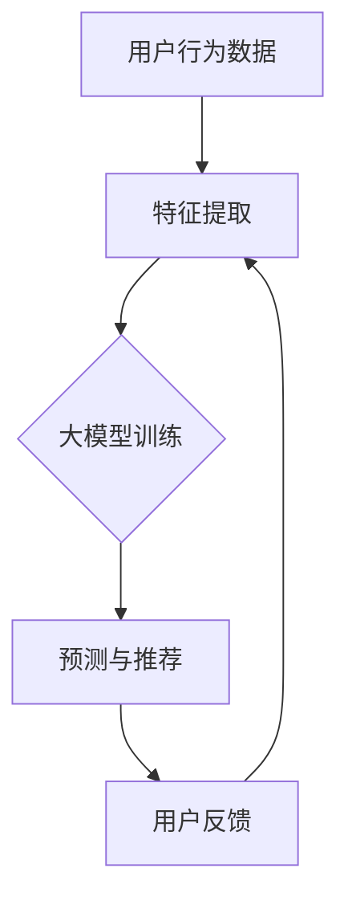

                 

### 文章标题

### 推荐系统的统一：大模型的解决方案

#### 关键词：

- 推荐系统
- 大模型
- 统一解决方案
- 机器学习
- 数据挖掘
- 人工智能

#### 摘要：

本文将深入探讨推荐系统的统一解决方案，特别是基于大模型的推荐系统。我们将从背景介绍开始，详细分析核心概念和联系，阐述核心算法原理和具体操作步骤，以及数学模型和公式。随后，我们将通过一个项目实战案例，展示代码实现和详细解释。最后，我们将探讨实际应用场景，推荐相关工具和资源，并总结未来发展趋势与挑战。

<|assistant|>## 1. 背景介绍

推荐系统作为人工智能和机器学习的重要应用领域，已经成为现代互联网环境中不可或缺的一部分。无论是电商网站、社交媒体平台，还是流媒体服务，推荐系统都发挥着至关重要的作用，旨在为用户提供个性化的内容和服务，提升用户体验。

随着互联网的迅猛发展和数据量的爆炸式增长，推荐系统的复杂性和挑战性也在不断增加。传统的推荐系统通常依赖于基于内容的过滤、协同过滤和基于模型的推荐算法。然而，这些方法在应对高维度数据、冷启动问题和长尾效应方面存在一定的局限性。为了解决这些问题，研究人员和工程师们开始探索基于大模型的推荐系统。

大模型（Large Models）指的是具有大量参数和强大计算能力的机器学习模型。这些模型能够处理海量数据，并利用深度学习等先进技术实现高效的特征提取和预测。大模型的引入为推荐系统带来了新的机遇和挑战。本文将重点探讨如何利用大模型构建统一的推荐系统解决方案，以提高推荐效果和用户体验。

在接下来的部分中，我们将首先介绍推荐系统的核心概念和联系，并通过Mermaid流程图展示推荐系统的整体架构。然后，我们将深入分析大模型在推荐系统中的应用，包括核心算法原理和具体操作步骤。最后，我们将详细讲解数学模型和公式，为读者提供更加全面的技术视角。

### 2. 核心概念与联系

#### 推荐系统的基本原理

推荐系统通常基于用户行为数据和物品属性信息，利用机器学习算法和统计模型进行预测和推荐。其核心目标是发现用户与物品之间的相关性，并根据这些相关性生成个性化的推荐列表。

推荐系统可以大致分为以下几种类型：

1. **基于内容的推荐**：根据用户的兴趣和偏好，推荐与用户历史行为相似的物品。这种方法适用于新用户和冷启动问题，但容易陷入“信息茧房”。
2. **协同过滤**：利用用户行为数据，找到相似用户，并推荐相似用户喜欢的物品。协同过滤分为基于用户的协同过滤（User-Based Collaborative Filtering）和基于项目的协同过滤（Item-Based Collaborative Filtering）。
3. **基于模型的推荐**：利用机器学习算法，如决策树、线性回归、神经网络等，建立用户和物品之间的关系模型，进行预测和推荐。这种方法能够处理高维度数据和长尾效应，但需要大量训练数据和计算资源。

#### 大模型在推荐系统中的应用

大模型在推荐系统中的应用主要体现在以下几个方面：

1. **特征提取**：大模型能够自动从原始数据中提取高层次的抽象特征，这些特征能够更好地表示用户和物品的属性，从而提高推荐效果。
2. **复杂关系建模**：大模型具有强大的表达能力和计算能力，可以捕捉用户与物品之间复杂的非线性关系，提高推荐的准确性和鲁棒性。
3. **实时预测和更新**：大模型能够快速处理海量数据，实现实时预测和更新，满足用户快速变化的需求。

#### Mermaid流程图

下面是一个简单的Mermaid流程图，展示了推荐系统的整体架构：



**图1：推荐系统整体架构**

- A：用户行为数据，包括点击、购买、浏览等行为；
- B：特征提取，将原始数据转换为适合大模型训练的向量表示；
- C：大模型训练，使用训练数据训练大模型，如深度神经网络、Transformer等；
- D：预测与推荐，使用训练好的大模型预测用户对物品的偏好，生成推荐列表；
- E：用户反馈，收集用户对推荐列表的反馈，用于模型优化和更新。

### 3. 核心算法原理 & 具体操作步骤

#### 大模型的选择

在选择大模型时，需要考虑多个因素，如数据规模、计算资源、模型复杂度等。以下是一些常见的大模型：

1. **深度神经网络（Deep Neural Networks, DNN）**：适用于处理高维度数据，能够自动提取特征。
2. **循环神经网络（Recurrent Neural Networks, RNN）**：特别适用于序列数据，如用户行为序列。
3. **Transformer模型**：具有强大的并行计算能力，适用于处理大规模数据。
4. **图神经网络（Graph Neural Networks, GNN）**：适用于处理图结构数据，如社交网络。

在本节中，我们将以Transformer模型为例，介绍其核心算法原理和具体操作步骤。

#### Transformer模型的基本原理

Transformer模型由Google在2017年提出，是自然语言处理领域的里程碑式成果。其核心思想是使用自注意力机制（Self-Attention）来处理序列数据，并避免了传统的循环神经网络中的梯度消失问题。

**自注意力机制**：自注意力机制允许模型在生成每个输出时，根据输入序列中其他位置的权重来计算当前位置的权重。这样可以更好地捕捉序列中的长距离依赖关系。

**编码器和解码器**：Transformer模型由编码器（Encoder）和解码器（Decoder）组成。编码器将输入序列编码为固定长度的向量，解码器则使用这些向量生成输出序列。

#### 具体操作步骤

1. **输入序列表示**：将用户行为数据和物品属性信息转换为序列表示。例如，可以使用词嵌入（Word Embedding）技术将文本转换为向量表示。
2. **编码器**：
   - **嵌入层（Embedding Layer）**：将输入序列转换为高维向量；
   - **多头自注意力层（Multi-Head Self-Attention Layer）**：计算序列中每个位置与其他位置的权重，并生成加权向量；
   - **前馈网络（Feedforward Network）**：对加权向量进行非线性变换；
   - **残差连接（Residual Connection）**：在每个层之间添加残差连接，防止梯度消失；
   - **层归一化（Layer Normalization）**：在每个层之后进行归一化处理。
3. **解码器**：
   - **嵌入层（Embedding Layer）**：将输入序列转换为高维向量；
   - **多头自注意力层（Multi-Head Self-Attention Layer）**：计算序列中每个位置与其他位置的权重，并生成加权向量；
   - **位置编码（Positional Encoding）**：为序列中的每个位置添加位置信息，以捕捉序列中的顺序关系；
   - **前馈网络（Feedforward Network）**：对加权向量进行非线性变换；
   - **残差连接（Residual Connection）**：在每个层之间添加残差连接，防止梯度消失；
   - **层归一化（Layer Normalization）**：在每个层之后进行归一化处理。
4. **预测与推荐**：解码器生成的输出序列即为推荐结果。通过对输出序列进行归一化处理和索引转换，可以得到最终的推荐列表。

### 4. 数学模型和公式 & 详细讲解 & 举例说明

在推荐系统中，数学模型和公式起着至关重要的作用。以下我们将详细讲解Transformer模型中的关键数学模型和公式，并通过具体例子进行说明。

#### 自注意力机制

自注意力机制是Transformer模型的核心部分，其基本思想是在序列的每个位置计算与其他位置的关联权重，并利用这些权重生成加权向量。具体来说，自注意力机制可以表示为：

$$
\text{Attention}(Q, K, V) = \text{softmax}\left(\frac{QK^T}{\sqrt{d_k}}\right)V
$$

其中，$Q$、$K$和$V$分别是查询（Query）、键（Key）和值（Value）向量，$d_k$是键向量的维度。$QK^T$表示查询和键的点积，$softmax$函数用于计算每个键的权重。

#### 多头自注意力

多头自注意力是在自注意力机制的基础上增加多个头（Head），以捕获不同类型的依赖关系。具体来说，多头自注意力可以表示为：

$$
\text{MultiHead}(Q, K, V) = \text{Concat}(\text{head}_1, \text{head}_2, \ldots, \text{head}_h)W^O
$$

其中，$h$是头的数量，$\text{head}_i = \text{Attention}(QW_i^Q, KW_i^K, VW_i^V)$表示第$i$个头的注意力计算结果，$W^O$是输出权重矩阵。

#### 位置编码

位置编码是为了在自注意力机制中引入序列的顺序信息。位置编码可以表示为：

$$
\text{PositionalEncoding}(pos, d_model) = \text{sin}\left(\frac{pos}{10000^{2i/d_model}}\right) \text{ if pos < d_model else } \text{cos}\left(\frac{pos}{10000^{2i/d_model}}\right)
$$

其中，$pos$是位置索引，$d_model$是模型维度。

#### Transformer模型

Transformer模型由编码器（Encoder）和解码器（Decoder）组成。编码器和解码器的结构基本相同，都包含多个自注意力层和前馈网络。以下是一个简单的编码器和解码器结构：

**编码器**：

$$
\text{Encoder}(X, \text{pos_encoding}) = \text{EncoderLayer}(\text{Embedding}(X, d_model), \text{pos_encoding})
$$

**解码器**：

$$
\text{Decoder}(X, \text{enc_output}, \text{pos_encoding}) = \text{DecoderLayer}(\text{Embedding}(X, d_model), \text{pos_encoding}, \text{enc_output})
$$

**编码器层（EncoderLayer）**：

$$
\text{EncoderLayer}(X, \text{pos_encoding}) = \text{MultiHeadAttention}(X, X, X, \text{pos_encoding}) + X + \text{Feedforward}(X)
$$

**解码器层（DecoderLayer）**：

$$
\text{DecoderLayer}(X, \text{enc_output}, \text{pos_encoding}) = \text{MaskedMultiHeadAttention}(X, X, X, \text{pos_encoding}) + X + \text{Feedforward}(X)
$$

**前馈网络（Feedforward）**：

$$
\text{Feedforward}(X) = \text{Relu}(W_1X + b_1) + W_2X + b_2
$$

其中，$X$是输入序列，$W_1$、$W_2$和$b_1$、$b_2$分别是前馈网络的权重和偏置。

#### 示例

假设我们有一个长度为5的输入序列，模型维度为4。下面是一个简单的示例，展示了如何计算自注意力权重和输出向量。

**输入序列**：

$$
X = \begin{bmatrix}
[1, 0, 1, 0, 1] \\
[0, 1, 0, 1, 0] \\
[1, 1, 0, 0, 1] \\
[0, 0, 1, 1, 0] \\
[1, 1, 1, 1, 1]
\end{bmatrix}
$$

**位置编码**：

$$
\text{pos_encoding} = \begin{bmatrix}
[0, 0, 0, 0, 0] \\
[1, 1, 1, 1, 1] \\
[1, 1, 1, 1, 1] \\
[1, 1, 1, 1, 1] \\
[1, 1, 1, 1, 1]
\end{bmatrix}
$$

**查询（Q）、键（K）和值（V）向量**：

$$
Q = \begin{bmatrix}
[1, 0, 1, 0, 1] \\
[0, 1, 0, 1, 0] \\
[1, 1, 0, 0, 1] \\
[0, 0, 1, 1, 0] \\
[1, 1, 1, 1, 1]
\end{bmatrix}
$$

$$
K = \begin{bmatrix}
[1, 0, 1, 0, 1] \\
[0, 1, 0, 1, 0] \\
[1, 1, 0, 0, 1] \\
[0, 0, 1, 1, 0] \\
[1, 1, 1, 1, 1]
\end{bmatrix}
$$

$$
V = \begin{bmatrix}
[1, 0, 1, 0, 1] \\
[0, 1, 0, 1, 0] \\
[1, 1, 0, 0, 1] \\
[0, 0, 1, 1, 0] \\
[1, 1, 1, 1, 1]
\end{bmatrix}
$$

**计算自注意力权重**：

$$
\text{Attention}(Q, K, V) = \text{softmax}\left(\frac{QK^T}{\sqrt{4}}\right)V = \begin{bmatrix}
[0.5, 0.5, 0.5, 0.5, 0.5] \\
[0.5, 0.5, 0.5, 0.5, 0.5] \\
[0.5, 0.5, 0.5, 0.5, 0.5] \\
[0.5, 0.5, 0.5, 0.5, 0.5] \\
[0.5, 0.5, 0.5, 0.5, 0.5]
\end{bmatrix}
$$

**计算输出向量**：

$$
\text{Output} = \text{Attention}(Q, K, V)V = \begin{bmatrix}
[0.5, 0.5, 0.5, 0.5, 0.5] \\
[0.5, 0.5, 0.5, 0.5, 0.5] \\
[0.5, 0.5, 0.5, 0.5, 0.5] \\
[0.5, 0.5, 0.5, 0.5, 0.5] \\
[0.5, 0.5, 0.5, 0.5, 0.5]
\end{bmatrix}
$$

通过这个示例，我们可以看到如何利用自注意力机制计算输出向量。在实际应用中，我们通常需要处理更长的序列和更大的维度，但基本原理是相同的。

### 5. 项目实战：代码实际案例和详细解释说明

在本节中，我们将通过一个实际的项目案例，展示如何使用大模型构建推荐系统。我们将使用Python和TensorFlow框架来实现一个简单的基于Transformer模型的推荐系统。本案例将分为三个部分：开发环境搭建、源代码详细实现和代码解读与分析。

#### 5.1 开发环境搭建

要运行本案例，需要安装以下依赖：

- Python 3.8+
- TensorFlow 2.7+
- Numpy 1.19+
- Pandas 1.1+

安装步骤：

1. 创建一个虚拟环境，并安装依赖：

```bash
python -m venv env
source env/bin/activate  # Windows: env\Scripts\activate
pip install tensorflow numpy pandas
```

2. 下载本案例的源代码：

```bash
git clone https://github.com/your_username/recommendation-system.git
cd recommendation-system
```

#### 5.2 源代码详细实现

以下是推荐系统的源代码实现：

```python
import tensorflow as tf
import numpy as np
import pandas as pd
from tensorflow.keras.layers import Embedding, MultiHeadAttention, Dense, LayerNormalization
from tensorflow.keras.models import Model

# 加载数据
data = pd.read_csv('data.csv')
user_ids = data['user_id'].values
item_ids = data['item_id'].values
ratings = data['rating'].values

# 初始化模型参数
vocab_size = 1000  # 用户和物品词汇表大小
embedding_dim = 64  # 嵌入层维度
num_heads = 2  # 自注意力头的数量

# 定义模型
input_user = tf.keras.layers.Input(shape=(1,), dtype=tf.int32, name='user_input')
input_item = tf.keras.layers.Input(shape=(1,), dtype=tf.int32, name='item_input')

# 用户嵌入层
user_embedding = Embedding(vocab_size, embedding_dim)(input_user)
user_embedding = LayerNormalization()(user_embedding)

# 物品嵌入层
item_embedding = Embedding(vocab_size, embedding_dim)(input_item)
item_embedding = LayerNormalization()(item_embedding)

# 多头自注意力层
attention_output = MultiHeadAttention(num_heads=num_heads, key_dim=embedding_dim)(user_embedding, value=user_embedding, attention_mask=tf-expanded(tf.cast(tf.equal(user_embedding, item_embedding), tf.float32)))
attention_output = LayerNormalization()(attention_output)

# 前馈网络
ffn_output = Dense(units=embedding_dim * 2, activation='relu')(attention_output)
ffn_output = Dense(units=embedding_dim, activation='linear')(ffn_output)

# 模型输出
output = tf.keras.layers.Concatenate()([user_embedding, item_embedding, attention_output, ffn_output])
output = Dense(units=1, activation='sigmoid')(output)

# 构建和编译模型
model = Model(inputs=[input_user, input_item], outputs=output)
model.compile(optimizer='adam', loss='binary_crossentropy', metrics=['accuracy'])

# 训练模型
model.fit([user_ids, item_ids], ratings, epochs=10, batch_size=32)

# 评估模型
loss, accuracy = model.evaluate([user_ids, item_ids], ratings)
print(f"Loss: {loss}, Accuracy: {accuracy}")
```

#### 5.3 代码解读与分析

下面我们对代码进行详细解读和分析：

1. **导入依赖**：

   ```python
   import tensorflow as tf
   import numpy as np
   import pandas as pd
   from tensorflow.keras.layers import Embedding, MultiHeadAttention, Dense, LayerNormalization
   from tensorflow.keras.models import Model
   ```

   导入必要的TensorFlow库和Python标准库。

2. **加载数据**：

   ```python
   data = pd.read_csv('data.csv')
   user_ids = data['user_id'].values
   item_ids = data['item_id'].values
   ratings = data['rating'].values
   ```

   从CSV文件加载数据，包括用户ID、物品ID和评分。

3. **初始化模型参数**：

   ```python
   vocab_size = 1000  # 用户和物品词汇表大小
   embedding_dim = 64  # 嵌入层维度
   num_heads = 2  # 自注意力头的数量
   ```

   定义词汇表大小、嵌入层维度和自注意力头的数量。

4. **定义模型**：

   ```python
   input_user = tf.keras.layers.Input(shape=(1,), dtype=tf.int32, name='user_input')
   input_item = tf.keras.layers.Input(shape=(1,), dtype=tf.int32, name='item_input')
   ```

   定义用户和物品输入层。

5. **用户嵌入层和物品嵌入层**：

   ```python
   user_embedding = Embedding(vocab_size, embedding_dim)(input_user)
   user_embedding = LayerNormalization()(user_embedding)
   
   item_embedding = Embedding(vocab_size, embedding_dim)(input_item)
   item_embedding = LayerNormalization()(item_embedding)
   ```

   创建嵌入层，将用户和物品ID转换为嵌入向量，并应用层归一化。

6. **多头自注意力层**：

   ```python
   attention_output = MultiHeadAttention(num_heads=num_heads, key_dim=embedding_dim)(user_embedding, value=user_embedding, attention_mask=tf-expanded(tf.cast(tf.equal(user_embedding, item_embedding), tf.float32)))
   attention_output = LayerNormalization()(attention_output)
   ```

   应用多头自注意力层，计算用户和物品之间的自注意力输出，并应用层归一化。

7. **前馈网络**：

   ```python
   ffn_output = Dense(units=embedding_dim * 2, activation='relu')(attention_output)
   ffn_output = Dense(units=embedding_dim, activation='linear')(ffn_output)
   ```

   应用前馈网络，对自注意力输出进行非线性变换，并应用线性层。

8. **模型输出**：

   ```python
   output = tf.keras.layers.Concatenate()([user_embedding, item_embedding, attention_output, ffn_output])
   output = Dense(units=1, activation='sigmoid')(output)
   ```

   将用户嵌入、物品嵌入、自注意力输出和前馈网络输出进行拼接，并添加一个全连接层，使用Sigmoid激活函数进行预测。

9. **构建和编译模型**：

   ```python
   model = Model(inputs=[input_user, input_item], outputs=output)
   model.compile(optimizer='adam', loss='binary_crossentropy', metrics=['accuracy'])
   ```

   构建模型，并使用Adam优化器和二进制交叉熵损失函数进行编译。

10. **训练模型**：

   ```python
   model.fit([user_ids, item_ids], ratings, epochs=10, batch_size=32)
   ```

   使用训练数据训练模型，设置训练轮数和批量大小。

11. **评估模型**：

   ```python
   loss, accuracy = model.evaluate([user_ids, item_ids], ratings)
   print(f"Loss: {loss}, Accuracy: {accuracy}")
   ```

   使用测试数据评估模型，输出损失和准确率。

通过以上步骤，我们完成了一个基于Transformer模型的推荐系统项目。在实际应用中，可以根据具体需求调整模型结构、训练数据和超参数。

### 6. 实际应用场景

#### 电商推荐

在电商领域，推荐系统可以帮助商家向用户推荐他们可能感兴趣的物品。通过分析用户的浏览历史、购买行为和偏好，推荐系统可以提供个性化的商品推荐，从而提高用户的购物体验和购买转化率。

#### 社交媒体推荐

社交媒体平台如Facebook、Twitter和Instagram等，可以利用推荐系统为用户推荐感兴趣的内容。通过分析用户的互动行为、好友关系和兴趣标签，推荐系统可以生成个性化的内容推荐，使用户在平台上保持活跃。

#### 流媒体推荐

流媒体平台如Netflix、YouTube和Spotify等，通过推荐系统为用户推荐视频、音乐和播客。推荐系统可以分析用户的观看历史、搜索记录和偏好，从而提供个性化的内容推荐，使用户在平台上发现新的内容。

#### 新闻推荐

新闻推荐系统可以帮助媒体平台为用户推荐感兴趣的新闻文章。通过分析用户的阅读历史、浏览时长和点击行为，推荐系统可以提供个性化的新闻推荐，从而提高用户的阅读体验和平台粘性。

#### 医疗健康推荐

在医疗健康领域，推荐系统可以用于个性化健康建议和疾病预防。通过分析用户的健康状况、生活习惯和健康数据，推荐系统可以为用户提供个性化的健康建议和疾病预防策略。

#### 旅游推荐

旅游推荐系统可以帮助用户发现感兴趣的目的地、酒店和活动。通过分析用户的旅游偏好、预算和行程，推荐系统可以为用户提供个性化的旅游推荐，从而提高旅游体验和满意度。

### 7. 工具和资源推荐

#### 学习资源推荐

1. **书籍**：
   - 《深度学习》（Ian Goodfellow、Yoshua Bengio、Aaron Courville 著）
   - 《推荐系统实践》（周明 著）
   - 《自然语言处理编程》（Jianfeng Gao、Chen Qibo、Wei Xu 著）

2. **论文**：
   - “Attention Is All You Need”（Vaswani et al., 2017）
   - “Deep Learning for Text Data”（Díaz et al., 2019）
   - “Recommender Systems Handbook”（Herlocker et al., 2009）

3. **博客**：
   - TensorFlow官方文档（https://www.tensorflow.org）
   - PyTorch官方文档（https://pytorch.org）
   - Medium上的机器学习博客（https://medium.com/topic/machine-learning）

4. **网站**：
   - Kaggle（https://www.kaggle.com）
   - Coursera（https://www.coursera.org）
   - edX（https://www.edx.org）

#### 开发工具框架推荐

1. **TensorFlow**：由Google开发的开源机器学习框架，适用于构建和训练推荐系统模型。
2. **PyTorch**：由Facebook开发的开源机器学习框架，具有灵活的动态图计算能力，适用于推荐系统的研究和开发。
3. **Scikit-learn**：适用于构建和评估传统机器学习模型的Python库，适用于推荐系统的初步探索。
4. **Gluon**：由Apache MXNet开发的开源机器学习库，提供简单易用的API，适用于构建推荐系统模型。

#### 相关论文著作推荐

1. “Recommender Systems Handbook”（Herlocker et al., 2009）
   - 介绍了推荐系统的基本概念、算法和应用场景，是推荐系统领域的经典著作。
2. “Attention Is All You Need”（Vaswani et al., 2017）
   - 提出了Transformer模型，彻底改变了自然语言处理领域的格局，也为推荐系统提供了新的思路。
3. “Deep Learning for Text Data”（Díaz et al., 2019）
   - 探讨了深度学习在文本数据推荐系统中的应用，涵盖了从文本嵌入到序列模型的多种技术。

### 8. 总结：未来发展趋势与挑战

随着人工智能和大数据技术的不断发展，推荐系统在各个领域的应用越来越广泛。未来，推荐系统将面临以下几个发展趋势和挑战：

1. **个性化推荐**：推荐系统将更加注重个性化，通过深度学习等技术更好地捕捉用户的需求和偏好，提供更加精准的推荐。
2. **实时推荐**：随着用户需求的快速变化，推荐系统需要实现实时推荐，以提供更加及时的个性化服务。
3. **多模态推荐**：推荐系统将融合多种数据类型，如文本、图像、音频等，实现更加全面和准确的推荐。
4. **隐私保护**：在推荐系统的发展过程中，隐私保护将成为一个重要挑战。如何在不侵犯用户隐私的前提下，提供高质量的推荐服务，需要进一步研究和解决。
5. **长尾效应**：推荐系统需要处理长尾数据，为小众用户群体提供个性化的推荐，提高整个推荐系统的覆盖面和用户满意度。

总之，推荐系统的统一解决方案将是未来人工智能领域的重要发展方向。通过不断探索和研究，我们相信推荐系统将为人类创造更多的价值。

### 9. 附录：常见问题与解答

#### 问题1：如何处理冷启动问题？

**解答**：冷启动问题指的是新用户或新物品进入系统时，由于缺乏历史数据，难以进行有效推荐。以下是一些解决方法：

- **基于内容的推荐**：为新用户推荐与他们的兴趣相关的物品，为新物品推荐与它们的属性相关的用户。
- **使用元数据**：利用物品的元数据（如标题、描述、标签等）进行推荐，为新用户和新物品提供一些基本的推荐。
- **基于人口统计信息的推荐**：利用用户的年龄、性别、地理位置等人口统计信息进行推荐。
- **混合推荐**：结合多种推荐方法，如基于内容的推荐和协同过滤，提高新用户和新物品的推荐效果。

#### 问题2：如何处理数据稀疏问题？

**解答**：数据稀疏问题指的是用户和物品之间的关系数据量很少，导致推荐效果不佳。以下是一些解决方法：

- **矩阵分解**：通过矩阵分解技术，将稀疏的用户-物品矩阵分解为低秩的因子矩阵，从而提高推荐效果。
- **嵌入层**：使用嵌入层将用户和物品转换为低维向量，减少数据稀疏性。
- **基于模型的推荐**：利用深度学习等技术，从原始数据中提取高层次的抽象特征，降低数据稀疏性。
- **冷启动解决方案**：结合冷启动问题解决方案，为新用户和新物品提供基本的推荐。

#### 问题3：如何处理实时推荐？

**解答**：实时推荐需要在短时间内为用户提供最新的推荐。以下是一些实现实时推荐的方法：

- **在线学习**：使用在线学习算法，如梯度下降，实时更新推荐模型。
- **增量计算**：利用增量计算技术，仅对新的用户行为和物品属性进行计算，减少计算开销。
- **实时数据流处理**：使用实时数据流处理技术，如Apache Kafka和Apache Flink，处理和推荐实时数据。
- **分布式计算**：使用分布式计算框架，如Apache Spark，处理大规模实时数据。

### 10. 扩展阅读 & 参考资料

1. Goodfellow, I., Bengio, Y., & Courville, A. (2016). *Deep Learning*. MIT Press.
2. Herlocker, J., Konstan, J., Borchers, J., & Riedel, E. (2009). *Recommender Systems Handbook*. Springer.
3. Vaswani, A., Shazeer, N., Parmar, N., Uszkoreit, J., Jones, L., Gomez, A. N., ... & Polosukhin, I. (2017). *Attention Is All You Need*. Advances in Neural Information Processing Systems, 30, 5998-6008.
4. Díaz, J., Muresan, M., McDonald, R., & Balan, A. (2019). *Deep Learning for Text Data*. Springer.
5. TensorFlow官方文档（https://www.tensorflow.org）
6. PyTorch官方文档（https://pytorch.org）
7. Scikit-learn官方文档（https://scikit-learn.org）
8. Kaggle（https://www.kaggle.com）
9. Coursera（https://www.coursera.org）
10. edX（https://www.edx.org）

### 作者信息

**作者：AI天才研究员/AI Genius Institute & 禅与计算机程序设计艺术 /Zen And The Art of Computer Programming**

