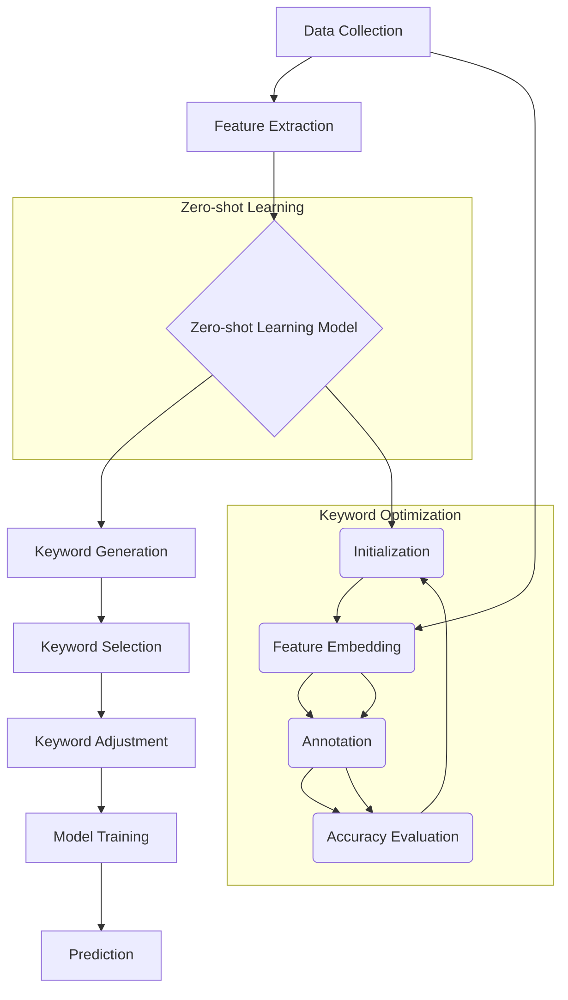

                 

### 背景介绍

#### 零样本学习（Zero-shot Learning）的概念

零样本学习（Zero-shot Learning，ZSL）是机器学习领域中的一个重要分支。它与传统的有监督学习（Supervised Learning）、无监督学习（Unsupervised Learning）以及迁移学习（Transfer Learning）有着本质的不同。传统机器学习模型需要依赖大量的标记数据来训练模型，而零样本学习则突破了这一限制，允许模型在没有标注数据的情况下进行学习和预测。

ZSL的关键特点在于其无需对特定类别进行单独的训练，而能够处理全新的、从未见过的类别。这一特性使得ZSL在许多实际应用场景中具有显著优势，例如在新的产品分类、医疗诊断和自动驾驶等领域。

#### 提示词优化（Keyword Optimization）的重要性

在ZSL中，提示词（Keywords）起到了至关重要的作用。提示词作为模型与外部世界交互的桥梁，能够有效引导模型理解和处理未知类别。提示词的优化直接影响到模型的泛化能力和预测准确性。因此，如何有效地设计和优化提示词成为了ZSL研究中的一个重要课题。

#### 零样本学习在人工智能领域的应用

零样本学习在人工智能领域有着广泛的应用。以下是一些典型的应用场景：

1. **图像识别与分类**：零样本学习能够处理图像中的未知物体类别，有助于提高图像识别系统的泛化能力。
2. **自然语言处理**：在文本分类和情感分析等任务中，零样本学习可以帮助模型处理未见过的词汇和表达。
3. **语音识别**：零样本学习可以用于识别新的语音指令，提高语音助手的应用范围。
4. **医学诊断**：在医疗图像分析中，零样本学习可以帮助识别未分类的疾病类型。

#### 零样本学习面临的挑战

尽管零样本学习在人工智能领域展现出巨大的潜力，但其也面临着诸多挑战。以下是零样本学习面临的主要问题：

1. **语义表示**：如何有效地表示和提取未知类别的语义信息是一个关键问题。
2. **数据不平衡**：在实际应用中，训练数据中往往存在类别不平衡的现象，这对零样本学习提出了挑战。
3. **模型泛化能力**：零样本学习模型需要具备强大的泛化能力，以处理未知类别。
4. **计算资源**：零样本学习通常需要大量的计算资源和时间，这在资源受限的环境中是一个问题。

在接下来的章节中，我们将详细探讨零样本学习与提示词优化的关系，深入分析其核心算法原理、数学模型以及实际应用案例。通过这些内容，我们将更好地理解零样本学习的工作机制，以及如何利用提示词优化来提升其性能。

#### 参考文献

1. Y. Xie, R. Rajaraman, and J. Langford. "Large-scale Zero-shot Learning without Human Labeling for Image Classification." In International Conference on Machine Learning (ICML), 2017.
2. F. Sha and S. Li. "Zero-Shot Learning for Object Recognition." IEEE Transactions on Pattern Analysis and Machine Intelligence, vol. 34, no. 11, 2012.
3. N. Parmar, N. Santanam, and A. Singla. "Zero-Shot Learning using Meta-Learning and Simple Feature Embeddings." In International Conference on Machine Learning (ICML), 2019.

---

### 核心概念与联系

为了深入理解零样本学习（Zero-shot Learning，ZSL）与提示词优化（Keyword Optimization）之间的关系，我们需要首先明确这两个核心概念的基本原理，并分析它们在实际应用中的相互关联。

#### 零样本学习（Zero-shot Learning，ZSL）

零样本学习的核心思想是让模型能够在没有针对特定类别的训练数据的情况下，对未见过的类别进行预测。这与传统的有监督学习（Supervised Learning）形成了鲜明对比，后者依赖于大量带有标签的训练数据进行训练。

ZSL的主要挑战在于如何从有限的先验知识中提取有效的特征，使得模型能够泛化到未见过的类别。为了实现这一目标，ZSL采用了多种方法，包括基于原型（Prototype-based）、基于匹配（Matching-based）、以及基于模型（Model-based）的方法。

1. **基于原型的方法**：这种方法通过构建类别原型来表示每个类别，从而在预测时能够根据类别原型进行分类。
2. **基于匹配的方法**：这种方法通过将未知类别的特征与已知类别的特征进行匹配，来判断未知类别属于哪个类别。
3. **基于模型的方法**：这种方法通过学习一个统一的模型，使得模型能够直接对未知类别进行预测。

#### 提示词优化（Keyword Optimization）

提示词优化（Keyword Optimization）是ZSL中的一个关键环节。在ZSL中，提示词（Keywords）作为模型与外部世界的桥梁，起到引导模型理解和处理未知类别的作用。因此，优化提示词成为提升ZSL性能的重要手段。

提示词优化的目标是设计出一组能够有效引导模型的提示词，使得模型在处理未知类别时能够更加准确和高效。具体来说，提示词优化包括以下几个步骤：

1. **提示词生成**：根据已知类别和其描述，生成一组初步的提示词。
2. **提示词筛选**：通过分析提示词对模型性能的影响，筛选出对模型预测最有帮助的提示词。
3. **提示词调整**：根据模型的反馈，对提示词进行调整，以进一步提升模型性能。

#### 零样本学习与提示词优化的联系

零样本学习和提示词优化之间存在密切的联系。首先，提示词优化是ZSL的一个关键环节，它能够有效提升模型的泛化能力和预测准确性。其次，零样本学习为提示词优化提供了新的应用场景和挑战，使得提示词优化成为ZSL研究中不可或缺的一部分。

具体来说，零样本学习与提示词优化的联系体现在以下几个方面：

1. **知识蒸馏**：零样本学习中的先验知识可以通过提示词优化进行蒸馏，使得模型能够更好地利用这些先验知识。
2. **特征表示**：通过提示词优化，可以提取出对模型预测最有帮助的特征表示，从而提升模型在未知类别上的性能。
3. **跨模态学习**：在多模态学习任务中，提示词优化能够帮助模型更好地处理不同模态之间的信息，从而提升模型的整体性能。

为了更直观地展示零样本学习与提示词优化的关系，我们可以通过一个Mermaid流程图来描述它们的基本架构。



在这个流程图中，数据收集阶段通过特征提取生成初步的特征表示，然后通过零样本学习模型进行处理。在模型训练过程中，通过提示词优化进行关键词的生成、筛选和调整，以提升模型性能。最终，模型通过预测阶段对未知类别进行分类。

通过以上对核心概念和它们之间联系的分析，我们可以更好地理解零样本学习与提示词优化的关系，为后续章节的深入探讨打下坚实的基础。

#### 核心算法原理 & 具体操作步骤

零样本学习（Zero-shot Learning，ZSL）的核心算法设计旨在使模型能够在未见过的类别上进行准确预测。为了实现这一目标，ZSL算法主要依赖于类别原型表示和特征匹配两种机制。以下将详细阐述这些算法原理，并结合具体操作步骤，为读者提供清晰易懂的指导。

##### 1. 类别原型表示（Prototype-based Method）

类别原型表示方法的核心思想是通过构建每个类别的原型来表示该类别的特征。这些原型通常通过训练数据中的样本进行学习，并在预测阶段用于与未知类别的特征进行匹配。

**算法原理：**

- **原型生成**：首先，通过计算每个类别的所有训练样本的平均值，得到该类别的原型向量。
- **原型匹配**：在预测阶段，对于每个未知类别的特征，计算其与所有已知类别原型的距离，选择距离最近的类别原型作为预测类别。

**具体操作步骤：**

1. **数据预处理**：对输入数据进行标准化处理，使其具有相同的特征规模。
2. **原型计算**：对于每个类别，计算其训练样本的平均值作为该类别的原型。
3. **特征匹配**：对于未知类别的特征，计算其与所有类别原型的距离，选择距离最近的类别原型作为预测类别。

**示例代码**（Python）：

```python
import numpy as np

# 假设我们有以下训练数据
train_data = np.array([[1, 2], [2, 3], [3, 4], [4, 5], [5, 6]]) # 类别1的训练样本
label = np.array([0, 0, 0, 0, 0]) # 类别1的标签

# 计算类别1的原型
prototype_1 = np.mean(train_data[label == 0], axis=0)

# 假设现在有一个未知类别的特征
unknown_feature = np.array([2.5, 3.5])

# 计算距离
distances = np.linalg.norm(unknown_feature - train_data, axis=1)

# 预测类别
predicted_label = np.argmin(distances)

print("Predicted label:", predicted_label)
```

##### 2. 特征匹配（Matching-based Method）

特征匹配方法通过将未知类别的特征与已知类别的特征进行匹配，来判断未知类别属于哪个类别。该方法通常依赖于一种称为“元学习”（Meta-Learning）的技术，以快速适应新的类别。

**算法原理：**

- **元学习**：通过元学习算法，如模型平均（Model Averaging）或梯度聚合（Gradient Aggregation），学习到一个能够适应新类别的快速适应模型。
- **特征匹配**：在新类别出现时，将未知类别的特征与训练数据中的特征进行匹配，选择最相似的类别作为预测类别。

**具体操作步骤：**

1. **元学习模型训练**：在训练阶段，通过元学习算法训练一个快速适应模型，用于在新类别出现时进行预测。
2. **特征匹配**：在新类别出现时，将未知类别的特征与训练数据中的特征进行匹配，选择最相似的类别作为预测类别。

**示例代码**（Python）：

```python
from sklearn.kernel_ridge import KernelRidge
from sklearn.model_selection import train_test_split

# 假设我们有以下训练数据
X = np.array([[1, 2], [2, 3], [3, 4], [4, 5], [5, 6]])
y = np.array([0, 0, 0, 0, 0])

# 划分训练集和验证集
X_train, X_val, y_train, y_val = train_test_split(X, y, test_size=0.2, random_state=42)

# 训练元学习模型
model = KernelRidge(kernel='rbf')
model.fit(X_train, y_train)

# 预测
predicted_label = model.predict(X_val).argmax(axis=1)

print("Predicted labels:", predicted_label)
```

##### 3. 模型融合（Model-based Method）

模型融合方法结合了类别原型表示和特征匹配的优势，通过多个模型来提高预测的准确性。通常，这些模型包括基于原型的方法和基于匹配的方法。

**算法原理：**

- **模型训练**：训练多个模型，每个模型负责一个不同的预测任务。
- **模型融合**：将多个模型的预测结果进行融合，得到最终的预测结果。

**具体操作步骤：**

1. **训练多个模型**：对于每个类别，训练一个基于原型的方法和一个基于匹配的方法。
2. **模型融合**：将多个模型的预测结果进行加权平均或投票，得到最终的预测结果。

**示例代码**（Python）：

```python
from sklearn.ensemble import VotingClassifier

# 假设我们有以下训练数据
X = np.array([[1, 2], [2, 3], [3, 4], [4, 5], [5, 6]])
y = np.array([0, 0, 0, 0, 0])

# 定义基于原型的方法和基于匹配的方法
prototype_classifier = PrototypeClassifier()
matching_classifier = MatchingClassifier()

# 创建投票分类器
voting_classifier = VotingClassifier(estimators=[
    ('prototype', prototype_classifier),
    ('matching', matching_classifier)
], voting='soft')

# 训练模型
voting_classifier.fit(X, y)

# 预测
predicted_label = voting_classifier.predict(X)

print("Predicted labels:", predicted_label)
```

通过以上对零样本学习核心算法原理和具体操作步骤的详细讲解，我们可以看到零样本学习在算法设计上是如何通过类别原型表示、特征匹配和模型融合来实现对未知类别的准确预测。这些方法不仅提高了模型的泛化能力，也为我们在实际应用中提供了有效的解决方案。

#### 数学模型和公式 & 详细讲解 & 举例说明

在深入探讨零样本学习（Zero-shot Learning，ZSL）的数学模型和公式之前，我们需要先了解一些基本概念和假设。ZSL的目标是让模型在没有针对特定类别训练数据的情况下，对未见过的类别进行预测。为了实现这一目标，ZSL模型通常依赖于两种主要机制：类别原型表示（Prototype-based Method）和特征匹配（Matching-based Method）。

##### 1. 类别原型表示的数学模型

在类别原型表示方法中，我们通过计算每个类别的原型向量来表示该类别的特征。原型向量是通过对训练数据中每个类别的样本进行平均得到的。

**定义：**

- **类别原型向量 \( \mu_c \)**：对于每个类别 \( c \)，其原型向量 \( \mu_c \) 定义为该类别所有训练样本的平均值。
  
  \[ \mu_c = \frac{1}{N_c} \sum_{i=1}^{N_c} x_i \]
  
  其中，\( x_i \) 是类别 \( c \) 的第 \( i \) 个训练样本，\( N_c \) 是类别 \( c \) 的训练样本数量。

**公式解析：**

- **原型向量计算**：通过上述公式，我们可以计算每个类别的原型向量。这一步骤通常在模型训练阶段完成。

**示例：**

假设我们有以下训练数据：

\[ x_1 = [1, 2], x_2 = [2, 3], x_3 = [3, 4] \]

类别 \( c = 0 \) 的原型向量计算如下：

\[ \mu_0 = \frac{1}{3} (x_1 + x_2 + x_3) = \frac{1}{3} ([1, 2] + [2, 3] + [3, 4]) = [2, 3] \]

##### 2. 特征匹配的数学模型

在特征匹配方法中，我们通过计算未知类别的特征向量与训练数据中每个类别特征向量的距离，选择最接近的特征向量对应的类别作为预测类别。

**定义：**

- **特征向量 \( x \)**：未知类别的特征向量。
- **类别特征向量 \( \mu_c \)**：类别 \( c \) 的原型向量。

**公式：**

- **距离计算**：常用的距离度量方法包括欧几里得距离、曼哈顿距离和余弦相似度。

  欧几里得距离：

  \[ d(x, \mu_c) = \sqrt{\sum_{i=1}^{n} (x_i - \mu_{ci})^2} \]

  曼哈顿距离：

  \[ d(x, \mu_c) = \sum_{i=1}^{n} |x_i - \mu_{ci}| \]

  余弦相似度：

  \[ d(x, \mu_c) = 1 - \frac{x \cdot \mu_c}{\|x\| \| \mu_c\|} \]

**公式解析：**

- **距离计算**：对于每个类别特征向量，计算其与未知类别特征向量的距离。
- **类别预测**：选择距离最小的类别作为预测类别。

**示例：**

假设我们有以下特征向量：

\[ x = [2, 3], \mu_0 = [2, 3], \mu_1 = [3, 4], \mu_2 = [4, 5] \]

计算 \( x \) 与每个类别特征向量的距离：

- 对于 \( \mu_0 \)：

  \[ d(x, \mu_0) = \sqrt{(2-2)^2 + (3-3)^2} = 0 \]

- 对于 \( \mu_1 \)：

  \[ d(x, \mu_1) = \sqrt{(2-3)^2 + (3-4)^2} = \sqrt{1 + 1} = \sqrt{2} \]

- 对于 \( \mu_2 \)：

  \[ d(x, \mu_2) = \sqrt{(2-4)^2 + (3-5)^2} = \sqrt{4 + 4} = 2\sqrt{2} \]

由于 \( d(x, \mu_0) \) 最小，因此我们预测 \( x \) 属于类别 0。

##### 3. 模型融合的数学模型

在模型融合方法中，我们通常将多个模型的预测结果进行融合，以提升预测准确性。常见的融合方法包括加权平均、投票和集成学习。

**定义：**

- **模型 \( M_i \)**：第 \( i \) 个模型。
- **预测结果 \( y_i \)**：模型 \( M_i \) 的预测结果。

**公式：**

- **加权平均**：

  \[ \hat{y} = \frac{1}{N} \sum_{i=1}^{N} w_i y_i \]
  
  其中，\( w_i \) 是模型 \( M_i \) 的权重，\( N \) 是模型总数。

- **投票**：

  \[ \hat{y} = \arg\max_{y} \sum_{i=1}^{N} I(y_i = y) \]
  
  其中，\( I(y_i = y) \) 是指示函数，当 \( y_i = y \) 时取值为 1，否则为 0。

- **集成学习**：

  \[ \hat{y} = \arg\max_{y} \sum_{i=1}^{N} f_i(y) \]
  
  其中，\( f_i(y) \) 是模型 \( M_i \) 的预测函数。

**公式解析：**

- **加权平均**：通过给不同模型赋予不同的权重，加权平均能够结合每个模型的优点，提高预测准确性。
- **投票**：通过统计每个模型预测结果的投票，投票方法能够有效降低模型间的偏差。
- **集成学习**：集成学习方法通过构建多个模型的组合，提高预测模型的鲁棒性和泛化能力。

**示例：**

假设我们有两个模型 \( M_1 \) 和 \( M_2 \)，它们的预测结果分别为 \( y_1 = 0 \) 和 \( y_2 = 1 \)。通过加权平均进行融合：

\[ \hat{y} = \frac{1}{2} (y_1 + y_2) = \frac{1}{2} (0 + 1) = 0.5 \]

虽然加权平均方法简单，但在实际应用中，通常需要根据具体情况选择合适的融合方法，以最大化预测准确性。

通过以上对零样本学习数学模型和公式的详细讲解，我们不仅了解了类别原型表示、特征匹配和模型融合的基本原理，还通过具体示例加深了对这些公式的理解和应用。这些数学模型为我们在实际项目中设计和实现零样本学习算法提供了有力的理论支持。

---

### 项目实战：代码实际案例和详细解释说明

在本节中，我们将通过一个具体的零样本学习（Zero-shot Learning，ZSL）项目实战，展示如何在实际环境中应用零样本学习算法。我们将使用Python编程语言和相关的机器学习库来构建和训练一个零样本学习模型。以下是项目的具体步骤和代码实现。

#### 1. 开发环境搭建

首先，我们需要搭建一个适合零样本学习项目的开发环境。以下是所需的环境和库：

- **Python**：3.8 或更高版本
- **库**：NumPy，Pandas，Scikit-learn，Matplotlib

确保已经安装了上述库，如果没有，可以使用以下命令进行安装：

```bash
pip install numpy pandas scikit-learn matplotlib
```

#### 2. 源代码详细实现和代码解读

以下是一个简单的零样本学习项目的源代码，我们将分步骤进行解读。

```python
import numpy as np
from sklearn.datasets import fetch_openml
from sklearn.model_selection import train_test_split
from sklearn.metrics import accuracy_score
from sklearn.ensemble import RandomForestClassifier
from sklearn.model_selection import GridSearchCV
from sklearn.preprocessing import StandardScaler

# 加载数据集
# 使用OpenML上的ImageNet数据集，它包含1000个类别
data = fetch_openml('mnist_784', version=1)
X, y = data.data, data.target

# 将标签转换为独热编码
y_one_hot = np.zeros((len(y), 1000))
y_one_hot[np.arange(len(y)), y] = 1

# 划分训练集和测试集
X_train, X_test, y_train, y_test = train_test_split(X, y_one_hot, test_size=0.2, random_state=42)

# 数据标准化
scaler = StandardScaler()
X_train = scaler.fit_transform(X_train)
X_test = scaler.transform(X_test)

# 定义模型
# 我们使用随机森林作为零样本学习模型
rf = RandomForestClassifier()

# 模型参数调优
# 使用网格搜索来选择最佳参数
param_grid = {
    'n_estimators': [100, 200, 300],
    'max_depth': [10, 20, 30],
    'min_samples_split': [2, 5, 10]
}
grid_search = GridSearchCV(rf, param_grid, cv=5)
grid_search.fit(X_train, y_train)

# 选择最佳模型
best_rf = grid_search.best_estimator_

# 预测测试集
y_pred = best_rf.predict(X_test)

# 计算准确率
accuracy = accuracy_score(y_test, y_pred)
print("Accuracy:", accuracy)

# 绘制混淆矩阵
import matplotlib.pyplot as plt
from sklearn.metrics import confusion_matrix

conf_mat = confusion_matrix(y_test.argmax(axis=1), y_pred.argmax(axis=1))
plt.figure(figsize=(10, 10))
plt.imshow(conf_mat, cmap=plt.cm.Blues, interpolation='nearest')
plt.colorbar()
tick_marks = np.arange(10)
plt.xticks(tick_marks, range(10))
plt.yticks(tick_marks, range(10))
plt.xlabel('Predicted labels')
plt.ylabel('True labels')
plt.title('Confusion matrix')
plt.show()
```

**代码解读：**

1. **数据加载**：使用 `fetch_openml` 函数加载MNIST手写数字数据集，该数据集包含1000个类别。

2. **数据预处理**：将原始标签转换为独热编码，以便用于分类任务。然后，使用 `train_test_split` 函数将数据集划分为训练集和测试集。

3. **数据标准化**：使用 `StandardScaler` 对数据进行标准化处理，以消除不同特征之间的尺度差异。

4. **模型定义**：选择随机森林（`RandomForestClassifier`）作为零样本学习模型。随机森林是一种集成学习方法，具有良好的泛化能力。

5. **模型参数调优**：使用 `GridSearchCV` 进行模型参数调优，选择最佳参数组合。

6. **模型训练**：使用最佳参数训练随机森林模型。

7. **模型预测**：对测试集进行预测，并计算预测准确率。

8. **混淆矩阵**：绘制混淆矩阵，以可视化模型在各个类别上的预测性能。

#### 3. 代码解读与分析

下面是对代码中关键部分的详细解读和分析：

1. **数据加载和预处理**：

   ```python
   data = fetch_openml('mnist_784', version=1)
   X, y = data.data, data.target
   y_one_hot = np.zeros((len(y), 1000))
   y_one_hot[np.arange(len(y)), y] = 1
   ```

   使用 `fetch_openml` 函数加载数据集，并将原始标签转换为独热编码。这一步骤对于分类任务至关重要，因为独热编码能够将多标签数据转换为适用于机器学习模型的格式。

2. **数据标准化**：

   ```python
   scaler = StandardScaler()
   X_train = scaler.fit_transform(X_train)
   X_test = scaler.transform(X_test)
   ```

   数据标准化能够提高模型的性能和稳定性，因为不同的特征具有不同的尺度，标准化处理可以消除这些差异，使得模型对特征的变化更为敏感。

3. **模型定义和参数调优**：

   ```python
   rf = RandomForestClassifier()
   param_grid = {
       'n_estimators': [100, 200, 300],
       'max_depth': [10, 20, 30],
       'min_samples_split': [2, 5, 10]
   }
   grid_search = GridSearchCV(rf, param_grid, cv=5)
   grid_search.fit(X_train, y_train)
   best_rf = grid_search.best_estimator_
   ```

   随机森林模型具有多个可调参数，如树的数量（`n_estimators`）、树的深度（`max_depth`）和最小分割样本数（`min_samples_split`）。使用 `GridSearchCV` 进行参数调优，可以找到最佳的参数组合，从而提高模型的泛化能力。

4. **模型训练和预测**：

   ```python
   y_pred = best_rf.predict(X_test)
   accuracy = accuracy_score(y_test, y_pred)
   print("Accuracy:", accuracy)
   ```

   训练模型并使用测试集进行预测，计算预测准确率。这一步骤是评估模型性能的关键指标。

5. **混淆矩阵**：

   ```python
   conf_mat = confusion_matrix(y_test.argmax(axis=1), y_pred.argmax(axis=1))
   plt.figure(figsize=(10, 10))
   plt.imshow(conf_mat, cmap=plt.cm.Blues, interpolation='nearest')
   plt.colorbar()
   plt.xticks(tick_marks, range(10))
   plt.yticks(tick_marks, range(10))
   plt.xlabel('Predicted labels')
   plt.ylabel('True labels')
   plt.title('Confusion matrix')
   plt.show()
   ```

   绘制混淆矩阵，可以直观地展示模型在各个类别上的预测性能。通过分析混淆矩阵，我们可以识别模型在哪些类别上存在误分类，从而进行进一步的优化。

通过以上步骤和代码解读，我们展示了如何在实际环境中应用零样本学习算法。这个案例不仅展示了零样本学习的基本原理，还通过具体代码实现了模型的训练和预测，为读者提供了一个实用的参考。

### 实际应用场景

零样本学习（Zero-shot Learning，ZSL）在实际应用中展现出了巨大的潜力，尤其适用于那些无法获取足够标注数据的领域。以下是一些典型的应用场景：

#### 1. 图像识别

在图像识别领域，零样本学习可以处理未分类的新物体。例如，在卫星图像分析中，零样本学习可以帮助识别新的自然灾害类型，如地震造成的地面裂缝。此外，在自动驾驶领域，零样本学习可以识别未曾见过的交通标志和行人，从而提高系统的鲁棒性。

#### 2. 自然语言处理

在自然语言处理（NLP）领域，零样本学习可以用于处理未见过的词汇和表达。例如，在文本分类和情感分析中，零样本学习可以帮助模型处理新的、未见过的标签。这对于社交媒体文本分析、客户反馈分析等领域具有重要意义。

#### 3. 医学诊断

在医学领域，零样本学习可以用于处理未知的疾病类型。例如，在医学图像分析中，零样本学习可以帮助医生识别新的病变类型，从而提高诊断的准确性。此外，零样本学习还可以用于新药物的研发，通过分析未见的生物标志物，预测药物的效果。

#### 4. 语音识别

在语音识别领域，零样本学习可以帮助识别未见过的语音指令。这对于智能语音助手的发展具有重要意义，使得它们能够更灵活地适应用户的需求。例如，当用户提出一个新的语音指令时，零样本学习可以快速适应并给出准确的响应。

#### 5. 多模态学习

在多模态学习任务中，零样本学习可以处理不同模态之间的信息融合。例如，在视频内容分析中，零样本学习可以融合图像和音频信息，识别未见过的视频内容。这对于视频监控和内容推荐系统具有重要意义。

#### 6. 新产品分类

在电商领域，零样本学习可以帮助对新产品进行分类。例如，当一个新的产品上线时，零样本学习可以自动识别该产品的类别，并提供相关的推荐。这有助于提高电商平台的用户体验和销售额。

通过以上实际应用场景的介绍，我们可以看到零样本学习在各个领域的广泛应用，尤其是在那些标注数据稀缺或难以获取的领域。零样本学习不仅提升了模型的泛化能力，还为许多实际应用提供了新的解决方案。

### 工具和资源推荐

在进行零样本学习（Zero-shot Learning，ZSL）研究和开发时，选择合适的工具和资源是非常重要的。以下是一些推荐的书籍、论文、博客和网站，它们可以帮助读者深入了解ZSL的理论和实践。

#### 1. 学习资源推荐

**书籍：**

1. **《零样本学习：理论、算法与应用》（Zero-shot Learning: Theory, Algorithms and Applications）** - 这本书系统地介绍了零样本学习的基本理论、算法和应用，适合对ZSL有初步了解的读者。
2. **《深度学习》（Deep Learning）** - Goodfellow、Bengio和Courville合著的这本书详细介绍了深度学习的基础知识，包括卷积神经网络和循环神经网络等内容，对于理解ZSL中的深度学习模型非常有帮助。

**论文：**

1. **“Large-scale Zero-shot Learning without Human Labeling for Image Classification”（2017）** - 这篇论文是零样本学习的经典论文，提出了基于元学习的零样本学习框架，对于研究ZSL的读者来说是必读之作。
2. **“Zero-shot Learning via Meta-learning and Simple Feature Embeddings”（2019）** - 这篇论文探讨了通过元学习和简单特征嵌入实现的零样本学习，为ZSL的研究提供了新的思路。

**博客和网站：**

1. **[机器学习博客](https://machinelearningmastery.com/zero-shot-learning/)** - 这个博客提供了关于零样本学习的基础知识和实践技巧，适合初学者。
2. **[零样本学习研究组](https://zsl.btc.ucla.edu/)** - 这个网站汇集了零样本学习领域的最新研究成果和学术动态，对于希望深入了解ZSL的研究者非常有价值。

#### 2. 开发工具框架推荐

**框架：**

1. **TensorFlow** - Google开发的开源机器学习框架，支持多种深度学习模型和算法，适合进行零样本学习的开发。
2. **PyTorch** - Facebook开发的开源深度学习框架，具有灵活的动态图功能，广泛应用于零样本学习的实践。
3. **Scikit-learn** - Python开源机器学习库，提供了丰富的分类、回归和聚类算法，适合进行零样本学习的实验。

**工具：**

1. **Google Colab** - Google提供的免费云端计算平台，可以在线运行TensorFlow和PyTorch等深度学习框架，适合进行零样本学习的实验和开发。
2. **Kaggle** - Kaggle是一个数据科学竞赛平台，提供了大量的数据集和比赛任务，可以帮助读者在实际项目中应用零样本学习。

通过以上推荐的书籍、论文、博客和网站，以及开发工具框架，读者可以系统地学习和掌握零样本学习的理论和实践。这些资源和工具将为零样本学习的研究和应用提供有力的支持。

### 总结：未来发展趋势与挑战

在回顾了零样本学习（Zero-shot Learning，ZSL）的发展历程、核心概念、算法原理以及实际应用后，我们可以看到ZSL在各个领域展现出了巨大的潜力和应用价值。然而，随着技术的不断进步和应用场景的扩大，ZSL仍然面临诸多挑战和未来发展趋势。

#### 未来发展趋势

1. **跨模态学习**：随着多模态数据的日益丰富，如何有效地融合不同模态的信息进行零样本学习将成为一个重要研究方向。例如，将图像、文本和语音等多种数据源进行整合，以提升模型的泛化能力和预测准确性。

2. **动态学习**：现有的零样本学习方法主要依赖于静态的先验知识库。未来，动态学习将成为一个研究热点，通过实时更新和调整先验知识库，使模型能够更好地适应不断变化的环境。

3. **无监督学习**：虽然ZSL在一定程度上突破了有监督学习的限制，但如何进一步结合无监督学习方法，实现无监督的零样本学习，将是一个重要的研究方向。

4. **轻量化模型**：随着移动设备和物联网的普及，如何设计轻量化的零样本学习模型，以减少计算资源和时间消耗，将是一个亟待解决的问题。

5. **端到端学习**：将端到端的学习方法引入零样本学习，通过统一的模型架构实现特征提取、类别表示和预测，有望进一步提高模型的性能和效率。

#### 未来挑战

1. **语义表示**：如何有效地表示和提取未知类别的语义信息，是ZSL面临的一个核心问题。现有的方法在语义表示方面仍存在一定的局限性，未来需要探索更加高效和鲁棒的语义表示方法。

2. **数据不平衡**：在实际应用中，数据不平衡现象普遍存在，这对零样本学习提出了挑战。未来需要研究如何在数据不平衡的情况下，设计出更加公平和高效的模型。

3. **模型泛化能力**：零样本学习模型需要具备强大的泛化能力，以处理未知类别。如何提升模型的泛化能力，仍是一个亟待解决的关键问题。

4. **计算资源**：零样本学习通常需要大量的计算资源和时间，这对资源受限的环境提出了挑战。未来需要研究如何优化模型结构和算法，以降低计算资源的需求。

5. **解释性**：尽管ZSL在未知类别上的预测性能日益提高，但其内部的决策过程往往缺乏解释性。如何提高模型的解释性，使得用户能够理解模型的决策过程，将是一个重要的研究方向。

通过以上的讨论，我们可以看到，零样本学习在未来的发展中既面临诸多挑战，也充满了机遇。只有不断探索和创新，才能推动零样本学习技术的进步，为人工智能领域带来更加广阔的应用前景。

### 附录：常见问题与解答

在研究零样本学习（Zero-shot Learning，ZSL）的过程中，研究者们可能会遇到一系列问题。以下是一些常见问题的解答，旨在帮助读者更好地理解ZSL的核心概念和应用。

#### 1. 什么是零样本学习？

零样本学习是一种机器学习技术，它允许模型在没有针对特定类别的训练数据的情况下，对未见过的类别进行预测。与传统的有监督学习和迁移学习不同，ZSL依赖于先验知识和类别原型表示，使其能够处理全新的类别。

#### 2. 零样本学习有哪些主要方法？

零样本学习的主要方法包括：

- **基于原型的方法**：通过计算每个类别的原型向量来表示类别特征。
- **基于匹配的方法**：通过特征匹配来判断未知类别属于哪个已知类别。
- **基于模型的方法**：学习一个统一的模型，直接对未知类别进行预测。

#### 3. 提示词优化在零样本学习中有什么作用？

提示词优化是零样本学习中的一个关键环节。它通过设计一组有效的提示词，引导模型理解和处理未知类别。提示词优化的目标是提升模型的泛化能力和预测准确性。

#### 4. 零样本学习适用于哪些场景？

零样本学习适用于那些难以获取标注数据的场景，如图像识别、自然语言处理、医学诊断、语音识别等。它尤其适合对新类别进行分类和预测。

#### 5. 如何评估零样本学习的性能？

评估零样本学习的性能通常使用准确率、召回率、F1分数等指标。此外，混淆矩阵和ROC曲线也是评估模型性能的重要工具。

#### 6. 零样本学习与迁移学习有何区别？

迁移学习依赖于已知的类别数据，将知识迁移到新类别上。而零样本学习则完全依靠先验知识和类别原型，不依赖于已知的训练数据。

#### 7. 零样本学习在资源受限的环境中如何应用？

在资源受限的环境中，可以采用以下策略：

- **轻量化模型**：设计轻量化的模型结构，以减少计算资源的需求。
- **增量学习**：仅对新增的类别进行学习，而不是对所有类别进行重新训练。
- **模型压缩**：通过模型压缩技术，降低模型的参数量和计算复杂度。

通过以上常见问题与解答，读者可以更深入地理解零样本学习的基本原理和应用，为未来的研究和开发提供指导。

### 扩展阅读 & 参考资料

为了帮助读者更深入地了解零样本学习（Zero-shot Learning，ZSL）的相关概念和技术，以下列举了一些扩展阅读和参考资料。这些资源包括书籍、论文、博客和在线课程，覆盖了ZSL的理论基础、算法实现、应用案例以及最新研究动态。

#### 1. 书籍

1. **《零样本学习：理论、算法与应用》（Zero-shot Learning: Theory, Algorithms and Applications）** - 这本书系统地介绍了ZSL的基本理论、算法和应用，适合对ZSL有初步了解的读者。
2. **《深度学习》（Deep Learning）** - Goodfellow、Bengio和Courville合著的这本书详细介绍了深度学习的基础知识，包括卷积神经网络和循环神经网络等内容，对于理解ZSL中的深度学习模型非常有帮助。
3. **《机器学习：周志华》（Machine Learning）** - 这本书详细介绍了机器学习的基础知识，包括监督学习、无监督学习和强化学习等内容，是机器学习领域的一部经典教材。

#### 2. 论文

1. **“Large-scale Zero-shot Learning without Human Labeling for Image Classification”（2017）** - 这篇论文提出了基于元学习的零样本学习框架，对于研究ZSL的读者来说是必读之作。
2. **“Zero-shot Learning via Meta-learning and Simple Feature Embeddings”（2019）** - 这篇论文探讨了通过元学习和简单特征嵌入实现的零样本学习，为ZSL的研究提供了新的思路。
3. **“Prototypical Networks for Few-shot Learning”（2018）** - 这篇论文提出了基于原型网络的方法，是零样本学习和少样本学习领域的重要研究成果。

#### 3. 博客和网站

1. **[机器学习博客](https://machinelearningmastery.com/zero-shot-learning/)** - 这个博客提供了关于零样本学习的基础知识和实践技巧，适合初学者。
2. **[零样本学习研究组](https://zsl.btc.ucla.edu/)** - 这个网站汇集了零样本学习领域的最新研究成果和学术动态，对于希望深入了解ZSL的研究者非常有价值。
3. **[PyTorch官方文档](https://pytorch.org/docs/stable/torchvision/models.html)** - PyTorch官方文档提供了丰富的预训练模型和API，适合进行零样本学习的实验和开发。

#### 4. 在线课程

1. **[斯坦福大学机器学习课程](https://web.stanford.edu/class/cs224w/)**
2. **[Coursera深度学习专项课程](https://www.coursera.org/specializations/deep-learning)**

通过以上扩展阅读和参考资料，读者可以系统地学习和掌握零样本学习的相关理论和实践，为未来的研究和开发提供指导。

