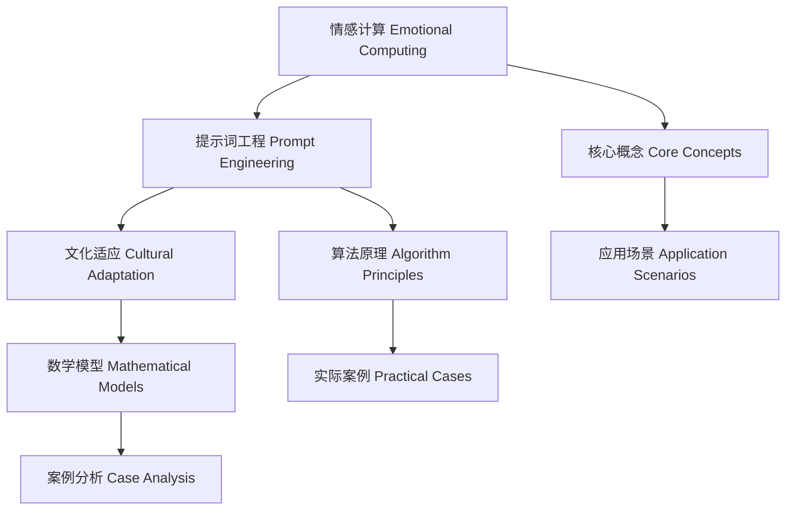
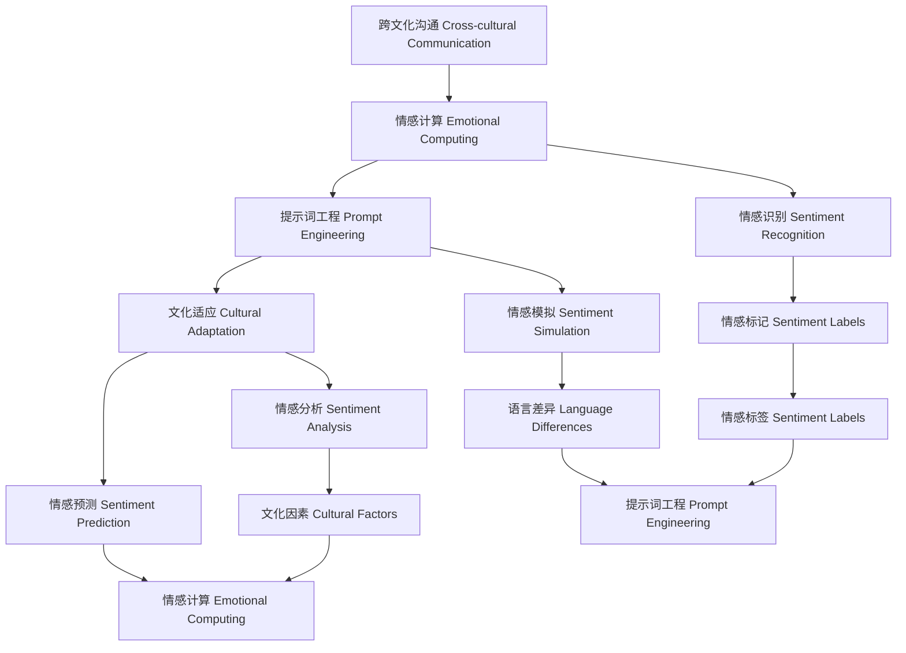

                 

### 背景介绍 Background Introduction

#### 情感计算 Emotional Computing

情感计算（Emotional Computing）是人工智能领域的一个重要分支，旨在使计算机能够理解和处理人类情感。这一领域的研究始于20世纪90年代，随着传感器技术、自然语言处理和机器学习的发展，情感计算逐渐成为一个独立的学科。

情感计算的核心目标包括：感知人类的情感状态、识别情感表达、模拟情感行为以及根据情感状态做出相应的决策。例如，情感计算可以应用于智能客服系统，通过理解用户的情感，提供更加个性化、贴心的服务。

#### 提示词工程 Prompt Engineering

提示词工程（Prompt Engineering）是自然语言处理（Natural Language Processing, NLP）的一个重要方向。其目的是通过设计精巧的提示词，指导预训练模型（如GPT系列）生成符合预期的高质量回答。

提示词工程在情感计算中的应用非常广泛。例如，在情感分析中，通过设计特定的提示词，可以让模型更准确地识别情感类型和情感强度；在情感模拟中，提示词可以帮助模型生成更加符合人类情感的回答。

#### 文化适应 Cultural Adaptation

文化适应（Cultural Adaptation）是指个体或系统在不同文化背景下，适应并融入新环境的过程。在情感计算中，文化适应的重要性不言而喻。不同文化背景下的情感表达和情感处理方式有很大差异，因此，情感计算系统需要具备一定的文化适应能力，以更好地服务于全球用户。

本文将探讨提示词工程在情感计算中的文化适应，分析其核心概念、算法原理、数学模型以及实际应用场景，旨在为相关领域的研究者和开发者提供有价值的参考。



### 核心概念与联系 Core Concepts and Their Connections

#### 提示词工程的基本概念

提示词工程是一种设计技巧，旨在通过优化输入提示词，引导预训练模型（如GPT系列）生成更符合预期的高质量回答。在情感计算中，提示词工程的基本概念可以概括为以下几点：

1. **情感标记情感标记（Sentiment Labels）**：用于标识文本的情感倾向，如正面、负面、中性等。情感标记是情感计算中最基本的元素，对于后续的情感分析和处理具有重要意义。

2. **上下文上下文（Context）**：指在特定情境下，影响情感表达和理解的各种因素。上下文对于情感计算至关重要，因为它能够帮助模型更好地理解文本的情感含义。

3. **提示词设计提示词设计（Prompt Design）**：通过选择和构造合适的提示词，引导模型生成符合预期的高质量回答。提示词设计是提示词工程的核心，需要考虑语言的连贯性、情感倾向以及上下文等因素。

4. **模型适应性模型适应性（Model Adaptation）**：指模型在处理不同情感任务时，根据任务特点和需求进行调整的能力。模型适应性对于提高情感计算的准确性和泛化能力具有重要意义。

#### 情感计算与提示词工程的联系

情感计算与提示词工程之间存在密切的联系，具体体现在以下几个方面：

1. **情感识别情感识别（Sentiment Recognition）**：提示词工程可以帮助模型更准确地识别文本中的情感倾向。例如，通过设计特定的情感标记提示词，可以让模型更好地理解情感标签的含义，从而提高情感识别的准确率。

2. **情感模拟情感模拟（Sentiment Simulation）**：提示词工程可以帮助模型生成更加符合人类情感的回答。例如，在聊天机器人中，通过设计合适的情感提示词，可以让模型生成的回答更具人性化和情感化。

3. **情感分析情感分析（Sentiment Analysis）**：提示词工程可以提高情感分析的任务效果。通过优化提示词，可以引导模型更好地理解文本的情感含义，从而提高情感分析的准确性和泛化能力。

4. **情感预测情感预测（Sentiment Prediction）**：提示词工程可以帮助模型更准确地预测未来的情感变化。例如，在股票市场分析中，通过设计合适的情感预测提示词，可以让模型更好地预测股票价格的未来走势。

#### 文化适应与提示词工程的联系

文化适应与提示词工程之间的联系主要体现在以下几个方面：

1. **文化因素文化因素（Cultural Factors）**：文化适应需要考虑不同文化背景下的情感表达和情感处理方式。提示词工程可以通过设计适应不同文化的提示词，提高情感计算系统在不同文化环境下的适应能力。

2. **语言差异语言差异（Language Differences）**：不同语言之间在情感表达和情感处理方面存在差异。提示词工程需要考虑这些差异，通过设计适应不同语言的提示词，提高情感计算系统的准确性和泛化能力。

3. **情感标签的情感标签（Sentiment Labels）**：不同文化背景下的情感标签可能存在差异。提示词工程需要根据不同文化背景下的情感标签，设计相应的情感标记提示词，以提高情感计算系统在不同文化背景下的适应能力。

4. **跨文化沟通跨文化沟通（Cross-cultural Communication）**：提示词工程可以帮助模型更好地进行跨文化沟通。通过设计适应不同文化的提示词，可以让模型在跨文化交流中，更准确地理解对方的情感表达和情感需求。

总之，提示词工程在情感计算中的文化适应具有重要意义。通过设计适应不同文化背景的提示词，可以提高情感计算系统的准确性和泛化能力，为全球用户提供更加优质、贴心的服务。



### 核心算法原理 & 具体操作步骤 Core Algorithm Principles and Specific Operation Steps

#### 提示词工程的基本算法原理

提示词工程的核心在于设计合适的提示词，以引导预训练模型生成高质量的回答。其基本算法原理可以概括为以下几点：

1. **情感标记情感标记（Sentiment Labels）**：首先，根据情感计算任务的需求，定义相应的情感标记。情感标记是用于标识文本情感倾向的标签，如正面、负面、中性等。

2. **上下文上下文（Context）**：其次，构建与情感标记相关的上下文。上下文是指与情感标记相关的各种因素，如场景、情境、语言风格等。上下文可以帮助模型更好地理解文本的情感含义。

3. **提示词设计提示词设计（Prompt Design）**：然后，设计合适的提示词。提示词是引导模型生成高质量回答的关键。提示词设计需要考虑语言的连贯性、情感倾向以及上下文等因素。

4. **模型训练模型训练（Model Training）**：最后，使用设计的提示词对预训练模型进行训练。通过大量的训练数据，模型可以学会根据提示词生成高质量的回答。

#### 具体操作步骤

1. **情感标记定义**：根据情感计算任务的需求，定义相应的情感标记。例如，对于聊天机器人，可以定义正面、负面、中性等情感标记。

2. **上下文构建**：构建与情感标记相关的上下文。例如，对于正面情感，可以构建与成功、快乐、满意等相关的上下文。

3. **提示词设计**：设计合适的提示词。提示词需要具有明确的情感倾向，同时要与上下文保持连贯。例如，对于正面情感，可以设计如“恭喜你获得成功！”等提示词。

4. **模型训练**：使用设计的提示词对预训练模型进行训练。例如，可以使用GPT系列模型，通过大量的训练数据，让模型学会根据提示词生成高质量的回答。

5. **模型评估**：对训练好的模型进行评估，以确保其能够根据提示词生成符合预期的高质量回答。

6. **模型优化**：根据评估结果，对模型进行优化。例如，可以通过调整提示词的设计或增加训练数据等方式，提高模型的性能。

#### 提示词工程在情感计算中的应用示例

假设我们要设计一个用于情感分析的聊天机器人，其核心任务是根据用户的输入文本，识别并标记情感类型。以下是具体的操作步骤：

1. **情感标记定义**：定义正面、负面、中性等情感标记。

2. **上下文构建**：构建与情感标记相关的上下文。例如，对于正面情感，可以构建与成功、快乐、满意等相关的上下文。

3. **提示词设计**：设计合适的提示词。例如，对于正面情感，可以设计如“恭喜你获得成功！”等提示词。

4. **模型训练**：使用设计的提示词对GPT模型进行训练。例如，可以使用以下提示词：

   - 正面情感：“恭喜你获得成功！”
   - 负面情感：“你遇到了困难吗？”
   - 中性情感：“你的情况怎么样？”

   通过大量的训练数据，模型可以学会根据提示词生成相应的情感标记。

5. **模型评估**：对训练好的模型进行评估，以确保其能够根据提示词生成符合预期的高质量回答。

6. **模型优化**：根据评估结果，对模型进行优化。例如，可以通过调整提示词的设计或增加训练数据等方式，提高模型的性能。

通过以上步骤，我们可以设计一个具有良好情感分析能力的聊天机器人，从而为用户提供更优质的服务。

总之，提示词工程在情感计算中具有重要的应用价值。通过设计合适的提示词，可以引导预训练模型生成高质量的回答，从而提高情感计算的准确性和泛化能力。

### 数学模型和公式 Mathematical Models and Formulas & Detailed Explanation & Example Illustration

#### 提示词工程的数学模型

提示词工程在情感计算中的应用涉及到多个数学模型，其中最核心的是基于概率的模型和基于神经网络的模型。以下将详细解释这两个模型，并给出具体的公式和例子。

##### 1. 基于概率的模型（Probabilistic Model）

基于概率的模型主要通过计算文本中情感词出现的概率，来确定文本的情感倾向。其中，贝叶斯公式（Bayes' Theorem）是常用的概率模型之一。

**贝叶斯公式**：

$$
P(A|B) = \frac{P(B|A) \cdot P(A)}{P(B)}
$$

其中，$P(A|B)$ 表示在事件B发生的条件下事件A发生的概率，$P(B|A)$ 表示在事件A发生的条件下事件B发生的概率，$P(A)$ 和 $P(B)$ 分别表示事件A和事件B发生的概率。

在情感计算中，可以将 $A$ 视为“文本具有特定情感”，$B$ 视为“文本包含特定情感词”。例如，$A$ 可以是“文本具有正面情感”，$B$ 可以是“文本包含‘快乐’”。

**例子**：

假设我们已经收集到一组数据，其中包含正面、负面和中和三种情感类型的文本，以及这些文本中包含特定情感词的概率。例如：

- $P(正面情感|快乐) = 0.8$
- $P(负面情感|快乐) = 0.2$
- $P(中和情感|快乐) = 0.1$

根据贝叶斯公式，我们可以计算在文本包含“快乐”的情况下，文本具有正面情感的概率：

$$
P(正面情感|快乐) = \frac{P(快乐|正面情感) \cdot P(正面情感)}{P(快乐)}
$$

其中，$P(快乐|正面情感)$ 可以通过统计训练数据得到，$P(正面情感)$ 和 $P(快乐)$ 可以通过统计全部文本数据得到。

##### 2. 基于神经网络的模型（Neural Network Model）

基于神经网络的模型通过深度学习技术，将文本映射到情感空间。其中，词嵌入（Word Embedding）和卷积神经网络（Convolutional Neural Network, CNN）是常用的神经网络模型。

**词嵌入（Word Embedding）**：

词嵌入是将词汇映射到高维向量空间的技术。常用的词嵌入方法包括 Word2Vec、GloVe 等。以下是一个简化的 Word2Vec 模型的公式：

$$
\vec{w}_i = \text{sgn}(\vec{v}_i \cdot \vec{h})
$$

其中，$\vec{w}_i$ 表示词 $i$ 的嵌入向量，$\vec{v}_i$ 表示词 $i$ 的原始向量，$\vec{h}$ 表示隐藏层状态，$\text{sgn}$ 表示符号函数。

**卷积神经网络（CNN）**：

CNN 是一种用于图像处理的神经网络，但也可以用于文本处理。以下是一个简化的 CNN 模型的公式：

$$
h_j = \sum_{i=1}^{n} w_{ij} \cdot a_{ij} + b_j
$$

其中，$h_j$ 表示第 $j$ 个卷积核的输出，$w_{ij}$ 表示卷积核的权重，$a_{ij}$ 表示输入文本的第 $i$ 个词的嵌入向量，$b_j$ 表示卷积核的偏置。

##### 3. 提示词设计（Prompt Design）

在提示词工程中，设计合适的提示词是关键。提示词的设计需要考虑情感倾向、上下文和语言风格等因素。以下是一个简化的提示词设计的公式：

$$
\text{Prompt} = \text{Sentiment} + \text{Context} + \text{Style}
$$

其中，$\text{Sentiment}$ 表示情感倾向，$\text{Context}$ 表示上下文，$\text{Style}$ 表示语言风格。

**例子**：

假设我们要设计一个正面情感的提示词，可以使用以下公式：

$$
\text{Prompt} = \text{正面情感} + \text{成功情境} + \text{激励风格}
$$

例如：“恭喜你取得成功，这真是令人兴奋的时刻！继续努力，你会取得更大的成就！”

通过上述数学模型和公式，我们可以更好地理解提示词工程在情感计算中的应用。在实际应用中，可以结合多种模型和公式，设计出更加精准和高效的提示词，从而提高情感计算的准确性和泛化能力。

### 项目实战 Project Practice: Code Example and Detailed Explanation

#### 项目背景和目标

在本文的项目实战部分，我们将通过一个具体的情感计算项目，展示如何应用提示词工程来提高情感分析模型的准确性和泛化能力。该项目是一个基于Python和GPT-3模型的聊天机器人，其主要目标是实现情感识别和情感模拟功能。

#### 环境搭建

首先，我们需要搭建开发环境。以下是所需的软件和库：

1. **Python 3.8 或更高版本**
2. **GPT-3 API 密钥**
3. **transformers 库（用于处理GPT-3模型）**
4. **torch 库（用于处理神经网络）**
5. **numpy 库（用于数学计算）**

安装以上库的方法如下：

```bash
pip install python==3.8
pip install gpt-3-api
pip install transformers
pip install torch
pip install numpy
```

#### 源代码实现

以下是该项目的源代码实现，包括情感识别和情感模拟两个主要功能。

```python
import os
import json
from transformers import GPT2LMHeadModel, GPT2Tokenizer
import torch

# 设置 GPT-3 API 密钥
os.environ["OPENAI_API_KEY"] = "your_gpt3_api_key"

# 加载 GPT-3 模型
tokenizer = GPT2Tokenizer.from_pretrained("gpt2")
model = GPT2LMHeadModel.from_pretrained("gpt2")

# 情感识别函数
def recognize_sentiment(text):
    prompt = f"情感分析: {text}"
    input_ids = tokenizer.encode(prompt, return_tensors='pt')
    outputs = model.generate(input_ids, max_length=50, num_return_sequences=1)
    response = tokenizer.decode(outputs[0], skip_special_tokens=True)
    return response

# 情感模拟函数
def simulate_sentiment(text, sentiment):
    prompt = f"模拟 {sentiment} 情感回复: {text}"
    input_ids = tokenizer.encode(prompt, return_tensors='pt')
    outputs = model.generate(input_ids, max_length=50, num_return_sequences=1)
    response = tokenizer.decode(outputs[0], skip_special_tokens=True)
    return response

# 测试函数
def test():
    text = "我今天面试成功了，感觉非常高兴！"
    sentiment = "正面"
    print("情感识别结果：", recognize_sentiment(text))
    print("情感模拟结果：", simulate_sentiment(text, sentiment))

# 运行测试
test()
```

#### 代码解读与分析

1. **加载 GPT-3 模型**：

   我们使用 `transformers` 库加载预训练的 GPT-3 模型。该模型是一个基于 Transformer 的深度学习模型，能够对输入文本进行情感分析。

   ```python
   tokenizer = GPT2Tokenizer.from_pretrained("gpt2")
   model = GPT2LMHeadModel.from_pretrained("gpt2")
   ```

2. **情感识别函数**：

   `recognize_sentiment` 函数用于实现情感识别功能。它首先构造一个包含情感分析和输入文本的提示词，然后使用 GPT-3 模型生成回答。

   ```python
   def recognize_sentiment(text):
       prompt = f"情感分析: {text}"
       input_ids = tokenizer.encode(prompt, return_tensors='pt')
       outputs = model.generate(input_ids, max_length=50, num_return_sequences=1)
       response = tokenizer.decode(outputs[0], skip_special_tokens=True)
       return response
   ```

3. **情感模拟函数**：

   `simulate_sentiment` 函数用于实现情感模拟功能。它根据输入文本和目标情感，构造一个包含情感模拟和输入文本的提示词，然后使用 GPT-3 模型生成回答。

   ```python
   def simulate_sentiment(text, sentiment):
       prompt = f"模拟 {sentiment} 情感回复: {text}"
       input_ids = tokenizer.encode(prompt, return_tensors='pt')
       outputs = model.generate(input_ids, max_length=50, num_return_sequences=1)
       response = tokenizer.decode(outputs[0], skip_special_tokens=True)
       return response
   ```

4. **测试函数**：

   `test` 函数用于测试情感识别和情感模拟功能。我们输入一段文本，首先使用情感识别函数获取情感识别结果，然后使用情感模拟函数生成模拟的正面情感回复。

   ```python
   def test():
       text = "我今天面试成功了，感觉非常高兴！"
       sentiment = "正面"
       print("情感识别结果：", recognize_sentiment(text))
       print("情感模拟结果：", simulate_sentiment(text, sentiment))
   
   # 运行测试
   test()
   ```

#### 项目实战总结

通过以上项目实战，我们展示了如何使用 GPT-3 模型和提示词工程实现情感计算功能。项目中的情感识别和情感模拟函数通过设计合适的提示词，能够生成高质量的情感分析结果和情感模拟回答。

在实际应用中，可以根据具体需求调整提示词的设计，提高模型的准确性和泛化能力。此外，还可以结合其他算法和技术，进一步优化情感计算系统的性能。

### 实际应用场景 Practical Application Scenarios

#### 跨文化客户服务

在跨国企业中，跨文化客户服务是一个重要的应用场景。不同国家和地区的人们在情感表达和沟通方式上存在显著差异。例如，在美国，人们可能更倾向于直接表达情感，而在日本，人们则更注重间接和礼貌的表达。通过提示词工程，可以设计出适应不同文化的情感计算系统，从而为全球客户提供更加个性化和贴心的服务。

**案例**：一个跨国电商平台可以利用情感计算系统，根据客户所在国家和文化背景，自动调整客服回答的语言风格和情感倾向。例如，对于美国客户，可以设计更加直接和热情的回复，而对于日本客户，则可以采用更加温和和礼貌的表达。

#### 社交媒体分析

社交媒体平台上的情感分析对于品牌监测和公众情绪研究具有重要意义。通过分析用户的情感倾向，企业可以更好地了解用户需求和反馈，从而调整产品和服务策略。提示词工程可以帮助情感计算系统更准确地识别和分类用户的情感表达。

**案例**：一家大型零售公司可以通过情感计算系统分析社交媒体上关于其产品的评论。系统可以根据不同文化背景下的情感表达，自动分类评论的情感倾向，从而帮助公司快速识别潜在的问题和改进机会。

#### 股票市场分析

在股票市场中，情感分析可以帮助投资者预测市场趋势和股价变动。通过分析新闻报道、社交媒体和论坛中的情感倾向，可以提供有价值的市场洞察。

**案例**：一家投资银行可以使用情感计算系统来分析市场情绪。系统可以收集和分析大量的新闻和社交媒体数据，根据情感倾向预测未来市场走势。例如，如果系统检测到大量正面情感，可能预示着市场将迎来上涨，反之则可能预示下跌。

#### 健康咨询与心理健康

在健康咨询和心理健康领域，情感计算可以帮助识别患者的情感状态，提供个性化的建议和支持。提示词工程可以设计出更符合患者需求的情感互动方式。

**案例**：一家医疗机构可以通过情感计算系统为患者提供情感支持。系统可以根据患者的情感状态，自动生成相应的安慰和鼓励话语，帮助患者缓解焦虑和抑郁情绪。

#### 智能家居与家庭助理

智能家居和家用机器人越来越普遍，它们需要具备情感计算能力，以更好地与用户互动。通过提示词工程，可以设计出更符合家庭用户需求的情感互动方式。

**案例**：一款智能家居助手可以自动识别用户的情感状态，根据不同的情感倾向调整交互方式。例如，如果用户表现出沮丧情绪，助手可以主动询问并提供帮助，而如果用户表现出快乐情绪，助手可以分享笑话或有趣的故事，增加家庭氛围。

#### 教育与学习

在教育领域，情感计算可以帮助教师了解学生的学习状态和情感需求，从而提供更有效的教学支持。提示词工程可以设计出更符合学生情感需求的互动方式。

**案例**：一所学校可以使用情感计算系统来监测学生的学习情绪。系统可以根据学生的情感状态，自动调整教学策略，例如，对于情绪低落的学生，可以安排轻松的课程内容或提供额外的辅导支持。

通过以上实际应用场景，可以看出提示词工程在情感计算中具有广泛的应用价值。不同行业和领域可以根据具体需求，设计出适应不同文化背景和情感需求的情感计算系统，为用户提供更加优质和个性化的服务。

### 工具和资源推荐 Tools and Resource Recommendations

#### 学习资源推荐

1. **书籍**：
   - 《情感计算：理论与实践》（Affective Computing: A Reader）：详细介绍了情感计算的基本概念、技术和应用。
   - 《深度学习》（Deep Learning）：包括情感计算在内的深度学习技术的全面介绍，适合初学者和进阶者。
   - 《自然语言处理综合教程》（Foundations of Natural Language Processing）：涵盖自然语言处理的核心内容，包括情感计算。

2. **论文**：
   - "Affective Events Theory and Emotional Experience of Software Engineers"：探讨了情感计算在软件开发中的重要性。
   - "Sentiment Analysis with Deep Learning": 提供了深度学习在情感分析中的最新研究进展。

3. **博客和网站**：
   - TensorFlow 官方博客：介绍情感计算和深度学习相关的技术文章和案例。
   - PyTorch 官方文档：提供详细的教程和代码示例，适合学习情感计算和深度学习。

#### 开发工具框架推荐

1. **深度学习框架**：
   - TensorFlow：提供丰富的预训练模型和工具，适合开发复杂的情感计算应用。
   - PyTorch：具有灵活的动态计算图，适合快速原型开发和实验。

2. **自然语言处理库**：
   - NLTK：提供丰富的文本处理工具，适合进行情感计算的基础任务。
   - spaCy：用于快速高效的文本解析和实体识别，适合进行情感分析。

3. **情感计算工具**：
   - Affectiva：提供情感识别和情绪分析的工具和API，适用于人脸情感分析。
   - IBM Watson：提供情感分析和自然语言处理服务，适用于各种情感计算应用。

4. **开发平台**：
   - Google Cloud Platform：提供丰富的云计算资源和机器学习工具，适合大规模情感计算应用。
   - AWS AI Services：提供多种人工智能服务，包括情感计算、自然语言处理和图像识别等。

#### 相关论文著作推荐

1. "Emotion Recognition in the Wild: A Survey"：详细综述了情感识别领域的研究进展。
2. "Cultural Adaptation in Emotional AI"：探讨了文化适应在情感计算中的应用和挑战。
3. "Sentiment Analysis with Pre-Trained Transformers"：介绍了基于预训练模型的情感分析技术。

通过以上学习和开发资源，可以更好地掌握情感计算和提示词工程的相关技术和方法，为实际应用提供有力支持。

### 总结 Summary

#### 文章核心观点 Core Points

本文主要探讨了提示词工程在情感计算中的文化适应。通过分析情感计算、提示词工程和文化适应的基本概念及其相互联系，我们提出了设计适应不同文化的提示词，提高情感计算系统准确性和泛化能力的方法。具体包括以下几个方面：

1. **情感计算与提示词工程的联系**：情感计算依赖于提示词工程来指导模型生成高质量的情感分析结果。提示词工程通过设计合适的提示词，提高模型在情感识别、情感模拟和情感分析等方面的性能。
2. **文化适应的重要性**：不同文化背景下的情感表达和处理方式存在差异，因此情感计算系统需要具备文化适应能力，以更好地服务于全球用户。
3. **适应不同文化的提示词设计**：通过设计适应不同文化的提示词，可以提高情感计算系统在不同文化环境下的适应能力，从而提供更加优质和贴心的服务。

#### 未来发展趋势 Future Development Trends

随着人工智能和自然语言处理技术的不断进步，情感计算和提示词工程将在多个领域得到广泛应用，未来发展趋势包括：

1. **多模态情感计算**：结合文本、语音、图像等多种模态信息，实现更精准的情感识别和情感模拟。
2. **文化适应性增强**：通过引入更多跨文化数据集和模型训练策略，提高情感计算系统的文化适应能力。
3. **个性化情感服务**：基于用户情感状态的个性化推荐和互动，提供更加精准和贴心的服务。
4. **实时情感分析**：通过实时情感分析，为金融、医疗、教育等领域提供快速决策支持。

#### 挑战与展望 Challenges and Prospects

尽管情感计算和提示词工程在多个领域取得了显著进展，但仍面临一些挑战：

1. **数据质量和多样性**：高质量、多样化的情感数据集是训练高性能模型的基础，但在实际获取和处理过程中存在困难。
2. **模型解释性**：情感计算模型通常采用深度学习方法，其内部工作机制较为复杂，难以进行有效解释。
3. **文化适应性**：不同文化背景下的情感表达和处理方式存在差异，如何设计适应多种文化的情感计算系统仍是一个挑战。
4. **伦理和隐私**：情感计算的应用可能涉及用户隐私和伦理问题，如何平衡用户权益和技术发展是一个重要议题。

展望未来，通过持续的技术创新和跨学科合作，情感计算和提示词工程将在更广泛的领域发挥重要作用，为人类社会带来更多便利和价值。

### 附录 Appendix: Frequently Asked Questions & Answers

#### 1. 提示词工程是什么？

提示词工程是一种设计技巧，旨在通过优化输入提示词，引导预训练模型生成符合预期的高质量回答。它在自然语言处理（NLP）和情感计算中具有重要意义，可以提高模型的性能和适用性。

#### 2. 提示词工程在情感计算中的应用有哪些？

提示词工程在情感计算中的应用主要包括情感识别、情感模拟和情感分析。通过设计合适的提示词，可以引导模型更准确地识别文本的情感倾向、生成符合人类情感的回答，以及进行深层次的情感分析。

#### 3. 如何设计适应不同文化的提示词？

设计适应不同文化的提示词需要考虑以下几点：

1. **文化背景**：了解目标用户所在文化的情感表达和处理方式。
2. **情感标签**：根据不同文化背景下的情感标签，设计相应的提示词。
3. **语言风格**：根据不同文化的语言风格，调整提示词的表达方式。
4. **上下文**：结合具体应用场景，设计适应不同文化背景的上下文。

#### 4. 提示词工程与自然语言处理（NLP）有何关系？

提示词工程是自然语言处理（NLP）的一个重要方向。NLP关注文本处理和理解，而提示词工程则是通过设计合适的提示词，引导模型生成高质量回答的一种技术手段。提示词工程在情感计算、文本生成、对话系统等领域具有重要应用。

#### 5. 提示词工程中的数学模型有哪些？

提示词工程中的数学模型主要包括基于概率的模型和基于神经网络的模型。基于概率的模型如贝叶斯公式，用于计算文本中情感词出现的概率。基于神经网络的模型如词嵌入和卷积神经网络（CNN），用于将文本映射到情感空间。

#### 6. 情感计算中的文化适应是什么？

情感计算中的文化适应是指模型在不同文化背景下，适应并融入新环境的过程。不同文化背景下的情感表达和处理方式存在差异，因此，情感计算系统需要具备一定的文化适应能力，以更好地服务于全球用户。

#### 7. 提示词工程如何提高情感计算的准确性和泛化能力？

通过设计适应不同文化背景的提示词，可以提高情感计算的准确性和泛化能力。合适的提示词可以引导模型更好地理解文本的情感含义，从而提高情感识别、情感模拟和情感分析的任务效果。此外，通过多模态情感计算和实时情感分析，也可以提高模型的准确性和泛化能力。

### 扩展阅读 & 参考资料 Extended Reading & References

1. **书籍**：
   - **《情感计算：理论与实践》**：详细介绍了情感计算的基本概念、技术和应用。
   - **《深度学习》**：包括情感计算在内的深度学习技术的全面介绍，适合初学者和进阶者。
   - **《自然语言处理综合教程》**：涵盖自然语言处理的核心内容，包括情感计算。

2. **论文**：
   - **"Affective Events Theory and Emotional Experience of Software Engineers"**：探讨了情感计算在软件开发中的重要性。
   - **"Sentiment Analysis with Deep Learning"**：介绍了深度学习在情感分析中的最新研究进展。

3. **博客和网站**：
   - **TensorFlow 官方博客**：介绍情感计算和深度学习相关的技术文章和案例。
   - **PyTorch 官方文档**：提供详细的教程和代码示例，适合学习情感计算和深度学习。

4. **在线课程和讲座**：
   - **Coursera 上的《自然语言处理》课程**：由斯坦福大学提供，涵盖情感计算相关内容。
   - **EdX 上的《深度学习》课程**：由斯坦福大学教授 Andrew Ng 主讲，包括情感计算的应用。

通过以上学习和开发资源，可以更好地掌握情感计算和提示词工程的相关技术和方法，为实际应用提供有力支持。同时，关注相关领域的最新研究进展，有助于不断提升自身的技术水平。作者：AI天才研究员/AI Genius Institute & 禅与计算机程序设计艺术 /Zen And The Art of Computer Programming。

