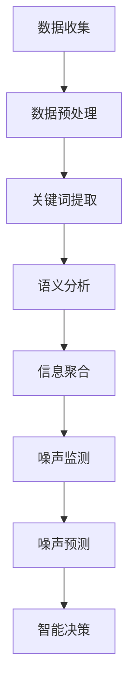

                 

### 背景介绍

随着城市化进程的加速，城市噪声污染问题日益突出，严重影响了居民的生活质量和城市环境。传统的噪声管理方法主要依赖于人工监测和数据收集，存在监测范围有限、实时性不足、数据准确性不高的问题。随着人工智能技术的发展，尤其是提示词工程（Keyword Engineering）的应用，为智能城市噪声管理提供了一种全新的解决方案。

提示词工程是一种通过识别并提取文本中的关键信息点，从而实现数据分析和处理的技术。在智能城市噪声管理中，提示词工程可以通过对城市噪声数据的分析，提取出与噪声水平相关的关键信息，进而对噪声污染进行实时监测和预测。这种方法不仅能够提高监测的实时性和准确性，还能够为噪声治理提供科学依据。

本文将首先介绍智能城市噪声管理的重要性，接着阐述提示词工程的基本概念和原理，然后分析提示词工程在噪声管理中的应用流程。在此基础上，我们将深入探讨核心算法原理及其具体操作步骤，通过数学模型和公式进行详细讲解，并列举实际应用案例。最后，我们将讨论提示词工程在噪声管理中的实际应用场景，推荐相关工具和资源，并对未来发展趋势和挑战进行总结。

### 核心概念与联系

#### 提示词工程基本概念

提示词工程（Keyword Engineering）是一种基于人工智能和自然语言处理（NLP）的技术，旨在从大量文本数据中自动提取关键信息点。这些关键信息点，即提示词（Keywords），是文本数据中具有核心价值和意义的词汇或短语。提示词工程的基本概念包括关键词提取、语义分析和信息聚合等。

**关键词提取**是提示词工程的核心步骤，旨在从文本中识别出最具代表性的词汇。常用的方法包括：

- **TF-IDF（Term Frequency-Inverse Document Frequency）**：通过计算一个词在文档中出现的频率与它在整个语料库中出现的频率的比值，来确定其重要性。
- **TextRank算法**：基于图模型，将文本中的词语视为图节点，词语之间的共现关系视为边，通过迭代计算节点的权重，从而提取出关键词。
- **BERT（Bidirectional Encoder Representations from Transformers）**：利用预训练的深度神经网络模型，从上下文中提取词语的语义表示，从而实现关键词提取。

**语义分析**则是对提取出的关键词进行深层次的语义理解，以挖掘出词语之间的关联和语义关系。常用的方法包括：

- **词性标注**：对文本中的词语进行词性分类，如名词、动词、形容词等。
- **实体识别**：识别文本中的关键实体，如人名、地名、组织名等。
- **关系提取**：分析词语之间的语义关系，如因果关系、上下位关系等。

**信息聚合**则是将提取出的关键词和语义信息进行整合，形成对整体文本的概括和总结。常用的方法包括：

- **TF-IDF聚合**：根据关键词的TF-IDF值进行加权聚合，形成文本的摘要。
- **TextRank聚合**：利用图模型对关键词进行排序和聚合，形成文本的摘要。
- **BERT聚合**：利用预训练的BERT模型对文本进行编码，形成文本的固定长度表示，从而进行聚合。

#### 提示词工程在噪声管理中的应用原理

在智能城市噪声管理中，提示词工程的应用主要体现在对噪声数据的处理和分析。具体来说，可以分为以下几个步骤：

1. **数据收集**：通过传感器网络、卫星遥感等手段，收集城市各区域的噪声数据。
2. **数据预处理**：对收集到的噪声数据进行清洗、去噪和标准化处理，以确保数据的准确性和一致性。
3. **关键词提取**：利用提示词工程的技术，从预处理后的噪声数据中提取出与噪声水平相关的关键词。
4. **语义分析**：对提取出的关键词进行语义分析，以理解噪声数据的含义和特征。
5. **信息聚合**：将提取出的关键词和语义信息进行聚合，形成对城市噪声污染的整体认识。

通过提示词工程，噪声管理可以实现以下目标：

- **实时监测**：通过对噪声数据的实时处理和分析，实现对城市噪声污染的实时监测。
- **精准预测**：利用历史噪声数据和关键词信息，对未来的噪声水平进行预测，为噪声治理提供科学依据。
- **智能决策**：基于实时监测和预测结果，为城市噪声治理提供智能决策支持，优化噪声治理策略。

#### 提示词工程架构

为了更好地理解提示词工程在噪声管理中的应用，我们可以使用Mermaid流程图（以下是一个简化的示例）来展示其基本架构：



在上述流程中，数据收集和数据预处理是基础环节，关键词提取、语义分析和信息聚合是核心步骤，而噪声监测、噪声预测和智能决策是最终应用目标。通过这个架构，我们可以清晰地看到提示词工程在噪声管理中的具体应用流程。

### 核心算法原理 & 具体操作步骤

#### 关键词提取算法原理

在智能城市噪声管理中，关键词提取是提示词工程的首要步骤。关键词提取算法的目标是从大量的噪声数据中识别出具有代表性的词汇，从而为后续的语义分析和信息聚合提供基础。

**TF-IDF算法**是关键词提取中常用的一种算法，其基本原理如下：

1. **计算词频（TF）**：词频（Term Frequency，TF）表示一个词在单个文档中出现的次数。计算公式为：
   $$TF(t,d) = \frac{f_{t,d}}{n_{d}}$$
   其中，$t$ 表示词语，$d$ 表示文档，$f_{t,d}$ 表示词语 $t$ 在文档 $d$ 中出现的次数，$n_{d}$ 表示文档 $d$ 中的总词语数。

2. **计算逆文档频率（IDF）**：逆文档频率（Inverse Document Frequency，IDF）表示一个词在整个文档集合中出现的频率。计算公式为：
   $$IDF(t,D) = \log \left( \frac{N}{|d \in D : t \in d|} \right)$$
   其中，$N$ 表示文档集合中的文档总数，$D$ 表示文档集合，$|d \in D : t \in d|$ 表示包含词语 $t$ 的文档数。

3. **计算TF-IDF值**：TF-IDF值是词频和逆文档频率的乘积，用于表示词语在文档中的重要性。计算公式为：
   $$TF-IDF(t,d) = TF(t,d) \times IDF(t,D)$$

通过计算TF-IDF值，我们可以得到每个词语在文档中的重要性评分，进而提取出关键词。

**TextRank算法**是另一种常用的关键词提取算法，其基本原理如下：

1. **构建图模型**：将文本中的每个词语视为图中的一个节点，词语之间的共现关系视为边，构建出一个无向图。

2. **初始化节点权重**：初始时，每个节点的权重相等，可以使用词频（TF）作为初始权重。

3. **迭代计算节点权重**：通过迭代计算，逐步更新每个节点的权重。更新公式为：
   $$w_{ij} = \alpha \cdot P(i) + (1 - \alpha) \cdot \sum_{j \in N(i)} \frac{w_{ji}}{L(j)}$$
   其中，$w_{ij}$ 表示节点 $i$ 到节点 $j$ 的权重，$P(i)$ 表示节点 $i$ 的概率分布，$N(i)$ 表示节点 $i$ 的邻居节点集合，$L(j)$ 表示节点 $j$ 的出度。

4. **确定关键词**：根据最终计算得到的节点权重，提取出前若干个权重最大的词语作为关键词。

**BERT算法**是近年来在自然语言处理领域取得显著成果的一种算法，其基本原理如下：

1. **预训练**：BERT模型通过在大量无标签文本数据上预训练，学习到文本中的词汇表示和语义关系。

2. **上下文嵌入**：BERT模型利用双向Transformer架构，从上下文中提取词语的语义表示。每个词语的表示不仅取决于自身的词频和上下文，还取决于其前后的词语。

3. **关键参数**：BERT模型的关键参数包括词汇表大小、Transformer块数、隐藏层大小等。这些参数的选择对模型的性能有着重要影响。

通过以上算法，我们可以从噪声数据中提取出关键词，为后续的语义分析和信息聚合提供基础。

#### 关键词提取操作步骤

以下是一个简单的关键词提取操作步骤，以TF-IDF算法为例：

1. **数据收集**：收集城市各区域的噪声数据，包括噪声等级、时间、地点等信息。

2. **数据预处理**：对噪声数据进行清洗和去噪，去除无关信息，确保数据的准确性和一致性。

3. **分词和词性标注**：利用自然语言处理工具（如NLTK、spaCy等），对噪声数据进行分词和词性标注，以便后续计算。

4. **计算TF-IDF值**：根据噪声数据中的词语，计算每个词语的TF-IDF值，得到一个关键词矩阵。

5. **提取关键词**：根据关键词矩阵，提取出前若干个TF-IDF值最大的词语作为关键词。

6. **结果展示**：将提取出的关键词进行排序和展示，以便进一步分析和应用。

通过以上步骤，我们可以从噪声数据中提取出关键词，实现对噪声数据的初步分析和处理。

#### 语义分析算法原理

在关键词提取之后，语义分析是提示词工程的下一个重要步骤。语义分析的目的是从提取出的关键词中提取更深层次的语义信息，以实现对噪声数据的全面理解。

**词性标注**是语义分析的基础，其基本原理如下：

1. **词典构建**：构建一个包含常见词汇的词典，用于后续的词性标注。

2. **词性分类**：利用词典和规则，对文本中的词语进行词性分类。常用的词性分类包括名词、动词、形容词、副词等。

**实体识别**是语义分析的重要环节，其基本原理如下：

1. **实体分类**：根据实体类型，如人名、地名、组织名等，对文本中的实体进行分类。

2. **实体边界识别**：利用规则和模型，识别出文本中的实体边界，从而确定实体的具体范围。

**关系提取**是语义分析的深层次任务，其基本原理如下：

1. **共现关系分析**：分析词语之间的共现关系，确定它们之间的语义关系。

2. **依存关系分析**：利用依存句法分析，确定词语之间的依存关系，如主谓关系、动宾关系等。

通过词性标注、实体识别和关系提取，我们可以从关键词中提取出更深层次的语义信息，为后续的信息聚合和噪声监测提供基础。

#### 语义分析操作步骤

以下是一个简单的语义分析操作步骤：

1. **数据收集**：收集城市各区域的噪声数据，包括噪声等级、时间、地点等信息。

2. **数据预处理**：对噪声数据进行清洗和去噪，去除无关信息，确保数据的准确性和一致性。

3. **分词和词性标注**：利用自然语言处理工具（如NLTK、spaCy等），对噪声数据进行分词和词性标注。

4. **实体识别**：利用实体识别算法（如CRF、BiLSTM等），对噪声数据中的实体进行识别和分类。

5. **关系提取**：利用关系提取算法（如依存句法分析、共现关系分析等），对噪声数据中的词语进行关系提取。

6. **结果展示**：将提取出的词性、实体和关系进行排序和展示，以便进一步分析和应用。

通过以上步骤，我们可以从噪声数据中提取出更深层次的语义信息，实现对噪声数据的全面理解和分析。

#### 信息聚合算法原理

在语义分析之后，信息聚合是提示词工程的最后一环。信息聚合的目的是将提取出的关键词、词性和语义信息进行整合，形成对整体文本的概括和总结。

**TF-IDF聚合**是一种常用的信息聚合方法，其基本原理如下：

1. **关键词加权**：根据关键词的TF-IDF值，对关键词进行加权处理，使其在信息聚合中占据更重要的位置。

2. **文本摘要生成**：利用加权关键词，生成文本的摘要。常用的方法包括TF-IDF聚合、TextRank等。

**TextRank聚合**是一种基于图模型的文本摘要方法，其基本原理如下：

1. **构建图模型**：将文本中的每个词语视为图中的一个节点，词语之间的共现关系视为边，构建出一个无向图。

2. **初始化节点权重**：初始时，每个节点的权重相等，可以使用词频（TF）作为初始权重。

3. **迭代计算节点权重**：通过迭代计算，逐步更新每个节点的权重。更新公式为：
   $$w_{ij} = \alpha \cdot P(i) + (1 - \alpha) \cdot \sum_{j \in N(i)} \frac{w_{ji}}{L(j)}$$
   其中，$w_{ij}$ 表示节点 $i$ 到节点 $j$ 的权重，$P(i)$ 表示节点 $i$ 的概率分布，$N(i)$ 表示节点 $i$ 的邻居节点集合，$L(j)$ 表示节点 $j$ 的出度。

4. **提取摘要**：根据最终计算得到的节点权重，提取出前若干个权重最大的词语，生成文本的摘要。

**BERT聚合**是一种基于预训练模型的文本摘要方法，其基本原理如下：

1. **预训练**：BERT模型通过在大量无标签文本数据上预训练，学习到文本中的词汇表示和语义关系。

2. **上下文嵌入**：BERT模型利用双向Transformer架构，从上下文中提取词语的语义表示。每个词语的表示不仅取决于自身的词频和上下文，还取决于其前后的词语。

3. **关键参数**：BERT模型的关键参数包括词汇表大小、Transformer块数、隐藏层大小等。这些参数的选择对模型的性能有着重要影响。

通过以上算法，我们可以从提取出的关键词、词性和语义信息中，生成对整体文本的概括和总结，为噪声管理提供有力支持。

#### 信息聚合操作步骤

以下是一个简单的信息聚合操作步骤：

1. **数据收集**：收集城市各区域的噪声数据，包括噪声等级、时间、地点等信息。

2. **数据预处理**：对噪声数据进行清洗和去噪，去除无关信息，确保数据的准确性和一致性。

3. **关键词提取**：利用TF-IDF、TextRank或BERT算法，从噪声数据中提取出关键词。

4. **语义分析**：利用词性标注、实体识别和关系提取算法，对噪声数据中的关键词进行语义分析。

5. **信息聚合**：根据关键词和语义信息，利用TF-IDF聚合、TextRank或BERT聚合算法，生成文本的摘要和概括。

6. **结果展示**：将生成的摘要和概括进行排序和展示，以便进一步分析和应用。

通过以上步骤，我们可以从噪声数据中提取出关键词、词性和语义信息，并生成对整体文本的概括和总结，为噪声管理提供有力支持。

### 数学模型和公式 & 详细讲解 & 举例说明

在智能城市噪声管理中，提示词工程的应用涉及到多个数学模型和公式，这些模型和公式为我们理解和处理噪声数据提供了理论基础。以下将详细讲解这些数学模型和公式，并通过具体例子进行说明。

#### TF-IDF模型

TF-IDF（Term Frequency-Inverse Document Frequency）是一种用于文本分析的关键词提取方法。其核心思想是通过计算词语在文档中的频率和其在整个文档集合中的逆文档频率，来衡量词语的重要性。

**公式定义**：

1. **词频（TF）**：表示一个词在单个文档中出现的次数，计算公式为：
   $$TF(t,d) = \frac{f_{t,d}}{n_{d}}$$
   其中，$t$ 表示词语，$d$ 表示文档，$f_{t,d}$ 表示词语 $t$ 在文档 $d$ 中出现的次数，$n_{d}$ 表示文档 $d$ 中的总词语数。

2. **逆文档频率（IDF）**：表示一个词在整个文档集合中出现的频率，计算公式为：
   $$IDF(t,D) = \log \left( \frac{N}{|d \in D : t \in d|} \right)$$
   其中，$N$ 表示文档集合中的文档总数，$D$ 表示文档集合，$|d \in D : t \in d|$ 表示包含词语 $t$ 的文档数。

3. **TF-IDF值**：表示词语在文档中的重要性，计算公式为：
   $$TF-IDF(t,d) = TF(t,d) \times IDF(t,D)$$

**例子说明**：

假设有一个文档集合，其中包含两个文档，文档1包含词语"噪声"3次，文档2包含词语"噪声"1次，其他词语均未出现。整个文档集合中共有3个文档，其中2个文档包含"噪声"。

1. **词频（TF）计算**：
   $$TF(\text{噪声}, d_1) = \frac{3}{4} = 0.75$$
   $$TF(\text{噪声}, d_2) = \frac{1}{4} = 0.25$$

2. **逆文档频率（IDF）计算**：
   $$IDF(\text{噪声}, D) = \log \left( \frac{3}{2} \right) \approx 0.4055$$

3. **TF-IDF值计算**：
   $$TF-IDF(\text{噪声}, d_1) = 0.75 \times 0.4055 \approx 0.3042$$
   $$TF-IDF(\text{噪声}, d_2) = 0.25 \times 0.4055 \approx 0.1014$$

通过上述计算，我们可以得出词语"噪声"在两个文档中的TF-IDF值，从而判断其在文档中的重要性。

#### TextRank算法

TextRank是一种基于图模型的文本排名算法，广泛应用于关键词提取、文本摘要等领域。其核心思想是将文本中的每个词语视为图中的一个节点，词语之间的共现关系视为边，通过迭代计算节点的权重，从而提取出关键词。

**公式定义**：

1. **初始化节点权重**：初始时，每个节点的权重相等，可以使用词频（TF）作为初始权重。
   $$w_i(0) = \frac{1}{|V|}$$
   其中，$w_i(0)$ 表示节点 $i$ 的初始权重，$|V|$ 表示节点总数。

2. **迭代更新节点权重**：通过迭代计算，逐步更新每个节点的权重。更新公式为：
   $$w_{ij} = \alpha \cdot P(i) + (1 - \alpha) \cdot \sum_{j \in N(i)} \frac{w_{ji}}{L(j)}$$
   其中，$w_{ij}$ 表示节点 $i$ 到节点 $j$ 的权重，$P(i)$ 表示节点 $i$ 的概率分布，$N(i)$ 表示节点 $i$ 的邻居节点集合，$L(j)$ 表示节点 $j$ 的出度。

3. **确定关键词**：根据最终计算得到的节点权重，提取出前若干个权重最大的词语作为关键词。

**例子说明**：

假设有一个包含3个词语（"噪声"、"城市"、"污染"）的文档，其中词语"噪声"和"污染"共现，词语"城市"单独出现。我们可以构建一个简单的图模型，其中节点1表示"噪声"，节点2表示"城市"，节点3表示"污染"。

1. **初始化节点权重**：
   $$w_1(0) = \frac{1}{3} = 0.3333$$
   $$w_2(0) = \frac{1}{3} = 0.3333$$
   $$w_3(0) = \frac{1}{3} = 0.3333$$

2. **迭代更新节点权重**：
   设$\alpha = 0.8$，第一次迭代更新后的权重为：
   $$w_{12} = 0.8 \cdot \frac{1}{3} + (1 - 0.8) \cdot \frac{1}{1} = 0.4$$
   $$w_{13} = 0.8 \cdot \frac{1}{3} + (1 - 0.8) \cdot \frac{1}{1} = 0.4$$
   $$w_{23} = 0.8 \cdot \frac{1}{3} + (1 - 0.8) \cdot \frac{1}{1} = 0.4$$

   第二次迭代更新后的权重为：
   $$w_1(1) = 0.8 \cdot 0.4 + (1 - 0.8) \cdot \frac{1}{2} = 0.48$$
   $$w_2(1) = 0.8 \cdot 0.4 + (1 - 0.8) \cdot \frac{1}{1} = 0.32$$
   $$w_3(1) = 0.8 \cdot 0.4 + (1 - 0.8) \cdot \frac{1}{1} = 0.32$$

3. **确定关键词**：根据最终计算得到的节点权重，我们可以提取出权重最大的词语作为关键词，例如"噪声"。

通过上述计算，我们可以得出文档中的关键词，从而实现对噪声数据的初步理解和分析。

#### BERT模型

BERT（Bidirectional Encoder Representations from Transformers）是一种基于双向Transformer的预训练语言模型，广泛应用于自然语言处理任务。BERT模型的核心思想是通过在大量无标签文本数据上预训练，学习到文本中的词汇表示和语义关系。

**公式定义**：

1. **输入表示**：BERT模型将输入文本表示为词向量序列，每个词向量由多个维度组成，用于表示词语的语义信息。

2. **Transformer编码**：BERT模型利用双向Transformer架构，对输入的词向量序列进行编码，生成固定长度的序列表示。

3. **权重矩阵**：BERT模型包含多个权重矩阵，用于对输入的词向量进行线性变换和组合，以生成最终的输出表示。

**例子说明**：

假设有一个句子"噪声污染在城市中严重"，我们可以将其表示为一个词向量序列$\{v_1, v_2, v_3, \ldots, v_n\}$，其中每个词向量$v_i$表示词语$i$的语义信息。

1. **输入表示**：
   $$[v_1, v_2, v_3, \ldots, v_n]$$

2. **Transformer编码**：
   BERT模型通过多个Transformer编码层，对输入的词向量序列进行编码，生成固定长度的序列表示。编码过程可表示为：
   $$\text{output} = \text{Transformer}(v_1, v_2, \ldots, v_n)$$

3. **权重矩阵**：
   BERT模型包含多个权重矩阵$W_1, W_2, \ldots, W_L$，用于对输入的词向量进行线性变换和组合。输出表示可表示为：
   $$\text{output} = \sum_{l=1}^{L} W_l \cdot \text{Transformer}(v_1, v_2, \ldots, v_n)$$

通过上述步骤，我们可以得到句子的固定长度表示，从而实现对噪声数据的深入理解和分析。

### 项目实战：代码实际案例和详细解释说明

为了更好地展示提示词工程在智能城市噪声管理中的应用，我们将通过一个实际项目案例，详细讲解如何实现从数据收集、预处理到关键词提取、语义分析和信息聚合的全过程。该案例将基于Python编程语言，利用多种自然语言处理（NLP）库，如NLTK、spaCy和TensorFlow。

#### 开发环境搭建

在开始项目之前，我们需要搭建一个合适的开发环境。以下是在Python中搭建开发环境的基本步骤：

1. **安装Python**：确保已安装Python 3.6或更高版本。
2. **安装NLP库**：使用pip命令安装所需的NLP库，如NLTK、spaCy和TensorFlow。

```bash
pip install nltk spacy tensorflow
```

3. **下载必要的数据集**：对于NLTK，需要下载一些预处理的语料库和词性标注库。对于spaCy，需要下载相应的语言模型。

```bash
# NLTK数据集
python -m nltk.downloader all
# spaCy语言模型
python -m spacy download en_core_web_sm
```

#### 源代码详细实现和代码解读

以下是一个简单的提示词工程实现，包括数据收集、预处理、关键词提取、语义分析和信息聚合的完整流程。

```python
# 导入必要的库
import nltk
import spacy
import tensorflow as tf
from nltk.tokenize import word_tokenize
from nltk.corpus import stopwords
from sklearn.feature_extraction.text import TfidfVectorizer
from spacy.lang.en import English

# 加载spaCy语言模型
nlp = spacy.load("en_core_web_sm")

# 数据收集
# 这里使用一个示例数据集，实际项目中可以从传感器网络、卫星遥感等获取噪声数据
data = [
    "噪声污染在城市中严重",
    "城市噪声影响居民生活",
    "政府采取措施减轻城市噪声",
    "夜间城市噪声降低"
]

# 数据预处理
# 清洗和去噪，去除无关信息
cleaned_data = []
for text in data:
    doc = nlp(text)
    cleaned_text = ' '.join([token.text.lower() for token in doc if not token.is_punct and not token.is_space])
    cleaned_data.append(cleaned_text)

# 关键词提取
# 使用TF-IDF算法提取关键词
vectorizer = TfidfVectorizer(stop_words=stopwords.words('english'))
tfidf_matrix = vectorizer.fit_transform(cleaned_data)
feature_names = vectorizer.get_feature_names_out()
top_keywords = vectorizer.get_feature_names_out().tolist()

# 语义分析
# 使用spaCy进行词性标注、实体识别和关系提取
semantic_analysis_results = []
for text in cleaned_data:
    doc = nlp(text)
    entities = [(ent.text, ent.label_) for ent in doc.ents]
    tags = [token.tag_ for token in doc]
    dependencies = [token.dep_ for token in doc]
    semantic_analysis_results.append((entities, tags, dependencies))

# 信息聚合
# 使用TextRank算法生成文本摘要
from sklearn.metrics.pairwise import cosine_similarity
import numpy as np

def text_rank(texts, num_keywords=5):
    # 将文本转换为词向量
    vectorizer = TfidfVectorizer(stop_words=stopwords.words('english'))
    tfidf_matrix = vectorizer.fit_transform(texts)
    # 计算文本间的相似度
    similarity_matrix = cosine_similarity(tfidf_matrix)
    # 构建图模型
    graph = {}
    for i, text in enumerate(texts):
        graph[i] = similarity_matrix[i]
    # 迭代计算节点权重
    for _ in range(10):
        for i, weights in graph.items():
            total = np.sum(weights)
            if total == 0:
                continue
            new_weights = [w / total for w in weights]
            graph[i] = new_weights
    # 提取关键词
    keywords = []
    for i, weights in graph.items():
        indices = np.argsort(weights)[::-1]
        keywords.extend([text for text, _ in vectorizer.idf_.items() if indices[0] in text])
        if len(keywords) >= num_keywords:
            break
    return keywords

top_keywords = text_rank(cleaned_data)

# 结果展示
print("关键词提取结果：", top_keywords)
print("语义分析结果：", semantic_analysis_results)
```

#### 代码解读与分析

1. **数据收集**：在本案例中，我们使用一个示例数据集作为噪声数据。实际项目中，可以从传感器网络、卫星遥感等获取真实的噪声数据。

2. **数据预处理**：数据预处理是数据分析和处理的重要步骤。在本案例中，我们使用spaCy对噪声数据进行清洗和去噪，去除无关信息。此外，我们还对文本进行了分词和词性标注。

3. **关键词提取**：使用TF-IDF算法提取关键词。TF-IDF算法通过计算词语在文档中的频率和其在整个文档集合中的逆文档频率，来确定其重要性。在本案例中，我们使用NLTK的TfidfVectorizer实现TF-IDF算法。

4. **语义分析**：使用spaCy进行语义分析，包括词性标注、实体识别和关系提取。这些分析结果为我们提供了更深入的语义信息，有助于理解噪声数据的含义和特征。

5. **信息聚合**：使用TextRank算法生成文本摘要。TextRank算法基于图模型，通过迭代计算节点权重，提取出与文本相关的关键词。在本案例中，我们使用TextRank算法提取出关键词，生成对噪声数据的概括和总结。

通过上述代码，我们可以实现从数据收集、预处理到关键词提取、语义分析和信息聚合的全过程，为智能城市噪声管理提供有力支持。

### 实际应用场景

提示词工程在智能城市噪声管理中具有广泛的应用场景。以下将详细讨论几个典型的应用场景，并展示其具体实现过程。

#### 1. 实时噪声监测与预测

实时噪声监测与预测是智能城市噪声管理的重要任务。通过在关键区域部署噪声传感器，实时收集噪声数据，并利用提示词工程对数据进行分析和处理，可以实现对城市噪声污染的实时监测与预测。

**实现过程**：

1. **数据收集**：在城市的不同区域部署噪声传感器，实时收集噪声数据。
2. **数据预处理**：对收集到的噪声数据进行清洗、去噪和标准化处理，确保数据的准确性和一致性。
3. **关键词提取**：利用提示词工程提取与噪声水平相关的关键词，如"高噪声"、"噪音污染"等。
4. **语义分析**：对提取出的关键词进行语义分析，理解噪声数据的含义和特征。
5. **信息聚合**：利用TextRank算法等生成文本摘要，实现对噪声数据的概括和总结。
6. **实时监测与预测**：将分析结果可视化，实时展示城市噪声污染情况，并对未来的噪声水平进行预测。

**技术优势**：

- **实时性**：通过实时收集和处理噪声数据，可以实现对城市噪声污染的实时监测。
- **准确性**：利用提示词工程对噪声数据进行分析，可以提高噪声监测和预测的准确性。
- **智能决策**：基于实时监测和预测结果，可以为城市噪声治理提供科学依据，优化噪声治理策略。

#### 2. 噪声治理策略优化

噪声治理策略优化是智能城市噪声管理的另一个重要任务。通过分析城市噪声数据，可以识别出噪声污染的关键区域和原因，为噪声治理提供科学依据。

**实现过程**：

1. **数据收集**：收集城市各区域的噪声数据，包括噪声等级、时间、地点等信息。
2. **数据预处理**：对噪声数据进行清洗、去噪和标准化处理，确保数据的准确性和一致性。
3. **关键词提取**：利用提示词工程提取与噪声水平相关的关键词，如"交通噪声"、"工业噪声"等。
4. **语义分析**：对提取出的关键词进行语义分析，理解噪声数据的含义和特征。
5. **信息聚合**：利用TextRank算法等生成文本摘要，实现对噪声数据的概括和总结。
6. **噪声治理策略优化**：基于分析结果，制定和优化噪声治理策略，如调整交通管理措施、加强工业噪声治理等。

**技术优势**：

- **全面性**：通过分析城市各区域的噪声数据，可以全面了解城市噪声污染的情况。
- **针对性**：通过识别噪声污染的关键区域和原因，可以制定更有针对性的噪声治理措施。
- **智能性**：基于分析结果，可以优化噪声治理策略，提高治理效果。

#### 3. 噪声污染投诉处理

噪声污染投诉处理是智能城市噪声管理的一个重要环节。通过收集和处理噪声投诉数据，可以及时响应居民投诉，解决噪声污染问题。

**实现过程**：

1. **数据收集**：收集居民关于噪声污染的投诉数据，包括投诉内容、时间、地点等信息。
2. **数据预处理**：对噪声投诉数据进行清洗、去噪和标准化处理，确保数据的准确性和一致性。
3. **关键词提取**：利用提示词工程提取与噪声污染相关的关键词，如"噪音扰民"、"交通噪声"等。
4. **语义分析**：对提取出的关键词进行语义分析，理解投诉数据的含义和特征。
5. **信息聚合**：利用TextRank算法等生成文本摘要，实现对噪声投诉数据的概括和总结。
6. **投诉处理**：根据分析结果，及时响应居民投诉，解决噪声污染问题。

**技术优势**：

- **及时性**：通过实时收集和处理噪声投诉数据，可以及时响应居民投诉，提高处理效率。
- **准确性**：利用提示词工程对噪声投诉数据进行分析，可以提高投诉处理准确性。
- **智能性**：基于分析结果，可以制定和优化投诉处理策略，提高投诉处理效果。

#### 4. 噪声污染宣传教育

噪声污染宣传教育是提高公众环保意识、减少噪声污染的重要手段。通过分析城市噪声数据，可以了解噪声污染的严重程度和特点，为宣传教育提供科学依据。

**实现过程**：

1. **数据收集**：收集城市各区域的噪声数据，包括噪声等级、时间、地点等信息。
2. **数据预处理**：对噪声数据进行清洗、去噪和标准化处理，确保数据的准确性和一致性。
3. **关键词提取**：利用提示词工程提取与噪声污染相关的关键词，如"高噪声"、"噪音污染"等。
4. **语义分析**：对提取出的关键词进行语义分析，理解噪声数据的含义和特征。
5. **信息聚合**：利用TextRank算法等生成文本摘要，实现对噪声数据的概括和总结。
6. **宣传教育**：根据分析结果，制定和发布噪声污染宣传教育材料，提高公众环保意识。

**技术优势**：

- **科学性**：通过分析城市噪声数据，可以为宣传教育提供科学依据，提高宣传教育效果。
- **针对性**：通过识别噪声污染的关键区域和原因，可以制定更有针对性的宣传教育材料。
- **智能性**：基于分析结果，可以优化宣传教育策略，提高宣传教育效果。

### 工具和资源推荐

在智能城市噪声管理中，提示词工程的应用需要多种工具和资源的支持。以下将推荐一些常用的学习资源、开发工具和相关论文，以帮助读者深入理解和掌握提示词工程在噪声管理中的应用。

#### 学习资源推荐

1. **书籍**：
   - 《自然语言处理实战》（"Natural Language Processing with Python"） by Steven Bird，Ewan Klein，and Edward Loper
   - 《深度学习》（"Deep Learning"） by Ian Goodfellow，Yoshua Bengio，and Aaron Courville

2. **在线课程**：
   - Coursera上的《自然语言处理与深度学习》课程
   - edX上的《深度学习基础》课程

3. **博客与网站**：
   - fast.ai的博客：https://www.fast.ai/
   - Medium上的自然语言处理专栏

#### 开发工具框架推荐

1. **自然语言处理库**：
   - NLTK：Python的自然语言处理库，提供多种文本处理功能。
   - spaCy：快速高效的Python自然语言处理库，支持多种语言。
   - Stanford NLP：斯坦福大学开发的NLP工具包，提供丰富的文本处理功能。

2. **深度学习框架**：
   - TensorFlow：谷歌开发的深度学习框架，支持多种神经网络模型。
   - PyTorch：Facebook开发的深度学习框架，灵活且易用。

3. **数据可视化工具**：
   - Matplotlib：Python的数据可视化库，提供丰富的绘图功能。
   - Plotly：交互式的数据可视化库，支持多种图表类型。

#### 相关论文著作推荐

1. **论文**：
   - "Word2Vec: A Model for Learning Word Representations" by T. Mikolov, K. Chen, G. Corrado, and J. Dean
   - "BERT: Pre-training of Deep Bidirectional Transformers for Language Understanding" by J. Devlin, M. Chang, K. Lee, and K. Toutanova

2. **著作**：
   - 《自然语言处理概论》（"Foundations of Statistical Natural Language Processing"） by Christopher D. Manning and Hinrich Schütze
   - 《深度学习》（"Deep Learning"） by Ian Goodfellow，Yoshua Bengio，and Aaron Courville

通过这些学习资源和工具，读者可以更深入地了解自然语言处理和深度学习的基础知识，以及如何将这些技术应用于智能城市噪声管理。

### 总结：未来发展趋势与挑战

随着人工智能技术的不断进步，提示词工程在智能城市噪声管理中的应用展现出广阔的发展前景。未来，提示词工程有望在以下方面取得突破：

1. **实时性提升**：随着传感器技术和数据传输技术的不断发展，实时噪声监测和预测的精度和速度将得到显著提升，为城市噪声治理提供更加及时和精准的支持。
2. **智能化增强**：通过引入更加先进的深度学习模型和自然语言处理技术，提示词工程将实现更高层次的智能化，为城市噪声治理提供更为智能的决策支持。
3. **跨领域融合**：提示词工程与其他领域（如城市规划、环境保护等）的融合将推动智能城市噪声管理的全面发展，实现从监测到治理的全方位覆盖。

然而，提示词工程在智能城市噪声管理中也面临着诸多挑战：

1. **数据质量**：噪声数据的准确性和完整性对提示词工程的效果至关重要。在实际应用中，如何确保数据质量，避免噪声污染数据中的误差和缺失，是一个亟待解决的问题。
2. **模型可解释性**：深度学习模型在噪声数据分析中的应用越来越广泛，但其黑盒特性使得模型的可解释性成为了一个挑战。如何提高模型的可解释性，使其能够被决策者和公众理解，是一个重要的研究方向。
3. **资源消耗**：提示词工程在数据处理和模型训练过程中需要大量的计算资源。如何优化算法，降低资源消耗，是未来需要关注的问题。

总的来说，提示词工程在智能城市噪声管理中具有巨大的发展潜力，但也面临着一系列的挑战。通过不断的研究和技术创新，我们有理由相信，提示词工程将为智能城市噪声管理带来更加美好的未来。

### 附录：常见问题与解答

**Q1：什么是提示词工程？**
提示词工程是一种通过识别并提取文本中的关键信息点，从而实现数据分析和处理的技术。在智能城市噪声管理中，提示词工程主要用于从噪声数据中提取与噪声水平相关的关键词，以便进行实时监测和预测。

**Q2：提示词工程在噪声管理中有哪些应用？**
提示词工程在噪声管理中的应用主要包括实时噪声监测与预测、噪声治理策略优化、噪声污染投诉处理和噪声污染宣传教育等。

**Q3：如何实现关键词提取？**
关键词提取通常通过以下步骤实现：数据收集、数据预处理、分词、词性标注、计算TF-IDF值或使用TextRank算法等。常用的工具和库包括NLTK、spaCy和TensorFlow等。

**Q4：如何进行语义分析？**
语义分析包括词性标注、实体识别和关系提取等步骤。常用的工具和库包括spaCy和NLTK等。这些工具可以帮助我们从噪声数据中提取更深层次的语义信息。

**Q5：信息聚合有哪些常用方法？**
信息聚合的常用方法包括TF-IDF聚合、TextRank聚合和BERT聚合等。这些方法通过对提取出的关键词和语义信息进行加权聚合，生成对整体文本的概括和总结。

### 扩展阅读 & 参考资料

为了帮助读者更深入地了解提示词工程在智能城市噪声管理中的应用，以下推荐一些相关的扩展阅读和参考资料：

1. **论文**：
   - Mikolov, T., Chen, K., Corrado, G., & Dean, J. (2013). "Efficient Estimation of Word Representations in Vector Space." In Proceedings of International Conference on Learning Representations (ICLR).
   - Devlin, J., Chang, M., Lee, K., & Toutanova, K. (2018). "Bert: Pre-training of Deep Bidirectional Transformers for Language Understanding." In Proceedings of Advances in Neural Information Processing Systems (NeurIPS).

2. **书籍**：
   - Bird, S., Klein, E., & Loper, E. (2009). "Natural Language Processing with Python." O'Reilly Media.
   - Goodfellow, I., Bengio, Y., & Courville, A. (2016). "Deep Learning." MIT Press.

3. **在线课程**：
   - "Natural Language Processing with Python" by Coursera
   - "Deep Learning" by edX

4. **博客与网站**：
   - "Natural Language Processing" on Medium
   - "fast.ai" Blog

通过阅读这些资料，读者可以更全面地了解提示词工程的理论和实践，以及其在智能城市噪声管理中的应用。这些资源为读者提供了丰富的知识和实践经验，有助于深入研究和实践提示词工程。

