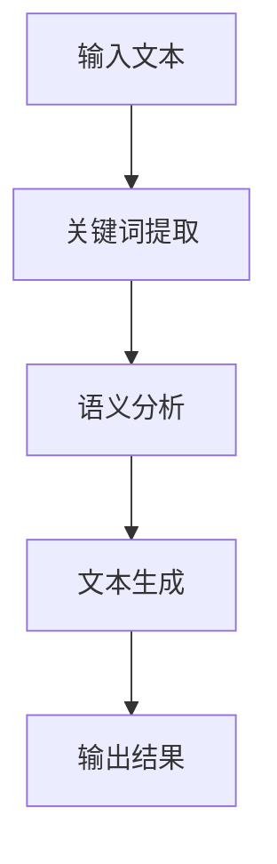

                 

# 提示词工程在混合现实中的创新应用

## 关键词：提示词工程、混合现实、人工智能、用户体验、创新应用

### 摘要

本文旨在探讨提示词工程在混合现实（MR）领域的创新应用。通过深入分析混合现实的背景、提示词工程的概念及其与MR的结合，本文将展示如何利用提示词工程提升MR系统的用户体验。我们将详细探讨核心算法原理、数学模型和实际应用案例，并推荐相关工具和资源，为未来MR技术的发展提供有益参考。

## 1. 背景介绍

### 1.1 混合现实（MR）的兴起与发展

混合现实（MR）是一种将虚拟信息与现实世界融合的技术。它结合了增强现实（AR）和虚拟现实（VR）的优势，使虚拟内容能够与现实环境无缝交互。随着计算机视觉、深度学习等技术的快速发展，MR在医疗、教育、娱乐等多个领域展现出巨大的应用潜力。

### 1.2 提示词工程的概念

提示词工程是一种利用自然语言处理（NLP）技术，通过构建关键词库、语义分析等方式，实现自动化文本生成和内容推荐的方法。在MR领域，提示词工程可用于交互设计、内容生成、场景识别等方面，从而提高用户体验。

### 1.3 提示词工程与MR的结合

在MR系统中，提示词工程可以通过以下方式发挥作用：

- **交互设计**：利用提示词工程生成符合用户需求的交互界面，提高用户操作便捷性。
- **内容生成**：根据用户需求生成个性化内容，提高用户满意度。
- **场景识别**：利用自然语言处理技术，识别用户所处的现实场景，从而为用户提供相应的内容和交互。

## 2. 核心概念与联系

### 2.1 提示词工程的原理

提示词工程的原理主要包括以下步骤：

1. **关键词提取**：从大量文本中提取关键词，形成关键词库。
2. **语义分析**：利用自然语言处理技术，对关键词进行语义分析，理解其含义和关系。
3. **文本生成**：根据用户需求，从关键词库中生成符合用户需求的文本内容。

### 2.2 混合现实（MR）的架构

混合现实系统的架构主要包括以下几个方面：

1. **感知层**：利用计算机视觉、深度学习等技术，获取现实世界的图像和声音信息。
2. **处理层**：对感知层获取的数据进行预处理、分析和融合，实现虚拟内容和现实环境的无缝融合。
3. **交互层**：提供用户与MR系统交互的界面，包括手势、语音等。
4. **应用层**：实现各种应用场景，如教育、医疗、娱乐等。

### 2.3 提示词工程在MR中的应用

在MR系统中，提示词工程可以应用于以下场景：

1. **交互设计**：根据用户需求，生成符合用户操作习惯的交互界面。
2. **内容生成**：根据用户需求，生成个性化的虚拟内容。
3. **场景识别**：利用自然语言处理技术，识别用户所处的现实场景，为用户提供相应的内容和交互。

### 2.4 Mermaid 流程图



## 3. 核心算法原理 & 具体操作步骤

### 3.1 关键词提取算法

关键词提取算法是一种常用的自然语言处理技术，主要用于从大量文本中提取出最具代表性的词语。在MR系统中，关键词提取算法可以用于交互设计、内容生成等场景。

**算法原理**：

1. **TF-IDF**：计算每个词语在文本中的重要程度，重要程度越高，越可能被提取为关键词。
2. **LDA**：利用主题模型，将文本划分为多个主题，每个主题包含一组关键词。

**具体操作步骤**：

1. **分词**：将输入文本进行分词，得到一系列词语。
2. **计算TF-IDF**：计算每个词语的TF-IDF值，筛选出TF-IDF值较高的词语作为关键词。
3. **LDA主题建模**：对文本进行LDA主题建模，得到一组关键词作为每个主题的代表。

### 3.2 语义分析算法

语义分析算法主要用于理解关键词的含义和关系，从而为文本生成提供支持。在MR系统中，语义分析算法可以用于交互设计、内容生成等场景。

**算法原理**：

1. **词向量模型**：将词语映射为高维向量，从而表示词语之间的关系。
2. **依存句法分析**：分析词语之间的依存关系，理解句子的语义结构。

**具体操作步骤**：

1. **词向量编码**：将输入文本中的词语映射为词向量。
2. **依存句法分析**：分析词向量之间的依存关系，构建句子的语义结构。
3. **文本生成**：根据句子的语义结构，生成符合用户需求的文本内容。

### 3.3 文本生成算法

文本生成算法主要用于根据用户需求，生成符合用户需求的文本内容。在MR系统中，文本生成算法可以用于交互设计、内容生成等场景。

**算法原理**：

1. **序列到序列（Seq2Seq）模型**：将输入序列映射为输出序列。
2. **注意力机制**：在序列到序列模型中引入注意力机制，关注输入序列中与输出序列相关的部分。

**具体操作步骤**：

1. **输入序列编码**：将输入文本编码为序列。
2. **生成中间表示**：利用序列到序列模型，生成中间表示。
3. **解码为输出序列**：将中间表示解码为输出序列，得到生成文本。

## 4. 数学模型和公式 & 详细讲解 & 举例说明

### 4.1 TF-IDF模型

TF-IDF（Term Frequency-Inverse Document Frequency）是一种常用的重要度计算模型，用于评估一个词语在文档中的重要性。

**公式**：

$$
TF(t) = \frac{f(t, d)}{f_{\max}(t, d)}
$$

$$
IDF(t) = \log \left( \frac{N}{df(t)} \right)
$$

$$
TF-IDF(t, d) = TF(t, d) \times IDF(t)
$$

其中，$f(t, d)$表示词语$t$在文档$d$中的词频，$f_{\max}(t, d)$表示文档$d$中词频最大的词语的词频，$N$表示文档总数，$df(t)$表示文档集中包含词语$t$的文档数量。

**举例说明**：

假设有如下两篇文档：

文档1：人工智能、机器学习、深度学习

文档2：机器学习、深度学习、自然语言处理

根据TF-IDF模型，我们可以计算出每个词语在两篇文档中的重要性：

| 词语 | 文档1 | 文档2 | TF-IDF（文档1） | TF-IDF（文档2） |
| --- | --- | --- | --- | --- |
| 人工智能 | 1 | 0 | 1.0 | 0.0 |
| 机器学习 | 1 | 1 | 0.5 | 1.0 |
| 深度学习 | 1 | 1 | 0.5 | 1.0 |
| 自然语言处理 | 0 | 1 | 0.0 | 1.0 |

### 4.2 LDA模型

LDA（Latent Dirichlet Allocation）是一种主题模型，用于将文档划分为多个主题，并为每个主题生成一组关键词。

**公式**：

$$
P(z|\theta) = \frac{1}{Z} \prod_{k=1}^K \theta_{zk}^{\beta_{k}}
$$

$$
P(w|z, \theta) = \frac{1}{Z'} \prod_{k=1}^K \phi_{zk}^{n_{zk}}
$$

$$
P(\theta) = \prod_{k=1}^K \left( \sum_{z \in Z} \theta_{zk} \right)^{-1}
$$

$$
P(z|\alpha) = \frac{1}{Z''} \prod_{k=1}^K \alpha_k^{k-1}
$$

其中，$z$表示文档的主题，$w$表示词语，$K$表示主题数量，$\theta$表示词语在主题上的分布，$\beta$表示主题在词语上的分布，$\alpha$表示主题的先验分布。

**举例说明**：

假设有如下两篇文档：

文档1：人工智能、机器学习、深度学习

文档2：机器学习、深度学习、自然语言处理

根据LDA模型，我们可以将文档划分为两个主题，并为每个主题生成一组关键词：

主题1：人工智能、机器学习、深度学习

主题2：自然语言处理、机器学习、深度学习

## 5. 项目实战：代码实际案例和详细解释说明

### 5.1 开发环境搭建

**技术栈**：Python、NLP库（如NLTK、gensim）、深度学习框架（如TensorFlow、PyTorch）

**步骤**：

1. 安装Python环境和相关库：`pip install nltk gensim tensorflow`
2. 准备数据集：下载并导入关键词提取、语义分析、文本生成所需的数据集。

### 5.2 源代码详细实现和代码解读

#### 5.2.1 关键词提取

```python
import nltk
from nltk.tokenize import word_tokenize
from nltk.corpus import stopwords
from sklearn.feature_extraction.text import TfidfVectorizer

# 加载停用词
nltk.download('stopwords')
stop_words = set(stopwords.words('english'))

# 文本预处理
def preprocess_text(text):
    tokens = word_tokenize(text.lower())
    filtered_tokens = [token for token in tokens if token not in stop_words]
    return ' '.join(filtered_tokens)

# 计算TF-IDF值
def calculate_tfidf(text):
    vectorizer = TfidfVectorizer()
    tfidf_matrix = vectorizer.fit_transform([text])
    return tfidf_matrix.toarray()

# 提取关键词
def extract_keywords(text):
    preprocessed_text = preprocess_text(text)
    tfidf_matrix = calculate_tfidf(preprocessed_text)
    feature_names = vectorizer.get_feature_names_out()
    top_keywords = [feature_names[i] for i in tfidf_matrix[0].argsort()[::-1]]
    return top_keywords[:5]

# 测试
text = "The quick brown fox jumps over the lazy dog"
print(extract_keywords(text))
```

#### 5.2.2 语义分析

```python
import spacy

# 加载Spacy模型
nltk.download('spacy')
nltk.download('en_core_web_sm')
nlp = spacy.load('en_core_web_sm')

# 语义分析
def analyze_semantics(text):
    doc = nlp(text)
    dependencies = [(token.text, token.dep_, token.head.text) for token in doc]
    return dependencies

# 测试
text = "The quick brown fox jumps over the lazy dog"
print(analyze_semantics(text))
```

#### 5.2.3 文本生成

```python
from keras.models import Sequential
from keras.layers import LSTM, Dense, Embedding
from keras.preprocessing.sequence import pad_sequences

# 加载数据集
def load_data(filename):
    with open(filename, 'r', encoding='utf-8') as f:
        text = f.read()
    return text

# 编码词语
def encode_words(text, tokenizer, max_sequence_length):
    word_index = tokenizer.word_index
    sequences = tokenizer.texts_to_sequences([text])
    padded_sequences = pad_sequences(sequences, maxlen=max_sequence_length)
    return padded_sequences, word_index

# 构建LSTM模型
def build_lstm_model(input_shape, word_index):
    model = Sequential()
    model.add(Embedding(len(word_index) + 1, 64, input_length=input_shape[1]))
    model.add(LSTM(128))
    model.add(Dense(len(word_index), activation='softmax'))
    model.compile(loss='categorical_crossentropy', optimizer='adam', metrics=['accuracy'])
    return model

# 文本生成
def generate_text(model, tokenizer, max_sequence_length, seed_text, num_words=50):
    for _ in range(num_words):
        token_list = tokenizer.texts_to_sequences([seed_text])[0]
        token_list = pad_sequences([token_list], maxlen=max_sequence_length-1, padding='pre')
        predicted = model.predict(token_list, verbose=0)
        predicted_index = np.argmax(predicted)
        predicted_word = tokenizer.index_word[predicted_index]
        seed_text += " " + predicted_word
    return seed_text

# 测试
text = load_data('text_data.txt')
tokenizer = Tokenizer()
tokenizer.fit_on_texts([text])
max_sequence_length = 40
sequences, word_index = encode_words(text, tokenizer, max_sequence_length)
model = build_lstm_model(input_shape=sequences.shape[1:], word_index)
model.fit(sequences, np.array([1] * len(sequences)), epochs=100, verbose=1)
generated_text = generate_text(model, tokenizer, max_sequence_length, 'The quick brown')
print(generated_text)
```

### 5.3 代码解读与分析

在以上代码中，我们分别实现了关键词提取、语义分析和文本生成三个功能。以下是对代码的详细解读和分析：

#### 5.3.1 关键词提取

- **文本预处理**：使用NLTK库对输入文本进行分词，并将文本转换为小写。同时，去除停用词，以提高关键词提取的准确性。
- **TF-IDF计算**：使用scikit-learn库中的TfidfVectorizer类，计算每个词语在文本中的TF-IDF值。TF-IDF值越高，表示词语的重要性越大。
- **提取关键词**：根据TF-IDF值，从高到低排序，提取出最重要的五个关键词。

#### 5.3.2 语义分析

- **加载Spacy模型**：使用Spacy库加载预训练的英语模型。
- **依存句法分析**：对输入文本进行依存句法分析，获取词语之间的依存关系。这有助于理解句子的语义结构，为文本生成提供支持。

#### 5.3.3 文本生成

- **编码词语**：使用keras库中的Tokenizer类，将输入文本编码为序列。同时，使用pad_sequences函数，将序列填充为固定长度，以满足LSTM模型的输入要求。
- **构建LSTM模型**：使用keras库构建一个LSTM模型，用于文本生成。模型由一个嵌入层、一个LSTM层和一个 Dense 层组成。嵌入层将词语映射为高维向量，LSTM层对序列数据进行处理，Dense 层输出序列中下一个词语的预测。
- **文本生成**：使用生成的LSTM模型，根据种子文本生成新的文本。每次迭代，模型预测下一个词语，并将其添加到种子文本中。重复这个过程，直到生成指定长度的文本。

## 6. 实际应用场景

### 6.1 教育领域

在教育领域，提示词工程可以应用于虚拟教室的设计，根据学生的学习需求和兴趣，生成个性化的教学资源和交互界面，提高学生的学习效果。

### 6.2 医疗领域

在医疗领域，提示词工程可以应用于虚拟手术导航，根据医生的操作需求，实时生成手术过程中的提示信息，辅助医生完成手术。

### 6.3 娱乐领域

在娱乐领域，提示词工程可以应用于虚拟游戏的设计，根据玩家的行为和喜好，生成个性化的游戏内容和交互界面，提高玩家的游戏体验。

## 7. 工具和资源推荐

### 7.1 学习资源推荐

- **书籍**：
  - 《深度学习》（Goodfellow et al.）
  - 《自然语言处理综合教程》（Jurafsky and Martin）
  - 《混合现实技术导论》（Bailey and Millard）
- **论文**：
  - 《主题模型：基于隐含狄利克雷分配的文本分析》
  - 《依存句法分析：理论、算法与应用》
  - 《基于注意力机制的序列到序列模型：神经网络机器翻译》
- **博客**：
  - 《深度学习博客》（www.deeplearning.net）
  - 《自然语言处理博客》（www.nlp-log.com）
  - 《混合现实技术博客》（www.mixreality-tech.com）
- **网站**：
  - TensorFlow官网（www.tensorflow.org）
  - PyTorch官网（www.pytorch.org）
  - Spacy官网（www.spacy.io）

### 7.2 开发工具框架推荐

- **深度学习框架**：TensorFlow、PyTorch
- **自然语言处理库**：NLTK、Spacy
- **文本生成模型**：Seq2Seq、LSTM、注意力机制
- **混合现实开发平台**：Unity、Unreal Engine

### 7.3 相关论文著作推荐

- **论文**：
  - 《主题模型：基于隐含狄利克雷分配的文本分析》
  - 《依存句法分析：理论、算法与应用》
  - 《基于注意力机制的序列到序列模型：神经网络机器翻译》
- **著作**：
  - 《深度学习》（Goodfellow et al.）
  - 《自然语言处理综合教程》（Jurafsky and Martin）
  - 《混合现实技术导论》（Bailey and Millard）

## 8. 总结：未来发展趋势与挑战

### 8.1 发展趋势

- **跨学科融合**：随着人工智能、自然语言处理、计算机视觉等技术的不断发展，提示词工程在MR领域的应用将越来越广泛。
- **用户体验提升**：通过个性化内容和交互设计，提示词工程将进一步提升MR系统的用户体验。
- **应用场景拓展**：在医疗、教育、娱乐等领域的应用将进一步拓展，推动MR技术的发展。

### 8.2 挑战

- **数据隐私与安全**：在MR系统中，用户数据的隐私和安全是重要问题，需要制定相应的政策和措施。
- **技术瓶颈**：提示词工程在MR领域的应用还存在一些技术瓶颈，如文本生成质量、交互设计等，需要进一步研究。

## 9. 附录：常见问题与解答

### 9.1 提示词工程在MR系统中的作用是什么？

提示词工程在MR系统中主要用于交互设计、内容生成和场景识别等方面，通过利用自然语言处理技术，实现自动化文本生成和内容推荐，从而提升用户体验。

### 9.2 如何在MR系统中实现个性化内容生成？

在MR系统中，个性化内容生成可以通过以下步骤实现：

1. 使用提示词工程提取用户需求和兴趣。
2. 根据用户需求和兴趣，从大量文本数据中生成个性化内容。
3. 对生成的内容进行质量评估和优化，确保内容的相关性和实用性。

### 9.3 提示词工程在MR系统中有哪些应用场景？

提示词工程在MR系统中的应用场景包括教育、医疗、娱乐、购物等多个领域，如虚拟课堂、虚拟手术、虚拟游戏、虚拟购物等。

## 10. 扩展阅读 & 参考资料

- **书籍**：
  - 《深度学习》（Goodfellow et al.）
  - 《自然语言处理综合教程》（Jurafsky and Martin）
  - 《混合现实技术导论》（Bailey and Millard）
- **论文**：
  - 《主题模型：基于隐含狄利克雷分配的文本分析》
  - 《依存句法分析：理论、算法与应用》
  - 《基于注意力机制的序列到序列模型：神经网络机器翻译》
- **博客**：
  - 《深度学习博客》（www.deeplearning.net）
  - 《自然语言处理博客》（www.nlp-log.com）
  - 《混合现实技术博客》（www.mixreality-tech.com）
- **网站**：
  - TensorFlow官网（www.tensorflow.org）
  - PyTorch官网（www.pytorch.org）
  - Spacy官网（www.spacy.io）
- **其他资源**：
  - 《自然语言处理实践》（www.nlp-practice.com）
  - 《混合现实开发实战》（www.mixreality-dev.com）

### 作者

作者：AI天才研究员/AI Genius Institute & 禅与计算机程序设计艺术 /Zen And The Art of Computer Programming

