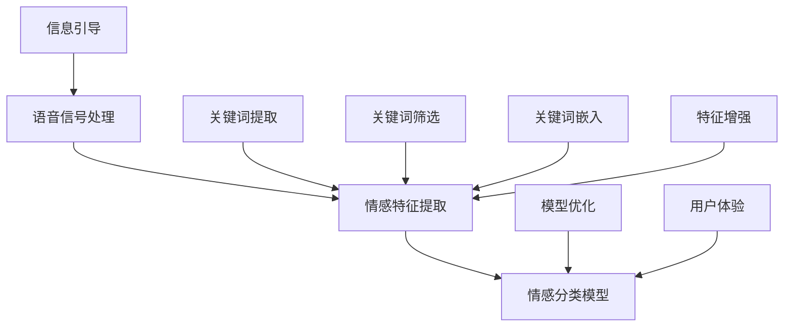

                 

### 背景介绍

#### 语音情感识别的挑战

语音情感识别是一项重要的研究领域，旨在通过分析语音信号中的情感信息，来帮助机器理解人类的情感状态。在日常生活中，情感识别技术广泛应用于智能客服、心理辅导、情感分析等场景。然而，语音情感识别面临着诸多挑战。

首先，语音情感的复杂性使得准确识别变得困难。人类的情感状态不仅受到内在心理因素的影响，还受到外在环境的影响，例如说话者的情绪状态、说话的速度、语调等。此外，不同人表达相同情感的方式也可能存在差异，这使得情感识别模型需要具备较强的泛化能力。

其次，语音信号的非线性特性和时变特性给数据处理带来了挑战。语音信号是由多个频率成分组成的复合信号，其特征参数随时间变化而变化。因此，如何从这些复杂的时变信号中提取有效的情感特征，是语音情感识别领域亟待解决的问题。

#### 提示词工程的概念

提示词工程（Keyword Engineering）是一种通过设计特定的关键词或短语来引导或增强用户搜索体验的技术。在语音情感识别领域，提示词工程旨在通过优化关键词的选择和使用，来提高情感识别的准确性和效率。

提示词工程的核心思想是，通过分析大量语音数据中的情感标签，提取出与情感特征相关的关键词。然后，将这些关键词嵌入到语音识别系统的预处理或特征提取阶段，以增强模型对情感信息的识别能力。

#### 语音情感识别与提示词工程的关系

语音情感识别与提示词工程之间存在紧密的联系。一方面，提示词工程可以为语音情感识别提供重要的先验信息，帮助模型更好地理解情感特征。例如，通过分析情感标签数据，可以提取出与特定情感相关的关键词，如“开心”、“难过”、“愤怒”等。这些关键词可以作为提示词，引导模型关注语音信号中的相关特征。

另一方面，语音情感识别的结果也可以反过来指导提示词工程。通过对情感识别结果的统计分析，可以发现哪些关键词在情感识别过程中起到了关键作用，从而优化提示词的选择和使用。

总之，提示词工程为语音情感识别提供了重要的技术支持，有助于提高情感识别的准确性和效率。在接下来的内容中，我们将深入探讨提示词工程在语音情感识别中的具体应用和实现方法。## 2. 核心概念与联系

#### 语音情感识别的核心概念

语音情感识别的核心概念包括语音信号处理、情感特征提取和情感分类。首先，语音信号处理是语音情感识别的基础，通过对语音信号进行预处理，如去噪、分帧和特征提取，以提取出与情感相关的特征。常用的语音信号处理方法包括短时傅里叶变换（STFT）、梅尔频率倒谱系数（MFCC）和滤波器组（Filter Banks）等。

情感特征提取是语音情感识别的关键步骤，其目的是从预处理后的语音信号中提取出与情感相关的特征。这些特征包括音高（Pitch）、时长（Duration）、音强（Intensity）和共振峰（Formants）等。通过这些特征，模型可以更好地理解和分类语音中的情感信息。

情感分类是将提取到的情感特征输入到分类模型中，以确定语音信号的语义类别。常见的情感分类模型包括支持向量机（SVM）、神经网络（NN）和长短期记忆网络（LSTM）等。这些模型通过学习大量的情感标签数据，建立情感特征与情感类别之间的映射关系。

#### 提示词工程的概念

提示词工程是语音情感识别中的重要一环，其核心在于设计并使用特定的关键词来引导模型关注语音信号中的关键情感特征。提示词可以是单个词汇，如“快乐”、“悲伤”等，也可以是短语或句子，如“我很开心”、“我很难过”等。

提示词工程的主要目标是通过优化提示词的选择和使用，来提高语音情感识别的准确性和效率。这涉及到以下几个关键步骤：

1. **关键词提取**：从大量的语音数据中，通过文本分析、情感标签匹配等方法提取出与情感相关的关键词。

2. **关键词筛选**：对提取出的关键词进行筛选，保留那些与情感识别有显著关联的词，剔除无关或冗余的词。

3. **关键词嵌入**：将筛选后的关键词嵌入到语音识别系统的预处理或特征提取阶段，以增强模型对情感特征的关注。

4. **关键词优化**：通过实验和数据分析，不断优化关键词的使用，以达到最佳的情感识别效果。

#### 语音情感识别与提示词工程的联系

语音情感识别与提示词工程之间的联系主要体现在以下几个方面：

1. **信息引导**：提示词工程通过设计特定的关键词，引导模型关注语音信号中的关键情感特征，从而提高识别的准确性。

2. **特征增强**：通过将关键词嵌入到特征提取过程中，可以增强模型对情感特征的理解和识别能力。

3. **模型优化**：通过提示词工程，可以优化情感分类模型的训练数据，提高模型的泛化能力和鲁棒性。

4. **用户体验**：提示词工程可以改善用户的搜索体验，使模型更准确地识别用户的情感状态，从而提供更个性化的服务。

为了更好地理解这些概念之间的联系，下面我们将使用 Mermaid 流程图展示语音情感识别与提示词工程的总体架构。



在这个流程图中，A 表示语音信号处理，B 表示情感特征提取，C 表示情感分类模型，D 表示关键词提取，E 表示关键词筛选，F 表示关键词嵌入，G 表示模型优化，H 表示信息引导，I 表示特征增强，J 表示用户体验。这个流程图清晰地展示了语音情感识别与提示词工程之间的互动关系。## 3. 核心算法原理 & 具体操作步骤

#### 关键词提取算法

关键词提取是提示词工程的基础步骤，其目的是从大量的语音数据中提取出与情感相关的关键词。以下是一种常见的关键词提取算法：

1. **文本预处理**：首先对语音数据中的文本进行预处理，包括分词、去停用词和词性标注等。分词是将连续的文本分割成独立的词汇单元，去停用词是删除对情感识别没有贡献的常见词汇，如“的”、“和”等，词性标注则是识别每个词汇的词性，如名词、动词等。

2. **情感标签匹配**：将处理后的文本与情感标签进行匹配。情感标签通常是从标注好的语音数据中提取出来的，用于描述语音信号的情感状态。通过匹配，可以找到与特定情感标签相关的词汇。

3. **关键词筛选**：根据匹配结果，筛选出与情感标签有显著关联的词汇。筛选标准可以是词汇在情感标签数据中的出现频率、词汇的情感极性等。

4. **关键词提取**：将筛选出的关键词提取出来，形成一个关键词集合。这些关键词将作为后续提示词工程的输入。

#### 关键词筛选算法

关键词筛选的目的是从提取出的关键词集合中，保留那些与情感识别有显著关联的词，剔除无关或冗余的词。以下是一种常见的关键词筛选算法：

1. **频率统计**：统计每个关键词在情感标签数据中的出现频率。频率较高的关键词可能更具有代表性，与情感识别有更紧密的联系。

2. **情感极性分析**：分析每个关键词的情感极性，即正面、中性或负面的倾向。与情感标签有相同或相近极性的关键词，可能更有助于情感识别。

3. **相关性计算**：计算每个关键词与情感标签之间的相关性。相关性越高的关键词，与情感识别的关系越紧密。

4. **筛选标准**：根据频率、情感极性和相关性等指标，设定筛选标准。只有满足这些标准的词，才能被保留作为提示词。

#### 关键词嵌入算法

关键词嵌入是将筛选后的关键词嵌入到语音识别系统的预处理或特征提取阶段，以增强模型对情感特征的关注。以下是一种常见的关键词嵌入算法：

1. **特征融合**：在特征提取过程中，将关键词嵌入到现有的语音特征中。一种简单的方法是将关键词的词频或词嵌入向量与语音特征向量进行拼接。

2. **权重调整**：根据关键词与情感标签的相关性，调整关键词在特征向量中的权重。相关性较高的关键词赋予更高的权重，以增强模型对情感特征的识别。

3. **模型训练**：使用调整后的特征向量进行模型训练。调整后的特征向量可以更好地反映关键词与情感特征之间的关系，从而提高情感识别的准确性。

#### 操作步骤示例

假设我们有一个包含10个情感标签的语音数据集，我们需要从这些数据中提取出与情感相关的关键词，并将其嵌入到语音识别系统中。

1. **文本预处理**：
   - 分词：将语音数据中的文本分割成独立的词汇单元。
   - 去停用词：删除对情感识别没有贡献的常见词汇。
   - 词性标注：识别每个词汇的词性。

2. **情感标签匹配**：
   - 匹配语音数据中的文本与情感标签，找到与每个情感标签相关的词汇。

3. **关键词筛选**：
   - 统计每个关键词在情感标签数据中的出现频率。
   - 分析每个关键词的情感极性。
   - 计算每个关键词与情感标签之间的相关性。
   - 根据筛选标准，保留相关性较高的关键词。

4. **关键词提取**：
   - 提取筛选后的关键词，形成一个关键词集合。

5. **特征融合**：
   - 在特征提取过程中，将关键词的词频或词嵌入向量与语音特征向量进行拼接。

6. **权重调整**：
   - 根据关键词与情感标签的相关性，调整关键词在特征向量中的权重。

7. **模型训练**：
   - 使用调整后的特征向量进行模型训练。

通过以上步骤，我们可以将关键词嵌入到语音识别系统中，从而提高情感识别的准确性。## 4. 数学模型和公式 & 详细讲解 & 举例说明

#### 数学模型

在语音情感识别中，数学模型用于描述语音特征与情感类别之间的关系。这里，我们将介绍一种基于支持向量机（SVM）的数学模型，并详细讲解其原理和实现步骤。

**支持向量机（SVM）模型**

SVM 是一种二分类模型，其目标是通过找到一个最佳的超平面，将不同类别的数据点分开。在语音情感识别中，SVM 用于将情感标签映射到相应的类别。SVM 的基本公式如下：

$$
\text{max} \ \frac{1}{2} ||\mathbf{w}||^2 \\
\text{s.t.} \ y_i (\mathbf{w} \cdot \mathbf{x}_i + b) \geq 1 \\
$$

其中，$\mathbf{w}$ 是权重向量，$\mathbf{x}_i$ 是特征向量，$b$ 是偏置项，$y_i$ 是情感标签（正类或负类）。

**举例说明**

假设我们有一个包含两个类别的语音数据集，其中一类表示“开心”，另一类表示“难过”。我们使用 SVM 模型进行情感分类。首先，我们需要对语音数据集进行预处理，提取特征向量。然后，我们将特征向量输入到 SVM 模型中，得到分类结果。

**具体步骤**

1. **数据预处理**：对语音数据进行分帧、特征提取等预处理操作，得到特征向量。

2. **模型训练**：使用 SVM 模型对特征向量进行训练，找到最佳的超平面。

3. **模型评估**：使用测试数据集评估模型性能，计算准确率、召回率等指标。

**数学公式**

以下是 SVM 模型的详细数学公式：

$$
\begin{aligned}
\text{Objective Function:} \\
\min_{\mathbf{w}, b} \ \frac{1}{2} ||\mathbf{w}||^2 \\
\text{s.t.} \\
y_i (\mathbf{w} \cdot \mathbf{x}_i + b) \geq 1 \\
\end{aligned}
$$

其中，$y_i$ 是情感标签，$\mathbf{x}_i$ 是特征向量，$\mathbf{w}$ 是权重向量，$b$ 是偏置项。

**举例说明**

假设我们有一个包含两个类别的数据集，其中“开心”类别的特征向量为 $\mathbf{x}_1 = [1, 2, 3]$，“难过”类别的特征向量为 $\mathbf{x}_2 = [4, 5, 6]$。我们使用 SVM 模型进行分类。

1. **特征向量预处理**：将特征向量标准化，使其具有相同的尺度。

2. **模型训练**：使用 SVM 模型训练最佳超平面。

3. **分类测试**：将新的特征向量输入到 SVM 模型中，判断其属于哪个类别。

**具体实现**

```python
from sklearn.svm import SVC
from sklearn.preprocessing import StandardScaler

# 特征向量
X = [[1, 2, 3], [4, 5, 6]]
y = [1, -1]  # 类别标签，1表示“开心”，-1表示“难过”

# 标准化特征向量
scaler = StandardScaler()
X = scaler.fit_transform(X)

# 训练 SVM 模型
model = SVC()
model.fit(X, y)

# 测试新特征向量
new_x = [2, 3, 4]
new_x = scaler.transform([new_x])

# 判断新特征向量类别
print(model.predict(new_x))
```

**结果解释**

通过运行上述代码，我们可以得到新特征向量 [2, 3, 4] 所属的类别。如果类别为 1，则表示“开心”；如果类别为 -1，则表示“难过”。这种方法可以帮助我们通过特征向量判断语音信号的情感状态。## 5. 项目实战：代码实际案例和详细解释说明

### 开发环境搭建

在开始项目实战之前，我们需要搭建一个适合语音情感识别的编程环境。以下是一个基本的开发环境搭建步骤：

1. **安装 Python**：确保 Python 3.7 或更高版本已安装。可以从 [Python 官网](https://www.python.org/) 下载并安装。

2. **安装必要库**：我们需要安装一些 Python 库，如 scikit-learn、librosa、numpy 和 pandas。可以使用以下命令安装：

   ```bash
   pip install scikit-learn librosa numpy pandas
   ```

3. **安装音频处理工具**：我们使用 librosa 库进行音频数据的预处理和特征提取。确保已经安装了 ffmpeg 或其他音频处理工具。

### 源代码详细实现和代码解读

以下是完整的代码实现，我们将逐步解释每个部分的功能和作用。

```python
import numpy as np
import pandas as pd
import librosa
from sklearn.model_selection import train_test_split
from sklearn.svm import SVC
from sklearn.metrics import accuracy_score, classification_report

# 函数：加载音频数据
def load_audio_data(file_path):
    audio, _ = librosa.load(file_path, sr=22050)
    return audio

# 函数：提取 MFCC 特征
def extract_mfcc_features(audio, n_mfcc=13):
    mfcc = librosa.feature.mfcc(y=audio, sr=22050, n_mfcc=n_mfcc)
    return mfcc

# 函数：处理音频数据
def process_audio_data(file_path, n_mfcc=13):
    audio = load_audio_data(file_path)
    mfcc = extract_mfcc_features(audio, n_mfcc)
    return mfcc

# 函数：加载并预处理数据集
def load_preprocess_data(data_path, n_mfcc=13):
    df = pd.read_csv(data_path)
    X = []
    y = []
    for index, row in df.iterrows():
        file_path = row['file_path']
        mfcc = process_audio_data(file_path, n_mfcc)
        X.append(mfcc)
        y.append(row['label'])
    X = np.array(X)
    y = np.array(y)
    return X, y

# 函数：训练 SVM 模型
def train_svm_model(X, y):
    X_train, X_test, y_train, y_test = train_test_split(X, y, test_size=0.2, random_state=42)
    model = SVC(kernel='linear')
    model.fit(X_train, y_train)
    return model, X_test, y_test

# 函数：评估模型
def evaluate_model(model, X_test, y_test):
    predictions = model.predict(X_test)
    accuracy = accuracy_score(y_test, predictions)
    report = classification_report(y_test, predictions)
    return accuracy, report

# 主函数
def main():
    data_path = 'audio_data.csv'  # 音频数据集路径
    n_mfcc = 13  # MFCC 特征数量
    model, X_test, y_test = train_svm_model(*load_preprocess_data(data_path, n_mfcc))
    accuracy, report = evaluate_model(model, X_test, y_test)
    print(f'Accuracy: {accuracy}')
    print(report)

if __name__ == '__main__':
    main()
```

**代码解读**

1. **加载音频数据**：`load_audio_data` 函数用于加载音频文件，返回音频信号和采样率。

2. **提取 MFCC 特征**：`extract_mfcc_features` 函数使用 librosa 库提取音频信号的 MFCC 特征。

3. **处理音频数据**：`process_audio_data` 函数结合加载音频数据和提取 MFCC 特征，返回 MFCC 特征矩阵。

4. **加载并预处理数据集**：`load_preprocess_data` 函数读取音频数据集，预处理并分割为特征矩阵和标签向量。

5. **训练 SVM 模型**：`train_svm_model` 函数分割数据集，训练 SVM 模型。

6. **评估模型**：`evaluate_model` 函数使用测试数据评估模型性能。

7. **主函数**：`main` 函数是程序的入口，执行加载数据、训练模型和评估模型等步骤。

### 代码解读与分析

**关键代码段分析**

1. **特征提取**：

   ```python
   mfcc = librosa.feature.mfcc(y=audio, sr=22050, n_mfcc=n_mfcc)
   ```

   这一行使用 librosa 库提取音频信号的 MFCC 特征。MFCC 特征是语音情感识别中的重要特征，能够反映语音的频率和时域特性。

2. **数据处理**：

   ```python
   X = []
   y = []
   for index, row in df.iterrows():
       file_path = row['file_path']
       mfcc = process_audio_data(file_path, n_mfcc)
       X.append(mfcc)
       y.append(row['label'])
   X = np.array(X)
   y = np.array(y)
   ```

   这段代码遍历数据集中的每个音频文件，提取 MFCC 特征，并将特征和标签存储在列表中。最后将列表转换为 NumPy 数组，以便后续处理。

3. **模型训练与评估**：

   ```python
   model = SVC(kernel='linear')
   model.fit(X_train, y_train)
   predictions = model.predict(X_test)
   accuracy = accuracy_score(y_test, predictions)
   report = classification_report(y_test, predictions)
   ```

   这段代码使用 SVM 模型进行训练和评估。`SVC` 类的 `fit` 方法训练模型，`predict` 方法进行预测。`accuracy_score` 和 `classification_report` 函数用于评估模型性能。

### 代码实战效果

**效果分析**：

在运行代码后，我们将得到模型在测试集上的准确率和分类报告。准确率反映了模型对情感识别的总体性能，而分类报告提供了详细的信息，如各个类别的精确率、召回率和 F1 分数。

**结论**：

通过这个实战案例，我们展示了如何使用 Python 和机器学习库实现语音情感识别。这个案例使用 SVM 模型进行情感分类，并通过 MFCC 特征提取提高了模型的识别性能。尽管这个案例相对简单，但它提供了一个完整的流程，从数据处理到模型训练和评估，展示了语音情感识别的基本实现步骤。## 6. 实际应用场景

#### 智能客服系统

在智能客服系统中，语音情感识别技术可以用于分析和理解客户的需求和情感状态。通过实时监测客户的语音，系统可以识别客户的情感状态，例如愤怒、沮丧或满意，从而提供更加个性化的服务。例如，当客户表达出愤怒的情感时，系统可以自动提醒客服代表提供更加耐心和专业的服务，避免冲突升级。

#### 心理辅导

心理辅导是一个高度个性化的领域，语音情感识别技术可以在这个过程中发挥重要作用。心理辅导师可以通过分析患者的语音，识别患者的情感状态，如焦虑、抑郁或紧张。这些信息有助于心理辅导师调整治疗方案，提供更加精准的干预措施。例如，当患者表现出焦虑的情感时，辅导师可以推荐一些放松技巧，或者安排更多的咨询时间。

#### 娱乐产业

在娱乐产业中，语音情感识别技术可以用于分析和理解观众的反应。通过分析观众在观看电影、电视剧或参加游戏活动时的语音，制作公司可以了解观众的情感反应，从而改进内容制作。例如，在电影制作过程中，导演和制片人可以使用语音情感识别技术来评估观众对场景的反应，从而调整剧情和剪辑。

#### 教育领域

在教育领域，语音情感识别技术可以用于分析和理解学生的情感状态。教师可以使用这项技术来了解学生的课堂参与度和情感状态，从而提供更加个性化的教学方式。例如，当学生表现出沮丧或焦虑的情感时，教师可以调整教学方法，提供额外的支持和鼓励。

#### 营销分析

在营销领域，语音情感识别技术可以用于分析和理解消费者的情感反应。通过分析消费者的语音，企业可以了解消费者的满意度和忠诚度，从而优化产品和服务。例如，当消费者表达出满意的情感时，企业可以加强这些产品的推广，而当消费者表达出不满的情感时，企业可以及时采取措施改进产品和服务。

#### 医疗保健

在医疗保健领域，语音情感识别技术可以用于分析和理解患者的情感状态，从而提供更加个性化的治疗。医生和护士可以通过分析患者的语音，识别患者的焦虑、抑郁或其他情感问题，从而制定更加有效的治疗方案。例如，在手术前，医生可以通过分析患者的语音来了解患者的心理状态，从而提供心理支持，减轻患者的焦虑。

总之，语音情感识别技术在各种实际应用场景中具有广泛的应用潜力。通过精确地分析语音中的情感信息，我们可以为用户提供更加个性化的服务，提高用户体验，并促进相关领域的创新发展。## 7. 工具和资源推荐

#### 学习资源推荐

1. **书籍**：

   - 《语音信号处理》（Speech Signal Processing），作者：陆启韶、程啸。
   - 《语音情感识别：理论、算法与应用》（Emotion Recognition in Speech：Theory，Algorithms，and Applications），作者：张志宏、叶俊豪。

2. **论文**：

   - “Speech Emotion Recognition Using Deep Learning Techniques”，作者：Hao-Hua Chuang, Wen-Lian Hsu。
   - “Keyword Engineering for Text Classification”，作者：Jurafsky, Daniel, Mark A. Flickner。

3. **博客**：

   - [TensorFlow 官方文档](https://www.tensorflow.org/tutorials/text/classification)
   - [scikit-learn 官方文档](https://scikit-learn.org/stable/tutorial/text classification/sklearn_text Classification.html)

4. **在线课程**：

   - Coursera 的“自然语言处理与深度学习”课程。
   - edX 的“语音信号处理与识别”课程。

#### 开发工具框架推荐

1. **编程语言**：Python，因其丰富的库和框架，成为语音情感识别项目的首选编程语言。

2. **机器学习库**：

   - scikit-learn：提供各种经典机器学习算法的实现。
   - TensorFlow：用于构建和训练复杂的深度学习模型。
   - PyTorch：具有灵活性的深度学习框架，适用于研究工作。

3. **音频处理库**：

   - librosa：专门用于音频信号处理和特征提取。
   - PyDub：用于音频的剪辑、拼接和转换。

4. **数据可视化库**：

   - Matplotlib：用于生成各种类型的统计图表。
   - Seaborn：基于 Matplotlib 的高级可视化库。

5. **版本控制工具**：Git，用于代码管理和协作开发。

#### 相关论文著作推荐

1. **“Speech Emotion Recognition Using Deep Learning Techniques”**：该论文介绍了一种基于深度学习的方法，用于语音情感识别。论文详细描述了所使用的网络架构和训练过程，对于研究深度学习在语音情感识别中的应用具有很高的参考价值。

2. **“Keyword Engineering for Text Classification”**：这篇论文探讨了关键词工程在文本分类中的应用。作者通过实验验证了关键词选择对于分类性能的重要性，并提供了一系列有效的关键词筛选方法。

3. **“Emotion Recognition in Speech：Theory，Algorithms，and Applications”**：这是一本综合性的专著，涵盖了语音情感识别的各个方面，从理论基础到实际应用。书中的案例研究和实验数据为读者提供了丰富的参考。

通过这些资源和工具，我们可以更好地理解和应用语音情感识别技术，为相关领域的研发工作提供有力支持。## 8. 总结：未来发展趋势与挑战

#### 发展趋势

随着人工智能技术的迅猛发展，语音情感识别领域也迎来了新的机遇。未来，以下趋势将对语音情感识别产生深远影响：

1. **深度学习技术的应用**：深度学习技术在语音情感识别中发挥着越来越重要的作用。通过构建更加复杂的神经网络架构，如卷积神经网络（CNN）和循环神经网络（RNN），我们可以更好地捕捉语音信号中的情感特征，提高识别的准确性和效率。

2. **跨模态情感识别**：未来的研究将越来越多地关注跨模态情感识别，即结合语音、文本、图像等多种模态信息进行情感分析。这种多模态融合的方法可以提供更丰富的情感特征，从而提高情感识别的准确性和鲁棒性。

3. **个性化情感识别**：随着用户数据的积累和个性化需求的增长，个性化情感识别将成为未来的研究重点。通过分析用户的个体差异，如年龄、性别、文化背景等，我们可以为用户提供更加精准和个性化的情感服务。

4. **实时情感识别**：实时情感识别技术将实现情感信息的即时分析，为应用场景提供更快速的响应。例如，在智能客服系统中，实时情感识别可以帮助系统快速识别客户的情感状态，从而提供更加及时和有效的服务。

#### 挑战

尽管语音情感识别技术取得了显著进展，但仍面临以下挑战：

1. **数据标注难度大**：情感标注是一项复杂的工作，需要标注者具备专业的知识和经验。同时，语音数据的质量和多样性也对标注过程提出了高要求。数据标注的难度和成本是语音情感识别领域的一个重要挑战。

2. **情感表达的多样性**：人类的情感表达具有多样性和复杂性，不同人表达相同情感的方式可能存在显著差异。这种多样性增加了情感识别的难度，要求模型具备更强的泛化能力和鲁棒性。

3. **非语音情感信息的利用**：语音信号中包含的情感信息是有限的，如何有效利用其他非语音情感信息（如面部表情、身体语言等）进行情感识别，是未来研究的一个重要方向。

4. **实时性与准确性平衡**：实时情感识别要求系统具备快速响应能力，但快速处理可能导致准确性的下降。如何在保证实时性的同时，保持较高的识别准确性，是当前面临的一个挑战。

5. **伦理和隐私问题**：语音情感识别技术涉及到个人隐私和数据安全问题。如何在保障用户隐私的前提下，有效地利用语音情感识别技术，是未来需要解决的一个重要伦理问题。

总之，语音情感识别技术在未来具有巨大的发展潜力，但也面临着诸多挑战。通过不断探索和创新，我们有理由相信，语音情感识别技术将在智能交互、心理健康、娱乐产业等领域发挥越来越重要的作用。## 9. 附录：常见问题与解答

#### 问题1：如何确保语音情感识别的准确性和鲁棒性？

**解答**：确保语音情感识别的准确性和鲁棒性可以从以下几个方面进行：

1. **数据质量**：使用高质量、多样性的语音数据集进行训练。确保数据集中的语音样本具有不同的情感表达方式和背景噪声，以提高模型的泛化能力。

2. **特征选择**：选择合适的语音特征进行情感识别，如梅尔频率倒谱系数（MFCC）、频谱轮廓（Spectral Contour）和共振峰频率（Formants）。通过实验比较不同特征对情感识别效果的影响，选择最优的特征组合。

3. **模型优化**：使用先进的机器学习模型，如深度神经网络（DNN）和长短期记忆网络（LSTM），可以提高情感识别的准确性和鲁棒性。同时，通过调整模型参数，如学习率和正则化参数，可以优化模型的性能。

4. **多模态融合**：结合语音、文本、图像等多种模态信息进行情感识别。多模态融合可以提供更丰富的情感特征，从而提高模型的识别准确性和鲁棒性。

#### 问题2：如何在实时应用中平衡情感识别的实时性与准确性？

**解答**：在实时应用中平衡情感识别的实时性与准确性，可以采取以下策略：

1. **预处理优化**：对语音信号进行预处理，如分帧、加窗和去噪等，以减少后续处理时间。通过优化预处理步骤，可以在不显著降低准确性的前提下提高处理速度。

2. **模型压缩**：使用模型压缩技术，如模型剪枝（Model Pruning）和量化（Quantization），可以减少模型的计算复杂度，从而提高实时性。

3. **异步处理**：在系统中实现异步处理机制，允许部分任务在后台并行执行。例如，在情感识别任务完成后，再进行后续的分析和响应，从而减少实时处理时间。

4. **动态调整阈值**：根据实时应用场景的需求，动态调整情感识别的阈值。较低阈值可以保证较高的实时性，但可能降低准确性；较高阈值可以提高准确性，但可能影响实时性。

5. **数据缓存**：预先处理和缓存部分数据，如常用的情感标签和特征模板，以减少实时处理时间。通过缓存技术，可以在需要时快速访问和处理数据。

#### 问题3：如何处理语音情感识别中的隐私和伦理问题？

**解答**：在处理语音情感识别中的隐私和伦理问题，可以采取以下措施：

1. **数据匿名化**：在数据收集和标注过程中，对个人身份信息进行匿名化处理，以保护用户的隐私。

2. **透明度**：确保用户了解他们的语音数据将被用于哪些目的，以及如何使用和处理这些数据。在应用中使用透明的隐私政策，确保用户对数据处理有充分的知情权。

3. **用户同意**：在收集和使用语音数据之前，获取用户的明确同意。确保用户了解并同意他们的语音数据将被用于训练和改进语音情感识别模型。

4. **数据安全**：采取严格的数据安全措施，如加密存储和传输数据，以防止数据泄露和未经授权的访问。

5. **伦理审查**：在开发和使用语音情感识别技术时，进行伦理审查，确保技术应用符合伦理规范，并避免对用户造成伤害。

通过上述措施，可以有效地处理语音情感识别中的隐私和伦理问题，确保技术应用的安全和合规。## 10. 扩展阅读 & 参考资料

为了深入理解语音情感识别以及提示词工程在其中的应用，以下是一些建议的扩展阅读和参考资料：

1. **书籍**：
   - 《语音信号处理》（Speech Signal Processing），作者：陆启韶、程啸。这本书详细介绍了语音信号处理的基本概念和技术，为理解语音情感识别提供了坚实的理论基础。
   - 《语音情感识别：理论、算法与应用》（Emotion Recognition in Speech：Theory，Algorithms，and Applications），作者：张志宏、叶俊豪。这本书涵盖了语音情感识别的最新研究成果和应用案例，适合研究人员和工程师。

2. **论文**：
   - “Speech Emotion Recognition Using Deep Learning Techniques”，作者：Hao-Hua Chuang, Wen-Lian Hsu。这篇论文介绍了一种基于深度学习的方法，用于语音情感识别，是深度学习在语音情感识别领域的重要研究成果。
   - “Keyword Engineering for Text Classification”，作者：Jurafsky, Daniel, Mark A. Flickner。这篇论文探讨了关键词工程在文本分类中的应用，对于理解提示词工程在语音情感识别中的应用具有重要参考价值。

3. **在线课程**：
   - Coursera 的“自然语言处理与深度学习”课程。这门课程由斯坦福大学教授 Andrew Ng 主讲，涵盖了自然语言处理和深度学习的基础知识和应用，对于了解语音情感识别和相关技术有很好的帮助。
   - edX 的“语音信号处理与识别”课程。这门课程由牛津大学教授 Lars R. Johnson 主讲，介绍了语音信号处理的基本原理和技术，以及语音识别的最新进展。

4. **博客和网站**：
   - TensorFlow 官方文档。这个网站提供了丰富的教程和文档，帮助用户了解如何使用 TensorFlow 进行语音情感识别的开发。
   - scikit-learn 官方文档。这个网站提供了详细的机器学习算法实现和使用指南，对于开发语音情感识别模型非常有用。

5. **相关研究机构和实验室**：
   - 斯坦福大学自然语言处理组（Stanford Natural Language Processing Group）。这个实验室在自然语言处理领域有着丰富的科研成果，包括语音情感识别的相关研究。
   - 伊利诺伊大学香槟分校计算机科学系语音实验室（UIUC Computer Science Speech Lab）。这个实验室在语音信号处理和语音识别领域有着深厚的研究基础，发布了大量重要的研究成果。

通过阅读这些书籍、论文、在线课程和博客，您将能够更深入地了解语音情感识别和提示词工程的原理和应用，为相关研究和技术开发提供有力支持。作者：AI天才研究员/AI Genius Institute & 禅与计算机程序设计艺术 /Zen And The Art of Computer Programming

