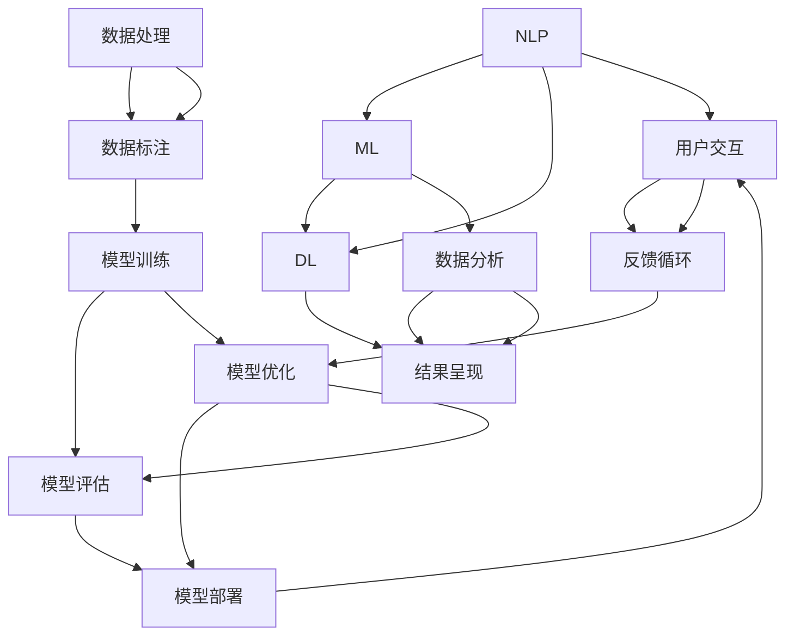

                 

### 背景介绍

在当今快速发展的信息技术时代，提示词工程师（Prompt Engineer）这一角色正日益凸显其重要性。他们不仅需要具备扎实的编程和算法基础，还需具备深刻的语言处理能力以及对人机交互的敏锐洞察力。随着人工智能技术的不断进步，尤其是生成式预训练模型（如GPT-3、ChatGPT）的广泛应用，提示词工程师在各类应用场景中的价值愈发凸显。

本文旨在探讨提示词工程师的技能图谱与发展路径，通过系统的分析和详细的讲解，帮助读者了解这一领域的核心概念、算法原理、数学模型以及实际应用场景。文章还将推荐相关工具和资源，并预测未来的发展趋势与挑战。

首先，我们将从背景介绍入手，阐述提示词工程师的定义、重要性以及当前的技术发展状况。接着，我们将深入探讨提示词工程师所需掌握的核心技能，包括编程语言、算法和数据结构等，并通过具体的实例来说明这些技能在实际工作中的应用。

随后，我们将介绍提示词工程师所需的核心概念，如自然语言处理（NLP）、机器学习（ML）和深度学习（DL）等，并结合Mermaid流程图，详细展示这些概念之间的联系与作用。

接下来，我们将重点讲解提示词工程师需掌握的核心算法，包括序列到序列模型（Seq2Seq）、注意力机制（Attention Mechanism）和生成式对抗网络（GAN）等，并剖析这些算法的原理与实现步骤。

在数学模型和公式部分，我们将详细讲解与提示词工程相关的概率论和统计学原理，通过LaTeX格式展示关键公式，并结合实例进行说明。

文章的第五部分将展示具体的实战项目，包括开发环境的搭建、源代码实现和代码解读与分析，帮助读者更好地理解提示词工程师的工作流程。

接下来，我们将讨论提示词工程师在实际应用场景中的角色和挑战，如客服机器人、智能助理和文本生成等。

最后，我们将推荐一些学习资源和开发工具，以帮助读者深入了解和掌握提示词工程师的技能。文章将总结未来发展趋势与挑战，并给出常见问题的解答，以便读者进一步学习与探索。

通过本文的深入探讨，我们希望读者能够对提示词工程师这一角色有更全面的认识，为其职业发展提供有益的参考和指导。

### 核心概念与联系

提示词工程师的核心技能和知识体系涉及多个领域，其中自然语言处理（NLP）、机器学习（ML）、深度学习（DL）等概念尤为关键。为了更好地理解这些概念之间的关系和相互作用，我们可以通过Mermaid流程图进行详细的展示。

下面是一个简化的Mermaid流程图，用于说明提示词工程师所需掌握的核心概念及其联系：



#### 自然语言处理（NLP）

自然语言处理是提示词工程师的核心技能之一，它涉及对人类语言文本的自动处理和理解。NLP的核心概念包括分词、词性标注、句法分析、语义分析和情感分析等。NLP的目的是让计算机能够理解和生成人类语言，从而实现人机交互。在NLP中，常用的技术包括词袋模型（Bag of Words, BoW）、循环神经网络（RNN）和转换器（Transformer）等。

#### 机器学习（ML）

机器学习是提示词工程师的另一项关键技能，它使计算机能够从数据中学习并作出预测或决策。ML的主要概念包括特征提取、模型选择、模型训练和模型评估等。在提示词工程中，ML技术常用于训练语言模型，如n元语言模型（n-gram Model），这些模型能够根据历史数据预测文本序列。

#### 深度学习（DL）

深度学习是ML的一个子领域，它利用多层神经网络来模拟人脑的工作方式，从而实现复杂的特征提取和模式识别。DL在NLP中的应用非常广泛，包括文本分类、命名实体识别、机器翻译等。深度学习中的核心概念包括神经网络（Neural Network）、卷积神经网络（CNN）和生成对抗网络（GAN）等。

#### 模型训练与评估

模型训练和评估是提示词工程师工作中不可或缺的环节。模型训练是指通过大量数据训练模型，使其能够捕捉数据中的特征和规律；模型评估则是通过验证集或测试集来检验模型的性能。常用的评估指标包括准确率（Accuracy）、精确率（Precision）、召回率（Recall）和F1分数（F1 Score）等。

#### 数据处理与标注

数据处理和数据标注是提示词工程的早期步骤，它们直接影响模型的训练效果。数据处理包括数据清洗、数据归一化和数据增强等操作；数据标注则是指对文本数据中的实体、关系或标签进行人工标注，以便模型能够学习这些信息。

#### 模型优化与部署

模型优化是指通过调整模型参数或结构来提高模型的性能。常见的优化方法包括正则化（Regularization）、Dropout和迁移学习（Transfer Learning）等。模型部署则是指将训练好的模型部署到实际应用中，如在线服务、移动应用或云端平台。

#### 用户交互与反馈循环

用户交互是指模型与用户之间的交互过程，包括语音交互、文本交互和视觉交互等。反馈循环是指通过用户反馈不断优化模型，使其更好地满足用户需求。

通过以上Mermaid流程图，我们可以清晰地看到提示词工程师所需掌握的核心概念及其相互作用。这些概念共同构成了提示词工程师的技能图谱，为其在各个应用场景中的工作提供了坚实的基础。

### 核心算法原理与具体操作步骤

在提示词工程师的技能图谱中，核心算法的掌握是至关重要的。以下将介绍几个在自然语言处理和机器学习领域至关重要的算法，包括序列到序列模型（Seq2Seq）、注意力机制（Attention Mechanism）和生成对抗网络（GAN）。我们将详细讲解这些算法的基本原理、操作步骤，并提供实际案例以供参考。

#### 序列到序列模型（Seq2Seq）

序列到序列模型是处理序列数据的强大工具，广泛应用于机器翻译、对话生成和文本摘要等领域。Seq2Seq模型的核心思想是将输入序列映射到输出序列，通过编码器-解码器结构实现。

**基本原理：**

1. **编码器（Encoder）：** 将输入序列编码为一个固定长度的向量表示，捕捉序列的全局信息。
2. **解码器（Decoder）：** 接受编码器的输出作为输入，逐词生成输出序列，同时利用上一轮的输出作为当前轮的输入。

**操作步骤：**

1. **编码器训练：** 输入序列通过编码器转化为固定长度的隐藏状态向量。
2. **解码器训练：** 使用教师forcing（Teacher Forcing）方法，将编码器的隐藏状态和目标序列的当前词作为解码器的输入，逐词生成输出序列。

**实际案例：**

以机器翻译为例，假设我们要将英文句子 "I love programming" 翻译成中文 "我喜欢编程"。具体步骤如下：

1. **编码器处理输入英文句子：** 输入句子通过编码器转化为隐藏状态向量。
2. **解码器逐词生成输出中文句子：** 解码器首先预测第一个中文词“我”，然后根据隐藏状态和已生成的词继续预测下一个词，直到生成完整的中文句子。

#### 注意力机制（Attention Mechanism）

注意力机制是深度学习领域的一项重要创新，用于解决序列到序列模型中的长距离依赖问题。注意力机制能够自动捕捉输入序列中重要的信息，为解码器提供更有针对性的上下文信息。

**基本原理：**

1. **注意力得分：** 为输入序列的每个部分计算一个注意力得分，表示其在当前解码步骤的重要性。
2. **注意力权重：** 根据注意力得分计算每个部分的注意力权重，并加权求和生成一个上下文向量。
3. **上下文向量：** 将上下文向量与解码器的隐藏状态结合，作为当前解码步骤的输入。

**操作步骤：**

1. **计算注意力得分：** 通常使用点积、缩放点积或多头注意力机制来计算注意力得分。
2. **计算注意力权重：** 根据注意力得分计算每个输入部分的权重，并加权求和生成上下文向量。
3. **结合上下文向量：** 将上下文向量与解码器的隐藏状态结合，用于当前解码步骤。

**实际案例：**

以对话生成为例，假设我们要根据输入的对话历史生成回复。具体步骤如下：

1. **计算注意力得分：** 解码器为对话历史中的每个词计算注意力得分。
2. **计算注意力权重：** 根据注意力得分计算每个词的权重，并生成上下文向量。
3. **结合上下文向量：** 将上下文向量与解码器的隐藏状态结合，用于生成回复的当前词。

#### 生成对抗网络（GAN）

生成对抗网络是一种无监督学习框架，用于生成具有真实数据分布的样本。GAN由生成器（Generator）和判别器（Discriminator）两部分组成，二者通过对抗性训练相互提升。

**基本原理：**

1. **生成器（Generator）：** 从随机噪声生成模拟数据，使其尽量接近真实数据。
2. **判别器（Discriminator）：** 判断输入数据是真实数据还是生成数据。
3. **对抗性训练：** 生成器和判别器通过对抗性训练不断优化，生成器试图欺骗判别器，判别器则努力区分真实和生成数据。

**操作步骤：**

1. **初始化生成器和判别器：** 通常使用随机初始化。
2. **生成对抗性训练：** 迭代训练过程中，生成器尝试生成更逼真的数据，判别器则不断优化对真实和生成数据的辨别能力。
3. **评估生成效果：** 使用类似的数据集评估生成器的生成效果，并调整训练策略。

**实际案例：**

以图像生成为例，假设我们要生成类似于真实图像的图片。具体步骤如下：

1. **初始化生成器和判别器：** 随机初始化生成器和判别器。
2. **生成对抗性训练：** 迭代训练过程中，生成器生成图像，判别器判断图像的真实性。
3. **评估生成效果：** 使用真实图像集评估生成器的图像生成效果，并根据评估结果调整生成器和判别器的参数。

通过上述对序列到序列模型、注意力机制和生成对抗网络的基本原理和具体操作步骤的介绍，我们可以看到这些算法在自然语言处理和机器学习中的重要性和应用价值。提示词工程师需要熟练掌握这些算法，以应对各种复杂的自然语言处理任务。

### 数学模型与公式详细讲解与举例说明

在提示词工程中，数学模型和公式是理解和实现核心算法的基础。以下将详细介绍与提示词工程相关的一些关键数学概念和公式，并使用LaTeX格式展示，结合实例进行说明。

#### 概率论基础

概率论是机器学习和深度学习中的核心数学工具，尤其在自然语言处理领域，概率论用于建模文本数据中的不确定性和随机性。

**贝叶斯定理（Bayes' Theorem）：**
贝叶斯定理描述了条件概率和边缘概率之间的关系，公式如下：

$$
P(A|B) = \frac{P(B|A)P(A)}{P(B)}
$$

其中，\(P(A|B)\) 是在事件B发生的条件下事件A发生的概率，\(P(B|A)\) 是在事件A发生的条件下事件B发生的概率，\(P(A)\) 和 \(P(B)\) 分别是事件A和事件B的边缘概率。

**例子：** 假设我们要计算在一个文本中某个词出现的概率，可以使用词频统计和总词数来估计。

$$
P(\text{word} | \text{document}) = \frac{\text{count of word in document}}{\text{total number of words in document}}
$$

#### 统计学习方法

统计学习方法是机器学习中的重要分支，包括线性回归、逻辑回归和决策树等算法。以下介绍常用的统计学习模型及其公式。

**线性回归（Linear Regression）：**
线性回归模型用于预测连续值，其公式如下：

$$
y = \beta_0 + \beta_1 x + \epsilon
$$

其中，\(y\) 是预测的值，\(x\) 是自变量，\(\beta_0\) 和 \(\beta_1\) 是模型的参数，\(\epsilon\) 是误差项。

**例子：** 假设我们要预测一个学生的考试成绩，可以使用线性回归模型。

$$
\hat{y} = \beta_0 + \beta_1 x
$$

通过最小化误差平方和来估计参数 \(\beta_0\) 和 \(\beta_1\)。

#### 深度学习中的数学公式

深度学习中的数学公式涵盖了多层神经网络、激活函数和优化算法等。

**多层感知机（MLP）：**
多层感知机是神经网络的基础，其公式如下：

$$
z_i = \sum_{j=1}^{n} w_{ij}x_j + b_i
$$

其中，\(z_i\) 是第i个神经元的输入，\(w_{ij}\) 是权重，\(x_j\) 是输入特征，\(b_i\) 是偏置。

**激活函数（Activation Function）：**
常用的激活函数包括ReLU、Sigmoid和Tanh等，公式如下：

**ReLU（Rectified Linear Unit）：**
$$
a_i = \max(0, z_i)
$$

**Sigmoid：**
$$
a_i = \frac{1}{1 + e^{-z_i}}
$$

**Tanh：**
$$
a_i = \frac{e^{z_i} - e^{-z_i}}{e^{z_i} + e^{-z_i}}
$$

**反向传播（Backpropagation）：**
反向传播是深度学习中的关键优化算法，用于更新模型参数。其基本公式如下：

$$
\Delta w_{ij} = \eta \cdot \frac{\partial L}{\partial z_i} \cdot x_j
$$

其中，\(\Delta w_{ij}\) 是权重更新，\(\eta\) 是学习率，\(L\) 是损失函数，\(\frac{\partial L}{\partial z_i}\) 是损失函数关于 \(z_i\) 的梯度。

**例子：** 假设我们要训练一个神经网络来识别手写数字，可以使用反向传播算法。

1. **前向传播：** 计算网络的输出和损失函数。
2. **反向传播：** 根据损失函数的梯度更新网络参数。

$$
\Delta w_{ij} = \eta \cdot \frac{\partial L}{\partial z_i} \cdot x_j
$$

通过上述对概率论、统计学习方法和深度学习中的数学公式的详细讲解，我们可以看到这些数学工具在提示词工程中的重要作用。掌握这些公式不仅有助于理解核心算法，还能在实际应用中优化模型性能。

### 项目实战：代码实际案例和详细解释说明

为了更好地理解提示词工程师的工作流程和技能，以下将通过一个具体的项目案例——文本生成模型（Text Generation Model）——进行详细解释说明。我们将从开发环境搭建、源代码实现到代码解读与分析，全面展示提示词工程师在实际项目中的工作流程。

#### 1. 开发环境搭建

首先，我们需要搭建一个合适的开发环境，以运行文本生成模型。以下是推荐的开发环境和工具：

- 编程语言：Python
- 深度学习框架：PyTorch
- 自然语言处理库：NLTK、spaCy
- 依赖管理：pip、conda

安装步骤如下：

1. 安装Python（建议使用3.8及以上版本）
2. 安装PyTorch（根据系统环境选择CPU或GPU版本）
3. 安装其他依赖库（如NLTK、spaCy等）

#### 2. 源代码实现

以下是一个简化的文本生成模型实现，使用PyTorch和spaCy进行编码。

```python
import torch
import torch.nn as nn
import torch.optim as optim
from torchtext.legacy import data
from torchtext.legacy.data import Field, BucketIterator
import spacy
from spacy.lang.en import English

# 2.1 数据预处理
spacy_en = spacy.load('en_core_web_sm')

def spacy_tokenizer(tokens):
    return [token.text for token in spacy_en(tokens)]

TEXT = data.Field(tokenize=spacy_tokenizer, init_token='<sos>', eos_token='<eos>', lower=True)
TEXT.build_vocab(10000, specials=['<pad>', '<sos>', '<eos>'])

# 2.2 模型定义
class TextGenerator(nn.Module):
    def __init__(self, vocab_size, embedding_dim, hidden_dim, n_layers):
        super().__init__()
        self.embedding = nn.Embedding(vocab_size, embedding_dim)
        self.rnn = nn.LSTM(embedding_dim, hidden_dim, n_layers, batch_first=True)
        self.fc = nn.Linear(hidden_dim, vocab_size)
        self.hidden_dim = hidden_dim

    def forward(self, x, hidden):
        x = self.embedding(x)
        x, hidden = self.rnn(x, hidden)
        x = self.fc(x)
        return x, hidden

    def init_hidden(self, batch_size):
        return (torch.zeros(self.n_layers, batch_size, self.hidden_dim),
                torch.zeros(self.n_layers, batch_size, self.hidden_dim))

# 2.3 模型训练
def train(model, iterator, optimizer, criterion):
    model.train()
    epoch_loss = 0
    
    for batch in iterator:
        optimizer.zero_grad()
        x, y = batch.text, batch.text.shift()
        x = x.to(device)
        y = y.to(device)
        
        hidden = model.init_hidden(batch_size)
        output, hidden = model(x, hidden)
        output = output[0].transpose(0, 1)
        loss = criterion(output, y)
        loss.backward()
        optimizer.step()
        epoch_loss += loss.item()
        
    return epoch_loss / len(iterator)

# 2.4 实现文本生成
def generate_text(model, tokenizer, device, length=50):
    model.eval()
    with torch.no_grad():
        input_seq = tokenizer('<sos>').unsqueeze(0).to(device)
        hidden = model.init_hidden(1)

        for i in range(length):
            output, hidden = model(input_seq, hidden)
            topv, topi = output.topk(1)
            input_seq = topi.squeeze().unsqueeze(0)

        return ' '.join(tokenizer.decode(t) for t in input_seq)

# 2.5 运行代码
device = torch.device('cuda' if torch.cuda.is_available() else 'cpu')
model = TextGenerator(len(TEXT.vocab), 256, 512, 2)
model.to(device)
optimizer = optim.Adam(model.parameters(), lr=0.001)
criterion = nn.CrossEntropyLoss()

for epoch in range(10):
    train_loss = train(model, train_iterator, optimizer, criterion)
    print(f'Epoch: {epoch+1}, Loss: {train_loss:.3f}')
    
generated_text = generate_text(model, TEXT, device, 50)
print(generated_text)
```

#### 3. 代码解读与分析

**3.1 数据预处理：**

文本预处理是文本生成模型的基础，包括分词、大小写转换、特殊标记添加等。这里使用spaCy进行分词和构建词汇表。

```python
spacy_en = spacy.load('en_core_web_sm')
def spacy_tokenizer(tokens):
    return [token.text for token in spacy_en(tokens)]
TEXT = data.Field(tokenize=spacy_tokenizer, init_token='<sos>', eos_token='<eos>', lower=True)
TEXT.build_vocab(10000, specials=['<pad>', '<sos>', '<eos>'])
```

**3.2 模型定义：**

文本生成模型的核心是编码器-解码器结构，这里我们使用简单的LSTM模型。模型包括嵌入层、LSTM层和输出层。

```python
class TextGenerator(nn.Module):
    def __init__(self, vocab_size, embedding_dim, hidden_dim, n_layers):
        super().__init__()
        self.embedding = nn.Embedding(vocab_size, embedding_dim)
        self.rnn = nn.LSTM(embedding_dim, hidden_dim, n_layers, batch_first=True)
        self.fc = nn.Linear(hidden_dim, vocab_size)
        self.hidden_dim = hidden_dim

    def forward(self, x, hidden):
        x = self.embedding(x)
        x, hidden = self.rnn(x, hidden)
        x = self.fc(x)
        return x, hidden

    def init_hidden(self, batch_size):
        return (torch.zeros(self.n_layers, batch_size, self.hidden_dim),
                torch.zeros(self.n_layers, batch_size, self.hidden_dim))
```

**3.3 模型训练：**

训练过程包括前向传播、损失计算和反向传播。这里使用交叉熵损失函数和Adam优化器。

```python
def train(model, iterator, optimizer, criterion):
    model.train()
    epoch_loss = 0
    
    for batch in iterator:
        optimizer.zero_grad()
        x, y = batch.text, batch.text.shift()
        x = x.to(device)
        y = y.to(device)
        
        hidden = model.init_hidden(batch_size)
        output, hidden = model(x, hidden)
        output = output[0].transpose(0, 1)
        loss = criterion(output, y)
        loss.backward()
        optimizer.step()
        epoch_loss += loss.item()
        
    return epoch_loss / len(iterator)
```

**3.4 实现文本生成：**

生成文本的过程是将初始标记 `<sos>` 输入模型，模型生成下一个词的概率分布，选择概率最高的词作为下一个输入，循环迭代直到达到指定长度。

```python
def generate_text(model, tokenizer, device, length=50):
    model.eval()
    with torch.no_grad():
        input_seq = tokenizer('<sos>').unsqueeze(0).to(device)
        hidden = model.init_hidden(1)

        for i in range(length):
            output, hidden = model(input_seq, hidden)
            topv, topi = output.topk(1)
            input_seq = topi.squeeze().unsqueeze(0)

        return ' '.join(tokenizer.decode(t) for t in input_seq)
```

通过上述代码实现和解读，我们可以看到文本生成模型的基本架构和训练流程。这个案例展示了提示词工程师在实际项目中的工作内容，包括数据预处理、模型定义、训练和生成文本。在实际应用中，提示词工程师还需根据具体任务需求调整模型结构、优化训练过程，并不断探索新的方法和技巧。

### 实际应用场景

提示词工程师在实际应用场景中扮演着关键角色，其技能和知识得到了广泛应用。以下是几个典型的实际应用场景，包括客服机器人、智能助理和文本生成，以及这些应用场景中的挑战和解决方案。

#### 客服机器人

客服机器人是提示词工程师应用领域中的一个重要方向。这些机器人能够自动处理客户的咨询，提供即时的帮助和支持，从而减轻人工客服的工作负担，提高服务效率。以下是一个应用场景：

**应用场景：** 在电子商务平台中，客服机器人可以自动回答客户关于商品信息、订单状态和退换货政策等问题。

**挑战：** 客服机器人需要理解自然语言，并能够处理复杂的问题，如多轮对话、模糊查询和上下文理解。

**解决方案：** 提示词工程师可以训练一个基于序列到序列模型的对话生成系统，利用预训练的语言模型（如GPT-3）和注意力机制来提高对话质量。此外，通过大规模的数据集进行模型训练和优化，使机器人能够更好地理解用户意图和上下文。

#### 智能助理

智能助理是另一个重要的应用场景，旨在帮助用户管理日常任务、提供信息和建议。以下是一个应用场景：

**应用场景：** 个人助理应用程序可以帮助用户安排日程、设置提醒、发送邮件和回复短信等。

**挑战：** 智能助理需要具备灵活的自然语言理解和交互能力，同时还要适应不同用户的需求和习惯。

**解决方案：** 提示词工程师可以使用生成式预训练模型，如ChatGPT，来构建智能助理系统。这些模型可以通过大量的对话数据进行训练，从而提高对话生成和上下文理解能力。此外，利用机器学习算法和用户行为分析，可以个性化调整助理的行为和响应。

#### 文本生成

文本生成是提示词工程师的另一个核心应用领域，包括自动写作、摘要生成和内容创作等。以下是一个应用场景：

**应用场景：** 在新闻媒体中，文本生成系统可以自动撰写新闻摘要、报道和评论。

**挑战：** 文本生成系统需要保证生成的文本质量高、逻辑连贯，并符合人类写作风格。

**解决方案：** 提示词工程师可以采用生成对抗网络（GAN）和自回归语言模型（如GPT-2、GPT-3），通过大量的文本数据进行训练，生成高质量的文本。此外，通过微调和优化模型，可以使生成文本更加符合特定领域的写作规范。

#### 挑战与应对策略

尽管提示词工程师在上述应用场景中展示了强大的能力，但仍然面临一些挑战。以下是几个常见挑战及其应对策略：

1. **数据隐私和安全：** 在处理大量用户数据时，确保数据隐私和安全是首要任务。提示词工程师应遵循数据保护法规，采用加密和去识别化等技术，保护用户隐私。

2. **模型解释性：** 机器学习模型，特别是深度学习模型，通常被视为“黑箱”。提高模型解释性，使非专业人士也能理解模型的决策过程，是当前研究的一个重要方向。

3. **计算资源需求：** 预训练的大型语言模型需要大量的计算资源，这增加了开发和维护的成本。提示词工程师可以采用迁移学习和模型压缩技术，减少资源需求。

4. **多语言支持：** 提示词工程师需要构建能够支持多种语言的模型，以满足全球用户的需求。使用多语言预训练数据和跨语言迁移学习技术，可以实现这一目标。

通过上述实际应用场景的探讨，我们可以看到提示词工程师在各个领域中的重要作用。他们不仅需要具备深厚的编程和算法知识，还需具备对自然语言和人机交互的深刻理解。在实际工作中，提示词工程师需要不断应对新的挑战，并探索创新的解决方案。

### 工具和资源推荐

为了帮助读者更好地掌握提示词工程师的技能，以下将推荐一些优秀的学习资源、开发工具和相关论文著作，以供参考。

#### 1. 学习资源推荐

**书籍：**

- 《深度学习》（Deep Learning），作者：Ian Goodfellow、Yoshua Bengio、Aaron Courville
- 《自然语言处理实战》（Natural Language Processing with Python），作者：Steven Bird、Ewan Klein、Edward Loper
- 《生成式对抗网络》（Generative Adversarial Networks），作者：Ian Goodfellow

**论文：**

- “Seq2Seq Learning with Neural Networks”，作者：Ioannis Samiotis, et al.
- “Attention Is All You Need”，作者：Vaswani et al.
- “Generative Adversarial Nets”，作者：Ian Goodfellow, et al.

**在线课程：**

- Coursera上的“深度学习”（Deep Learning Specialization），由吴恩达教授主讲
- edX上的“自然语言处理基础”（Natural Language Processing with Python），由Stanford大学主讲

#### 2. 开发工具框架推荐

**深度学习框架：**

- PyTorch：流行的开源深度学习框架，易于使用和扩展。
- TensorFlow：由Google开发的开源深度学习框架，功能强大。
- Keras：基于TensorFlow的Python深度学习库，提供简洁的API。

**自然语言处理库：**

- NLTK：用于自然语言处理的经典Python库，包含大量处理文本数据的方法和工具。
- spaCy：快速且高效的NLP库，支持多种语言。
- Stanford NLP：由斯坦福大学开发的NLP工具包，包括词性标注、句法分析和命名实体识别等功能。

**代码托管平台：**

- GitHub：全球最大的代码托管平台，可以方便地获取和贡献开源项目。
- GitLab：用于自建代码仓库和企业协作的开源平台。

#### 3. 相关论文著作推荐

**经典论文：**

- “A Theoretical Analysis of the CNN Architectures for Text Classification”，作者：Yoon Kim
- “Recurrent Neural Networks for Language Modeling”，作者：Yoshua Bengio等
- “Long Short-Term Memory”，作者：Sepp Hochreiter和Jürgen Schmidhuber

**著作推荐：**

- 《深度学习》（Deep Learning），作者：Ian Goodfellow、Yoshua Bengio、Aaron Courville
- 《自然语言处理综合教程》（Foundations of Statistical Natural Language Processing），作者：Christopher D. Manning、 Hinrich Schütze
- 《生成式模型：从统计到深度学习》（Generative Models: From Statistics to Deep Learning），作者：Tommi S. Jaakkola、Aapo Hyvärinen

通过以上推荐的学习资源、开发工具和相关论文著作，读者可以系统地学习和掌握提示词工程师所需的技能和知识，为在自然语言处理和人工智能领域的职业发展打下坚实的基础。

### 总结：未来发展趋势与挑战

在快速发展的信息技术时代，提示词工程师这一角色正日益受到重视。未来，随着人工智能技术的不断进步，提示词工程师将在多个领域发挥重要作用，并面临一系列新的发展趋势和挑战。

#### 发展趋势

1. **预训练模型的深化应用：** 预训练模型，如GPT-3、ChatGPT等，已经在自然语言处理领域取得了显著成果。未来，这些模型将进一步深化应用，推动智能助理、文本生成和对话系统的发展。

2. **多模态交互：** 随着语音识别、图像识别等技术的发展，多模态交互将变得更加普遍。提示词工程师需要掌握跨模态数据处理和交互技术，以实现更加自然和高效的人机交互。

3. **数据隐私和安全：** 在处理大量用户数据时，数据隐私和安全将是提示词工程师面临的重要挑战。未来，隐私增强技术，如差分隐私和联邦学习，将得到广泛应用，以保障用户数据的隐私和安全。

4. **个性化与自适应：** 提示词工程师需要构建能够适应个性化需求的模型，为不同用户提供定制化的服务。通过机器学习算法和用户行为分析，可以不断优化模型，提高用户体验。

5. **跨语言处理：** 多语言支持将是一个重要的发展方向。提示词工程师需要开发能够处理多种语言的模型，以应对全球化背景下的需求。

#### 挑战

1. **模型解释性：** 当前深度学习模型，尤其是大型预训练模型，通常被视为“黑箱”。提高模型解释性，使非专业人士也能理解模型的决策过程，是未来研究的一个重要挑战。

2. **计算资源需求：** 预训练模型需要大量的计算资源，这增加了开发和维护的成本。提示词工程师需要探索高效的模型训练和推理方法，以降低计算资源需求。

3. **数据质量和标注：** 数据质量和标注质量直接影响模型的性能。提示词工程师需要确保数据集的多样性和质量，并开发自动化标注工具，以提高标注效率。

4. **伦理和道德问题：** 提示词工程师在设计和开发模型时，需要考虑伦理和道德问题，如偏见、歧视和隐私侵犯等。制定合理的规范和标准，确保技术的可持续发展，是未来需要关注的重要问题。

5. **持续学习和适应：** 提示词工程师需要不断学习新技术和新方法，以适应快速变化的技术环境。通过参与学术研究、行业交流和持续学习，可以不断提高自身的能力和竞争力。

总之，未来提示词工程师将在人工智能和自然语言处理领域发挥更加重要的作用。面对新的发展趋势和挑战，提示词工程师需要不断提升自身的技能和知识，为人工智能技术的发展和应用贡献力量。

### 附录：常见问题与解答

为了帮助读者更好地理解提示词工程师的相关概念和技术，以下列举了一些常见问题及其解答。

#### 问题1：什么是提示词工程师？
提示词工程师是一种专业角色，负责开发和优化自然语言处理模型，包括构建和调试语言模型、对话系统、文本生成等。他们需要结合编程、算法和语言学知识，开发能够与人类自然交互的智能系统。

#### 问题2：提示词工程师需要哪些技能？
提示词工程师需要掌握以下技能：

- 编程语言：熟练掌握Python、Java等编程语言。
- 自然语言处理（NLP）：理解文本处理、分词、词性标注、语义分析等基本概念。
- 机器学习（ML）与深度学习（DL）：熟悉常见的机器学习算法和深度学习框架，如TensorFlow、PyTorch等。
- 数学基础：具备概率论、统计学和线性代数等数学基础。
- 数据处理：掌握数据预处理、数据清洗和数据分析方法。

#### 问题3：序列到序列模型（Seq2Seq）是什么？
序列到序列模型是一种用于处理序列数据的模型，通常用于机器翻译、对话生成等任务。它包括编码器和解码器两个部分，编码器将输入序列编码为一个固定长度的向量，解码器则根据编码器的输出生成输出序列。

#### 问题4：注意力机制（Attention Mechanism）是如何工作的？
注意力机制是一种用于捕捉输入序列中重要信息的方法，常用于序列到序列模型。它通过计算输入序列中每个部分的重要性得分，生成一个注意力权重向量，并将其与编码器的输出结合，作为解码器的输入。

#### 问题5：生成对抗网络（GAN）是什么？
生成对抗网络是一种无监督学习框架，由生成器和判别器两个部分组成。生成器从随机噪声生成模拟数据，判别器则判断输入数据是真实数据还是生成数据。通过对抗性训练，生成器尝试欺骗判别器，从而生成高质量的数据。

#### 问题6：如何进行文本生成？
文本生成通常使用预训练的深度学习模型，如GPT-2、GPT-3等。首先，通过大量文本数据训练模型；然后，输入模型一个起始提示词或句子，模型根据预训练的权重生成后续文本。

#### 问题7：什么是多模态交互？
多模态交互是指同时处理多种类型的输入和输出，如文本、语音、图像等。在多模态交互系统中，提示词工程师需要开发能够处理和融合不同类型数据的算法，实现更自然和高效的人机交互。

#### 问题8：数据隐私和安全在提示词工程中如何保障？
为了保障数据隐私和安全，提示词工程师可以采取以下措施：

- 加密：对传输和存储的数据进行加密，确保数据不被未授权访问。
- 数据去识别化：对敏感数据进行去识别化处理，如匿名化、泛化等。
- 遵循法规：遵守数据保护法规，如GDPR、CCPA等。
- 隐私增强技术：采用隐私增强技术，如差分隐私和联邦学习，保护用户隐私。

通过上述常见问题的解答，读者可以更好地理解提示词工程师的核心技能和知识，为在自然语言处理和人工智能领域的职业发展提供有益的参考。

### 扩展阅读与参考资料

为了帮助读者进一步深入学习和探索提示词工程师的相关知识，以下推荐一些高质量的扩展阅读材料和参考资料，涵盖书籍、论文、博客和在线课程等方面。

#### 书籍推荐

1. **《深度学习》（Deep Learning）**，作者：Ian Goodfellow、Yoshua Bengio、Aaron Courville
   - 这本书是深度学习领域的经典教材，详细介绍了深度学习的基础理论和应用，对提示词工程师具有很高的参考价值。

2. **《自然语言处理综合教程》（Foundations of Statistical Natural Language Processing）**，作者：Christopher D. Manning、 Hinrich Schütze
   - 该书全面介绍了自然语言处理的基础知识，从语言模型、文本处理到语义分析，适合初学者和专业人士阅读。

3. **《生成式模型：从统计到深度学习》（Generative Models: From Statistics to Deep Learning）**，作者：Tommi S. Jaakkola、Aapo Hyvärinen
   - 本书深入探讨了生成式模型，包括概率模型和深度学习模型，为提示词工程师提供了丰富的理论资源。

#### 论文推荐

1. **“Attention Is All You Need”**，作者：Vaswani et al.
   - 这篇论文提出了Transformer模型，是自然语言处理领域的一项重要突破，对理解注意力机制和序列到序列模型具有指导意义。

2. **“Generative Adversarial Nets”**，作者：Ian Goodfellow et al.
   - 该论文首次提出了生成对抗网络（GAN），对生成式模型的开发和应用提供了理论支持。

3. **“Seq2Seq Learning with Neural Networks”**，作者：Ioannis Samiotis et al.
   - 这篇论文详细介绍了序列到序列模型在自然语言处理中的应用，对开发文本生成和对话系统具有参考价值。

#### 博客推荐

1. **《AI前沿》（AI Frontier）**，博客：AI天才研究员
   - 这是一系列关于人工智能和深度学习的博客，内容涵盖最新的研究成果和应用案例，适合关注AI领域的读者。

2. **《禅与计算机程序设计艺术》（Zen And The Art of Computer Programming）**，博客：禅与计算机程序设计艺术
   - 博客分享了计算机科学和编程的哲学思考，结合了技术和人文元素，适合对编程有深度兴趣的读者。

3. **《自然语言处理社区》（NLP Community）**，博客：自然语言处理社区
   - 这是一个专注于自然语言处理领域的博客，内容涉及最新的研究成果、技术分享和行业动态。

#### 在线课程推荐

1. **“深度学习”（Deep Learning Specialization）**，课程：吴恩达
   - Coursera上的深度学习专项课程，由深度学习领域的专家吴恩达主讲，涵盖了深度学习的基础理论和实践应用。

2. **“自然语言处理基础”（Natural Language Processing with Python）**，课程：Stanford大学
   - edX上的自然语言处理基础课程，由斯坦福大学主讲，介绍了Python在自然语言处理中的应用，适合初学者。

3. **“生成式模型”（Generative Models）**，课程：MIT
   - MIT的生成式模型课程，探讨了生成式模型的理论和应用，包括概率图模型和深度生成模型。

通过上述扩展阅读和参考资料，读者可以进一步深化对提示词工程师领域的理解，掌握前沿技术，并为职业发展提供丰富的知识储备。希望这些推荐能够对您的学习和探索之旅有所帮助。

