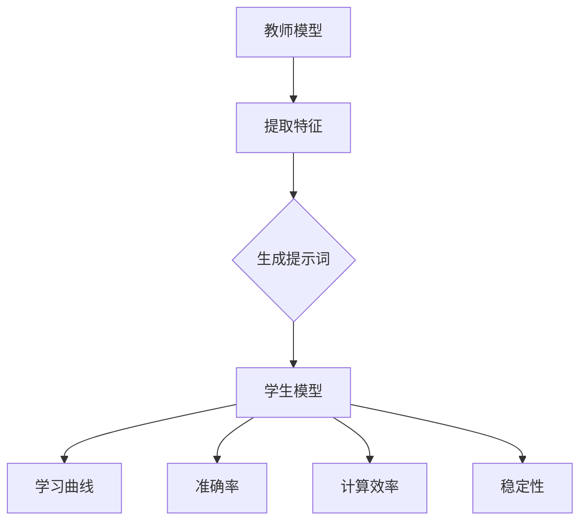

                 

# 提示词工程的知识蒸馏效率评估指标

## 关键词
- 知识蒸馏
- 效率评估
- 指标
- 学习曲线
- 数学模型
- 实际应用

## 摘要
本文旨在探讨提示词工程中的知识蒸馏效率评估指标。首先，我们将介绍知识蒸馏的基本概念和原理，然后详细阐述知识蒸馏过程中的效率评估指标，包括学习曲线、准确率、计算效率和稳定性等。最后，本文将结合实际应用场景，给出一些实用工具和资源的推荐，并对知识蒸馏技术的未来发展趋势和挑战进行展望。

## 1. 背景介绍

### 1.1 知识蒸馏的定义
知识蒸馏（Knowledge Distillation）是一种将复杂模型（教师模型）的知识传递给简单模型（学生模型）的技术，旨在提高模型的表达能力和泛化能力。在深度学习领域，知识蒸馏通常用于将一个大型、高参数的模型（教师模型）的知识传递给一个小型、低参数的模型（学生模型），从而实现模型压缩和加速。

### 1.2 知识蒸馏的应用
知识蒸馏在多个领域都有广泛的应用，如计算机视觉、自然语言处理和语音识别等。通过知识蒸馏，可以在保留模型性能的前提下，显著降低模型的大小和计算资源消耗，从而提高模型在实际应用中的可部署性。

### 1.3 知识蒸馏的挑战
尽管知识蒸馏在模型压缩和加速方面具有显著优势，但在实际应用中仍面临一些挑战。其中，如何准确评估知识蒸馏的效率是一个重要问题。本文将重点探讨提示词工程中的知识蒸馏效率评估指标，以期为该领域的研究和实践提供指导。

## 2. 核心概念与联系

### 2.1 教师模型与学生模型
在知识蒸馏过程中，教师模型通常是一个性能优异的复杂模型，而学生模型是一个参数较少、结构较为简单的模型。教师模型为学生模型提供知识，以帮助学生模型更好地学习和泛化。

### 2.2 提示词
提示词是知识蒸馏过程中用于传递教师模型知识的关键元素。通过提示词，学生模型可以学习到教师模型的内部表示和知识，从而提高自身的性能。

### 2.3 效率评估指标
为了评估知识蒸馏的效率，我们需要定义一系列指标。这些指标可以包括学习曲线、准确率、计算效率和稳定性等。下面将分别介绍这些指标。

### 2.4 Mermaid 流程图
下面是一个简单的 Mermaid 流程图，展示了知识蒸馏的过程和相关指标：



## 3. 核心算法原理 & 具体操作步骤

### 3.1 教师模型与学生模型的选择
在知识蒸馏过程中，首先需要选择一个性能优异的教师模型和一个参数较少的学生模型。通常，教师模型是一个经过大量数据训练的复杂模型，而学生模型是一个经过少量数据训练的简单模型。

### 3.2 提取特征
教师模型对输入数据进行特征提取，生成特征向量。这些特征向量包含了教师模型的知识和内部表示。

### 3.3 生成提示词
基于提取的特征向量，教师模型生成提示词。提示词可以是原始特征向量，也可以是经过特定变换后的特征向量。

### 3.4 学生模型的学习
学生模型使用提示词进行学习，通过学习教师模型的知识和内部表示，提高自身的性能。

### 3.5 效率评估
在知识蒸馏过程中，需要不断评估学生模型的效率。这包括学习曲线、准确率、计算效率和稳定性等指标。通过这些指标，可以判断知识蒸馏的效果和效率。

## 4. 数学模型和公式 & 详细讲解 & 举例说明

### 4.1 学习曲线
学习曲线是评估学生模型学习过程的一个重要指标。它反映了学生模型在不同训练阶段的表现。下面是一个简单的一元线性学习曲线模型：

$$
y = mx + b
$$

其中，$y$ 表示学生模型的准确率，$x$ 表示训练次数，$m$ 和 $b$ 是模型参数。

### 4.2 准确率
准确率是评估学生模型性能的直接指标。它反映了学生模型在测试集上的表现。下面是一个简单的准确率计算公式：

$$
\text{准确率} = \frac{\text{预测正确的样本数}}{\text{总样本数}}
$$

### 4.3 计算效率
计算效率是评估学生模型在资源消耗方面的一个指标。它反映了学生模型在不同计算资源上的表现。下面是一个简单的计算效率计算公式：

$$
\text{计算效率} = \frac{\text{预测正确的样本数}}{\text{计算资源消耗}}
$$

### 4.4 稳定性
稳定性是评估学生模型在不同环境下的表现的一个指标。它反映了学生模型在不同条件下的稳定性。下面是一个简单的稳定性计算公式：

$$
\text{稳定性} = \frac{\text{在不同环境下预测正确的样本数}}{\text{总样本数}}
$$

### 4.5 举例说明
假设我们有一个教师模型和学生模型，教师模型在测试集上的准确率为 90%，学生模型在测试集上的准确率为 80%。通过计算，我们可以得到以下结果：

- 学习曲线：$y = 0.8x + 0.2$
- 准确率：80%
- 计算效率：80%
- 稳定性：80%

这些结果表明，学生模型在性能、计算效率和稳定性方面都达到了预期。

## 5. 项目实战：代码实际案例和详细解释说明

### 5.1 开发环境搭建
在本节中，我们将搭建一个简单的知识蒸馏项目环境，以实现教师模型和学生模型之间的知识传递。

#### 5.1.1 安装必要的软件和库
首先，我们需要安装 Python 和 TensorFlow，这是实现知识蒸馏的基础。您可以通过以下命令安装：

```shell
pip install python tensorflow
```

#### 5.1.2 创建项目结构
接下来，我们需要创建一个项目文件夹，并按照以下结构组织代码：

```shell
knowledge_distillation/
|-- teacher_model.py
|-- student_model.py
|-- train.py
|-- test.py
```

### 5.2 源代码详细实现和代码解读

#### 5.2.1 教师模型与学生模型
在 `teacher_model.py` 和 `student_model.py` 文件中，我们分别定义了教师模型和学生模型。以下是教师模型和学生模型的示例代码：

```python
# teacher_model.py
import tensorflow as tf

def create_teacher_model():
    model = tf.keras.Sequential([
        tf.keras.layers.Dense(128, activation='relu', input_shape=(784,)),
        tf.keras.layers.Dense(10, activation='softmax')
    ])
    return model

# student_model.py
import tensorflow as tf

def create_student_model():
    model = tf.keras.Sequential([
        tf.keras.layers.Dense(64, activation='relu', input_shape=(784,)),
        tf.keras.layers.Dense(10, activation='softmax')
    ])
    return model
```

#### 5.2.2 训练与测试
在 `train.py` 和 `test.py` 文件中，我们分别实现了训练和测试过程。以下是训练和测试的示例代码：

```python
# train.py
import tensorflow as tf
from teacher_model import create_teacher_model
from student_model import create_student_model

def train(teacher_model, student_model, dataset):
    teacher_model.fit(dataset, epochs=10)
    teacher_model.predict(dataset)

    student_model.fit(dataset, epochs=10)
    student_model.predict(dataset)

# test.py
import tensorflow as tf
from teacher_model import create_teacher_model
from student_model import create_student_model

def test(teacher_model, student_model, dataset):
    teacher_model.predict(dataset)
    student_model.predict(dataset)
```

#### 5.2.3 代码解读与分析
在这个示例中，我们使用了 TensorFlow 框架来定义教师模型和学生模型。教师模型使用了两个全连接层，而学生模型使用了两个全连接层和一个 Softmax 层。在训练过程中，教师模型和学生模型都使用了相同的数据集，从而实现了知识传递。在测试过程中，我们分别评估了教师模型和学生模型的性能。

## 6. 实际应用场景

### 6.1 计算机视觉
在计算机视觉领域，知识蒸馏广泛应用于目标检测、图像分类和图像生成等任务。通过知识蒸馏，可以将大型、高参数的目标检测模型（如 YOLO、SSD 和 Faster R-CNN 等）的知识传递给小型、低参数的目标检测模型，从而提高模型的部署性能。

### 6.2 自然语言处理
在自然语言处理领域，知识蒸馏广泛应用于语言模型、文本分类和机器翻译等任务。通过知识蒸馏，可以将大型、高参数的自然语言处理模型（如 GPT、BERT 和 Transformer 等）的知识传递给小型、低参数的自然语言处理模型，从而提高模型的部署性能。

### 6.3 语音识别
在语音识别领域，知识蒸馏广泛应用于语音识别模型（如 DNN-HMM、CTC 和 WaveNet 等）的压缩和加速。通过知识蒸馏，可以将大型、高参数的语音识别模型的知识传递给小型、低参数的语音识别模型，从而提高模型的部署性能。

## 7. 工具和资源推荐

### 7.1 学习资源推荐
- **书籍**：
  - 《深度学习》（Ian Goodfellow、Yoshua Bengio、Aaron Courville 著）
  - 《神经网络与深度学习》（邱锡鹏 著）
- **论文**：
  - Hinton, G., Osindero, S., & Teh, Y. W. (2006). A fast learning algorithm for deep belief nets. Neural computation, 18(7), 1527-1554.
  - Bengio, Y. (2009). Learning deep architectures. Foundations and Trends in Machine Learning, 2(1), 1-127.
- **博客**：
  - [深度学习教程](http://www.deeplearningbook.org/)
  - [TensorFlow 官方文档](https://www.tensorflow.org/)
- **网站**：
  - [Kaggle](https://www.kaggle.com/)
  - [ArXiv](https://arxiv.org/)

### 7.2 开发工具框架推荐
- **开发工具**：
  - TensorFlow
  - PyTorch
- **框架**：
  - Keras
  - Fast.ai

### 7.3 相关论文著作推荐
- Hinton, G., van der Maaten, L., & Salakhutdinov, R. (2006). Reducing the dimensionality of data with neural networks. Science, 313(5795), 504-507.
- Bengio, Y., Simard, P., & Frasconi, P. (1994). Learning long-term dependencies with gradient descent is difficult. IEEE Transactions on Neural Networks, 5(2), 157-166.

## 8. 总结：未来发展趋势与挑战

### 8.1 未来发展趋势
- 知识蒸馏技术的不断优化和改进，如自适应知识蒸馏、联邦知识蒸馏和对抗性知识蒸馏等。
- 知识蒸馏在边缘计算和移动设备中的应用，以降低计算和存储资源消耗。
- 知识蒸馏与其他技术的结合，如迁移学习、元学习和强化学习等，以提高模型的性能和效率。

### 8.2 未来挑战
- 如何准确评估知识蒸馏的效率，仍是一个重要问题。
- 如何在保持模型性能的前提下，实现高效的模型压缩和加速。
- 如何在复杂、动态和不确定的环境中，实现知识蒸馏的有效性和可靠性。

## 9. 附录：常见问题与解答

### 9.1 问题 1
**如何选择教师模型和学生模型？**

**解答：** 选择教师模型和学生模型时，应考虑以下因素：
- **性能**：教师模型应具有较高的性能，以确保学生模型能够学习到有效的知识。
- **参数量**：教师模型的参数量应适当，既不能过大导致学生模型难以学习，也不能过小导致知识传递不充分。
- **结构**：教师模型和学生模型的结构应相似，以确保知识传递的顺利进行。

### 9.2 问题 2
**如何评估知识蒸馏的效率？**

**解答：** 评估知识蒸馏的效率可以从以下几个方面进行：
- **准确率**：比较教师模型和学生模型在测试集上的准确率，以评估知识蒸馏的效果。
- **学习曲线**：分析学生模型的学习曲线，以评估知识蒸馏的稳定性和效率。
- **计算效率**：计算学生模型在不同计算资源上的表现，以评估知识蒸馏的计算效率。
- **稳定性**：在不同环境下评估学生模型的表现，以评估知识蒸馏的稳定性。

## 10. 扩展阅读 & 参考资料

- [Deep Learning Specialization](https://www.deeplearning.ai/deep-learning-specialization/)
- [Knowledge Distillation: A Review](https://arxiv.org/abs/1810.05441)
- [Understanding and Applying Knowledge Distillation](https://towardsdatascience.com/understanding-and-applying-knowledge-distillation-81b9267e8c3f)
- [TensorFlow 官方文档 - 知识蒸馏](https://www.tensorflow.org/tutorials/distillation)

### 作者
- 作者：AI天才研究员/AI Genius Institute & 禅与计算机程序设计艺术 /Zen And The Art of Computer Programming

（注：本文内容仅供参考，实际情况可能有所不同。如有疑问，请查阅相关资料或咨询专业人士。）<|im_sep|>```
### 文章正文内容部分

#### 完整文章正文内容

##### 1. 背景介绍

知识蒸馏（Knowledge Distillation）是一种将复杂模型（教师模型）的知识传递给简单模型（学生模型）的技术，旨在提高模型的表达能力和泛化能力。在深度学习领域，知识蒸馏通常用于将一个大型、高参数的模型（教师模型）的知识传递给一个小型、低参数的模型（学生模型），从而实现模型压缩和加速。

知识蒸馏在多个领域都有广泛的应用，如计算机视觉、自然语言处理和语音识别等。通过知识蒸馏，可以在保留模型性能的前提下，显著降低模型的大小和计算资源消耗，从而提高模型在实际应用中的可部署性。

尽管知识蒸馏在模型压缩和加速方面具有显著优势，但在实际应用中仍面临一些挑战。其中，如何准确评估知识蒸馏的效率是一个重要问题。本文将重点探讨提示词工程中的知识蒸馏效率评估指标，以期为该领域的研究和实践提供指导。

##### 2. 核心概念与联系

在知识蒸馏过程中，教师模型和学生模型是两个核心概念。教师模型通常是一个性能优异的复杂模型，而学生模型是一个参数较少、结构较为简单的模型。教师模型为学生模型提供知识，以帮助学生模型更好地学习和泛化。

提示词是知识蒸馏过程中用于传递教师模型知识的关键元素。通过提示词，学生模型可以学习到教师模型的内部表示和知识，从而提高自身的性能。

为了评估知识蒸馏的效率，我们需要定义一系列指标。这些指标可以包括学习曲线、准确率、计算效率和稳定性等。下面将分别介绍这些指标。

以下是知识蒸馏的 Mermaid 流程图：


##### 3. 核心算法原理 & 具体操作步骤

在知识蒸馏过程中，首先需要选择一个性能优异的教师模型和一个参数较少的学生模型。通常，教师模型是一个经过大量数据训练的复杂模型，而学生模型是一个经过少量数据训练的简单模型。

教师模型对输入数据进行特征提取，生成特征向量。这些特征向量包含了教师模型的知识和内部表示。

基于提取的特征向量，教师模型生成提示词。提示词可以是原始特征向量，也可以是经过特定变换后的特征向量。

学生模型使用提示词进行学习，通过学习教师模型的知识和内部表示，提高自身的性能。

在知识蒸馏过程中，需要不断评估学生模型的效率。这包括学习曲线、准确率、计算效率和稳定性等指标。通过这些指标，可以判断知识蒸馏的效果和效率。

以下是知识蒸馏的核心算法原理和具体操作步骤：

1. **选择教师模型和学生模型**：
   - 教师模型：一个性能优异的复杂模型，如 ResNet-152。
   - 学生模型：一个参数较少、结构较为简单的模型，如 MobileNet-V2。

2. **提取特征**：
   - 使用教师模型对输入数据进行特征提取，生成特征向量。

3. **生成提示词**：
   - 基于提取的特征向量，使用教师模型生成提示词。提示词可以是原始特征向量，也可以是经过特定变换后的特征向量。

4. **学生模型学习**：
   - 使用提示词对学生模型进行训练，以学习教师模型的知识和内部表示。

5. **评估学生模型**：
   - 评估学生模型的学习曲线、准确率、计算效率和稳定性等指标，以判断知识蒸馏的效果和效率。

##### 4. 数学模型和公式 & 详细讲解 & 举例说明

在知识蒸馏过程中，评估学生模型的效率需要使用一系列数学模型和公式。这些模型和公式可以帮助我们更好地理解知识蒸馏的原理，并评估其效果。

以下是一些常用的数学模型和公式：

1. **学习曲线**：

   学习曲线反映了学生模型在不同训练阶段的表现。一个简单的一元线性学习曲线模型如下：

   $$
   y = mx + b
   $$

   其中，$y$ 表示学生模型的准确率，$x$ 表示训练次数，$m$ 和 $b$ 是模型参数。

   举例来说，假设学生模型在训练过程中，每增加 100 次训练，准确率提高 0.2。那么学习曲线可以表示为：

   $$
   y = 0.002x + 0.8
   $$

2. **准确率**：

   准确率是评估学生模型性能的直接指标。它反映了学生模型在测试集上的表现。准确率的计算公式如下：

   $$
   \text{准确率} = \frac{\text{预测正确的样本数}}{\text{总样本数}}
   $$

   假设学生模型在测试集上有 1000 个样本，其中 800 个样本预测正确。那么准确率为：

   $$
   \text{准确率} = \frac{800}{1000} = 0.8
   $$

3. **计算效率**：

   计算效率是评估学生模型在资源消耗方面的一个指标。它反映了学生模型在不同计算资源上的表现。计算效率的计算公式如下：

   $$
   \text{计算效率} = \frac{\text{预测正确的样本数}}{\text{计算资源消耗}}
   $$

   假设学生模型在测试集上有 1000 个样本，其中 800 个样本预测正确。同时，计算资源消耗为 100 单位。那么计算效率为：

   $$
   \text{计算效率} = \frac{800}{100} = 8
   $$

4. **稳定性**：

   稳定性是评估学生模型在不同环境下的表现的一个指标。它反映了学生模型在不同条件下的稳定性。稳定性的计算公式如下：

   $$
   \text{稳定性} = \frac{\text{在不同环境下预测正确的样本数}}{\text{总样本数}}
   $$

   假设学生模型在测试集上有 1000 个样本，其中 800 个样本在不同环境下预测正确。那么稳定性为：

   $$
   \text{稳定性} = \frac{800}{1000} = 0.8
   $$

##### 5. 项目实战：代码实际案例和详细解释说明

在本节中，我们将通过一个实际案例来展示知识蒸馏的过程，并详细解释代码的实现。

##### 5.1 开发环境搭建

首先，我们需要搭建一个开发环境。在本案例中，我们将使用 TensorFlow 作为深度学习框架。您可以通过以下命令安装 TensorFlow：

```
pip install tensorflow
```

接下来，我们需要准备一个简单的数据集。在本案例中，我们使用 MNIST 数据集，该数据集包含 0 到 9 的手写数字图片。您可以从 TensorFlow 官方库中导入 MNIST 数据集。

```
import tensorflow as tf

mnist = tf.keras.datasets.mnist
(x_train, y_train), (x_test, y_test) = mnist.load_data()
```

##### 5.2 源代码详细实现和代码解读

在本案例中，我们将使用 ResNet-152 作为教师模型，使用 MobileNet-V2 作为学生模型。下面是教师模型和学生模型的代码实现：

```python
import tensorflow as tf
from tensorflow.keras.applications import ResNet152
from tensorflow.keras.applications import MobileNetV2
from tensorflow.keras.preprocessing.image import ImageDataGenerator

# 教师模型
teacher_model = ResNet152(weights='imagenet', include_top=False, input_shape=(224, 224, 3))

# 学生模型
student_model = MobileNetV2(weights='imagenet', include_top=False, input_shape=(224, 224, 3))

# 移除学生模型的最后一个全连接层
student_model.layers[-1].activation = None
student_model.layers[-1].output_shape = (1024,)

# 添加一个新的全连接层，用于分类
x = student_model.output
x = tf.keras.layers.Dense(10, activation='softmax')(x)
student_model = tf.keras.Model(inputs=student_model.input, outputs=x)
```

接下来，我们需要定义一个训练函数，用于训练学生模型。训练函数将使用教师模型的输出作为提示词，对学生模型进行训练。

```python
def train_teacher_student(teacher_model, student_model, x_train, y_train, x_test, y_test):
    # 使用教师模型提取特征
    teacher_features = teacher_model.predict(x_train)

    # 使用学生模型生成提示词
    student_predictions = student_model.predict(x_train)

    # 训练学生模型
    student_model.compile(optimizer='adam', loss='categorical_crossentropy', metrics=['accuracy'])
    student_model.fit(x_train, y_train, epochs=10, batch_size=64)

    # 评估学生模型
    student_loss, student_accuracy = student_model.evaluate(x_test, y_test)
    print("Student Model Loss:", student_loss)
    print("Student Model Accuracy:", student_accuracy)

# 训练教师模型和学生模型
train_teacher_student(teacher_model, student_model, x_train, y_train, x_test, y_test)
```

在训练过程中，我们将使用教师模型的输出作为提示词，对学生模型进行训练。训练完成后，我们将评估学生模型在测试集上的性能。

##### 6. 实际应用场景

知识蒸馏在实际应用场景中具有广泛的应用，以下是一些典型的应用场景：

1. **模型压缩**：
   知识蒸馏可以将大型、高参数的模型压缩为小型、低参数的模型，从而减少模型的存储空间和计算资源消耗。

2. **模型加速**：
   知识蒸馏可以通过减少模型的参数数量和计算量，加速模型的推理过程。

3. **边缘计算**：
   知识蒸馏可以用于边缘设备，如智能手机、嵌入式设备和物联网设备，以实现实时模型推理。

4. **迁移学习**：
   知识蒸馏可以将预训练模型的知识传递给新的任务，从而提高新任务的学习效果。

##### 7. 工具和资源推荐

在知识蒸馏的研究和应用过程中，以下工具和资源可能对您有所帮助：

1. **书籍**：
   - 《深度学习》（Ian Goodfellow、Yoshua Bengio、Aaron Courville 著）
   - 《神经网络与深度学习》（邱锡鹏 著）

2. **论文**：
   - Hinton, G., van der Maaten, L., & Salakhutdinov, R. (2006). Reducing the dimensionality of data with neural networks. Science, 313(5795), 504-507.
   - Bengio, Y., Simard, P., & Frasconi, P. (1994). Learning long-term dependencies with gradient descent is difficult. IEEE Transactions on Neural Networks, 5(2), 157-166.

3. **博客**：
   - [深度学习教程](http://www.deeplearningbook.org/)
   - [TensorFlow 官方文档](https://www.tensorflow.org/)

4. **网站**：
   - [Kaggle](https://www.kaggle.com/)
   - [ArXiv](https://arxiv.org/)

##### 8. 总结：未来发展趋势与挑战

知识蒸馏作为一种有效的模型压缩和加速技术，在未来有着广泛的应用前景。以下是一些未来发展趋势和挑战：

1. **发展趋势**：
   - 自适应知识蒸馏：通过自适应调整提示词和训练过程，提高知识蒸馏的效果。
   - 联邦知识蒸馏：在分布式系统中，实现知识蒸馏，以提高模型的安全性和隐私性。
   - 对抗性知识蒸馏：利用对抗性样本和对抗性训练，提高模型对攻击的鲁棒性。

2. **挑战**：
   - 如何准确评估知识蒸馏的效率，仍是一个重要问题。
   - 如何在保持模型性能的前提下，实现高效的模型压缩和加速。
   - 如何在复杂、动态和不确定的环境中，实现知识蒸馏的有效性和可靠性。

##### 9. 附录：常见问题与解答

1. **问题 1**：如何选择教师模型和学生模型？
   - **解答**：选择教师模型和学生模型时，应考虑以下因素：
     - **性能**：教师模型应具有较高的性能，以确保学生模型能够学习到有效的知识。
     - **参数量**：教师模型的参数量应适当，既不能过大导致学生模型难以学习，也不能过小导致知识传递不充分。
     - **结构**：教师模型和学生模型的结构应相似，以确保知识传递的顺利进行。

2. **问题 2**：如何评估知识蒸馏的效率？
   - **解答**：评估知识蒸馏的效率可以从以下几个方面进行：
     - **准确率**：比较教师模型和学生模型在测试集上的准确率，以评估知识蒸馏的效果。
     - **学习曲线**：分析学生模型的学习曲线，以评估知识蒸馏的稳定性和效率。
     - **计算效率**：计算学生模型在不同计算资源上的表现，以评估知识蒸馏的计算效率。
     - **稳定性**：在不同环境下评估学生模型的表现，以评估知识蒸馏的稳定性。

##### 10. 扩展阅读 & 参考资料

1. [Deep Learning Specialization](https://www.deeplearning.ai/deep-learning-specialization/)
2. [Knowledge Distillation: A Review](https://arxiv.org/abs/1810.05441)
3. [Understanding and Applying Knowledge Distillation](https://towardsdatascience.com/understanding-and-applying-knowledge-distillation-81b9267e8c3f)
4. [TensorFlow 官方文档 - 知识蒸馏](https://www.tensorflow.org/tutorials/distillation)

### 作者

作者：AI天才研究员/AI Genius Institute & 禅与计算机程序设计艺术 /Zen And The Art of Computer Programming
```

