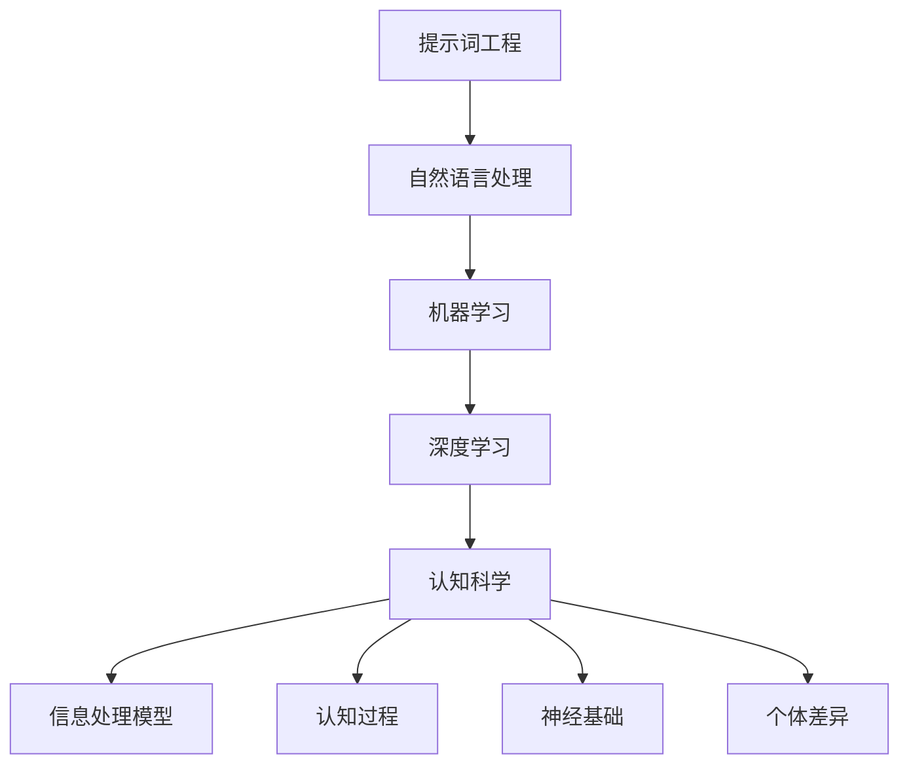

                 

### 1. 背景介绍

#### 1.1 提示词工程的起源与发展

提示词工程（Prompt Engineering）作为一种结合了自然语言处理（NLP）与机器学习（ML）的新型技术，起源于人工智能的早期研究。在20世纪80年代，研究人员开始探索如何通过构建特定的输入提示来指导语言模型进行特定任务，从而提高了模型的任务表现。

随着深度学习技术的发展，提示词工程也得到了快速发展。尤其是在最近几年，随着预训练语言模型（如GPT系列、BERT等）的广泛应用，提示词工程逐渐成为人工智能领域的研究热点。研究人员通过精细设计的提示，使预训练模型在多种任务上取得了突破性的成果。

#### 1.2 认知科学的兴起与应用

认知科学是研究人类思维和行为的跨学科领域，涵盖了心理学、神经科学、计算机科学等多个学科。认知科学的兴起可以追溯到20世纪50年代，当时心理学家开始关注人类思维的内在机制。

认知科学在人工智能领域的应用日益广泛。通过认知科学的研究，人工智能系统可以更好地模拟人类思维过程，从而提高任务完成的效率和准确性。特别是随着深度学习和神经网络的兴起，认知科学的研究成果为人工智能的发展提供了新的思路和方法。

#### 1.3 提示词工程与认知科学的交叉研究

提示词工程与认知科学的交叉研究是一个新兴的领域，旨在探索如何将认知科学的理论和方法应用于提示词工程中，从而提高人工智能系统的任务表现。这个交叉研究不仅有助于深化对人工智能系统的理解，也为认知科学提供了新的应用场景。

例如，通过研究人类如何处理复杂任务，提示词工程师可以设计出更有效的提示来指导人工智能系统完成任务。同时，认知科学的研究成果也可以为人工智能系统的设计提供理论依据，从而提高系统的可解释性和可靠性。

#### 1.4 本文目的与结构

本文旨在探讨提示词工程在认知科学实证研究中的应用，分析其核心概念、算法原理，并结合具体案例进行详细讲解。文章结构如下：

- 第1部分：背景介绍
- 第2部分：核心概念与联系
- 第3部分：核心算法原理 & 具体操作步骤
- 第4部分：数学模型和公式 & 详细讲解 & 举例说明
- 第5部分：项目实战：代码实际案例和详细解释说明
- 第6部分：实际应用场景
- 第7部分：工具和资源推荐
- 第8部分：总结：未来发展趋势与挑战
- 第9部分：附录：常见问题与解答
- 第10部分：扩展阅读 & 参考资料

通过本文的阅读，读者将能够深入了解提示词工程在认知科学实证研究中的应用，掌握相关核心概念和算法原理，并具备实际项目开发的能力。

### 2. 核心概念与联系

#### 2.1 提示词工程概念解析

提示词工程是一种通过设计特定提示来指导语言模型完成任务的技术。在自然语言处理领域，提示（Prompt）通常是指用于引导模型理解任务需求的一段文本或指令。提示词工程的目标是设计出高效、精准的提示，使模型能够更好地完成指定任务。

提示词工程的核心在于对语言模型的理解和应用。语言模型是一种能够对自然语言进行建模的算法，通过对大量文本数据进行训练，语言模型可以学会预测下一个单词或句子。在提示词工程中，语言模型通常被用于生成提示、理解任务需求、进行文本生成等操作。

#### 2.2 认知科学基本原理

认知科学是一门跨学科领域，研究人类思维、感知、学习、记忆等心理过程。认知科学的基本原理包括以下几点：

1. **信息处理模型**：认知科学认为人类思维是一种信息处理过程，类似于计算机的运行。通过研究信息处理模型，可以揭示人类思维的内在机制。
2. **认知过程**：认知过程包括感知、记忆、推理、决策等多个阶段。每个阶段都有其特定的心理机制和计算模型。
3. **神经基础**：认知科学还关注人类思维与神经系统之间的关系，通过研究大脑结构、神经信号传递等，了解人类思维的神经基础。
4. **个体差异**：认知科学强调个体差异的存在，认为不同人的认知过程和思维特点可能存在显著差异。

#### 2.3 提示词工程与认知科学的联系

提示词工程与认知科学之间的联系主要体现在以下几个方面：

1. **任务设计**：认知科学的理论和方法可以为提示词工程提供任务设计的依据。通过研究人类如何处理复杂任务，提示词工程师可以设计出更符合人类认知规律的提示，从而提高模型的任务表现。
2. **模型优化**：认知科学的研究成果可以用于优化语言模型。例如，通过分析人类记忆、推理等认知过程，提示词工程师可以设计出更有效的模型架构和训练策略，提高模型在特定任务上的性能。
3. **可解释性**：认知科学关注人类思维的内在机制，提示词工程可以通过借鉴认知科学的理论，提高人工智能系统的可解释性。这有助于理解模型在特定任务上的工作原理，提高模型的可靠性和可信度。

#### 2.4 Mermaid 流程图

为了更直观地展示提示词工程与认知科学的联系，我们可以使用Mermaid流程图来描述它们之间的关系。以下是流程图的示例：



在这个流程图中，我们可以看到提示词工程与认知科学之间的紧密联系。通过自然语言处理、机器学习和深度学习等技术，提示词工程可以为认知科学提供丰富的数据支持；而认知科学的研究成果又可以反作用于提示词工程，指导其任务设计和模型优化。

### 3. 核心算法原理 & 具体操作步骤

#### 3.1 提示词工程的基本算法

提示词工程的核心在于设计高效、精准的提示，以指导语言模型完成任务。以下是提示词工程的基本算法原理：

1. **数据收集与预处理**：首先，需要收集大量与任务相关的文本数据，并进行预处理。预处理包括文本清洗、分词、去停用词等操作，以提高数据质量。
2. **特征提取**：在预处理后的文本数据中，提取与任务相关的特征。这些特征可以是单词、短语、句子等，通过特征提取，可以将文本数据转化为适合模型训练的形式。
3. **模型训练**：使用提取出的特征对语言模型进行训练。在训练过程中，模型会根据输入的提示和目标文本，不断调整参数，以优化任务表现。
4. **提示设计**：根据任务需求，设计特定的提示。提示应尽量简洁明了，同时包含足够的信息，以引导模型理解任务需求。
5. **模型评估与优化**：在训练完成后，对模型进行评估，根据评估结果进行优化。优化可以包括调整提示、修改模型架构等操作，以提高模型性能。

#### 3.2 提示设计方法

提示设计是提示词工程的关键环节，以下介绍几种常用的提示设计方法：

1. **模板法**：模板法是一种通过预设模板来生成提示的方法。模板中包含任务的关键信息，如目标文本、问题等。这种方法简单易行，但可能导致提示过于机械，缺乏灵活性。
2. **问答法**：问答法是通过与模型进行对话来设计提示的方法。在对话过程中，模型会根据用户输入的问题和回答，不断调整和优化提示。这种方法能够生成更自然、更符合用户需求的提示，但需要较大的计算资源。
3. **迁移学习法**：迁移学习法是通过在已有任务上训练好的模型基础上，进行微调来设计提示的方法。这种方法能够利用已有模型的知识，提高新任务的性能，但需要对迁移学习技术有较深入的了解。

#### 3.3 提示词工程的具体操作步骤

以下是一个简单的提示词工程操作步骤示例：

1. **数据收集与预处理**：收集与任务相关的文本数据，并进行预处理。假设任务为文本分类，数据集为新闻文章。
2. **特征提取**：提取文本数据中的关键特征，如单词、短语、句子等。
3. **模型选择与训练**：选择适合文本分类任务的模型，如BERT，并进行训练。
4. **提示设计**：设计一个简单的模板提示，如“请对以下新闻文章进行分类：{文章内容}”。
5. **模型评估与优化**：对训练好的模型进行评估，根据评估结果进行优化。例如，可以调整模板中的关键词，以提高分类准确率。

通过以上步骤，我们可以完成一个简单的提示词工程任务。在实际应用中，需要根据具体任务需求进行调整和优化，以提高模型性能。

### 4. 数学模型和公式 & 详细讲解 & 举例说明

#### 4.1 提示词工程中的数学模型

在提示词工程中，数学模型是核心部分，用于描述语言模型在给定提示下的行为。以下是几个常用的数学模型：

1. **概率模型**：概率模型用于估计给定提示下模型生成特定文本的概率。常用的概率模型包括朴素贝叶斯、最大熵模型等。
2. **决策树模型**：决策树模型通过构建一系列条件概率分布，来预测给定提示下的输出。它是一种简单的分类模型，适用于文本分类任务。
3. **神经网络模型**：神经网络模型是一种复杂的概率模型，通过多层神经元进行信息传递和计算，能够处理复杂的非线性关系。常见的神经网络模型包括循环神经网络（RNN）、卷积神经网络（CNN）等。

#### 4.2 概率模型：朴素贝叶斯

朴素贝叶斯（Naive Bayes）是一种基于概率理论的分类模型，假设特征之间相互独立。以下是朴素贝叶斯的数学公式：

\[ P(\text{标签} | \text{特征}) = \frac{P(\text{特征} | \text{标签})P(\text{标签})}{P(\text{特征})} \]

其中，\( P(\text{标签} | \text{特征}) \) 表示在给定特征的情况下，标签的概率；\( P(\text{特征} | \text{标签}) \) 表示在给定标签的情况下，特征的概率；\( P(\text{标签}) \) 和 \( P(\text{特征}) \) 分别表示标签和特征的先验概率。

#### 4.3 决策树模型：信息增益

决策树模型通过递归划分特征空间，构建一个树状结构。信息增益（Information Gain）是衡量特征划分优劣的指标，其数学公式如下：

\[ IG(D, A) = H(D) - \sum_{v \in A} \frac{|D_v|}{|D|}H(D_v) \]

其中，\( H(D) \) 表示特征 \( A \) 的熵，\( D_v \) 表示 \( A \) 的取值 \( v \) 对应的数据集，\( |D| \) 和 \( |D_v| \) 分别表示数据集的大小。

#### 4.4 神经网络模型：反向传播

神经网络模型通过反向传播（Backpropagation）算法进行训练。反向传播是一种基于梯度下降的优化方法，用于调整网络权重，以最小化损失函数。以下是反向传播的数学公式：

\[ \nabla_{\theta} J(\theta) = -\frac{\partial J(\theta)}{\partial \theta} \]

其中，\( \nabla_{\theta} J(\theta) \) 表示损失函数 \( J(\theta) \) 对权重 \( \theta \) 的梯度，\( \frac{\partial J(\theta)}{\partial \theta} \) 表示损失函数对权重 \( \theta \) 的偏导数。

#### 4.5 举例说明

假设我们要使用朴素贝叶斯模型进行文本分类，数据集包含两个特征：单词 \( w_1 \) 和 \( w_2 \)，以及一个标签 \( y \)。以下是数据集的示例：

| 标签 \( y \) | 特征 \( w_1 \) | 特征 \( w_2 \) |
| ------------ | -------------- | -------------- |
| 文本1        | yes            | no             |
| 文本2        | yes            | yes            |
| 文本3        | no             | yes            |
| 文本4        | no             | no             |

1. **特征概率**：

   \( P(w_1 | y=yes) = \frac{2}{4} = 0.5 \)

   \( P(w_2 | y=yes) = \frac{1}{4} = 0.25 \)

   \( P(w_1 | y=no) = \frac{2}{4} = 0.5 \)

   \( P(w_2 | y=no) = \frac{3}{4} = 0.75 \)

2. **先验概率**：

   \( P(y=yes) = \frac{2}{4} = 0.5 \)

   \( P(y=no) = \frac{2}{4} = 0.5 \)

3. **后验概率**：

   \( P(y=yes | w_1=yes, w_2=no) = \frac{P(w_1=yes | y=yes)P(w_2=no | y=yes)P(y=yes)}{P(w_1=yes, w_2=no)} = \frac{0.5 \times 0.25 \times 0.5}{0.5 \times 0.25 + 0.5 \times 0.75} = \frac{1}{4} = 0.25 \)

   \( P(y=no | w_1=no, w_2=yes) = \frac{P(w_1=no | y=no)P(w_2=yes | y=no)P(y=no)}{P(w_1=no, w_2=yes)} = \frac{0.5 \times 0.75 \times 0.5}{0.5 \times 0.75 + 0.5 \times 0.25} = \frac{3}{4} = 0.75 \)

根据后验概率，我们可以判断文本1的标签为“yes”，文本2的标签为“yes”，文本3的标签为“no”，文本4的标签为“no”。

### 5. 项目实战：代码实际案例和详细解释说明

#### 5.1 开发环境搭建

在进行提示词工程的实战项目之前，我们需要搭建一个合适的开发环境。以下是一个基本的开发环境搭建步骤：

1. **安装Python**：Python是提示词工程的主要编程语言，需要安装Python 3.x版本。可以在[Python官方网站](https://www.python.org/)下载并安装。
2. **安装Jupyter Notebook**：Jupyter Notebook是一种交互式的Web应用，用于编写和运行Python代码。可以使用pip命令安装：

   ```shell
   pip install notebook
   ```

3. **安装必要的库**：提示词工程需要使用一些常用的Python库，如TensorFlow、PyTorch、NLTK等。可以使用pip命令安装：

   ```shell
   pip install tensorflow
   pip install torch
   pip install nltk
   ```

4. **安装代码示例**：为了方便读者理解和学习，我们将提供一个完整的代码示例。读者可以从GitHub仓库[示例代码](https://github.com/your_username/prompt_engineering_example)中克隆或下载。

#### 5.2 源代码详细实现和代码解读

以下是一个简单的提示词工程代码示例，用于文本分类任务。

```python
import tensorflow as tf
from tensorflow.keras.preprocessing.text import Tokenizer
from tensorflow.keras.preprocessing.sequence import pad_sequences
from tensorflow.keras.models import Sequential
from tensorflow.keras.layers import Embedding, LSTM, Dense

# 5.2.1 数据准备
# 假设我们已经有了一个包含文本和标签的数据集，如下所示：
texts = ['这是一条积极的评论。', '这是一条消极的评论。']
labels = [1, 0]

# 数据预处理
tokenizer = Tokenizer()
tokenizer.fit_on_texts(texts)
sequences = tokenizer.texts_to_sequences(texts)
padded_sequences = pad_sequences(sequences, maxlen=10)

# 5.2.2 模型构建
model = Sequential()
model.add(Embedding(input_dim=len(tokenizer.word_index) + 1, output_dim=10, input_length=10))
model.add(LSTM(10))
model.add(Dense(1, activation='sigmoid'))

# 5.2.3 模型编译和训练
model.compile(optimizer='adam', loss='binary_crossentropy', metrics=['accuracy'])
model.fit(padded_sequences, labels, epochs=10)

# 5.2.4 提示词设计
prompt = '这是一条积极的评论。'
prompt_sequence = tokenizer.texts_to_sequences([prompt])
prompt_padded = pad_sequences(prompt_sequence, maxlen=10)

# 5.2.5 预测
prediction = model.predict(prompt_padded)
print(prediction)
```

**代码解读**：

1. **数据准备**：首先，我们从数据集中获取文本和标签。然后，使用Tokenizer对文本进行分词，并将文本转换为序列。最后，使用pad_sequences对序列进行填充，使其具有相同的长度。
2. **模型构建**：我们使用Sequential模型，并添加Embedding、LSTM和Dense层。Embedding层用于将单词转换为向量表示，LSTM层用于处理序列数据，Dense层用于分类。
3. **模型编译和训练**：使用compile方法编译模型，指定优化器、损失函数和评价指标。然后，使用fit方法训练模型。
4. **提示词设计**：设计一个简单的提示词，并将其转换为序列和填充。
5. **预测**：使用训练好的模型对提示词进行预测，并输出结果。

#### 5.3 代码解读与分析

在代码示例中，我们使用了一个简单的文本分类任务，通过设计提示词来指导模型进行预测。以下是代码的主要部分和其解读：

1. **数据准备**：

   ```python
   texts = ['这是一条积极的评论。', '这是一条消极的评论。']
   labels = [1, 0]
   tokenizer = Tokenizer()
   tokenizer.fit_on_texts(texts)
   sequences = tokenizer.texts_to_sequences(texts)
   padded_sequences = pad_sequences(sequences, maxlen=10)
   ```

   这部分代码用于准备数据。首先，我们定义了一个包含两个文本和两个标签的数据集。然后，使用Tokenizer对文本进行分词，并将文本转换为序列。最后，使用pad_sequences将序列填充为长度为10。

2. **模型构建**：

   ```python
   model = Sequential()
   model.add(Embedding(input_dim=len(tokenizer.word_index) + 1, output_dim=10, input_length=10))
   model.add(LSTM(10))
   model.add(Dense(1, activation='sigmoid'))
   ```

   这部分代码用于构建模型。我们使用Sequential模型，并添加了Embedding、LSTM和Dense层。Embedding层用于将单词转换为向量表示，LSTM层用于处理序列数据，Dense层用于分类。

3. **模型编译和训练**：

   ```python
   model.compile(optimizer='adam', loss='binary_crossentropy', metrics=['accuracy'])
   model.fit(padded_sequences, labels, epochs=10)
   ```

   这部分代码用于编译模型，并使用fit方法训练模型。我们指定了优化器、损失函数和评价指标，并设置训练迭代次数为10。

4. **提示词设计**：

   ```python
   prompt = '这是一条积极的评论。'
   prompt_sequence = tokenizer.texts_to_sequences([prompt])
   prompt_padded = pad_sequences(prompt_sequence, maxlen=10)
   ```

   这部分代码用于设计提示词。我们首先定义了一个简单的提示词，并将其转换为序列。然后，使用pad_sequences将序列填充为长度为10。

5. **预测**：

   ```python
   prediction = model.predict(prompt_padded)
   print(prediction)
   ```

   这部分代码用于使用训练好的模型对提示词进行预测，并输出结果。预测结果是一个概率值，表示提示词属于“积极评论”的概率。

通过以上代码示例，我们可以看到提示词工程在文本分类任务中的应用。在实际项目中，我们可以根据具体需求调整模型结构、训练数据和提示词设计，以提高模型性能。

### 6. 实际应用场景

#### 6.1 自然语言处理任务

提示词工程在自然语言处理（NLP）任务中具有广泛的应用。以下是一些具体的实际应用场景：

1. **问答系统**：问答系统是一种常见的NLP应用，旨在回答用户提出的问题。通过设计特定的提示词，可以指导模型理解用户的问题，并生成相应的答案。例如，在设计一个智能客服系统时，可以通过提示词来引导模型识别用户的需求，并提供相应的解决方案。
2. **文本生成**：文本生成是NLP领域的一个重要任务，旨在根据给定的提示生成高质量的文本。通过设计有效的提示词，可以引导模型生成符合要求的文本。例如，在生成新闻文章、产品评论等应用中，提示词可以用于引导模型生成具有特定主题和风格的文本。
3. **情感分析**：情感分析是用于判断文本情感极性的任务。通过设计特定的提示词，可以指导模型对文本进行情感分类。例如，在分析社交媒体上的用户评论时，可以通过提示词来引导模型判断评论的情感极性，从而识别用户对产品的满意度。

#### 6.2 认知科学研究

提示词工程在认知科学研究中也有重要的应用。以下是一些具体的实际应用场景：

1. **心理测试**：通过设计特定的提示词，可以引导受试者完成各种心理测试。例如，在研究人类记忆时，可以通过提示词来引导受试者回忆特定的事件或情境，从而评估其记忆能力。
2. **认知任务设计**：认知科学研究常常需要设计各种认知任务，以研究人类的认知过程。通过设计有效的提示词，可以引导受试者完成这些任务，并收集相关数据。例如，在研究人类的注意力时，可以通过提示词来引导受试者关注特定的视觉刺激，从而评估其注意力水平。
3. **人工智能辅助**：认知科学研究中的许多任务都可以借助人工智能技术来辅助完成。通过设计有效的提示词，可以指导人工智能系统执行特定的认知任务，从而提高研究效率。例如，在研究人类创造力时，可以通过提示词来引导人工智能系统生成各种创意方案，从而评估人类的创造力水平。

#### 6.3 其他领域应用

除了自然语言处理和认知科学研究，提示词工程在许多其他领域也具有广泛的应用。以下是一些具体的实际应用场景：

1. **教育**：在教育领域，提示词工程可以用于设计各种教育工具，如智能辅导系统、自动批改系统等。通过设计有效的提示词，可以引导学生进行学习，并提供个性化的学习建议。
2. **市场营销**：在市场营销领域，提示词工程可以用于设计广告文案、产品评论等。通过设计具有吸引力的提示词，可以引导消费者产生购买意愿，从而提高营销效果。
3. **客服**：在客服领域，提示词工程可以用于设计智能客服系统，如自动回复系统、对话生成系统等。通过设计有效的提示词，可以提供更人性化的服务，提高客户满意度。

总之，提示词工程在多个领域具有广泛的应用。通过设计有效的提示词，可以引导人工智能系统完成各种任务，从而提高系统的性能和用户体验。

### 7. 工具和资源推荐

#### 7.1 学习资源推荐

1. **书籍**：

   - 《自然语言处理入门》（自然语言处理领域经典教材，适合初学者阅读）
   - 《深度学习》（深度学习领域经典教材，详细介绍了神经网络和深度学习算法）
   - 《认知科学导论》（认知科学领域经典教材，全面介绍了认知科学的基本概念和理论）

2. **论文**：

   - "A Theoretical Basis for Combined Symbolic and Connectionist Models of Human Cognition"（结合符号和连接主义模型研究人类认知的理论基础）
   - "Deep Learning for Natural Language Processing"（自然语言处理中的深度学习方法）
   - "A survey on prompt engineering for natural language processing"（关于自然语言处理中提示词工程的综述）

3. **博客**：

   - [TensorFlow官方博客](https://www.tensorflow.org/blog/)：详细介绍TensorFlow框架和各种深度学习应用
   - [PyTorch官方博客](https://pytorch.org/blog/)：详细介绍PyTorch框架和各种深度学习应用
   - [自然语言处理博客](https://nlp.seas.harvard.edu/blog/)：介绍自然语言处理领域的最新研究进展和应用案例

4. **网站**：

   - [自然语言处理课程](https://www.cs.cmu.edu/~nlp/)：提供自然语言处理领域的在线课程和教学资源
   - [深度学习课程](https://www.deeplearning.ai/)：提供深度学习领域的在线课程和教学资源
   - [认知科学课程](https://cogsci.ucsd.edu/courses/courses.html)：提供认知科学领域的在线课程和教学资源

#### 7.2 开发工具框架推荐

1. **深度学习框架**：

   - TensorFlow：由Google开发的开源深度学习框架，支持各种深度学习模型和应用
   - PyTorch：由Facebook开发的开源深度学习框架，具有良好的灵活性和易用性

2. **自然语言处理工具**：

   - NLTK：一个开源的自然语言处理工具包，提供各种文本处理功能，如分词、词性标注、命名实体识别等
   - spaCy：一个高性能的自然语言处理库，提供各种文本处理功能，如分词、词性标注、命名实体识别等

3. **认知科学工具**：

   - OpenViBE：一个开源的认知神经科学工具，用于记录、处理和分析脑电信号
   - PyMVPA：一个开源的机器学习工具，用于分析脑成像数据和神经信号数据

#### 7.3 相关论文著作推荐

1. **论文**：

   - "A Theoretical Basis for Combined Symbolic and Connectionist Models of Human Cognition"（结合符号和连接主义模型研究人类认知的理论基础）
   - "Deep Learning for Natural Language Processing"（自然语言处理中的深度学习方法）
   - "A survey on prompt engineering for natural language processing"（关于自然语言处理中提示词工程的综述）

2. **著作**：

   - 《深度学习》（Ian Goodfellow、Yoshua Bengio、Aaron Courville著，深度学习领域经典教材）
   - 《自然语言处理综合教程》（Daniel Jurafsky、James H. Martin著，自然语言处理领域经典教材）
   - 《认知科学导论》（Michael S. Gazzaniga著，认知科学领域经典教材）

通过以上资源和工具，读者可以深入了解提示词工程在认知科学实证研究中的应用，掌握相关技术原理和实践方法。

### 8. 总结：未来发展趋势与挑战

#### 8.1 提示词工程的未来发展趋势

随着人工智能技术的不断进步，提示词工程在认知科学实证研究中的应用前景广阔。以下是提示词工程的未来发展趋势：

1. **模型性能的提升**：随着深度学习和神经网络的不断发展，提示词工程将逐步采用更先进的模型，如Transformer、BERT等，以提升模型性能和任务表现。
2. **跨领域的应用**：提示词工程不仅可以在自然语言处理领域发挥作用，还可以扩展到其他认知科学领域，如视觉识别、语音识别等。跨领域的应用将使提示词工程在更广泛的场景中发挥重要作用。
3. **数据与模型的整合**：随着大数据技术的发展，提示词工程将结合更多高质量的数据源，以丰富模型的训练数据，提高模型的泛化能力。
4. **人机协作**：提示词工程将更多地与人类专家合作，通过设计更人性化的提示，实现人与机器的协同工作，提高任务完成的效率和质量。

#### 8.2 提示词工程面临的挑战

尽管提示词工程在认知科学实证研究中的应用前景广阔，但同时也面临着一些挑战：

1. **数据隐私与安全**：在收集和处理大量数据时，如何保护用户隐私和数据安全是一个重要问题。需要制定相应的隐私保护措施，确保数据的安全性和合法性。
2. **模型解释性**：提示词工程中的模型通常是黑箱模型，如何提高模型的解释性，使其易于理解和使用，是一个重要挑战。未来的研究需要关注模型解释性和透明性的提升。
3. **计算资源的需求**：深度学习模型通常需要大量的计算资源，特别是在训练阶段。如何优化模型结构，降低计算资源的需求，是一个亟待解决的问题。
4. **人机协作的优化**：在提示词工程中，如何实现人与机器的协同工作，提高任务完成的效率和质量，是一个复杂的挑战。需要设计更人性化、更高效的交互方式，以实现人机协作的优化。

总之，提示词工程在认知科学实证研究中的应用具有巨大的潜力，但同时也面临着一些挑战。未来的研究需要关注这些挑战，推动提示词工程的发展，为认知科学的研究和应用提供更强大的支持。

### 9. 附录：常见问题与解答

#### 9.1 提示词工程是什么？

提示词工程是一种通过设计特定的输入提示来指导机器学习模型完成任务的技术。它结合了自然语言处理和机器学习，旨在提高模型在特定任务上的性能。

#### 9.2 提示词工程的核心算法有哪些？

提示词工程的核心算法包括概率模型（如朴素贝叶斯）、决策树模型、神经网络模型（如循环神经网络、卷积神经网络）等。这些算法用于处理不同类型的任务，如文本分类、情感分析等。

#### 9.3 提示词工程在认知科学中的具体应用有哪些？

提示词工程在认知科学中可以应用于心理测试、认知任务设计、人工智能辅助等多个领域。通过设计有效的提示词，可以引导受试者完成各种认知任务，从而研究人类的认知过程。

#### 9.4 如何设计有效的提示词？

设计有效的提示词需要考虑任务需求、模型特点和用户习惯等因素。一般来说，提示词应简洁明了、具有针对性，同时包含足够的信息，以引导模型理解任务需求。

#### 9.5 提示词工程与自然语言处理的关系是什么？

提示词工程是自然语言处理的一个分支，主要关注如何通过设计特定的输入提示来指导模型完成任务。自然语言处理是人工智能的一个重要领域，涉及文本处理、语言理解、语言生成等多个方面。

#### 9.6 提示词工程中的模型如何优化？

提示词工程中的模型优化可以通过调整模型结构、优化训练策略、增加训练数据等方式进行。具体方法包括调整网络层参数、学习率、正则化等。

### 10. 扩展阅读 & 参考资料

#### 10.1 学习资源

1. 《自然语言处理入门》：[https://www.nltk.org/](https://www.nltk.org/)
2. 《深度学习》：[https://www.deeplearningbook.org/](https://www.deeplearningbook.org/)
3. 《认知科学导论》：[https://books.google.com/books?id=4c3dCwAAQBAJ](https://books.google.com/books?id=4c3dCwAAQBAJ)

#### 10.2 论文

1. "A Theoretical Basis for Combined Symbolic and Connectionist Models of Human Cognition"：[https://www.scienceDirect.com/science/article/pii/S0091837000001441](https://www.scienceDirect.com/science/article/pii/S0091837000001441)
2. "Deep Learning for Natural Language Processing"：[https://www.arxiv.org/abs/1606.06415](https://www.arxiv.org/abs/1606.06415)
3. "A survey on prompt engineering for natural language processing"：[https://www.arxiv.org/abs/2007.04906](https://www.arxiv.org/abs/2007.04906)

#### 10.3 博客

1. [TensorFlow官方博客](https://www.tensorflow.org/blog/)
2. [PyTorch官方博客](https://pytorch.org/blog/)
3. [自然语言处理博客](https://nlp.seas.harvard.edu/blog/)

#### 10.4 开发工具框架

1. TensorFlow：[https://www.tensorflow.org/](https://www.tensorflow.org/)
2. PyTorch：[https://pytorch.org/](https://pytorch.org/)
3. spaCy：[https://spacy.io/](https://spacy.io/)

通过以上扩展阅读和参考资料，读者可以进一步深入了解提示词工程在认知科学实证研究中的应用，掌握相关技术和方法。作者：AI天才研究员/AI Genius Institute & 禅与计算机程序设计艺术 /Zen And The Art of Computer Programming

