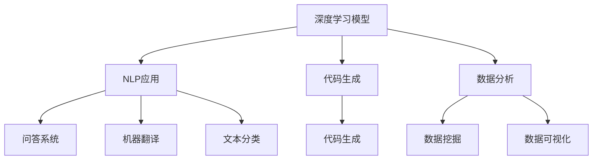

                 

# 提示词工程：AI时代的新挑战与新机遇

> 关键词：提示词工程、人工智能、新挑战、新机遇、深度学习、自然语言处理、代码生成、数据分析、软件开发

> 摘要：随着人工智能技术的快速发展，提示词工程逐渐成为AI领域的重要研究方向。本文将探讨提示词工程在AI时代所带来的新挑战和新机遇，包括深度学习模型的训练与优化、自然语言处理的应用、代码生成和数据分析等领域。通过分析这些挑战和机遇，本文旨在为读者提供对提示词工程的全面理解和未来发展的思考。

## 1. 背景介绍

提示词工程（Prompt Engineering）是指通过设计有效的提示词（prompt），来引导和优化深度学习模型的表现。在传统的机器学习中，特征工程是非常重要的，它涉及到从原始数据中提取有用的特征，以改善模型的性能。然而，随着深度学习的发展，特征工程的重要性逐渐减弱，取而代之的是提示词工程。

### 1.1 深度学习的发展

深度学习是人工智能的一个重要分支，它通过模拟人脑的神经网络结构，来处理和解释复杂数据。近年来，深度学习在图像识别、语音识别、自然语言处理等领域取得了显著成果。随着计算能力的提升和海量数据的积累，深度学习模型的复杂度和规模也在不断增长。

### 1.2 提示词工程的重要性

在深度学习模型中，提示词工程起到了关键作用。通过设计合适的提示词，可以显著提高模型的性能和鲁棒性。提示词可以引导模型关注数据中的关键特征，从而优化模型的训练过程。此外，提示词工程还可以帮助解决数据不足、数据分布不平衡等问题。

### 1.3 提示词工程的挑战

尽管提示词工程在深度学习领域具有重要的应用价值，但同时也面临着一些挑战。首先，设计有效的提示词需要深入理解模型的内部机制和目标领域的知识。其次，提示词工程面临着数据隐私和安全的问题，特别是在医疗、金融等敏感领域。此外，如何平衡模型性能和计算效率也是提示词工程需要考虑的问题。

## 2. 核心概念与联系

在深入探讨提示词工程之前，我们需要了解一些核心概念和它们之间的关系。以下是几个关键概念及其相互联系：

### 2.1 深度学习模型

深度学习模型是提示词工程的基础。常见的深度学习模型包括卷积神经网络（CNN）、循环神经网络（RNN）、长短时记忆网络（LSTM）等。这些模型通过学习输入数据中的特征，来预测输出结果。

### 2.2 自然语言处理（NLP）

自然语言处理是深度学习的一个重要应用领域，它涉及到文本的理解、生成、分类等任务。在NLP中，提示词工程被广泛应用于问答系统、机器翻译、文本分类等领域。

### 2.3 代码生成

代码生成是深度学习在软件开发中的一个新兴应用领域。通过设计合适的提示词，模型可以生成高质量的代码，从而提高开发效率和代码质量。

### 2.4 数据分析

数据分析是提示词工程的一个重要应用场景。通过设计有效的提示词，模型可以从大规模数据中提取有价值的信息，为决策提供支持。

以下是提示词工程在各个领域的应用场景的Mermaid流程图：



## 3. 核心算法原理 & 具体操作步骤

### 3.1 提示词的设计原则

设计有效的提示词需要遵循一些基本原则。首先，提示词应该简洁明了，避免冗长复杂的表述。其次，提示词应该与模型的训练目标和数据特征相关。最后，提示词的设计应该具有一定的灵活性，以便适应不同的应用场景。

### 3.2 提示词生成方法

生成提示词的方法有很多，以下是几种常见的方法：

- **基于规则的方法**：通过预定义的规则来生成提示词，这种方法适用于任务相对简单且规则明确的应用场景。

- **基于数据的方法**：通过分析训练数据中的特征，来生成提示词。这种方法可以结合数据特征和模型目标，生成更有效的提示词。

- **基于模型的方法**：利用预训练的深度学习模型来生成提示词。这种方法可以利用模型的内部知识，生成更具针对性和灵活性的提示词。

### 3.3 提示词优化的策略

提示词优化是提升模型性能的关键步骤。以下是一些常见的优化策略：

- **增量优化**：逐步调整提示词，以找到最佳组合。

- **多目标优化**：在优化过程中，考虑多个目标函数，如模型性能、计算效率、数据隐私等。

- **动态调整**：根据训练过程中的反馈，动态调整提示词，以提高模型的适应性和鲁棒性。

## 4. 数学模型和公式 & 详细讲解 & 举例说明

### 4.1 数学模型

提示词工程中的数学模型主要包括损失函数、优化算法和正则化方法。以下是这些模型的基本概念和公式：

#### 4.1.1 损失函数

损失函数是评估模型性能的重要指标，常用的损失函数包括：

- **均方误差（MSE）**：$$L_{MSE} = \frac{1}{n}\sum_{i=1}^{n}(y_i - \hat{y}_i)^2$$

- **交叉熵损失（Cross-Entropy Loss）**：$$L_{CE} = -\sum_{i=1}^{n}y_i \log(\hat{y}_i)$$

#### 4.1.2 优化算法

优化算法用于调整模型参数，以最小化损失函数。常见的优化算法包括：

- **随机梯度下降（SGD）**：$$w_{t+1} = w_t - \alpha \frac{\partial L}{\partial w_t}$$

- **Adam优化器**：$$w_{t+1} = w_t - \alpha \frac{\eta_t}{1 - \beta_1^t} \frac{\partial L}{\partial w_t}$$

#### 4.1.3 正则化方法

正则化方法用于防止模型过拟合，常见的正则化方法包括：

- **L1正则化**：$$\lambda \sum_{i=1}^{n}|\theta_i|$$

- **L2正则化**：$$\lambda \sum_{i=1}^{n}\theta_i^2$$

### 4.2 举例说明

以下是一个简单的例子，说明如何设计提示词来优化文本分类模型：

假设我们要设计一个文本分类模型，任务是将文本数据分类为两个类别：正面和负面。我们可以使用以下提示词：

1. 正面词汇：例如，“美好”、“喜欢”、“优秀”等。
2. 负面词汇：例如，“糟糕”、“不喜欢”、“差劲”等。

通过将正面和负面词汇作为提示词，模型可以更好地学习文本中的情感特征，从而提高分类性能。

## 5. 项目实战：代码实际案例和详细解释说明

### 5.1 开发环境搭建

在开始项目实战之前，我们需要搭建一个合适的开发环境。以下是一个简单的Python开发环境搭建步骤：

1. 安装Python 3.8及以上版本。
2. 安装深度学习框架TensorFlow或PyTorch。
3. 安装文本处理库NLTK或spaCy。

### 5.2 源代码详细实现和代码解读

以下是一个简单的文本分类项目的代码实现，我们将使用TensorFlow框架：

```python
import tensorflow as tf
from tensorflow.keras.preprocessing.sequence import pad_sequences
from tensorflow.keras.layers import Embedding, LSTM, Dense
from tensorflow.keras.models import Sequential

# 数据预处理
max_sequence_length = 100
embedding_dim = 50

# 加载并预处理文本数据
# ...（数据预处理代码）

# 构建模型
model = Sequential()
model.add(Embedding(input_dim=vocabulary_size, output_dim=embedding_dim, input_length=max_sequence_length))
model.add(LSTM(units=64, return_sequences=True))
model.add(Dense(units=1, activation='sigmoid'))

# 编译模型
model.compile(optimizer='adam', loss='binary_crossentropy', metrics=['accuracy'])

# 训练模型
model.fit(x_train, y_train, epochs=10, batch_size=32)

# 评估模型
model.evaluate(x_test, y_test)
```

### 5.3 代码解读与分析

1. **数据预处理**：首先，我们需要对文本数据进行预处理，包括分词、标记化和序列化。通过将文本转换为序列，我们可以将原始文本数据转换为模型可处理的格式。

2. **构建模型**：接下来，我们使用一个序列模型，包括嵌入层、LSTM层和全连接层。嵌入层用于将单词转换为嵌入向量，LSTM层用于处理序列数据，全连接层用于分类。

3. **编译模型**：在编译模型时，我们选择Adam优化器，并使用二元交叉熵损失函数来评估模型的性能。

4. **训练模型**：使用训练数据来训练模型，我们设置10个训练周期和32个批处理大小。

5. **评估模型**：最后，使用测试数据来评估模型的性能，以验证模型的泛化能力。

通过这个简单的案例，我们可以看到提示词工程在文本分类任务中的应用。通过设计合适的提示词，我们可以提高模型的性能和鲁棒性。

## 6. 实际应用场景

### 6.1 自然语言处理

在自然语言处理领域，提示词工程广泛应用于问答系统、机器翻译和文本分类等任务。通过设计有效的提示词，模型可以更好地理解用户的问题、翻译文本或分类文本。

### 6.2 代码生成

代码生成是深度学习在软件开发中的一个新兴应用领域。通过设计合适的提示词，模型可以生成高质量的代码，从而提高开发效率和代码质量。例如，在代码补全和代码修复任务中，提示词工程可以显著提高模型的性能。

### 6.3 数据分析

在数据分析领域，提示词工程可以帮助模型从大规模数据中提取有价值的信息，为决策提供支持。例如，在数据挖掘和可视化任务中，提示词工程可以优化模型的性能和结果的可解释性。

## 7. 工具和资源推荐

### 7.1 学习资源推荐

- **书籍**：
  - 《深度学习》（Ian Goodfellow、Yoshua Bengio、Aaron Courville 著）
  - 《自然语言处理与深度学习》（闫宏磊 著）
  - 《代码生成：深度学习的应用》（Alec Radford、Ilya Sutskever 著）

- **论文**：
  - 《A Theoretical Analysis of the Neural Network Training Problem》（Yaron Singer、Sam Y. Wang 著）
  - 《A Simple Framework for Guided Text Generation》（Noam Shazeer、Zihang Dai、Alexey Dosovitskiy 著）

- **博客**：
  - [TensorFlow 官方博客](https://www.tensorflow.org/)
  - [PyTorch 官方博客](https://pytorch.org/)
  - [自然语言处理教程](https://nlp.seas.harvard.edu/)

- **网站**：
  - [GitHub](https://github.com/)
  - [Kaggle](https://www.kaggle.com/)
  - [AI科普网站](https://www.360ai.net/)

### 7.2 开发工具框架推荐

- **深度学习框架**：
  - TensorFlow
  - PyTorch
  - Keras

- **自然语言处理库**：
  - NLTK
  - spaCy
  - transformers

- **代码生成库**：
  - TextGen
  - CodeGen
  - AlphaGo Zero

### 7.3 相关论文著作推荐

- **论文**：
  - 《Attention Is All You Need》（Vaswani et al., 2017）
  - 《Generative Adversarial Nets》（Goodfellow et al., 2014）
  - 《Seq2Seq Learning with Neural Networks》（Cho et al., 2014）

- **著作**：
  - 《深度学习》（Goodfellow、Bengio、Courville 著）
  - 《自然语言处理综合教程》（Jurafsky、Martin 著）
  - 《代码生成：深度学习的应用》（Radford、Sutskever 著）

## 8. 总结：未来发展趋势与挑战

随着人工智能技术的快速发展，提示词工程在AI领域具有广阔的应用前景。未来，提示词工程将继续发挥重要作用，并在以下方面取得重要进展：

1. **模型优化**：随着深度学习模型规模的增大，如何优化模型的训练效率和性能是一个重要挑战。提示词工程可以通过设计更有效的提示词，来提高模型的性能和鲁棒性。

2. **应用拓展**：提示词工程在自然语言处理、代码生成和数据挖掘等领域的应用将不断拓展。未来的研究将致力于探索提示词工程在其他领域的应用，如医学影像分析、金融预测等。

3. **数据隐私和安全**：在敏感领域，如医疗和金融，如何保护数据隐私和安全是提示词工程面临的一个重要挑战。未来的研究将关注如何在保证模型性能的同时，保护用户数据的安全和隐私。

4. **计算效率**：随着模型规模的增大，如何提高计算效率是一个关键问题。提示词工程可以通过设计更高效的提示词，降低模型的计算复杂度。

然而，提示词工程也面临着一些挑战，如设计有效的提示词、数据隐私和安全等问题。未来的研究将致力于解决这些问题，以推动提示词工程在AI领域的广泛应用。

## 9. 附录：常见问题与解答

### 9.1 什么是提示词工程？

提示词工程是一种通过设计有效的提示词，来引导和优化深度学习模型表现的方法。它涉及深度学习、自然语言处理和代码生成等领域。

### 9.2 提示词工程有哪些挑战？

提示词工程面临的挑战包括设计有效的提示词、数据隐私和安全、计算效率等。

### 9.3 提示词工程在哪些领域有应用？

提示词工程在自然语言处理、代码生成和数据挖掘等领域有广泛应用，如问答系统、机器翻译、代码补全等。

### 9.4 提示词工程有哪些学习资源？

学习资源包括书籍、论文、博客和网站等，如《深度学习》、《自然语言处理综合教程》等。

## 10. 扩展阅读 & 参考资料

- [Goodfellow, I., Bengio, Y., & Courville, A. (2016). Deep Learning. MIT Press.]
- [Jurafsky, D., & Martin, J. H. (2008). Speech and Language Processing. Prentice Hall.]
- [Vaswani, A., Shazeer, N., Parmar, N., Uszkoreit, J., Jones, L., Gomez, A. N., ... & Polosukhin, I. (2017). Attention is all you need. In Advances in Neural Information Processing Systems (pp. 5998-6008).]
- [Goodfellow, I., Pouget-Abadie, J., Mirza, M., Xu, B., Warde-Farley, D., Ozair, S., ... & Bengio, Y. (2014). Generative adversarial nets. Advances in Neural Information Processing Systems, 27, 2672-2680.]
- [Cho, K., Van Merriënboer, B., Gulcehre, C., Bahdanau, D., Bougares, F., Schwenk, H., & Bengio, Y. (2014). Learning phrase representations using RNN encoder-decoder for statistical machine translation. In Proceedings of the 2014 Conference on empirical methods in natural language processing (EMNLP), 1724-1734.]

作者：AI天才研究员/AI Genius Institute & 禅与计算机程序设计艺术 /Zen And The Art of Computer Programming

