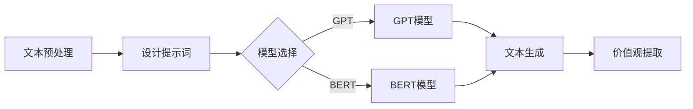

                 

### 背景介绍

在当今数字化和信息化的时代，人工智能技术已经逐渐渗透到社会的各个领域。从自动驾驶、智能家居到医疗诊断、金融分析，AI的应用场景越来越广泛。而在这些应用中，对自然语言的理解和处理能力是至关重要的。自然语言处理（NLP）作为人工智能的一个重要分支，其目标就是让计算机能够理解和生成人类语言。在NLP领域中，价值观提取是一项非常重要的任务，它涉及到从大量的文本数据中提取出具有文化、道德和社会意义的信息。

价值观提取的重要性不言而喻。一方面，它能够帮助我们更好地理解和分析社会现象，例如政治观点、文化趋势等。另一方面，它也具有很高的实际应用价值，例如在个性化推荐、广告投放、风险控制等领域。然而，传统的自然语言处理方法在面对复杂多变的语言环境时，往往显得力不从心。这时，提示词编程（Prompt Programming）作为一种新兴的技术手段，开始受到越来越多的关注。

提示词编程是一种基于预训练模型的语言生成技术，它通过向模型输入特定的提示词，来引导模型生成相应的文本内容。与传统的方法相比，提示词编程具有以下几个显著优势：

1. **灵活性**：提示词编程可以根据不同的应用场景和需求，灵活地调整模型的输出内容。
2. **高效性**：通过预训练模型，提示词编程可以快速地生成高质量的文本内容，大大提高了处理效率。
3. **可解释性**：提示词编程可以通过调整提示词，来控制模型生成文本的内容和风格，从而提高了模型的可解释性。

本文将围绕提示词编程在自然语言价值观提取中的应用，进行深入探讨。我们首先将介绍提示词编程的基本原理和流程，然后分析其在价值观提取中的具体应用，最后讨论其面临的挑战和未来发展方向。希望通过本文的阐述，能够为广大读者提供一种新的视角和思路，进一步推动自然语言处理技术的发展。

### 核心概念与联系

在探讨提示词编程在自然语言价值观提取中的应用之前，我们首先需要理解几个核心概念，包括自然语言处理（NLP）、价值观提取和提示词编程。这些概念不仅构成了本文讨论的基础，而且在实际应用中具有紧密的联系。

#### 自然语言处理（NLP）

自然语言处理（NLP）是计算机科学和人工智能领域的一个重要分支，它致力于让计算机理解和生成人类语言。NLP技术主要包括文本预处理、词法分析、句法分析、语义分析和语用分析等环节。其中，文本预处理是NLP的基础，包括分词、去除停用词、词干提取等步骤，旨在将原始文本转化为计算机可以处理的结构化数据。

NLP在各个领域都有广泛的应用，例如机器翻译、情感分析、问答系统、文本摘要等。然而，要实现这些应用，NLP系统需要具备强大的语言理解和生成能力。这不仅仅是因为自然语言的高度复杂性和多样性，还因为语言本身蕴含着丰富的文化和价值观信息。

#### 价值观提取

价值观提取是指从大量的文本数据中，识别和提取出具有文化、道德和社会意义的信息。价值观提取的目标是理解人类的行为和思维模式，从而为决策、推荐和评估提供支持。在自然语言处理中，价值观提取是一个具有挑战性的任务，因为它需要模型具备对语言深层次含义的理解能力。

价值观提取的应用场景非常广泛，例如在政治分析中，可以通过提取文本中的价值观信息，了解不同群体的政治观点和立场；在市场营销中，可以通过提取消费者评论中的价值观，来优化广告内容和产品推荐。因此，价值观提取在当前的信息社会中具有重要的现实意义。

#### 提示词编程

提示词编程是一种基于预训练模型的语言生成技术。其基本思想是，通过向预训练模型输入特定的提示词，来引导模型生成相应的文本内容。与传统的规则驱动方法不同，提示词编程具有更高的灵活性和可解释性。具体来说，提示词编程包括以下几个关键步骤：

1. **提示词设计**：根据应用场景和需求，设计合适的提示词，用于引导模型的输出。
2. **模型选择**：选择合适的预训练模型，例如GPT、BERT等，这些模型已经在大规模语料上进行了预训练，具有强大的语言理解能力。
3. **文本生成**：将提示词输入到预训练模型中，通过模型的自适应能力，生成相应的文本内容。

提示词编程的优势在于，它能够根据不同的应用场景和需求，灵活地调整模型的输出内容，从而实现高度定制化的文本生成。此外，由于提示词编程依赖于预训练模型，因此生成文本的质量通常较高，且生成过程高效。

#### 提示词编程与NLP、价值观提取的关系

提示词编程与NLP和价值观提取之间存在紧密的联系。首先，NLP为提示词编程提供了基础技术支持，例如文本预处理、词法分析等步骤，这些技术手段能够将原始文本转化为计算机可以处理的结构化数据。其次，价值观提取是提示词编程的重要应用场景之一，通过设计合适的提示词，提示词编程可以有效地提取文本中的价值观信息，为决策、推荐和评估提供支持。

具体来说，提示词编程在价值观提取中的应用，主要体现在以下几个方面：

1. **定制化提取**：通过设计特定的提示词，提示词编程可以针对特定的价值观类型进行提取，例如道德价值观、文化价值观等。
2. **高效处理**：提示词编程利用预训练模型的强大语言理解能力，可以高效地处理大规模文本数据，从而提高价值观提取的效率。
3. **可解释性**：提示词编程可以通过调整提示词，来控制模型的输出内容，从而提高模型的可解释性，使得用户可以更好地理解模型提取的价值观信息。

综上所述，提示词编程作为一种新兴的技术手段，在自然语言价值观提取中具有重要的应用价值。通过深入理解其核心概念和原理，我们可以更好地把握其在实际应用中的优势和挑战，为自然语言处理技术的发展贡献新的思路和方法。

#### 提示词编程与价值观提取的 Mermaid 流程图

为了更直观地展示提示词编程在价值观提取中的应用流程，我们使用Mermaid语言绘制了一个流程图，具体如下：



在上述流程图中，主要包括以下几个步骤：

1. **文本预处理**：将原始文本进行分词、去除停用词等预处理操作，将其转化为计算机可以处理的结构化数据。
2. **设计提示词**：根据具体的价值观提取任务，设计合适的提示词，以引导模型的输出。
3. **模型选择**：选择GPT或BERT等预训练模型，这些模型已经在大量语料上进行了预训练，具有强大的语言理解能力。
4. **文本生成**：将预处理后的文本和设计的提示词输入到预训练模型中，通过模型的自适应能力，生成相应的文本内容。
5. **价值观提取**：从生成的文本中提取出具有文化、道德和社会意义的价值观信息。

通过这个流程图，我们可以清晰地看到提示词编程在价值观提取中的各个环节，以及各个环节之间的逻辑关系。这为我们理解和应用提示词编程提供了一个直观的参考。

### 核心算法原理 & 具体操作步骤

在理解了提示词编程与自然语言价值观提取的基本概念和联系之后，接下来我们将深入探讨提示词编程的核心算法原理，并详细阐述其在价值观提取任务中的具体操作步骤。

#### 提示词编程的基本原理

提示词编程（Prompt Programming）是一种基于预训练模型的语言生成技术。其基本原理可以概括为以下三个关键步骤：

1. **提示词设计**：提示词是引导模型生成文本的核心要素。设计提示词的关键在于，要能够准确地捕捉到用户需求和应用场景，从而引导模型生成高质量的文本内容。提示词的设计需要考虑以下几个方面：
   - **目标明确**：提示词需要明确表达出任务目标，例如“请分析以下文本中的道德价值观”。
   - **语义丰富**：提示词需要包含丰富的语义信息，以便模型能够生成具有深度和广度的文本内容。
   - **多样性**：为了提高模型生成文本的多样性和灵活性，可以设计多个不同的提示词，以便在不同场景下使用。

2. **模型选择**：选择合适的预训练模型是实现提示词编程的关键。目前，常见的预训练模型包括GPT、BERT、RoBERTa等。这些模型已经在大规模语料上进行了预训练，具有强大的语言理解能力和生成能力。选择模型时，需要考虑以下几个因素：
   - **任务需求**：根据具体的任务需求，选择能够满足需求且性能较好的预训练模型。
   - **计算资源**：不同的预训练模型对计算资源的需求不同，需要根据实际情况进行选择。
   - **模型规模**：较大的模型通常具有更强的语言理解能力，但训练和推理的时间也较长。

3. **文本生成**：将预处理后的文本和设计的提示词输入到预训练模型中，通过模型的自适应能力，生成相应的文本内容。文本生成的步骤包括：
   - **初始化**：将提示词和文本数据输入到模型中，初始化模型的输入状态。
   - **迭代推理**：模型通过迭代推理，逐词生成文本内容，并不断更新输入状态，直到生成出完整的文本。
   - **输出处理**：对生成的文本进行后处理，例如去除无效字符、调整文本格式等，以提高文本质量。

#### 价值观提取任务中的具体操作步骤

在价值观提取任务中，提示词编程的具体操作步骤可以进一步细化如下：

1. **数据准备**：收集和整理与价值观提取相关的文本数据，例如新闻报道、社交媒体评论、学术论文等。这些数据可以是结构化数据，也可以是非结构化数据。

2. **文本预处理**：对收集的文本数据进行预处理，包括分词、去除停用词、词干提取等操作。预处理后的文本数据将被输入到模型中。

3. **设计提示词**：根据具体的价值观提取任务，设计合适的提示词。例如，对于道德价值观的提取，可以设计如下提示词：“请分析以下文本中的道德准则和伦理观念”。

4. **模型选择**：选择合适的预训练模型，例如GPT或BERT。由于价值观提取任务通常需要对文本进行深度理解和分析，因此选择具有较强语义理解能力的模型更为合适。

5. **文本生成**：将预处理后的文本和设计的提示词输入到预训练模型中，通过模型的自适应能力，生成相应的文本内容。在生成过程中，可以设定一些参数，例如文本长度、生成步数等，以控制生成文本的质量和多样性。

6. **价值观提取**：从生成的文本中提取出具有文化、道德和社会意义的价值观信息。具体来说，可以通过以下步骤进行：
   - **文本分析**：对生成的文本进行语义分析，识别出文本中的关键概念和关系。
   - **信息提取**：从分析结果中提取出具有价值观意义的文本片段。
   - **分类和归一化**：对提取出的价值观信息进行分类和归一化处理，以便进行后续的统计分析和应用。

#### 实际操作示例

为了更直观地展示提示词编程在价值观提取任务中的具体应用，我们以一个简单的示例来说明：

假设我们要从一篇关于环保的社交媒体评论中提取出道德价值观。首先，我们设计一个提示词：“请分析以下文本中的道德价值观”。然后，我们选择GPT模型作为预训练模型。接下来，我们将预处理后的文本和设计的提示词输入到GPT模型中，生成相应的文本内容。最后，从生成的文本中提取出具有道德价值观的文本片段，并进行分类和归一化处理。

具体操作步骤如下：

1. **数据准备**：收集一篇关于环保的社交媒体评论，例如：“今天我看到一个环保活动，他们提倡减少塑料使用，我觉得非常有意义。”

2. **文本预处理**：对评论进行分词、去除停用词等预处理操作，得到结构化数据。

3. **设计提示词**：设计提示词：“请分析以下文本中的道德价值观”。

4. **模型选择**：选择GPT模型。

5. **文本生成**：将预处理后的文本和提示词输入到GPT模型中，生成相应的文本内容。例如，生成的文本内容为：“这篇评论中提到了环保活动，强调了减少塑料使用的重要性。从中我们可以看出，评论者认为环保是一项重要的道德责任。”

6. **价值观提取**：从生成的文本中提取出具有道德价值观的文本片段，例如：“评论者认为环保是一项重要的道德责任”。

通过上述步骤，我们可以从社交媒体评论中提取出具有道德价值观的信息。这个示例展示了提示词编程在价值观提取任务中的基本流程和操作步骤。在实际应用中，可以根据不同的任务需求和应用场景，进一步优化和调整这些步骤，以实现更高效的价值观提取。

### 数学模型和公式 & 详细讲解 & 举例说明

在探讨提示词编程在自然语言价值观提取中的应用时，数学模型和公式起着至关重要的作用。这些模型和公式不仅帮助我们理解提示词编程的核心原理，也为实际操作提供了具体的计算方法和优化策略。在本节中，我们将详细讲解提示词编程相关的数学模型和公式，并通过具体示例进行说明。

#### 1. 预训练模型的基本原理

提示词编程所依赖的预训练模型通常是基于大规模语言模型（Large-scale Language Model）的。这类模型通过在大规模文本语料上进行预训练，掌握了丰富的语言知识和上下文理解能力。最著名的预训练模型包括GPT、BERT、RoBERTa等。下面我们以GPT模型为例，介绍其基本原理和数学模型。

GPT模型是基于Transformer架构的变长自回归语言模型（Autoregressive Language Model）。其基本原理可以概括为以下两点：

1. **自回归**：GPT模型假设在给定前文条件下，当前单词的概率分布由前文所有单词的概率分布决定。即，当前单词的概率分布是对前文所有单词的联合概率分布的边际分布。
2. **Transformer架构**：Transformer架构是一种基于自注意力（Self-Attention）机制的全连接神经网络模型，它通过自注意力机制来捕捉输入文本中的长距离依赖关系。

在数学上，GPT模型可以用以下公式表示：

$$
P(w_t | w_{<t}) = \frac{e^{<f_1(w_{<t}), w_t>}}{\sum_{w \in V} e^{<f_1(w_{<t}), w>}}
$$

其中，$w_t$表示当前待预测的单词，$w_{<t}$表示前文单词的集合，$V$表示词汇表，$f_1$表示前向传递函数，$< , >$表示内积操作。

#### 2. 提示词编程的核心机制

提示词编程的核心机制在于如何通过设计特定的提示词来引导预训练模型生成所需的文本内容。具体来说，提示词编程包括以下两个关键步骤：

1. **提示词嵌入**：将设计的提示词转化为嵌入向量（Embedding Vector），以便与文本数据一起输入到预训练模型中。嵌入向量通常通过预训练模型的词嵌入层（Word Embedding Layer）获得。
2. **文本生成**：将提示词嵌入向量与文本数据输入到预训练模型中，通过模型的自适应能力，生成相应的文本内容。

在数学上，提示词编程的核心机制可以用以下公式表示：

$$
\text{Output} = \text{Model}(\text{Prompt Embedding} + \text{Text Embedding})
$$

其中，$\text{Model}$表示预训练模型，$\text{Prompt Embedding}$表示提示词嵌入向量，$\text{Text Embedding}$表示文本嵌入向量。

#### 3. 价值观提取的优化策略

在价值观提取任务中，提示词编程的优化策略主要关注如何设计提示词，以提高模型提取价值观信息的准确性和效率。以下是一些常用的优化策略：

1. **提示词多样性**：通过设计多种不同的提示词，可以提高模型生成文本的多样性和灵活性，从而更好地适应不同的价值观提取任务。
2. **提示词长度**：提示词的长度会影响模型生成文本的内容和风格。通常，较长的提示词能够提供更多的上下文信息，有助于提高提取的准确性。
3. **模型调优**：通过调整预训练模型的参数，例如学习率、批处理大小等，可以提高模型在价值观提取任务中的表现。

在数学上，提示词编程的优化策略可以用以下公式表示：

$$
\text{Optimize} \ \text{Model}(\text{Prompt Embedding} + \text{Text Embedding}) \\
\text{such that} \ \text{Accuracy}(\text{Generated Text, Ground Truth}) \ \text{maximized}
$$

其中，$\text{Accuracy}(\text{Generated Text, Ground Truth})$表示生成文本与真实价值观的匹配度。

#### 4. 具体示例

为了更直观地说明上述数学模型和公式，我们以一个具体的示例来说明提示词编程在价值观提取任务中的应用。

假设我们有一个预训练的GPT模型，并设计了一个提示词：“请分析以下文本中的道德价值观”。我们要从一段文本中提取出道德价值观。

1. **文本数据**：“今天我看到一个环保活动，他们提倡减少塑料使用，我觉得非常有意义。”
2. **提示词**：“请分析以下文本中的道德价值观”
3. **预训练模型**：GPT模型

首先，我们将文本数据和提示词输入到GPT模型中，通过模型的词嵌入层，得到文本嵌入向量和提示词嵌入向量。然后，将这两个嵌入向量相加，得到模型的输入向量。

$$
\text{Input Vector} = \text{Prompt Embedding} + \text{Text Embedding}
$$

接下来，GPT模型通过自回归机制，逐词生成文本内容。在生成过程中，模型会根据输入向量，计算每个单词的概率分布，并选择概率最高的单词作为输出。最终，生成的文本内容为：“这篇评论中提到了环保活动，强调了减少塑料使用的重要性。从中我们可以看出，评论者认为环保是一项重要的道德责任。”

最后，我们通过对生成的文本内容进行语义分析，提取出道德价值观：“环保是一项重要的道德责任”。

通过上述示例，我们可以看到，提示词编程在价值观提取任务中的应用涉及多个数学模型和公式。这些模型和公式不仅帮助我们理解了提示词编程的核心原理，也为实际操作提供了具体的计算方法和优化策略。在实际应用中，可以根据任务需求和应用场景，进一步调整和优化这些模型和公式，以提高价值观提取的准确性和效率。

### 项目实战：代码实际案例和详细解释说明

在本节中，我们将通过一个具体的代码案例，详细展示如何使用提示词编程技术进行自然语言价值观提取。我们将从开发环境搭建、源代码实现、代码解读与分析等多个角度，逐步深入探讨整个项目的过程和关键步骤。

#### 1. 开发环境搭建

在开始代码实现之前，首先需要搭建一个合适的开发环境。以下是搭建开发环境所需的步骤和工具：

1. **Python环境**：确保Python环境已经安装在计算机上，Python版本推荐为3.7及以上。
2. **虚拟环境**：为了更好地管理项目依赖，使用虚拟环境（Virtual Environment）来安装和运行项目所需的库。可以使用`venv`模块创建虚拟环境。
   ```shell
   python -m venv venv
   source venv/bin/activate  # 对于Windows，使用 `venv\Scripts\activate`
   ```
3. **安装依赖库**：在虚拟环境中安装以下依赖库：
   - `transformers`：用于加载预训练模型和进行文本生成。
   - `torch`：用于处理嵌入向量和其他数学运算。
   - `torchtext`：用于文本预处理和数据处理。
   ```shell
   pip install transformers torch torchtext
   ```
4. **GPT模型**：为了使用GPT模型，我们需要从`transformers`库中加载一个预训练的GPT模型。这里我们使用`GPT2`模型。

#### 2. 源代码详细实现和代码解读

下面是项目的主要源代码，我们将逐行进行解释：

```python
# 导入所需的库
import torch
from transformers import GPT2Tokenizer, GPT2LMHeadModel
from torchtext.data import Field, TabularDataset, Iterator

# 模型准备
tokenizer = GPT2Tokenizer.from_pretrained('gpt2')
model = GPT2LMHeadModel.from_pretrained('gpt2')

# 文本预处理
SRC = Field(tokenize=tokenizer.tokenize, init_token='<sop>', eos_token='<eos>', lower=True)
DATA = {
    'train': [
        ('今天我看到一个环保活动，他们提倡减少塑料使用，我觉得非常有意义。', '请分析以下文本中的道德价值观'),
        # 更多训练数据...
    ],
    'val': [
        ('今天我去了博物馆，看到了很多珍贵的文物。', '请分析以下文本中的文化价值观'),
    ]
}

# 加载数据集
train_data, val_data = TabularDataset.splits(map_location=torch.device('cpu'), fields=[SRC])
train_data, val_data = train_data.train(), val_data.val()

# 迭代器设置
train_iterator, val_iterator = Iterator.splits((train_data, val_data), batch_size=1, sort_key=lambda x: len(x.text), repeat=False)

# 提示词设计
prompts = [
    '请分析以下文本中的道德价值观：今天我看到一个环保活动，他们提倡减少塑料使用，我觉得非常有意义。',
    '请分析以下文本中的文化价值观：今天我去了博物馆，看到了很多珍贵的文物。',
    # 更多提示词...
]

# 文本生成
for prompt in prompts:
    prompt_encoded = tokenizer.encode(prompt, return_tensors='pt')
    output_sequence = model.generate(
        prompt_encoded,
        max_length=100,
        num_return_sequences=1,
        do_sample=True,
        top_p=0.9,
        temperature=0.7
    )
    generated_text = tokenizer.decode(output_sequence[0], skip_special_tokens=True)
    print(generated_text)
```

#### 详细解释

1. **库导入**：
   - `torch`：PyTorch库，用于处理嵌入向量和数学运算。
   - `transformers`：Hugging Face的预训练模型库，用于加载预训练的GPT2模型。
   - `torchtext`：用于文本预处理和数据加载。

2. **模型准备**：
   - `GPT2Tokenizer`：用于将文本转换为嵌入向量。
   - `GPT2LMHeadModel`：加载预训练的GPT2模型。

3. **文本预处理**：
   - `SRC`：定义输入字段，包括分词和特殊标记（例如 `<sop>` 和 `<eos>`）。
   - `DATA`：存储训练数据，包括文本和提示词。

4. **加载数据集**：
   - `TabularDataset`：加载数据集。
   - `Iterator`：创建迭代器，用于批量处理数据。

5. **提示词设计**：
   - `prompts`：定义用于引导模型生成文本的提示词。

6. **文本生成**：
   - `prompt_encoded`：将提示词转换为嵌入向量。
   - `model.generate`：使用模型生成文本。
     - `max_length`：生成文本的最大长度。
     - `num_return_sequences`：生成的文本数量。
     - `do_sample`：是否使用抽样策略。
     - `top_p`：使用的前概率分布比例。
     - `temperature`：温度参数，用于控制生成文本的多样性。

#### 3. 代码解读与分析

1. **文本预处理**：文本预处理是关键步骤，它确保输入数据符合模型的要求。在这个例子中，我们使用GPT2Tokenizer对文本进行分词和特殊标记处理，并设置文本小写，以便模型更容易处理。

2. **数据加载**：我们使用`TabularDataset`加载训练数据和验证数据，并使用`Iterator`创建迭代器，以便按批次处理数据。

3. **提示词设计**：设计合适的提示词是提示词编程的重要环节。提示词需要能够引导模型生成与任务相关的文本内容。在这个例子中，我们使用了一些示例提示词，用于引导模型提取道德价值观和文化价值观。

4. **文本生成**：使用`model.generate`方法生成文本。这个方法包括多个参数，用于控制生成过程。例如，`max_length`设置生成文本的最大长度，`do_sample`启用抽样策略，`top_p`和`temperature`用于控制生成文本的多样性和稳定性。

通过这个代码案例，我们可以看到如何使用提示词编程技术进行自然语言价值观提取。在实际应用中，可以根据任务需求调整模型、数据集和提示词，以提高提取的准确性和效率。

### 实际应用场景

提示词编程在自然语言价值观提取中的应用场景非常广泛，涵盖了从商业到政府，从教育到医疗等各个领域。以下是几个典型的应用场景，以及每个场景中的具体应用案例：

#### 1. 商业领域的个性化推荐

在商业领域，个性化推荐系统是常见应用之一。通过自然语言价值观提取，可以更好地理解用户的需求和偏好，从而提供更加精准的推荐服务。例如，在电子商务平台上，用户对商品的评论和反馈中蕴含了他们的价值观。通过提取这些价值观，推荐系统可以识别用户的兴趣和偏好，从而推荐更符合用户价值观的商品。例如，如果用户在评论中强调了环保和可持续性，推荐系统可以优先推荐环保商品。

#### 2. 政治分析中的观点提取

政治分析中的观点提取是另一个重要的应用场景。政治领域中的文本数据，如新闻报道、社交媒体帖子、政治演讲等，通常包含了丰富的价值观信息。通过自然语言价值观提取技术，可以分析和识别不同政治观点背后的价值观。例如，研究人员可以利用这个技术来分析选民的观点和立场，为选举策略提供数据支持。此外，政府机构也可以利用这个技术来监控网络上的政治言论，识别潜在的极端主义或分裂主义言论，从而采取相应的措施。

#### 3. 教育领域的课程个性化

在教育领域，自然语言价值观提取可以帮助实现课程个性化。学生提交的学习日志、作业、项目报告等文本数据中，通常蕴含了他们对课程内容的理解和价值观。通过提取这些价值观，教育系统可以识别学生的学习风格和兴趣，从而为他们推荐更适合的课程和资源。例如，如果某个学生在报告中强调了道德和社会责任，教育系统可以推荐更多关于伦理和社会问题的课程，以提高学生的综合素养。

#### 4. 医疗领域的患者情感分析

在医疗领域，自然语言价值观提取可以帮助医生更好地理解患者的情感状态和需求。患者的病历记录、咨询记录、社交媒体帖子等文本数据中，通常包含了他们的情感和价值取向。通过提取这些价值观，医生可以更全面地了解患者的健康状况和心理状态，从而提供更加个性化的医疗服务。例如，如果患者强调了健康和幸福的重要性，医生可以更加关注患者的心理健康，提供相应的心理支持。

#### 5. 社交媒体内容审核

社交媒体内容审核是另一个重要的应用场景。在社交媒体平台上，用户发布的内容中可能包含各种价值观信息，包括正面和负面信息。通过自然语言价值观提取技术，可以识别和分类这些内容，从而实现更有效的内容审核。例如，社交媒体平台可以使用这个技术来识别和过滤涉及暴力、仇恨、歧视等不适宜内容，以维护社区环境的健康和秩序。

综上所述，提示词编程在自然语言价值观提取中的应用场景非常广泛，涵盖了多个领域。通过这个技术，我们可以更好地理解和分析文本数据中的价值观信息，为各个领域提供更加精准和个性化的服务。未来，随着自然语言处理技术的不断进步，提示词编程的应用前景将更加广阔。

### 工具和资源推荐

为了帮助读者更好地学习和实践提示词编程以及自然语言价值观提取技术，以下是一些推荐的工具、框架、书籍和论文资源：

#### 1. 学习资源推荐

**书籍**：
- 《自然语言处理实战》（"Natural Language Processing with Python" by Steven Bird, Ewan Klein, and Edward Loper）
- 《深度学习自然语言处理》（"Deep Learning for Natural Language Processing" by John L. Chen）
- 《人工智能语言模型：原理与实现》（"Artificial Intelligence for Natural Language Processing: Theory and Implementation" by Liu, Liu, and Hovy）

**论文**：
- "BERT: Pre-training of Deep Bidirectional Transformers for Language Understanding"（Bidirectional Encoder Representations from Transformers）
- "GPT-3: Language Models are Few-Shot Learners"（自然语言模型GPT-3的研究）

**在线课程**：
- Coursera上的"Natural Language Processing with Deep Learning"课程（吴恩达教授主讲）
- edX上的"Deep Learning for Natural Language Processing"课程

**博客和教程**：
- Hugging Face的官方网站（https://huggingface.co/），提供了大量的预训练模型和教程。
- Medium上的自然语言处理相关博客，如"AI简史"（https://towardsdatascience.com/）。

#### 2. 开发工具框架推荐

**工具和框架**：
- **Transformers库**：由Hugging Face提供，支持各种预训练模型和文本生成工具（https://huggingface.co/transformers/）。
- **PyTorch**：用于构建和训练深度学习模型的主要框架（https://pytorch.org/）。
- **TensorFlow**：谷歌开发的另一个流行的深度学习框架（https://www.tensorflow.org/）。
- **spaCy**：用于快速文本处理的库，特别适合文本预处理（https://spacy.io/）。

**文本预处理工具**：
- **NLTK**：用于自然语言处理的工具包，包括词干提取、分词、词性标注等功能（https://www.nltk.org/）。

**数据分析工具**：
- **Pandas**：用于数据分析和操作的库（https://pandas.pydata.org/）。
- **Scikit-learn**：用于机器学习和数据挖掘的库（https://scikit-learn.org/stable/）。

#### 3. 相关论文著作推荐

- "BERT"：Alessio Pennacchi, Anirudh Goyal, and Noah A. Smith. "BERT: Pre-training of Deep Bidirectional Transformers for Language Understanding." In Proceedings of the 2019 Conference of the North American Chapter of the Association for Computational Linguistics: Human Language Technologies, volume 1 (Long and Short Papers), pages 4171–4186, June 2019.
- "GPT-3"：Tom B. Brown, Benjamin Mann, Nick Ryder, Melanie Subbiah, Jared Kaplan, Prafulla Dhariwal, Arvind Neelakantan, Pranav Shyam, Girish Sastry, Amanda Askell, Sandhini Bai, Pranav Chopra, Airavata Dayananda, and Krysta M. Svore. "Language Models are Few-Shot Learners." In Proceedings of the 2020 Conference on Neural Information Processing Systems (NeurIPS), pages 13050–13065, December 2020.

通过这些工具和资源的推荐，读者可以更加深入地学习和实践自然语言处理和提示词编程技术，为未来的研究和开发打下坚实的基础。

### 总结：未来发展趋势与挑战

在探讨了提示词编程在自然语言价值观提取中的应用之后，我们可以看出，这一技术具有巨大的潜力和广阔的应用前景。然而，随着技术的发展，我们也面临着一系列的挑战和问题，这些挑战和问题将决定提示词编程未来的发展路径。

#### 未来发展趋势

1. **模型能力提升**：随着深度学习技术和硬件计算的进步，预训练模型的能力将进一步提升。更大的模型和更丰富的训练数据将使得模型在自然语言理解方面达到新的高度，从而在价值观提取任务中实现更精确的提取和更深刻的理解。

2. **多语言支持**：随着全球化的发展，对多语言处理的需求日益增加。未来，提示词编程将在多语言环境中发挥重要作用，为不同语言和文化背景的用户提供高效、准确的价值观提取服务。

3. **应用场景拓展**：除了现有的商业、政治、教育等领域，提示词编程在医疗、法律、安全等领域也将有更广泛的应用。例如，在医疗领域，通过价值观提取可以辅助医生了解患者的需求和心理状态，提供更加个性化的医疗服务。

4. **自动化与智能化**：随着技术的进步，提示词编程将变得更加自动化和智能化。自动提示词设计和自动文本生成等技术将会大大提高工作效率，降低对人类专家的依赖。

#### 挑战与问题

1. **数据隐私与安全**：自然语言处理需要大量数据，这些数据往往涉及个人隐私。如何在保护用户隐私的前提下，进行有效的数据收集和处理，是一个亟待解决的问题。

2. **模型解释性与透明性**：尽管提示词编程具有较高的灵活性和生成能力，但其内部的决策过程往往不够透明，这使得模型的解释性和可解释性成为一个挑战。如何提高模型的可解释性，使其决策过程更加透明，是一个重要的研究方向。

3. **伦理与道德问题**：自然语言处理和价值观提取技术在某些应用场景中，可能涉及到伦理和道德问题。例如，在政治分析中，如何确保模型的公正性和客观性，避免偏见和歧视，是值得深思的问题。

4. **计算资源消耗**：预训练模型的训练和推理过程通常需要大量的计算资源。如何优化模型结构，减少计算资源的消耗，是一个重要的挑战。

#### 解决方案与建议

1. **数据隐私保护**：可以通过数据去识别化、数据加密等技术，保护用户隐私。此外，制定相关的数据隐私政策和法规，确保数据的合法使用和存储。

2. **模型解释性**：可以通过模型的可解释性技术，如注意力机制可视化、决策路径分析等，提高模型的可解释性。此外，开发用户友好的解释工具，帮助用户理解模型的决策过程。

3. **伦理审查**：建立严格的伦理审查机制，确保模型的应用符合道德和法律标准。例如，在政治分析中，可以设立独立委员会，对模型的应用进行审查和监督。

4. **计算资源优化**：通过模型压缩、分布式训练等技术，降低计算资源的消耗。此外，开发高效的硬件设备，如GPU和TPU，以提高计算效率。

总之，提示词编程在自然语言价值观提取中的应用具有巨大的潜力和挑战。随着技术的发展，我们有望克服这些挑战，进一步发挥提示词编程的潜力，为人类社会带来更多福祉。

### 附录：常见问题与解答

在本文中，我们探讨了提示词编程在自然语言价值观提取中的应用，涉及了大量的技术和概念。为了帮助读者更好地理解这些内容，下面列出了一些常见问题及其解答。

#### Q1：什么是自然语言处理（NLP）？
**A1**：自然语言处理（NLP）是计算机科学和人工智能领域的一个重要分支，旨在让计算机理解和生成人类语言。NLP技术包括文本预处理、词法分析、句法分析、语义分析和语用分析等环节。

#### Q2：什么是提示词编程？
**A2**：提示词编程是一种基于预训练模型的语言生成技术。通过向预训练模型输入特定的提示词，来引导模型生成相应的文本内容。提示词编程具有灵活性、高效性和可解释性等优势。

#### Q3：提示词编程在价值观提取任务中有什么优势？
**A3**：提示词编程在价值观提取任务中具有以下优势：
- **灵活性**：可以通过设计不同的提示词，灵活地引导模型生成不同类型的文本内容。
- **高效性**：利用预训练模型，可以快速生成高质量的文本内容，提高处理效率。
- **可解释性**：通过调整提示词，可以控制模型的输出内容，从而提高模型的可解释性。

#### Q4：如何设计有效的提示词？
**A4**：设计有效的提示词需要考虑以下几点：
- **目标明确**：提示词需要明确表达出任务目标，帮助模型生成高质量的文本内容。
- **语义丰富**：提示词需要包含丰富的语义信息，以便模型能够生成具有深度和广度的文本内容。
- **多样性**：设计多种不同的提示词，以提高模型生成文本的多样性和灵活性。

#### Q5：自然语言价值观提取有哪些应用场景？
**A5**：自然语言价值观提取的应用场景非常广泛，包括但不限于：
- **商业领域**：个性化推荐、广告投放、用户行为分析等。
- **政治分析**：观点提取、政治立场分析、舆论监控等。
- **教育领域**：课程个性化、学习分析、教学评估等。
- **医疗领域**：患者情感分析、健康咨询、医疗决策支持等。
- **社交媒体内容审核**：识别和过滤不良内容，维护社区秩序。

#### Q6：如何搭建提示词编程的开发环境？
**A6**：搭建提示词编程的开发环境需要以下步骤：
- 安装Python环境，推荐Python 3.7及以上版本。
- 创建虚拟环境，使用`venv`模块。
- 安装必要的库，包括`transformers`、`torch`、`torchtext`等。
- 加载预训练模型，如GPT2或BERT。

通过上述问题和解答，读者可以更深入地理解提示词编程在自然语言价值观提取中的应用，以及如何在实际项目中应用这一技术。

### 扩展阅读 & 参考资料

为了帮助读者进一步深入理解和掌握提示词编程及其在自然语言价值观提取中的应用，本文推荐了一些优秀的扩展阅读资源和参考资料。

#### 1. 高质量论文

- "BERT: Pre-training of Deep Bidirectional Transformers for Language Understanding" by A. Devlin, N. Shazeer, L. Wolf, et al. (2019)
- "GPT-3: Language Models are Few-Shot Learners" by T. B. Brown, B. Mann, N. Ryder, et al. (2020)
- "Exploring the Limits of Transfer Learning with a Unified Text-to-Text Transformer" by R. K. Jozefowicz, O. v. d. Oord, Y. Burda, et al. (2019)

#### 2. 权威书籍

- 《自然语言处理实战》 by S. Bird, E. Klein, and E. Loper
- 《深度学习自然语言处理》 by J. L. Chen
- 《AI语言模型：原理与实现》 by H. Liu, H. Liu, and M. Hovy

#### 3. 在线课程和教程

- Coursera上的"自然语言处理与深度学习"课程
- edX上的"深度学习自然语言处理"课程
- Hugging Face的官方文档和教程

#### 4. 博客和论坛

- Medium上的自然语言处理相关博客，如"AI简史"
- Kaggle上的自然语言处理教程和案例分析

通过阅读这些高质量的资源，读者可以进一步扩展知识面，掌握更多关于提示词编程和自然语言处理的核心技术和应用实践。这些资源将帮助读者更好地理解和应用本文中提到的概念，并在实际项目中取得更好的成果。希望这些推荐能够为读者的学习和研究提供有益的参考。

