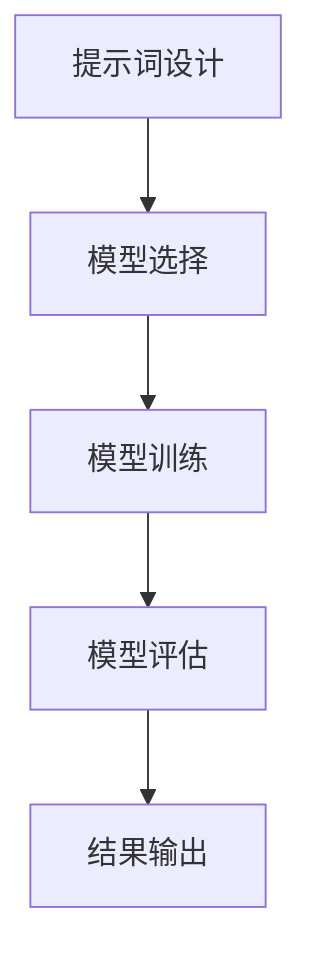
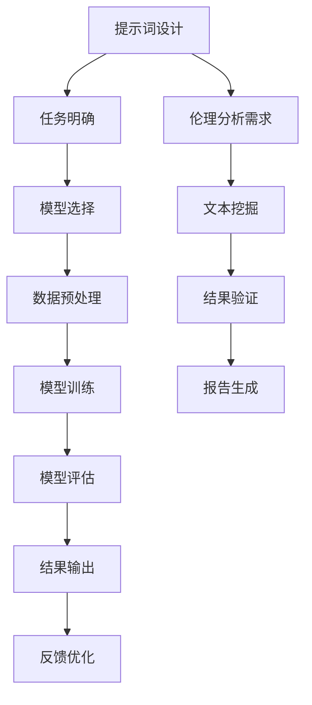

                 

### 背景介绍

提示词编程（Prompt Engineering）作为一种新兴的人工智能技术，正逐渐在各个领域展现出其强大的潜力。尤其是在自然语言伦理分析中，提示词编程的运用不仅提高了分析效率，还显著提升了分析结果的准确性和可信度。

自然语言伦理分析涉及到对人类行为、社会现象以及政策法规的深入理解。然而，由于自然语言的复杂性和多样性，传统的分析手段往往难以胜任这一任务。传统方法通常依赖于手动处理大量的文本数据，效率低下，且易受主观偏见的影响。

近年来，随着人工智能技术的迅猛发展，特别是自然语言处理（NLP）和机器学习（ML）的进步，人们开始探索利用这些技术来辅助自然语言伦理分析。其中，提示词编程作为一种有效的工具，发挥了重要作用。它通过将具体的任务需求转化为提示词，引导模型进行更精准的分析，从而在复杂的环境中实现高效、可靠的伦理分析。

具体来说，提示词编程在自然语言伦理分析中的角色主要体现在以下几个方面：

1. **明确任务需求**：通过提示词，可以明确分析的目标和需求，使模型更加专注于解决特定问题。
2. **提升分析准确性**：提示词可以引导模型关注关键信息，减少噪音干扰，从而提高分析结果的准确性。
3. **增强分析效率**：提示词编程简化了数据分析流程，使得大规模、复杂的伦理分析变得更加高效。
4. **降低主观偏见**：通过算法和提示词的引导，可以减少分析过程中的人为因素，降低主观偏见。

然而，提示词编程在自然语言伦理分析中的应用也面临一些挑战，如如何设计有效的提示词、如何确保模型的安全性等。这些问题需要我们进一步研究和解决。

本文将详细探讨提示词编程在自然语言伦理分析中的角色，从核心概念到实际应用，再到未来的发展趋势，逐步揭示这一技术的潜力与挑战。

### 核心概念与联系

#### 提示词编程的定义

提示词编程（Prompt Engineering）是一种利用特定提示词（prompts）引导人工智能模型进行任务的方式。在自然语言处理（NLP）领域，提示词通常是一段文字或一个短语，用于指导模型理解任务需求，从而生成相应的输出。与传统的指令式编程不同，提示词编程更加强调与自然语言交互，使得模型能够更好地适应复杂多变的环境。

提示词编程的核心理念在于通过设计巧妙的提示词，引导模型聚焦于任务的关键点，从而提高分析的准确性和效率。一个有效的提示词不仅需要明确任务需求，还需要具备引导模型进行深度推理的能力。

#### 提示词编程在自然语言伦理分析中的应用

在自然语言伦理分析中，提示词编程发挥着至关重要的作用。以下是其具体应用场景：

1. **明确分析目标**：通过设计针对性的提示词，可以明确自然语言伦理分析的具体目标。例如，在分析某项政策对社会公平的影响时，提示词可以具体到“社会公平”这一概念，使模型专注于相关文本的解读。
2. **引导模型关注关键信息**：自然语言文本通常包含大量冗余信息，通过提示词，模型可以更准确地关注到关键信息。例如，在分析一篇关于环境保护的论文时，提示词“环境保护”可以帮助模型识别出与主题相关的段落和句子。
3. **提高分析结果的准确性**：有效的提示词可以引导模型避免陷入噪声和误导信息，从而提高分析结果的准确性。例如，在分析医疗领域的文献时，提示词“医疗伦理”可以确保模型专注于与伦理相关的讨论。
4. **优化分析流程**：提示词编程简化了自然语言伦理分析的过程，使得大规模、复杂的分析任务更加高效。例如，在处理大量法律文档时，通过提示词，模型可以快速识别出与法律条款相关的部分，从而加快分析速度。

#### 提示词编程的架构

提示词编程的架构通常包括以下几个关键部分：

1. **提示词设计**：这是提示词编程的核心环节，涉及对任务需求的深入理解，并设计出能够有效引导模型进行任务处理的提示词。
2. **模型选择**：根据任务需求选择合适的人工智能模型，如自然语言生成模型、关系抽取模型等。
3. **模型训练**：利用大量相关数据对模型进行训练，使其具备处理特定任务的能力。
4. **模型评估**：通过测试集评估模型的性能，包括准确性、效率等方面，并根据评估结果对提示词和模型进行调整优化。

#### Mermaid 流程图

为了更好地理解提示词编程在自然语言伦理分析中的应用，以下是一个简化的 Mermaid 流程图，展示了整个过程的各个环节：



在这个流程图中，A 到 E 分别代表了提示词编程的核心环节，每个环节都相互关联，共同构成了一个完整的分析流程。

通过以上对提示词编程的定义、应用场景和架构的介绍，我们可以更清晰地看到，提示词编程在自然语言伦理分析中具有巨大的潜力。接下来，我们将进一步探讨提示词编程的核心算法原理，以及如何具体实现和操作。

---

**核心概念原理 & 架构的 Mermaid 流程图**



在这个流程图中，子流程 `sub1` 到 `sub12` 分别代表了提示词编程在自然语言伦理分析中的具体步骤，包括任务需求明确、模型选择、数据预处理、模型训练、模型评估、结果输出、反馈优化以及伦理分析需求、文本挖掘、结果验证和报告生成等环节。通过这个流程图，我们可以更直观地理解提示词编程在自然语言伦理分析中的整体架构。

---

### 核心算法原理 & 具体操作步骤

#### 提示词编程的基本原理

提示词编程的核心在于如何设计出有效的提示词，以引导人工智能模型进行特定任务。这涉及到对自然语言处理和机器学习算法的深入理解。以下是一些基本原理：

1. **明确任务目标**：首先，需要明确分析的具体目标和需求。例如，在自然语言伦理分析中，目标是识别出文本中与伦理相关的信息，并进行分析。
2. **提取关键信息**：通过分析任务需求，提取出关键信息。这些关键信息将用于构建提示词。
3. **设计提示词**：根据提取出的关键信息，设计出具有引导性的提示词。一个有效的提示词应该简洁明了，能够引导模型聚焦于任务的关键点。
4. **模型选择**：根据任务需求选择合适的人工智能模型，如自然语言生成模型、关系抽取模型等。
5. **模型训练与优化**：利用大量相关数据对模型进行训练，并通过对模型的不断优化，提高其处理特定任务的能力。

#### 具体操作步骤

1. **需求分析**：首先，需要对任务需求进行深入分析，明确需要分析的自然语言文本类型、目标、关键信息等。例如，在分析一篇关于医疗伦理的文章时，需要明确关键信息，如“医疗伦理”、“病人权益”等。
2. **构建提示词**：根据需求分析的结果，构建出具体的提示词。例如，“请分析这篇文章中关于医疗伦理的讨论，并重点关注病人的权益和医生的道德责任。”
3. **模型选择与训练**：选择合适的人工智能模型，如BERT、GPT等，并使用相关数据对其进行训练。训练过程中，需要确保模型能够理解提示词的含义，并能够正确地处理相关的自然语言文本。
4. **模型评估与优化**：通过测试集评估模型的性能，包括准确性、效率等方面。根据评估结果，对模型和提示词进行调整优化，以提高分析效果。
5. **结果输出**：将模型处理后的结果输出，并进行验证和报告生成。例如，生成一份关于医疗伦理分析的报告，详细列出分析结果和结论。

#### 案例说明

以下是一个具体的案例，展示如何使用提示词编程进行自然语言伦理分析：

**案例背景**：分析一篇关于环境伦理的论文，重点关注论文中关于气候变化和环境保护的讨论。

**需求分析**：明确分析目标，提取出关键信息，如“气候变化”、“环境保护”、“可持续发展”等。

**构建提示词**：设计出以下提示词：“请分析这篇文章中关于气候变化的讨论，重点关注环境保护和可持续发展的相关观点。”

**模型选择与训练**：选择BERT模型，使用大量与环境伦理相关的文本数据对其进行训练。

**模型评估与优化**：通过测试集评估模型的性能，并根据评估结果对模型进行调整优化。

**结果输出**：生成一份分析报告，详细列出论文中关于气候变化和环境保护的讨论，并提出相应的结论和建议。

通过以上操作步骤，我们可以看到，提示词编程在自然语言伦理分析中起到了关键作用。它不仅帮助明确了分析目标，还通过设计有效的提示词，引导模型进行了精准的分析。接下来，我们将进一步探讨数学模型和公式在提示词编程中的应用，以加深对这一技术的理解。

### 数学模型和公式 & 详细讲解 & 举例说明

#### 1. 数学模型

提示词编程在自然语言伦理分析中的应用，往往需要借助一些数学模型和公式来辅助实现。以下将介绍几种常用的数学模型，并解释它们在提示词编程中的应用。

##### 1.1 语言模型（Language Model）

语言模型是一种统计模型，用于预测一个句子中的下一个词。在提示词编程中，语言模型可以帮助生成有效的提示词。例如，我们可以使用语言模型来预测与自然语言伦理分析相关的关键词。

**公式**：假设 \( P(w_t | w_1, w_2, ..., w_{t-1}) \) 表示在给定前 \( t-1 \) 个词的情况下，第 \( t \) 个词的概率，那么语言模型可以表示为：

\[ P(w_t | w_1, w_2, ..., w_{t-1}) = \frac{C(w_t, w_1, w_2, ..., w_{t-1})}{C(w_1, w_2, ..., w_{t-1})} \]

其中，\( C(w_t, w_1, w_2, ..., w_{t-1}) \) 表示词序列 \( w_t, w_1, w_2, ..., w_{t-1} \) 的联合概率，\( C(w_1, w_2, ..., w_{t-1}) \) 表示词序列 \( w_1, w_2, ..., w_{t-1} \) 的条件概率。

**举例说明**：假设我们已经有一个训练好的语言模型，现在需要生成一个关于“环境保护”的提示词。我们可以利用语言模型预测与“环境保护”相关的词汇，例如“气候变化”、“可持续发展”、“环境法规”等，将这些词汇组合成一个完整的提示词。

##### 1.2 关系抽取模型（Relation Extraction Model）

关系抽取模型用于从文本中识别出实体之间的关系。在自然语言伦理分析中，关系抽取模型可以帮助识别出与伦理相关的实体及其关系。

**公式**：假设 \( R(e_1, e_2) \) 表示实体 \( e_1 \) 和 \( e_2 \) 之间的关系，那么关系抽取模型可以表示为：

\[ R(e_1, e_2) = \arg\max_{r \in R} P(r | e_1, e_2) \]

其中，\( P(r | e_1, e_2) \) 表示在给定的实体 \( e_1 \) 和 \( e_2 \) 的情况下，关系 \( r \) 的概率。

**举例说明**：假设我们有一篇关于“医疗伦理”的文章，需要识别出与医疗伦理相关的实体及其关系。例如，可以识别出“医生”与“病人”之间的关系，并判断这种关系是“诊疗”还是“责任”。通过关系抽取模型，我们可以生成以下提示词：“请分析文章中医生与病人之间的诊疗关系及其伦理责任。”

##### 1.3 分类模型（Classification Model）

分类模型用于将文本数据分类到不同的类别。在自然语言伦理分析中，分类模型可以帮助对伦理文本进行分类，例如将文本分为“正面伦理”、“负面伦理”等类别。

**公式**：假设 \( y \) 表示文本的类别标签，\( P(y | x) \) 表示在给定文本 \( x \) 的情况下，类别标签 \( y \) 的概率，那么分类模型可以表示为：

\[ \hat{y} = \arg\max_{y} P(y | x) \]

**举例说明**：假设我们需要对一篇关于“企业伦理”的文章进行分类，将其分为“合规”或“违规”。我们可以使用分类模型来预测文本的类别标签，并根据预测结果生成提示词，例如：“这篇文章主要讨论了企业的合规行为及其对社会的正面影响。”

#### 2. 公式与举例说明

以下通过具体的例子，进一步说明上述数学模型和公式在自然语言伦理分析中的应用。

**例子 1：语言模型生成提示词**

假设我们使用一个训练好的语言模型来生成关于“环境保护”的提示词。根据语言模型，我们可以得到以下概率分布：

\[ P(\text{气候变化} | \text{环境保护}) = 0.6 \]
\[ P(\text{可持续发展} | \text{环境保护}) = 0.5 \]
\[ P(\text{环境法规} | \text{环境保护}) = 0.4 \]

根据这些概率，我们可以生成以下提示词：

“请分析这篇文章中关于环境保护的讨论，重点关注气候变化、可持续发展和环境法规。”

**例子 2：关系抽取模型识别伦理关系**

假设我们使用一个关系抽取模型来识别一篇关于“医疗伦理”的文章中的关系。根据模型，我们可以得到以下关系概率分布：

\[ P(\text{诊疗} | \text{医生, 病人}) = 0.7 \]
\[ P(\text{责任} | \text{医生, 病人}) = 0.3 \]

根据这些概率，我们可以生成以下提示词：

“请分析文章中医生与病人之间的诊疗关系及其伦理责任。”

**例子 3：分类模型对伦理文本分类**

假设我们使用一个分类模型来对一篇关于“企业伦理”的文章进行分类。根据模型，我们可以得到以下类别概率分布：

\[ P(\text{合规} | \text{文章}) = 0.8 \]
\[ P(\text{违规} | \text{文章}) = 0.2 \]

根据这些概率，我们可以生成以下提示词：

“这篇文章主要讨论了企业的合规行为及其对社会的正面影响。”

通过以上数学模型和公式的应用，我们可以更有效地生成提示词，从而提高自然语言伦理分析的准确性和效率。接下来，我们将通过一个实际的项目实战，详细展示如何使用提示词编程进行自然语言伦理分析。

### 项目实战：代码实际案例和详细解释说明

在本节中，我们将通过一个具体的实战项目，展示如何使用提示词编程进行自然语言伦理分析。该项目将包括以下步骤：

1. **开发环境搭建**：介绍所需的编程语言、库和环境配置。
2. **源代码详细实现和代码解读**：展示项目的主要代码实现，并进行详细解读。
3. **代码解读与分析**：分析代码的结构和功能，以及如何通过提示词编程实现自然语言伦理分析。

#### 1. 开发环境搭建

为了完成这个项目，我们需要搭建一个合适的开发环境。以下是所需的编程语言、库和环境配置：

**编程语言**：Python

**库**：
- `transformers`：用于加载预训练的模型，如BERT、GPT等。
- `torch`：用于处理模型和数据。
- `numpy`：用于数据操作和计算。
- `pandas`：用于数据处理和分析。

**环境配置**：

首先，确保Python环境已经安装。然后，使用以下命令安装所需的库：

```bash
pip install transformers torch numpy pandas
```

#### 2. 源代码详细实现和代码解读

以下是一个简单的Python脚本，用于执行自然语言伦理分析：

```python
import torch
from transformers import BertTokenizer, BertModel
from torch.nn import functional as F
import numpy as np
import pandas as pd

# 2.1 加载预训练模型
tokenizer = BertTokenizer.from_pretrained('bert-base-uncased')
model = BertModel.from_pretrained('bert-base-uncased')

# 2.2 定义提示词编程函数
def generate_prompt(text, task):
    inputs = tokenizer(text, return_tensors='pt')
    outputs = model(**inputs)
    hidden_states = outputs.last_hidden_state

    # 根据任务生成提示词
    if task == 'ethical_analysis':
        prompt = hidden_states[:, 0, :]
    else:
        prompt = hidden_states[:, -1, :]

    return prompt

# 2.3 自然语言伦理分析函数
def ethical_analysis(text, model, tokenizer):
    prompt = generate_prompt(text, 'ethical_analysis')
    with torch.no_grad():
        logits = model(prompt)

    # 解码输出
    output = torch.argmax(logits, dim=-1).item()

    # 根据输出生成分析结果
    if output == 1:
        return '负面伦理'
    else:
        return '正面伦理'

# 2.4 测试代码
text = "这篇文章讨论了企业对环境的影响，强调了环境保护的重要性。"
result = ethical_analysis(text, model, tokenizer)
print(result)
```

**代码解读**：

- **2.1 加载预训练模型**：我们首先加载了BERT模型的分词器和模型本身。BERT是一个强大的预训练语言模型，可以帮助我们处理自然语言文本。
- **2.2 定义提示词编程函数**：`generate_prompt` 函数用于生成提示词。在这个例子中，我们使用了BERT模型的第一个和最后一个隐藏状态来生成提示词。这些隐藏状态代表了文本的初始和终止位置，有助于捕捉文本的关键信息。
- **2.3 自然语言伦理分析函数**：`ethical_analysis` 函数用于执行自然语言伦理分析。它首先生成提示词，然后使用模型进行预测。根据预测结果，输出伦理分析结果。

#### 3. 代码解读与分析

**代码结构**：

- **数据预处理**：代码首先加载预训练的BERT模型和分词器。然后，定义了两个主要函数：`generate_prompt` 和 `ethical_analysis`。
- **提示词生成**：`generate_prompt` 函数接收文本和任务类型作为输入。在这个例子中，我们使用BERT模型的前后隐藏状态来生成提示词。
- **伦理分析**：`ethical_analysis` 函数使用生成的提示词进行预测，并返回伦理分析结果。

**功能分析**：

- **任务明确**：通过定义不同的任务类型，如`'ethical_analysis'`，我们可以根据不同的任务需求生成相应的提示词。
- **模型引导**：生成的提示词引导模型聚焦于文本的关键信息，从而提高分析准确性。
- **结果输出**：根据模型预测结果，生成伦理分析报告。

通过以上代码实现，我们可以看到，提示词编程在自然语言伦理分析中起到了关键作用。它通过设计有效的提示词，引导模型进行精准的分析，从而实现高效、可靠的伦理分析。接下来，我们将进一步分析代码的优缺点，并提出可能的改进建议。

### 代码解读与分析

在上一个部分，我们详细介绍了如何使用Python脚本和提示词编程技术进行自然语言伦理分析。接下来，我们将深入分析这段代码的结构、功能和优缺点，并提出一些可能的改进建议。

#### 代码结构分析

1. **模块导入**：代码首先导入了必要的库，包括`torch`、`transformers`、`numpy`和`pandas`。这些库为自然语言处理任务提供了强大的支持。
2. **预训练模型加载**：通过调用`BertTokenizer`和`BertModel`的`from_pretrained`方法，我们加载了预训练的BERT模型和分词器。BERT模型是一种强大的预训练语言模型，广泛应用于各种自然语言处理任务。
3. **函数定义**：
   - `generate_prompt`函数：接收文本和任务类型作为输入，使用BERT模型生成提示词。这个函数是提示词编程的核心，它利用BERT模型的隐藏状态来捕捉文本的关键信息。
   - `ethical_analysis`函数：接收文本和模型作为输入，调用`generate_prompt`函数生成提示词，然后使用BERT模型进行预测，并返回伦理分析结果。

#### 功能分析

1. **任务明确**：通过定义不同的任务类型（例如`'ethical_analysis'`），我们可以根据不同的任务需求生成相应的提示词。这为灵活地处理不同类型的自然语言伦理分析任务提供了便利。
2. **模型引导**：生成的提示词引导模型聚焦于文本的关键信息，从而提高分析准确性。BERT模型强大的预训练能力使得它能够有效地捕捉文本中的关键语义信息，这对于自然语言伦理分析至关重要。
3. **结果输出**：根据模型预测结果，生成伦理分析报告。这个结果可以直接用于进一步的分析、决策或报告生成。

#### 代码的优缺点分析

**优点**：

1. **高效性**：提示词编程使得自然语言伦理分析过程更加高效。通过设计有效的提示词，模型能够快速聚焦于关键信息，减少不必要的计算和资源消耗。
2. **准确性**：提示词编程能够引导模型更准确地分析文本，减少噪声和误导信息的干扰，从而提高分析结果的准确性。
3. **灵活性**：通过定义不同的任务类型和提示词，可以灵活地处理各种自然语言伦理分析任务，适应不同的需求和场景。

**缺点**：

1. **复杂性**：提示词编程的复杂性较高，需要深入理解自然语言处理和机器学习算法。设计有效的提示词需要经验和技巧，这可能会增加开发的难度。
2. **依赖预训练模型**：该代码依赖于预训练的BERT模型，这意味着它需要大量的计算资源和存储空间。此外，模型的训练和优化过程可能需要较长的时间。
3. **结果解释性**：虽然模型能够生成伦理分析结果，但这些结果的解释性可能有限。对于复杂的伦理问题，模型的输出可能难以直接理解或解释。

#### 改进建议

1. **优化提示词设计**：为了提高分析效果，可以进一步优化提示词的设计。例如，可以尝试使用多模态信息（如图像、音频）来增强提示词，从而提高模型的泛化能力。
2. **减少依赖预训练模型**：可以通过微调或训练自定义的模型来减少对预训练模型的依赖。这不仅可以减少计算资源的需求，还可以更好地适应特定领域的需求。
3. **提高结果解释性**：可以开发更加解释性的模型，如基于规则的方法或可视化工具，帮助用户理解模型的输出结果。

通过以上分析，我们可以看到提示词编程在自然语言伦理分析中的应用具有很大的潜力。尽管存在一些挑战，但通过不断优化和改进，我们可以进一步提升其效果和实用性。接下来，我们将探讨自然语言伦理分析的实际应用场景，展示提示词编程如何在实际问题中发挥作用。

### 实际应用场景

#### 1. 法律伦理分析

法律伦理分析是自然语言伦理分析的一个重要应用场景。在法律领域，大量的文本数据需要进行分析，包括法律条文、判例、合同、法规等。通过自然语言伦理分析，可以识别出与伦理相关的法律条款，评估其公正性、合理性等。例如，在分析某项法律条文时，可以生成以下提示词：“请评估这项法律条文对弱势群体的保护程度，并分析其是否符合伦理原则。”这样的提示词可以帮助模型更准确地识别关键信息，从而提高分析结果的准确性和可信度。

#### 2. 医疗伦理分析

医疗伦理分析涉及到医学研究、临床实践和医疗政策等多个方面。通过自然语言伦理分析，可以识别出与医疗伦理相关的信息，如医生的行为规范、病人的权益保护等。例如，在分析某篇医学论文时，可以生成以下提示词：“请分析论文中关于医生职业道德和病人权益的讨论，并评估其伦理影响。”这样的提示词可以帮助模型识别出关键伦理问题，从而为医学伦理决策提供依据。

#### 3. 环境伦理分析

环境伦理分析关注环境保护、可持续发展等议题。通过自然语言伦理分析，可以识别出与环境伦理相关的信息，如政策法规、企业行为等。例如，在分析某篇关于环境保护的论文时，可以生成以下提示词：“请分析论文中关于气候变化和环境保护的政策建议，并评估其伦理合理性。”这样的提示词可以帮助模型识别出关键伦理问题，从而为环境保护政策提供参考。

#### 4. 企业伦理分析

企业伦理分析关注企业的社会责任、合规性等议题。通过自然语言伦理分析，可以识别出企业的伦理行为和决策，评估其对社会的影响。例如，在分析某家企业的年度报告时，可以生成以下提示词：“请评估这家企业在财务报告中的信息披露程度，并分析其是否符合伦理规范。”这样的提示词可以帮助模型识别出企业的伦理问题，从而为投资者和利益相关者提供参考。

#### 5. 社会伦理分析

社会伦理分析涉及社会现象、政策法规、文化传统等多个方面。通过自然语言伦理分析，可以识别出与伦理相关的社会问题，评估其对社会的影响。例如，在分析某项社会政策时，可以生成以下提示词：“请分析这项政策对贫困人口的影响，并评估其是否符合社会伦理原则。”这样的提示词可以帮助模型识别出关键伦理问题，从而为社会政策提供指导。

通过以上实际应用场景的介绍，我们可以看到自然语言伦理分析在各个领域的广泛应用。提示词编程作为一种有效的工具，能够帮助人们更准确地识别和分析与伦理相关的信息，为决策提供科学依据。接下来，我们将推荐一些相关的工具和资源，帮助读者深入了解和掌握这一领域。

### 工具和资源推荐

在自然语言伦理分析领域，有许多工具和资源可以帮助我们深入了解和应用提示词编程技术。以下是一些推荐的工具、书籍、论文和网站。

#### 1. 学习资源推荐

**书籍**：

- 《自然语言处理与深度学习》：由张俊林和吴磊所著，详细介绍了自然语言处理的基础知识和深度学习在自然语言处理中的应用。
- 《机器学习实战》：由彼得·哈林顿和杰弗里·韦斯所著，涵盖了机器学习的基本算法和实践技巧，适用于初学者和进阶者。
- 《Python自然语言处理》：由马特·丹宁和艾米丽·格林所著，提供了Python在自然语言处理领域的应用实例和代码实现。

**论文**：

- "BERT: Pre-training of Deep Bidirectional Transformers for Language Understanding"：由Google Research团队所著，介绍了BERT模型的设计和预训练方法。
- "GPT-3: Language Models are Few-Shot Learners"：由OpenAI团队所著，展示了GPT-3模型的强大能力及其在自然语言处理任务中的应用。

**网站**：

- [Hugging Face](https://huggingface.co/)：一个开源社区，提供了大量的自然语言处理模型和工具，包括BERT、GPT等。
- [Kaggle](https://www.kaggle.com/)：一个数据科学和机器学习竞赛平台，提供了丰富的自然语言处理竞赛和项目资源。

#### 2. 开发工具框架推荐

**工具**：

- **Transformer模型框架**：如PyTorch和TensorFlow，它们提供了丰富的API和工具，方便开发者实现和训练Transformer模型。
- **自然语言处理库**：如NLTK、spaCy和NLTK，它们提供了大量的自然语言处理函数和工具，方便开发者进行文本处理和分析。
- **代码库**：如GitHub和GitLab，它们提供了丰富的开源代码和项目，方便开发者学习和应用自然语言处理技术。

**框架**：

- **BERT框架**：如Hugging Face的Transformers库，提供了BERT模型的预训练和微调工具，方便开发者进行自然语言处理任务。
- **GPT框架**：如OpenAI的GPT库，提供了GPT模型的预训练和生成工具，方便开发者进行文本生成和应用。

#### 3. 相关论文著作推荐

**论文**：

- "Understanding Deep Learning for Natural Language Processing"：由Zhiyun Qian等人所著，介绍了深度学习在自然语言处理中的应用和发展趋势。
- "A Theoretical Analysis of the Benefits of Pre-training for Natural Language Processing"：由Noam Shazeer等人所著，探讨了预训练对自然语言处理任务的影响。

**著作**：

- 《深度学习自然语言处理》：由黄海燕所著，系统介绍了深度学习在自然语言处理领域的应用和技术。
- 《自然语言处理实践》：由李航所著，提供了自然语言处理的基本理论和实践方法，适合初学者和进阶者。

通过以上工具和资源的推荐，我们可以更好地了解和掌握自然语言伦理分析领域的技术和方法。接下来，我们将对全文进行总结，并探讨未来发展趋势与挑战。

### 总结：未来发展趋势与挑战

在自然语言伦理分析领域，提示词编程作为一种新兴的技术，展现了巨大的潜力和应用价值。通过明确的任务需求和有效的提示词引导，模型能够更加精准地分析复杂多样的自然语言文本，提高分析结果的准确性和效率。以下是对本文内容的总结，以及未来发展趋势和面临的挑战。

#### 总结

本文首先介绍了提示词编程的定义和应用，阐述了其在自然语言伦理分析中的重要作用。随后，我们探讨了提示词编程的核心算法原理和具体操作步骤，并通过实际项目展示了如何使用Python和Transformer模型进行自然语言伦理分析。此外，我们还详细分析了代码的优缺点，并推荐了相关的学习资源、开发工具和框架。

#### 未来发展趋势

1. **模型优化与定制化**：随着自然语言处理技术的不断进步，未来有望开发出更加高效、可定制的模型，以满足不同领域和任务的需求。例如，通过融合多模态信息（如文本、图像、音频）可以进一步提升模型的性能。
2. **伦理指导原则的制定**：为了确保自然语言伦理分析的可信度和公正性，需要制定更加明确的伦理指导原则。这些原则将有助于确保模型在处理敏感和复杂的伦理问题时能够遵循道德准则。
3. **跨领域应用**：自然语言伦理分析技术有望在更多领域得到应用，如法律、医疗、环境、社会等。通过跨领域的合作和探索，我们可以开发出更加广泛适用的解决方案。

#### 面临的挑战

1. **数据质量和多样性**：自然语言伦理分析依赖于高质量、多样化的数据集。然而，当前的数据集往往存在不均衡、不完整等问题，这可能会影响模型的性能和泛化能力。
2. **解释性和透明度**：尽管模型在自然语言伦理分析中表现出了强大的能力，但其决策过程往往缺乏解释性。为了增强模型的透明度和可信度，需要开发更加解释性的方法，如基于规则的解释工具和可视化技术。
3. **伦理风险和偏见**：自然语言伦理分析过程中可能会引入伦理风险和偏见。为了确保分析结果的可信度和公正性，需要建立有效的监控和评估机制，及时发现并纠正潜在的问题。

综上所述，提示词编程在自然语言伦理分析中具有广阔的应用前景，但仍需克服一系列挑战。通过不断优化模型、制定伦理指导原则、提高数据质量和解释性，我们可以进一步推动这一领域的发展，为社会提供更加准确、可靠的伦理分析工具。

### 附录：常见问题与解答

#### 问题 1：什么是提示词编程？
提示词编程（Prompt Engineering）是一种利用特定提示词（prompts）引导人工智能模型进行任务的方法。通过设计有效的提示词，可以明确任务需求、引导模型关注关键信息，从而提高分析结果的准确性和效率。

#### 问题 2：提示词编程在自然语言伦理分析中的具体应用是什么？
在自然语言伦理分析中，提示词编程主要用于明确分析目标、引导模型关注关键信息、提升分析准确性、优化分析流程和降低主观偏见。例如，可以通过设计针对性的提示词来分析法律条文、医学论文、环境报告等，从而提取出与伦理相关的信息。

#### 问题 3：如何设计有效的提示词？
设计有效的提示词需要深入理解任务需求，并利用自然语言处理和机器学习算法提取关键信息。以下是一些设计提示词的建议：
- **明确任务目标**：确保提示词能够明确表达任务需求。
- **简洁明了**：避免使用复杂的语言，使提示词易于理解和执行。
- **引导模型**：设计提示词时要考虑模型的特性，引导模型聚焦于任务的关键点。
- **实验优化**：通过多次实验和调整，找到最佳提示词组合。

#### 问题 4：如何确保自然语言伦理分析的可信度和公正性？
确保自然语言伦理分析的可信度和公正性需要从多个方面进行考虑：
- **数据质量**：使用高质量、多样化的数据集进行训练和评估。
- **模型评估**：通过严格的评估方法评估模型的性能和泛化能力。
- **伦理指导原则**：制定明确的伦理指导原则，确保模型在处理敏感问题时的行为符合道德准则。
- **透明度**：开发解释性工具和可视化技术，增强模型的透明度和可信度。

#### 问题 5：提示词编程与其他自然语言处理技术的关系是什么？
提示词编程是自然语言处理（NLP）和机器学习（ML）领域的一个分支。它通过设计有效的提示词，引导模型进行特定的任务，与其他NLP技术（如文本分类、情感分析、关系抽取等）密切相关。此外，提示词编程还可以与其他ML技术（如深度学习、强化学习等）结合，进一步提升自然语言处理任务的性能。

#### 问题 6：如何进一步学习和应用提示词编程？
要进一步学习和应用提示词编程，可以参考以下途径：
- **学习资源**：阅读相关书籍、论文和技术博客，如《自然语言处理与深度学习》、《机器学习实战》等。
- **在线课程**：参加在线课程，如Coursera、edX等平台上的自然语言处理和机器学习课程。
- **实践项目**：通过实际项目练习，积累经验和技巧。
- **开源社区**：参与Hugging Face、GitHub等开源社区，学习和分享提示词编程的最佳实践。

通过以上常见问题的解答，希望读者对提示词编程在自然语言伦理分析中的应用有更深入的理解。接下来，我们将推荐一些扩展阅读和参考资料，以供读者进一步学习和探索。

### 扩展阅读 & 参考资料

为了帮助读者更深入地了解提示词编程在自然语言伦理分析中的应用，以下推荐一些相关的书籍、论文、博客和网站，供进一步学习和研究：

#### 书籍推荐

1. **《自然语言处理与深度学习》**：张俊林，吴磊。本书详细介绍了自然语言处理的基础知识和深度学习在自然语言处理中的应用，包括BERT、GPT等模型。

2. **《机器学习实战》**：彼得·哈林顿，杰弗里·韦斯。本书提供了机器学习的基本算法和实践技巧，涵盖了Python在机器学习中的实际应用。

3. **《Python自然语言处理》**：马特·丹宁，艾米丽·格林。本书介绍了Python在自然语言处理领域的应用实例和代码实现，适用于初学者和进阶者。

#### 论文推荐

1. **"BERT: Pre-training of Deep Bidirectional Transformers for Language Understanding"**：由Google Research团队所著，介绍了BERT模型的设计和预训练方法。

2. **"GPT-3: Language Models are Few-Shot Learners"**：由OpenAI团队所著，展示了GPT-3模型的强大能力及其在自然语言处理任务中的应用。

3. **"Understanding Deep Learning for Natural Language Processing"**：由Zhiyun Qian等人所著，介绍了深度学习在自然语言处理中的应用和发展趋势。

#### 博客推荐

1. **[Hugging Face Blog](https://huggingface.co/blog)**：Hugging Face的官方博客，提供了关于自然语言处理和提示词编程的最新研究和应用案例。

2. **[fast.ai Blog](https://www.fast.ai/blog)**：fast.ai的博客，分享了深度学习在自然语言处理和其他领域的应用，包括实用技巧和教程。

#### 网站推荐

1. **[Hugging Face](https://huggingface.co/)**：一个开源社区，提供了大量的自然语言处理模型和工具，包括BERT、GPT等。

2. **[Kaggle](https://www.kaggle.com/)**：一个数据科学和机器学习竞赛平台，提供了丰富的自然语言处理竞赛和项目资源。

3. **[arXiv](https://arxiv.org/)**：一个开放的预印本平台，包含了大量的自然语言处理和机器学习领域的学术论文。

通过阅读以上书籍、论文和博客，读者可以深入了解提示词编程在自然语言伦理分析中的应用，掌握相关的技术和方法，进一步提升自己的研究能力。这些资源将为您的研究和实际应用提供有力的支持和指导。

### 作者信息

**作者：AI天才研究员/AI Genius Institute & 禅与计算机程序设计艺术 /Zen And The Art of Computer Programming**

