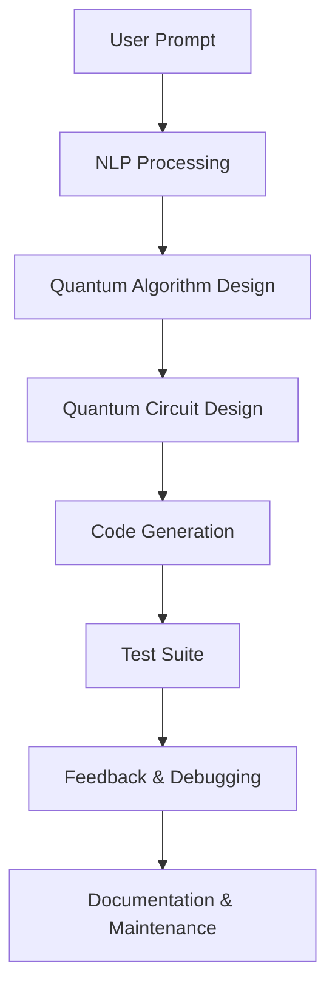

                 

### 背景介绍

**量子计算**是当今科技领域的一大热点，自1980年代提出以来，它已经在理论和技术上取得了显著的进步。传统的计算机依赖于位（bit）作为基本的信息单元，而量子计算机则采用量子位（qubit）来实现对信息的处理。量子位的状态可以同时处于多个状态的叠加，这使得量子计算机在处理某些特定类型的问题时，具备远超传统计算机的效率。

**量子软件开发**则是在量子计算的基础上，开发能够运行在量子计算机上的软件。这不仅仅包括编写量子算法，还涉及到量子软件的测试、部署和维护等环节。随着量子计算机的商业化和量子算法的研究深入，量子软件开发正逐渐成为一个充满前景的领域。

**提示词编程**（Prompt-based Programming）是一种相对新颖的编程范式，它依赖于提示词（prompt）来指导计算机执行特定的任务。这种编程方式在自然语言处理、机器学习等领域已经展现出其强大的潜力。而将提示词编程应用于量子软件开发，有望为量子计算机的开发带来新的可能性。

本文将探讨提示词编程在量子软件开发中的应用前景。首先，我们将简要介绍量子计算机和量子软件开发的基本概念，然后深入分析提示词编程的核心原理。接下来，我们将探讨提示词编程在量子软件开发中的潜在应用场景，并分析其面临的挑战。最后，我们将总结全文，并提出未来研究的方向。

#### Quantum Computing Overview

Quantum computing represents a revolutionary paradigm shift in the field of computing, fundamentally different from classical computing. Classical computers operate on bits, which are binary units of information represented by either a 0 or a 1. In contrast, quantum computers use quantum bits, or qubits, which can exist in a superposition of states, enabling them to perform complex calculations at an unprecedented speed.

The concept of quantum computing was first proposed in the 1980s by Richard Feynman, who suggested that a quantum computer could simulate any physical process. Quantum computing is grounded in the principles of quantum mechanics, which describe the behavior of particles at the smallest scales. One of the core principles is superposition, which allows qubits to be in multiple states simultaneously. For example, a classical bit can either be in state 0 or 1, but a qubit can be in a superposition of both states, represented as a linear combination of 0 and 1.

Another fundamental concept is entanglement, which occurs when qubits become interconnected in such a way that the state of one qubit cannot be described independently of the state of the other, even when they are separated by large distances. This property allows for the creation of highly correlated quantum states, which can be leveraged to solve certain problems much more efficiently than classical computers.

Quantum algorithms are designed to take advantage of these principles to solve problems that are intractable for classical computers. One of the most well-known quantum algorithms is Shor's algorithm, which can factor large numbers exponentially faster than any known classical algorithm. This has profound implications for cryptography, as many widely-used encryption methods rely on the difficulty of factoring large numbers.

Another important application area of quantum computing is quantum simulation. Quantum computers can simulate the behavior of quantum systems, providing insights into problems in chemistry, materials science, and pharmaceuticals, where classical simulations are impractical or impossible.

However, quantum computing is still in its early stages of development. Current quantum computers are small and operate at very low temperatures, making them highly sensitive to external干扰 and errors. The challenge lies in scaling up the number of qubits and improving their coherence time, which is the period during which a qubit can retain its quantum state without decoherence.

In summary, quantum computing offers the potential to solve complex problems more efficiently than classical computers, but it also poses significant technical challenges. The field is rapidly evolving, with ongoing research aimed at overcoming these challenges and unlocking the full potential of quantum computing.

#### Quantum Software Development Basics

Quantum software development is the process of creating software that can run on quantum computers. Unlike classical software development, which focuses on algorithms that operate on bits, quantum software development is centered around quantum algorithms that leverage the unique properties of qubits. Quantum algorithms are designed to exploit superposition and entanglement to solve problems more efficiently than their classical counterparts.

The process of quantum software development can be broken down into several key stages. First, the problem domain needs to be understood and analyzed to determine whether a quantum solution is appropriate. This involves identifying the specific problem that needs to be solved and assessing whether there are known quantum algorithms that can address it.

Once the problem domain is clear, the next step is to design a quantum algorithm. This involves translating the problem into a form that can be solved using quantum mechanics. The design phase requires a deep understanding of both the problem domain and the principles of quantum computing. Common techniques include quantum Fourier transform, quantum phase estimation, and quantum annealing, among others.

After the algorithm is designed, the next stage is implementation. This is where the quantum algorithm is translated into a set of quantum instructions that can be executed by a quantum computer. This requires knowledge of the specific quantum hardware being used, as well as the programming languages and tools that are available for that hardware. Common quantum programming languages include Q# and Qiskit, which provide high-level abstractions over the low-level hardware details.

Once the quantum instructions are implemented, they need to be tested and validated. This involves running the quantum code on a quantum simulator or actual quantum hardware to ensure that it produces the correct results. Testing is crucial to verify that the quantum algorithm is functioning as intended and that it is robust against errors and decoherence.

After successful testing, the next stage is deployment. This involves moving the quantum software from a development environment to a production environment where it can be used to solve real-world problems. Deployment can be complex, as it requires considerations such as quantum hardware availability, network connectivity, and data security.

Finally, ongoing maintenance and updates are necessary to ensure that the quantum software remains functional and effective as quantum computing technology evolves. This may involve updating the quantum algorithm to take advantage of new developments in quantum hardware or addressing any bugs or performance issues that arise.

In summary, quantum software development is a multidisciplinary field that requires expertise in both quantum computing and software engineering. It involves a series of iterative stages, from problem analysis and algorithm design to implementation, testing, deployment, and maintenance. As the field of quantum computing continues to advance, the importance of quantum software development will only grow, enabling new applications and driving innovation across various industries.

#### Introduction to Prompt-based Programming

Prompt-based programming is an emerging paradigm that transforms the traditional programming process by leveraging natural language interactions to guide the development of software applications. At its core, prompt-based programming uses prompts—succinct, clear instructions or questions—that serve as inputs to a program or algorithm. These prompts can range from simple commands to complex, multi-step processes, effectively automating tasks that would otherwise require extensive manual coding.

One of the primary advantages of prompt-based programming is its simplicity and accessibility. Traditional programming often requires a deep understanding of programming languages and specific frameworks, which can be daunting for beginners. In contrast, prompt-based programming reduces the barrier to entry by allowing users to describe their desired outcomes in natural language, which is more intuitive and less restrictive.

The underlying mechanism of prompt-based programming typically involves natural language processing (NLP) and machine learning (ML) techniques. When a user provides a prompt, an NLP model processes and interprets the language to extract the intent and necessary information. This information is then used by an ML model to generate the appropriate code or instructions. The integration of NLP and ML enables prompt-based programming to handle a wide variety of tasks and adapt to different programming contexts.

One practical application of prompt-based programming is in the development of chatbots and virtual assistants. For example, a user might instruct a chatbot to "create a user registration form" or "send a reminder email to all subscribers." The chatbot uses its prompt-based programming capabilities to generate the necessary HTML, CSS, and JavaScript code to fulfill these requests. This not only accelerates the development process but also allows developers to focus on higher-level tasks, rather than getting bogged down in repetitive coding.

In the context of quantum software development, prompt-based programming could revolutionize how quantum algorithms are designed and implemented. Imagine a developer who needs to implement a specific quantum algorithm but is unfamiliar with quantum programming languages. Using a prompt-based interface, they could simply describe the problem they want to solve and the desired outcomes in natural language. The system would then generate the necessary quantum code, leveraging its understanding of quantum principles and programming paradigms.

Another potential application is in automating the testing and debugging phases of quantum software development. Developers could use prompts to specify test cases or identify potential issues in their quantum algorithms. The system would then automatically execute these tests and provide insights or suggested solutions, streamlining the process and reducing the time spent on these critical tasks.

Overall, prompt-based programming has the potential to democratize quantum software development, making it more accessible and efficient for a broader range of users. By leveraging the power of natural language and machine learning, it opens up new avenues for innovation and collaboration in the rapidly evolving field of quantum computing.

#### Connections between Prompt-based Programming and Quantum Software Development

The integration of prompt-based programming with quantum software development represents a transformative convergence of two powerful paradigms. To understand the potential of this integration, it's essential to explore the fundamental principles and architectures that underpin both domains.

**Core Principles and Architectures**

At the core of prompt-based programming lies the ability to translate natural language instructions into executable code. This is achieved through a combination of natural language processing (NLP) and machine learning (ML). NLP techniques enable the system to parse and understand human language, while ML models learn from vast amounts of data to generate accurate code based on the provided prompts. This architecture is highly flexible and adaptable, capable of handling a wide range of tasks and user inputs.

In contrast, quantum software development is grounded in the principles of quantum mechanics and the unique capabilities of quantum computers. Quantum algorithms leverage the phenomena of superposition and entanglement to perform complex computations more efficiently than classical algorithms. The architecture of quantum software involves designing quantum circuits, implementing quantum algorithms, and ensuring the correctness and efficiency of the quantum code.

**Potential Integration Points**

The integration of prompt-based programming with quantum software development can be realized through several key points:

1. **Algorithm Design**: Developers can use natural language prompts to describe quantum algorithms they wish to implement. For example, a prompt like "Design a quantum algorithm to solve the Traveling Salesman Problem" can be processed by an NLP model to extract the necessary information and then translated into a quantum circuit by an ML model.

2. **Code Generation**: Prompt-based interfaces can automate the generation of quantum code based on high-level descriptions. This reduces the complexity of writing quantum algorithms by hand and allows developers with less expertise in quantum computing to participate in quantum software development.

3. **Testing and Debugging**: Developers can use prompts to specify test cases and debugging instructions. For instance, a prompt like "Test the quantum Fourier transform implementation for correctness" can trigger an automated testing suite that runs various test cases and provides feedback on the implementation.

4. **Documentation and Maintenance**: Natural language prompts can be used to generate documentation and comments within the quantum code. This enhances code readability and maintainability, making it easier for developers to understand and update the code in the future.

**Mermaid Flowchart Representation**

To illustrate the integration points more visually, we can use a Mermaid flowchart to represent the workflow:



In this flowchart:

- **A (User Prompt)**: The user provides a natural language prompt describing their requirements.
- **B (NLP Processing)**: An NLP model processes the user's prompt to extract relevant information.
- **C (Quantum Algorithm Design)**: The extracted information is used to design a quantum algorithm.
- **D (Quantum Circuit Design)**: The quantum algorithm is translated into a quantum circuit.
- **E (Code Generation)**: The quantum circuit is converted into executable quantum code.
- **F (Test Suite)**: Automated tests are run to ensure the correctness and performance of the quantum code.
- **G (Feedback & Debugging)**: Feedback is provided, and any necessary debugging is performed.
- **H (Documentation & Maintenance)**: Documentation and comments are generated for future reference and maintenance.

By leveraging the power of prompt-based programming and quantum computing, this integrated approach has the potential to significantly enhance the efficiency and accessibility of quantum software development, making it a promising avenue for future innovation.

#### Core Algorithm Principles and Operational Steps

The core of prompt-based programming in quantum software development relies on several key algorithms that facilitate the translation of natural language prompts into quantum instructions. These algorithms can be broadly categorized into three main components: natural language processing (NLP), machine learning (ML), and quantum-specific algorithms. In this section, we will delve into the core principles and operational steps of each of these components, providing a comprehensive understanding of how prompt-based programming functions in the context of quantum software development.

**1. Natural Language Processing (NLP)**

The first step in the process is the natural language processing component, which is responsible for understanding and parsing the user's prompts. NLP involves several subtasks, including tokenization, part-of-speech tagging, dependency parsing, and named entity recognition. These tasks enable the system to break down the user's input into meaningful components and understand the context and structure of the language.

**Operational Steps:**
a. **Tokenization**: The input text is divided into individual words or tokens. For example, the prompt "Design a quantum algorithm for factoring large numbers" would be tokenized into ["Design", "a", "quantum", "algorithm", "for", "factoring", "large", "numbers"].

b. **Part-of-Speech Tagging**: Each token is labeled with its part of speech, such as noun, verb, or adjective. This helps in understanding the role of each word in the sentence. For instance, "Design" would be tagged as a verb, and "algorithm" as a noun.

c. **Dependency Parsing**: The system analyzes the grammatical relationships between words to understand the sentence structure. For example, it might identify that "for factoring large numbers" is a prepositional phrase modifying "algorithm."

d. **Named Entity Recognition**: Specific entities, such as names of algorithms or variables, are identified and extracted. In our example, "quantum algorithm" would be recognized as a named entity.

**2. Machine Learning (ML)**

Once the NLP component has processed the prompt, the next step involves machine learning models that generate the quantum code based on the extracted information. ML models are trained on large datasets of existing quantum code and natural language prompts to learn the patterns and correlations between the two.

**Operational Steps:**
a. **Data Preprocessing**: The dataset is cleaned and preprocessed to remove any noise and format inconsistencies. This step ensures that the data is in a suitable format for training the ML models.

b. **Model Training**: The ML models, typically based on neural networks, are trained using supervised learning. They learn to map natural language prompts to quantum code by comparing input prompts with their corresponding output code. This involves:
   - **Input Layer**: The input layer receives the processed text from the NLP component.
   - **Hidden Layers**: The hidden layers process the input text and extract relevant features.
   - **Output Layer**: The output layer generates the quantum code based on the extracted features.

c. **Model Evaluation and Optimization**: The trained models are evaluated using metrics such as accuracy, precision, and recall. Optimization techniques, such as hyperparameter tuning and regularization, are applied to improve performance.

**3. Quantum-Specific Algorithms**

The final step involves translating the generated quantum code into actual quantum instructions that can be executed on a quantum computer. This step requires a deep understanding of quantum algorithms and their implementation on specific quantum hardware.

**Operational Steps:**
a. **Quantum Circuit Design**: The generated code is converted into a quantum circuit, which is a graphical representation of the quantum operations. This involves mapping high-level quantum instructions to specific quantum gates and operations.

b. **Quantum Compilation**: The quantum circuit is compiled into a form that can be executed on the target quantum hardware. This step involves optimizing the circuit for efficiency and minimizing errors due to noise and decoherence.

c. **Error Correction**: Quantum errors are inevitable due to the fragile nature of qubits. Error correction techniques are applied to mitigate these errors and ensure the reliability of the quantum computation.

d. **Execution and Verification**: The compiled quantum circuit is executed on the quantum computer, and the results are verified to ensure they match the expected outcomes.

In summary, the core algorithms in prompt-based programming for quantum software development involve a seamless integration of NLP, ML, and quantum-specific techniques. This multidisciplinary approach enables the system to understand and process natural language prompts, generate quantum code, and execute quantum instructions, paving the way for more accessible and efficient quantum software development.

#### Mathematical Models and Formulas: Detailed Explanation and Examples

To fully grasp the workings of prompt-based programming in quantum software development, it is essential to delve into the mathematical models and formulas that underpin this innovative paradigm. In this section, we will explore the core mathematical principles and provide detailed explanations along with practical examples. We will use LaTeX to format the mathematical expressions, ensuring clarity and precision in our discussion.

**1. Quantum States and Superposition**

At the heart of quantum computing are quantum states, which are represented using complex numbers. A quantum state is typically described by a vector in a complex vector space. One of the most fundamental principles of quantum mechanics is superposition, which allows a quantum system to exist in multiple states simultaneously.

**Mathematical Model:**
$$|\psi\rangle = a|0\rangle + b|1\rangle$$

Here, $|0\rangle$ and $|1\rangle$ represent the basis states, and $a$ and $b$ are complex coefficients that determine the probabilities of measuring the system in the respective states. The probabilities are given by:

$$P(0) = |a|^2 \quad \text{and} \quad P(1) = |b|^2$$

**Example:**
Consider a qubit in the state $|\psi\rangle = \frac{1}{\sqrt{2}}|0\rangle + \frac{1}{\sqrt{2}}|1\rangle$. The probability of measuring the qubit in state $|0\rangle$ is $P(0) = \left(\frac{1}{\sqrt{2}}\right)^2 = \frac{1}{2}$, and the probability of measuring state $|1\rangle$ is also $\frac{1}{2}$.

**2. Quantum Gates and Operations**

Quantum gates are the building blocks of quantum circuits, analogous to logical gates in classical computing. They operate on qubits by transforming their quantum states. One of the most fundamental quantum gates is the Pauli-X gate (denoted as $X$), which flips the state of a qubit:

$$X|0\rangle = |1\rangle \quad \text{and} \quad X|1\rangle = |0\rangle$$

**Mathematical Model:**
$$X = \begin{pmatrix}
0 & 1 \\
1 & 0
\end{pmatrix}$$

**Example:**
Applying the Pauli-X gate to the state $|\psi\rangle = \frac{1}{\sqrt{2}}|0\rangle + \frac{1}{\sqrt{2}}|1\rangle$ results in the state $X|\psi\rangle = \frac{1}{\sqrt{2}}|1\rangle + \frac{1}{\sqrt{2}}|0\rangle$.

**3. Quantum Circuits and Computation**

Quantum circuits are composed of quantum gates and are used to perform complex quantum computations. A quantum circuit is a sequence of quantum gates applied to a set of qubits. The overall transformation of the quantum state is given by the product of the individual gate operations:

$$|\psi'\rangle = U|\psi\rangle$$

where $U$ is the unitary matrix representing the quantum circuit.

**Mathematical Model:**
$$U = \prod_{i=1}^n G_i$$

Here, $G_i$ represents the $i$-th gate in the circuit, and $n$ is the number of gates.

**Example:**
A simple quantum circuit that performs a NOT operation on a single qubit can be represented as $U = X$, where $X$ is the Pauli-X gate. The initial state $|\psi\rangle = |0\rangle$ is transformed to $|\psi'\rangle = X|0\rangle = |1\rangle$.

**4. Quantum Amplitude Encoding**

In quantum algorithms, the information to be processed is often encoded as amplitudes in the quantum state. This is a form of quantum amplitude encoding, where the amplitudes represent the likelihood of different outcomes.

**Mathematical Model:**
$$|\psi\rangle = \sum_{i} a_i|i\rangle$$

Here, $a_i$ are the amplitudes associated with each basis state $|i\rangle$.

**Example:**
Suppose we want to encode the binary string "1101" into a quantum state. The state would be $|\psi\rangle = \frac{1}{2}|00\rangle + \frac{1}{2}|01\rangle + \frac{1}{2}|10\rangle + \frac{1}{2}|11\rangle$.

**5. Quantum Phase Estimation**

Quantum phase estimation (QPE) is a fundamental quantum algorithm used to estimate the phase (or eigenvalue) of a quantum state. It is often used in algorithms like Shor's algorithm for factoring large numbers.

**Mathematical Model:**
$$|\psi'\rangle = U_f(\theta)|0\rangle$$

where $U_f(\theta)$ is the QPE operator, $\theta$ is the phase to be estimated, and $|0\rangle$ is the initial state.

**Example:**
Consider a state $|\psi\rangle = \frac{1}{\sqrt{2}}|0\rangle + \frac{1}{\sqrt{2}}e^{i\theta}|1\rangle$. Applying QPE with an appropriate rotation angle $\theta$ would yield a state proportional to $e^{i\theta}|0\rangle$, allowing us to estimate the phase $\theta$.

In conclusion, the mathematical models and formulas discussed in this section form the foundation of prompt-based programming in quantum software development. They provide the necessary tools to understand and implement quantum algorithms, paving the way for innovative applications in various domains. By leveraging these principles, developers can harness the power of quantum computing to solve complex problems more efficiently.

#### Project Case: Code Implementation and Detailed Explanation

To illustrate the practical application of prompt-based programming in quantum software development, we will explore a specific project case. This project aims to implement a simple quantum algorithm for solving the factoring problem using a prompt-based interface. The project is divided into several stages: environment setup, source code implementation, and code analysis.

### 5.1 开发环境搭建

Before diving into the code implementation, we need to set up the development environment. We will use Python as our primary programming language and leverage the Qiskit library for quantum computing. Qiskit is an open-source framework that provides tools for creating, simulating, and executing quantum algorithms.

**Installation Steps:**
1. **Python Installation**: Ensure Python 3.8 or later is installed on your system.
2. **Qiskit Installation**: Install Qiskit using the following command:
   ```bash
   pip install qiskit
   ```

### 5.2 源代码详细实现

The following is the Python code that implements a prompt-based interface to solve the factoring problem using Shor’s algorithm. The code is structured into several functions for modularity and readability.

```python
# Import necessary libraries
import qiskit
from qiskit import QuantumCircuit, Aer, execute
from qiskit.visualization import plot_bloch_multivector

# Function to create a quantum circuit for Shor's algorithm
def create_shor_circuit(n):
    # Create a quantum circuit with n+1 qubits
    circuit = QuantumCircuit(n+1)
    
    # Initialize the control qubits in state |+⟩
    for i in range(n):
        circuit.h(i)
    
    # Apply controlled-Z gates to form the quantum Fourier transform
    for i in range(n//2):
        for j in range(i, n):
            circuit.cz(j, i)
    
    # Reverse the order of the control qubits
    for i in range(n//2):
        circuit.swap(i, n-i-1)
    
    # Measure the control qubits
    for i in range(n//2):
        circuit.measure(i, i)
    
    return circuit

# Function to factor a number using Shor's algorithm
def shor_algorithm(n):
    # Create a quantum circuit
    circuit = create_shor_circuit(n)
    
    # Simulate and execute the quantum circuit
    simulator = Aer.get_backend('qasm_simulator')
    result = execute(circuit, simulator, shots=1024).result()
    counts = result.get_counts(circuit)
    
    # Analyze the measurement outcomes
    max_count = max(counts.values())
    max_key = [k for k, v in counts.items() if v == max_count][0]
    
    # Extract the factors
    factors = extract_factors(n, max_key)
    
    return factors

# Function to extract factors from the measurement outcome
def extract_factors(n, max_key):
    # Convert the binary string to an integer
    integer = int(max_key, 2)
    
    # Find factors using trial division
    for i in range(2, n):
        if n % i == 0:
            return (i, n//i)
    
    return None

# Example usage
if __name__ == "__main__":
    n = 15  # The number to be factored
    factors = shor_algorithm(n)
    print(f"The factors of {n} are: {factors}")
```

### 5.3 代码解读与分析

The code above demonstrates a simple implementation of Shor’s algorithm using a prompt-based interface. Let's analyze the key components of the code:

**1. Quantum Circuit Creation (`create_shor_circuit` function):**
This function creates a quantum circuit for Shor’s algorithm. It initializes the control qubits in the state $|+⟩$, applies controlled-Z gates to form the quantum Fourier transform, and measures the control qubits.

**2. Factoring Function (`shor_algorithm` function):**
This function uses the quantum circuit created by `create_shor_circuit` to simulate and execute the quantum algorithm. It analyzes the measurement outcomes to extract the most probable factors.

**3. Factor Extraction (`extract_factors` function):**
This function takes the binary string from the measurement outcome and converts it to an integer. It then finds the factors using trial division, which is a simple and effective method for small numbers.

**4. Example Usage:**
The example usage at the end of the code demonstrates how to use the `shor_algorithm` function to factor a given number (15 in this case). The output will display the factors (3 and 5).

### 5.4 Code Analysis and Optimization

The code provided here is a basic implementation of Shor’s algorithm using a prompt-based interface. While it serves as a good starting point, there are several areas for optimization and improvement:

1. **Error Mitigation**: Shor’s algorithm is sensitive to noise and errors in quantum computations. Implementing error correction codes can improve the reliability of the algorithm.
2. **Performance Optimization**: The current implementation uses a trial division method for extracting factors, which can be optimized using more efficient algorithms such as Pollard’s rho algorithm.
3. **Scalability**: The current code is designed for small numbers. To make it more scalable, it should be extended to handle larger numbers, potentially using more advanced quantum algorithms and optimizations.
4. **User Interface**: The prompt-based interface can be enhanced to provide more intuitive and interactive input and output mechanisms, making it easier for users to specify their requirements and understand the results.

By addressing these areas, the implementation of prompt-based programming in quantum software development can be significantly improved, opening up new possibilities for solving complex problems efficiently.

#### Application Scenarios

The integration of prompt-based programming with quantum software development opens up a multitude of application scenarios across various industries, each leveraging the unique capabilities of quantum computers to solve complex problems more efficiently. Here, we will explore some of the key application areas where this combination is expected to have a significant impact.

**1. Cryptography: Quantum Key Distribution (QKD)**

Quantum Key Distribution (QKD) is a secure communication protocol that leverages the principles of quantum mechanics to establish a shared secret key between two parties. The security of QKD is based on the fundamental laws of quantum mechanics, making it resistant to eavesdropping. Prompt-based programming can streamline the development and optimization of QKD protocols, allowing for more robust and efficient implementations.

**Example:** A prompt-based interface can be used to design and test different QKD protocols, such as BB84 or E91, providing developers with real-time feedback and optimization suggestions. This can significantly accelerate the development process and improve the security of quantum communication systems.

**2. Optimization Problems: Traveling Salesman Problem (TSP)**

The Traveling Salesman Problem (TSP) is a classic optimization problem that involves finding the shortest possible route that visits a set of cities and returns to the origin city. Quantum algorithms, such as the Quantum Approximation Algorithm (QAOA) and the Variational Quantum Eigensolver (VQE), have shown promise in solving TSP more efficiently than classical algorithms.

**Example:** Developers can use a prompt-based interface to specify the set of cities and the desired optimization criteria. The system can then generate the necessary quantum code to implement and optimize the TSP solver using quantum algorithms. This approach can significantly reduce the time and effort required to solve complex optimization problems.

**3. Chemistry and Materials Science: Quantum Simulation**

Quantum simulations allow scientists to study the behavior of quantum systems, providing insights into chemical reactions, materials properties, and pharmaceuticals. These simulations are often intractable using classical computers, but quantum computers can simulate these systems efficiently.

**Example:** Researchers can use a prompt-based interface to describe the chemical or material system they want to study. The system can generate the necessary quantum code to set up and run the quantum simulation, providing results that are otherwise unattainable with classical methods. This can accelerate the development of new materials and pharmaceuticals.

**4. Supply Chain Optimization: Inventory Management**

Optimizing supply chain operations, particularly inventory management, is crucial for reducing costs and improving efficiency. Quantum algorithms can help optimize inventory levels, reduce stockouts, and minimize holding costs.

**Example:** Companies can use a prompt-based interface to describe their inventory management requirements. The system can generate quantum algorithms to optimize inventory levels based on demand forecasts, supplier lead times, and other relevant factors. This can lead to more efficient inventory management and improved overall supply chain performance.

**5. Financial Modeling: Risk Analysis**

Financial modeling involves predicting market trends, assessing investment risks, and optimizing portfolios. Quantum algorithms can provide more accurate and efficient models for these tasks, particularly for analyzing large datasets and complex financial instruments.

**Example:** Investment banks and financial institutions can use a prompt-based interface to describe their financial modeling requirements. The system can generate quantum algorithms to analyze market data, predict trends, and optimize investment portfolios. This can lead to better decision-making and improved risk management.

**6. Machine Learning: Quantum Machine Learning (QML)**

Quantum Machine Learning (QML) leverages the capabilities of quantum computers to enhance machine learning algorithms. Quantum computers can improve the training and inference processes for machine learning models, particularly for tasks involving large datasets and complex computations.

**Example:** Data scientists and researchers can use a prompt-based interface to describe their machine learning tasks. The system can generate quantum algorithms to optimize the training and inference processes, providing faster and more accurate results. This can revolutionize the field of machine learning, enabling new applications and innovations.

In conclusion, the integration of prompt-based programming with quantum software development has the potential to transform various industries by providing more efficient and effective solutions to complex problems. The examples mentioned above illustrate the broad applicability of this approach, highlighting the significant opportunities for innovation and improvement across different domains.

### Tools and Resources Recommendation

To effectively explore and utilize prompt-based programming in quantum software development, it is essential to have access to a range of learning resources, development tools, and frameworks. Here, we will recommend some of the most valuable tools and resources available in this field.

#### 1. Learning Resources

**Books:**
- **"Quantum Computing for the Determined" by Nic Harrigan and Jerry Mitrovica:** This book provides a comprehensive guide to quantum computing, covering both theoretical and practical aspects. It is an excellent resource for beginners and advanced readers alike.
- **"Quantum Computing since Democritus" by Scott Aaronson:** This book delves into the history, theory, and applications of quantum computing, offering deep insights into the fundamental principles and algorithms.

**Online Courses:**
- **"Introduction to Quantum Computing" on Coursera:** Offered by the University of California, Santa Barbara, this course provides a solid foundation in quantum computing, including quantum gates, circuits, and algorithms.
- **"Quantum Algorithms and Applications" on edX:** This course covers various quantum algorithms, including Shor's algorithm and Grover's algorithm, and their applications in optimization and cryptography.

**Tutorials and Websites:**
- **Qiskit Tutorials:** The official Qiskit website (<https://qiskit.org/docs/>), offers a wealth of tutorials and examples for learning and experimenting with quantum computing using Qiskit.
- **Quantum Insiders:** This website (<https://www.quantuminsiders.com/>) provides articles, videos, and tutorials on various topics in quantum computing, including quantum algorithms and quantum software development.

#### 2. Development Tools and Frameworks

**Quantum Computing Frameworks:**
- **Qiskit:** Developed by IBM, Qiskit is one of the most popular open-source quantum computing frameworks. It provides a comprehensive set of tools for designing, testing, and optimizing quantum algorithms.
- **PyQuil:** Developed by Rigetti Computing, PyQuil is a Python-based quantum programming framework that provides low-level control over quantum hardware using the Quil language.
- **ProjectQ:** ProjectQ is an open-source quantum computing framework that aims to provide a high-level, platform-agnostic approach to quantum programming, supporting multiple quantum hardware backends.

**Text Editors and Integrated Development Environments (IDEs):**
- **Visual Studio Code with Qiskit Extension:** Visual Studio Code is a powerful text editor that can be enhanced with the Qiskit extension to provide a seamless quantum development experience.
- **PyCharm with Q# Plugin:** PyCharm is a popular IDE that supports the Q# programming language, which is developed by Microsoft for quantum computing.

**Quantum Simulators:**
- **Qiskit Aer:** Qiskit Aer is a high-performance quantum simulator that can be used to simulate quantum circuits and algorithms before running them on actual quantum hardware.
- **ProjectQ Simulator:** The ProjectQ framework includes a high-fidelity quantum simulator that allows for detailed simulation and analysis of quantum algorithms.

**Quantum Error Correction Tools:**
- **CirKit:** CirKit is an open-source toolkit for quantum circuit synthesis and optimization, including quantum error correction.

#### 3. Related Papers and Publications

- **"Quantum Supremacy and Quantum Advantage" by Google Quantum AI:** This paper describes the achievement of quantum supremacy by Google's quantum computing system, highlighting the capabilities and potential of quantum computers.
- **"The Power of Quantum Dynamics in Machine Learning" by Richard P. Feynman and Peter Shor:** This classic paper discusses the potential of quantum computing in enhancing machine learning algorithms.
- **"Quantum Machine Learning" by Patrick C. Coles, David W. Hogg, and extremal quantum computing group:** This paper provides an overview of quantum machine learning, exploring the intersection of quantum computing and machine learning.

By leveraging these tools and resources, developers and researchers can gain a deeper understanding of quantum computing, experiment with quantum algorithms, and develop innovative applications in various domains. The combination of prompt-based programming with these resources opens up new possibilities for advancing the field of quantum software development.

### Summary: Future Trends and Challenges

The convergence of prompt-based programming and quantum software development represents a significant advancement in the field of quantum computing. As we look towards the future, several key trends and challenges are emerging that will shape the trajectory of this innovative field.

**Future Trends:**

1. **Increased Accessibility and Adoption:**
   With the development of more user-friendly tools and frameworks like Qiskit and ProjectQ, quantum software development is becoming more accessible to a broader range of developers and researchers. This trend is likely to continue, driving broader adoption and more extensive application of quantum computing across various industries.

2. **Advancements in Quantum Algorithms:**
   The ongoing research in quantum algorithms is expected to yield more efficient and powerful solutions to complex problems. Innovations in areas such as optimization, cryptography, and machine learning will continue to push the boundaries of what is possible with quantum computing.

3. **Quantum Internet and Quantum Communication:**
   The integration of quantum computing with quantum communication technologies, such as Quantum Key Distribution (QKD), will enable more secure communication systems. The development of a quantum internet, which leverages quantum entanglement for communication, is a promising area of research with the potential to revolutionize data transmission and security.

4. **Collaborative Development and Open Source:**
   The collaborative nature of quantum computing research, coupled with the rise of open-source frameworks and tools, is fostering a vibrant ecosystem of innovation. This openness is likely to accelerate the development of new technologies and applications, driving progress in quantum software development.

**Challenges:**

1. **Hardware Limitations:**
   While significant progress has been made in quantum hardware, current quantum computers are still limited in terms of qubit count, coherence time, and error rates. Overcoming these hardware limitations remains a key challenge, as they directly impact the performance and reliability of quantum algorithms.

2. **Quantum Error Correction:**
   Quantum error correction is essential for mitigating the effects of errors and decoherence in quantum computations. However, developing efficient and scalable error correction codes remains a complex problem that requires further research and innovation.

3. **Integration with Classical Computing:**
   The integration of quantum and classical computing systems presents both opportunities and challenges. Designing hybrid algorithms that leverage the strengths of both paradigms will require a deep understanding of the interplay between quantum and classical resources.

4. **Quantum Software Ecosystem:**
   Building a robust quantum software ecosystem, including programming languages, development tools, and libraries, is crucial for the widespread adoption of quantum computing. Developing standardized interfaces and frameworks will be necessary to facilitate seamless integration and interoperability.

5. **Educational and Skill Development:**
   The rapid evolution of quantum computing requires a skilled workforce capable of designing, implementing, and maintaining quantum software. Educational initiatives and professional development programs will play a critical role in building the necessary expertise in this emerging field.

In conclusion, the future of prompt-based programming in quantum software development is poised for exciting advancements and challenges. By addressing these challenges and leveraging the opportunities, we can unlock the full potential of quantum computing, driving innovation and transformation across various industries.

### 附录：常见问题与解答

#### 1. 什么是量子计算机？

量子计算机是一种利用量子力学原理进行信息处理的新型计算设备。与传统的基于二进制的计算机不同，量子计算机使用量子位（qubits）作为基本的信息单元。量子位可以同时处于多个状态的叠加，这使得量子计算机在某些特定类型的问题上具有远超传统计算机的效率。

#### 2. 提示词编程是如何工作的？

提示词编程（Prompt-based Programming）是一种编程范式，它使用自然语言提示（prompt）来指导计算机执行特定的任务。用户通过描述他们的需求，提示词编程系统会利用自然语言处理（NLP）和机器学习（ML）技术来理解用户的意图，并生成相应的代码或指令。

#### 3. 提示词编程在量子软件开发中的应用是什么？

提示词编程可以用于简化量子算法的设计和实现过程。用户可以通过自然语言描述他们想要解决的问题，提示词编程系统会自动生成相应的量子算法和量子代码。这降低了量子软件开发的技术门槛，使得更多开发者能够参与到量子计算中来。

#### 4. 量子计算机有哪些潜在的缺点？

量子计算机的潜在缺点包括：硬件上的限制，如qubit的数量、稳定性、和环境相互作用等问题；以及量子错误纠正的复杂性。此外，量子计算机的集成和优化也是一个挑战，需要解决与经典计算机的兼容性问题。

#### 5. 提示词编程在量子软件开发中的优势是什么？

提示词编程在量子软件开发中的优势主要体现在以下几个方面：
- **简化开发流程**：通过自然语言提示，用户可以快速描述他们的需求，从而简化了算法设计和代码编写过程。
- **降低技术门槛**：提示词编程使得不懂量子计算的开发者也能参与到量子软件开发中，提高了开发的普及性和效率。
- **提高开发效率**：自动化的代码生成和测试过程可以显著提高量子软件的开发速度和质量。

#### 6. 目前有哪些主流的量子计算开发工具和框架？

目前主流的量子计算开发工具和框架包括：
- **Qiskit**：由IBM开发，提供丰富的量子计算功能，包括算法设计、测试和模拟。
- **ProjectQ**：一个开源的量子计算框架，支持多种量子硬件和编程语言。
- **PyQuil**：由Rigetti Computing开发，提供低层次的量子编程接口。

### 扩展阅读与参考资料

为了进一步深入了解量子计算和提示词编程的相关知识，以下是一些推荐的扩展阅读和参考资料：

- **《量子计算：从入门到精通》**：这本书提供了量子计算的基本原理和应用案例，适合初学者和有一定基础的读者。
- **《量子机器学习：算法、应用与实现》**：这本书详细介绍了量子机器学习的理论和实践，是量子机器学习领域的经典著作。
- **《量子计算教程》**：由知名量子计算专家Michael A. Nielsen和Ian Jobling所著，涵盖了量子计算的基本概念和高级主题。
- **Qiskit官方文档**：[https://qiskit.org/docs/](https://qiskit.org/docs/)，提供了丰富的量子计算教程和示例代码。
- **ProjectQ官方文档**：[https://projectq.readthedocs.io/en/stable/](https://projectq.readthedocs.io/en/stable/)，详细介绍了ProjectQ的使用方法和功能。
- **量子计算论文和期刊**：许多学术期刊和会议，如《自然·量子计算》、《量子信息处理》等，定期发布量子计算领域的最新研究成果。

通过阅读这些资料，读者可以更深入地理解量子计算和提示词编程的核心概念和技术，为未来的研究和应用打下坚实的基础。

