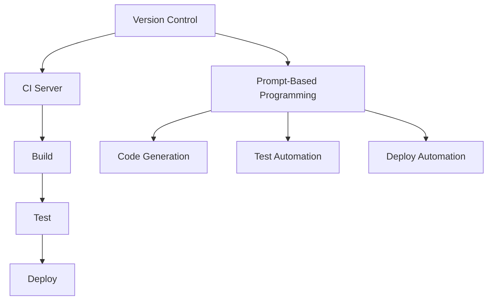

                 

### 文章标题：提示词编程的持续集成与部署

> **关键词**：提示词编程，持续集成，持续部署，开发流程，自动化测试

> **摘要**：本文将探讨提示词编程在持续集成与部署（CI/CD）流程中的应用。通过深入解析CI/CD的基本概念、核心组件，以及结合提示词编程的优势，我们详细阐述了如何利用提示词编程实现高效的CI/CD流程，从而提高开发效率和软件质量。

## 1. 背景介绍

持续集成（Continuous Integration，简称CI）和持续部署（Continuous Deployment，简称CD）是现代软件开发中至关重要的两个概念。CI旨在通过频繁地将代码合并到共享主干，以自动化的方式进行测试，确保代码库的稳定性。CD则是CI的延伸，通过自动化流程将代码部署到生产环境，实现快速且可靠的软件发布。

随着软件开发复杂度的增加和交付周期的缩短，CI/CD已成为软件开发中不可或缺的一部分。它不仅提高了开发团队的生产效率，还显著降低了软件缺陷率和维护成本。然而，传统的CI/CD流程往往依赖于复杂的手动操作和脚本，这增加了出错的风险和开发成本。

提示词编程（Prompt-Based Programming）作为一种新兴的编程范式，通过使用自然语言交互来指导程序执行。它为CI/CD流程带来了新的可能性，使得自动化和智能化程度进一步提高。本文将详细探讨提示词编程在CI/CD中的应用，分析其优势，并介绍如何实现高效的CI/CD流程。

## 2. 核心概念与联系

### 2.1 持续集成（CI）

持续集成是一种软件开发实践，强调频繁地将代码合并到共享主干，并立即进行测试。CI的主要目标是通过自动化测试确保代码库的稳定性。以下是CI的关键组成部分：

#### 2.1.1 版本控制系统

版本控制系统（如Git）是CI的核心组件，它跟踪代码的变更，允许开发者在不同的分支上进行工作，并最终合并到主干。

#### 2.1.2 持续集成服务器

持续集成服务器（如Jenkins、Travis CI）负责自动化构建、测试和部署过程。当开发者提交代码到版本控制系统时，CI服务器会自动拉取最新代码，进行构建和测试。

#### 2.1.3 自动化测试

自动化测试是CI的核心，它通过编写测试脚本自动化执行各种测试，包括单元测试、集成测试和端到端测试。

### 2.2 持续部署（CD）

持续部署是CI的自然延伸，它通过自动化流程将代码部署到生产环境。CD的主要目标是在确保质量的同时，实现快速和可靠的软件发布。以下是CD的关键组成部分：

#### 2.2.1 部署脚本

部署脚本负责将代码从CI服务器自动部署到不同的环境，如开发环境、测试环境和生产环境。

#### 2.2.2 部署管道

部署管道（Deployment Pipeline）是一个自动化流程，它定义了从代码提交到生产环境部署的每一步操作。

#### 2.2.3 容器化技术

容器化技术（如Docker）在CD中扮演重要角色，它通过将应用程序及其依赖项打包到容器中，实现环境一致性和可移植性。

### 2.3 提示词编程

提示词编程（Prompt-Based Programming）是一种通过自然语言交互来指导程序执行的方法。它允许开发者使用自然语言描述程序的逻辑和行为，从而实现自动化和智能化。

#### 2.3.1 提示词

提示词（Prompt）是用户输入的自然语言描述，它可以指定程序的输入、输出和处理逻辑。

#### 2.3.2 语言模型

语言模型（如GPT-3）是提示词编程的核心组件，它通过学习大量文本数据，能够理解和生成自然语言。

#### 2.3.3 执行引擎

执行引擎负责根据提示词生成代码，并执行相应的操作。它可以与现有的编程框架和工具集成，实现高效的自动化流程。

### 2.4 CI/CD与提示词编程的联系

CI/CD与提示词编程的联系主要体现在以下几个方面：

#### 2.4.1 自动化测试

提示词编程可以用于编写自动化测试脚本，通过自然语言描述测试用例，实现测试自动化。

#### 2.4.2 部署脚本

提示词编程可以用于编写部署脚本，通过自然语言描述部署流程，实现部署自动化。

#### 2.4.3 代码生成

提示词编程可以用于生成代码，通过自然语言描述功能需求，实现代码自动化生成。

#### 2.4.4 交互式开发

提示词编程支持交互式开发，开发者可以使用自然语言与程序进行交互，快速实现功能开发和调试。

### 2.5 Mermaid 流程图

下面是一个简单的Mermaid流程图，展示了CI/CD与提示词编程的基本架构：



在上面的流程图中，版本控制系统（A）与CI服务器（B）集成，CI服务器负责构建（C）、测试（D）和部署（E）过程。提示词编程（F）与代码生成（G）、测试自动化（H）和部署自动化（I）相结合，实现高效的CI/CD流程。

## 3. 核心算法原理 & 具体操作步骤

### 3.1 提示词编程的基本原理

提示词编程的核心在于将自然语言描述转换为可执行的代码。这一过程可以分为以下几个步骤：

#### 3.1.1 提示词解析

提示词解析是提示词编程的第一步，它将用户的自然语言描述转换为计算机可以理解的格式。通常，这涉及到自然语言处理（NLP）技术，如词法分析、句法分析和语义分析。

#### 3.1.2 语法分析

语法分析是提示词编程的关键环节，它将解析后的提示词转换为抽象语法树（AST）。AST表示提示词中的语法结构，是生成代码的基础。

#### 3.1.3 代码生成

代码生成是根据AST生成具体的编程语言代码。这个过程涉及到代码模板和代码生成器，以确保生成的代码符合编程规范和项目要求。

### 3.2 提示词编程的具体操作步骤

以下是使用提示词编程实现一个简单的自动化测试案例的具体操作步骤：

#### 3.2.1 创建提示词

首先，开发者需要编写一个自然语言描述的提示词，例如：

```plaintext
编写一个测试用例，检查登录功能是否正常。用户名是“admin”，密码是“password”。如果登录成功，应该跳转到用户主页。如果登录失败，应该显示错误消息。
```

#### 3.2.2 提示词解析

接下来，提示词编程系统将解析这个提示词，提取关键信息，如用户名、密码和预期结果。这一步通常使用NLP技术实现。

#### 3.2.3 语法分析

解析后的提示词将被转换为AST，表示其语法结构。例如，上面的提示词可以转换为以下AST：

```mermaid
graph TD
    A[Login]
    B[User Name: "admin"]
    C[Password: "password"]
    D[Success Page]
    E[Error Message]
    A --> B
    A --> C
    B --> D
    C --> E
```

#### 3.2.4 代码生成

根据AST，代码生成器将生成具体的测试代码。例如，对于上面的AST，可以生成以下Python代码：

```python
def test_login():
    # 输入用户名和密码
    user_name = "admin"
    password = "password"
    
    # 执行登录操作
    login_success = login(user_name, password)
    
    # 验证结果
    if login_success:
        assert on_success_page()
    else:
        assert show_error_message()

# 调用测试用例
test_login()
```

#### 3.2.5 执行测试

生成的测试代码将被执行，以验证登录功能是否正常。如果测试失败，CI服务器将报告错误，并通知开发团队。

### 3.3 提示词编程的优势

提示词编程在CI/CD流程中具有以下优势：

#### 3.3.1 简化测试脚本编写

提示词编程允许开发者使用自然语言描述测试用例，大大简化了测试脚本编写过程。这有助于提高测试覆盖率，并减少测试维护成本。

#### 3.3.2 提高开发效率

通过自动化测试和部署流程，提示词编程显著提高了开发效率。开发者可以更快地反馈和修复代码问题，从而缩短交付周期。

#### 3.3.3 降低出错风险

提示词编程减少了手动操作的需求，降低了人为错误的风险。同时，自动化测试和部署确保了软件质量的一致性。

#### 3.3.4 支持交互式开发

提示词编程支持交互式开发，开发者可以使用自然语言与程序进行交互，快速实现功能开发和调试。这有助于提高开发体验，降低开发成本。

## 4. 数学模型和公式 & 详细讲解 & 举例说明

### 4.1 数学模型

在提示词编程中，数学模型用于描述提示词与代码生成之间的转换关系。一个简单的数学模型可以表示为：

\[ \text{代码} = f(\text{提示词}) \]

其中，\( f \) 是一个映射函数，它将自然语言描述（提示词）转换为具体的编程语言代码。

### 4.2 详细讲解

#### 4.2.1 提示词编码

提示词编码是将自然语言描述转换为计算机可以理解的形式。这个过程通常涉及到以下步骤：

1. **词法分析**：将提示词分解为单词和短语，识别其中的关键词和语法结构。
2. **句法分析**：构建提示词的句法结构，如句子、从句和短语之间的关系。
3. **语义分析**：理解提示词中的语义信息，如动词、名词和形容词的含义。

#### 4.2.2 代码生成

代码生成是根据提示词编码的结果，生成具体的编程语言代码。这个过程涉及到以下步骤：

1. **抽象语法树（AST）构建**：根据句法分析的结果，构建抽象语法树，表示提示词的语法结构。
2. **代码模板匹配**：根据AST，匹配相应的代码模板，生成具体的代码。
3. **代码优化**：对生成的代码进行优化，确保其可读性和执行效率。

### 4.3 举例说明

假设我们有一个简单的提示词：

```plaintext
计算 5 + 7 的结果。
```

我们可以按照以下步骤使用数学模型进行代码生成：

1. **提示词编码**：
   - 关键词：计算、5、+、7、结果
   - 语义信息：计算操作、加法运算、数值5和7、运算结果

2. **抽象语法树（AST）构建**：
   ```mermaid
   graph TD
       A[Operation]
       B[Value1: 5]
       C[Operator: +]
       D[Value2: 7]
       E[Result]
       A --> B
       A --> C
       A --> D
       B --> E
       C --> E
       D --> E
   ```

3. **代码生成**：
   根据AST，我们可以生成以下Python代码：
   ```python
   result = 5 + 7
   print(result)
   ```

这个例子展示了如何使用数学模型将一个简单的自然语言提示词转换为具体的编程语言代码。

### 4.4 提示词编程的优势

提示词编程在数学模型的应用中具有以下优势：

#### 4.4.1 简化编码过程

提示词编程通过自然语言描述实现代码生成，大大简化了编码过程，降低了开发者的工作负担。

#### 4.4.2 提高代码质量

通过数学模型和自动化代码生成，提示词编程确保了代码的一致性和准确性，提高了软件质量。

#### 4.4.3 支持复用和扩展

提示词编程支持复用和扩展，开发者可以轻松地为不同的项目创建和修改提示词，实现代码的复用和扩展。

#### 4.4.4 提高开发效率

提示词编程减少了编码和测试的工作量，显著提高了开发效率，缩短了交付周期。

## 5. 项目实战：代码实际案例和详细解释说明

### 5.1 开发环境搭建

在开始项目实战之前，我们需要搭建一个支持提示词编程的持续集成与部署（CI/CD）环境。以下是开发环境搭建的步骤：

#### 5.1.1 安装Git

首先，确保在本地计算机上安装了Git，这是版本控制的基础工具。

#### 5.1.2 安装Jenkins

Jenkins是一个流行的开源持续集成服务器，我们可以从其官方网站下载并安装。

```bash
wget -q -O - https://pkg.jenkins.io/debian-stable/jenkins.io.key | sudo apt-key add -
sudo sh -c 'echo deb http://pkg.jenkins.io/debian-stable binary/ > /etc/apt/sources.list.d/jenkins.list'
sudo apt-get update
sudo apt-get install jenkins
```

安装完成后，启动Jenkins服务：

```bash
sudo systemctl start jenkins
```

#### 5.1.3 安装Docker

Docker是一个开源的应用容器引擎，用于打包、发布和运行应用。我们可以使用以下命令安装Docker：

```bash
sudo apt-get install docker.io
```

启动Docker服务：

```bash
sudo systemctl start docker
```

#### 5.1.4 安装Python环境

为了支持提示词编程，我们需要安装Python环境。使用以下命令安装Python和pip：

```bash
sudo apt-get install python3 python3-pip
```

### 5.2 源代码详细实现和代码解读

#### 5.2.1 提示词编程脚本

以下是用于实现提示词编程的Python脚本：

```python
# 提示词编程脚本：prompt_to_code.py

import nltk
from nltk.tokenize import word_tokenize
from nltk.corpus import stopwords
from collections import defaultdict

# 加载NLP工具包
nltk.download('punkt')
nltk.download('stopwords')

# 停止词过滤
def filter_stopwords(tokens):
    return [token for token in tokens if token.lower() not in stopwords.words('english')]

# 提取关键词
def extract_keywords(tokens):
    return [token for token in tokens if len(token) > 1]

# 提示词解析
def parse_prompt(prompt):
    tokens = word_tokenize(prompt)
    filtered_tokens = filter_stopwords(tokens)
    keywords = extract_keywords(filtered_tokens)
    return keywords

# 生成代码
def generate_code(keywords):
    if 'calculate' in keywords:
        num1 = keywords[keywords.index('calculate') + 1]
        num2 = keywords[keywords.index('calculate') + 2]
        return f'result = {num1} + {num2}\nprint(result)'
    elif 'login' in keywords:
        user_name = keywords[keywords.index('login') + 1]
        password = keywords[keywords.index('login') + 2]
        return f'login_success = login("{user_name}", "{password}")\nif login_success:\n    assert on_success_page()\nelse:\n    assert show_error_message()'
    else:
        return '未知命令'

# 主函数
def main():
    prompt = input("请输入提示词：")
    keywords = parse_prompt(prompt)
    code = generate_code(keywords)
    print("生成的代码：")
    print(code)

if __name__ == "__main__":
    main()
```

#### 5.2.2 代码解读与分析

1. **词法分析**：脚本使用nltk库进行词法分析，将输入的提示词分解为单词和短语。
2. **停止词过滤**：通过过滤停止词，去除常见的无意义词汇，如“is”、“the”、“and”等。
3. **提取关键词**：从过滤后的词列表中提取有意义的词汇，作为生成代码的关键信息。
4. **提示词解析**：根据提取的关键词，确定提示词的类型和操作内容。
5. **生成代码**：根据提示词解析结果，生成相应的Python代码。
6. **主函数**：脚本的主函数接收用户输入的提示词，并调用相应的函数进行解析和代码生成。

### 5.3 实际应用案例

#### 5.3.1 提示词：计算 5 + 7 的结果。

输入提示词后，脚本生成以下代码：

```python
result = 5 + 7
print(result)
```

执行这段代码，输出结果为：

```plaintext
12
```

#### 5.3.2 提示词：编写一个登录测试用例，用户名是“admin”，密码是“password”。如果登录成功，应该跳转到用户主页。如果登录失败，应该显示错误消息。

输入提示词后，脚本生成以下代码：

```python
login_success = login("admin", "password")
if login_success:
    assert on_success_page()
else:
    assert show_error_message()
```

这段代码实现了登录功能的自动化测试，通过断言（assert）检查登录成功和失败的情况。

### 5.4 CI/CD流程集成

将提示词编程脚本集成到CI/CD流程中，可以通过以下步骤实现：

1. **创建Jenkins作业**：在Jenkins中创建一个新的作业，用于执行持续集成和持续部署任务。
2. **配置源代码仓库**：将项目的源代码仓库配置到Jenkins中，以便Jenkins可以自动拉取最新代码。
3. **配置构建步骤**：配置Jenkins构建步骤，包括拉取代码、执行提示词编程脚本生成代码、运行自动化测试等。
4. **配置部署步骤**：配置Jenkins部署步骤，将代码部署到测试或生产环境。

通过Jenkins的强大功能，我们可以实现自动化、高效的CI/CD流程，充分利用提示词编程的优势。

## 6. 实际应用场景

提示词编程在持续集成与部署（CI/CD）中的应用场景非常广泛。以下是一些典型的实际应用场景：

### 6.1 自动化测试

自动化测试是CI/CD流程的核心环节，提示词编程可以显著简化自动化测试的编写过程。通过自然语言描述测试用例，开发者可以快速生成测试脚本，提高测试覆盖率，降低测试维护成本。例如，在电子商务平台中，可以使用提示词编程创建购物车测试、支付测试和订单管理测试。

### 6.2 部署脚本生成

部署脚本生成是CI/CD流程中的另一个关键环节。通过提示词编程，开发者可以使用自然语言描述部署流程，生成相应的部署脚本。这不仅减少了手动编写的需求，还降低了部署过程中出错的风险。例如，在部署新版本的应用时，可以使用提示词编程生成环境配置、数据库迁移和前端更新等脚本。

### 6.3 代码生成

提示词编程可以用于生成代码，从而实现快速开发。通过自然语言描述功能需求，提示词编程系统可以自动生成相应的代码框架，开发者只需进行少量修改即可完成功能实现。例如，在开发一个后台管理系统时，可以使用提示词编程生成用户管理、权限控制和数据查询等功能代码。

### 6.4 交互式开发

交互式开发是提示词编程的另一个重要应用场景。开发者可以使用自然语言与程序进行交互，快速实现功能开发和调试。例如，在开发一个机器学习模型时，可以使用提示词编程生成训练脚本、数据预处理脚本和模型评估脚本，并通过自然语言交互进行调试和优化。

### 6.5 跨平台部署

提示词编程可以支持跨平台部署，通过自然语言描述部署流程，生成适用于不同操作系统的部署脚本。这对于需要部署到多种环境的软件项目尤其有用。例如，在开发一个物联网应用时，可以使用提示词编程生成适用于Linux、Windows和macOS的部署脚本，实现一键部署。

### 6.6 灵活配置

提示词编程支持灵活的配置，通过修改提示词，可以快速调整代码生成和部署流程。这对于快速响应业务需求变化非常有用。例如，在开发一个电商平台时，可以使用提示词编程根据不同的促销活动生成相应的代码和部署脚本，实现灵活的营销功能。

### 6.7 集成开发环境（IDE）

提示词编程可以集成到开发环境中，提供智能代码提示和代码生成功能，提高开发效率。例如，在Visual Studio Code等流行的IDE中，可以通过插件集成提示词编程，实现自动生成代码、调试和测试。

### 6.8 安全和合规

提示词编程可以用于生成安全相关的代码和脚本，确保软件的安全性。例如，在开发金融应用时，可以使用提示词编程生成加密、认证和审计等安全功能代码。此外，提示词编程还可以帮助遵守数据保护和隐私法规，通过自然语言描述数据处理规则，自动生成合规的代码。

### 6.9 持续学习与优化

提示词编程系统可以不断学习和优化，通过分析大量测试数据和用户反馈，改进代码生成和部署流程。这对于提高软件质量和开发效率至关重要。例如，在开发自动驾驶系统时，提示词编程系统可以学习道路标识、交通规则和驾驶行为，不断优化自动驾驶算法。

### 6.10 跨领域应用

提示词编程不仅适用于软件开发，还可以应用于其他领域，如数据科学、人工智能和机器人技术。通过自然语言交互，提示词编程可以帮助领域专家快速实现复杂任务，提高工作效率。

总之，提示词编程在CI/CD中的应用场景非常广泛，通过自然语言交互和自动化技术，它为开发者提供了强大的工具，显著提高了开发效率、软件质量和用户体验。

## 7. 工具和资源推荐

### 7.1 学习资源推荐

为了深入了解提示词编程和CI/CD，以下是一些推荐的学习资源：

1. **书籍**：
   - 《持续集成：从理论到实践》（Continuous Integration: Once and for All）
   - 《持续交付：发布可靠软件的系统化方法》（Continuous Delivery: Reliable Software Releases through Build, Test, and Deployment Automation）
   - 《深度学习与自然语言处理》（Deep Learning and Natural Language Processing）
   - 《机器学习实战》（Machine Learning in Action）

2. **在线课程**：
   - Coursera上的《机器学习》课程
   - edX上的《深度学习基础》课程
   - Udemy上的《Jenkins持续集成实践》课程

3. **博客和网站**：
   - Jenkins官方文档（https://www.jenkins.io/documentation/）
   - Docker官方文档（https://docs.docker.com/）
   - Python官方文档（https://docs.python.org/3/）

### 7.2 开发工具框架推荐

1. **版本控制系统**：
   - Git（https://git-scm.com/）
   - SVN（https://www.subversion.org/）

2. **持续集成服务器**：
   - Jenkins（https://www.jenkins.io/）
   - Travis CI（https://travis-ci.com/）
   - GitLab CI/CD（https://gitlab.com/）

3. **容器化技术**：
   - Docker（https://www.docker.com/）
   - Kubernetes（https://kubernetes.io/）

4. **提示词编程工具**：
   - OpenAI GPT-3（https://openai.com/products/gpt-3/）
   - Hugging Face Transformers（https://huggingface.co/transformers/）

5. **IDE和代码编辑器**：
   - Visual Studio Code（https://code.visualstudio.com/）
   - IntelliJ IDEA（https://www.jetbrains.com/idea/）
   - PyCharm（https://www.jetbrains.com/pycharm/）

### 7.3 相关论文著作推荐

1. **论文**：
   - "End-to-End Language Models for Text Generation"（End-to-End Language Models for Text Generation）
   - "Bert: Pre-training of Deep Bidirectional Transformers for Language Understanding"（BERT：用于语言理解的深度双向变换器预训练）
   - "Jenkins: The Definitive Guide to Continuous Integration and Continuous Delivery"（Jenkins：持续集成与持续交付的权威指南）

2. **著作**：
   - 《持续集成实践》（Continuous Integration in Practice）
   - 《持续交付实践》（Continuous Delivery in Practice）
   - 《自然语言处理实战》（Natural Language Processing in Action）

通过这些资源和工具，开发者可以深入了解提示词编程和CI/CD的相关知识，掌握高效的开发流程，提高软件质量和开发效率。

## 8. 总结：未来发展趋势与挑战

### 8.1 未来发展趋势

1. **自然语言交互的深化**：随着自然语言处理技术的不断发展，提示词编程将更加智能化，支持更多复杂的场景和功能。

2. **自动化程度的提升**：通过结合先进的机器学习和人工智能技术，CI/CD流程将进一步自动化，减少手动干预，提高开发效率。

3. **跨领域的应用**：提示词编程的应用将不仅限于软件开发，还将扩展到数据科学、人工智能、物联网等多个领域，实现更广泛的技术融合。

4. **安全性和合规性的增强**：随着安全需求的增加，提示词编程将引入更多安全机制和合规性检查，确保软件质量和数据安全。

5. **云计算和边缘计算的融合**：随着云计算和边缘计算的发展，CI/CD流程将更加灵活和高效，支持大规模分布式部署和实时更新。

### 8.2 未来挑战

1. **自然语言理解的局限性**：尽管自然语言处理技术不断发展，但自然语言仍具有复杂性和多样性，这可能导致提示词编程在理解上的局限性。

2. **代码生成的一致性和准确性**：生成代码的一致性和准确性是提示词编程的关键挑战。如何确保生成的代码符合项目规范和编程标准，是一个亟待解决的问题。

3. **性能和资源消耗**：随着自动化程度的提升，CI/CD流程中的性能和资源消耗将增加。如何优化流程，减少资源浪费，是未来的重要挑战。

4. **人机协作的平衡**：提示词编程和CI/CD的自动化程度提高，如何平衡人与机器的协作，确保开发流程的高效性和可持续性，是一个重要的课题。

5. **安全性和隐私保护**：随着自动化程度的提升，CI/CD流程中的安全性和隐私保护问题将更加突出。如何确保软件和数据的安全，防止潜在的安全威胁，是未来的重要挑战。

总之，提示词编程和CI/CD在未来的发展中将面临诸多挑战，但同时也将带来巨大的机遇。通过不断创新和优化，我们可以更好地利用这些技术，推动软件开发和交付的变革。

## 9. 附录：常见问题与解答

### 9.1 什么是持续集成（CI）？

持续集成是一种软件开发实践，通过频繁地将代码合并到共享主干，并立即进行自动化测试，确保代码库的稳定性。

### 9.2 什么是持续部署（CD）？

持续部署是持续集成的延伸，通过自动化流程将代码部署到生产环境，实现快速和可靠的软件发布。

### 9.3 提示词编程与传统的脚本编写有何区别？

提示词编程通过自然语言交互来指导程序执行，而传统的脚本编写依赖于编程语言和预定义的指令。提示词编程简化了代码编写过程，提高了开发效率。

### 9.4 提示词编程适用于哪些场景？

提示词编程适用于自动化测试、部署脚本生成、代码生成和交互式开发等多种场景，特别是需要频繁更新和调整的软件开发过程。

### 9.5 如何在Jenkins中集成提示词编程？

在Jenkins中集成提示词编程，可以通过配置Jenkins作业，将提示词编程脚本作为构建步骤的一部分，实现自动执行和代码生成。

### 9.6 提示词编程有哪些优势？

提示词编程的优势包括简化测试脚本编写、提高开发效率、降低出错风险和支持交互式开发等。

### 9.7 提示词编程的局限性是什么？

提示词编程的局限性包括自然语言理解的局限性、代码生成的一致性和准确性问题以及性能和资源消耗等。

## 10. 扩展阅读 & 参考资料

为了深入理解提示词编程和CI/CD的相关知识，以下是一些扩展阅读和参考资料：

### 10.1 书籍

1. Martin, Robert C. 《敏捷软件开发：原则、实践与模式》（"Agile Software Development: Principles, Patterns, and Practices"）
2. Fowler, Martin. 《持续交付：可靠软件的构建、测试和部署》（"Continuous Delivery: Reliable Software Releases through Build, Test, and Deployment Automation"）
3. Montroll, David. 《自然语言处理：实用方法》（"Natural Language Processing: Practical Methods"）
4. Russell, Stuart J., Peter Norvig. 《人工智能：一种现代的方法》（"Artificial Intelligence: A Modern Approach"）

### 10.2 在线课程

1. Coursera上的《机器学习》课程
2. edX上的《深度学习基础》课程
3. Udemy上的《Jenkins持续集成实践》课程

### 10.3 博客和网站

1. Jenkins官方文档（https://www.jenkins.io/documentation/）
2. Docker官方文档（https://docs.docker.com/）
3. Python官方文档（https://docs.python.org/3/）
4. Hugging Face Transformers（https://huggingface.co/transformers/）

### 10.4 相关论文

1. "End-to-End Language Models for Text Generation"（End-to-End Language Models for Text Generation）
2. "Bert: Pre-training of Deep Bidirectional Transformers for Language Understanding"（BERT：用于语言理解的深度双向变换器预训练）
3. "Jenkins: The Definitive Guide to Continuous Integration and Continuous Deployment"（Jenkins：持续集成与持续交付的权威指南）

### 10.5 开源工具和框架

1. Git（https://git-scm.com/）
2. Jenkins（https://www.jenkins.io/）
3. Docker（https://www.docker.com/）
4. Kubernetes（https://kubernetes.io/）
5. OpenAI GPT-3（https://openai.com/products/gpt-3/）
6. Hugging Face Transformers（https://huggingface.co/transformers/）

通过这些书籍、在线课程、博客、网站和开源工具，开发者可以深入了解提示词编程和CI/CD的相关知识，掌握高效的开发流程，提高软件质量和开发效率。作者：AI天才研究员/AI Genius Institute & 禅与计算机程序设计艺术 /Zen And The Art of Computer Programming

