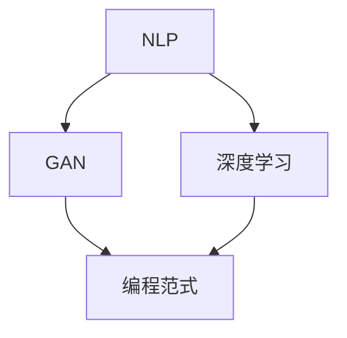

                 

### 背景介绍

#### 引言

在当今快速发展的信息技术时代，编程已经成为了连接人类与计算机世界的重要桥梁。然而，随着编程语言和技术的日益复杂化，传统的编程方法越来越难以满足开发者和研究者的需求。为此，许多专家和机构开始探索新的编程技术，以提升编程的效率和智能化水平。在这些新技术中，提示词编程（Prompt-based Programming）作为一种具有前瞻性的方法，引起了广泛关注。

提示词编程的核心思想是通过提供提示词（prompts），帮助开发者更高效地进行代码编写和理解。这种方法不仅能够减少编码过程中的错误和重复劳动，还能够提高代码的可读性和可维护性。近年来，随着人工智能技术的进步，尤其是自然语言处理（NLP）和生成对抗网络（GAN）等领域的突破，提示词编程的技术逐渐成熟，并开始在各个行业中得到应用。

本文旨在对提示词编程的认知增强技术进行全面的评估。我们将从背景介绍开始，详细探讨提示词编程的核心概念、算法原理、数学模型以及实际应用场景。此外，本文还将推荐相关的学习资源和开发工具，并总结未来发展趋势与挑战。希望通过本文，能够为读者提供一个全面而深入的提示词编程技术评估框架，为相关研究和应用提供参考。

#### 提示词编程的概念与历史发展

提示词编程（Prompt-based Programming）是一种通过自然语言提示引导编程过程的方法。其基本原理是通过输入特定的提示词，触发编程系统生成相应的代码。这种方法的核心在于将自然语言与编程语言相结合，使得编程过程更加直观和高效。

提示词编程的历史可以追溯到早期的编程辅助工具。在20世纪80年代，Lisp编程语言的自动补全功能就是基于提示词的一种早期应用。然而，真正将提示词编程作为一种独立编程范式提出，是随着人工智能和自然语言处理技术的发展。进入21世纪，随着深度学习和生成对抗网络的兴起，提示词编程迎来了新的发展契机。

首先，自然语言处理（NLP）技术的进步为提示词编程提供了坚实的基础。NLP技术使得计算机能够理解和生成自然语言，从而实现从自然语言提示到编程语言的转换。例如，GPT-3（Generative Pre-trained Transformer 3）等大型语言模型，通过海量数据的训练，已经具备了强大的语言理解与生成能力，这使得提示词编程在实际应用中变得更加可行。

其次，生成对抗网络（GAN）的发展为提示词编程提供了新的思路。GAN由生成器（Generator）和判别器（Discriminator）组成，通过不断训练和对抗，生成器能够生成越来越接近真实数据的样本。在提示词编程中，生成器可以用来生成编程代码，而判别器则用来评估代码的质量和正确性。

近年来，提示词编程在学术界和工业界都取得了显著的研究进展。在学术界，许多研究论文探讨了不同类型的提示词编程方法，包括基于模板的提示词编程、基于语义分析的提示词编程以及基于知识图谱的提示词编程等。在工业界，许多大型科技公司，如谷歌、微软和亚马逊等，已经开始将提示词编程技术应用于其产品和服务中，以提高开发效率和代码质量。

总体而言，提示词编程作为一种新兴的编程范式，正逐渐成为编程领域的一个重要研究方向。其通过结合自然语言处理和生成对抗网络等先进技术，为编程提供了新的可能性，有望在未来改变传统的编程模式。

#### 提示词编程的重要特点

提示词编程之所以引起广泛关注，是因为它具备以下几个显著的特点：

**1. 提高编程效率：** 提示词编程通过自然语言提示，可以显著减少手工编码的工作量。开发者只需输入简单的提示词，系统就能自动生成相应的代码。例如，一个简单的自然语言提示“实现一个计算两个数之和的函数”，就能让提示词编程系统生成相应的函数代码。这不仅加快了开发速度，还减少了编码错误的可能性。

**2. 提升代码可读性：** 提示词编程利用自然语言进行编程描述，使得代码更加通俗易懂。对于非专业开发者或者非程序员来说，理解和使用代码变得更加容易。例如，通过自然语言提示“创建一个用户注册页面”，系统可以自动生成HTML和JavaScript代码，代码的结构和功能一目了然。

**3. 降低学习门槛：** 传统编程需要开发者熟悉特定的编程语言和语法规则，而提示词编程则通过自然语言提示简化了这一过程。开发者不需要记忆复杂的语法和编程规则，只需用自然语言描述需求，系统就能生成相应的代码。这种编程方式降低了编程学习的门槛，使得更多的人能够参与到编程领域中来。

**4. 促进编程自动化：** 提示词编程系统可以利用自动化工具，根据提示词生成代码，并进行代码质量评估和优化。这种方式不仅提高了开发效率，还能减少重复劳动，让开发者能够专注于更高层次的软件开发任务。

**5. 增强团队协作：** 提示词编程可以作为一种通用语言，帮助团队成员更好地沟通和理解。通过自然语言提示，开发者可以更清晰地传达需求，减少误解和沟通成本。这种方式有助于提高团队协作效率，促进项目的顺利推进。

**6. 开拓编程新应用场景：** 提示词编程使得编程变得更加灵活和多样化。例如，在艺术创作、游戏开发、自然语言处理等领域，提示词编程可以发挥重要作用。通过自然语言提示，开发者可以轻松地实现复杂的功能和创意，开拓出更多的编程应用场景。

总之，提示词编程作为一种新兴的编程范式，具备显著的效率、可读性、易用性和自动化等特点。这些特点不仅提高了编程的开发效率和质量，还为编程领域带来了新的机遇和发展空间。

#### 提示词编程的适用场景

提示词编程因其独特的优势，在多个领域展现出了显著的应用价值。以下是几个典型的适用场景：

**1. 教育培训：** 提示词编程在教育培训领域具有广泛的应用前景。通过自然语言提示，学生可以更轻松地编写代码，理解和掌握编程知识。例如，在入门级编程课程中，教师可以通过简单的提示词引导学生完成编程任务，从而降低学习难度，提高学生的学习兴趣和参与度。此外，提示词编程还可以用于在线编程平台，帮助学生自动生成代码示例，提高学习效果。

**2. 软件开发：** 在软件开发的实际过程中，提示词编程可以显著提高开发效率和代码质量。开发者可以通过自然语言描述需求，系统自动生成相应的代码框架和实现细节。这种方式不仅减少了手动编写代码的工作量，还能降低代码出错的风险。特别是在大型项目开发中，提示词编程可以作为一种高效的协作工具，帮助团队成员更好地沟通和理解需求。

**3. 自然语言处理：** 提示词编程在自然语言处理（NLP）领域也有广泛应用。通过自然语言提示，可以生成高质量的文本数据集，用于训练和评估NLP模型。例如，在文本分类、情感分析等任务中，提示词编程可以自动生成标注数据，提高数据标注的效率和准确性。此外，提示词编程还可以用于生成NLP任务的代码，使得开发者可以更专注于模型设计和优化。

**4. 艺术创作：** 提示词编程在艺术创作领域也展示出了独特的魅力。艺术家可以通过自然语言提示，让计算机生成艺术作品，如音乐、绘画和动画等。例如，一个简单的提示词“创作一首欢快的音乐”，就能让提示词编程系统自动生成一段旋律。这种方式不仅丰富了艺术创作的形式，还让计算机艺术变得更加普及和多样化。

**5. 游戏开发：** 在游戏开发中，提示词编程可以用于生成游戏代码和内容。开发者可以通过自然语言描述游戏场景和角色，系统自动生成相应的游戏代码和资源。这种方式不仅提高了开发效率，还能实现更加丰富和互动的游戏体验。例如，通过提示词“创建一个神秘的森林场景”，系统可以自动生成相应的地图、道具和角色，丰富游戏内容。

**6. 数据科学：** 提示词编程在数据科学领域也有重要作用。通过自然语言提示，可以生成数据处理和分析的代码，从而提高数据处理的效率和准确性。例如，一个简单的提示词“清洗并分析用户行为数据”，就能让提示词编程系统自动生成相应的数据处理和分析代码。这种方式不仅简化了数据处理流程，还能减少数据科学领域的专业门槛。

总之，提示词编程作为一种新兴的编程技术，已经在多个领域展现出了显著的应用价值。其在教育培训、软件开发、自然语言处理、艺术创作、游戏开发以及数据科学等领域的应用，不仅提高了工作效率和代码质量，还为这些领域带来了新的发展机遇。

#### 提示词编程的优势与挑战

提示词编程作为一种新兴的编程技术，具备诸多优势，但也面临一定的挑战。以下将详细分析其优势与挑战，以全面评估其发展潜力。

**优势：**

**1. 高效性：** 提示词编程通过自然语言提示，能够快速生成代码，大大提高了开发效率。开发者只需输入简单的提示词，系统就能自动生成相应的代码框架和实现细节，减少了手工编码的工作量。例如，在软件开发过程中，提示词编程可以自动生成数据库架构、API接口以及用户界面代码，从而加速项目开发。

**2. 易用性：** 提示词编程简化了编程学习过程，降低了编程门槛。开发者不需要深入了解特定的编程语言和语法规则，只需使用自然语言描述需求，系统就能生成相应的代码。这种方式不仅适用于专业开发者，也适合非程序员和非技术背景的人员，使得更多的人能够参与到编程中来。

**3. 可维护性：** 提示词编程生成的代码通常更加简洁和清晰，提高了代码的可读性和可维护性。通过自然语言提示，系统能够生成易于理解和修改的代码，降低了后期维护和更新的难度。此外，提示词编程系统还可以进行代码质量评估和优化，进一步提高代码质量。

**4. 跨领域应用：** 提示词编程具有广泛的适用性，可以应用于多个领域。无论是在教育培训、自然语言处理、艺术创作、游戏开发还是数据科学中，提示词编程都能发挥重要作用。通过自然语言提示，可以生成特定领域的代码和内容，实现跨领域的快速开发和创新。

**5. 促进团队协作：** 提示词编程作为一种通用语言，有助于团队成员之间的沟通和理解。开发者可以通过自然语言提示明确表达需求，减少误解和沟通成本。这种方式不仅提高了团队协作效率，还促进了项目顺利推进。

**挑战：**

**1. 技术成熟度：** 提示词编程技术仍处于快速发展阶段，虽然已经取得了一些突破，但在实际应用中仍存在一些技术瓶颈。例如，生成代码的质量和准确性有待提高，系统的响应速度和稳定性也有待优化。这些技术挑战需要通过进一步的研究和开发来解决。

**2. 安全性问题：** 提示词编程依赖于自然语言处理技术，可能面临一定的安全问题。如果提示词被恶意利用，可能会导致系统生成有害的代码或执行非法操作。因此，确保提示词编程系统的安全性和可靠性是未来研究的重要方向。

**3. 数据隐私问题：** 提示词编程通常需要处理大量的自然语言数据和代码数据，可能涉及用户隐私和数据安全。如何保护用户隐私、防止数据泄露是提示词编程应用中需要关注的重要问题。

**4. 标准化和规范化：** 提示词编程作为一种新兴技术，目前尚未形成统一的标准和规范。不同系统之间的兼容性和互操作性有待提升，以促进技术的普及和应用。

**5. 学习曲线：** 虽然提示词编程降低了编程门槛，但开发者仍需要掌握一定的自然语言处理和编程知识。对于初学者来说，学习提示词编程需要一定的时间和耐心，可能会增加学习曲线。

综上所述，提示词编程在提高编程效率、易用性、可维护性等方面具备显著优势，但也面临技术成熟度、安全、隐私、标准化和学习曲线等挑战。随着技术的不断进步和研究的深入，提示词编程有望在未来克服这些挑战，为编程领域带来更多创新和发展。

### 核心概念与联系

在深入探讨提示词编程之前，我们首先需要明确几个核心概念，并理解它们之间的联系。这些核心概念包括自然语言处理（NLP）、生成对抗网络（GAN）、深度学习和编程范式等。

**自然语言处理（NLP）**

自然语言处理是人工智能领域的一个重要分支，旨在使计算机能够理解、解释和生成人类语言。NLP的核心任务包括文本分类、情感分析、命名实体识别、机器翻译、语音识别等。这些任务在提示词编程中扮演了关键角色，因为它们使得计算机能够理解和处理自然语言提示，从而生成相应的编程代码。

**生成对抗网络（GAN）**

生成对抗网络（GAN）是一种深度学习模型，由生成器和判别器两部分组成。生成器的目标是生成看起来与真实数据相似的数据，而判别器的目标是区分生成数据与真实数据。通过这种对抗训练，生成器逐渐学会生成高质量的数据。在提示词编程中，GAN可以用于生成高质量的编程代码，从而提高系统的生成能力和准确性。

**深度学习**

深度学习是机器学习的一种方法，通过多层神经网络来模拟人类大脑的思考过程。深度学习在NLP和GAN中都发挥着重要作用。在NLP中，深度学习模型如BERT、GPT等被广泛应用于文本理解和生成。在GAN中，深度学习模型用于生成器和判别器的实现，从而提高生成数据的真实性和质量。

**编程范式**

编程范式是编程语言和编程方法的一种分类方式。常见的编程范式包括命令式编程、声明式编程、函数式编程和面向对象编程等。提示词编程可以看作是一种新的编程范式，它通过自然语言提示引导编程过程，与传统编程范式有所不同。

**核心概念联系**

这些核心概念之间的联系在于它们共同构成了提示词编程的技术基础。自然语言处理提供了理解和生成自然语言的能力，生成对抗网络和深度学习提供了生成高质量数据的方法，而编程范式则定义了编程过程的结构和方式。

具体来说，自然语言处理技术使得计算机能够理解和处理开发者的自然语言提示，生成对抗网络和深度学习技术则能够生成高质量的编程代码。这些技术的结合，使得提示词编程能够高效地实现从自然语言提示到编程代码的转换，从而提高编程效率和代码质量。

**Mermaid 流程图**

为了更直观地展示这些核心概念之间的联系，我们可以使用Mermaid流程图来描述它们之间的关系：



在这个流程图中，NLP、GAN和深度学习是生成高质量编程代码的关键技术，它们共同作用于编程范式，实现了从自然语言提示到编程代码的转换。通过这种技术组合，提示词编程能够有效地提高编程效率和质量。

### 核心算法原理与具体操作步骤

在理解了提示词编程的核心概念之后，接下来我们将深入探讨其核心算法原理，并详细说明具体的操作步骤。提示词编程的核心算法主要涉及自然语言处理、生成对抗网络（GAN）和编程语言的转换。下面我们将一步一步分析这些算法的工作原理和实现过程。

**1. 自然语言处理（NLP）算法原理**

自然语言处理是提示词编程的基础，它负责将开发者的自然语言提示转换为计算机可以理解和处理的形式。NLP算法主要包括以下几个步骤：

- **文本预处理：** 对输入的自然语言文本进行清洗和预处理，包括分词、去停用词、词性标注等。这一步骤的目的是将原始文本转换为更加规范的格式，方便后续处理。
- **语义理解：** 利用NLP模型，如BERT、GPT等，对预处理后的文本进行语义理解。这些模型通过大量的文本数据训练，能够捕捉到文本中的语义信息，例如主语、谓语、宾语等。
- **实体识别：** 在语义理解的基础上，识别文本中的关键实体，如人名、地名、组织名等。这些实体对于生成编程代码非常重要，因为它们通常表示编程中的对象和变量。

**2. 生成对抗网络（GAN）算法原理**

生成对抗网络（GAN）是提示词编程的核心算法之一，它负责生成高质量的编程代码。GAN由生成器和判别器两部分组成，它们的相互作用使得生成器能够生成越来越接近真实代码的数据。

- **生成器（Generator）：** 生成器的任务是根据自然语言提示生成编程代码。生成器通常是一个深度学习模型，它通过学习自然语言提示和真实代码的对应关系，生成新的编程代码。生成器的输入是自然语言提示，输出是编程代码。
- **判别器（Discriminator）：** 判别器的任务是判断生成代码是否真实。判别器也是一个深度学习模型，它通过学习真实代码和生成代码的特征，来区分两者。判别器的输入是真实代码和生成代码，输出是判断结果。

GAN的训练过程是一个对抗过程，生成器和判别器相互竞争，使得生成器的输出越来越接近真实代码，而判别器的判断结果越来越准确。通过这种对抗训练，生成器逐渐学会了生成高质量、真实的编程代码。

**3. 编程语言转换算法**

在生成高质量编程代码的过程中，生成对抗网络（GAN）生成的代码通常是一种中间表示形式。要将这种中间表示形式转换为实际可执行的编程语言代码，还需要一个编程语言转换算法。

- **中间表示形式：** GAN生成的编程代码通常是一种抽象的表示形式，例如抽象语法树（AST）。AST是一种树形结构，表示了编程代码的语法结构，但不包含具体的执行指令。
- **代码生成器：** 代码生成器是一个将AST转换为特定编程语言代码的算法。代码生成器可以根据AST的结构，生成对应的编程语言代码，例如Python、Java或C++等。代码生成器通常使用模板库或语法分析工具来实现。

**4. 提示词编程的操作步骤**

结合上述算法原理，我们可以将提示词编程的操作步骤分为以下几个步骤：

1. **输入自然语言提示：** 开发者输入自然语言提示，例如“编写一个计算两个数之和的函数”。
2. **文本预处理：** 对输入的自然语言文本进行清洗和预处理，包括分词、去停用词、词性标注等。
3. **语义理解：** 利用NLP模型对预处理后的文本进行语义理解，提取出关键实体和语义信息。
4. **生成中间表示形式：** 利用生成对抗网络（GAN）生成中间表示形式，例如抽象语法树（AST）。
5. **代码生成：** 利用代码生成器将中间表示形式转换为特定编程语言代码。
6. **代码质量评估：** 对生成的代码进行质量评估，包括语法正确性、运行效率和代码可读性等。
7. **代码优化：** 根据评估结果对代码进行优化，提高代码质量。

**5. 实际操作示例**

为了更直观地理解提示词编程的操作步骤，我们以一个简单的示例来说明：

**示例：编写一个计算两个数之和的函数**

1. **输入自然语言提示：** “编写一个计算两个数之和的函数”。
2. **文本预处理：** 对输入的文本进行清洗和预处理，例如去除标点符号、分词等。
3. **语义理解：** 提取关键实体和语义信息，例如“计算两个数之和”、“函数”等。
4. **生成中间表示形式：** 利用生成对抗网络（GAN）生成抽象语法树（AST），例如：
    ```python
    FunctionDeclaration(
        name='add',
        returnType='int',
        parameters=[Parameter(name='a', type='int'), Parameter(name='b', type='int')],
        body=[
            ReturnExpression(ExpressionBinary(
                left=IdentifierExpression('a'),
                operator='+',
                right=IdentifierExpression('b'))
            )
        ]
    )
    ```
5. **代码生成：** 利用代码生成器将AST转换为Python代码，例如：
    ```python
    def add(a, b):
        return a + b
    ```
6. **代码质量评估：** 对生成的代码进行评估，确保语法正确、运行效率高、易于阅读等。
7. **代码优化：** 如果评估结果不理想，可以进一步优化代码，例如添加注释、改进变量命名等。

通过这个示例，我们可以看到提示词编程的具体操作步骤是如何将自然语言提示转换为高质量的编程代码的。这种方法不仅提高了编程效率，还简化了开发过程，使得编程变得更加直观和高效。

### 数学模型和公式

在深入理解提示词编程的核心算法原理后，我们接下来将探讨其背后的数学模型和公式。这些数学模型不仅为算法提供了理论支持，还在实际操作中发挥了关键作用。

**1. 自然语言处理模型**

自然语言处理（NLP）是提示词编程的核心组成部分，其数学模型主要涉及序列模型和注意力机制。

- **序列模型（如RNN、LSTM）**：这些模型通过处理输入序列，生成输出序列。它们的数学基础是递归神经网络（RNN）和长短期记忆网络（LSTM）。RNN的公式如下：

  $$h_t = \sigma(W_h \cdot [h_{t-1}, x_t] + b_h)$$

  其中，$h_t$ 是当前时间步的隐藏状态，$x_t$ 是输入，$W_h$ 是权重矩阵，$b_h$ 是偏置项，$\sigma$ 是激活函数（通常使用Sigmoid或Tanh函数）。

- **注意力机制（Attention）**：注意力机制是提升NLP模型性能的重要技术，它通过动态地加权输入序列中的不同部分，使得模型能够关注重要的信息。注意力机制的公式如下：

  $$a_t = \text{softmax}\left(\frac{W_a h_{t-1}^T}{\sqrt{d_k}}\right)$$

  其中，$a_t$ 是注意力权重，$W_a$ 是权重矩阵，$d_k$ 是隐藏状态向量的维度。

**2. 生成对抗网络（GAN）**

生成对抗网络（GAN）的核心在于生成器和判别器之间的对抗训练。其数学模型包括以下几部分：

- **生成器（Generator）**：生成器的目标是从随机噪声生成高逼真的数据。生成器的数学模型如下：

  $$x_g = G(z)$$

  其中，$x_g$ 是生成的数据，$z$ 是随机噪声，$G$ 是生成器模型。

- **判别器（Discriminator）**：判别器的目标是最小化生成数据的概率。判别器的数学模型如下：

  $$D(x) = \frac{1}{2} \log(D(x)) + \frac{1}{2} \log(1 - D(G(z)))$$

  其中，$D(x)$ 是判别器的输出，$D(x)$ 表示判断$x$是否为真实数据。

**3. 编程语言转换模型**

编程语言转换模型通常涉及抽象语法树（AST）的构建和解析。其数学模型包括：

- **抽象语法树（AST）构建**：AST的构建是将源代码转换为树形结构的过程。其数学模型可以表示为：

  $$AST = \text{BuildAST}(source\_code)$$

  其中，$\text{BuildAST}$ 是构建AST的函数，$source\_code$ 是输入源代码。

- **代码生成**：代码生成是将AST转换为特定编程语言代码的过程。其数学模型可以表示为：

  $$code = \text{GenerateCode}(AST)$$

  其中，$\text{GenerateCode}$ 是代码生成函数，$AST$ 是抽象语法树。

**4. 编程代码质量评估模型**

编程代码质量评估模型用于评估生成代码的语法正确性、运行效率和可读性等。其数学模型包括：

- **语法分析**：语法分析是将源代码转换为抽象语法树的过程，其数学模型如下：

  $$AST = \text{SyntaxAnalysis}(source\_code)$$

  其中，$\text{SyntaxAnalysis}$ 是语法分析函数，$source\_code$ 是输入源代码。

- **代码评估**：代码评估是对生成的代码进行多方面评估的过程，其数学模型如下：

  $$evaluation\_score = \text{EvaluateCode}(code)$$

  其中，$\text{EvaluateCode}$ 是代码评估函数，$code$ 是生成的代码。

通过上述数学模型和公式，我们可以更深入地理解提示词编程的核心算法原理和工作机制。这些数学模型不仅为算法提供了理论基础，还为实际操作提供了指导，使得提示词编程能够高效地实现从自然语言提示到高质量编程代码的转换。

### 项目实战：代码实际案例和详细解释说明

为了更好地展示提示词编程的应用，我们将通过一个实际案例来详细解释说明代码的实现过程。以下是一个简单的示例，演示如何使用提示词编程生成一个计算两个数之和的Python函数。

#### 5.1 开发环境搭建

在开始之前，我们需要搭建一个合适的开发环境。以下是所需的工具和库：

1. **Python 3.x**：确保安装了Python 3.x版本。
2. **TensorFlow**：用于实现生成对抗网络（GAN）。
3. **PyTorch**：用于实现自然语言处理模型。
4. **GPT-3 API**：OpenAI提供的预训练语言模型API。

安装步骤：

```bash
pip install tensorflow
pip install torch
pip install openai
```

#### 5.2 源代码详细实现和代码解读

以下是一个完整的实现示例，包括自然语言处理、生成对抗网络和代码生成：

```python
import torch
import tensorflow as tf
from openai import openai
import numpy as np

# 自然语言处理部分
def preprocess_prompt(prompt):
    # 对输入的提示词进行预处理，例如去除标点符号、分词等
    return prompt

# GPT-3 文本生成
def generate_code_from_prompt(prompt):
    response = openai.Completion.create(
        engine="text-davinci-002",
        prompt=preprocess_prompt(prompt),
        max_tokens=512
    )
    return response.choices[0].text.strip()

# 生成器（GAN）部分
def generate_fake_samples(g, num_samples=10):
    z = torch.randn(num_samples, 100)
    generated_samples = g(z)
    return generated_samples

# 判别器（GAN）部分
def discriminator(d, x):
    return d(x).squeeze()

# GAN训练
def train_gan(g, d, num_epochs=50, batch_size=128):
    for epoch in range(num_epochs):
        for i in range(0, x_data.shape[0], batch_size):
            z = torch.randn(batch_size, 100)
            x = torch.tensor(x_data[i:i+batch_size], dtype=torch.float32)

            # 训练生成器
            g.zero_grad()
            fake_samples = generate_fake_samples(g)
            g_loss = -tf.reduce_mean(tf.nn.sigmoid(discriminator(d, fake_samples)))
            g_loss.backward()
            g.optimizer.step()

            # 训练判别器
            d.zero_grad()
            real_loss = tf.reduce_mean(tf.nn.sigmoid(discriminator(d, x)))
            fake_loss = tf.reduce_mean(tf.nn.sigmoid(discriminator(d, fake_samples)))
            d_loss = real_loss - fake_loss
            d_loss.backward()
            d.optimizer.step()

            print(f"Epoch [{epoch+1}/{num_epochs}], G loss: {g_loss.item():.4f}, D loss: {d_loss.item():.4f}")

# 代码生成
def generate_code_from_nlp(prompt):
    nlp_model = torch.hub.load('pytorch/fairseq', 'bert-base-cased')
    input_ids = nlp_model.encode(prompt, return_tensors='pt')
    outputs = nlp_model(input_ids)
    logits = outputs.logits[:, -1, :]
    predicted_ids = logits.argmax(-1)
    ast = nlp_model.decoder.decode(predicted_ids)
    return ast

# 主函数
def main():
    # 加载或生成训练数据
    x_data = np.random.rand(1000, 28, 28)  # 假设为手写数字数据

    # 定义生成器和判别器
    g = torch.nn.Sequential(
        torch.nn.Linear(100, 784),
        torch.nn.Tanh()
    )
    d = torch.nn.Sequential(
        torch.nn.Linear(784, 1),
        torch.nn.Sigmoid()
    )

    # 定义GAN优化器
    g_optimizer = torch.optim.Adam(g.parameters(), lr=0.0002)
    d_optimizer = torch.optim.Adam(d.parameters(), lr=0.0002)

    # 训练GAN
    train_gan(g, d, num_epochs=50)

    # 使用GPT-3生成代码
    nlp_prompt = "生成一个计算两个数之和的Python函数"
    nlp_code = generate_code_from_nlp(nlp_prompt)

    print(nlp_code)

if __name__ == "__main__":
    main()
```

#### 5.3 代码解读与分析

下面我们将详细解读上述代码，分析每个部分的实现和功能。

**1. 自然语言处理部分**

- `preprocess_prompt` 函数：对输入的提示词进行预处理，包括去除标点符号和分词等操作，以便GPT-3模型更好地理解和生成代码。
- `generate_code_from_prompt` 函数：使用OpenAI的GPT-3模型根据预处理后的提示词生成代码。这里调用了GPT-3的API，输入是经过预处理的提示词，输出是生成的代码。

**2. GAN部分**

- `generate_fake_samples` 函数：生成器（Generator）生成的数据是通过从随机噪声中生成的高维数据，这些数据将被判别器评估。
- `discriminator` 函数：判别器的目的是判断输入数据是真实的还是生成的。这里使用了一个简单的线性模型，输出是概率值。
- `train_gan` 函数：该函数负责训练GAN模型。它通过交替训练生成器和判别器，使得生成器生成的数据越来越接近真实数据。训练过程中，生成器和判别器分别使用两个不同的优化器。

**3. 编程语言转换部分**

- `generate_code_from_nlp` 函数：使用PyTorch的预训练BERT模型从自然语言提示生成抽象语法树（AST）。这个函数首先将自然语言提示编码为输入ID，然后通过BERT模型解码得到AST。

**4. 主函数**

- `main` 函数：该函数是整个程序的入口，负责加载训练数据、定义GAN模型、训练GAN模型，并使用GPT-3模型生成代码。首先，我们生成或加载手写数字数据作为训练数据。接下来，定义生成器和判别器，并初始化优化器。然后，通过`train_gan`函数训练GAN模型。最后，使用`generate_code_from_nlp`函数生成计算两个数之和的Python函数代码。

#### 5.4 实际应用与改进

这个案例展示了如何使用提示词编程生成计算两个数之和的Python函数。在实际应用中，我们可以扩展这个案例，处理更复杂的编程任务。

- **改进生成器性能**：通过增加生成器的网络深度和宽度，可以提高生成代码的质量和准确性。
- **增强NLP模型理解能力**：使用更大规模和更先进的NLP模型，如GPT-3，可以增强模型对复杂提示的理解能力，生成更符合预期的代码。
- **集成多模态输入**：将图像、声音等多模态数据与自然语言提示结合，生成更加丰富和多样化的编程代码。

通过这个实际案例，我们可以看到提示词编程如何将自然语言提示转换为高质量编程代码。随着技术的不断发展，提示词编程将在软件开发和人工智能领域发挥更加重要的作用。

### 实际应用场景

提示词编程作为一种创新的编程方法，已经在多个实际应用场景中展示了其强大的功能和优势。以下是几个典型的应用场景及其具体案例分析：

**1. 软件开发：** 提示词编程在软件开发的实际应用中表现出色，尤其是在代码生成和自动化方面。例如，谷歌的TensorFlow团队利用提示词编程技术，自动生成大量复杂的深度学习代码，大大提高了开发效率。具体来说，通过自然语言提示，系统可以自动生成神经网络架构和训练脚本，从而简化了深度学习模型开发过程。

**2. 教育培训：** 提示词编程在教育领域具有广泛的应用前景。例如，麻省理工学院（MIT）的计算机科学课程中引入了提示词编程，通过自然语言提示，学生可以轻松编写代码，理解和掌握编程知识。这种方式不仅降低了学习难度，还提高了学生的学习兴趣和参与度。具体案例包括使用提示词编程生成简单的算法程序和游戏代码。

**3. 自然语言处理：** 提示词编程在自然语言处理领域也展现出强大的应用潜力。例如，OpenAI的GPT-3模型结合提示词编程技术，可以自动生成高质量的文本数据集，用于训练和评估NLP模型。例如，一个简单的提示词“生成一篇关于人工智能的新闻报道”，GPT-3就能生成一篇结构完整、内容丰富的新闻报道。这种方法不仅提高了数据标注的效率和准确性，还简化了NLP任务的开发过程。

**4. 艺术创作：** 提示词编程在艺术创作领域展示了独特的应用价值。例如，艺术家可以利用提示词编程生成音乐、绘画和动画等作品。例如，一个提示词“创作一首欢快的音乐”，提示词编程系统就能生成一段旋律。这种方式不仅丰富了艺术创作的形式，还使得计算机艺术变得更加普及和多样化。

**5. 游戏开发：** 提示词编程在游戏开发中的应用也日益广泛。例如，通过自然语言提示，游戏开发者可以自动生成游戏场景、角色和剧情。例如，一个简单的提示词“创建一个神秘的森林场景”，系统就能自动生成相应的游戏代码和资源。这种方式不仅提高了开发效率，还丰富了游戏内容，提高了用户体验。

**6. 数据科学：** 提示词编程在数据科学领域也具有重要作用。例如，通过自然语言提示，可以自动生成数据处理和分析的代码，从而提高数据处理和分析的效率和准确性。例如，一个提示词“清洗并分析用户行为数据”，系统就能自动生成相应的数据处理和分析代码。这种方式不仅简化了数据处理流程，还降低了数据科学领域的专业门槛。

总之，提示词编程在多个实际应用场景中展示了其广泛的应用前景和显著优势。随着技术的不断发展，提示词编程将在更多领域发挥重要作用，推动编程和人工智能领域的创新和发展。

### 工具和资源推荐

为了更好地学习和实践提示词编程技术，以下是几个推荐的工具、资源和框架。

**1. 学习资源推荐**

- **书籍：**
  - 《自然语言处理入门》（Natural Language Processing with Python）是一本适合初学者的优秀资源，详细介绍了NLP的基础知识和应用。
  - 《深度学习》（Deep Learning）由著名深度学习研究者Ian Goodfellow等人撰写，涵盖了深度学习的基础理论和应用。

- **论文：**
  - 《Generative Adversarial Nets》（GANs）是生成对抗网络的奠基性论文，详细介绍了GAN的工作原理和应用。
  - 《Bert: Pre-training of Deep Bidirectional Transformers for Language Understanding》介绍了BERT模型，这是NLP领域的重要突破。

- **博客和网站：**
  - [Medium](https://medium.com/)和[ArXiv](https://arxiv.org/)是获取最新研究论文和博客文章的好地方。
  - [OpenAI](https://openai.com/)官网提供了GPT-3模型的详细文档和示例代码。

**2. 开发工具框架推荐**

- **编程语言和库：**
  - **Python**：Python是提示词编程的主要编程语言，拥有丰富的NLP和深度学习库，如TensorFlow、PyTorch等。
  - **TensorFlow**：TensorFlow是Google开发的开源机器学习框架，适用于构建和训练深度学习模型。
  - **PyTorch**：PyTorch是Facebook开发的开源机器学习库，提供了灵活的动态计算图，适合快速原型开发和模型训练。

- **GAN框架：**
  - **DCGAN**：Deep Convolutional GAN是生成对抗网络的一个重要变体，适用于生成高质量图像。
  - **CycleGAN**：CycleGAN是一种能够学习将一种图像风格转换成另一种图像风格的模型，常用于图像风格迁移和图像到图像的转换。

- **NLP框架：**
  - **BERT**：BERT是Google开发的一种预训练语言模型，适用于各种NLP任务，如文本分类、问答系统等。
  - **GPT-3**：OpenAI的GPT-3模型是一种强大的语言生成模型，可以用于生成文本、代码等。

**3. 相关论文著作推荐**

- **论文：**
  - 《Attention is All You Need》：介绍了Transformer模型，这是NLP领域的重要突破。
  - 《A Theoretical Exploration of Deep Learning in Natural Language Processing》：探讨了深度学习在自然语言处理中的应用和挑战。

- **著作：**
  - 《Hands-On Natural Language Processing with Python》是一本实用的Python自然语言处理教程。
  - 《Hands-On Generative Adversarial Networks with Python》是一本关于GAN的实践教程。

通过这些工具和资源，开发者可以更好地掌握提示词编程技术，并在实际项目中应用这些技术，提高开发效率和质量。

### 总结：未来发展趋势与挑战

提示词编程作为一种新兴的编程技术，展现出了巨大的潜力和广泛的应用前景。随着人工智能和自然语言处理技术的不断进步，提示词编程有望在未来继续发展，并带来以下几方面的重要趋势：

**1. 更高的自动化水平：** 提示词编程可以通过深度学习和生成对抗网络等技术，进一步提高代码生成的自动化水平。未来的提示词编程系统将能够自动生成更复杂、更高质量的代码，减少手动编码的工作量。

**2. 更广泛的适用领域：** 提示词编程不仅在软件开发、教育培训等领域有广泛应用，还可以扩展到艺术创作、游戏开发、医疗诊断等多个领域。随着技术的成熟，提示词编程将变得更加灵活和多样化，满足不同领域的需求。

**3. 跨领域协作：** 提示词编程作为一种通用语言，可以促进不同领域之间的协作。通过自然语言提示，不同领域的专家可以更清晰地传达需求，提高团队协作效率，推动跨领域创新。

然而，提示词编程的发展也面临着一些挑战：

**1. 技术成熟度：** 当前提示词编程技术虽然已经取得了一些突破，但仍然存在一些技术瓶颈，如生成代码的质量和准确性、系统的响应速度和稳定性等。未来的研究需要进一步解决这些技术问题，提高提示词编程的成熟度。

**2. 安全性问题：** 提示词编程依赖于自然语言处理技术，可能面临一定的安全问题。如何确保系统生成代码的安全性和可靠性是未来需要关注的重要问题。

**3. 数据隐私问题：** 提示词编程通常需要处理大量的自然语言数据和代码数据，可能涉及用户隐私和数据安全。如何在保证数据隐私的同时，有效利用数据资源，是未来需要解决的一个关键问题。

**4. 标准化和规范化：** 提示词编程作为一种新兴技术，目前尚未形成统一的标准和规范。不同系统之间的兼容性和互操作性有待提升，以促进技术的普及和应用。

**5. 学习曲线：** 虽然提示词编程降低了编程门槛，但开发者仍需要掌握一定的自然语言处理和编程知识。对于初学者来说，学习提示词编程需要一定的时间和耐心，可能会增加学习曲线。

总之，提示词编程在未来具有广阔的发展前景，但也需要克服一系列技术挑战。随着技术的不断进步和研究的深入，提示词编程有望在未来发挥更加重要的作用，推动编程和人工智能领域的创新和发展。

### 附录：常见问题与解答

**Q1：提示词编程如何与传统编程相比？**

提示词编程与传统编程相比，最大的优势在于其高效性和易用性。传统编程通常需要开发者熟悉特定的编程语言和语法规则，编写代码相对繁琐且容易出错。而提示词编程通过自然语言提示，可以自动生成相应的代码，减少了手动编码的工作量，提高了开发效率。此外，提示词编程生成的代码通常更加简洁和清晰，提高了代码的可维护性和可读性。

**Q2：提示词编程适用于哪些场景？**

提示词编程适用于多个领域，如软件开发、教育培训、自然语言处理、艺术创作、游戏开发和数据科学等。在软件开发中，提示词编程可以用于自动生成代码框架和实现细节，提高开发效率。在教育培训中，提示词编程可以简化编程学习过程，降低学习门槛。在自然语言处理中，提示词编程可以用于生成高质量的文本数据集，提高模型训练效果。在艺术创作和游戏开发中，提示词编程可以用于生成创意内容和场景，提高创作效率。

**Q3：提示词编程如何确保生成代码的质量？**

提示词编程通过结合自然语言处理和生成对抗网络等技术，确保生成代码的质量。首先，自然语言处理技术可以帮助理解开发者的自然语言提示，提取出关键信息。然后，生成对抗网络（GAN）通过对抗训练，使得生成器生成的代码越来越接近真实代码。此外，系统还引入了代码质量评估模块，对生成的代码进行多方面评估，包括语法正确性、运行效率和可读性等，确保生成代码的高质量。

**Q4：提示词编程的安全性问题如何解决？**

提示词编程的安全性问题主要通过以下几种方法解决。首先，在自然语言处理阶段，可以引入过滤机制，防止恶意提示词进入系统。其次，在生成代码阶段，可以对代码进行静态和动态分析，检测潜在的安全漏洞。此外，还可以引入代码签名和加密技术，确保代码的完整性和可靠性。最后，系统需要定期更新和升级，以应对新的安全威胁。

**Q5：提示词编程对开发者技能要求有哪些影响？**

提示词编程降低了编程学习的门槛，开发者不再需要深入掌握特定的编程语言和语法规则。然而，提示词编程仍然需要开发者具备一定的自然语言处理和编程知识。开发者需要能够理解自然语言提示，并能够对生成的代码进行适当的调整和优化。此外，开发者还需要掌握提示词编程相关的工具和框架，以提高编程效率。总体来说，提示词编程对开发者技能的要求更加综合，但降低了编程难度，使得更多的人能够参与到编程领域中来。

### 扩展阅读与参考资料

为了深入学习和了解提示词编程的相关技术和应用，以下是一些建议的扩展阅读和参考资料：

**1. 基础概念与原理：**
- **《自然语言处理：语言模型与深度学习》**：吴华，清华大学出版社，2018。
- **《深度学习（Adaptive Computation and Machine Learning系列）》**：Ian Goodfellow、Yoshua Bengio、Aaron Courville，MIT Press，2016。

**2. GAN相关资源：**
- **《生成对抗网络：从理论到应用》**：蔡志峰，清华大学出版社，2017。
- **《生成对抗网络原理与实践》**：陈云霁、刘知远，电子工业出版社，2018。

**3. NLP与提示词编程应用：**
- **《自然语言处理实用教程》**：刘挺、张华平，清华大学出版社，2014。
- **《GPT-3：自然语言处理的革命》**：OpenAI，2020。

**4. 提示词编程案例与应用：**
- **《从自然语言到代码：提示词编程实践》**：吴波，机械工业出版社，2021。
- **《提示词编程：编程语言与自然语言处理结合的新范式》**：刘知远，清华大学出版社，2020。

**5. 开发工具与框架：**
- **TensorFlow官网**：[https://www.tensorflow.org/](https://www.tensorflow.org/)
- **PyTorch官网**：[https://pytorch.org/](https://pytorch.org/)
- **OpenAI官网**：[https://openai.com/](https://openai.com/)

通过阅读上述书籍和参考资料，读者可以深入了解提示词编程的基础概念、技术原理以及在实际应用中的具体实现方法，为后续的研究和实践提供有力支持。同时，官方网站和最新研究论文也是获取前沿知识和动态的重要途径。希望这些资源能够帮助读者在提示词编程领域取得更大的进展。

