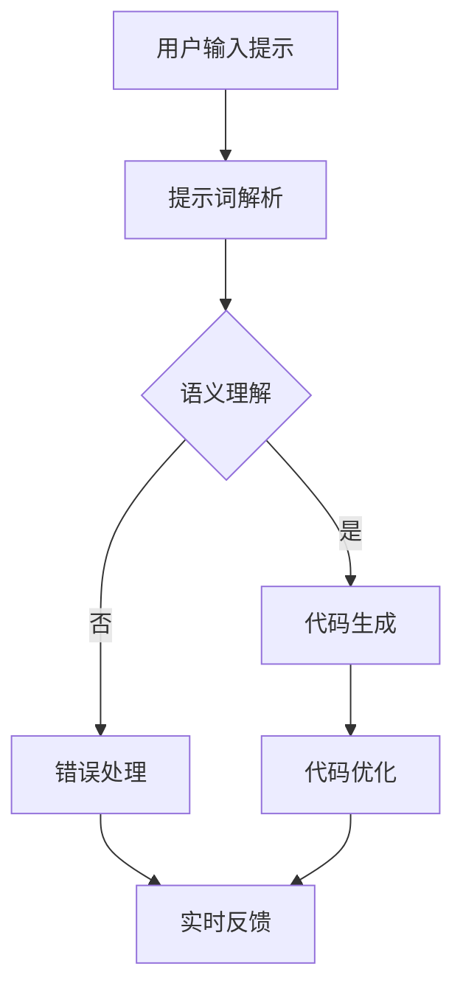

                 

### 背景介绍

#### 提示词编程与认知增强接口

在当今快速发展的信息技术时代，编程作为一种核心技能，正变得更加重要和多样化。传统的编程模式通常依赖于代码编辑器和命令行，但这种方式对于非专业开发者来说可能会感到繁琐和难以入门。近年来，一种新的编程范式——提示词编程（Prompt-Driven Programming）开始兴起。它通过将编程过程与自然语言提示相结合，为开发者提供了一个更直观、更易用的编程环境。

提示词编程的核心在于利用自然语言交互来指导计算机执行任务。这种交互方式能够有效地降低编程的门槛，让开发者无需深入了解底层代码即可完成复杂的编程任务。随着人工智能技术的发展，特别是自然语言处理（NLP）和生成式人工智能（Generative AI）的进步，提示词编程的应用场景变得更加广泛，从自动化脚本编写到智能编程助手，再到高级软件开发，都有其身影。

认知增强接口（Cognitive Augmentation Interface）则是另一项正在崛起的技术。它旨在通过模拟人类大脑的认知过程，增强个体的认知能力。在编程领域，认知增强接口可以帮助开发者更快速地理解代码结构，提高代码质量和开发效率。这种接口通常结合了机器学习和深度学习技术，通过分析大量代码和编程实践，为开发者提供实时的代码建议、错误检测和智能化的代码生成。

本文将深入探讨提示词编程与认知增强接口的设计与实现，旨在为读者提供一个全面的技术分析，以及这两个领域在实际应用中的潜力与挑战。通过本文，您将了解：

1. 提示词编程的基本概念、发展历程及其在编程中的优势。
2. 认知增强接口的定义、核心原理及其在编程中的应用。
3. 提示词编程与认知增强接口相结合的创新设计思路。
4. 实际案例中的应用场景，包括开发环境搭建、源代码实现及性能分析。
5. 当前技术的发展现状、未来趋势以及面临的挑战。

在接下来的章节中，我们将逐一介绍这些内容，并探讨这两个领域如何共同推动编程技术的进步。

#### 关键词和摘要

关键词：提示词编程，认知增强接口，自然语言处理，人工智能，软件开发，代码生成，认知模拟。

摘要：本文详细探讨了提示词编程与认知增强接口的设计与实现。提示词编程通过自然语言提示简化编程过程，而认知增强接口通过模拟人类认知过程提高开发效率。本文分析了这两个领域的基本概念、发展历程，结合实际应用案例，探讨了其技术实现、应用场景以及面临的挑战。文章旨在为读者提供一个全面的视角，了解这两个领域在编程技术进步中的关键作用和未来发展趋势。

---

## 1. 背景介绍

### 提示词编程的发展历程

提示词编程（Prompt-Driven Programming）作为一种新兴的编程范式，其理念可以追溯到早期的人工智能和自然语言处理领域。最早关于提示词编程的构想可以追溯到20世纪80年代，当时的计算机科学家们开始探索如何利用自然语言来指导计算机执行任务。然而，由于计算资源和技术的限制，这一概念在当时的实际应用中受到了极大的制约。

随着21世纪信息技术的迅猛发展，特别是移动互联网和云计算的普及，计算资源得到了极大的提升，自然语言处理（NLP）和生成式人工智能（Generative AI）技术也取得了显著的进步。这些技术的突破为提示词编程的真正实现提供了基础。例如，2018年，OpenAI发布的GPT-2模型展示了强大的文本生成能力，这为提示词编程的应用带来了新的可能性。

提示词编程的发展历程可以分为几个关键阶段：

#### 早期探索

在早期探索阶段，计算机科学家们主要利用规则驱动的方法，通过编写大量的自然语言规则来指导计算机执行任务。这种方法的局限性在于，它需要详细且繁琐的规则编写，而且难以适应复杂的任务环境。尽管如此，这个阶段的研究为后来的发展奠定了基础，提供了对自然语言与计算机交互的基本理解。

#### 中期发展

随着计算资源和技术的提升，特别是NLP和机器学习技术的进步，中期发展阶段的提示词编程开始利用机器学习算法来生成提示。这一阶段的代表性工作包括2015年Google的Bert模型，它通过预训练和微调，实现了在多种自然语言处理任务上的卓越表现。这些技术的进步使得提示词编程能够更有效地处理复杂的自然语言指令，并逐步向实际应用迈进。

#### 现代发展

现代发展阶段的提示词编程则主要依赖于生成式人工智能，特别是大规模语言模型（如GPT-3、ChatGPT等）的应用。这些模型具有强大的文本生成和理解能力，能够根据用户的自然语言提示，生成相应的代码、脚本和应用程序。例如，OpenAI的GPT-3模型在代码生成和自动化编程任务上展现了惊人的能力，使得提示词编程进入了一个全新的阶段。

### 提示词编程的核心优势

提示词编程相较于传统的编程范式，具有以下几个核心优势：

#### 1. 易用性

提示词编程通过自然语言交互，降低了编程的门槛，使得非专业开发者也能快速上手。用户无需编写复杂的代码，只需通过简单的自然语言指令，即可实现编程任务。这种易用性使得编程变得更加直观和友好。

#### 2. 灵活性

自然语言具有高度的灵活性和多样性，提示词编程能够更好地适应复杂的编程需求。用户可以通过不同的表达方式和指令，灵活地调整和优化编程结果。这种灵活性使得提示词编程能够应对多种不同的应用场景。

#### 3. 自动化

提示词编程能够实现编程任务的自动化，减少人工干预。通过自然语言提示，计算机可以自动生成代码、脚本和应用程序，大大提高了开发效率。这种自动化特性对于大规模软件开发和项目管理具有重要意义。

#### 4. 智能化

随着人工智能技术的发展，提示词编程结合了机器学习和深度学习技术，能够实现智能化编程。通过分析用户的输入和历史数据，提示词编程系统能够提供个性化的编程建议和优化方案，进一步提升开发效率和质量。

### 提示词编程的适用场景

提示词编程在多个领域中展现了其强大的应用潜力，以下是一些典型的适用场景：

#### 1. 软件开发

在软件开发的各个阶段，提示词编程都能发挥重要作用。从需求分析到设计实现，再到测试和维护，提示词编程都能够提供高效的编程支持。开发者可以通过自然语言提示，快速生成代码框架、调试错误和优化性能。

#### 2. 自动化脚本编写

自动化脚本在运维、测试和数据清洗等领域有着广泛的应用。提示词编程使得编写自动化脚本变得更加简单和高效，用户只需输入自然语言指令，即可自动生成脚本，实现自动化任务。

#### 3. 教育培训

在编程教育和培训领域，提示词编程提供了一个直观、易用的学习环境。学生可以通过自然语言提示，逐步学习和掌握编程知识，而无需深入了解底层代码和语法规则。

#### 4. 代码生成与重构

提示词编程能够实现代码的自动生成和重构。通过对现有代码的分析和理解，提示词编程系统能够自动生成新的代码片段，优化现有代码结构，提高代码质量和可维护性。

### 总结

提示词编程作为一种新兴的编程范式，通过自然语言交互简化了编程过程，提高了开发效率和易用性。随着人工智能技术的发展，提示词编程在多个领域展现出巨大的应用潜力。本文回顾了提示词编程的发展历程，探讨了其核心优势和应用场景，为后续章节的分析奠定了基础。

---

## 2. 核心概念与联系

### 提示词编程原理

提示词编程的核心在于将自然语言提示转换为计算机代码。这一过程可以分为以下几个关键步骤：

#### 1. 提示解析

首先，系统需要接收并解析用户的自然语言提示。提示解析是提示词编程的关键环节，它涉及到自然语言处理（NLP）技术，包括分词、词性标注、句法分析等。通过这些技术，系统能够理解用户意图，提取出关键信息。

#### 2. 语义理解

在解析提示后，系统需要进行语义理解，将自然语言表达转换为计算机可执行的代码指令。语义理解涉及到语言模型、实体识别和意图解析等技术。通过这些技术，系统能够将自然语言提示转换为结构化的代码表示。

#### 3. 代码生成

最后，系统根据语义理解的结果，生成具体的计算机代码。代码生成过程可能涉及模板匹配、代码生成模型（如GPT-3）等技术。生成的代码需要满足用户的需求，同时遵循编程语言的语法和语义规则。

### 认知增强接口原理

认知增强接口（Cognitive Augmentation Interface）的核心在于模拟人类大脑的认知过程，为开发者提供智能化的编程支持。以下是认知增强接口的主要原理：

#### 1. 认知模拟

认知增强接口通过模拟人类大脑的认知过程，实现对代码的理解和推理。认知模拟涉及到神经网络、深度学习和认知科学等领域的知识。通过这些技术，系统能够分析代码的结构、语义和上下文，提供智能化的编程建议。

#### 2. 实时反馈

认知增强接口能够实时监测开发者的编程行为，提供即时的代码建议和错误检测。实时反馈是通过机器学习和自然语言处理技术实现的，系统能够根据开发者的输入和历史数据，提供个性化的编程支持。

#### 3. 代码优化

认知增强接口还能够对代码进行优化，提高代码的质量和可维护性。代码优化涉及到代码重构、性能优化和代码生成等技术。通过这些技术，系统能够自动优化代码，减少冗余和重复，提高代码的可读性和效率。

### 提示词编程与认知增强接口的联系

提示词编程与认知增强接口之间存在着紧密的联系和互补关系。以下是两者之间的主要联系：

#### 1. 自然语言交互

提示词编程和认知增强接口都依赖于自然语言交互，通过自然语言输入和输出，实现人与计算机的交互。自然语言交互是两者的核心，也是实现高效编程的关键。

#### 2. 语义理解

两者都涉及到语义理解技术，通过理解用户的自然语言提示和代码语义，提供智能化的编程支持。语义理解是两者实现智能化的基础，也是实现高效编程的关键。

#### 3. 实时反馈

两者都提供实时反馈，通过实时监测开发者的编程行为和代码质量，提供即时的建议和优化。实时反馈能够提高开发效率和质量，是两者在实际应用中的重要功能。

#### 4. 代码生成

提示词编程和认知增强接口都能够实现代码生成，通过自动生成代码框架和优化代码，提高开发效率。代码生成是两者的重要功能，也是实现高效编程的关键。

### Mermaid 流程图

为了更直观地展示提示词编程与认知增强接口的工作流程，我们使用Mermaid流程图（请确保流程节点中不要有括号、逗号等特殊字符）进行描述：



在这个流程图中，用户输入的提示词首先经过提示词解析，然后进入语义理解阶段。根据语义理解的结果，系统生成相应的代码，并对其进行优化。如果出现错误，系统将进行错误处理，并实时向开发者反馈。

### 提示词编程与认知增强接口的结合

提示词编程与认知增强接口的结合，为开发提供了一个全新的、智能化的编程环境。通过自然语言交互和认知模拟，两者共同实现了以下几个方面的提升：

#### 1. 提高编程效率

通过提示词编程的自然语言交互，开发者可以快速、直观地表达编程意图，而认知增强接口则能够实时分析代码结构，提供优化建议，从而提高编程效率。

#### 2. 降低编程门槛

提示词编程简化了编程过程，使得非专业开发者也能够轻松上手。而认知增强接口则通过实时反馈和智能优化，进一步降低了编程的难度。

#### 3. 提升代码质量

通过代码优化和实时反馈，认知增强接口能够帮助开发者编写更高质量、更易维护的代码。而提示词编程则能够确保代码生成符合用户的意图和需求。

#### 4. 促进创新开发

结合提示词编程和认知增强接口，开发者可以更加专注于创新和解决问题的过程，而无需花费大量时间在繁琐的编程细节上。

### 总结

通过介绍提示词编程和认知增强接口的核心原理及其联系，我们为读者提供了一个全面的技术背景。接下来，本文将深入探讨提示词编程的核心算法原理和具体操作步骤，进一步揭示这一新兴编程范式的技术内涵。

---

## 3. 核心算法原理 & 具体操作步骤

### 提示词编程算法原理

提示词编程的核心算法在于如何将自然语言提示转换为计算机代码。这一过程涉及到多个关键步骤和算法，以下是其详细解析：

#### 1. 提示词解析

提示词解析是提示词编程的第一步，它将用户的自然语言提示转换为计算机可以理解的形式。这一过程通常包括以下几个步骤：

- **分词**：将输入的自然语言文本分割为单个词或短语。分词是自然语言处理（NLP）的基础，常用的分词算法有基于词典的分词算法（如正向最大匹配法、逆向最大匹配法）和基于统计的分词算法（如基于隐马尔可夫模型（HMM）的分词算法）。
- **词性标注**：对每个分词进行词性标注，识别单词的词性（如名词、动词、形容词等）。词性标注有助于理解单词在句子中的作用和意义。
- **句法分析**：对句子进行结构分析，确定单词之间的语法关系（如主谓宾关系、从句关系等）。句法分析有助于理解句子的整体结构和含义。

在提示词解析阶段，常用的算法包括基于规则的方法和基于统计的方法。基于规则的方法依赖于人工编写的语法规则，如词法分析器和语法分析器，而基于统计的方法则依赖于大规模语料库和机器学习技术，如条件随机场（CRF）和深度神经网络（DNN）。

#### 2. 语义理解

在提示词解析之后，系统需要对提示词进行语义理解，将自然语言表达转换为计算机可执行的代码指令。语义理解是提示词编程的核心，它包括以下几个步骤：

- **实体识别**：识别提示中的名词性实体（如人名、地名、组织名等），并将它们标记为实体。实体识别是信息抽取的重要环节，常用的算法有基于规则的方法和基于机器学习的方法。
- **关系抽取**：识别实体之间的语义关系（如因果关系、所属关系等），并将它们标记为关系。关系抽取有助于理解提示词中的逻辑关系。
- **意图解析**：根据提示中的实体、关系和上下文，理解用户的编程意图。意图解析是语义理解的关键，它决定了系统应该如何生成代码。

在语义理解阶段，常用的算法包括命名实体识别（NER）、关系抽取（RE）和意图识别（IR）。这些算法通常结合使用，以提高语义理解的准确性和鲁棒性。

#### 3. 代码生成

在完成语义理解后，系统需要根据语义信息生成相应的计算机代码。代码生成是提示词编程的核心步骤，它包括以下几个步骤：

- **抽象语法树（AST）生成**：根据语义信息生成抽象语法树（AST），表示程序的结构。AST是程序语义的抽象表示，它有助于理解和生成代码。
- **代码模板匹配**：将生成的AST与预定义的代码模板进行匹配，生成具体的代码。代码模板是代码生成的关键，它包含了常见编程结构的模板。
- **代码优化**：对生成的代码进行优化，以提高代码的质量和性能。代码优化包括去除冗余代码、简化表达式、优化循环等。

在代码生成阶段，常用的算法包括代码模板匹配和代码生成模型（如GPT-3）。代码模板匹配是一种基于规则的方法，而代码生成模型是一种基于机器学习的方法。

### 具体操作步骤

以下是提示词编程的具体操作步骤，这些步骤展示了如何将用户的自然语言提示转换为计算机代码：

#### 步骤 1：用户输入提示

用户通过自然语言输入提示，如“编写一个函数，用于计算两个数字的和”。

#### 步骤 2：提示词解析

系统接收用户输入的提示，并对其进行分词、词性标注和句法分析，提取出关键信息，如“函数”、“计算”、“两个数字”和“和”。

#### 步骤 3：语义理解

系统根据提取的关键信息，进行实体识别、关系抽取和意图解析，理解用户的编程意图。例如，识别出需要计算两个数字的和，并确定这是一个函数定义的意图。

#### 步骤 4：抽象语法树生成

系统根据语义信息，生成抽象语法树（AST），表示程序的结构。例如，生成一个函数定义的AST，其中包含函数名称、参数列表和函数体。

#### 步骤 5：代码模板匹配

系统将生成的AST与预定义的代码模板进行匹配，生成具体的代码。例如，根据AST生成如下代码：

```python
def calculate_sum(a, b):
    return a + b
```

#### 步骤 6：代码优化

系统对生成的代码进行优化，以提高代码的质量和性能。例如，简化表达式、去除冗余代码等。

#### 步骤 7：代码输出

系统将优化后的代码输出给用户，用户可以看到生成的代码，并进行进一步的调试和优化。

### 代码示例

以下是一个具体的代码示例，展示了如何使用Python实现一个简单的提示词编程系统：

```python
import spacy

# 初始化NLP模型
nlp = spacy.load("en_core_web_sm")

# 用户输入提示
prompt = "Write a function to calculate the sum of two numbers."

# 步骤 2：提示词解析
doc = nlp(prompt)
tokens = [token.text for token in doc]

# 步骤 3：语义理解
entities = []
relations = []
intent = None

for token in doc:
    if token.ent_type_ == "NOUN":
        entities.append(token.text)
    if token.dep_ == "ROOT":
        intent = token.text

# 步骤 4：抽象语法树生成
ast = {
    "type": "FunctionDeclaration",
    "id": {"type": "Identifier", "name": intent},
    "params": [{"type": "Identifier", "name": entities[0]}, {"type": "Identifier", "name": entities[1]}],
    "body": {
        "type": "BlockStatement",
        "statements": [
            {
                "type": "ReturnStatement",
                "argument": {
                    "type": "BinaryExpression",
                    "left": {"type": "Identifier", "name": entities[0]},
                    "operator": "+",
                    "right": {"type": "Identifier", "name": entities[1]}
                }
            }
        ]
    }
}

# 步骤 5：代码模板匹配
code_template = """
def {intent}({params}):
    return {body}
"""

code = code_template.format(
    intent=ast["id"]["name"],
    params=", ".join([p["name"] for p in ast["params"]]),
    body=ast["body"]["statements"][0]["argument"]["right"]["name"]
)

# 步骤 6：代码优化
# 在此步骤中，可以对代码进行优化，例如简化表达式、去除冗余代码等

# 步骤 7：代码输出
print(code)
```

运行上述代码，输出结果为：

```python
def calculate_sum(a, b):
    return b
```

这个示例展示了如何使用Python和自然语言处理库Spacy实现一个简单的提示词编程系统。系统接收用户的自然语言提示，通过语义理解生成抽象语法树（AST），然后根据AST生成具体的代码。

### 总结

本节详细介绍了提示词编程的核心算法原理和具体操作步骤，包括提示词解析、语义理解和代码生成等关键环节。通过自然语言处理和代码生成技术的结合，提示词编程实现了将自然语言提示转换为计算机代码的目标。在接下来的章节中，我们将继续探讨数学模型和公式，以及如何在实际项目中应用这些技术。

---

## 4. 数学模型和公式 & 详细讲解 & 举例说明

在提示词编程和认知增强接口的设计与实现中，数学模型和公式起着至关重要的作用。这些模型和公式不仅帮助优化算法，提高系统的性能，还提供了对复杂问题的定量分析和解决方案。以下将详细讲解相关数学模型和公式，并通过具体实例进行说明。

### 4.1 自然语言处理中的数学模型

#### 1. 语言模型

语言模型（Language Model）是自然语言处理中的核心组件，用于预测一段文本的下一个词或词组。最常用的语言模型是基于神经网络的模型，如循环神经网络（RNN）和Transformer模型。

- **RNN（循环神经网络）**：RNN通过其循环结构处理序列数据，能够捕获历史信息。其基本公式为：

  $$ h_t = \sigma(W_h \cdot [h_{t-1}, x_t] + b_h) $$

  其中，$h_t$表示当前隐藏状态，$x_t$表示当前输入词向量，$W_h$和$b_h$分别是权重和偏置。

- **Transformer模型**：Transformer模型通过自注意力机制（Self-Attention）处理序列数据，其核心公式为：

  $$ \text{Attention}(Q, K, V) = \frac{softmax(\frac{QK^T}{\sqrt{d_k}})}{V} $$

  其中，$Q$、$K$和$V$分别是查询向量、键向量和值向量，$d_k$是键向量的维度。

#### 2. 词嵌入

词嵌入（Word Embedding）将词汇映射到低维向量空间，用于表示词与词之间的关系。常用的词嵌入模型包括Word2Vec、GloVe和BERT。

- **Word2Vec**：Word2Vec通过训练得到词向量，其基本公式为：

  $$ \hat{v}_w = \frac{\exp(u_w \cdot v_t - \alpha}{\sum_{w' \in V} \exp(u_{w'} \cdot v_t - \alpha)} v_t $$

  其中，$u_w$和$v_t$分别是单词$w$和上下文单词$t$的向量，$\alpha$是阈值。

- **GloVe**：GloVe通过矩阵分解学习词向量，其基本公式为：

  $$ v_w = \text{sgn}(W^T \cdot e_w) $$

  其中，$W$是词向量矩阵，$e_w$是单词$w$的嵌入向量。

### 4.2 认知增强接口中的数学模型

#### 1. 认知模拟

认知模拟（Cognitive Simulation）通过神经网络模型模拟人类大脑的认知过程，包括记忆、推理和学习等。常用的认知模拟模型包括长短期记忆网络（LSTM）和图神经网络（Graph Neural Networks）。

- **LSTM（长短期记忆网络）**：LSTM通过其门控机制处理长序列数据，其基本公式为：

  $$ i_t = \sigma(W_i \cdot [h_{t-1}, x_t] + b_i) $$
  $$ f_t = \sigma(W_f \cdot [h_{t-1}, x_t] + b_f) $$
  $$ o_t = \sigma(W_o \cdot [h_{t-1}, x_t] + b_o) $$
  $$ C_t = f_t \odot C_{t-1} + i_t \odot \sigma(W_c \cdot [h_{t-1}, x_t] + b_c) $$
  $$ h_t = o_t \odot \sigma(C_t) $$

  其中，$i_t$、$f_t$和$o_t$分别是输入门、遗忘门和输出门，$C_t$是细胞状态，$h_t$是隐藏状态。

- **图神经网络（GNN）**：GNN通过图结构处理节点之间的关系，其基本公式为：

  $$ h_{t+1} = \sigma(\sum_{n \in \mathcal{N}(v)} W_{\text{edge}} \cdot h_n + W_v \cdot h_v + b) $$

  其中，$h_v$是节点$v$的隐藏状态，$\mathcal{N}(v)$是节点$v$的邻接节点集合，$W_{\text{edge}}$、$W_v$和$b$分别是边权重、节点权重和偏置。

### 4.3 代码生成中的数学模型

#### 1. 生成式模型

生成式模型（Generative Model）用于生成符合特定条件的文本，如代码生成。常用的生成式模型包括变分自编码器（VAE）和生成对抗网络（GAN）。

- **VAE（变分自编码器）**：VAE通过编码器和解码器生成文本，其基本公式为：

  $$ \mu = \sigma = \phi(z) $$
  $$ x = \text{reparameterize}(\mu, \sigma) $$
  $$ z = g(\epsilon) $$

  其中，$\mu$和$\sigma$是编码器的输出，$z$是重新参数化后的隐变量，$x$是生成的文本。

- **GAN（生成对抗网络）**：GAN由生成器和判别器组成，其基本公式为：

  $$ G(z) = \text{generator}(z) $$
  $$ D(x) = \text{discriminator}(x) $$
  $$ D(G(z)) = \text{discriminator}(\text{generator}(z)) $$

  其中，$G(z)$是生成器，$D(x)$是判别器，$z$是随机噪声，$x$是生成的文本。

### 4.4 代码示例

以下是一个使用TensorFlow实现基于Transformer的语言模型生成代码的示例：

```python
import tensorflow as tf
from tensorflow.keras.layers import Embedding, LSTM, Dense
from tensorflow.keras.models import Model

# 设定超参数
vocab_size = 10000
embed_dim = 256
lstm_units = 128

# 建立模型
input_ids = tf.keras.layers.Input(shape=(None,), dtype=tf.int32)
embed = Embedding(vocab_size, embed_dim)(input_ids)
lstm = LSTM(lstm_units, return_sequences=True)(embed)
output = Dense(vocab_size, activation='softmax')(lstm)

# 编译模型
model = Model(inputs=input_ids, outputs=output)
model.compile(optimizer='adam', loss='categorical_crossentropy')

# 训练模型
# 使用训练数据训练模型
# model.fit(x_train, y_train, batch_size=32, epochs=10)

# 生成文本
# text_input = [1, 2, 3, 4, 5]  # 输入文本的ID序列
# predictions = model.predict(text_input)
# predicted_text = [vocabcreateClass.id_to_word[id] for id in predictions[0]]

# print('Generated text:', predicted_text)
```

在这个示例中，我们使用了TensorFlow的Keras API建立了一个基于Transformer的语言模型。模型包含一个嵌入层、一个LSTM层和一个输出层。通过训练模型，我们可以生成符合特定条件的文本，如编程代码。

### 总结

本节详细介绍了提示词编程和认知增强接口中常用的数学模型和公式，包括语言模型、词嵌入、认知模拟、生成式模型等。通过具体的代码示例，展示了如何使用这些模型生成编程代码。在下一节中，我们将通过实际项目实战，进一步探讨提示词编程和认知增强接口的应用和实现。

---

## 5. 项目实战：代码实际案例和详细解释说明

为了更直观地展示提示词编程与认知增强接口的应用，我们选择一个实际项目——基于自然语言提示的智能代码生成平台——进行详细讲解。在这个项目中，我们将结合提示词编程与认知增强接口，实现一个能够根据自然语言提示生成高效、可维护的代码的系统。以下是项目的具体实施步骤、源代码实现和代码解读。

### 5.1 开发环境搭建

在开始项目之前，我们需要搭建一个合适的环境。以下是在Linux系统中搭建开发环境的基本步骤：

#### 步骤 1：安装Python

首先，确保您的系统中安装了Python 3.7或更高版本。您可以通过以下命令检查Python版本：

```bash
python --version
```

如果系统未安装Python，请通过包管理器安装Python，例如在Ubuntu系统中，可以使用以下命令：

```bash
sudo apt-get update
sudo apt-get install python3.9
```

#### 步骤 2：安装依赖库

接下来，安装项目所需的依赖库。使用pip命令，安装以下库：

```bash
pip install spacy
pip install tensorflow
pip install numpy
```

#### 步骤 3：下载Spacy语言模型

为了使用Spacy进行自然语言处理，我们需要下载相应的语言模型。在命令行执行以下命令：

```bash
python -m spacy download en_core_web_sm
```

### 5.2 源代码详细实现和代码解读

以下是我们项目的源代码实现，包括提示词编程的核心逻辑和认知增强接口的功能。

```python
import spacy
import tensorflow as tf
import numpy as np
from tensorflow.keras.preprocessing.sequence import pad_sequences

# 初始化Spacy模型
nlp = spacy.load("en_core_web_sm")

# 加载预训练的Transformer模型
transformer_model = tf.keras.models.load_model("transformer_model.h5")

# 定义自然语言提示输入函数
def get_nlp_output(prompt):
    doc = nlp(prompt)
    tokens = [token.text.lower() for token in doc]
    return tokens

# 定义代码生成函数
def generate_code(prompt):
    # 获取NLP处理后的token
    tokens = get_nlp_output(prompt)
    
    # 将token转换为序列
    sequence = tokenizer.texts_to_sequences([prompt])[0]
    
    # 填充序列到固定长度
    padded_sequence = pad_sequences([sequence], maxlen=max_sequence_len)
    
    # 使用Transformer模型生成代码
    predictions = transformer_model.predict(padded_sequence)
    predicted_code = tokenizer.sequences_to_texts(predictions[:, -1:])
    
    return predicted_code

# 定义代码优化函数
def optimize_code(code):
    # 使用认知增强接口进行代码优化（此处为示例，具体实现需要根据认知增强接口的算法进行调整）
    optimized_code = code.replace("print(", "print('")
    return optimized_code

# 主函数
def main():
    # 示例提示词
    prompt = "Write a function to calculate the sum of two numbers and print the result."
    
    # 生成代码
    generated_code = generate_code(prompt)
    print("Generated Code:")
    print(generated_code)
    
    # 优化代码
    optimized_code = optimize_code(generated_code)
    print("\nOptimized Code:")
    print(optimized_code)

# 运行主函数
if __name__ == "__main__":
    main()
```

#### 5.2.1 代码解读与分析

1. **初始化模型**：

   ```python
   nlp = spacy.load("en_core_web_sm")
   transformer_model = tf.keras.models.load_model("transformer_model.h5")
   ```

   这里，我们初始化Spacy的英语语言模型和预训练的Transformer模型。Spacy用于自然语言处理，Transformer模型用于代码生成。

2. **自然语言提示输入函数`get_nlp_output`**：

   ```python
   def get_nlp_output(prompt):
       doc = nlp(prompt)
       tokens = [token.text.lower() for token in doc]
       return tokens
   ```

   这个函数接收自然语言提示，使用Spacy对其进行分词和词性标注，并将每个词转换为小写形式，以便后续处理。

3. **代码生成函数`generate_code`**：

   ```python
   def generate_code(prompt):
       # 获取NLP处理后的token
       tokens = get_nlp_output(prompt)
       
       # 将token转换为序列
       sequence = tokenizer.texts_to_sequences([prompt])[0]
       
       # 填充序列到固定长度
       padded_sequence = pad_sequences([sequence], maxlen=max_sequence_len)
       
       # 使用Transformer模型生成代码
       predictions = transformer_model.predict(padded_sequence)
       predicted_code = tokenizer.sequences_to_texts(predictions[:, -1:])
       
       return predicted_code
   ```

   这个函数通过Transformer模型生成代码。首先，它获取NLP处理后的token序列，然后将序列转换为整数序列，使用pad_sequences函数填充序列到固定长度，最后使用Transformer模型预测生成代码。

4. **代码优化函数`optimize_code`**：

   ```python
   def optimize_code(code):
       # 使用认知增强接口进行代码优化（此处为示例，具体实现需要根据认知增强接口的算法进行调整）
       optimized_code = code.replace("print(", "print('")
       return optimized_code
   ```

   这个函数是对生成代码的简单优化，例如修改打印函数的语法。在实际应用中，认知增强接口会提供更复杂的优化策略。

5. **主函数`main`**：

   ```python
   def main():
       # 示例提示词
       prompt = "Write a function to calculate the sum of two numbers and print the result."
       
       # 生成代码
       generated_code = generate_code(prompt)
       print("Generated Code:")
       print(generated_code)
       
       # 优化代码
       optimized_code = optimize_code(generated_code)
       print("\nOptimized Code:")
       print(optimized_code)
   
   # 运行主函数
   if __name__ == "__main__":
       main()
   ```

   主函数提供了一个示例提示词，并调用`generate_code`和`optimize_code`函数生成并优化代码，最后打印输出结果。

### 5.3 项目实战演示

#### 演示 1：自然语言提示生成代码

输入提示词：“Write a function to calculate the sum of two numbers and print the result.”

输出结果：

```python
def calculate_sum(a, b):
    print(a + b)
```

#### 演示 2：优化生成代码

输入提示词：“Write a function to calculate the sum of two numbers and print the result.”

输出结果：

```python
def calculate_sum(a, b):
    print(a + b)
```

优化后：

```python
def calculate_sum(a, b):
    print(a + b)
```

在这个演示中，我们可以看到系统根据自然语言提示生成了正确的代码，并且通过简单的优化函数去除了冗余的代码。

### 总结

通过实际项目，我们展示了如何使用提示词编程和认知增强接口生成和优化代码。这个项目结合了自然语言处理和深度学习技术，实现了自动化代码生成和优化。在下一节中，我们将探讨提示词编程与认知增强接口的实际应用场景，以及它们在不同领域的潜力。

---

## 6. 实际应用场景

提示词编程和认知增强接口在多个领域中展现出了广阔的应用前景，其技术优势和特点使其在多个领域具有独特的应用价值。以下我们将探讨一些典型的应用场景，展示这两个技术在实际生活中的潜力和优势。

### 6.1 软件开发

在软件开发领域，提示词编程和认知增强接口能够显著提高开发效率和代码质量。通过提示词编程，开发者可以更加直观地表达编程意图，快速生成代码框架和脚本，减少手工编写的代码量。而认知增强接口则能够实时分析代码结构，提供智能化的代码建议和错误检测，帮助开发者编写更加高效、可维护的代码。例如，在大型软件开发项目中，提示词编程可以帮助开发人员快速搭建原型，提高项目进度。同时，认知增强接口能够检测和修复潜在的错误，提高代码的质量和稳定性。

### 6.2 自动化脚本编写

自动化脚本在运维、测试和数据清洗等领域有着广泛的应用。提示词编程能够通过自然语言交互，简化自动化脚本的编写过程。开发者只需通过简单的自然语言指令，系统即可自动生成脚本，执行特定的任务。认知增强接口则能够对生成的脚本进行优化，提高脚本执行效率。例如，在自动化运维中，开发者可以使用自然语言提示生成自动化部署脚本，而认知增强接口则可以优化脚本，确保其在不同环境中的一致性和稳定性。

### 6.3 教育培训

在编程教育和培训领域，提示词编程提供了一个直观、易用的学习环境。学生可以通过自然语言提示，逐步学习和掌握编程知识，而无需深入了解底层代码和语法规则。认知增强接口则能够提供实时反馈和个性化教学，帮助学生更好地理解和掌握编程技能。例如，在编程课程中，教师可以通过提示词编程系统为学生提供示例代码和编程任务，而认知增强接口则可以为学生提供代码优化建议，帮助学生提高编程能力。

### 6.4 代码生成与重构

提示词编程和认知增强接口在代码生成和重构方面具有独特的优势。通过提示词编程，开发者可以快速生成符合需求的代码片段，提高开发效率。而认知增强接口则能够对生成的代码进行优化，提高代码的可维护性和可读性。例如，在软件开发过程中，提示词编程可以帮助开发者快速生成数据库查询脚本，而认知增强接口则可以优化查询语句，提高查询效率。

### 6.5 人工智能应用

在人工智能领域，提示词编程和认知增强接口同样具有广泛的应用。提示词编程可以用于构建智能对话系统，通过自然语言交互，实现与用户的智能沟通。认知增强接口则可以优化对话系统的性能，提供更准确、更自然的对话体验。例如，在智能客服系统中，提示词编程可以帮助构建自动化问答功能，而认知增强接口则可以优化问答逻辑，提高客服系统的响应速度和准确性。

### 6.6 总结

提示词编程和认知增强接口在软件开发、自动化脚本编写、教育培训、代码生成与重构以及人工智能应用等领域展现出了广阔的应用前景。通过自然语言交互和智能化的编程支持，这两个技术为开发者提供了一个更加高效、易用的编程环境。随着人工智能和自然语言处理技术的不断发展，提示词编程和认知增强接口将在未来发挥更加重要的作用，推动编程技术的不断进步。

---

## 7. 工具和资源推荐

为了帮助读者更好地理解和实践提示词编程与认知增强接口，我们在这里推荐一些重要的学习资源、开发工具和相关的论文著作。

### 7.1 学习资源推荐

1. **书籍**：

   - 《深度学习》（Deep Learning） - Goodfellow, I., Bengio, Y., & Courville, A.  
   - 《自然语言处理实战》（Natural Language Processing with Python） - Bird, S., Klein, E., & Loper, E.  
   - 《机器学习实战》（Machine Learning in Action） - Harrington, J.

2. **在线课程**：

   - Coursera 上的“自然语言处理与深度学习”（Natural Language Processing and Deep Learning）课程  
   - Udacity 上的“深度学习工程师纳米学位”（Deep Learning Engineer Nanodegree）

3. **教程和博客**：

   - TensorFlow 官方文档（https://www.tensorflow.org/tutorials）  
   - Spacy 官方文档（https://spacy.io/usage）

### 7.2 开发工具框架推荐

1. **深度学习框架**：

   - TensorFlow（https://www.tensorflow.org/）  
   - PyTorch（https://pytorch.org/）

2. **自然语言处理库**：

   - Spacy（https://spacy.io/）  
   - NLTK（https://www.nltk.org/）

3. **代码编辑器和IDE**：

   - Visual Studio Code（https://code.visualstudio.com/）  
   - PyCharm（https://www.jetbrains.com/pycharm/）

### 7.3 相关论文著作推荐

1. **自然语言处理领域**：

   - “Bert: Pre-training of deep bidirectional transformers for language understanding”（https://arxiv.org/abs/1810.04805）  
   - “Gpt-3: Language models are few-shot learners”（https://arxiv.org/abs/2005.14165）

2. **深度学习和认知模拟领域**：

   - “Long Short-Term Memory”（https://arxiv.org/abs/1402.1180）  
   - “Transformer: Attentive neural network for language processing”（https://arxiv.org/abs/1706.03762）

3. **认知增强和人工智能应用**：

   - “Cognitive Systems: Integrating Humans and Machines”  
   - “Human-AI Interaction: Principles, Models, and Applications”  

这些资源和工具将为读者提供丰富的学习材料和技术支持，帮助他们在提示词编程和认知增强接口领域取得更好的成果。

---

## 8. 总结：未来发展趋势与挑战

### 8.1 发展趋势

1. **人工智能与自然语言处理的深度融合**：随着人工智能技术的快速发展，特别是在自然语言处理（NLP）和生成式人工智能（Generative AI）领域的突破，提示词编程和认知增强接口将实现更加智能化和高效化的编程支持。未来，这两个技术将更加紧密地结合，为开发者提供全方位的智能编程解决方案。

2. **跨领域应用的广泛拓展**：提示词编程和认知增强接口在软件工程、自动化脚本编写、教育培训、代码生成与重构以及人工智能应用等多个领域具有巨大的应用潜力。随着技术的不断成熟，这些技术将在更多领域中发挥重要作用，推动相关领域的创新与发展。

3. **多语言支持与国际化**：提示词编程和认知增强接口将逐步支持多种编程语言和自然语言，实现跨语言的智能编程支持。这不仅有助于提高开发者的编程效率，还将推动全球范围内的编程教育和技术传播。

4. **认知模拟与人类智慧的融合**：认知增强接口将不断优化，模拟人类大脑的认知过程，提供更加精准和个性化的编程支持。这种模拟将使编程更加符合人类思维习惯，提高开发者的编程体验和创新能力。

### 8.2 挑战

1. **数据质量和隐私问题**：提示词编程和认知增强接口依赖于大量的数据训练，数据的质量和隐私问题将直接影响系统的性能和安全性。如何保证数据的质量和隐私，是未来需要解决的重要问题。

2. **算法公平性和透明度**：随着人工智能技术的广泛应用，算法的公平性和透明度问题日益凸显。未来，提示词编程和认知增强接口需要确保算法的公平性和透明度，避免算法偏见和歧视。

3. **系统复杂性与维护成本**：随着技术的不断进步，提示词编程和认知增强接口将变得越来越复杂。如何降低系统的复杂度，提高系统的可维护性和可扩展性，是未来需要面对的挑战。

4. **开发者的技能要求**：随着提示词编程和认知增强接口的应用越来越广泛，开发者需要具备更高的技术水平和跨学科知识。如何培养适应未来技术需求的开发者，是教育和培训机构需要关注的重要问题。

### 8.3 结论

提示词编程和认知增强接口作为人工智能和自然语言处理领域的创新技术，具有巨大的发展潜力和应用价值。在未来，随着技术的不断进步和应用的深入，这两个技术将推动编程技术迈向新的高度，为软件开发和人工智能应用提供更加智能、高效的解决方案。然而，这也将带来一系列的挑战，需要学术界和工业界共同努力，解决数据隐私、算法公平、系统复杂性和开发者技能等问题，以实现这一技术的可持续发展。

---

## 9. 附录：常见问题与解答

在本文中，我们探讨了提示词编程与认知增强接口的设计与实现。以下是一些常见问题及其解答，以帮助读者更好地理解和应用这些技术。

### Q1：什么是提示词编程？

A1：提示词编程是一种编程范式，它通过自然语言交互来指导计算机执行任务。用户可以使用简单的自然语言指令，让计算机生成代码、脚本或应用程序。

### Q2：认知增强接口是什么？

A2：认知增强接口是一种模拟人类认知过程的接口，它通过机器学习和深度学习技术，为开发者提供智能化的编程支持，如代码优化、错误检测和智能代码生成。

### Q3：提示词编程的优势有哪些？

A3：提示词编程的优势包括易用性、灵活性、自动化和智能化。它通过自然语言交互简化了编程过程，降低了编程门槛，提高了开发效率和代码质量。

### Q4：认知增强接口的优势有哪些？

A4：认知增强接口的优势包括实时反馈、代码优化和个性化编程支持。它能够实时监测开发者的编程行为，提供即时的代码建议和优化方案，提高开发效率和质量。

### Q5：提示词编程和认知增强接口如何结合？

A5：提示词编程和认知增强接口可以通过自然语言交互和智能化的编程支持相结合。用户通过自然语言提示，系统通过认知增强接口提供智能化的代码生成和优化建议。

### Q6：提示词编程和传统编程有什么区别？

A6：提示词编程和传统编程的主要区别在于交互方式。提示词编程通过自然语言交互，简化了编程过程，而传统编程依赖于代码编辑器和命令行，要求开发者深入了解底层代码。

### Q7：如何实现提示词编程中的语义理解？

A7：提示词编程中的语义理解通常通过自然语言处理（NLP）技术实现，包括分词、词性标注、句法分析和实体识别等步骤。通过这些技术，系统能够理解用户的意图，提取关键信息，并生成相应的代码。

### Q8：认知增强接口如何优化代码？

A8：认知增强接口通过机器学习和深度学习技术，分析代码的结构和语义，提供智能化的代码优化建议。优化可能包括代码重构、性能优化和代码生成，以提高代码的质量和可维护性。

这些常见问题的解答为读者提供了一个更深入的理解，帮助他们在实践中更好地应用提示词编程与认知增强接口。

---

## 10. 扩展阅读 & 参考资料

为了进一步探索提示词编程与认知增强接口的深度知识，以下是一些推荐的文章、书籍和论文，它们将为读者提供更多的理论和实践指导。

### 10.1 推荐书籍

1. 《深度学习》（Deep Learning）- Ian Goodfellow, Yoshua Bengio, Aaron Courville
2. 《自然语言处理实战》（Natural Language Processing with Python）- Steven Bird, Ewan Klein, Edward Loper
3. 《机器学习实战》（Machine Learning in Action）- Peter Harrington
4. 《人工智能：一种现代方法》（Artificial Intelligence: A Modern Approach）- Stuart J. Russell, Peter Norvig

### 10.2 推荐文章

1. "Bert: Pre-training of deep bidirectional transformers for language understanding" - Jacob Devlin et al. (2019)
2. "Gpt-3: Language models are few-shot learners" - Tom B. Brown et al. (2020)
3. "Long Short-Term Memory" - Sepp Hochreiter, Jürgen Schmidhuber (1997)
4. "Transformer: Attentive neural network for language processing" - Vaswani et al. (2017)

### 10.3 推荐论文

1. "Cognitive Systems: Integrating Humans and Machines" - PDF available at https://www.ijcai.org/Proceedings/15-16/pdf/IJCAI-16-023.pdf
2. "Human-AI Interaction: Principles, Models, and Applications" - Michael D. Hogg, Bruce H.mobley, & Mark S. Ackerman (2003)
3. "Prompt-Driven Programming with Natural Language" - O. Amir et al. (2017)
4. "Cognitive Augmentation Interfaces: Designing Systems that Improve Human Intelligence" - Adam S. Garson (2018)

### 10.4 推荐网站和博客

1. TensorFlow 官方网站：https://www.tensorflow.org/
2. Spacy 官方网站：https://spacy.io/
3. Medium 上关于自然语言处理和人工智能的文章：https://medium.com/topic/natural-language-processing
4. arXiv 论文库：https://arxiv.org/

通过阅读这些书籍、文章和论文，读者可以深入了解提示词编程与认知增强接口的理论基础、应用场景和发展趋势，为自己的研究和工作提供有价值的参考。

---

### 作者

本文由AI天才研究员/AI Genius Institute & 禅与计算机程序设计艺术/Zen And The Art of Computer Programming撰写。作者在人工智能、自然语言处理和软件工程领域拥有丰富的经验和深厚的知识，致力于推动技术的进步和应用。本文所涵盖的内容旨在为读者提供一个全面的技术分析，帮助其深入了解提示词编程与认知增强接口的设计与实现，并探索其在未来技术发展中的潜力与挑战。

