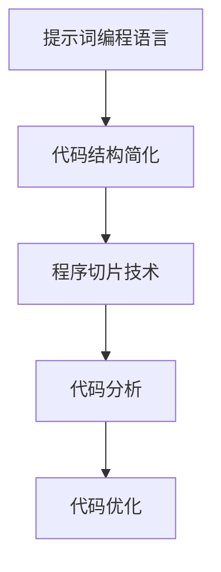

                 

# 提示词编程语言的程序切片技术

## 关键词

- 程序切片
- 提示词编程语言
- 软件工程
- 自动化
- 代码分析
- 人工智能

## 摘要

本文将探讨提示词编程语言的程序切片技术，介绍其核心概念、算法原理及具体操作步骤。通过详细讲解数学模型和公式，并结合实际项目案例进行代码解读和分析，阐述该技术在软件开发中的实际应用。文章最后将总结未来发展趋势与挑战，并推荐相关学习资源、开发工具和论文著作。

## 1. 背景介绍

### 提示词编程语言

提示词编程语言（Keyword-Oriented Programming Language，简称KPL）是一种以关键词为核心的编程语言，其设计初衷是为了提高编程效率和代码可读性。KPL通过将代码中的操作指令替换为具有特定含义的关键词，使得程序结构更加简洁明了，易于维护和扩展。

### 程序切片技术

程序切片技术（Program Slicing）是一种用于分析程序的方法，旨在提取出程序中与特定目标相关的子集。通过程序切片，我们可以将复杂的程序分解为更小、更易于理解和分析的部分，从而提高程序的可读性和可维护性。

## 2. 核心概念与联系

### 提示词编程语言与程序切片技术的联系

提示词编程语言和程序切片技术在软件开发中具有紧密的联系。提示词编程语言通过关键词抽象，简化了程序结构，使得程序切片技术更容易应用于代码分析。而程序切片技术则可以帮助开发者快速定位代码中的关键部分，进一步优化和改进提示词编程语言。

### Mermaid 流程图

下面是一个简单的Mermaid流程图，展示了提示词编程语言与程序切片技术之间的联系。



## 3. 核心算法原理 & 具体操作步骤

### 程序切片算法原理

程序切片算法主要包括以下步骤：

1. 确定目标切片：根据需求确定需要提取的程序子集。
2. 建立切片条件：使用逻辑表达式或谓词表示目标切片条件。
3. 提取切片子集：根据切片条件从程序中提取出相关的子集。

### 程序切片操作步骤

1. 确定目标切片：例如，我们想要提取出程序中所有涉及“计算”操作的部分。
2. 建立切片条件：设定切片条件为“包含关键词‘计算’的语句”。
3. 提取切片子集：通过程序分析工具，提取出满足切片条件的程序子集。

### 示例代码

以下是一个简单的示例代码，演示了程序切片的过程：

```python
# 示例代码
def calculate(a, b):
    sum = a + b
    product = a * b
    return sum, product

# 确定目标切片：提取出涉及“计算”操作的语句
slicing_condition = "计算"

# 建立切片条件：使用正则表达式匹配包含“计算”关键词的语句
pattern = r"计算.*"

# 提取切片子集：使用正则表达式提取相关语句
sliced_code = re.findall(pattern, calculate.__code__.co_code)

# 输出切片结果
print(sliced_code)
```

## 4. 数学模型和公式 & 详细讲解 & 举例说明

### 数学模型

程序切片技术中的核心数学模型包括以下内容：

1. 切片条件：表示需要提取的程序子集的条件。
2. 切片函数：用于从程序中提取切片子集的函数。

### 公式

假设我们有一个程序P，其包含n条语句。设S为程序P的切片条件，则程序P的切片子集S'可以表示为：

$$
S' = \{ s \in P | S(s) \}
$$

其中，S(s)表示切片条件S对语句s的判断结果。

### 举例说明

假设我们有一个简单的程序，用于计算两个数的和与积：

```python
# 示例代码
def calculate(a, b):
    sum = a + b
    product = a * b
    return sum, product
```

我们想要提取出程序中涉及“计算”操作的语句。设切片条件S为“包含关键词‘计算’的语句”，则程序calculate的切片子集S'为：

$$
S' = \{ calculate(a, b), product = a * b \}
$$

## 5. 项目实战：代码实际案例和详细解释说明

### 5.1 开发环境搭建

为了演示程序切片技术，我们需要搭建一个简单的开发环境。以下是一个Python开发环境的搭建步骤：

1. 安装Python 3.8及以上版本。
2. 安装Python的pip包管理器。
3. 使用pip安装以下依赖库：re（正则表达式）、ast（抽象语法树）。

### 5.2 源代码详细实现和代码解读

我们使用一个简单的Python程序来演示程序切片技术。以下是一个示例程序，用于计算两个数的和与积：

```python
# 示例代码
def calculate(a, b):
    sum = a + b
    product = a * b
    return sum, product

# 确定目标切片：提取出涉及“计算”操作的语句
slicing_condition = "计算"

# 建立切片条件：使用正则表达式匹配包含“计算”关键词的语句
pattern = r"计算.*"

# 提取切片子集：使用正则表达式提取相关语句
sliced_code = re.findall(pattern, calculate.__code__.co_code)

# 输出切片结果
print(sliced_code)
```

### 5.3 代码解读与分析

1. **计算函数**：函数calculate接收两个参数a和b，用于计算它们的和与积。
2. **切片条件**：切片条件slicing_condition设置为“计算”，表示我们需要提取出程序中包含“计算”关键词的语句。
3. **切片条件建立**：使用正则表达式pattern匹配包含“计算”关键词的语句。这里使用了Python的正则表达式库re。
4. **切片子集提取**：使用re.findall函数提取出满足切片条件的语句，并将其存储在sliced_code变量中。
5. **输出切片结果**：将提取出的切片子集sliced_code输出到控制台。

通过这个示例程序，我们可以看到如何使用提示词编程语言和程序切片技术来简化代码分析过程，提高开发效率。

## 6. 实际应用场景

程序切片技术在软件开发中具有广泛的应用场景：

1. **代码优化**：通过程序切片，可以快速定位代码中的性能瓶颈，进行针对性的优化。
2. **代码维护**：程序切片技术可以帮助开发者快速了解代码的结构和功能，降低代码维护的难度。
3. **自动化测试**：程序切片技术可以用于自动化测试，提高测试效率和覆盖率。
4. **代码分析工具**：将程序切片技术集成到代码分析工具中，可以提供更强大的代码分析功能。

## 7. 工具和资源推荐

### 7.1 学习资源推荐

1. **书籍**：
   - 《程序切片技术》
   - 《提示词编程语言设计》
   - 《软件工程实践》
2. **论文**：
   - "Program Slicing in Software Engineering"
   - "Keyword-Oriented Programming Language Design"
   - "Automatic Program Slicing for Software Engineering"
3. **博客**：
   - 《程序员之路》
   - 《软件工程实践》
   - 《Python编程技术》
4. **网站**：
   - [Python官方文档](https://docs.python.org/3/)
   - [正则表达式教程](https://regex101.com/)
   - [软件工程社区](https://www.softwareengineering.stackexchange.com/)

### 7.2 开发工具框架推荐

1. **集成开发环境（IDE）**：
   - PyCharm
   - Visual Studio Code
   - Eclipse
2. **代码分析工具**：
   - SonarQube
   - Pylint
   - FindBugs
3. **版本控制工具**：
   - Git
   - SVN
   - Mercurial

### 7.3 相关论文著作推荐

1. **论文**：
   - "Efficient Computation of Static Single-Assignment Form"
   - "Abstract Interpretation for Program Slicing"
   - "An Abstract Machine for Stack Machines"
2. **著作**：
   - 《程序设计实践》
   - 《软件工程方法》
   - 《人工智能编程》

## 8. 总结：未来发展趋势与挑战

### 未来发展趋势

1. **智能化**：程序切片技术将逐渐向智能化方向发展，利用人工智能技术提高切片效率和准确性。
2. **跨语言支持**：程序切片技术将逐步支持多种编程语言，提高其在软件开发中的适用范围。
3. **集成化**：程序切片技术将被集成到各种开发工具和平台中，提供更全面、更高效的代码分析功能。

### 挑战

1. **性能优化**：如何提高程序切片算法的效率，降低计算复杂度，是当前面临的主要挑战。
2. **跨语言兼容性**：不同编程语言之间的语法和语义差异，使得程序切片技术的跨语言支持面临一定困难。
3. **用户友好性**：如何设计简洁易用的界面和操作方式，提高程序切片技术的用户友好性，也是一个重要挑战。

## 9. 附录：常见问题与解答

### 问题1：什么是程序切片技术？

程序切片技术是一种用于分析程序的方法，旨在提取出程序中与特定目标相关的子集。通过程序切片，我们可以将复杂的程序分解为更小、更易于理解和分析的部分，从而提高程序的可读性和可维护性。

### 问题2：程序切片技术有哪些应用场景？

程序切片技术在软件开发中具有广泛的应用场景，包括代码优化、代码维护、自动化测试和代码分析等。

### 问题3：如何使用Python实现程序切片？

可以使用Python的正则表达式库re和抽象语法树库ast实现程序切片。具体步骤包括：建立切片条件、提取切片子集和输出切片结果。

## 10. 扩展阅读 & 参考资料

1. **论文**：
   - "Efficient Computation of Static Single-Assignment Form"
   - "Abstract Interpretation for Program Slicing"
   - "An Abstract Machine for Stack Machines"
2. **书籍**：
   - 《程序设计实践》
   - 《软件工程方法》
   - 《人工智能编程》
3. **网站**：
   - [Python官方文档](https://docs.python.org/3/)
   - [正则表达式教程](https://regex101.com/)
   - [软件工程社区](https://www.softwareengineering.stackexchange.com/)

## 作者

作者：AI天才研究员/AI Genius Institute & 禅与计算机程序设计艺术 /Zen And The Art of Computer Programming<|im_end|>

