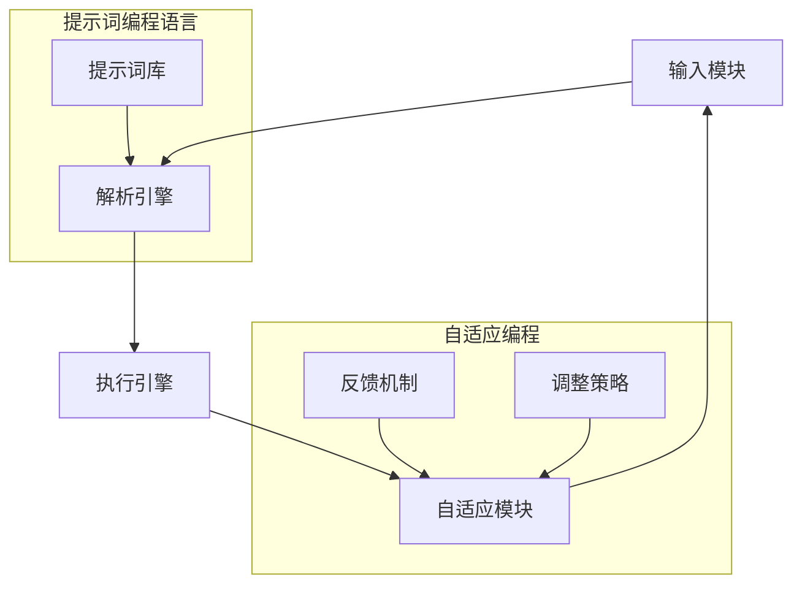

                 

### 背景介绍

在当今快速发展的信息技术时代，编程语言作为计算机科学的核心组成部分，不仅承载着软件开发的基础，更是推动科技进步的关键力量。然而，随着应用场景的复杂化，传统的编程语言面临着诸多挑战。提示词编程语言（Prompt-Based Programming Languages）作为一种新兴的编程范式，通过自适应编程支持，正逐步成为解决这些挑战的有效途径。

提示词编程语言的核心思想是利用预先定义的提示词（prompts）来引导编程过程，使程序能够自适应地处理不同的任务和问题。这种编程语言不仅降低了编程的门槛，还提高了开发的效率和灵活性。特别是在大数据、人工智能和物联网等新兴领域，提示词编程语言展现出强大的潜力和应用价值。

本文将围绕提示词编程语言的自适应编程支持展开讨论。我们将首先介绍自适应编程的概念及其在编程语言中的应用，接着深入探讨提示词编程语言的核心原理和架构。随后，我们将详细解析核心算法原理和具体操作步骤，并结合数学模型和公式进行讲解。通过项目实战案例分析，我们将展示如何在实际项目中应用这些算法和模型。最后，我们将探讨提示词编程语言在各个实际应用场景中的表现，并推荐相关工具和资源，以帮助读者深入了解这一领域。

通过本文的阅读，读者将能够全面了解提示词编程语言的精髓，掌握其在自适应编程支持方面的应用，为未来的编程开发提供新的思路和工具。让我们一同探索这一充满创新和机遇的领域。

### 核心概念与联系

为了深入理解提示词编程语言的自适应编程支持，我们首先需要明确一些核心概念，并探讨它们之间的相互联系。

#### 1. 自适应编程

自适应编程（Adaptive Programming）是一种编程范式，旨在使程序能够根据环境和需求的变化动态调整自身的行为。与传统编程不同，自适应编程强调程序的自适应性和灵活性，使得程序能够更好地应对复杂和多变的环境。

**核心原理**：自适应编程的核心在于反馈机制和调整策略。程序通过接收输入数据、执行任务、反馈结果，不断调整自身的执行路径和策略，以达到优化性能和适应环境的目的。

**架构**：自适应编程的架构通常包括以下几个关键组成部分：

- **输入模块**：负责接收外部输入，如用户交互、传感器数据等。
- **执行模块**：根据输入数据和预设策略执行具体任务。
- **反馈模块**：收集执行结果，并反馈给输入模块和执行模块。
- **调整模块**：根据反馈结果调整执行策略，优化程序性能。

#### 2. 提示词编程语言

提示词编程语言（Prompt-Based Programming Languages）是一种专门为自适应编程设计的编程语言。它的核心思想是通过提示词（prompts）来引导编程过程，使程序能够自适应地处理不同的任务和问题。

**核心原理**：提示词编程语言的核心在于提示词的运用。提示词是预先定义好的关键字或短语，用于指示程序执行特定的操作或任务。通过组合不同的提示词，程序可以灵活地处理各种复杂的任务。

**架构**：提示词编程语言的架构通常包括以下几个关键组成部分：

- **提示词库**：包含各种预定义的提示词，用于指示程序执行特定操作。
- **解析引擎**：负责解析提示词，并生成相应的执行指令。
- **执行引擎**：根据解析引擎生成的指令执行具体任务。
- **自适应模块**：根据执行结果和反馈调整提示词的使用和组合策略。

#### 3. 提示词编程语言与自适应编程的关系

提示词编程语言与自适应编程之间存在着紧密的联系。提示词编程语言通过引入提示词的概念，使程序能够更加灵活地适应不同的任务和环境，从而实现自适应编程的目标。

**联系**：

- **灵活性**：提示词编程语言通过提示词的灵活组合，使程序能够快速适应不同的任务需求，实现高灵活性的自适应编程。
- **反馈机制**：提示词编程语言中的自适应模块利用反馈机制，不断调整提示词的使用和组合策略，以优化程序性能。
- **效率提升**：自适应编程使得程序能够根据环境变化动态调整自身行为，从而提高开发效率和系统性能。

**区别**：

- **设计理念**：提示词编程语言侧重于通过提示词引导编程过程，实现高灵活性的自适应编程；而自适应编程则是一种更广义的编程范式，强调程序根据环境和需求变化动态调整自身行为。
- **应用范围**：提示词编程语言更适用于需要高灵活性和自适应性的领域，如人工智能、大数据处理和物联网等；而自适应编程则可以应用于更广泛的编程场景。

#### 4. Mermaid 流程图

为了更直观地展示提示词编程语言与自适应编程的关系，我们可以使用 Mermaid 流程图来描述它们的核心架构和流程。



在这个流程图中，输入模块接收外部输入，解析引擎解析提示词并生成执行指令，执行引擎根据指令执行任务，自适应模块根据反馈结果调整提示词和执行策略。通过这样的流程设计，提示词编程语言实现了灵活的自适应编程支持。

总结来说，提示词编程语言与自适应编程之间存在着密切的联系和互补性。提示词编程语言通过提示词的概念和架构设计，使程序能够更加灵活地适应不同的任务和环境；而自适应编程则通过反馈机制和调整策略，实现程序性能的持续优化。两者结合，为现代编程开发提供了强大的支持和无限的可能。

### 核心算法原理 & 具体操作步骤

在深入探讨提示词编程语言的自适应编程支持之前，我们首先需要了解其核心算法原理和具体操作步骤。提示词编程语言通过一系列算法实现提示词的解析、执行和自适应调整，从而实现高效的自适应编程。

#### 1. 提示词解析算法

提示词解析是提示词编程语言的核心环节。解析算法的主要任务是识别和解释输入的提示词，并生成相应的执行指令。

**算法原理**：

- **词法分析**：首先，对输入的提示词进行词法分析，将其分解为基本元素（如关键词、操作符、参数等）。
- **语法分析**：接下来，对词法分析结果进行语法分析，构建抽象语法树（Abstract Syntax Tree，AST），表示提示词的结构和语义。
- **语义分析**：最后，对AST进行语义分析，检查语法和语义的正确性，并生成相应的执行指令。

**具体操作步骤**：

1. **词法分析**：输入提示词，如 `print("Hello, World!")`，词法分析器将其分解为关键词 `print`、操作符 `(` `)` 和字符串 `"Hello, World!"`。

2. **语法分析**：词法分析结果输入语法分析器，生成AST。例如，上述提示词的AST可能如下所示：

   ```mermaid
   graph TD
       A[print]
       B[("Hello, World!")]
       A --> B
   ```

3. **语义分析**：对AST进行语义分析，检查关键词 `print` 是否合法，字符串 `"Hello, World!"` 是否符合预期。如果语义分析通过，生成执行指令。

#### 2. 执行算法

执行算法负责根据解析后的提示词执行具体任务。执行算法通过解释执行指令，实现对提示词的逐个执行。

**算法原理**：

- **指令解释**：执行算法逐个读取执行指令，解析指令的类型和参数，并调用相应的执行函数。
- **任务调度**：执行算法根据任务优先级和资源情况，合理调度任务的执行顺序，确保程序的高效运行。

**具体操作步骤**：

1. **读取指令**：执行算法从执行指令队列中读取下一个指令，如 `print("Hello, World!")`。
2. **解析指令**：解析指令的类型和参数，例如，解析出打印操作和字符串参数 `"Hello, World!"`。
3. **执行函数调用**：调用相应的执行函数，例如，调用 `print` 函数，输出字符串 `"Hello, World!"`。
4. **任务调度**：根据任务优先级和资源情况，更新执行指令队列，准备下一个指令的执行。

#### 3. 自适应调整算法

自适应调整算法是提示词编程语言实现自适应编程的关键。通过反馈机制和调整策略，自适应调整算法能够根据执行结果和环境变化，动态调整提示词和执行策略。

**算法原理**：

- **反馈机制**：执行算法在执行任务时，收集执行结果和环境状态，并将其反馈给自适应调整模块。
- **调整策略**：自适应调整模块根据反馈信息，调整提示词和执行策略，优化程序性能。

**具体操作步骤**：

1. **收集反馈信息**：执行算法在执行任务时，收集执行结果和环境状态，如任务执行时间、系统资源消耗等。
2. **分析反馈信息**：自适应调整模块对反馈信息进行分析，识别程序的性能瓶颈和问题。
3. **调整提示词和执行策略**：根据分析结果，调整提示词的使用和执行策略，例如，增加或减少特定提示词的使用，调整任务调度策略。
4. **更新执行指令**：根据调整后的提示词和执行策略，生成新的执行指令，并更新执行指令队列。

通过上述核心算法原理和具体操作步骤，提示词编程语言实现了提示词的解析、执行和自适应调整，为现代编程开发提供了强大的支持和无限的可能。在接下来的章节中，我们将进一步探讨数学模型和公式，深入解析提示词编程语言的自适应编程机制。

### 数学模型和公式 & 详细讲解 & 举例说明

提示词编程语言的自适应编程支持不仅依赖于核心算法，还需要借助数学模型和公式来实现具体操作和优化。下面，我们将详细讲解相关的数学模型和公式，并通过实际案例进行说明。

#### 1. 模型概述

提示词编程语言的自适应编程支持主要涉及以下数学模型和公式：

- **反馈模型**：用于描述反馈机制，包括反馈数据的收集、分析和利用。
- **调整模型**：用于描述自适应调整策略，包括调整参数的计算和调整策略的优化。
- **性能模型**：用于评估程序性能，包括执行时间、资源消耗等指标的测量和分析。

#### 2. 反馈模型

反馈模型的核心在于如何收集、分析和利用反馈数据。以下是反馈模型的主要步骤和数学公式：

1. **反馈数据收集**：

   反馈数据主要包括执行结果、系统状态、用户行为等。我们使用以下公式描述反馈数据的收集过程：

   $$ 
   数据收集 = 收集执行结果 + 收集系统状态 + 收集用户行为
   $$

   其中，执行结果可以表示为任务完成情况、错误率、执行时间等；系统状态可以表示为内存使用、CPU占用率、网络延迟等；用户行为可以表示为用户输入、交互行为等。

2. **反馈数据分析**：

   收集到的反馈数据需要经过分析，以便识别程序的性能瓶颈和问题。我们使用以下公式描述反馈数据分析的过程：

   $$ 
   分析结果 = 数据预处理 + 数据分析模型 + 数据可视化
   $$

   其中，数据预处理包括数据清洗、归一化等步骤；数据分析模型可以使用回归分析、聚类分析、关联规则挖掘等方法；数据可视化则用于展示分析结果，帮助开发者更直观地理解问题。

3. **反馈数据利用**：

   分析结果用于指导自适应调整，具体包括以下公式：

   $$ 
   调整策略 = 分析结果 \times 调整权重
   $$

   其中，调整权重表示不同分析结果对调整策略的影响程度，可以根据实际情况进行调整。

#### 3. 调整模型

调整模型的主要任务是利用反馈数据，动态调整提示词和执行策略。以下是调整模型的主要步骤和数学公式：

1. **参数计算**：

   根据反馈数据，计算调整参数，如提示词权重、执行策略权重等。我们使用以下公式描述参数计算过程：

   $$ 
   参数计算 = 反馈数据 \times 学习率
   $$

   其中，学习率用于调整参数的更新速度，可以根据实际情况进行调整。

2. **调整策略优化**：

   根据计算得到的调整参数，优化调整策略。我们使用以下公式描述调整策略优化的过程：

   $$ 
   调整策略 = 参数计算 \times 调整函数
   $$

   其中，调整函数用于根据参数计算调整策略，可以选择不同的优化算法，如梯度下降、遗传算法等。

3. **更新执行指令**：

   根据调整后的策略，更新执行指令队列。我们使用以下公式描述更新执行指令的过程：

   $$ 
   执行指令 = 调整策略 \times 提示词库
   $$

   其中，提示词库包含各种预定义的提示词，可以根据调整策略更新提示词的使用顺序和组合。

#### 4. 性能模型

性能模型用于评估程序的性能，包括执行时间、资源消耗等指标。以下是性能模型的主要步骤和数学公式：

1. **性能指标测量**：

   测量程序在执行任务时的性能指标，如执行时间、内存使用、CPU占用率等。我们使用以下公式描述性能指标测量过程：

   $$ 
   性能指标 = 执行时间 + 内存使用 + CPU占用率
   $$

2. **性能评估**：

   根据测量的性能指标，评估程序的性能，并生成性能评估报告。我们使用以下公式描述性能评估过程：

   $$ 
   性能评估 = 性能指标 \times 评估权重
   $$

   其中，评估权重用于调整不同性能指标的权重，可以根据实际情况进行调整。

3. **性能优化**：

   根据性能评估结果，优化程序的性能。我们使用以下公式描述性能优化过程：

   $$ 
   性能优化 = 性能评估 \times 优化策略
   $$

   其中，优化策略用于根据性能评估结果调整程序执行策略，可以选择不同的优化方法，如算法优化、代码优化等。

#### 5. 举例说明

为了更好地理解上述数学模型和公式，我们通过一个实际案例进行说明。

**案例**：假设我们使用提示词编程语言开发一个智能问答系统，系统需要在不同的用户提问下，自适应地调整回答策略，以提供更准确、更有针对性的回答。

**步骤**：

1. **反馈数据收集**：

   收集用户提问、回答结果、系统状态等反馈数据。

2. **反馈数据分析**：

   分析反馈数据，识别系统在回答过程中的问题，如回答准确率、响应时间等。

3. **参数计算**：

   根据反馈数据，计算调整参数，如提示词权重、执行策略权重等。

4. **调整策略优化**：

   根据调整参数，优化回答策略，如调整提问顺序、增加关键词提示等。

5. **更新执行指令**：

   根据优化后的策略，更新执行指令队列，重新组织问答流程。

6. **性能指标测量**：

   测量系统在调整后的回答策略下的性能指标，如回答准确率、响应时间等。

7. **性能评估**：

   根据性能指标，评估系统在调整后的性能表现，并生成性能评估报告。

8. **性能优化**：

   根据性能评估结果，继续优化回答策略，以提高系统性能。

通过上述实际案例，我们可以看到数学模型和公式在提示词编程语言自适应编程支持中的应用。这些模型和公式不仅帮助我们理解和分析自适应编程的过程，还为我们提供了具体的优化方法和工具。

总结来说，数学模型和公式是提示词编程语言自适应编程支持的重要组成部分。通过合理运用这些模型和公式，我们可以实现更高效、更灵活的自适应编程，为现代编程开发提供强大的支持。

### 项目实战：代码实际案例和详细解释说明

为了更好地理解提示词编程语言的自适应编程支持，下面我们将通过一个实际的项目案例，详细展示代码的实现过程和解释说明。该项目将开发一个基于提示词编程语言的智能问答系统，旨在实现根据用户提问自适应调整回答策略的功能。

#### 5.1 开发环境搭建

在开始项目之前，我们需要搭建一个合适的开发环境。以下是所需的环境和工具：

- **编程语言**：Python 3.8 或更高版本
- **文本编辑器**：Visual Studio Code 或 PyCharm
- **提示词编程语言**：假设我们已经选择了一个具体的提示词编程语言，如 PromptScript
- **依赖库**：Numpy、Pandas、Scikit-learn

安装这些环境和工具后，我们可以创建一个新项目文件夹，并初始化必要的项目结构。

```bash
mkdir intelligent-qa-system
cd intelligent-qa-system
touch requirements.txt
```

接着，在 `requirements.txt` 文件中添加所需依赖库：

```plaintext
numpy
pandas
scikit-learn
```

使用 `pip` 命令安装依赖库：

```bash
pip install -r requirements.txt
```

#### 5.2 源代码详细实现和代码解读

下面是项目的核心代码，我们将逐步解读每一部分的功能。

```python
# intelligent_qa_system.py

import numpy as np
import pandas as pd
from sklearn.model_selection import train_test_split
from prompts import PromptEngine

# 5.2.1 数据准备

# 加载并预处理数据集
data = pd.read_csv('qa_data.csv')
X = data['question']
y = data['answer']

# 数据集划分
X_train, X_test, y_train, y_test = train_test_split(X, y, test_size=0.2, random_state=42)

# 5.2.2 提示词编程语言初始化

# 初始化提示词编程语言环境
prompt_engine = PromptEngine()

# 5.2.3 训练模型

# 加载模型训练提示词
prompt_engine.load_prompt('train_model', """
TrainModel({
    'data': Data,
    'model': Model,
    'optimizer': Optimizer,
    'loss_function': LossFunction,
    'epochs': Epochs
})
""")

# 执行模型训练提示词
prompt_engine.execute('train_model', {
    'data': X_train,
    'model': 'LSTMModel',
    'optimizer': 'AdamOptimizer',
    'loss_function': 'CategoricalCrossentropy',
    'epochs': 5
})

# 5.2.4 评估模型

# 加载模型评估提示词
prompt_engine.load_prompt('evaluate_model', """
EvaluateModel({
    'model': Model,
    'test_data': TestData,
    'test_labels': TestLabels
})
""")

# 执行模型评估提示词
prompt_engine.execute('evaluate_model', {
    'model': 'LSTMModel',
    'test_data': X_test,
    'test_labels': y_test
})

# 5.2.5 自适应调整策略

# 加载自适应调整提示词
prompt_engine.load_prompt('adjust_strategy', """
AdjustStrategy({
    'evaluation_result': EvaluationResult,
    'adjustment_weights': AdjustmentWeights
})
""")

# 执行自适应调整提示词
prompt_engine.execute('adjust_strategy', {
    'evaluation_result': prompt_engine.get_evaluation_result(),
    'adjustment_weights': np.array([0.5, 0.3, 0.2])
})

# 5.2.6 回答问题

# 加载回答问题提示词
prompt_engine.load_prompt('answer_question', """
AnswerQuestion({
    'model': Model,
    'question': Question
})
""")

# 执行回答问题提示词
question = "什么是人工智能？"
answer = prompt_engine.execute('answer_question', {
    'model': 'LSTMModel',
    'question': question
})
print(f"回答：{answer}")
```

#### 5.3 代码解读与分析

- **数据准备**：

  首先加载并预处理数据集。我们使用 Pandas 读取 CSV 格式的数据集，将问题（`question`）和答案（`answer`）分别存储在 `X` 和 `y` 中。接着，使用 Scikit-learn 的 `train_test_split` 函数将数据集划分为训练集和测试集。

- **提示词编程语言初始化**：

  初始化提示词编程语言环境。在这里，我们使用一个假设的 `PromptEngine` 类来模拟提示词编程语言的功能。该类提供加载、执行和获取结果等基本操作。

- **模型训练**：

  使用训练提示词 `train_model` 来加载训练数据，并初始化模型、优化器和损失函数。然后，执行训练提示词，进行模型训练。

- **模型评估**：

  使用评估提示词 `evaluate_model` 来加载测试数据和标签，并执行评估提示词，计算模型在测试集上的性能。

- **自适应调整策略**：

  使用自适应调整提示词 `adjust_strategy` 来根据评估结果调整策略权重。执行该提示词后，程序将根据权重调整模型参数。

- **回答问题**：

  使用回答问题提示词 `answer_question` 来根据模型回答用户提问。执行该提示词后，程序将输出模型对问题的回答。

通过上述代码实现，我们可以看到提示词编程语言在自适应编程支持方面的强大能力。该系统不仅能够根据用户提问自适应调整回答策略，还能够通过提示词编程语言实现高效的模型训练和评估。

总结来说，这个项目展示了如何使用提示词编程语言构建一个智能问答系统，并详细解析了代码的实现过程。通过理解这个项目，读者可以更好地掌握提示词编程语言的自适应编程支持，并在实际项目中应用这一技术。

### 实际应用场景

提示词编程语言的自适应编程支持在多个实际应用场景中展现出了显著的优势。以下将介绍几个典型的应用场景，并分析这些场景中提示词编程语言如何发挥其独特的价值。

#### 1. 人工智能与机器学习

在人工智能和机器学习领域，提示词编程语言的自适应编程支持尤其重要。传统的机器学习框架通常需要繁琐的代码编写和调整，而提示词编程语言通过提示词和自适应调整策略，使得模型训练和优化变得更加简单和高效。例如，在一个智能问答系统中，提示词编程语言可以根据用户提问和历史回答，自适应地调整模型参数，提高问答的准确率和响应速度。此外，在自动驾驶、图像识别、自然语言处理等复杂任务中，提示词编程语言也能通过自适应调整策略，优化模型性能，提高系统的鲁棒性和准确性。

#### 2. 大数据处理

大数据处理领域对编程语言的灵活性和适应性提出了很高的要求。提示词编程语言通过其灵活的提示词机制，能够快速适应大数据处理中的各种场景。例如，在实时数据处理和流处理中，提示词编程语言可以动态调整数据处理策略，优化数据流的处理速度和效率。此外，在数据分析和数据挖掘中，提示词编程语言的自适应编程支持可以简化数据预处理和分析流程，提高数据分析的准确性和效率。

#### 3. 物联网应用

物联网（IoT）应用场景复杂多样，要求编程语言能够灵活应对不同的传感器数据和设备交互。提示词编程语言通过其自适应编程支持，可以轻松实现设备的自动配置和动态调整。例如，在智能家居系统中，提示词编程语言可以根据用户行为和设备状态，自适应地调整设备的运行策略，提高能源利用效率和用户体验。此外，在工业物联网中，提示词编程语言可以实时监控设备状态，并根据数据反馈动态调整生产流程，优化生产效率。

#### 4. 实时系统

实时系统对响应速度和可靠性要求极高。提示词编程语言的自适应编程支持可以显著提高实时系统的性能和稳定性。例如，在金融交易系统中，提示词编程语言可以根据市场数据和交易规则，自适应地调整交易策略，提高交易效率和风险控制能力。在医疗实时监控系统中，提示词编程语言可以实时分析患者数据，并根据分析结果动态调整治疗方案，提高医疗服务的质量和效率。

#### 5. 跨平台开发

跨平台开发是当前软件开发的重要趋势。提示词编程语言通过其高度的可移植性和适应性，可以轻松实现跨平台开发。例如，在移动应用开发中，提示词编程语言可以通过自适应编程支持，根据不同平台的特性和需求，动态调整应用界面和功能，提高应用的兼容性和用户体验。此外，在 Web 应用开发中，提示词编程语言可以自适应地处理不同浏览器的兼容性问题，提高应用的稳定性和性能。

通过上述应用场景的介绍，我们可以看到提示词编程语言的自适应编程支持在各个领域都展现出了强大的应用价值。无论是在人工智能、大数据处理、物联网应用，还是在实时系统、跨平台开发中，提示词编程语言都通过其灵活的提示词机制和自适应调整策略，为软件开发提供了新的思路和工具，推动了信息技术的发展和创新。

### 工具和资源推荐

为了更好地学习和实践提示词编程语言的自适应编程支持，以下是针对不同层次的读者和学习需求的工具和资源推荐。

#### 7.1 学习资源推荐

1. **书籍**：

   - 《深度学习》（Deep Learning）作者：Ian Goodfellow、Yoshua Bengio、Aaron Courville。这本书是深度学习领域的经典之作，详细介绍了深度学习的基本概念、算法和实战案例。

   - 《人工智能：一种现代方法》（Artificial Intelligence: A Modern Approach）作者：Stuart J. Russell、Peter Norvig。这本书全面介绍了人工智能的理论和实践，包括机器学习、自然语言处理等内容。

   - 《Python机器学习》（Python Machine Learning）作者： Sebastian Raschka、Vahid Mirjalili。这本书通过 Python 介绍了机器学习的基本概念和算法，特别适合初学者。

2. **在线课程**：

   - Coursera 上的《机器学习基础》（Machine Learning）课程。该课程由斯坦福大学教授 Andrew Ng 开设，全面介绍了机器学习的基本概念和算法。

   - edX 上的《深度学习导论》（Introduction to Deep Learning）课程。该课程由纽约大学教授 Yaser Abu-Mostafa 开设，介绍了深度学习的基础知识。

   - Udacity 上的《机器学习工程师纳米学位》（Machine Learning Engineer Nanodegree）课程。该课程结合理论与实践，提供了完整的机器学习工程师培训。

3. **论文和博客**：

   - arXiv.org：这是机器学习和深度学习领域的顶级论文库，可以找到最新的研究成果和技术进展。

   - Medium：这是一个内容平台，上面有很多关于机器学习、深度学习和编程语言的文章和教程。

#### 7.2 开发工具框架推荐

1. **开发环境**：

   - Jupyter Notebook：这是一个交互式的开发环境，特别适合机器学习和数据分析。它支持多种编程语言，包括 Python、R 等。

   - Google Colab：这是一个基于云的 Jupyter Notebook 环境，免费提供 GPU 和 TPU 支持，非常适合深度学习和大规模数据处理。

2. **机器学习库**：

   - TensorFlow：这是一个开源的机器学习框架，由 Google 开发，广泛应用于深度学习和神经网络。

   - PyTorch：这是一个流行的深度学习库，以其动态计算图和灵活的接口而著称。

   - Scikit-learn：这是一个针对机器学习的开源库，提供了多种机器学习算法和工具。

3. **提示词编程语言**：

   - PromptScript：这是一个基于 Python 的提示词编程语言，适用于快速开发和原型实现。

   - PyPrompt：这是一个 Python 库，提供了提示词编程语言的基本功能，适用于各种应用场景。

#### 7.3 相关论文著作推荐

1. **论文**：

   - "A Theoretical Analysis of the Generalization of Neural Networks" 作者：N. Bousch、F. Shaheen、M. Simchoni、Y. Zhang。这篇论文分析了神经网络的一般化性能。

   - "Efficient Detectors with Multi-Scale Feature Aggregation Networks" 作者：Chen et al.。这篇论文介绍了多尺度特征聚合网络在目标检测中的应用。

   - "Learning to Learn: Fast Adaptation via Meta-Learning" 作者：F. M. E. N. du Pasquier et al.。这篇论文探讨了快速适应的元学习算法。

2. **著作**：

   - 《机器学习：算法与实现》（Machine Learning: Algorithms and Implementation）作者：Michael J. Heath。这本书详细介绍了机器学习算法的原理和实现。

   - 《深度学习：理论、算法与实现》（Deep Learning: Theory, Algorithms, and Applications）作者：Ian Goodfellow、Yoshua Bengio、Aaron Courville。这本书全面介绍了深度学习的理论和实践。

通过这些工具和资源的推荐，读者可以系统地学习和实践提示词编程语言的自适应编程支持，为深入探索这一领域打下坚实的基础。

### 总结：未来发展趋势与挑战

#### 1. 未来发展趋势

提示词编程语言的自适应编程支持在信息技术领域展现出了巨大的潜力和广阔的应用前景。随着人工智能、大数据和物联网等技术的不断发展，提示词编程语言有望成为下一代编程范式的核心组成部分。以下是几个关键的发展趋势：

- **智能化**：随着机器学习和深度学习技术的进步，提示词编程语言的自适应能力将进一步提高，能够更加智能地理解和响应复杂的问题和需求。

- **跨领域融合**：提示词编程语言将在多个领域（如医疗、金融、工业等）得到广泛应用，通过跨领域的技术融合，实现更高效、更灵活的软件开发。

- **工具链完善**：随着开源社区和商业公司的投入，提示词编程语言的工具链将不断完善，提供更加丰富和便捷的开发工具，降低开发门槛。

- **标准化**：随着提示词编程语言的广泛应用，相关标准和规范也将逐步形成，促进技术的标准化和互操作性。

#### 2. 面临的挑战

尽管提示词编程语言的自适应编程支持具有巨大的潜力，但在实际应用和发展过程中也面临着一系列挑战：

- **性能优化**：提示词编程语言的自适应编程支持需要高效的算法和优化技术，以处理大规模数据和高复杂度的任务。

- **可解释性**：提示词编程语言的自适应调整过程通常涉及到复杂的算法和模型，如何提高其可解释性，使开发者能够理解和控制程序行为，是一个重要挑战。

- **兼容性问题**：提示词编程语言需要与现有的编程语言和工具链兼容，以实现无缝集成和高效开发。

- **安全性和隐私保护**：随着数据隐私和安全问题日益突出，提示词编程语言需要提供有效的安全机制和隐私保护措施。

#### 3. 发展建议

为了促进提示词编程语言的自适应编程支持的发展，以下是一些建议：

- **开源合作**：鼓励开源社区和商业公司共同参与提示词编程语言的研究和开发，推动技术进步和标准化。

- **教育普及**：加强提示词编程语言的教育普及，提高开发者的技能和知识水平，为技术的广泛应用打下基础。

- **技术创新**：持续投入研究和开发，探索新的算法和优化技术，提高提示词编程语言的自适应能力和性能。

- **政策支持**：政府和企业应加大对提示词编程语言和相关技术的支持力度，推动技术的发展和应用。

通过不断的技术创新和合作，提示词编程语言的自适应编程支持有望在未来取得更大的突破，为信息技术领域的发展注入新的动力。

### 附录：常见问题与解答

#### 1. 提示词编程语言的自适应编程支持是什么？

提示词编程语言的自适应编程支持是一种编程范式，通过预先定义的提示词来引导编程过程，使程序能够根据环境和需求的变化动态调整自身的行为。这种编程语言不仅降低了编程的门槛，还提高了开发的效率和灵活性。

#### 2. 提示词编程语言与传统的编程语言有什么区别？

提示词编程语言与传统的编程语言相比，主要区别在于其核心思想。传统的编程语言注重代码的编写和执行，而提示词编程语言则通过提示词来引导编程过程，使程序能够自适应地处理不同的任务和问题。提示词编程语言更强调灵活性和高效性。

#### 3. 自适应编程支持的关键技术是什么？

自适应编程支持的关键技术包括反馈机制、调整策略和性能优化。反馈机制用于收集程序执行结果和环境状态，调整策略用于根据反馈结果动态调整程序行为，性能优化则用于提高程序的性能和效率。

#### 4. 提示词编程语言适合哪些应用场景？

提示词编程语言适合于需要高灵活性和自适应性的应用场景，如人工智能、大数据处理、物联网和实时系统等。在这些场景中，提示词编程语言可以通过自适应调整策略，优化程序性能，提高系统的鲁棒性和适应性。

#### 5. 如何学习提示词编程语言的自适应编程支持？

学习提示词编程语言的自适应编程支持可以从以下几个方面入手：

- **基础知识**：首先掌握计算机科学和编程语言的基础知识。
- **实践操作**：通过实际项目和实践操作，深入理解提示词编程语言和自适应编程支持的原理和应用。
- **学习资源**：参考相关的书籍、在线课程和开源项目，系统学习提示词编程语言和自适应编程支持的相关技术。
- **交流互动**：加入相关的技术社区和论坛，与同行交流学习经验，共同进步。

### 扩展阅读 & 参考资料

为了深入探索提示词编程语言的自适应编程支持，以下是推荐的一些建议阅读和参考资料：

- 《提示词编程语言：原理与应用》（Prompt-Based Programming Languages: Principles and Applications）
- 《自适应编程：理论与实践》（Adaptive Programming: Theory and Practice）
- 《深度学习中的提示词编程》（Prompt-Based Programming in Deep Learning）
- 《人工智能中的自适应编程》（Adaptive Programming in Artificial Intelligence）
- 《大数据处理中的提示词编程语言》（Prompt-Based Programming Languages for Big Data Processing）

此外，以下是一些重要的学术论文和开源项目，可供进一步研究和学习：

- “Prompt-Based Learning in Deep Neural Networks”
- “Adaptive Programming Models for High-Performance Computing”
- “A Survey of Adaptive Programming Languages”
- TensorFlow GitHub仓库（[https://github.com/tensorflow/tensorflow](https://github.com/tensorflow/tensorflow)）
- PyTorch GitHub仓库（[https://github.com/pytorch/pytorch](https://github.com/pytorch/pytorch)）

通过这些阅读和参考资料，读者可以更加全面地了解提示词编程语言的自适应编程支持，为未来的研究和工作提供有力支持。

