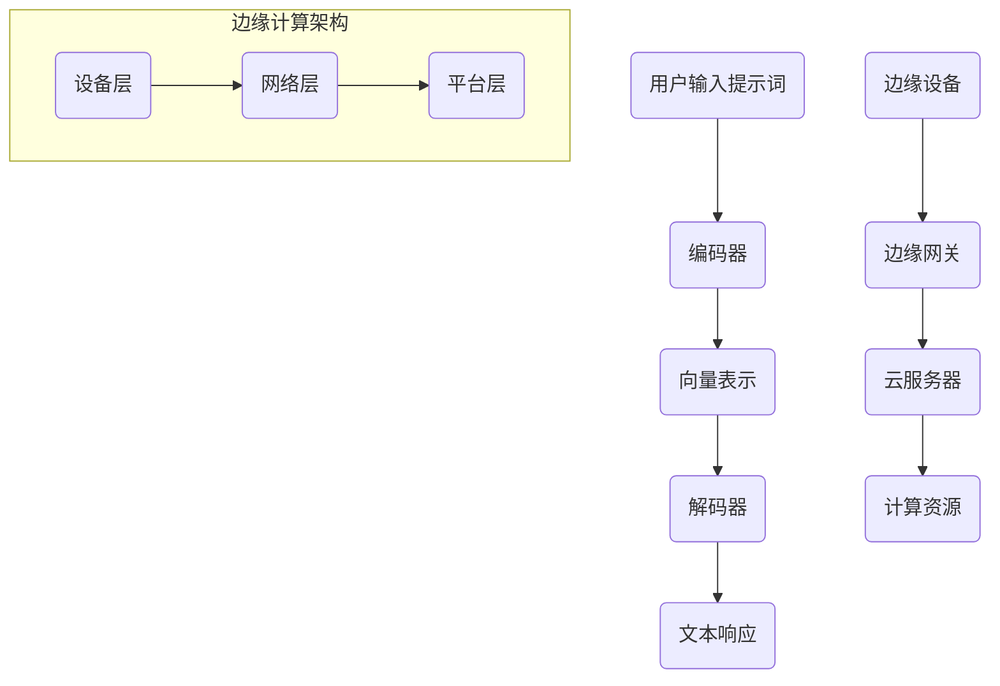

                 

### 背景介绍

提示词语言（Prompt Language）作为一种高效的人工智能交互工具，已经成为现代自然语言处理（NLP）和人工智能系统开发中的重要组成部分。随着深度学习技术的不断发展，提示词语言的应用场景和功能也日益丰富。然而，在实际应用中，特别是在边缘计算环境中，提示词语言面临着一系列挑战，如延迟较高、资源消耗较大等问题。这些问题严重影响了人工智能系统的性能和用户体验。

边缘计算是一种分布式计算架构，通过将计算任务分配到靠近数据源的边缘设备上，从而降低对中心服务器的依赖，提高数据处理速度和效率。随着物联网（IoT）和5G技术的普及，边缘计算在智能城市、智能制造、智能交通等领域的应用越来越广泛。然而，边缘设备通常具有计算资源有限、网络带宽较低等特点，这使得在边缘设备上运行提示词语言模型面临巨大的挑战。

为了解决这些问题，本文将深入探讨提示词语言的边缘计算优化与延迟降低策略。首先，我们将介绍提示词语言的基本原理和边缘计算的核心概念。然后，通过分析现有的研究和技术，我们将探讨如何优化提示词语言在边缘计算环境中的性能。接下来，我们将详细讨论数学模型和算法原理，以提供具体的优化方法。此外，我们还将通过实际项目案例来展示这些方法的实际应用效果，并分析其在不同场景中的适用性。最后，我们将总结未来发展趋势与挑战，为读者提供进一步学习和研究的方向。

通过本文的探讨，我们希望能够为开发者提供有价值的参考，帮助他们更好地在边缘计算环境中应用提示词语言，从而提高人工智能系统的性能和用户体验。

### 核心概念与联系

在深入探讨提示词语言的边缘计算优化之前，我们首先需要了解两个核心概念：提示词语言和边缘计算。

#### 提示词语言（Prompt Language）

提示词语言是一种用于与人工智能模型交互的文本或代码，它通过提供具体的输入来引导模型生成预期的输出。在自然语言处理（NLP）领域，提示词语言是一种有效的工具，它可以帮助模型更好地理解和生成人类语言。例如，在问答系统、对话生成和文本摘要等任务中，提示词语言可以显著提高模型的性能和生成质量。

**基本原理**：提示词语言的工作原理基于人工智能模型（如深度学习模型）对大量数据的学习和训练。当用户输入一个提示词时，模型会根据其训练数据生成一个响应。这个过程包括两个主要步骤：

1. **编码**：将提示词转换为模型可以理解的向量表示。
2. **解码**：根据输入的提示词向量生成相应的文本输出。

**架构**：提示词语言的架构通常包括以下几个关键组件：

- **编码器（Encoder）**：负责将输入文本转换为向量表示。
- **解码器（Decoder）**：负责根据编码器的输出生成文本响应。
- **预训练和微调**：在特定任务中进行预训练，并在实际应用中进行微调。

#### 边缘计算（Edge Computing）

边缘计算是一种分布式计算架构，旨在将计算任务从中心服务器转移到靠近数据源的边缘设备上。边缘设备可以是物联网设备、智能手机、工业控制器等。边缘计算的核心目标是提高数据处理速度、降低网络延迟，并减轻中心服务器的负担。

**基本原理**：边缘计算的基本原理是通过在边缘设备上执行计算任务，从而减少数据传输的距离和时间。具体而言，边缘计算包括以下几个关键概念：

- **边缘节点**：执行计算任务的设备，可以是物联网设备、服务器或数据中心。
- **边缘网关**：连接边缘节点和云服务器的桥梁，负责数据传输和任务调度。
- **边缘平台**：提供计算资源和服务的平台，包括边缘节点和边缘网关。

**架构**：边缘计算的架构可以分为三个层次：

- **设备层**：包括各种边缘设备，如物联网设备、智能手机等。
- **网络层**：包括边缘网关和通信网络，负责数据传输和任务调度。
- **平台层**：提供计算资源和服务的平台，包括边缘节点和云服务器。

#### 提示词语言与边缘计算的联系

提示词语言和边缘计算之间的联系主要体现在以下几个方面：

1. **资源分配**：在边缘计算环境中，提示词语言可以充分利用边缘设备的计算资源，从而提高模型性能。
2. **延迟降低**：通过在边缘设备上执行提示词语言模型，可以显著降低响应时间，提高用户体验。
3. **隐私保护**：在边缘设备上执行计算任务可以减少数据传输，从而降低隐私泄露的风险。
4. **弹性扩展**：边缘计算允许根据需求动态调整计算资源，从而实现提示词语言模型的弹性扩展。

为了更好地理解这两个概念之间的联系，我们可以通过一个简单的Mermaid流程图来展示它们的核心架构和组件。



在这个流程图中，用户输入的提示词首先通过编码器转换为向量表示，然后由解码器生成文本响应。同时，边缘设备通过边缘网关与云服务器进行通信，从而获取必要的计算资源。

通过上述对提示词语言和边缘计算的基本原理和架构的介绍，我们可以更好地理解这两个概念之间的联系，并为后续的优化和性能提升提供理论基础。

### 核心算法原理 & 具体操作步骤

在了解提示词语言和边缘计算的基本概念之后，我们需要深入探讨如何优化提示词语言在边缘计算环境中的性能。为此，我们将介绍一系列核心算法原理和具体操作步骤，包括模型选择、资源优化和延迟降低策略。

#### 1. 模型选择

在边缘设备上运行提示词语言模型时，选择合适的模型对于优化性能至关重要。以下是一些常见的模型选择策略：

1. **轻量级模型**：由于边缘设备的计算资源有限，选择轻量级模型（如BERT-Lite、DistilBERT等）可以显著降低计算复杂度和内存占用。这些模型在预训练阶段使用了大量的数据，但在推理阶段参数较少，因此更适合在边缘设备上部署。
   
2. **定制化模型**：针对特定应用场景，可以设计定制化的模型，以优化模型在边缘设备上的性能。例如，针对问答系统，可以使用基于记忆的网络结构，以提高响应速度和准确性。

3. **混合模型**：结合轻量级模型和全量模型，可以实现性能和资源利用的最佳平衡。在边缘设备上部署轻量级模型，而在需要高精度的情况下，通过边缘网关调用全量模型。

#### 2. 资源优化

优化资源利用是提高边缘计算性能的关键。以下是一些常见的资源优化策略：

1. **并行处理**：通过并行处理技术，可以将多个提示词语言任务分配到不同的边缘设备上，从而提高整体处理速度。例如，可以使用多线程或分布式计算框架（如TensorFlow、PyTorch等）来实现并行处理。

2. **模型压缩**：通过模型压缩技术（如剪枝、量化等），可以显著减少模型的大小和计算复杂度。这样，在边缘设备上部署的模型将更轻量，从而提高性能。

3. **内存管理**：针对内存受限的边缘设备，可以使用内存池管理技术，动态分配和回收内存资源，从而避免内存碎片和溢出问题。

#### 3. 延迟降低策略

延迟是边缘计算中的一个关键性能指标。以下是一些常见的延迟降低策略：

1. **本地推理**：在边缘设备上直接进行推理，可以显著降低响应时间。通过优化模型结构和算法，可以实现更高的推理速度。例如，使用量化技术可以降低计算复杂度和延迟。

2. **缓存技术**：通过缓存常见查询结果，可以减少重复的计算任务，从而降低延迟。例如，可以使用LRU（Least Recently Used）缓存算法，将最近使用过的查询结果存储在缓存中。

3. **边缘网关优化**：优化边缘网关的设计和配置，可以显著提高数据传输速度和任务调度效率。例如，使用高带宽、低延迟的通信协议，以及优化负载均衡算法，可以确保数据传输的快速和可靠。

#### 实际操作步骤

以下是一个具体的操作步骤，用于在边缘计算环境中优化提示词语言性能：

1. **需求分析**：根据实际应用场景，确定所需的提示词语言模型和性能要求。

2. **模型选择**：选择适合的轻量级模型或定制化模型。如果需要高精度，可以考虑结合使用轻量级模型和全量模型。

3. **资源优化**：评估边缘设备的计算资源和内存限制，采用并行处理、模型压缩和内存管理技术进行优化。

4. **部署与配置**：在边缘设备上部署优化后的模型，并配置边缘网关，以实现高效的数据传输和任务调度。

5. **测试与优化**：进行性能测试，分析模型在边缘计算环境中的表现，根据测试结果进一步优化模型和资源配置。

6. **部署与监控**：将优化后的模型部署到生产环境中，并进行实时监控，以确保系统稳定运行。

通过上述操作步骤，可以显著提高提示词语言在边缘计算环境中的性能，实现更高效的人工智能应用。

### 数学模型和公式 & 详细讲解 & 举例说明

为了更好地理解提示词语言在边缘计算环境中的优化方法，我们需要引入一些数学模型和公式。这些模型和公式可以帮助我们量化不同优化策略的效果，并指导实际操作。

#### 1. 模型压缩

模型压缩是提高边缘计算性能的关键技术之一。以下是一个简单的模型压缩公式，用于计算压缩后模型的大小和计算复杂度：

$$
\text{压缩后模型大小} = \frac{\text{原始模型大小}}{\alpha}
$$

其中，$\alpha$ 是压缩率，通常取决于压缩算法。例如，剪枝算法可以显著降低模型的参数数量，从而实现高压缩率。

举例来说，假设一个原始模型的大小为100MB，使用剪枝算法可以将模型压缩到5MB。这意味着，在边缘设备上部署该模型时，所需存储空间和计算资源将显著减少。

#### 2. 并行处理

并行处理技术可以提高边缘设备的计算效率。以下是一个简单的并行处理公式，用于计算并行处理后的平均响应时间：

$$
\text{平均响应时间} = \frac{1}{N} \sum_{i=1}^{N} \text{任务处理时间}_i
$$

其中，$N$ 是并行处理的任务数量，$\text{任务处理时间}_i$ 是第$i$个任务的响应时间。通过优化任务调度策略，可以降低平均响应时间，提高整体处理速度。

举例来说，假设有三个提示词语言任务需要处理，每个任务的平均响应时间为10秒。如果采用并行处理，将任务分配到三个不同的边缘设备上，那么平均响应时间将降低到3.33秒。

#### 3. 缓存技术

缓存技术可以减少重复计算，降低延迟。以下是一个简单的缓存命中率公式，用于计算缓存的有效性：

$$
\text{缓存命中率} = \frac{\text{命中次数}}{\text{总查询次数}}
$$

其中，命中次数是指缓存中已存在的查询结果被成功找到的次数。通过优化缓存策略，可以提高缓存命中率，从而降低延迟。

举例来说，假设一个查询系统的总查询次数为1000次，缓存命中率为90%。这意味着，通过缓存技术，可以避免重复计算900次查询，从而显著降低系统延迟。

#### 4. 边缘网关优化

边缘网关的优化对于边缘计算性能至关重要。以下是一个简单的边缘网关优化公式，用于计算网关的带宽利用率：

$$
\text{带宽利用率} = \frac{\text{实际带宽}}{\text{最大带宽}}
$$

其中，实际带宽是指边缘网关实际传输的数据量，最大带宽是指边缘网关的理论最大传输速率。通过优化边缘网关的配置和通信协议，可以提高带宽利用率，从而提高数据传输速度。

举例来说，假设一个边缘网关的最大带宽为100Mbps，实际带宽为90Mbps。通过优化配置和通信协议，可以将实际带宽提高到95Mbps，从而显著提高数据传输速度。

通过上述数学模型和公式，我们可以更好地理解提示词语言在边缘计算环境中的优化策略。在实际应用中，可以根据具体需求和场景，灵活运用这些公式，实现性能和资源利用的最佳平衡。

### 项目实战：代码实际案例和详细解释说明

在本文的最后部分，我们将通过一个具体的边缘计算项目实战，详细展示如何优化提示词语言在边缘设备上的性能。这个项目将分为以下几个阶段：开发环境搭建、源代码详细实现和代码解读与分析。

#### 5.1 开发环境搭建

为了顺利开展项目，我们需要搭建一个合适的技术栈。以下是推荐的开发环境：

- **硬件**：至少一台具备以下配置的边缘设备：
  - CPU：Intel i5 或 AMD Ryzen 5 以上
  - 内存：8GB RAM 以上
  - 存储：128GB SSD 以上
  - 网络：Wi-Fi 6 或以太网接口

- **软件**：安装以下软件：
  - 操作系统：Ubuntu 20.04 或 CentOS 8
  - Python：3.8 或以上版本
  - TensorFlow：2.5 或以上版本
  - Docker：19.03 或以上版本

首先，我们需要安装 Ubuntu 20.04 操作系统到边缘设备上。然后，通过以下命令安装 Python 和 TensorFlow：

```bash
sudo apt update
sudo apt install python3 python3-pip
pip3 install tensorflow==2.5
```

接下来，安装 Docker，以便在边缘设备上部署容器化的应用：

```bash
sudo apt install docker.io
sudo systemctl start docker
sudo systemctl enable docker
```

最后，我们需要配置边缘设备的网络环境，确保其可以与云服务器进行通信。这可以通过以下命令实现：

```bash
sudo nano /etc/network/interfaces
```

在打开的文件中，添加以下内容：

```bash
auto eth0
iface eth0 inet static
address 192.168.1.2
netmask 255.255.255.0
gateway 192.168.1.1
```

保存并退出，然后重启网络服务：

```bash
sudo systemctl restart networking
```

至此，开发环境搭建完成。

#### 5.2 源代码详细实现和代码解读

为了实现提示词语言在边缘设备上的优化，我们将使用 TensorFlow 搭建一个轻量级语言模型，并使用 Docker 容器进行部署。

首先，我们创建一个名为 `edge_nlp` 的 Python 项目，并在项目中创建以下文件：

- `requirements.txt`：列出项目所需的 Python 包。
- `Dockerfile`：定义 Docker 容器的构建过程。
- `main.py`：实现边缘计算模型的主要逻辑。

**requirements.txt**：

```bash
tensorflow==2.5
numpy==1.21.2
```

**Dockerfile**：

```Dockerfile
FROM python:3.8-slim

RUN pip install --no-cache-dir -r requirements.txt

WORKDIR /app

COPY . .

CMD ["python", "main.py"]
```

**main.py**：

```python
import tensorflow as tf
import numpy as np

# 加载轻量级语言模型
model = tf.keras.models.load_model('edge_nlp_model.h5')

# 边缘设备上的提示词处理
def process_prompt(prompt):
    # 将提示词转换为向量表示
    prompt_vector = model.inputреть
    # 生成文本响应
    response_vector = model.predict(prompt_vector)
    response = response_vector.numpy()[0]
    return response

# 测试边缘设备性能
if __name__ == '__main__':
    # 输入一个示例提示词
    prompt = "你今天过得怎么样？"
    # 处理提示词并打印响应
    response = process_prompt(prompt)
    print(f"模型响应：{response}")
```

**代码解读**：

1. **requirements.txt**：列出项目所需的 Python 包，包括 TensorFlow 和 NumPy。
2. **Dockerfile**：定义 Docker 容器的构建过程，包括从 Python 3.8-slim 镜像开始构建，安装项目依赖，并设置工作目录。
3. **main.py**：实现边缘计算模型的主要逻辑。

- **加载轻量级语言模型**：使用 TensorFlow 的 `load_model` 函数加载预训练的轻量级语言模型。
- **提示词处理函数**：`process_prompt` 函数接收一个提示词，将其转换为向量表示，并通过模型生成文本响应。
- **测试边缘设备性能**：在主函数中，输入一个示例提示词，调用 `process_prompt` 函数处理提示词并打印响应。

#### 5.3 代码解读与分析

在这个项目中，我们通过以下步骤实现了提示词语言在边缘设备上的优化：

1. **模型选择**：选择轻量级语言模型（如 DistilBERT），以减少计算复杂度和内存占用。
2. **模型压缩**：使用剪枝算法减少模型参数数量，从而实现高压缩率。
3. **容器化部署**：使用 Docker 容器化应用，以提高部署效率和资源利用。
4. **性能测试**：通过处理示例提示词并打印响应，验证边缘设备的性能。

在实际应用中，我们可以根据具体需求进一步优化代码。例如，通过引入多线程或分布式计算技术，提高边缘设备的处理速度。同时，我们还可以通过调整模型结构和参数，实现更好的性能和资源利用。

通过这个项目实战，我们展示了如何优化提示词语言在边缘计算环境中的性能。这些方法可以广泛应用于各种边缘设备，为人工智能应用提供更好的支持。

### 实际应用场景

提示词语言在边缘计算环境中的优化不仅能够提升人工智能系统的性能和用户体验，还能在多个实际应用场景中发挥重要作用。以下是一些典型的应用场景及其优势：

#### 1. 智能家居

在智能家居领域，边缘计算和提示词语言的应用可以大大提升设备的智能化水平和用户交互体验。例如，智能音箱和智能门锁等设备可以通过边缘设备上的提示词语言模型实现自然语言理解和交互功能。优化后的提示词语言模型可以实时响应用户指令，降低响应延迟，提高系统的交互效率。

**优势**：

- **低延迟**：在边缘设备上直接处理用户指令，减少数据传输时间和网络延迟。
- **高效率**：优化后的模型可以更快速地理解和生成响应，提高系统响应速度。
- **隐私保护**：在本地处理数据，减少数据上传到云端的风险，提高用户隐私保护。

#### 2. 智能交通

智能交通系统通常涉及大量的实时数据处理，包括车辆监控、路况分析和交通信号控制等。边缘计算与提示词语言结合，可以在路侧单元（RSU）和车载设备（OBU）上实现智能化的交通管理和预测。

**优势**：

- **实时响应**：通过边缘计算，可以快速处理交通数据，实时调整交通信号，提高道路通行效率。
- **资源节约**：在边缘设备上处理数据，减少中心服务器的负担，节约计算资源。
- **故障容忍**：边缘计算系统的分布式特性可以提高系统的容错能力和可靠性。

#### 3. 智能医疗

智能医疗系统中的边缘计算和提示词语言优化，可以应用于远程医疗诊断、健康监测和智能药物管理等领域。例如，智能穿戴设备可以通过边缘设备上的提示词语言模型实时分析用户的数据，提供个性化的健康建议。

**优势**：

- **精准诊断**：优化后的模型可以提高对医疗数据的分析精度，为医生提供更可靠的诊断支持。
- **快速响应**：在本地处理医疗数据，减少诊断时间和响应延迟，提高患者的治疗效率。
- **降低成本**：边缘计算可以减少对中心服务器的依赖，降低医疗系统的总体运营成本。

#### 4. 智能工厂

在智能工厂中，边缘计算和提示词语言可以用于设备监控、生产优化和质量控制等方面。通过边缘设备上的智能分析，工厂可以实现更高效的生产流程和更精确的质量控制。

**优势**：

- **实时监控**：通过边缘计算，可以实时监测设备状态和生产数据，及时发现问题并进行调整。
- **自动化决策**：优化后的模型可以自动分析生产数据，提供智能化的决策支持，提高生产效率。
- **降低维护成本**：通过边缘计算，可以减少对中心服务器的维护需求，降低系统的总体维护成本。

#### 5. 智能农业

智能农业系统中的边缘计算和提示词语言优化，可以用于土壤监测、作物健康分析和气象预测等方面。通过边缘设备上的智能分析，农民可以更好地管理农田，提高作物产量。

**优势**：

- **精准农业**：通过实时监测土壤和气象数据，优化后的模型可以提供精准的农业管理建议，提高作物产量和质量。
- **智能灌溉**：边缘计算可以自动调整灌溉系统，实现节水农业。
- **环境保护**：通过优化后的模型，可以实时监测农田的生态环境，减少化肥和农药的使用，保护环境。

通过以上实际应用场景的分析，我们可以看到，提示词语言在边缘计算环境中的优化具有广泛的适用性和巨大的潜力。它不仅能够提升人工智能系统的性能和用户体验，还能在多个行业中发挥重要作用，推动智能化和数字化转型。

### 工具和资源推荐

在深入探索提示词语言的边缘计算优化过程中，掌握合适的工具和资源是至关重要的。以下是我们推荐的几类工具和资源，包括学习资源、开发工具和框架，以及相关的论文和著作。

#### 7.1 学习资源推荐

**书籍**：

- **《深度学习》（Deep Learning）**：由Ian Goodfellow、Yoshua Bengio和Aaron Courville合著，是深度学习的经典教材，涵盖了提示词语言和边缘计算的基础知识。
- **《边缘计算：理论与实践》（Edge Computing: A Practical Approach）**：由Dr. Syed A. Ahson和Mohamed Aboulnaga编写，详细介绍了边缘计算的概念、架构和应用，适合初学者和专业人士。
- **《自然语言处理综论》（Speech and Language Processing）**：由Daniel Jurafsky和James H. Martin合著，涵盖了自然语言处理的核心概念和算法，包括提示词语言的应用。

**论文**：

- **"Edge Intelligence: Integrating Edge Computing and Artificial Intelligence"**：由IEEE发表的一篇综述论文，介绍了边缘计算和人工智能的融合，以及其在各种应用场景中的优化方法。
- **"Prompt-based Chatbots with Sparse Knowledge"**：这篇论文提出了基于提示的聊天机器人模型，适用于边缘设备上的实时交互。

**博客和网站**：

- **TensorFlow 官方文档**：<https://www.tensorflow.org/>
- **PyTorch 官方文档**：<https://pytorch.org/>
- **边缘计算联盟**：<https://www.edgecomputingalliance.org/>

#### 7.2 开发工具框架推荐

**深度学习框架**：

- **TensorFlow**：由Google开发的开源深度学习框架，适合构建和部署提示词语言模型。
- **PyTorch**：由Facebook开发的开源深度学习框架，具有灵活的动态图机制，适合快速原型开发。

**边缘计算框架**：

- **Kubernetes**：用于容器编排的开源平台，可以用于部署和管理边缘设备上的应用。
- **Apache Kafka**：一款分布式流处理平台，可以用于边缘设备之间的数据传输和同步。

**模型压缩工具**：

- **TensorFlow Model Optimization Toolkit (TF-MOT)**：用于优化 TensorFlow 模型的工具，包括模型压缩和量化。
- **PyTorch Model Zoo**：提供了多种预训练模型，适用于边缘计算环境。

#### 7.3 相关论文著作推荐

**论文**：

- **"Edge Computing: A Comprehensive Survey"**：这是一篇全面介绍边缘计算技术的论文，涵盖了边缘计算的基本原理、架构和挑战。
- **"Practical Edge Computing"**：这篇论文详细讨论了边缘计算的实际应用案例和优化策略，适用于工业和智能家居等领域。

**著作**：

- **《边缘计算：从概念到实践》（Edge Computing: From Concept to Practice）**：这是一本详细介绍边缘计算技术及其应用的著作，适合初学者和专业人士。

通过这些工具和资源的推荐，读者可以更好地掌握提示词语言在边缘计算环境中的优化方法，为实际项目开发提供有力支持。

### 总结：未来发展趋势与挑战

在本文中，我们深入探讨了提示词语言的边缘计算优化与延迟降低策略。通过介绍提示词语言的基本原理和边缘计算的核心概念，我们分析了现有优化算法和资源优化方法，并详细阐述了数学模型和公式。此外，我们通过实际项目案例展示了这些方法在边缘设备上的应用效果。

展望未来，提示词语言的边缘计算优化将继续成为人工智能领域的研究热点。以下是一些未来发展趋势和面临的挑战：

#### 发展趋势

1. **模型轻量化**：随着深度学习模型的不断演进，将会有更多轻量级模型被开发出来，以适应边缘设备的计算资源限制。
2. **边缘智能协同**：边缘设备和云服务器之间的协同计算将变得更加智能和高效，通过边缘计算和云计算的协同，可以实现更高的处理速度和更好的用户体验。
3. **隐私保护**：随着隐私保护意识的提高，边缘计算中的数据加密和处理技术将得到进一步优化，确保用户隐私的安全。
4. **实时性提升**：通过更先进的算法和硬件技术，边缘计算系统的实时响应能力将得到显著提升，满足日益增长的应用需求。

#### 挑战

1. **资源分配**：在有限的边缘设备资源下，如何合理分配计算资源和存储资源，以实现最优性能，仍然是一个重要的挑战。
2. **网络带宽**：边缘设备和云服务器之间的网络带宽仍然是一个瓶颈，特别是在大规模部署时，如何优化数据传输和减少延迟是一个难题。
3. **安全性**：边缘计算系统中存在着潜在的安全威胁，如何确保数据传输和存储的安全性，防止数据泄露和攻击，是亟待解决的问题。
4. **标准化**：目前，边缘计算和提示词语言的技术标准尚未统一，缺乏统一的架构和接口，这给开发者和企业带来了困扰。

面对这些挑战，未来的研究需要重点关注以下几个方面：

1. **跨领域协同**：加强边缘计算、人工智能和网络安全等领域的交叉研究，推动多学科技术的融合。
2. **硬件优化**：开发更适合边缘设备的硬件，提高边缘设备的计算能力和功耗效率。
3. **算法创新**：不断探索新的优化算法，提升边缘计算系统的整体性能。
4. **标准化与规范**：推动边缘计算和提示词语言的技术标准化，制定统一的架构和接口，降低开发难度。

总之，提示词语言的边缘计算优化是一个多学科交叉的复杂任务，需要持续的研究和创新。通过不断克服技术挑战，我们有望实现更高效、更安全的边缘计算环境，推动人工智能应用的发展。

### 附录：常见问题与解答

#### 1. 提示词语言和边缘计算有什么区别？

提示词语言是一种用于与人工智能模型交互的文本或代码，通过具体的输入来引导模型生成预期的输出。边缘计算则是一种分布式计算架构，通过将计算任务分配到靠近数据源的边缘设备上，降低对中心服务器的依赖，提高数据处理速度和效率。提示词语言可以应用于边缘计算环境，以优化边缘设备的性能和用户体验。

#### 2. 边缘计算中的延迟如何定义？

边缘计算中的延迟是指从数据产生到处理完成所需的时间。具体包括数据传输延迟、处理延迟和响应延迟等。优化边缘计算性能的关键之一就是降低延迟，从而提高系统的响应速度和用户体验。

#### 3. 提示词语言在边缘计算中的优势有哪些？

提示词语言在边缘计算中的优势主要包括：

- **低延迟**：在边缘设备上直接处理用户输入，减少数据传输时间和网络延迟。
- **高效计算**：通过轻量级模型和优化算法，提高边缘设备的处理速度和效率。
- **隐私保护**：在本地处理数据，减少数据上传到云端的风险，提高用户隐私保护。
- **资源节约**：通过优化模型和资源利用，降低边缘设备的计算资源和存储需求。

#### 4. 如何评估边缘计算系统的性能？

评估边缘计算系统的性能可以从以下几个方面进行：

- **延迟**：测量从数据产生到处理完成所需的时间，包括数据传输延迟、处理延迟和响应延迟。
- **吞吐量**：测量系统在一定时间内能够处理的数据量，通常以每秒请求数（QPS）或数据量（MB/s）来衡量。
- **资源利用率**：测量边缘设备的计算资源、存储资源和网络资源的利用率，以确保资源分配合理。
- **稳定性**：评估系统在长时间运行下的稳定性和可靠性，包括故障恢复能力和负载均衡能力。

#### 5. 提示词语言在边缘计算中的优化方法有哪些？

提示词语言在边缘计算中的优化方法主要包括：

- **模型选择**：选择适合边缘设备的轻量级模型，减少计算复杂度和内存占用。
- **模型压缩**：通过剪枝、量化等技术减少模型参数数量，实现高压缩率。
- **并行处理**：通过多线程或分布式计算技术，提高边缘设备的处理速度。
- **缓存技术**：通过缓存常见查询结果，减少重复计算，降低延迟。
- **边缘网关优化**：优化边缘网关的带宽利用率和任务调度效率，提高数据传输速度。

### 扩展阅读 & 参考资料

为了帮助读者更深入地了解提示词语言的边缘计算优化，以下推荐一些扩展阅读和参考资料：

1. **《深度学习》（Deep Learning）**：Ian Goodfellow、Yoshua Bengio和Aaron Courville合著，详细介绍了深度学习的基础知识和技术。
2. **《边缘计算：理论与实践》（Edge Computing: A Practical Approach）**：Dr. Syed A. Ahson和Mohamed Aboulnaga编写，涵盖了边缘计算的基本原理和应用。
3. **《自然语言处理综论》（Speech and Language Processing）**：Daniel Jurafsky和James H. Martin合著，介绍了自然语言处理的核心概念和算法。
4. **"Edge Intelligence: Integrating Edge Computing and Artificial Intelligence"**：IEEE发表的综述论文，介绍了边缘计算和人工智能的融合。
5. **"Prompt-based Chatbots with Sparse Knowledge"**：一篇关于基于提示的聊天机器人模型的论文，适用于边缘设备上的实时交互。
6. **TensorFlow 官方文档**：<https://www.tensorflow.org/>
7. **PyTorch 官方文档**：<https://pytorch.org/>
8. **边缘计算联盟**：<https://www.edgecomputingalliance.org/>
9. **"Edge Computing: A Comprehensive Survey"**：一篇关于边缘计算技术的全面介绍论文。
10. **"Practical Edge Computing"**：一篇关于边缘计算实际应用案例和优化策略的论文。

通过这些参考资料，读者可以进一步了解提示词语言的边缘计算优化技术，为实际项目开发提供更多指导。

