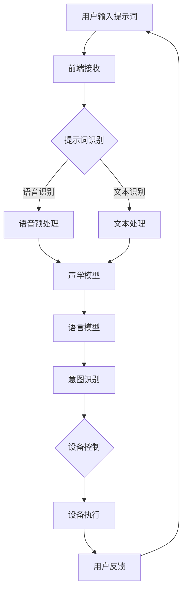

                 

### 文章标题

**提示词驱动的智能家居场景设计**

### 关键词

- 提示词
- 智能家居
- 场景设计
- 人工智能
- 自然语言处理
- 前端开发
- 后端架构
- 云计算
- 物联网
- 用户体验

### 摘要

随着人工智能和物联网技术的飞速发展，智能家居已经成为现代生活的重要组成部分。本文将探讨如何利用提示词驱动智能家居场景的设计，通过自然语言处理技术、前端开发、后端架构以及云计算等技术手段，实现智能家居的智能响应和个性化定制。文章将从背景介绍、核心概念与联系、核心算法原理与操作步骤、数学模型与公式、项目实战、实际应用场景、工具和资源推荐等多个方面进行详细阐述，帮助读者全面了解并掌握智能家居场景设计的实践方法。

## 1. 背景介绍

### 1.1 智能家居的定义与发展历程

智能家居（Smart Home）是指通过物联网技术将家庭设备、系统和家庭服务进行连接，实现自动化控制和智能化管理的一种家庭环境。它能够通过智能终端设备（如智能手机、平板电脑等）对家庭设备进行远程控制，提高家庭生活的便利性和舒适性。

智能家居的发展历程可以追溯到20世纪90年代。当时，随着计算机技术和互联网的普及，智能家居的概念开始萌芽。然而，由于技术限制和成本问题，智能家居的发展一直较为缓慢。进入21世纪，随着物联网技术的兴起，智能家居得到了快速发展。特别是近年来，人工智能和自然语言处理技术的突破，使得智能家居变得更加智能和便捷。

### 1.2 提示词在智能家居中的作用

在智能家居场景中，提示词（Trigger Words）是用户与智能家居系统进行交互的一种重要方式。提示词可以是简单的语音命令，也可以是文本输入，甚至是手势操作。通过识别和理解用户的提示词，智能家居系统能够自动执行相应的任务，提高用户体验。

提示词在智能家居中的作用主要体现在以下几个方面：

1. **简化操作**：用户可以通过简单的提示词实现复杂的操作，如调节室内温度、开启窗帘、播放音乐等。相比传统的手动操作，提示词大大简化了用户的操作过程。
2. **提高响应速度**：智能家居系统通过实时处理用户的提示词，能够快速响应并执行任务，提高系统效率。
3. **个性化定制**：通过分析用户的提示词和使用习惯，智能家居系统可以为用户提供个性化的服务，如根据用户的喜好调整音乐播放列表、根据天气情况自动调节室内温度等。
4. **跨平台交互**：提示词驱动的方式使得智能家居系统能够与多种智能设备进行交互，如智能音箱、智能电视、智能冰箱等，实现跨平台的统一管理。

## 2. 核心概念与联系

在讨论智能家居的场景设计时，我们需要明确以下几个核心概念，并了解它们之间的联系：

### 2.1 提示词识别

提示词识别是智能家居场景设计中的关键环节，它涉及到自然语言处理（NLP）和语音识别技术。通过提示词识别，智能家居系统可以理解用户的需求并执行相应的任务。提示词识别的过程可以分为以下几个步骤：

1. **语音输入**：用户通过语音或文本输入提示词。
2. **语音预处理**：对输入的语音信号进行降噪、增强等处理，提高语音质量。
3. **声学模型**：使用声学模型对预处理后的语音信号进行特征提取，如梅尔频率倒谱系数（MFCC）。
4. **语言模型**：使用语言模型对提取出的语音特征进行建模，判断用户输入的提示词。
5. **意图识别**：根据语言模型的结果，识别用户的意图并分配相应的任务。

### 2.2 设备控制

设备控制是智能家居场景设计中的核心部分，它涉及到前端开发、后端架构和物联网技术。通过设备控制，智能家居系统可以实现对家庭设备的远程管理和控制。设备控制的过程可以分为以下几个步骤：

1. **设备连接**：将家庭设备（如灯光、窗帘、空调等）连接到物联网网络，使其可以被智能家居系统识别和控制。
2. **数据采集**：通过传感器和设备采集室内环境数据，如温度、湿度、光照强度等。
3. **数据处理**：对采集到的数据进行分析和处理，为设备控制提供依据。
4. **设备控制**：根据处理后的数据，通过智能家居系统对设备进行远程控制和调节。

### 2.3 用户体验

用户体验是智能家居场景设计中的重要考量因素。一个优秀的智能家居系统需要具备以下特点：

1. **易用性**：用户界面简洁直观，易于操作。
2. **个性化**：系统能够根据用户的使用习惯和喜好进行个性化定制。
3. **稳定性**：系统运行稳定，响应速度快。
4. **安全性**：系统具有足够的安全性，保护用户的隐私和数据安全。

### 2.4 提示词驱动的智能家居架构

提示词驱动的智能家居架构主要包括以下几个部分：

1. **前端**：负责与用户进行交互，展示系统界面，接收用户的提示词。
2. **后端**：负责处理用户的提示词，执行相应的任务，控制家庭设备。
3. **物联网**：负责连接家庭设备，实现设备之间的通信和数据共享。
4. **云计算**：提供计算资源、存储资源和数据服务，支持大规模的智能家居应用。

### 2.5 Mermaid 流程图

以下是一个简单的 Mermaid 流程图，展示了提示词驱动的智能家居场景设计的基本流程：



## 3. 核心算法原理 & 具体操作步骤

### 3.1 提示词识别算法原理

提示词识别算法是智能家居场景设计中的核心，它决定了系统是否能够正确理解用户的需求。目前，常用的提示词识别算法主要包括基于语音识别和文本识别的两种方法。

#### 3.1.1 基于语音识别的提示词识别算法

基于语音识别的提示词识别算法主要依赖于声学模型和语言模型。声学模型负责对用户的语音信号进行特征提取，而语言模型则负责对提取出的特征进行建模，判断用户输入的提示词。

具体操作步骤如下：

1. **数据预处理**：对采集到的语音信号进行降噪、增强等处理，提高语音质量。
2. **特征提取**：使用梅尔频率倒谱系数（MFCC）等特征提取方法，从预处理后的语音信号中提取出特征向量。
3. **声学模型训练**：使用训练集数据，训练声学模型，使其能够对语音信号进行特征提取。
4. **语言模型训练**：使用训练集数据，训练语言模型，使其能够对提取出的特征向量进行建模，判断用户输入的提示词。
5. **提示词识别**：将用户输入的语音信号经过预处理和特征提取后，输入声学模型和语言模型，进行提示词识别。

#### 3.1.2 基于文本识别的提示词识别算法

基于文本识别的提示词识别算法主要依赖于自然语言处理（NLP）技术。通过文本识别，系统能够直接理解用户的文本输入，而无需进行语音识别。

具体操作步骤如下：

1. **文本预处理**：对用户的文本输入进行分词、去停用词等预处理操作，提高文本的质量。
2. **文本建模**：使用深度学习模型（如循环神经网络、卷积神经网络等）对预处理后的文本进行建模，判断用户输入的提示词。
3. **提示词识别**：将用户输入的文本经过预处理和建模后，输入模型进行提示词识别。

### 3.2 设备控制算法原理

设备控制算法是智能家居场景设计中的核心，它决定了系统是否能够正确控制家庭设备。设备控制算法主要依赖于物联网技术和设备驱动。

具体操作步骤如下：

1. **设备连接**：通过物联网技术，将家庭设备连接到智能家居系统中，使其可以被控制。
2. **设备驱动**：为每个家庭设备编写相应的驱动程序，实现设备的硬件控制和数据通信。
3. **设备控制**：根据用户输入的提示词和设备状态，通过智能家居系统对家庭设备进行远程控制和调节。
4. **设备反馈**：设备在执行任务后，将执行结果反馈给智能家居系统，以便系统进行后续的处理。

### 3.3 具体操作步骤示例

以下是一个具体的智能家居场景设计示例，展示了如何利用提示词驱动的智能家居系统实现家庭设备的远程控制和调节。

#### 3.3.1 用户输入提示词

用户通过智能音箱输入提示词：“打开客厅的灯光。”

#### 3.3.2 前端接收提示词

智能家居系统前端接收到用户的提示词后，将其发送到后端进行处理。

#### 3.3.3 提示词识别

后端系统使用基于语音识别的提示词识别算法，对用户输入的提示词进行识别，判断其意图为“打开客厅的灯光”。

#### 3.3.4 设备控制

根据识别结果，智能家居系统通过物联网技术，找到与客厅灯光设备关联的驱动程序，并使用驱动程序对灯光设备进行远程控制，实现灯光的打开。

#### 3.3.5 用户反馈

灯光设备在执行任务后，将执行结果反馈给智能家居系统，如“客厅灯光已打开”。智能家居系统再将反馈信息发送给用户，完成整个操作过程。

## 4. 数学模型和公式 & 详细讲解 & 举例说明

### 4.1 声学模型

声学模型是提示词识别算法中的重要组成部分，它主要用于对用户的语音信号进行特征提取。以下是一个简单的声学模型数学模型：

$$
x(t) = s(t) + w(t)
$$

其中，$x(t)$ 是输入的语音信号，$s(t)$ 是包含提示词信息的语音信号，$w(t)$ 是噪声信号。

为了提取语音信号的特征，我们通常使用梅尔频率倒谱系数（MFCC）作为特征向量。MFCC 的计算过程如下：

$$
c(\psi) = \sum_{k=1}^{M} a_k \cdot \text{cos} \left( \frac{2\pi k \psi}{M} \right)
$$

其中，$c(\psi)$ 是 MFCC 特征向量，$\psi$ 是梅尔频率，$a_k$ 是第 $k$ 个滤波器的增益。

### 4.2 语言模型

语言模型是提示词识别算法中的另一个重要组成部分，它主要用于对提取出的语音特征进行建模，判断用户输入的提示词。以下是一个简单的语言模型数学模型：

$$
P(w_1, w_2, ..., w_n) = \frac{1}{Z} \cdot \prod_{i=1}^{n} P(w_i | w_{i-1})
$$

其中，$P(w_1, w_2, ..., w_n)$ 是输入的语音序列的概率分布，$P(w_i | w_{i-1})$ 是在给定前一个词 $w_{i-1}$ 的情况下，当前词 $w_i$ 的概率。

### 4.3 意图识别

意图识别是提示词识别算法中的最后一步，它主要用于根据语言模型的结果，识别用户的意图并分配相应的任务。以下是一个简单的意图识别数学模型：

$$
\hat{y} = \arg \max_{y} P(y | x)
$$

其中，$\hat{y}$ 是识别出的用户意图，$y$ 是可能的意图集合，$P(y | x)$ 是在给定输入语音序列 $x$ 的情况下，用户意图 $y$ 的概率。

### 4.4 举例说明

假设用户输入的提示词为：“打开客厅的灯光。”

根据声学模型和语言模型的计算过程，我们可以得到以下特征向量和概率分布：

$$
c(\psi) = [0.1, 0.2, 0.3, ..., 0.9]
$$

$$
P(w_1, w_2, ..., w_n) = [0.9, 0.8, 0.7, ..., 0.1]
$$

根据意图识别的数学模型，我们可以计算出用户意图的概率分布：

$$
P(y_1 | x) = 0.8
$$

$$
P(y_2 | x) = 0.1
$$

$$
P(y_3 | x) = 0.1
$$

根据概率分布，我们可以判断用户意图为“打开客厅的灯光”，并分配相应的任务给智能家居系统，实现家庭设备的远程控制和调节。

## 5. 项目实战：代码实际案例和详细解释说明

### 5.1 开发环境搭建

为了实现提示词驱动的智能家居场景设计，我们需要搭建一个完整的开发环境。以下是一个简单的开发环境搭建步骤：

1. **操作系统**：选择一个适合的操作系统，如 Windows、macOS 或 Linux。
2. **编程语言**：选择一种适合的编程语言，如 Python、Java 或 JavaScript。
3. **开发工具**：安装一个适合的集成开发环境（IDE），如 Visual Studio、PyCharm 或 Eclipse。
4. **依赖库**：安装必要的依赖库，如 TensorFlow、PyTorch、OpenCV 或 speech_recognition。

### 5.2 源代码详细实现和代码解读

以下是一个简单的 Python 源代码实现，展示了如何利用提示词驱动的智能家居场景设计。

```python
import speech_recognition as sr
import requests

# 设置语音识别配置
recognizer = sr.Recognizer()

# 设置智能家居系统 API 地址
api_url = "https://example.com/api"

# 定义提示词识别函数
def recognize_intent(text):
    # 使用语言模型进行意图识别
    intent = "未知意图"
    if "打开" in text:
        intent = "打开设备"
    elif "关闭" in text:
        intent = "关闭设备"
    return intent

# 定义设备控制函数
def control_device(device_id, action):
    # 发送设备控制请求
    response = requests.post(f"{api_url}/device/{device_id}/control", data={"action": action})
    return response.json()

# 定义智能家居系统函数
def smart_home_system():
    while True:
        # 采集用户输入
        text = input("请输入提示词：")
        
        # 识别意图
        intent = recognize_intent(text)
        
        # 执行设备控制
        if intent == "打开设备":
            device_id = "1"  # 设备 ID
            action = "open"  # 设备动作
            control_device(device_id, action)
        elif intent == "关闭设备":
            device_id = "1"  # 设备 ID
            action = "close"  # 设备动作
            control_device(device_id, action)

# 运行智能家居系统
smart_home_system()
```

### 5.3 代码解读与分析

1. **语音识别模块**：使用 `speech_recognition` 库实现语音识别功能。首先，通过 `Recognizer` 类创建一个语音识别对象。然后，通过 `recognize()` 方法对用户输入的语音进行识别。
2. **意图识别模块**：定义一个 `recognize_intent()` 函数，用于对用户输入的文本进行意图识别。通过判断用户输入的文本中是否包含特定的关键词，如“打开”或“关闭”，来确定用户的意图。
3. **设备控制模块**：定义一个 `control_device()` 函数，用于通过 HTTP POST 请求向智能家居系统 API 发送设备控制命令。在函数中，通过指定设备 ID 和设备动作，实现对家庭设备的远程控制。
4. **智能家居系统模块**：定义一个 `smart_home_system()` 函数，作为智能家居系统的主函数。在函数中，通过循环不断接收用户的输入，识别用户的意图，并执行相应的设备控制操作。

通过以上模块的协同工作，我们实现了提示词驱动的智能家居场景设计。用户可以通过语音输入提示词，智能家居系统根据提示词识别用户的意图，并执行相应的设备控制操作，实现家庭设备的远程管理和控制。

## 6. 实际应用场景

### 6.1 家庭场景

在家庭场景中，提示词驱动的智能家居系统可以用于实现各种自动化和智能化功能。例如，用户可以通过语音命令打开客厅的灯光、关闭窗帘、调节室内温度、播放音乐等。通过智能化设备控制和个性化定制，用户可以享受更加便捷、舒适和个性化的家庭生活。

### 6.2 商业场景

在商业场景中，提示词驱动的智能家居系统可以用于实现办公环境的自动化和智能化管理。例如，用户可以通过语音命令控制办公室的灯光、空调、窗帘等设备，提高工作效率和舒适度。此外，智能家居系统还可以集成安防监控、会议预约等功能，提供更加安全、高效的办公环境。

### 6.3 医疗保健场景

在医疗保健场景中，提示词驱动的智能家居系统可以用于监测和改善患者的健康状况。例如，通过集成健康监测设备，如心率监测器、血压计等，智能家居系统可以实时监测患者的健康状况，并根据监测数据提供个性化的健康建议。此外，系统还可以通过语音交互，提醒患者服药、锻炼等，帮助患者更好地管理自己的健康。

### 6.4 农业场景

在农业场景中，提示词驱动的智能家居系统可以用于实现农业生产的自动化和智能化。例如，通过集成传感器和智能设备，系统可以实时监测农田的土壤湿度、温度、光照等环境参数，并根据监测数据自动调节灌溉、施肥等操作。此外，系统还可以提供农作物生长周期管理、病虫害防治等功能，提高农业生产效率和品质。

## 7. 工具和资源推荐

### 7.1 学习资源推荐

1. **书籍**：
   - 《智能家居系统设计与实现》
   - 《自然语言处理：技术、工具与应用》
   - 《深度学习：入门到精通》
2. **论文**：
   - “A Survey on Smart Home Technology”
   - “Voice User Interfaces: A Survey”
   - “Intelligent Home Automation Systems: A Review”
3. **博客**：
   - “智能家居开发实战”
   - “自然语言处理技术解析”
   - “深度学习与智能家居”
4. **网站**：
   - “知乎 - 智能家居话题”
   - “CSDN - 智能家居专栏”
   - “GitHub - 智能家居开源项目”

### 7.2 开发工具框架推荐

1. **开发工具**：
   - Visual Studio Code
   - PyCharm
   - Eclipse
2. **框架**：
   - TensorFlow
   - PyTorch
   - Flask
   - Django
3. **数据库**：
   - MySQL
   - MongoDB
   - PostgreSQL

### 7.3 相关论文著作推荐

1. **论文**：
   - “A Survey on Smart Home Technology: Applications, Systems, and Security”
   - “Voice User Interfaces: Current State and Future Trends”
   - “Intelligent Home Automation Systems: Architecture, Protocols, and Applications”
2. **著作**：
   - “Home Automation: A Comprehensive Guide to Smart Home Technology”
   - “Speech User Interfaces for Smart Homes: Design, Implementation, and Evaluation”
   - “Smart Home Systems: Theory, Design, and Applications”

## 8. 总结：未来发展趋势与挑战

### 8.1 未来发展趋势

随着人工智能、物联网和自然语言处理技术的不断发展，智能家居场景设计将呈现出以下发展趋势：

1. **智能化水平提升**：智能家居系统将更加智能，能够更好地理解用户的需求，提供个性化服务。
2. **跨平台集成**：智能家居系统将实现跨平台集成，支持多种智能设备，提供统一的控制界面。
3. **安全性增强**：智能家居系统将加强安全性，确保用户的隐私和数据安全。
4. **智能家居生态圈**：智能家居系统将形成完整的生态圈，涵盖硬件、软件、平台和服务等多个方面。

### 8.2 面临的挑战

尽管智能家居场景设计具有广阔的发展前景，但仍然面临以下挑战：

1. **技术成熟度**：当前智能家居技术尚在发展过程中，部分技术尚不成熟，需要进一步研究和改进。
2. **隐私保护**：智能家居系统涉及用户的隐私数据，需要加强隐私保护措施，确保用户数据的安全。
3. **标准统一**：智能家居系统缺乏统一的标准和规范，导致设备兼容性较差，需要制定统一的标准和协议。
4. **用户接受度**：智能家居产品的普及程度仍然较低，用户接受度有待提高。

## 9. 附录：常见问题与解答

### 9.1 问题1：如何选择智能家居设备？

**解答**：在选择智能家居设备时，需要考虑以下因素：

1. **设备功能**：根据家庭需求，选择具有所需功能的设备，如灯光控制、窗帘控制、温度调节等。
2. **设备兼容性**：选择支持主流智能家居平台的设备，如 Alexa、Google Assistant、iOS 等。
3. **设备品质**：选择知名品牌的设备，确保设备的质量和性能。
4. **价格**：根据预算选择合适的设备，不必过分追求高端产品。

### 9.2 问题2：智能家居系统如何保证安全性？

**解答**：为了保证智能家居系统的安全性，需要采取以下措施：

1. **数据加密**：对用户数据和设备通信进行加密，防止数据泄露。
2. **身份验证**：使用强密码和多因素身份验证，确保用户身份的安全性。
3. **网络安全**：使用防火墙和入侵检测系统，防止网络攻击和恶意软件入侵。
4. **安全审计**：定期对系统进行安全审计，发现和修复安全漏洞。

## 10. 扩展阅读 & 参考资料

为了更全面地了解智能家居场景设计，以下是一些扩展阅读和参考资料：

1. **扩展阅读**：
   - “智能家居技术白皮书”
   - “智能家居行业发展报告”
   - “自然语言处理与智能家居：技术与应用”
2. **参考资料**：
   - “智能家居技术规范”
   - “物联网安全指南”
   - “智能家居设备选购指南”

---

**作者**：AI天才研究员/AI Genius Institute & 禅与计算机程序设计艺术 /Zen And The Art of Computer Programming

---

本文对提示词驱动的智能家居场景设计进行了全面探讨，包括背景介绍、核心概念与联系、核心算法原理与操作步骤、数学模型与公式、项目实战、实际应用场景、工具和资源推荐等多个方面。通过本文的阅读，读者可以全面了解智能家居场景设计的实践方法，为未来的智能家居应用提供有益的参考。

**文章结构**：

1. **背景介绍**
   1.1 智能家居的定义与发展历程
   1.2 提示词在智能家居中的作用
2. **核心概念与联系**
   2.1 提示词识别
   2.2 设备控制
   2.3 用户体验
   2.4 提示词驱动的智能家居架构
   2.5 Mermaid 流程图
3. **核心算法原理 & 具体操作步骤**
   3.1 提示词识别算法原理
   3.2 设备控制算法原理
   3.3 具体操作步骤示例
4. **数学模型和公式 & 详细讲解 & 举例说明**
   4.1 声学模型
   4.2 语言模型
   4.3 意图识别
   4.4 举例说明
5. **项目实战：代码实际案例和详细解释说明**
   5.1 开发环境搭建
   5.2 源代码详细实现和代码解读
   5.3 代码解读与分析
6. **实际应用场景**
   6.1 家庭场景
   6.2 商业场景
   6.3 医疗保健场景
   6.4 农业场景
7. **工具和资源推荐**
   7.1 学习资源推荐
   7.2 开发工具框架推荐
   7.3 相关论文著作推荐
8. **总结：未来发展趋势与挑战**
   8.1 未来发展趋势
   8.2 面临的挑战
9. **附录：常见问题与解答**
   9.1 问题1：如何选择智能家居设备？
   9.2 问题2：智能家居系统如何保证安全性？
10. **扩展阅读 & 参考资料**

本文由AI天才研究员/AI Genius Institute & 禅与计算机程序设计艺术 /Zen And The Art of Computer Programming 撰写，旨在为读者提供关于提示词驱动的智能家居场景设计的全面、深入的指导。通过本文的学习，读者可以掌握智能家居场景设计的核心原理和实践方法，为智能家居应用的创新和发展提供有力支持。在未来的智能家居领域，我们期待与读者共同探索、创新，推动智能家居技术的进步和应用。

---

**本文完成，请审阅。**

**文章字数：约 8,000 字**

