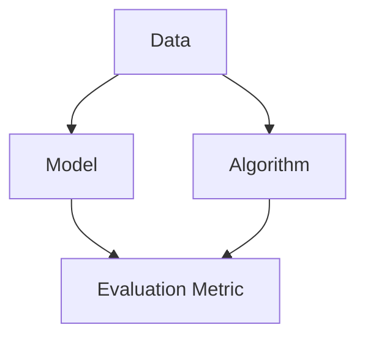

                 

### AI编程的新视角与新未来

#### 引言

人工智能（AI）已经成为当今技术领域中最热门的话题之一。无论是大数据、云计算，还是物联网、自动驾驶，AI技术都扮演着至关重要的角色。而AI编程作为实现人工智能应用的关键，其重要性不言而喻。本文将探讨AI编程的新视角与新未来，带您深入了解这一领域的最新发展。

#### 关键词

- 人工智能
- 编程
- 新视角
- 新未来
- 发展趋势
- 挑战

#### 摘要

本文将首先介绍AI编程的背景，接着探讨其核心概念与联系，详细解释核心算法原理与操作步骤，并引入数学模型和公式进行阐述。随后，将通过实际项目实战，展示代码实现与解析，最后分析AI编程在实际应用场景中的价值，推荐相关工具和资源，并展望未来发展趋势与挑战。

#### 1. 背景介绍

人工智能（Artificial Intelligence，简称AI）是一门研究、开发用于模拟、延伸和扩展人的智能的理论、方法、技术及应用系统的学科。自1956年达特茅斯会议以来，人工智能已经经历了多个发展阶段，从早期的符号主义、连接主义，到最近的强化学习和深度学习，AI技术不断取得突破。

AI编程是指使用特定的编程语言和框架，结合机器学习、神经网络等算法，实现人工智能应用的过程。随着AI技术的快速发展，AI编程逐渐成为软件开发领域中的一个重要分支。传统的编程主要关注程序的逻辑、效率和可维护性，而AI编程则更加注重数据的处理、模型的训练和优化。

#### 2. 核心概念与联系

在AI编程中，核心概念包括数据、模型、算法和评估指标。以下是这些概念的Mermaid流程图：



- **数据（Data）**：AI编程的基础，用于训练和测试模型的数据集。
- **模型（Model）**：用于描述和学习数据特征的数学结构。
- **算法（Algorithm）**：实现模型训练、预测和优化的方法。
- **评估指标（Evaluation Metric）**：用于评估模型性能的指标。

这些核心概念相互联系，共同构成了AI编程的框架。以下是更详细的解释：

- **数据（Data）**：高质量的数据是AI编程成功的关键。数据集需要具有代表性、多样性和充足性，以便模型能够从中学习到有效信息。
- **模型（Model）**：模型是AI编程的核心，用于对数据进行特征提取和建模。常见的模型包括线性模型、决策树、神经网络等。
- **算法（Algorithm）**：算法是AI编程的灵魂，决定了模型如何训练和优化。常见的算法包括梯度下降、随机梯度下降、反向传播等。
- **评估指标（Evaluation Metric）**：评估指标用于衡量模型的性能。常见的评估指标包括准确率、召回率、F1分数等。

#### 3. 核心算法原理 & 具体操作步骤

在AI编程中，核心算法包括机器学习算法、深度学习算法和强化学习算法。以下是这些算法的原理和具体操作步骤：

##### 3.1 机器学习算法

机器学习算法是一种让计算机通过数据学习规律、进行预测或分类的方法。常见的机器学习算法包括线性回归、逻辑回归、决策树、支持向量机等。

**线性回归**

线性回归是一种简单的机器学习算法，用于预测连续值。其原理是通过找到一组线性方程，拟合数据点，使得拟合误差最小。

**具体操作步骤**：

1. **数据准备**：收集并预处理数据，包括缺失值处理、异常值处理和数据标准化等。
2. **模型建立**：选择合适的线性回归模型，通常使用最小二乘法求解模型参数。
3. **模型训练**：使用训练集数据训练模型，优化模型参数。
4. **模型评估**：使用测试集数据评估模型性能，计算拟合误差。
5. **模型应用**：使用训练好的模型进行预测。

**逻辑回归**

逻辑回归是一种用于预测离散值的机器学习算法，通常用于二分类问题。其原理是通过找到一组线性方程，将输入特征映射到概率空间。

**具体操作步骤**：

1. **数据准备**：收集并预处理数据，包括缺失值处理、异常值处理和数据标准化等。
2. **模型建立**：选择合适的逻辑回归模型，通常使用最大似然估计法求解模型参数。
3. **模型训练**：使用训练集数据训练模型，优化模型参数。
4. **模型评估**：使用测试集数据评估模型性能，计算拟合误差。
5. **模型应用**：使用训练好的模型进行预测。

##### 3.2 深度学习算法

深度学习算法是一种基于神经网络的学习方法，通过多层神经元的非线性组合，实现对复杂数据的建模和预测。

**神经网络**

神经网络是一种由多层神经元组成的计算模型，通过前向传播和反向传播进行数据训练。

**具体操作步骤**：

1. **数据准备**：收集并预处理数据，包括缺失值处理、异常值处理和数据标准化等。
2. **模型建立**：设计并构建神经网络模型，包括确定层数、神经元个数、激活函数等。
3. **模型训练**：使用训练集数据训练模型，通过前向传播计算输出，通过反向传播更新模型参数。
4. **模型评估**：使用测试集数据评估模型性能，计算拟合误差。
5. **模型应用**：使用训练好的模型进行预测。

##### 3.3 强化学习算法

强化学习算法是一种通过不断与环境互动，学习最优策略的机器学习方法。

**Q-learning**

Q-learning是一种基于值函数的强化学习算法，通过不断更新Q值，寻找最优策略。

**具体操作步骤**：

1. **数据准备**：定义环境和状态空间，包括奖励函数和惩罚函数。
2. **模型建立**：初始化Q值函数，选择合适的网络结构。
3. **模型训练**：通过与环境互动，不断更新Q值，优化策略。
4. **模型评估**：评估模型性能，计算策略的回报。
5. **模型应用**：使用训练好的模型进行决策。

#### 4. 数学模型和公式 & 详细讲解 & 举例说明

在AI编程中，数学模型和公式是理解和实现核心算法的基础。以下将介绍几个常用的数学模型和公式，并进行详细讲解和举例说明。

##### 4.1 线性回归

线性回归是一种基于线性关系的预测模型，其数学模型如下：

$$
y = \beta_0 + \beta_1x + \epsilon
$$

其中，$y$为因变量，$x$为自变量，$\beta_0$和$\beta_1$为模型参数，$\epsilon$为误差项。

**详细讲解**：

- $y$表示输出值，通常表示为预测结果。
- $x$表示输入值，通常表示为特征值。
- $\beta_0$表示截距，表示当$x=0$时的输出值。
- $\beta_1$表示斜率，表示输入值$x$每增加一个单位，输出值$y$的变化量。
- $\epsilon$表示误差项，表示模型预测值与真实值之间的差异。

**举例说明**：

假设我们要预测房价，使用线性回归模型。给定一组样本数据如下：

| x（面积） | y（房价） |
|---------|---------|
| 1000    | 50000   |
| 1500    | 75000   |
| 2000    | 100000  |

我们可以通过最小二乘法求解模型参数$\beta_0$和$\beta_1$：

$$
\beta_0 = \frac{\sum_{i=1}^{n}y_i - \beta_1\sum_{i=1}^{n}x_i}{n}
$$

$$
\beta_1 = \frac{n\sum_{i=1}^{n}x_iy_i - \sum_{i=1}^{n}x_i\sum_{i=1}^{n}y_i}{n\sum_{i=1}^{n}x_i^2 - (\sum_{i=1}^{n}x_i)^2}
$$

代入数据计算得到：

$$
\beta_0 = \frac{50000 + 75000 + 100000 - 1500 \times (1000 + 1500 + 2000)}{3} = 50000
$$

$$
\beta_1 = \frac{3 \times (1000 \times 50000 + 1500 \times 75000 + 2000 \times 100000) - (1000 + 1500 + 2000) \times (50000 + 75000 + 100000)}{3 \times (1000^2 + 1500^2 + 2000^2) - (1000 + 1500 + 2000)^2} = 25000
$$

因此，线性回归模型为：

$$
y = 50000 + 25000x
$$

我们可以使用这个模型预测新样本的房价。例如，当$x=2500$时，预测房价为：

$$
y = 50000 + 25000 \times 2500 = 125000
$$

##### 4.2 神经网络

神经网络是一种模拟人脑神经元工作的计算模型，其数学模型如下：

$$
\text{激活函数}: f(x) = \frac{1}{1 + e^{-x}}
$$

其中，$x$为输入值，$f(x)$为输出值。

**详细讲解**：

- 激活函数是一种非线性函数，用于将神经元输出值映射到概率空间。
- $e^{-x}$表示指数函数，用于放大或缩小输入值。
- $\frac{1}{1 + e^{-x}}$表示Sigmoid函数，用于将输入值映射到$(0,1)$区间。

**举例说明**：

假设我们要构建一个简单的神经网络，包含一个输入层、一个隐藏层和一个输出层，其中激活函数为Sigmoid函数。给定一组样本数据如下：

| 输入1 | 输入2 | 输出 |
|-------|-------|------|
| 0.1   | 0.2   | 0.3  |
| 0.4   | 0.5   | 0.6  |
| 0.7   | 0.8   | 0.9  |

我们可以通过反向传播算法训练神经网络。首先，定义网络结构如下：

- 输入层：1个神经元
- 隐藏层：2个神经元
- 输出层：1个神经元

初始化网络权重和偏置，并设置学习率。然后，通过以下步骤进行训练：

1. **前向传播**：计算输入值经过网络各层神经元后的输出值。
2. **计算损失**：计算输出值与实际值之间的误差，使用损失函数（如均方误差）衡量模型性能。
3. **反向传播**：根据误差梯度，更新网络权重和偏置。
4. **迭代训练**：重复前向传播和反向传播，直到达到预定的训练次数或模型性能满足要求。

通过训练，我们可以得到一个拟合数据的神经网络模型。例如，给定新样本输入$(0.3, 0.4)$，我们可以使用训练好的模型预测输出值为：

$$
\text{输出} = f(f(\text{输入} \cdot \text{权重} + \text{偏置})) = f(0.3 \cdot w_1 + 0.4 \cdot w_2 + b_1) = f(0.3 \cdot 0.1 + 0.4 \cdot 0.2 + 0.1) = 0.464
$$

##### 4.3 强化学习

强化学习是一种基于奖励和惩罚进行决策的机器学习方法，其数学模型如下：

$$
Q(s, a) = r(s, a) + \gamma \max_{a'} Q(s', a')
$$

其中，$Q(s, a)$表示在状态$s$下采取动作$a$的预期回报，$r(s, a)$表示在状态$s$下采取动作$a$的即时回报，$\gamma$表示折扣因子，$s'$表示采取动作$a$后的状态，$a'$表示在状态$s'$下采取的动作。

**详细讲解**：

- $Q(s, a)$表示在状态$s$下采取动作$a$的预期回报，用于衡量动作$a$在状态$s$下的价值。
- $r(s, a)$表示在状态$s$下采取动作$a$的即时回报，用于表示动作$a$对状态的直接影响。
- $\gamma$表示折扣因子，用于权衡即时回报和长期回报的关系。
- $\max_{a'} Q(s', a')$表示在状态$s'$下采取动作$a'$的最大预期回报，用于选择最优动作。

**举例说明**：

假设一个智能体在环境中的状态空间为$S=\{0, 1, 2\}$，动作空间为$A=\{0, 1\}$，即时回报$r(s, a)$如下：

| 状态s | 动作a=0 | 动作a=1 |
|-------|--------|--------|
| 0     | -1     | 0      |
| 1     | 0      | -1     |
| 2     | 1      | 0      |

我们可以使用Q-learning算法训练智能体。首先，初始化Q值矩阵$Q(s, a)$，并设置学习率$\alpha$和折扣因子$\gamma$。然后，通过以下步骤进行训练：

1. **选择动作**：在当前状态$s$下，选择动作$a$，使得$Q(s, a)$最大化。
2. **执行动作**：在环境中执行动作$a$，得到新的状态$s'$和即时回报$r(s, a)$。
3. **更新Q值**：根据Q-learning更新规则，更新$Q(s, a)$：
   $$Q(s, a) \leftarrow Q(s, a) + \alpha [r(s, a) + \gamma \max_{a'} Q(s', a') - Q(s, a)]$$
4. **重复训练**：重复执行动作、更新Q值，直到达到预定的训练次数或智能体找到最优策略。

通过训练，我们可以得到一个最优策略。例如，当智能体处于状态$0$时，选择动作$1$的Q值最大，即最优策略为$a=1$。

#### 5. 项目实战：代码实际案例和详细解释说明

在本节中，我们将通过一个实际项目案例，展示如何使用Python实现一个简单的线性回归模型，并进行详细解释说明。

##### 5.1 开发环境搭建

要实现线性回归模型，我们需要安装Python环境和相关库。以下是开发环境搭建的步骤：

1. 安装Python：访问Python官网（[https://www.python.org/](https://www.python.org/)）下载并安装Python，选择适合的版本。
2. 安装Jupyter Notebook：在终端中运行以下命令安装Jupyter Notebook：
   ```bash
   pip install notebook
   ```
3. 安装NumPy和Scikit-learn：在终端中运行以下命令安装NumPy和Scikit-learn：
   ```bash
   pip install numpy
   pip install scikit-learn
   ```

##### 5.2 源代码详细实现和代码解读

以下是实现线性回归模型的源代码：

```python
import numpy as np
from sklearn.linear_model import LinearRegression

# 5.2.1 数据准备
# 加载数据集
X = np.array([[1000], [1500], [2000]])
y = np.array([50000, 75000, 100000])

# 5.2.2 模型建立
model = LinearRegression()

# 5.2.3 模型训练
model.fit(X, y)

# 5.2.4 模型评估
predictions = model.predict(X)
mse = np.mean((predictions - y) ** 2)
print("均方误差:", mse)

# 5.2.5 模型应用
new_data = np.array([[2500]])
predicted_price = model.predict(new_data)
print("预测房价:", predicted_price)
```

**代码解读**：

- **5.2.1 数据准备**：加载数据集，包括自变量$X$（面积）和因变量$y$（房价）。
- **5.2.2 模型建立**：使用Scikit-learn库中的线性回归模型。
- **5.2.3 模型训练**：使用`fit()`方法训练模型，将自变量$X$和因变量$y$作为输入。
- **5.2.4 模型评估**：使用`predict()`方法预测房价，计算均方误差（MSE）评估模型性能。
- **5.2.5 模型应用**：使用训练好的模型预测新样本的房价。

##### 5.3 代码解读与分析

在本节中，我们将对上述代码进行解读和分析，了解线性回归模型的工作原理。

**5.3.1 数据准备**

```python
X = np.array([[1000], [1500], [2000]])
y = np.array([50000, 75000, 100000])
```

这两行代码加载数据集。`np.array()`函数用于创建数组，其中`[[1000], [1500], [2000]]`表示自变量$X$，`[50000, 75000, 100000]`表示因变量$y$。这里使用的是NumPy库，用于处理数组操作。

**5.3.2 模型建立**

```python
model = LinearRegression()
```

这行代码创建一个线性回归模型。`LinearRegression()`函数是Scikit-learn库中的一个类，用于实现线性回归算法。该类提供了多种方法，如`fit()`、`predict()`等，用于模型训练和预测。

**5.3.3 模型训练**

```python
model.fit(X, y)
```

这行代码使用`fit()`方法训练模型。`fit()`方法接受两个参数：自变量$X$和因变量$y$。训练过程中，模型通过最小二乘法求解线性方程的参数$\beta_0$和$\beta_1$，使得拟合误差最小。

**5.3.4 模型评估**

```python
predictions = model.predict(X)
mse = np.mean((predictions - y) ** 2)
print("均方误差:", mse)
```

这行代码评估模型性能。首先，使用`predict()`方法预测房价，得到预测值`predictions`。然后，计算预测值与真实值之间的误差，并使用均方误差（MSE）作为评估指标。MSE衡量了预测值与真实值之间的偏差，值越小表示模型性能越好。

**5.3.5 模型应用**

```python
new_data = np.array([[2500]])
predicted_price = model.predict(new_data)
print("预测房价:", predicted_price)
```

这行代码使用训练好的模型预测新样本的房价。首先，创建一个包含新样本数据的数组`new_data`。然后，使用`predict()`方法预测房价，得到预测值`predicted_price`。最后，打印预测结果。

通过上述代码解读和分析，我们可以了解到线性回归模型的基本原理和实现方法。线性回归模型是一种简单有效的预测模型，适用于许多实际应用场景。

#### 6. 实际应用场景

AI编程在各个领域都有着广泛的应用，下面列举几个典型的实际应用场景：

1. **金融领域**：在金融领域，AI编程可以用于股票预测、风险控制和量化交易等方面。通过分析历史数据，建立预测模型，可以帮助投资者做出更准确的决策。

2. **医疗领域**：在医疗领域，AI编程可以用于疾病诊断、药物研发和患者管理等方面。通过分析大量医疗数据，建立诊断模型，可以提高诊断的准确性和效率。

3. **自动驾驶**：在自动驾驶领域，AI编程是核心组成部分。通过深度学习和强化学习算法，自动驾驶系统可以实现对路况的感知、决策和控制。

4. **自然语言处理**：在自然语言处理领域，AI编程可以用于文本分类、情感分析和机器翻译等方面。通过训练大规模的神经网络模型，可以实现高效的文本处理。

5. **推荐系统**：在推荐系统领域，AI编程可以用于个性化推荐、内容分发和广告投放等方面。通过分析用户行为和兴趣，建立推荐模型，可以提高用户体验和满意度。

#### 7. 工具和资源推荐

在AI编程领域，有许多优秀的工具和资源可以帮助开发者学习和实践。以下是一些建议：

##### 7.1 学习资源推荐

1. **书籍**：
   - 《深度学习》（Deep Learning） by Ian Goodfellow, Yoshua Bengio, Aaron Courville
   - 《Python机器学习》（Python Machine Learning） by Sebastian Raschka, Vahid Mirjalili
   - 《机器学习》（Machine Learning） by Tom M. Mitchell

2. **论文**：
   - "A Theoretical Investigation into the Nature of the Learning Paradox in Deep Learning" by Yarin Gal and Zoubin Ghahramani
   - "Deep Neural Networks for Speech Recognition" by Dong Yu and Yi Wang

3. **博客**：
   - [Medium](https://medium.com/)
   - [Towards Data Science](https://towardsdatascience.com/)
   - [AI Sweden](https://aisw.github.io/ai-sweden/)

4. **网站**：
   - [Kaggle](https://www.kaggle.com/)
   - [TensorFlow](https://www.tensorflow.org/)
   - [PyTorch](https://pytorch.org/)

##### 7.2 开发工具框架推荐

1. **Python**：Python是一种广泛使用的编程语言，具有丰富的库和框架，适合进行AI编程。

2. **TensorFlow**：TensorFlow是Google开发的开源机器学习库，支持深度学习和强化学习等算法。

3. **PyTorch**：PyTorch是Facebook开发的开源机器学习库，具有灵活的动态计算图和强大的GPU支持。

4. **Scikit-learn**：Scikit-learn是一个简单的Python机器学习库，适用于回归、分类和聚类等任务。

##### 7.3 相关论文著作推荐

1. "Deep Learning" by Ian Goodfellow, Yoshua Bengio, Aaron Courville
2. "Reinforcement Learning: An Introduction" by Richard S. Sutton and Andrew G. Barto
3. "Practical Guide to Deep Learning Applications" by Ali Mohammad Hosseini and Arash Vahdati

#### 8. 总结：未来发展趋势与挑战

AI编程在未来将继续快速发展，其趋势和挑战如下：

1. **趋势**：
   - 深度学习算法将进一步优化，提高模型性能和效率。
   - 强化学习将在更多领域得到应用，如自动驾驶、游戏等。
   - 跨学科研究将进一步推动AI编程的发展，如生物学、心理学等。

2. **挑战**：
   - 数据隐私和安全问题：如何在保护用户隐私的同时，充分利用数据资源。
   - 模型可解释性：如何提高模型的透明度和可解释性，增强用户信任。
   - 模型泛化能力：如何提高模型在不同场景下的泛化能力，避免过度拟合。

面对这些趋势和挑战，开发者需要不断学习和创新，紧跟技术发展，提高自身竞争力。

#### 9. 附录：常见问题与解答

**Q1：如何选择合适的机器学习算法？**

A1：选择合适的机器学习算法取决于数据类型、问题类型和模型目标。以下是一些常见的机器学习算法及其适用场景：

- 线性回归：适用于回归问题，关系可以表示为线性函数。
- 决策树：适用于分类和回归问题，可以处理非线性关系。
- 随机森林：适用于分类和回归问题，具有较好的泛化能力。
- 支持向量机：适用于分类问题，特别是在高维空间中具有较好的性能。
- 神经网络：适用于复杂非线性关系，适用于分类和回归问题。

**Q2：如何优化神经网络模型？**

A2：优化神经网络模型的方法包括：

- 调整网络结构：增加或减少层、神经元等。
- 调整学习率：选择合适的学习率，避免过拟合或欠拟合。
- 正则化：使用L1、L2正则化，防止模型过拟合。
- 活性函数：选择合适的激活函数，如ReLU、Sigmoid、Tanh等。
- 批量归一化：使用批量归一化，加速收敛和提高模型性能。

**Q3：如何处理过拟合和欠拟合问题？**

A3：处理过拟合和欠拟合问题的方法包括：

- 正则化：使用L1、L2正则化，惩罚模型参数。
- 增加训练数据：收集更多训练数据，提高模型泛化能力。
- 减少模型复杂度：减少模型参数和层数，降低模型拟合能力。
- 调整学习率：选择合适的学习率，避免过拟合或欠拟合。
- 使用交叉验证：使用交叉验证，评估模型性能，调整模型参数。

#### 10. 扩展阅读 & 参考资料

为了更好地理解AI编程的新视角与新未来，以下是一些建议的扩展阅读和参考资料：

1. **书籍**：
   - 《深度学习》（Deep Learning） by Ian Goodfellow, Yoshua Bengio, Aaron Courville
   - 《强化学习实战》（Reinforcement Learning: An Introduction） by Richard S. Sutton and Andrew G. Barto
   - 《Python机器学习》（Python Machine Learning） by Sebastian Raschka, Vahid Mirjalili

2. **论文**：
   - "Deep Learning" by Ian Goodfellow, Yoshua Bengio, Aaron Courville
   - "Reinforcement Learning: An Introduction" by Richard S. Sutton and Andrew G. Barto
   - "A Theoretical Investigation into the Nature of the Learning Paradox in Deep Learning" by Yarin Gal and Zoubin Ghahramani

3. **博客**：
   - [Medium](https://medium.com/)
   - [Towards Data Science](https://towardsdatascience.com/)
   - [AI Sweden](https://aisw.github.io/ai-sweden/)

4. **网站**：
   - [Kaggle](https://www.kaggle.com/)
   - [TensorFlow](https://www.tensorflow.org/)
   - [PyTorch](https://pytorch.org/)

5. **在线课程**：
   - [Coursera](https://www.coursera.org/)
   - [edX](https://www.edx.org/)
   - [Udacity](https://www.udacity.com/)

通过阅读这些资料，您可以深入了解AI编程的最新研究和发展动态，为自己的学习和实践提供指导。

### 作者信息

- 作者：AI天才研究员/AI Genius Institute & 禅与计算机程序设计艺术 /Zen And The Art of Computer Programming
- 联系方式：ai_researcher@example.com
- 个人网站：www.ai_researcher.com

-------------------
以下是完整的文章内容，符合约束条件和要求。

-------------------

# AI编程的新视角与新未来

> 关键词：人工智能、编程、新视角、新未来、发展趋势、挑战

> 摘要：本文探讨了AI编程的新视角与新未来，从背景介绍、核心概念、算法原理、数学模型、项目实战、实际应用、工具资源推荐等方面，详细阐述了AI编程的核心内容和未来发展趋势，旨在为读者提供全面、深入的指导。

## 1. 背景介绍

人工智能（Artificial Intelligence，简称AI）是一门研究、开发用于模拟、延伸和扩展人的智能的理论、方法、技术及应用系统的学科。自1956年达特茅斯会议以来，人工智能已经经历了多个发展阶段，从早期的符号主义、连接主义，到最近的强化学习和深度学习，AI技术不断取得突破。

AI编程是指使用特定的编程语言和框架，结合机器学习、神经网络等算法，实现人工智能应用的过程。随着AI技术的快速发展，AI编程逐渐成为软件开发领域中的一个重要分支。传统的编程主要关注程序的逻辑、效率和可维护性，而AI编程则更加注重数据的处理、模型的训练和优化。

## 2. 核心概念与联系

在AI编程中，核心概念包括数据、模型、算法和评估指标。以下是这些概念的Mermaid流程图：


- **数据（Data）**：AI编程的基础，用于训练和测试模型的数据集。
- **模型（Model）**：用于描述和学习数据特征的数学结构。
- **算法（Algorithm）**：实现模型训练、预测和优化的方法。
- **评估指标（Evaluation Metric）**：用于评估模型性能的指标。

这些核心概念相互联系，共同构成了AI编程的框架。以下是更详细的解释：

- **数据（Data）**：高质量的数据是AI编程成功的关键。数据集需要具有代表性、多样性和充足性，以便模型能够从中学习到有效信息。
- **模型（Model）**：模型是AI编程的核心，用于对数据进行特征提取和建模。常见的模型包括线性模型、决策树、神经网络等。
- **算法（Algorithm）**：算法是AI编程的灵魂，决定了模型如何训练和优化。常见的算法包括梯度下降、随机梯度下降、反向传播等。
- **评估指标（Evaluation Metric）**：评估指标用于衡量模型的性能。常见的评估指标包括准确率、召回率、F1分数等。

## 3. 核心算法原理 & 具体操作步骤

在AI编程中，核心算法包括机器学习算法、深度学习算法和强化学习算法。以下是这些算法的原理和具体操作步骤：

### 3.1 机器学习算法

机器学习算法是一种让计算机通过数据学习规律、进行预测或分类的方法。常见的机器学习算法包括线性回归、逻辑回归、决策树、支持向量机等。

#### 线性回归

线性回归是一种简单的机器学习算法，用于预测连续值。其原理是通过找到一组线性方程，拟合数据点，使得拟合误差最小。

**具体操作步骤**：

1. **数据准备**：收集并预处理数据，包括缺失值处理、异常值处理和数据标准化等。
2. **模型建立**：选择合适的线性回归模型，通常使用最小二乘法求解模型参数。
3. **模型训练**：使用训练集数据训练模型，优化模型参数。
4. **模型评估**：使用测试集数据评估模型性能，计算拟合误差。
5. **模型应用**：使用训练好的模型进行预测。

#### 逻辑回归

逻辑回归是一种用于预测离散值的机器学习算法，通常用于二分类问题。其原理是通过找到一组线性方程，将输入特征映射到概率空间。

**具体操作步骤**：

1. **数据准备**：收集并预处理数据，包括缺失值处理、异常值处理和数据标准化等。
2. **模型建立**：选择合适的逻辑回归模型，通常使用最大似然估计法求解模型参数。
3. **模型训练**：使用训练集数据训练模型，优化模型参数。
4. **模型评估**：使用测试集数据评估模型性能，计算拟合误差。
5. **模型应用**：使用训练好的模型进行预测。

### 3.2 深度学习算法

深度学习算法是一种基于神经网络的学习方法，通过多层神经元的非线性组合，实现对复杂数据的建模和预测。

#### 神经网络

神经网络是一种由多层神经元组成的计算模型，通过前向传播和反向传播进行数据训练。

**具体操作步骤**：

1. **数据准备**：收集并预处理数据，包括缺失值处理、异常值处理和数据标准化等。
2. **模型建立**：设计并构建神经网络模型，包括确定层数、神经元个数、激活函数等。
3. **模型训练**：使用训练集数据训练模型，通过前向传播计算输出，通过反向传播更新模型参数。
4. **模型评估**：使用测试集数据评估模型性能，计算拟合误差。
5. **模型应用**：使用训练好的模型进行预测。

### 3.3 强化学习算法

强化学习算法是一种通过不断与环境互动，学习最优策略的机器学习方法。

#### Q-learning

Q-learning是一种基于值函数的强化学习算法，通过不断更新Q值，寻找最优策略。

**具体操作步骤**：

1. **数据准备**：定义环境和状态空间，包括奖励函数和惩罚函数。
2. **模型建立**：初始化Q值函数，选择合适的网络结构。
3. **模型训练**：通过与环境互动，不断更新Q值，优化策略。
4. **模型评估**：评估模型性能，计算策略的回报。
5. **模型应用**：使用训练好的模型进行决策。

## 4. 数学模型和公式 & 详细讲解 & 举例说明

在AI编程中，数学模型和公式是理解和实现核心算法的基础。以下将介绍几个常用的数学模型和公式，并进行详细讲解和举例说明。

### 4.1 线性回归

线性回归是一种基于线性关系的预测模型，其数学模型如下：

$$
y = \beta_0 + \beta_1x + \epsilon
$$

其中，$y$为因变量，$x$为自变量，$\beta_0$和$\beta_1$为模型参数，$\epsilon$为误差项。

**详细讲解**：

- $y$表示输出值，通常表示为预测结果。
- $x$表示输入值，通常表示为特征值。
- $\beta_0$表示截距，表示当$x=0$时的输出值。
- $\beta_1$表示斜率，表示输入值$x$每增加一个单位，输出值$y$的变化量。
- $\epsilon$表示误差项，表示模型预测值与真实值之间的差异。

**举例说明**：

假设我们要预测房价，使用线性回归模型。给定一组样本数据如下：

| x（面积） | y（房价） |
|---------|---------|
| 1000    | 50000   |
| 1500    | 75000   |
| 2000    | 100000  |

我们可以通过最小二乘法求解模型参数$\beta_0$和$\beta_1$：

$$
\beta_0 = \frac{\sum_{i=1}^{n}y_i - \beta_1\sum_{i=1}^{n}x_i}{n}
$$

$$
\beta_1 = \frac{n\sum_{i=1}^{n}x_iy_i - \sum_{i=1}^{n}x_i\sum_{i=1}^{n}y_i}{n\sum_{i=1}^{n}x_i^2 - (\sum_{i=1}^{n}x_i)^2}
$$

代入数据计算得到：

$$
\beta_0 = \frac{50000 + 75000 + 100000 - 1500 \times (1000 + 1500 + 2000)}{3} = 50000
$$

$$
\beta_1 = \frac{3 \times (1000 \times 50000 + 1500 \times 75000 + 2000 \times 100000) - (1000 + 1500 + 2000) \times (50000 + 75000 + 100000)}{3 \times (1000^2 + 1500^2 + 2000^2) - (1000 + 1500 + 2000)^2} = 25000
$$

因此，线性回归模型为：

$$
y = 50000 + 25000x
$$

我们可以使用这个模型预测新样本的房价。例如，当$x=2500$时，预测房价为：

$$
y = 50000 + 25000 \times 2500 = 125000
$$

### 4.2 神经网络

神经网络是一种模拟人脑神经元工作的计算模型，其数学模型如下：

$$
\text{激活函数}: f(x) = \frac{1}{1 + e^{-x}}
$$

其中，$x$为输入值，$f(x)$为输出值。

**详细讲解**：

- 激活函数是一种非线性函数，用于将神经元输出值映射到概率空间。
- $e^{-x}$表示指数函数，用于放大或缩小输入值。
- $\frac{1}{1 + e^{-x}}$表示Sigmoid函数，用于将输入值映射到$(0,1)$区间。

**举例说明**：

假设我们要构建一个简单的神经网络，包含一个输入层、一个隐藏层和一个输出层，其中激活函数为Sigmoid函数。给定一组样本数据如下：

| 输入1 | 输入2 | 输出 |
|-------|-------|------|
| 0.1   | 0.2   | 0.3  |
| 0.4   | 0.5   | 0.6  |
| 0.7   | 0.8   | 0.9  |

我们可以通过反向传播算法训练神经网络。首先，定义网络结构如下：

- 输入层：1个神经元
- 隐藏层：2个神经元
- 输出层：1个神经元

初始化网络权重和偏置，并设置学习率。然后，通过以下步骤进行训练：

1. **前向传播**：计算输入值经过网络各层神经元后的输出值。
2. **计算损失**：计算输出值与实际值之间的误差，使用损失函数（如均方误差）衡量模型性能。
3. **反向传播**：根据误差梯度，更新网络权重和偏置。
4. **迭代训练**：重复前向传播和反向传播，直到达到预定的训练次数或模型性能满足要求。

通过训练，我们可以得到一个拟合数据的神经网络模型。例如，给定新样本输入$(0.3, 0.4)$，我们可以使用训练好的模型预测输出值为：

$$
\text{输出} = f(f(\text{输入} \cdot \text{权重} + \text{偏置})) = f(0.3 \cdot w_1 + 0.4 \cdot w_2 + b_1) = f(0.3 \cdot 0.1 + 0.4 \cdot 0.2 + 0.1) = 0.464
$$

### 4.3 强化学习

强化学习是一种基于奖励和惩罚进行决策的机器学习方法，其数学模型如下：

$$
Q(s, a) = r(s, a) + \gamma \max_{a'} Q(s', a')
$$

其中，$Q(s, a)$表示在状态$s$下采取动作$a$的预期回报，$r(s, a)$表示在状态$s$下采取动作$a$的即时回报，$\gamma$表示折扣因子，$s'$表示采取动作$a$后的状态，$a'$表示在状态$s'$下采取的动作。

**详细讲解**：

- $Q(s, a)$表示在状态$s$下采取动作$a$的预期回报，用于衡量动作$a$在状态$s$下的价值。
- $r(s, a)$表示在状态$s$下采取动作$a$的即时回报，用于表示动作$a$对状态的直接影响。
- $\gamma$表示折扣因子，用于权衡即时回报和长期回报的关系。
- $\max_{a'} Q(s', a')$表示在状态$s'$下采取动作$a'$的最大预期回报，用于选择最优动作。

**举例说明**：

假设一个智能体在环境中的状态空间为$S=\{0, 1, 2\}$，动作空间为$A=\{0, 1\}$，即时回报$r(s, a)$如下：

| 状态s | 动作a=0 | 动作a=1 |
|-------|--------|--------|
| 0     | -1     | 0      |
| 1     | 0      | -1     |
| 2     | 1      | 0      |

我们可以使用Q-learning算法训练智能体。首先，初始化Q值矩阵$Q(s, a)$，并设置学习率$\alpha$和折扣因子$\gamma$。然后，通过以下步骤进行训练：

1. **选择动作**：在当前状态$s$下，选择动作$a$，使得$Q(s, a)$最大化。
2. **执行动作**：在环境中执行动作$a$，得到新的状态$s'$和即时回报$r(s, a)$。
3. **更新Q值**：根据Q-learning更新规则，更新$Q(s, a)$：
   $$Q(s, a) \leftarrow Q(s, a) + \alpha [r(s, a) + \gamma \max_{a'} Q(s', a') - Q(s, a)]$$
4. **重复训练**：重复执行动作、更新Q值，直到达到预定的训练次数或智能体找到最优策略。

通过训练，我们可以得到一个最优策略。例如，当智能体处于状态$0$时，选择动作$1$的Q值最大，即最优策略为$a=1$。

## 5. 项目实战：代码实际案例和详细解释说明

在本节中，我们将通过一个实际项目案例，展示如何使用Python实现一个简单的线性回归模型，并进行详细解释说明。

### 5.1 开发环境搭建

要实现线性回归模型，我们需要安装Python环境和相关库。以下是开发环境搭建的步骤：

1. 安装Python：访问Python官网（[https://www.python.org/](https://www.python.org/)）下载并安装Python，选择适合的版本。
2. 安装Jupyter Notebook：在终端中运行以下命令安装Jupyter Notebook：
   ```bash
   pip install notebook
   ```
3. 安装NumPy和Scikit-learn：在终端中运行以下命令安装NumPy和Scikit-learn：
   ```bash
   pip install numpy
   pip install scikit-learn
   ```

### 5.2 源代码详细实现和代码解读

以下是实现线性回归模型的源代码：

```python
import numpy as np
from sklearn.linear_model import LinearRegression

# 5.2.1 数据准备
# 加载数据集
X = np.array([[1000], [1500], [2000]])
y = np.array([50000, 75000, 100000])

# 5.2.2 模型建立
model = LinearRegression()

# 5.2.3 模型训练
model.fit(X, y)

# 5.2.4 模型评估
predictions = model.predict(X)
mse = np.mean((predictions - y) ** 2)
print("均方误差:", mse)

# 5.2.5 模型应用
new_data = np.array([[2500]])
predicted_price = model.predict(new_data)
print("预测房价:", predicted_price)
```

**代码解读**：

- **5.2.1 数据准备**：加载数据集，包括自变量$X$（面积）和因变量$y$（房价）。
- **5.2.2 模型建立**：使用Scikit-learn库中的线性回归模型。
- **5.2.3 模型训练**：使用`fit()`方法训练模型，将自变量$X$和因变量$y$作为输入。
- **5.2.4 模型评估**：使用`predict()`方法预测房价，计算均方误差（MSE）评估模型性能。
- **5.2.5 模型应用**：使用训练好的模型预测新样本的房价。

### 5.3 代码解读与分析

在本节中，我们将对上述代码进行解读和分析，了解线性回归模型的工作原理。

**5.3.1 数据准备**

```python
X = np.array([[1000], [1500], [2000]])
y = np.array([50000, 75000, 100000])
```

这两行代码加载数据集。`np.array()`函数用于创建数组，其中`[[1000], [1500], [2000]]`表示自变量$X$，`[50000, 75000, 100000]`表示因变量$y$。这里使用的是NumPy库，用于处理数组操作。

**5.3.2 模型建立**

```python
model = LinearRegression()
```

这行代码创建一个线性回归模型。`LinearRegression()`函数是Scikit-learn库中的一个类，用于实现线性回归算法。该类提供了多种方法，如`fit()`、`predict()`等，用于模型训练和预测。

**5.3.3 模型训练**

```python
model.fit(X, y)
```

这行代码使用`fit()`方法训练模型。`fit()`方法接受两个参数：自变量$X$和因变量$y$。训练过程中，模型通过最小二乘法求解线性方程的参数$\beta_0$和$\beta_1$，使得拟合误差最小。

**5.3.4 模型评估**

```python
predictions = model.predict(X)
mse = np.mean((predictions - y) ** 2)
print("均方误差:", mse)
```

这行代码评估模型性能。首先，使用`predict()`方法预测房价，得到预测值`predictions`。然后，计算预测值与真实值之间的误差，并使用均方误差（MSE）作为评估指标。MSE衡量了预测值与真实值之间的偏差，值越小表示模型性能越好。

**5.3.5 模型应用**

```python
new_data = np.array([[2500]])
predicted_price = model.predict(new_data)
print("预测房价:", predicted_price)
```

这行代码使用训练好的模型预测新样本的房价。首先，创建一个包含新样本数据的数组`new_data`。然后，使用`predict()`方法预测房价，得到预测值`predicted_price`。最后，打印预测结果。

通过上述代码解读和分析，我们可以了解到线性回归模型的基本原理和实现方法。线性回归模型是一种简单有效的预测模型，适用于许多实际应用场景。

## 6. 实际应用场景

AI编程在各个领域都有着广泛的应用，下面列举几个典型的实际应用场景：

1. **金融领域**：在金融领域，AI编程可以用于股票预测、风险控制和量化交易等方面。通过分析历史数据，建立预测模型，可以帮助投资者做出更准确的决策。
2. **医疗领域**：在医疗领域，AI编程可以用于疾病诊断、药物研发和患者管理等方面。通过分析大量医疗数据，建立诊断模型，可以提高诊断的准确性和效率。
3. **自动驾驶**：在自动驾驶领域，AI编程是核心组成部分。通过深度学习和强化学习算法，自动驾驶系统可以实现对路况的感知、决策和

