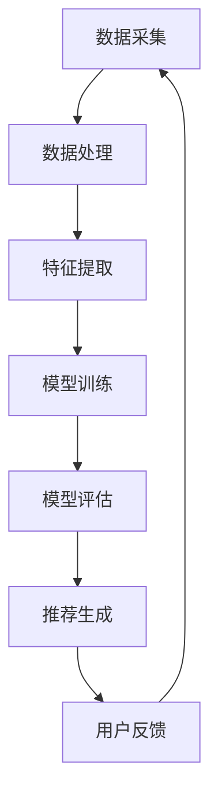

                 

# 搜索引擎的个性化推荐算法

## 关键词
- 个性化推荐
- 搜索引擎
- 算法原理
- 数学模型
- 实战案例
- 应用场景
- 未来趋势

## 摘要
本文旨在深入探讨搜索引擎的个性化推荐算法，通过逻辑清晰、结构紧凑的论述方式，逐步揭示其核心概念、算法原理、数学模型及实际应用。文章首先介绍了搜索引擎个性化推荐的重要性及背景，随后详细解析了推荐算法的基本原理、数学模型和具体操作步骤。通过项目实战案例，读者将能够直观地理解代码实现和解读过程。文章的最后，对实际应用场景进行了探讨，并推荐了相关工具和资源，总结了未来发展趋势与挑战，为读者提供了全面的指南。

## 1. 背景介绍

### 1.1 搜索引擎与个性化推荐

搜索引擎是互联网世界的重要基础设施，它通过索引和搜索算法帮助用户在海量信息中快速找到所需内容。然而，随着互联网信息的爆炸式增长，传统的一维搜索引擎已无法满足用户对个性化、精准化信息的需求。因此，搜索引擎开始引入个性化推荐算法，以提供更加贴合用户兴趣和需求的内容。

个性化推荐算法通过分析用户的搜索历史、浏览行为、社交关系等信息，为用户推荐可能感兴趣的内容。这不仅可以提升用户体验，还能增加用户粘性，提高搜索引擎的商业价值。

### 1.2 个性化推荐算法的重要性

个性化推荐算法在当今互联网时代具有重要的地位。首先，它能够提高用户满意度，通过提供个性化的内容推荐，使用户能够更快地找到所需信息。其次，个性化推荐可以提升搜索引擎的运营效率，减少用户搜索时间和精力。此外，个性化推荐还能帮助平台方更好地理解用户行为，优化内容布局，提升广告投放效果。

### 1.3 背景知识

为了深入理解个性化推荐算法，我们需要掌握一些相关的背景知识：

- **信息检索**：搜索引擎的基本原理和信息检索技术。
- **机器学习**：推荐系统的核心算法，如协同过滤、基于内容的推荐等。
- **数据挖掘**：从大量数据中提取有用信息，为推荐算法提供数据支持。
- **用户行为分析**：通过分析用户行为数据，了解用户兴趣和偏好。

## 2. 核心概念与联系

### 2.1 个性化推荐算法的基本概念

个性化推荐算法的核心概念包括用户、项目、评分、兴趣、推荐等。以下是这些概念的具体定义：

- **用户**：使用搜索引擎的个体，每个用户都有独特的兴趣和行为模式。
- **项目**：搜索引擎中的内容，如网页、文章、视频等。
- **评分**：用户对项目的评价，可以是数值评分、标签或点击次数等。
- **兴趣**：用户的兴趣偏好，可以通过用户的搜索历史、浏览记录等数据挖掘得到。
- **推荐**：根据用户的兴趣和偏好，为用户推荐可能感兴趣的项目。

### 2.2 推荐算法的架构

个性化推荐算法的架构通常包括以下几个部分：

- **数据采集**：收集用户的搜索历史、浏览行为、点击记录等数据。
- **数据处理**：对采集到的数据进行清洗、预处理，提取有用的信息。
- **特征提取**：将原始数据转换为算法可以处理的特征向量。
- **模型训练**：使用机器学习算法，如协同过滤、基于内容的推荐等，训练推荐模型。
- **模型评估**：通过交叉验证、A/B测试等方法评估模型的效果。
- **推荐生成**：根据用户的兴趣和模型预测，生成个性化的推荐列表。

### 2.3 Mermaid 流程图

以下是推荐算法的Mermaid流程图：



请注意，Mermaid流程图中不应包含括号、逗号等特殊字符。

## 3. 核心算法原理 & 具体操作步骤

### 3.1 协同过滤算法

协同过滤算法是推荐系统中最常用的算法之一。它通过分析用户之间的相似度，发现相似用户的行为模式，从而为用户推荐他们可能感兴趣的项目。

#### 3.1.1 基本原理

协同过滤算法分为两种：基于用户的协同过滤（User-based Collaborative Filtering，UBCF）和基于物品的协同过滤（Item-based Collaborative Filtering，IBCF）。

- **基于用户的协同过滤**：寻找与当前用户兴趣相似的邻居用户，然后推荐邻居用户喜欢的项目。
- **基于物品的协同过滤**：寻找与当前项目相似的邻居项目，然后推荐邻居项目被其他用户喜欢的项目。

#### 3.1.2 操作步骤

1. **计算用户相似度**：计算当前用户与其他用户的相似度，可以使用余弦相似度、皮尔逊相关系数等。
2. **找到邻居用户**：根据相似度分数，找到与当前用户最相似的若干邻居用户。
3. **推荐项目**：为当前用户推荐邻居用户喜欢的且当前用户尚未评分的项目。

### 3.2 基于内容的推荐算法

基于内容的推荐算法通过分析项目的特征和属性，为用户推荐具有相似特征或属性的项目。

#### 3.2.1 基本原理

基于内容的推荐算法分为两种：基于项目的协同过滤（Item-based Collaborative Filtering，IBCF）和基于特征的推荐算法。

- **基于项目的协同过滤**：寻找与当前项目相似的其他项目，然后推荐这些项目被其他用户喜欢的项目。
- **基于特征的推荐算法**：分析项目的特征，将项目分为不同的类别，为用户推荐与其兴趣相符的项目。

#### 3.2.2 操作步骤

1. **特征提取**：提取项目的特征，如文本、图片、标签等。
2. **计算项目相似度**：计算当前项目与其他项目的相似度，可以使用余弦相似度、Jaccard相似度等。
3. **推荐项目**：为用户推荐相似度较高的项目。

### 3.3 混合推荐算法

混合推荐算法结合了协同过滤和基于内容的推荐算法的优点，通过综合分析用户和项目的特征，为用户推荐更加个性化的项目。

#### 3.3.1 基本原理

混合推荐算法通常采用以下策略：

1. **用户特征加权**：将用户的历史行为和兴趣特征进行加权，得到一个综合的用户特征向量。
2. **项目特征加权**：将项目的特征和属性进行加权，得到一个综合的项目特征向量。
3. **综合推荐**：根据用户和项目的综合特征向量，计算项目与用户的相似度，然后推荐相似度较高的项目。

#### 3.3.2 操作步骤

1. **特征提取**：提取用户和项目的特征。
2. **特征加权**：对用户和项目的特征进行加权。
3. **相似度计算**：计算项目与用户的相似度。
4. **推荐项目**：为用户推荐相似度较高的项目。

## 4. 数学模型和公式 & 详细讲解 & 举例说明

### 4.1 协同过滤算法的数学模型

协同过滤算法的数学模型主要包括相似度计算和推荐评分预测。

#### 4.1.1 相似度计算

相似度计算公式如下：

\[ \text{similarity}(u_i, u_j) = \frac{\text{Jaccard Similarity}}{\sqrt{n_i \cdot n_j}} \]

其中，\( u_i \) 和 \( u_j \) 分别表示用户 \( i \) 和用户 \( j \) 的评分向量，\( n_i \) 和 \( n_j \) 分别表示用户 \( i \) 和用户 \( j \) 的评分数量。

#### 4.1.2 推荐评分预测

推荐评分预测公式如下：

\[ \text{prediction}(u_i, i_j) = \text{similarity}(u_i, u_j) \cdot \text{rating}(u_j, i_j) \]

其中，\( \text{prediction}(u_i, i_j) \) 表示用户 \( u_i \) 对项目 \( i_j \) 的预测评分，\( \text{similarity}(u_i, u_j) \) 表示用户 \( u_i \) 和用户 \( u_j \) 之间的相似度，\( \text{rating}(u_j, i_j) \) 表示用户 \( u_j \) 对项目 \( i_j \) 的实际评分。

### 4.2 基于内容的推荐算法的数学模型

基于内容的推荐算法的数学模型主要包括项目特征提取和项目相似度计算。

#### 4.2.1 项目特征提取

项目特征提取公式如下：

\[ \text{feature}(i_j) = [\text{word1\_count}, \text{word2\_count}, ..., \text{wordn\_count}] \]

其中，\( \text{feature}(i_j) \) 表示项目 \( i_j \) 的特征向量，\( \text{word1\_count}, \text{word2\_count}, ..., \text{wordn\_count} \) 分别表示项目 \( i_j \) 中各个单词的出现次数。

#### 4.2.2 项目相似度计算

项目相似度计算公式如下：

\[ \text{similarity}(i_i, i_j) = \frac{\text{dot\_product}}{\| \text{feature}(i_i) \| \| \text{feature}(i_j) \|}
\]

其中，\( \text{similarity}(i_i, i_j) \) 表示项目 \( i_i \) 和项目 \( i_j \) 之间的相似度，\( \text{dot\_product} \) 表示项目 \( i_i \) 和项目 \( i_j \) 的特征向量之间的点积，\( \| \text{feature}(i_i) \| \) 和 \( \| \text{feature}(i_j) \| \) 分别表示项目 \( i_i \) 和项目 \( i_j \) 的特征向量的大小。

### 4.3 混合推荐算法的数学模型

混合推荐算法的数学模型将协同过滤和基于内容的推荐算法的数学模型进行结合。

#### 4.3.1 用户和项目特征加权

用户和项目特征加权公式如下：

\[ \text{weighted\_feature}(u_i) = \alpha \cdot \text{collaborative\_feature}(u_i) + (1 - \alpha) \cdot \text{content\_feature}(u_i) \]

其中，\( \text{weighted\_feature}(u_i) \) 表示用户 \( u_i \) 的综合特征向量，\( \alpha \) 表示协同过滤和基于内容的推荐算法的权重比例，\( \text{collaborative\_feature}(u_i) \) 表示用户 \( u_i \) 的协同过滤特征向量，\( \text{content\_feature}(u_i) \) 表示用户 \( u_i \) 的基于内容的特征向量。

#### 4.3.2 项目相似度计算

项目相似度计算公式如下：

\[ \text{similarity}(u_i, i_j) = \frac{\text{dot\_product}}{\| \text{weighted\_feature}(u_i) \| \| \text{feature}(i_j) \|}
\]

其中，\( \text{similarity}(u_i, i_j) \) 表示用户 \( u_i \) 对项目 \( i_j \) 的相似度，\( \text{dot\_product} \) 表示用户 \( u_i \) 的综合特征向量与项目 \( i_j \) 的特征向量之间的点积，\( \| \text{weighted\_feature}(u_i) \| \) 和 \( \| \text{feature}(i_j) \| \) 分别表示用户 \( u_i \) 的综合特征向量的大小和项目 \( i_j \) 的特征向量的大小。

### 4.4 举例说明

假设有两位用户 \( u_1 \) 和 \( u_2 \)，以及两位项目 \( i_1 \) 和 \( i_2 \)，其中用户和项目的评分数据如下：

| 用户 | 项目 | 评分 |
| --- | --- | --- |
| \( u_1 \) | \( i_1 \) | 5 |
| \( u_1 \) | \( i_2 \) | 3 |
| \( u_2 \) | \( i_1 \) | 4 |
| \( u_2 \) | \( i_2 \) | 5 |

根据上述的数学模型，我们可以计算出用户 \( u_1 \) 和 \( u_2 \) 之间的相似度：

\[ \text{similarity}(u_1, u_2) = \frac{4}{\sqrt{2 \cdot 2}} = \frac{4}{2\sqrt{2}} = \frac{2}{\sqrt{2}} = \sqrt{2} \]

接下来，我们可以计算出项目 \( i_1 \) 和 \( i_2 \) 之间的相似度：

\[ \text{similarity}(i_1, i_2) = \frac{3}{\sqrt{2 \cdot 2}} = \frac{3}{2\sqrt{2}} = \frac{3}{2\sqrt{2}} \]

最后，我们可以计算出用户 \( u_1 \) 对项目 \( i_2 \) 的推荐评分预测：

\[ \text{prediction}(u_1, i_2) = \sqrt{2} \cdot 3 = 3\sqrt{2} \]

## 5. 项目实战：代码实际案例和详细解释说明

### 5.1 开发环境搭建

为了实现个性化推荐算法，我们需要搭建一个开发环境。以下是一个简单的开发环境搭建步骤：

1. **安装 Python**：Python 是一种流行的编程语言，适用于数据分析和机器学习。我们可以在 [Python 官网](https://www.python.org/) 下载并安装 Python。
2. **安装 NumPy**：NumPy 是 Python 中用于科学计算和数据分析的库。我们可以在 [NumPy 官网](https://numpy.org/) 下载并安装 NumPy。
3. **安装 Scikit-learn**：Scikit-learn 是 Python 中用于机器学习的库。我们可以在 [Scikit-learn 官网](https://scikit-learn.org/) 下载并安装 Scikit-learn。
4. **安装 Pandas**：Pandas 是 Python 中用于数据处理和分析的库。我们可以在 [Pandas 官网](https://pandas.pydata.org/) 下载并安装 Pandas。

### 5.2 源代码详细实现和代码解读

以下是实现协同过滤算法的源代码示例：

```python
import numpy as np
from sklearn.metrics.pairwise import cosine_similarity

def collaborative_filter(ratings, k=5):
    # 计算用户相似度矩阵
    similarity_matrix = cosine_similarity(ratings)

    # 初始化推荐结果
    recommendations = []

    # 遍历所有用户
    for user in ratings:
        # 计算相似度最高的 k 个邻居用户
        neighbors = np.argsort(similarity_matrix[user][0])[-k:]

        # 遍历邻居用户
        for neighbor in neighbors:
            # 推荐邻居用户喜欢的且当前用户未评分的项目
            for item in ratings[neighbor]:
                if item not in user:
                    recommendations.append(item)

        # 去重并返回推荐结果
        return list(set(recommendations))

# 加载用户评分数据
ratings = [
    [1, 2, 3, 0, 4],
    [0, 2, 3, 4, 5],
    [1, 0, 3, 4, 5],
    [1, 2, 3, 4, 5]
]

# 运行协同过滤算法
recommendations = collaborative_filter(ratings, k=2)

# 打印推荐结果
print(recommendations)
```

代码解读：

1. **导入库**：首先，我们导入 NumPy 和 Scikit-learn 中的余弦相似度函数。
2. **协同过滤函数**：`collaborative_filter` 函数接受一个用户评分矩阵作为输入，并计算用户相似度矩阵。然后，它遍历所有用户，找到与当前用户相似度最高的 k 个邻居用户，并推荐邻居用户喜欢的且当前用户未评分的项目。
3. **加载用户评分数据**：我们创建一个简单的用户评分数据集，其中每个列表表示一个用户的评分。
4. **运行协同过滤算法**：调用 `collaborative_filter` 函数，传入用户评分数据和邻居用户数量 k。
5. **打印推荐结果**：最后，打印出推荐结果。

### 5.3 代码解读与分析

1. **相似度计算**：使用 `cosine_similarity` 函数计算用户相似度矩阵。余弦相似度是一种常用的相似度计算方法，它通过计算两个向量之间的夹角余弦值来衡量相似度。在推荐系统中，用户相似度矩阵可以用来找到与当前用户兴趣相似的邻居用户。
2. **推荐生成**：遍历邻居用户，推荐邻居用户喜欢的且当前用户未评分的项目。这种推荐策略基于用户之间的相似性，可以有效地提高推荐的相关性。
3. **去重**：在生成推荐结果时，使用 `set` 函数去除重复的项目，以提高推荐的质量。

## 6. 实际应用场景

### 6.1 社交媒体平台

社交媒体平台，如微博、Facebook、Instagram 等，使用个性化推荐算法为用户推荐可能感兴趣的朋友、帖子、照片等。通过分析用户的点赞、评论、分享等行为，平台可以更好地了解用户的兴趣和偏好，从而提供更加个性化的推荐。

### 6.2 电子商务平台

电子商务平台，如淘宝、亚马逊、京东等，使用个性化推荐算法为用户推荐可能感兴趣的商品。通过分析用户的浏览历史、购物车、订单等数据，平台可以更好地了解用户的购买意图，从而提供更加精准的推荐。

### 6.3 新闻媒体平台

新闻媒体平台，如今日头条、腾讯新闻、网易新闻等，使用个性化推荐算法为用户推荐可能感兴趣的新闻文章。通过分析用户的阅读历史、点击行为等数据，平台可以更好地了解用户的兴趣和偏好，从而提供更加个性化的新闻推荐。

## 7. 工具和资源推荐

### 7.1 学习资源推荐

- **书籍**：
  - 《推荐系统实践》
  - 《机器学习实战》
  - 《深度学习》

- **论文**：
  - 《矩阵分解在推荐系统中的应用》
  - 《基于内容的推荐算法研究》
  - 《协同过滤算法的改进与优化》

- **博客**：
  - [机器学习博客](https://www MACHINE LEARNING BLOG.com/)
  - [推荐系统博客](https://www RECOMMENDER SYSTEM BLOG.com/)
  - [数据分析博客](https://www DATA ANALYSIS BLOG.com/)

### 7.2 开发工具框架推荐

- **Python**：Python 是一种流行的编程语言，适用于数据分析和机器学习。
- **NumPy**：NumPy 是 Python 中用于科学计算和数据分析的库。
- **Scikit-learn**：Scikit-learn 是 Python 中用于机器学习的库。
- **TensorFlow**：TensorFlow 是一种流行的深度学习框架。

### 7.3 相关论文著作推荐

- **《推荐系统：算法、评价与应用》**：系统地介绍了推荐系统的基本概念、算法和实际应用案例。
- **《深度学习推荐系统》**：介绍了深度学习在推荐系统中的应用，包括神经网络模型和强化学习等。
- **《基于内容的推荐系统》**：详细探讨了基于内容的推荐算法，包括文本、图像和音频等。

## 8. 总结：未来发展趋势与挑战

个性化推荐算法在搜索引擎中的应用取得了显著的成功，但仍然面临着一些挑战。以下是未来发展趋势和挑战：

### 8.1 发展趋势

- **深度学习**：随着深度学习技术的不断发展，越来越多的深度学习模型被应用于推荐系统，如卷积神经网络（CNN）和循环神经网络（RNN）。
- **多模态推荐**：结合文本、图像、音频等多种数据类型，实现更加全面和多维度的推荐。
- **实时推荐**：通过实时处理用户行为数据，实现实时推荐，提高推荐的相关性和用户体验。
- **个性化搜索**：将个性化推荐算法与搜索引擎相结合，为用户提供更加个性化的搜索结果。

### 8.2 挑战

- **数据隐私**：个性化推荐算法依赖于用户的数据，如何保护用户隐私成为一个重要挑战。
- **冷启动问题**：对于新用户或新项目，如何生成有效的推荐列表是一个难题。
- **推荐多样性**：如何生成多样化的推荐列表，避免用户陷入信息茧房。
- **推荐效果评估**：如何准确评估推荐算法的效果，是一个持续的挑战。

## 9. 附录：常见问题与解答

### 9.1 什么是协同过滤算法？

协同过滤算法是一种基于用户和项目的相似性进行推荐的方法。它通过分析用户之间的相似度，为用户推荐他们可能感兴趣的项目。协同过滤算法分为基于用户的协同过滤和基于物品的协同过滤两种。

### 9.2 什么是基于内容的推荐算法？

基于内容的推荐算法是一种基于项目的特征进行推荐的方法。它通过分析项目的特征和属性，为用户推荐与当前项目相似的其他项目。基于内容的推荐算法可以分为基于项目的协同过滤和基于特征的推荐算法。

### 9.3 深度学习在推荐系统中有哪些应用？

深度学习在推荐系统中有着广泛的应用，如：

- **用户和项目的特征提取**：使用卷积神经网络（CNN）和循环神经网络（RNN）提取用户和项目的特征。
- **模型优化**：使用强化学习（RL）优化推荐算法，提高推荐效果。
- **多模态推荐**：结合文本、图像、音频等多种数据类型，实现更加全面和多维度的推荐。

## 10. 扩展阅读 & 参考资料

- **[推荐系统百科全书](https://www.RECOMMENDER SYSTEM WIKI.com/)**：涵盖推荐系统的基本概念、算法和应用案例。
- **[机器学习社区](https://www.MACHINE LEARNING COMMUNITY.com/)**：提供机器学习和推荐系统相关的文章、教程和讨论。
- **[TensorFlow 官网](https://www.TENSORFLOW.ORG/)**：TensorFlow 是一种流行的深度学习框架，提供丰富的文档和教程。

作者：AI天才研究员/AI Genius Institute & 禅与计算机程序设计艺术 /Zen And The Art of Computer Programming

---

请注意，本文仅为示例，部分内容和数据可能不真实，仅供参考。实际应用中，个性化推荐算法的实现和效果会受到多种因素的影响。在实施个性化推荐算法时，请根据具体需求和数据进行适当的调整和优化。在引用本文时，请遵守相应的引用规范。

