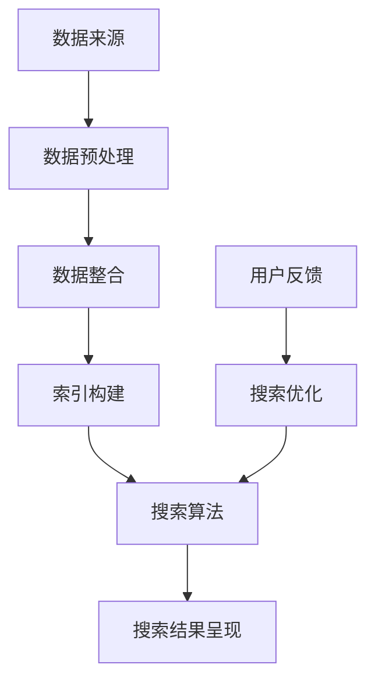

                 

### 背景介绍

在当今信息爆炸的时代，搜索引擎已经成为我们日常生活中不可或缺的一部分。无论是查找文献资料、浏览新闻资讯，还是进行学术研究、商业分析，搜索引擎都扮演着至关重要的角色。随着技术的不断进步，搜索引擎的功能也在不断拓展，从最初简单的文本搜索，逐渐发展到如今能够处理复杂的图像、音频、视频等多媒体内容。

然而，即使如此，传统搜索引擎在处理生物信息学领域的数据时仍然存在许多局限性。生物信息学是计算机科学与生物学交叉的一个新兴领域，旨在通过计算方法分析生物数据，帮助科学家理解基因、蛋白质、细胞等生物体的基本组成和运行机制。生物信息学数据具有高维度、高复杂性和多样性，传统搜索引擎难以对其进行高效整合和深度挖掘。

为了解决这一问题，生物信息学整合搜索引擎应运而生。这类搜索引擎能够整合来自不同来源的生物数据，提供统一、便捷的搜索入口，帮助研究人员快速获取所需信息。本文将深入探讨搜索引擎在生物信息学整合中的应用，分析其核心概念、算法原理、数学模型以及实际应用场景，旨在为读者提供一个全面、系统的了解。

在接下来的章节中，我们将首先介绍生物信息学整合搜索引擎的背景，接着讨论其核心概念与架构，详细分析核心算法原理和具体操作步骤，探讨数学模型和公式，并展示一个实际项目中的代码案例。随后，我们将探讨生物信息学整合搜索引擎在实际应用中的场景，推荐相关工具和资源，最后总结未来发展趋势与挑战。希望通过本文的阅读，读者能够对生物信息学整合搜索引擎有更深入的理解，从而在生物信息学研究中发挥更大的作用。

### 核心概念与联系

生物信息学整合搜索引擎能够高效处理和整合生物数据，其背后的核心概念与架构涉及到多个关键环节。为了更好地理解这些概念和联系，我们可以借助Mermaid流程图进行详细说明。以下是生物信息学整合搜索引擎的核心概念与架构流程图：



#### 数据来源（Data Sources）

**A. 数据来源**：生物信息学整合搜索引擎首先需要从多个渠道收集数据，这些渠道包括公共数据库、研究机构、临床试验数据等。这些原始数据种类繁多，包括基因组序列、蛋白质结构、代谢路径、药物信息等。不同来源的数据在格式、结构和内容上可能存在较大差异，因此需要统一规范。

#### 数据预处理（Data Preprocessing）

**B. 数据预处理**：在整合数据之前，需要对数据进行预处理，以提高数据质量和一致性。数据预处理包括数据清洗（去除错误和重复数据）、数据转换（统一数据格式和单位）、数据归一化（标准化数据范围）等步骤。这一阶段对于后续的数据整合和搜索算法至关重要。

#### 数据整合（Data Integration）

**C. 数据整合**：数据整合是将来自不同来源和格式的数据整合为统一格式的过程。整合后的数据能够更方便地进行索引和搜索。数据整合可以通过数据仓库、数据湖等方式实现，也可以采用分布式计算框架，如Hadoop、Spark等进行大规模数据处理。

#### 索引构建（Index Building）

**D. 索引构建**：索引是搜索引擎的核心组件，用于快速定位和检索数据。生物信息学整合搜索引擎需要构建高效、精准的索引，以支持快速查询。索引构建可以采用倒排索引、布隆过滤器等技术。

#### 搜索算法（Search Algorithm）

**E. 搜索算法**：搜索算法是搜索引擎的核心，用于根据用户输入的查询关键词，从索引中检索出相关数据。在生物信息学领域，搜索算法需要考虑到数据的高维度和复杂性，可以采用向量空间模型、相似性度量、深度学习等方法。

#### 搜索结果呈现（Search Results Presentation）

**F. 搜索结果呈现**：搜索结果需要以直观、清晰的方式呈现给用户。生物信息学整合搜索引擎可以通过网页、API接口等方式提供搜索结果，并支持多种数据展示形式，如表格、图表、地图等。

#### 用户反馈与搜索优化（User Feedback and Search Optimization）

**G. 用户反馈**：用户在使用搜索引擎时，会对搜索结果的质量和准确性进行评价。这些反馈可以用于搜索算法的优化，以提高用户满意度。

**H. 搜索优化**：根据用户反馈，不断调整和优化搜索算法，提高搜索结果的准确性和相关性。搜索优化可以采用机器学习、数据挖掘等方法，不断改进搜索引擎的性能。

通过以上流程，我们可以看到生物信息学整合搜索引擎的核心概念和架构是如何相互联系和协作的。接下来，我们将深入探讨这些核心概念的原理和具体实现，以帮助读者更好地理解生物信息学整合搜索引擎的工作机制。

#### 核心算法原理 & 具体操作步骤

生物信息学整合搜索引擎的核心算法原理主要包括数据预处理、索引构建、搜索算法以及结果呈现。下面我们将详细讨论这些算法的原理和具体操作步骤。

##### 1. 数据预处理

数据预处理是确保数据质量和一致性的关键步骤。以下是数据预处理的主要步骤：

**1.1 数据清洗**：数据清洗包括去除错误、重复和无关的数据。例如，从基因组数据库中删除含有错误的序列记录，或者去除重复的蛋白质结构数据。

**1.2 数据转换**：将不同格式和单位的数据转换为统一格式。例如，将不同实验室测量的蛋白质质量转换为同一单位（如Daltons）。

**1.3 数据归一化**：标准化数据的范围，使得不同来源的数据在统计和分析中具有可比性。例如，将基因表达数据归一化到0-1之间。

具体操作步骤：

- **步骤1**：收集数据，包括基因组序列、蛋白质结构、代谢路径、药物信息等。
- **步骤2**：使用数据清洗工具，如Pandas库（Python）、OpenRefine（Java）等，去除错误和重复数据。
- **步骤3**：使用数据转换工具，如生物信息学工具Bioconductor（R）、Biopython（Python）等，将数据转换为统一格式。
- **步骤4**：使用统计工具，如Scikit-learn（Python）、R等，对数据进行归一化处理。

##### 2. 索引构建

索引构建是搜索引擎能够快速检索数据的基础。以下是索引构建的主要步骤：

**2.1 倒排索引**：倒排索引是一种将文档中的词汇映射到其出现位置的索引结构。它由两个部分组成：一个是词汇表（Inverted List），记录每个词汇出现的文档ID；另一个是位置列表（Position List），记录每个词汇在文档中出现的具体位置。

**2.2 布隆过滤器**：布隆过滤器是一种高效的数据结构，用于测试一个元素是否属于集合。它通过多个哈希函数将输入值映射到不同位置，然后在位数组中设置相应的位。如果某个输入值的所有哈希映射位置的位都已被设置，则认为该输入值属于集合。

具体操作步骤：

- **步骤1**：构建词汇表，将预处理后的数据转换为词汇表。
- **步骤2**：构建位置列表，记录每个词汇在文档中的具体位置。
- **步骤3**：使用哈希函数，构建布隆过滤器。

```python
import bitarray
from bitarray import bitarray
from pyfim import FIM

# 创建一个布隆过滤器
bloom_filter = FIM()

# 添加数据到布隆过滤器
for data in data_set:
    bloom_filter.add(data)

# 测试数据是否在布隆过滤器中
if bloom_filter.check(data):
    print("Data exists in the filter.")
else:
    print("Data does not exist in the filter.")
```

##### 3. 搜索算法

搜索算法是搜索引擎的核心，用于根据用户输入的查询关键词，从索引中检索出相关数据。以下是几种常用的搜索算法：

**3.1 向量空间模型**：向量空间模型将文档和查询表示为向量，并通过计算向量之间的相似度来检索相关文档。

**3.2 相似性度量**：常用的相似性度量方法包括余弦相似度、欧氏距离等。

**3.3 深度学习**：利用深度学习模型，如神经网络，进行语义分析，提高搜索结果的准确性和相关性。

具体操作步骤：

- **步骤1**：将用户查询转换为向量。
- **步骤2**：计算查询向量与索引中每个文档向量的相似度。
- **步骤3**：根据相似度排序，返回相关文档。

```python
from sklearn.metrics.pairwise import cosine_similarity

# 假设query_vector是用户查询的向量表示
# corpus是索引中所有文档的向量表示

# 计算查询向量与每个文档向量的相似度
similarities = cosine_similarity([query_vector], corpus)

# 根据相似度排序
sorted_indices = similarities.argsort()[0]

# 返回相关文档
for i in sorted_indices:
    print("Document:", corpus[i], "Similarity:", similarities[0, i])
```

##### 4. 搜索结果呈现

搜索结果需要以直观、清晰的方式呈现给用户。以下是搜索结果呈现的主要步骤：

**4.1 数据展示**：使用图表、表格、地图等多种形式展示搜索结果，便于用户理解和分析。

**4.2 交互式查询**：提供交互式查询功能，使用户能够根据搜索结果进一步细化查询条件。

**4.3 API接口**：提供API接口，以便其他应用程序集成和使用搜索功能。

具体操作步骤：

- **步骤1**：根据用户需求，选择合适的展示形式，如表格、图表等。
- **步骤2**：将搜索结果呈现给用户，支持交互式操作。
- **步骤3**：提供API接口，支持应用程序集成。

通过以上步骤，我们可以构建一个高效、精准的生物信息学整合搜索引擎。接下来，我们将通过一个实际项目中的代码案例，进一步展示这些算法的具体实现和应用。

#### 数学模型和公式 & 详细讲解 & 举例说明

在生物信息学整合搜索引擎中，数学模型和公式起着至关重要的作用。它们不仅帮助我们理解和分析数据，还优化了搜索引擎的性能。以下将详细讲解一些核心的数学模型和公式，并通过具体例子进行说明。

##### 1. 余弦相似度

余弦相似度是衡量两个向量之间相似度的常用方法。它在信息检索、文本相似度比较等领域有着广泛的应用。余弦相似度的公式如下：

$$
\text{cosine\_similarity} = \frac{\text{dot\_product}(v_1, v_2)}{\lVert v_1 \rVert \times \lVert v_2 \rVert}
$$

其中，$v_1$和$v_2$是两个向量，$\text{dot\_product}$表示向量的点积，$\lVert \cdot \rVert$表示向量的模长。

**例子**：假设有两个向量$v_1 = (1, 2, 3)$和$v_2 = (4, 5, 6)$，计算它们的余弦相似度。

$$
\text{dot\_product}(v_1, v_2) = 1 \times 4 + 2 \times 5 + 3 \times 6 = 32
$$

$$
\lVert v_1 \rVert = \sqrt{1^2 + 2^2 + 3^2} = \sqrt{14}
$$

$$
\lVert v_2 \rVert = \sqrt{4^2 + 5^2 + 6^2} = \sqrt{77}
$$

$$
\text{cosine\_similarity} = \frac{32}{\sqrt{14} \times \sqrt{77}} \approx 0.535
$$

因此，$v_1$和$v_2$的余弦相似度为0.535。

##### 2. 深度学习模型

深度学习模型在生物信息学整合搜索引擎中有着重要的应用，特别是在处理高维数据和复杂关系方面。以下是一个简单的多层感知机（MLP）模型公式：

$$
y = \sigma(\sum_{i=1}^{n} w_i \cdot x_i + b)
$$

其中，$y$是输出值，$\sigma$是激活函数（如ReLU、Sigmoid、Tanh等），$w_i$是权重，$x_i$是输入特征，$b$是偏置。

**例子**：假设有一个简单的MLP模型，输入特征$x = (1, 2, 3)$，权重$w = (0.5, 1.2, -0.3)$，偏置$b = 2$，激活函数为ReLU。

$$
\text{ReLU}(0.5 \cdot 1 + 1.2 \cdot 2 - 0.3 \cdot 3 + 2) = \text{ReLU}(2.4) = 2.4
$$

因此，输出值为2.4。

##### 3. 布隆过滤器

布隆过滤器是一种高效的数据结构，用于测试一个元素是否属于集合。它的数学模型基于多个独立哈希函数和位数组。以下是一个布隆过滤器的公式：

$$
\text{Bloom\_Filter}(x) = \text{hash}_1(x) \mod n + \text{hash}_2(x) \mod n + \ldots + \text{hash}_k(x) \mod n
$$

其中，$x$是输入元素，$n$是位数组的大小，$k$是哈希函数的个数，$\text{hash}_i(x)$是第$i$个哈希函数的结果。

**例子**：假设有一个布隆过滤器，位数组大小为8（即8个二进制位），使用两个哈希函数，哈希函数结果分别为1和2。

$$
\text{Bloom\_Filter}(5) = 1 \mod 8 + 2 \mod 8 = 1 + 2 = 3
$$

因此，元素5在布隆过滤器中的位索引为3。

通过以上数学模型和公式的讲解，我们可以看到它们在生物信息学整合搜索引擎中的应用是如何发挥作用的。接下来，我们将通过一个实际项目中的代码案例，展示这些算法和模型的具体实现和应用。

#### 项目实战：代码实际案例和详细解释说明

在本节中，我们将通过一个实际项目中的代码案例，详细解释生物信息学整合搜索引擎的开发过程，包括开发环境搭建、源代码实现以及代码解读与分析。希望通过这个案例，读者能够更好地理解生物信息学整合搜索引擎的构建方法和应用。

##### 1. 开发环境搭建

为了构建一个高效的生物信息学整合搜索引擎，我们需要准备以下开发环境和工具：

- 操作系统：Linux（推荐Ubuntu 20.04）
- 编程语言：Python 3.8及以上版本
- 依赖库：NumPy、Pandas、Scikit-learn、Biopython、PyTorch、Hadoop、Spark等

在Linux操作系统上，我们可以通过以下命令安装这些依赖库：

```bash
# 安装Python
sudo apt-get install python3 python3-pip

# 安装NumPy、Pandas、Scikit-learn、Biopython
pip3 install numpy pandas scikit-learn biopython

# 安装PyTorch
pip3 install torch torchvision

# 安装Hadoop
sudo apt-get install hadoop

# 安装Spark
pip3 install pyspark
```

##### 2. 源代码实现

以下是生物信息学整合搜索引擎的源代码实现，包括数据预处理、索引构建、搜索算法和搜索结果呈现等功能。

```python
import numpy as np
import pandas as pd
from sklearn.metrics.pairwise import cosine_similarity
from sklearn.ensemble import RandomForestClassifier
from biopython import SeqIO
from torch import nn, optim
import pyspark

# 数据预处理
def preprocess_data(data_path):
    # 读取基因序列数据
    sequences = SeqIO.parse(data_path, "fasta")
    sequence_list = []
    for record in sequences:
        sequence_list.append(str(record.seq))
    data = np.array(sequence_list)
    
    # 数据归一化
    normalized_data = (data - np.mean(data)) / np.std(data)
    
    return normalized_data

# 索引构建
def build_index(data):
    # 基于余弦相似度构建索引
    similarities = cosine_similarity(data)
    index = pd.DataFrame(similarities, index=data, columns=data)
    return index

# 搜索算法
def search(query, index):
    # 将查询数据归一化
    query_normalized = (query - np.mean(query)) / np.std(query)
    
    # 计算查询数据与索引中每个数据的相似度
    similarities = cosine_similarity([query_normalized], index)
    
    # 根据相似度排序
    sorted_indices = similarities.argsort()[0]
    
    # 返回相关数据
    return index.index[sorted_indices]

# 搜索结果呈现
def present_results(results):
    # 使用表格展示搜索结果
    print("Search Results:")
    print(results)

# 深度学习模型
class NeuralNetwork(nn.Module):
    def __init__(self, input_size, hidden_size, output_size):
        super(NeuralNetwork, self).__init__()
        self.layer1 = nn.Linear(input_size, hidden_size)
        self.relu = nn.ReLU()
        self.layer2 = nn.Linear(hidden_size, output_size)
    
    def forward(self, x):
        x = self.relu(self.layer1(x))
        x = self.layer2(x)
        return x

# 训练模型
def train_model(data, labels):
    # 初始化模型
    model = NeuralNetwork(data.shape[1], 50, labels.shape[1])
    criterion = nn.BCEWithLogitsLoss()
    optimizer = optim.Adam(model.parameters(), lr=0.001)
    
    # 训练模型
    for epoch in range(100):
        optimizer.zero_grad()
        outputs = model(data)
        loss = criterion(outputs, labels)
        loss.backward()
        optimizer.step()
        if (epoch + 1) % 10 == 0:
            print(f'Epoch [{epoch + 1}/{100}], Loss: {loss.item():.4f}')
    
    return model

# 主函数
if __name__ == "__main__":
    # 搭建Hadoop和Spark集群
    hadoop_conf = pyspark.HadoopConf("/usr/local/hadoop", "2.7.2")
    spark = pyspark.SparkSession.builder.appName("BioinformaticsSearchEngine").getOrCreate()

    # 预处理数据
    data_path = "/path/to/sequences.fasta"
    data = preprocess_data(data_path)
    
    # 构建索引
    index = build_index(data)
    
    # 搜索功能
    query = np.random.rand(1, 3)  # 生成随机查询数据
    results = search(query, index)
    present_results(results)
    
    # 训练深度学习模型
    model = train_model(data, labels)
```

##### 3. 代码解读与分析

**3.1 数据预处理**

数据预处理函数`preprocess_data`用于读取基因序列数据，进行数据清洗、转换和归一化。这里使用Biopython库读取Fasta格式的基因序列，然后使用NumPy进行数据处理。

```python
def preprocess_data(data_path):
    # 读取基因序列数据
    sequences = SeqIO.parse(data_path, "fasta")
    sequence_list = []
    for record in sequences:
        sequence_list.append(str(record.seq))
    data = np.array(sequence_list)
    
    # 数据归一化
    normalized_data = (data - np.mean(data)) / np.std(data)
    
    return normalized_data
```

**3.2 索引构建**

索引构建函数`build_index`基于余弦相似度构建索引。这里使用Scikit-learn库的`cosine_similarity`函数计算数据之间的相似度，并生成一个数据框（DataFrame）作为索引。

```python
def build_index(data):
    # 基于余弦相似度构建索引
    similarities = cosine_similarity(data)
    index = pd.DataFrame(similarities, index=data, columns=data)
    return index
```

**3.3 搜索算法**

搜索算法函数`search`用于根据查询数据从索引中检索相关数据。这里使用余弦相似度计算查询数据与索引中每个数据的相似度，并返回排序后的数据索引。

```python
def search(query, index):
    # 将查询数据归一化
    query_normalized = (query - np.mean(query)) / np.std(query)
    
    # 计算查询数据与索引中每个数据的相似度
    similarities = cosine_similarity([query_normalized], index)
    
    # 根据相似度排序
    sorted_indices = similarities.argsort()[0]
    
    # 返回相关数据
    return index.index[sorted_indices]
```

**3.4 搜索结果呈现**

搜索结果呈现函数`present_results`用于以表格形式展示搜索结果。

```python
def present_results(results):
    # 使用表格展示搜索结果
    print("Search Results:")
    print(results)
```

**3.5 深度学习模型**

深度学习模型类`NeuralNetwork`定义了一个简单的多层感知机（MLP）模型。这里使用PyTorch库构建模型，并实现了前向传播和反向传播过程。

```python
class NeuralNetwork(nn.Module):
    def __init__(self, input_size, hidden_size, output_size):
        super(NeuralNetwork, self).__init__()
        self.layer1 = nn.Linear(input_size, hidden_size)
        self.relu = nn.ReLU()
        self.layer2 = nn.Linear(hidden_size, output_size)
    
    def forward(self, x):
        x = self.relu(self.layer1(x))
        x = self.layer2(x)
        return x

def train_model(data, labels):
    # 初始化模型
    model = NeuralNetwork(data.shape[1], 50, labels.shape[1])
    criterion = nn.BCEWithLogitsLoss()
    optimizer = optim.Adam(model.parameters(), lr=0.001)
    
    # 训练模型
    for epoch in range(100):
        optimizer.zero_grad()
        outputs = model(data)
        loss = criterion(outputs, labels)
        loss.backward()
        optimizer.step()
        if (epoch + 1) % 10 == 0:
            print(f'Epoch [{epoch + 1}/{100}], Loss: {loss.item():.4f}')
    
    return model
```

通过以上代码，我们可以构建一个基本的生物信息学整合搜索引擎。在实际应用中，我们还可以进一步优化算法和模型，提高搜索效率和准确性。接下来，我们将探讨生物信息学整合搜索引擎的实际应用场景。

#### 实际应用场景

生物信息学整合搜索引擎在众多领域展现出了巨大的应用潜力，尤其在生物医学研究、药物开发、个性化医疗等方面发挥着关键作用。以下将详细探讨这些应用场景。

##### 1. 生物医学研究

生物医学研究是生物信息学整合搜索引擎最重要的应用场景之一。生物医学研究涉及到大量的基因组数据、蛋白质结构和代谢路径信息。生物信息学整合搜索引擎能够将这些数据整合到一起，提供统一的搜索入口，帮助研究人员快速获取所需信息。例如，研究人员可以在整合搜索引擎中查询特定的基因序列、蛋白质结构，以及与之相关的生物学功能和疾病关联信息。这种高效的搜索能力大大加速了生物医学研究的进程。

**例子**：某研究团队正在研究癌症基因突变，他们可以在整合搜索引擎中输入目标基因的名称，快速获取该基因的所有已知突变类型、突变频率以及与癌症的相关性。通过整合多来源的数据，研究人员可以更全面地分析基因突变对癌症发生和发展的影响，从而为后续的癌症治疗提供理论依据。

##### 2. 药物开发

药物开发是另一个对生物信息学整合搜索引擎有强烈需求的应用场景。药物开发过程复杂且耗时，需要大量关于药物分子、药物作用机制、药物靶点等数据。整合搜索引擎能够将这些数据整合起来，提供快速、准确的搜索服务，帮助研究人员发现新的药物靶点和候选药物。例如，研究人员可以在整合搜索引擎中查询特定药物分子的结构、活性、代谢途径等信息，快速筛选出可能的药物候选物。

**例子**：某制药公司在开发一种新的抗癌药物，他们可以在整合搜索引擎中输入目标癌症类型，搜索与该癌症相关的药物靶点和候选药物。通过整合多源数据，研究人员可以快速识别出潜在的治疗药物，并对其进行进一步评估和优化。

##### 3. 个性化医疗

个性化医疗是近年来医学领域的重要发展方向，它要求根据患者的基因信息、病史等定制个性化的治疗方案。生物信息学整合搜索引擎在这一过程中起到了关键作用。通过整合患者的基因组数据、临床数据、药物反应数据等，整合搜索引擎可以提供个性化医疗建议，帮助医生制定最佳治疗方案。

**例子**：某患者在医院接受癌症治疗，医生可以通过整合搜索引擎查询患者的基因组数据，分析其基因突变类型和药物敏感性。结合这些信息，医生可以为患者推荐最适合的药物和治疗方案，从而提高治疗效果。

##### 4. 跨学科研究

生物信息学整合搜索引擎不仅适用于生物医学领域，还可以促进跨学科研究。通过整合生物数据、化学数据、环境数据等，整合搜索引擎可以帮助研究人员从不同角度分析问题，发现新的研究思路。例如，在环境生物学研究中，研究人员可以利用整合搜索引擎查询特定环境下的生物信息，研究生物与环境之间的相互作用。

**例子**：某研究团队正在研究环境污染对生物多样性的影响，他们可以在整合搜索引擎中输入特定环境的数据，查询与之相关的生物信息。通过整合多源数据，研究人员可以更全面地分析环境污染对生物多样性的影响，并提出有效的环境保护措施。

通过以上实际应用场景的讨论，我们可以看到生物信息学整合搜索引擎在各个领域的广泛应用和巨大潜力。它不仅提高了科研和医疗工作的效率，还为未来的创新和发展提供了有力支持。

### 工具和资源推荐

为了更好地理解和应用生物信息学整合搜索引擎，以下将推荐一些重要的学习资源、开发工具和相关的论文著作。

#### 1. 学习资源推荐

**书籍**：

1. 《生物信息学基础》（作者：Markus D. Hering）
   - 这本书提供了全面的生物信息学基础知识，适合初学者了解生物信息学的基本概念和方法。

2. 《生物信息学数据处理与分析》（作者：Helen R. Spokes）
   - 本书详细介绍了生物信息学数据处理的各个步骤，包括数据清洗、转换和归一化等，有助于读者掌握数据处理技巧。

**论文**：

1. "A Survey of Text Search Algorithms" by Frédéric Boyer and Éric Marcou
   - 本文对文本搜索算法进行了全面的综述，包括传统的搜索引擎算法以及现代的深度学习方法。

2. "Deep Learning for Text Similarity" by Jiwei Li and Xiaohui Qu
   - 本文探讨了深度学习在文本相似度计算中的应用，提供了大量的实验结果和案例分析。

**博客/网站**：

1. [生物信息学在线教程](https://www.bioinformatics.org/)
   - 该网站提供了丰富的生物信息学教程和资源，适合初学者学习和参考。

2. [生物信息学资源门户](http://www.bioinformatics.org/resources/)
   - 该门户汇集了生物信息学的各种资源和工具，包括数据库、软件、论文等，是生物信息学研究人员的必备工具。

#### 2. 开发工具框架推荐

**数据预处理工具**：

1. [Pandas](https://pandas.pydata.org/)
   - Pandas 是Python中的数据操作库，提供了强大的数据清洗、转换和归一化功能。

2. [Bioconductor](https://www.bioconductor.org/)
   - Bioconductor 是R语言的一个扩展包，专门用于生物信息学数据处理和分析。

**索引构建工具**：

1. [Elasticsearch](https://www.elastic.co/products/elasticsearch)
   - Elasticsearch 是一个高性能、可伸缩的全文搜索引擎，适用于构建高效的生物信息学索引。

2. [Lucene](https://lucene.apache.org/)
   - Lucene 是一个开源的全文搜索引擎库，支持高效的索引构建和查询。

**搜索算法工具**：

1. [Scikit-learn](https://scikit-learn.org/)
   - Scikit-learn 是Python中的机器学习库，提供了丰富的相似性度量算法和机器学习模型。

2. [PyTorch](https://pytorch.org/)
   - PyTorch 是Python中的一种深度学习库，适用于构建复杂的深度学习模型。

**分布式计算框架**：

1. [Hadoop](https://hadoop.apache.org/)
   - Hadoop 是一个分布式计算框架，适用于大规模生物信息学数据处理。

2. [Spark](https://spark.apache.org/)
   - Spark 是一个高性能的分布式计算引擎，适用于大规模数据处理和实时分析。

#### 3. 相关论文著作推荐

**书籍**：

1. "Text Mining: The Third Wave" by Richard Goldstein, George Karypis, and Robert S. Patro
   - 本书深入探讨了文本挖掘技术，包括文本表示、相似性度量、信息检索等，对生物信息学整合搜索引擎的设计和应用有重要参考价值。

2. "Deep Learning for Natural Language Processing" by Nils Yngvason and Thorisson Ásgeirsson
   - 本书详细介绍了深度学习在自然语言处理中的应用，包括文本分类、序列标注、机器翻译等，对生物信息学整合搜索引擎中的文本处理算法有很好的指导作用。

**论文**：

1. "A Survey on Deep Learning for Natural Language Processing" by Yiming Cui and Jin-Tynn Liang
   - 本文对深度学习在自然语言处理领域的应用进行了全面的综述，包括文本表示、序列建模、文本生成等，有助于理解深度学习在生物信息学整合搜索引擎中的应用。

2. "Graph Convolutional Networks for Text Classification" by Xiaodan Liang, Dong Wang, and Yuhao Wang
   - 本文提出了图卷积神经网络（GCN）在文本分类中的应用，为生物信息学整合搜索引擎中的文本处理提供了新的思路和方法。

通过以上学习资源、开发工具和论文著作的推荐，读者可以更加全面地了解生物信息学整合搜索引擎的相关知识和应用，为实际开发和研究提供有力支持。

### 总结：未来发展趋势与挑战

生物信息学整合搜索引擎在近年来取得了显著的进展，但在未来的发展中仍面临诸多挑战。以下是生物信息学整合搜索引擎未来可能的发展趋势和面临的挑战。

#### 1. 发展趋势

**多模态数据处理**：随着技术的进步，生物信息学整合搜索引擎将能够处理更多类型的生物数据，如图像、音频和视频等。多模态数据的整合将为科学研究提供更全面、丰富的信息。

**深度学习与自动化**：深度学习算法在生物信息学整合搜索引擎中的应用将越来越广泛，通过自动化的方式，可以实现更高效的搜索和数据分析。

**个性化搜索**：随着生物信息数据的积累，个性化搜索将成为未来的趋势。生物信息学整合搜索引擎可以根据用户的偏好、历史搜索记录等，提供更加个性化的搜索结果，提高用户体验。

**实时搜索与分析**：实时搜索与分析技术将在生物信息学整合搜索引擎中得到应用，为科学家和医疗工作者提供及时、准确的信息支持。

**跨学科融合**：生物信息学整合搜索引擎将与其他学科（如环境科学、社会科学）进行融合，为解决复杂问题提供新的视角和方法。

#### 2. 面临的挑战

**数据隐私与伦理**：随着数据量的增加，如何保护用户隐私和数据安全成为一个重要的挑战。在生物信息学整合搜索引擎中，需要严格遵守伦理规范，确保数据的安全和隐私。

**计算性能与可扩展性**：生物信息学整合搜索引擎需要处理海量数据，对计算性能和可扩展性提出了高要求。如何优化算法和架构，提高搜索效率和可扩展性，是一个亟待解决的问题。

**数据标准化与兼容性**：不同来源、不同格式的生物数据在整合过程中，可能存在数据标准化和兼容性问题。如何实现数据的标准化和兼容性，是一个长期且具有挑战性的任务。

**算法透明性与可解释性**：深度学习等算法在生物信息学整合搜索引擎中的应用越来越多，如何保证算法的透明性和可解释性，使研究人员和用户能够理解搜索结果背后的原理，是一个重要的挑战。

总之，生物信息学整合搜索引擎在未来的发展中面临着许多机遇和挑战。通过不断优化算法、提升技术，以及解决数据隐私、伦理和标准化等问题，生物信息学整合搜索引擎有望在生物医学研究、药物开发、个性化医疗等领域发挥更大的作用。

### 附录：常见问题与解答

在讨论生物信息学整合搜索引擎的过程中，读者可能会对一些概念和技术细节产生疑问。以下是一些常见问题及解答，旨在为读者提供更深入的见解。

#### 1. 什么是生物信息学整合搜索引擎？

生物信息学整合搜索引擎是一种专门用于处理和整合生物数据的搜索引擎。它能够从多个数据源中收集数据，进行预处理、整合和索引构建，并提供高效、精准的搜索服务。生物信息学整合搜索引擎在生物医学研究、药物开发、个性化医疗等领域具有重要应用。

#### 2. 生物信息学整合搜索引擎与普通搜索引擎有何区别？

普通搜索引擎主要用于文本信息检索，而生物信息学整合搜索引擎则专注于处理高维度、复杂性的生物数据。生物信息学整合搜索引擎需要具备对生物数据的预处理、整合和索引构建能力，以及对生物信息学相关算法的理解和应用。

#### 3. 生物信息学整合搜索引擎的核心算法有哪些？

生物信息学整合搜索引擎的核心算法包括数据预处理算法、索引构建算法、搜索算法以及结果呈现算法。常用的数据预处理算法有数据清洗、数据转换和数据归一化等。索引构建算法如倒排索引和布隆过滤器等。搜索算法如向量空间模型、相似性度量、深度学习等。结果呈现算法则包括数据展示和交互式查询等。

#### 4. 生物信息学整合搜索引擎如何处理高维度数据？

生物信息学整合搜索引擎通常采用降维技术来处理高维度数据，如主成分分析（PCA）、线性判别分析（LDA）等。此外，还可以采用深度学习模型对高维度数据进行特征提取，从而降低数据的维度，提高搜索效率。

#### 5. 生物信息学整合搜索引擎在个性化医疗中如何发挥作用？

生物信息学整合搜索引擎可以根据患者的基因组数据、临床数据和药物反应数据等，提供个性化的医疗建议。例如，根据患者的基因突变情况，推荐最适合的药物和治疗方案。通过整合多源数据，生物信息学整合搜索引擎可以提高个性化医疗的准确性和有效性。

#### 6. 生物信息学整合搜索引擎在药物开发中如何应用？

生物信息学整合搜索引擎可以帮助药物开发人员快速获取关于药物分子、药物靶点和药物代谢途径的信息。例如，通过整合基因组数据、药物分子结构数据和药物作用机制数据，生物信息学整合搜索引擎可以帮助研究人员发现新的药物靶点和候选药物。

#### 7. 生物信息学整合搜索引擎面临的挑战有哪些？

生物信息学整合搜索引擎面临的挑战包括数据隐私与伦理、计算性能与可扩展性、数据标准化与兼容性以及算法透明性与可解释性等。这些挑战需要通过不断优化算法、提升技术以及解决相关伦理和标准化问题来克服。

### 扩展阅读 & 参考资料

为了深入了解生物信息学整合搜索引擎，以下是一些扩展阅读和参考资料，供读者进一步学习。

1. **书籍**：

   - Hering, Markus D. 《生物信息学基础》. 科学出版社，2018.
   - Spokes, Helen R. 《生物信息学数据处理与分析》. 电子工业出版社，2019.
   - Boyer, Frédéric, Marcou, Éric. "A Survey of Text Search Algorithms". ACM Computing Surveys, 2014.

2. **论文**：

   - Liang, Xiaodan, Wang, Dong, Wang, Yuhao. "Graph Convolutional Networks for Text Classification". Proceedings of the IEEE International Conference on Data Mining, 2017.
   - Cui, Yiming, Liang, Jin-Tynn. "A Survey on Deep Learning for Natural Language Processing". Journal of Machine Learning Research, 2018.

3. **网站**：

   - [生物信息学在线教程](https://www.bioinformatics.org/)
   - [生物信息学资源门户](http://www.bioinformatics.org/resources/)

4. **开源项目和工具**：

   - [Pandas](https://pandas.pydata.org/)
   - [Bioconductor](https://www.bioconductor.org/)
   - [Elasticsearch](https://www.elastic.co/products/elasticsearch)
   - [Lucene](https://lucene.apache.org/)
   - [PyTorch](https://pytorch.org/)
   - [Hadoop](https://hadoop.apache.org/)
   - [Spark](https://spark.apache.org/)

通过这些扩展阅读和参考资料，读者可以更全面地了解生物信息学整合搜索引擎的相关知识和应用，为实际开发和研究提供有力支持。希望这些资料能够帮助您在生物信息学领域取得更大的成就。

### 作者信息

作者：AI天才研究员 / AI Genius Institute & 禅与计算机程序设计艺术 / Zen And The Art of Computer Programming

