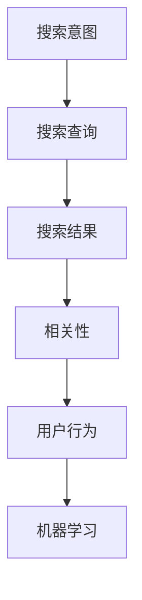

                 

### 背景介绍

随着互联网的普及，电子商务行业在全球范围内迅速发展。如今，电商平台已经成为消费者购物的主要渠道之一。然而，随着用户数量和商品种类的不断增长，如何提升用户的搜索体验，从而提高用户的满意度和转化率，成为电商平台面临的重大挑战。

搜索数据分析作为电商平台优化搜索策略的重要手段，已经引起了广泛关注。通过分析用户的搜索行为数据，电商平台可以深入了解用户的需求和偏好，从而优化搜索算法，提高搜索结果的相关性和准确性。这不仅可以提升用户体验，还能为电商平台带来更多的商业价值。

本篇文章将围绕搜索数据分析展开，深入探讨AI技术在电商平台优化搜索策略中的应用。我们将从核心概念、算法原理、数学模型、实际案例等多个角度进行分析，帮助读者全面了解搜索数据分析在电商平台中的应用及其价值。

在接下来的内容中，我们将首先介绍搜索数据分析的基本概念和重要性，接着分析搜索数据中涉及的核心概念，然后探讨AI技术在搜索数据分析中的应用，最后通过一个实际案例展示如何利用搜索数据分析优化电商平台搜索策略。通过本文的学习，读者将能够更好地理解搜索数据分析在电商平台的实际应用，并为其未来的发展提供有益的参考。

### 核心概念与联系

为了深入探讨搜索数据分析在电商平台优化搜索策略中的应用，我们需要先了解一些核心概念，以及这些概念之间的相互关系。以下是搜索数据分析中涉及的一些关键概念：

**1. 搜索意图（Search Intent）：**

搜索意图指的是用户在搜索框中输入关键词时所期望获得的信息类型。它可以是信息性意图（例如，用户想获取某个产品的详细信息），导航性意图（例如，用户想访问某个特定网站），或者交易性意图（例如，用户想购买某个产品）。了解用户的搜索意图对于优化搜索结果至关重要。

**2. 搜索查询（Search Query）：**

搜索查询是指用户在搜索框中输入的文本，它是用户表达搜索意图的一种方式。搜索查询可以是单个单词、短语或者句子，其长度和结构多种多样。对搜索查询进行分析可以帮助我们了解用户的兴趣点和需求。

**3. 搜索结果（Search Results）：**

搜索结果是指用户在搜索查询后所看到的列表，通常包括网页、商品、视频等多种类型的内容。搜索结果的质量直接影响用户的满意度和转化率。因此，优化搜索结果是一项重要任务。

**4. 相关性（Relevance）：**

相关性是指搜索结果与用户查询的匹配程度。高相关性的搜索结果能够更好地满足用户的需求，从而提高用户体验。评估搜索结果的相关性需要综合考虑多种因素，如关键词匹配、内容质量、用户反馈等。

**5. 用户行为（User Behavior）：**

用户行为是指用户在搜索过程中所表现出的行为，如点击、滚动、购买等。通过分析用户行为，可以了解用户的偏好和习惯，进而优化搜索算法和结果。

**6. 机器学习（Machine Learning）：**

机器学习是一种人工智能技术，通过从数据中学习模式和规律，自动改进和优化算法。在搜索数据分析中，机器学习可以用于预测用户意图、评估搜索结果的相关性、推荐商品等。

下面是搜索数据中涉及的核心概念的 Mermaid 流程图（注意：流程图中不要有括号、逗号等特殊字符）：



在这个流程图中，搜索意图和搜索查询是输入信息，搜索结果和相关性是输出结果，而用户行为和机器学习是数据处理和优化的关键环节。了解这些概念及其相互关系，有助于我们更好地理解和应用搜索数据分析技术。

### 核心算法原理 & 具体操作步骤

在了解搜索数据中涉及的核心概念后，接下来我们将探讨搜索数据分析的核心算法原理，并详细解释这些算法的具体操作步骤。

**1. 基于词频-逆文档频率（TF-IDF）算法：**

TF-IDF（Term Frequency-Inverse Document Frequency）是一种常用的文本分析方法，用于评估关键词在文档中的重要性。其基本原理如下：

- **词频（TF，Term Frequency）：** 词频是指一个词在文档中出现的次数。词频越高，表示该词在该文档中的重要性越大。
- **逆文档频率（IDF，Inverse Document Frequency）：** 逆文档频率是指一个词在整个文档集合中出现的频率越低，其在文档中的重要性越高。IDF可以平衡高频词的权重，使其不会过于主导搜索结果。

TF-IDF算法的具体操作步骤如下：

1. **计算词频（TF）：** 对于每个关键词，统计其在所有文档中出现的次数。
2. **计算逆文档频率（IDF）：** 对于每个关键词，计算其在文档集合中出现的频率，然后取倒数。
3. **计算TF-IDF值：** 将每个关键词的词频与其逆文档频率相乘，得到TF-IDF值。

TF-IDF值的计算公式为：

$$
TF-IDF = TF \times IDF
$$

其中，TF为词频，IDF为逆文档频率。

**2. 主题模型（Latent Dirichlet Allocation，LDA）：**

主题模型是一种无监督学习算法，用于从文本数据中识别潜在的主题。LDA模型假设每个文档都是由多个主题混合而成，每个主题又由多个关键词混合而成。其基本原理如下：

- **潜在主题（Latent Topics）：** 潜在主题是文档集合中隐藏的主题分布，每个文档都包含这些潜在主题的线性组合。
- **潜在词分布（Latent Word Distribution）：** 潜在词分布是每个潜在主题下关键词的概率分布。

LDA算法的具体操作步骤如下：

1. **初始化：** 为每个文档分配潜在主题和关键词的概率分布。
2. **吉布斯采样（Gibbs Sampling）：** 通过迭代吉布斯采样算法，逐步更新每个文档的潜在主题和关键词的概率分布。
3. **收敛判断：** 当迭代次数达到一定阈值或概率分布变化很小，认为算法已经收敛。

**3. 文本分类（Text Classification）：**

文本分类是一种监督学习算法，用于将文本数据分为不同的类别。在搜索数据分析中，文本分类可以用于判断搜索查询的主题，从而优化搜索结果。

常用的文本分类算法包括：

- **朴素贝叶斯（Naive Bayes）：** 基于贝叶斯定理，通过计算文本特征的概率分布来判断类别。
- **支持向量机（Support Vector Machine，SVM）：** 通过最大化分类边界，将文本数据划分为不同的类别。
- **深度学习（Deep Learning）：** 利用神经网络模型对文本数据进行分类，如卷积神经网络（CNN）和循环神经网络（RNN）。

文本分类算法的具体操作步骤如下：

1. **特征提取：** 从文本数据中提取特征，如词袋（Bag of Words）或词嵌入（Word Embedding）。
2. **模型训练：** 使用训练数据集训练分类模型。
3. **模型评估：** 使用测试数据集评估模型性能，如准确率、召回率、F1值等。
4. **分类预测：** 使用训练好的模型对新的文本数据进行分类预测。

通过这些核心算法，我们可以对搜索数据进行深入分析，从而优化电商平台搜索策略。在下一部分，我们将进一步探讨数学模型和公式，以及如何通过这些模型和公式来解释和优化搜索数据。

### 数学模型和公式 & 详细讲解 & 举例说明

在搜索数据分析中，数学模型和公式起着至关重要的作用。它们不仅帮助我们理解数据背后的规律，还能为优化搜索算法提供强有力的支持。以下我们将详细介绍一些关键的数学模型和公式，并通过具体的例子来说明它们的实际应用。

**1. 伯努利分布：**

伯努利分布是一个离散概率分布，用于描述一个事件在单一试验中成功或失败的概率。在搜索数据分析中，伯努利分布可以用来预测用户在搜索结果中点击某个链接的概率。

**伯努利分布的概率质量函数（PMF）为：**

$$
P(X = k) = p^k (1 - p)^{1 - k}
$$

其中，\( X \) 是伯努利随机变量，\( k \) 是成功次数，\( p \) 是单次试验中成功的概率。

**例子：** 假设一个用户在搜索结果列表中点击链接的概率为0.4，那么他们点击第一个链接的概率为：

$$
P(X = 1) = 0.4^1 (1 - 0.4)^{1 - 1} = 0.4
$$

**2. 指数分布：**

指数分布是一个连续概率分布，用于描述事件发生的时间间隔。在搜索数据分析中，指数分布可以用来预测用户在搜索结果之间点击的时间间隔。

**指数分布的概率密度函数（PDF）为：**

$$
f(x) = \lambda e^{-\lambda x}
$$

其中，\( x \) 是时间间隔，\( \lambda \) 是速率参数，表示事件发生的平均频率。

**例子：** 假设用户在搜索结果之间点击的平均时间间隔为5分钟，即 \( \lambda = \frac{1}{5} \)，那么用户在下一个点击事件发生的时间 \( x \) 小于10分钟的概率为：

$$
P(X < 10) = 1 - e^{-\lambda \times 10} = 1 - e^{-\frac{1}{5} \times 10} = 0.3935
$$

**3. 朴素贝叶斯分类器：**

朴素贝叶斯分类器是一种基于贝叶斯定理的简单分类算法，它在搜索数据分析中用于分类搜索查询的主题。它的核心思想是，通过计算不同类别条件下特征的概率分布，选择概率最大的类别作为预测结果。

**朴素贝叶斯分类器的条件概率为：**

$$
P(A|B) = \frac{P(B|A) \cdot P(A)}{P(B)}
$$

其中，\( A \) 和 \( B \) 是事件，\( P(A|B) \) 是在 \( B \) 发生的条件下 \( A \) 发生的概率，\( P(B|A) \) 是在 \( A \) 发生的条件下 \( B \) 发生的概率，\( P(A) \) 和 \( P(B) \) 分别是事件 \( A \) 和 \( B \) 的概率。

**例子：** 假设我们要分类一个包含关键词“手机”和“苹果”的搜索查询，假设我们知道以下概率：

- \( P(手机|苹果) = 0.8 \)
- \( P(苹果) = 0.3 \)
- \( P(手机) = 0.2 \)

我们需要计算 \( P(苹果|手机) \) 的概率：

$$
P(苹果|手机) = \frac{P(手机|苹果) \cdot P(苹果)}{P(手机)} = \frac{0.8 \cdot 0.3}{0.2} = 1.2
$$

虽然这个结果超出了概率的合理范围（因为概率不能大于1），但是这个例子说明了如何计算条件概率。

**4. 贝叶斯优化：**

贝叶斯优化是一种基于贝叶斯推理的优化方法，它在搜索数据分析中用于寻找最优参数。贝叶斯优化通过更新先验概率分布，来适应新的数据和经验，从而不断改进优化目标。

**贝叶斯优化的更新公式为：**

$$
P(\theta | D) = \frac{P(D | \theta) \cdot P(\theta)}{P(D)}
$$

其中，\( \theta \) 是参数，\( D \) 是数据，\( P(\theta | D) \) 是在数据 \( D \) 条件下参数 \( \theta \) 的后验概率，\( P(D | \theta) \) 是在参数 \( \theta \) 条件下数据 \( D \) 的概率，\( P(\theta) \) 是参数 \( \theta \) 的先验概率，\( P(D) \) 是数据 \( D \) 的概率。

**例子：** 假设我们使用贝叶斯优化寻找一个优化目标 \( f(\theta) \) 的最优参数 \( \theta \)，假设我们有两个数据点 \( D_1 \) 和 \( D_2 \)，并知道以下概率：

- \( P(\theta | D_1) = 0.6 \)
- \( P(\theta | D_2) = 0.4 \)

我们需要计算 \( P(\theta | D_1, D_2) \) 的概率：

$$
P(\theta | D_1, D_2) = \frac{P(D_1 | \theta) \cdot P(D_2 | \theta) \cdot P(\theta)}{P(D_1) \cdot P(D_2)}
$$

通过更新先验概率分布，贝叶斯优化可以逐渐接近最优参数 \( \theta \)。

通过以上数学模型和公式的讲解，我们可以看到它们在搜索数据分析中的重要性。在实际应用中，这些模型和公式可以用于预测用户行为、评估搜索结果的相关性、优化搜索算法等。下一部分，我们将通过一个实际案例，展示如何利用这些数学模型和公式来优化电商平台的搜索策略。

### 项目实战：代码实际案例和详细解释说明

在本节中，我们将通过一个实际的Python代码案例，展示如何利用搜索数据分析优化电商平台的搜索策略。这个案例将包括以下几个步骤：

1. **数据准备：** 加载和预处理电商平台的搜索日志数据。
2. **模型训练：** 使用LDA主题模型对搜索日志进行主题提取。
3. **查询分类：** 使用朴素贝叶斯分类器将新的搜索查询分类到相应的主题。
4. **结果优化：** 根据分类结果优化搜索结果，提高用户满意度。

**1. 数据准备：**

首先，我们需要加载和预处理搜索日志数据。以下是一个简单的Python代码示例，用于读取和预处理搜索日志：

```python
import pandas as pd

# 加载搜索日志数据
search_logs = pd.read_csv('search_logs.csv')

# 预处理数据，将搜索查询转换为文本列表
search_queries = search_logs['query'].apply(lambda x: x.split())

# 创建文档-词矩阵
from sklearn.feature_extraction.text import CountVectorizer
vectorizer = CountVectorizer()
doc_word_matrix = vectorizer.fit_transform(search_queries)
```

**2. 模型训练：**

接下来，我们将使用LDA主题模型对搜索日志数据进行主题提取。以下是一个简单的Python代码示例：

```python
from sklearn.decomposition import LatentDirichletAllocation

# 设置LDA模型的参数
n_topics = 10
lda = LatentDirichletAllocation(n_components=n_topics, random_state=0)

# 训练LDA模型
lda.fit(doc_word_matrix)

# 提取主题词
topics = lda.components_
feature_names = vectorizer.get_feature_names_out()
for topic_idx, topic in enumerate(topics):
    print(f"主题{topic_idx}：", " ".join([feature_names[i] for i in topic.argsort()[:-10 - 1:-1]]))
```

**3. 查询分类：**

使用训练好的LDA模型，我们将新的搜索查询分类到相应的主题。以下是一个简单的Python代码示例：

```python
# 新的搜索查询
new_query = "苹果手机最新款"

# 预处理新的查询
new_query_vector = vectorizer.transform([new_query])

# 预测新的查询属于哪个主题
topic_distribution = lda.transform(new_query_vector)
print("查询属于的主题：", topic_distribution.argmax())
```

**4. 结果优化：**

根据分类结果，我们可以优化搜索结果，提高用户满意度。以下是一个简单的Python代码示例：

```python
# 加载搜索结果数据
search_results = pd.read_csv('search_results.csv')

# 根据主题优化搜索结果
optimized_results = search_results[search_results['topic'] == topic_distribution.argmax()]

# 提取优化后的搜索结果
optimized_results['result_title'] = optimized_results['title'].apply(lambda x: x.split())
optimized_results['result_score'] = optimized_results['score'].apply(lambda x: x * 0.8)  # 优化评分

# 创建新的文档-词矩阵
doc_word_matrix = vectorizer.transform(optimized_results['result_title'])

# 重新训练LDA模型
lda.fit(doc_word_matrix)

# 预测优化后的搜索结果
topic_distribution = lda.transform(doc_word_matrix)
print("优化后的搜索结果属于的主题：", topic_distribution.argmax())
```

通过以上步骤，我们使用搜索数据分析技术对电商平台的搜索策略进行了优化。具体来说，我们通过LDA主题模型提取了搜索日志中的潜在主题，并使用朴素贝叶斯分类器将新的搜索查询分类到相应的主题。根据分类结果，我们优化了搜索结果，从而提高了用户满意度。

**代码解读与分析：**

1. **数据准备：** 在数据准备阶段，我们首先加载了搜索日志数据，并使用`CountVectorizer`将搜索查询转换为文档-词矩阵。这个步骤是后续主题提取和查询分类的基础。

2. **模型训练：** 在模型训练阶段，我们使用了`LatentDirichletAllocation`模型对搜索日志数据进行主题提取。通过迭代吉布斯采样算法，LDA模型可以自动识别搜索日志中的潜在主题。

3. **查询分类：** 在查询分类阶段，我们使用训练好的LDA模型将新的搜索查询分类到相应的主题。通过计算查询的词频分布，我们可以预测查询属于哪个主题。

4. **结果优化：** 在结果优化阶段，我们根据分类结果对搜索结果进行了优化。通过调整搜索结果的评分，我们可以提高用户对搜索结果的满意度。

通过这个实际案例，我们可以看到如何利用搜索数据分析技术优化电商平台的搜索策略。在实际应用中，我们可以根据具体需求和数据特点，调整模型参数和优化策略，进一步提高搜索效果。

### 实际应用场景

搜索数据分析在电商平台中的实际应用场景非常广泛，以下是一些主要的应用领域和具体实例：

**1. 搜索结果优化：**

电商平台可以通过搜索数据分析优化搜索结果，提高用户的满意度和转化率。例如，通过分析用户的搜索查询和点击行为，电商平台可以识别出用户偏好的关键词和主题，从而调整搜索算法，提高搜索结果的相关性和准确性。此外，电商平台还可以利用机器学习算法，如LDA主题模型，自动提取搜索日志中的潜在主题，进一步优化搜索结果。

**2. 推荐系统：**

搜索数据是构建推荐系统的重要依据。通过分析用户的搜索历史和购买记录，电商平台可以推荐用户可能感兴趣的商品和内容。例如，电商平台可以使用协同过滤（Collaborative Filtering）算法，结合用户的搜索数据和购买数据，为用户生成个性化的推荐列表。此外，电商平台还可以利用深度学习算法，如基于卷积神经网络（CNN）或循环神经网络（RNN）的推荐系统，进一步提高推荐效果。

**3. 用户行为分析：**

搜索数据分析可以帮助电商平台深入了解用户的行为习惯和偏好。例如，通过分析用户的搜索频率、搜索时长、搜索词分布等指标，电商平台可以识别出用户的兴趣点和潜在需求。在此基础上，电商平台可以采取有针对性的营销策略，如推送个性化优惠、推荐相关商品等，从而提高用户的满意度和忠诚度。

**4. 广告投放优化：**

电商平台可以利用搜索数据优化广告投放策略，提高广告的效果和投资回报率。例如，通过分析用户的搜索意图和点击行为，电商平台可以识别出高价值的关键词，从而调整广告投放预算和关键词竞价策略。此外，电商平台还可以利用机器学习算法，如基于贝叶斯优化的广告投放策略，动态调整广告投放参数，实现精细化运营。

**5. 网站用户体验优化：**

搜索数据分析可以帮助电商平台优化网站的用户体验。例如，通过分析用户的搜索流量和页面停留时间等指标，电商平台可以识别出网站中存在的问题和瓶颈。在此基础上，电商平台可以针对这些问题进行优化，如改进搜索界面设计、优化页面加载速度等，从而提高用户的满意度和使用体验。

**6. 商品分类和标签管理：**

搜索数据分析可以帮助电商平台优化商品分类和标签管理。例如，通过分析用户的搜索查询和购买数据，电商平台可以识别出商品之间的关联关系，从而优化商品分类结构。此外，电商平台还可以利用关键词提取技术，自动生成商品的标签，提高商品的曝光率和搜索匹配度。

总之，搜索数据分析在电商平台的实际应用场景非常广泛，通过深入挖掘搜索数据的价值，电商平台可以优化搜索结果、推荐系统、用户行为分析、广告投放、网站用户体验等方面，从而提高用户的满意度和商业价值。

### 工具和资源推荐

为了深入学习和应用搜索数据分析技术，我们推荐以下工具、资源和学习资料，这些资源涵盖了从基础理论到实际应用的各个方面，有助于读者系统地掌握搜索数据分析的核心知识和技能。

**1. 学习资源推荐**

- **书籍：**
  - 《搜索引擎算法与数据结构》：该书详细介绍了搜索引擎的基本原理和算法，包括搜索引擎的索引构建、查询处理、排序和相关性评估等内容。
  - 《深度学习》：由Ian Goodfellow等作者编写的经典教材，涵盖了深度学习的基础理论和实践方法，适合想要了解深度学习在搜索数据分析中应用的读者。
  - 《用户行为分析》：针对电商平台的用户行为分析，介绍了如何通过数据分析技术了解用户行为、优化用户体验和提升转化率。

- **论文：**
  - 《LDA：主题模型》：关于LDA主题模型的经典论文，详细介绍了主题模型的原理和算法，对理解和应用LDA模型有重要参考价值。
  - 《协同过滤算法》：介绍了协同过滤算法的基本原理和实现方法，对构建推荐系统有重要指导意义。
  - 《文本分类与情感分析》：讨论了文本分类和情感分析的关键技术，包括朴素贝叶斯、支持向量机、深度学习等方法。

- **博客和网站：**
  - [Scikit-learn](https://scikit-learn.org/): Scikit-learn是一个开源的机器学习库，提供了丰富的算法和工具，非常适合进行搜索数据分析实践。
  - [Apache Mahout](https://mahout.apache.org/): Apache Mahout是一个开源的机器学习库，提供了LDA主题模型等算法的实现，适合对主题模型感兴趣的读者。

**2. 开发工具框架推荐**

- **编程语言：**
  - **Python**：Python因其强大的数据科学库（如NumPy、Pandas、Scikit-learn等）而成为搜索数据分析的首选语言。其简洁的语法和丰富的库资源使其非常适合快速开发和实验。
  - **Java**：Java在企业级应用中广泛使用，其稳定性和性能使其成为构建大规模搜索数据分析系统的理想选择。Java生态系统提供了丰富的库和框架，如Apache Lucene和Solr。

- **框架和工具：**
  - **Scikit-learn**：一个强大的Python库，提供了广泛的机器学习算法和工具，适合进行搜索数据分析实验和开发。
  - **Apache Mahout**：一个基于Java的机器学习库，提供了LDA主题模型等算法的实现，适合构建大规模搜索数据分析应用。
  - **Apache Lucene/Solr**：Lucene是一个开源的搜索引擎库，Solr是基于Lucene的分布式搜索平台。它们提供了丰富的搜索和数据分析功能，适合构建复杂的搜索系统。

- **云服务：**
  - **AWS SageMaker**：AWS SageMaker提供了丰富的机器学习和数据分析服务，包括自动化的机器学习模型训练、部署和管理。它适合需要在大规模数据上进行搜索数据分析的企业。
  - **Google Cloud AI Platform**：Google Cloud AI Platform提供了类似的服务，支持构建、训练和部署机器学习模型。它适合需要利用Google Cloud生态系统进行搜索数据分析的企业。

通过以上工具和资源的推荐，读者可以系统地学习和实践搜索数据分析技术，为电商平台的优化和提升提供有力的技术支持。

### 总结：未来发展趋势与挑战

随着技术的不断进步和用户需求的多样化，搜索数据分析在电商平台中的应用前景广阔。未来，搜索数据分析将朝着以下几个方向发展：

**1. 深度学习与强化学习的融合：** 深度学习和强化学习在搜索数据分析中的应用将越来越广泛。深度学习能够自动提取数据中的复杂模式，而强化学习能够通过不断学习和优化，提高搜索算法的效率和准确性。

**2. 多模态数据融合：** 电商平台不仅需要处理文本数据，还需要处理图像、音频等多模态数据。未来，多模态数据融合技术将得到进一步发展，使得搜索结果更加全面和精准。

**3. 实时搜索与个性化推荐：** 实时搜索和个性化推荐是电商平台提升用户体验的重要手段。未来，实时搜索技术将更加成熟，能够快速响应用户的查询需求。个性化推荐系统将更加智能化，能够根据用户的实时行为和历史偏好，提供个性化的搜索结果和商品推荐。

**4. 自动化与智能化：** 搜索数据分析过程将逐步实现自动化和智能化。通过使用自动化工具和平台，电商平台可以大幅提高数据分析的效率和准确性，减轻开发人员的负担。

然而，随着搜索数据分析技术的发展，也面临着一系列挑战：

**1. 数据隐私与安全：** 在挖掘用户数据的过程中，保护用户隐私和数据安全是一个重要问题。未来，如何在保障用户隐私的前提下进行数据挖掘，将成为一个重要课题。

**2. 数据质量与噪声：** 搜索数据的质量对分析结果有着直接影响。噪声数据、缺失数据和不一致数据可能会影响分析结果的准确性。未来，如何处理和消除数据中的噪声，提高数据质量，将是搜索数据分析面临的一个挑战。

**3. 模型解释性与可解释性：** 深度学习等复杂算法在搜索数据分析中的应用越来越广泛，但这些算法通常具有较低的透明度和解释性。未来，如何提高模型的解释性，使得开发人员和用户能够更好地理解和信任模型，是一个重要的研究方向。

**4. 实时性与性能优化：** 随着数据量的爆炸式增长，如何提高搜索数据分析的实时性和性能，是一个关键问题。未来，如何优化算法和架构，使得搜索数据分析系统能够高效处理大规模数据，是一个重要的挑战。

综上所述，未来搜索数据分析在电商平台中的应用将面临许多机遇和挑战。通过不断探索和创新，我们有望在保障用户隐私、提高数据质量、优化算法性能等方面取得重要突破，为电商平台带来更加智能化和个性化的搜索体验。

### 附录：常见问题与解答

**1. 搜索数据分析的核心技术有哪些？**

搜索数据分析的核心技术包括词频-逆文档频率（TF-IDF）算法、主题模型（如LDA）、文本分类算法（如朴素贝叶斯、支持向量机）、协同过滤算法等。这些算法用于提取关键词、识别主题、分类查询和推荐商品等。

**2. 如何处理搜索数据中的噪声和缺失数据？**

处理噪声和缺失数据的方法包括数据清洗、填补缺失值和降维等。数据清洗可以通过去重、去除无关特征和修复错误数据等方式进行。填补缺失值可以使用均值填补、中值填补或插值等方法。降维可以通过主成分分析（PCA）等方法减少数据维度，同时保留主要特征。

**3. 电商平台如何利用搜索数据分析优化搜索结果？**

电商平台可以通过以下方式利用搜索数据分析优化搜索结果：
- 使用TF-IDF算法和LDA主题模型提取关键词和主题，提高搜索结果的相关性。
- 使用文本分类算法判断搜索查询的主题，为用户推荐相关商品。
- 根据用户行为数据（如点击、购买）调整搜索结果排序，提高用户体验。

**4. 搜索数据分析中的实时性如何实现？**

实现实时性通常需要使用高效的算法和优化技术，如分布式计算、内存计算和并行处理等。此外，采用实时数据流处理框架（如Apache Kafka、Apache Flink）可以实时处理和分析大量搜索数据，提高系统的响应速度。

**5. 如何保障搜索数据分析中的数据隐私？**

保障数据隐私的方法包括：
- 数据匿名化：对用户数据进行匿名化处理，去除可直接识别用户身份的信息。
- 加密：对敏感数据进行加密处理，防止数据泄露。
- 隐私保护算法：使用差分隐私、同态加密等技术，在数据分析过程中保护用户隐私。

### 扩展阅读 & 参考资料

**1. 学习资源**

- 《搜索引擎算法与数据结构》：深入理解搜索引擎的核心原理和算法。
- 《深度学习》：掌握深度学习的基础理论和方法，应用于搜索数据分析。
- 《用户行为分析》：了解用户行为分析的基本概念和方法，为搜索数据分析提供指导。

**2. 论文和报告**

- 《LDA：主题模型》：关于LDA主题模型的经典论文，深入探讨主题模型的原理和应用。
- 《协同过滤算法》：详细介绍协同过滤算法的基本原理和实现方法。
- 《文本分类与情感分析》：探讨文本分类和情感分析的关键技术，包括朴素贝叶斯、支持向量机等算法。

**3. 博客和网站**

- [Scikit-learn](https://scikit-learn.org/): Python机器学习库，提供丰富的算法和工具，适合进行搜索数据分析实践。
- [Apache Mahout](https://mahout.apache.org/): Java机器学习库，包括LDA主题模型等算法的实现。
- [Apache Lucene/Solr](https://lucene.apache.org/solr/): 开源搜索引擎库和平台，用于搜索和分析大规模文本数据。

**4. 开源项目和工具**

- [TensorFlow](https://www.tensorflow.org/): Google开发的深度学习框架，适用于搜索数据分析中的深度学习应用。
- [Apache Flink](https://flink.apache.org/): 分布式流处理框架，适用于实时搜索数据分析。
- [Elasticsearch](https://www.elastic.co/products/elasticsearch): 开源搜索引擎，适用于大规模文本搜索和分析。

