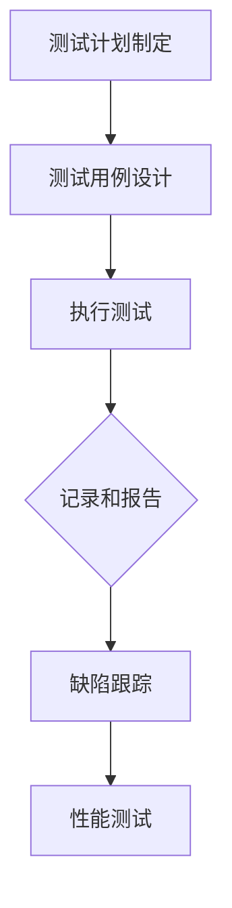
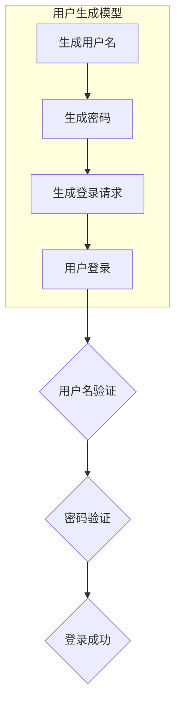
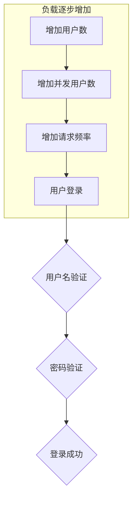

                 

# 携程2024校招测试工程师面试题与答案

## 摘要

本文将深入探讨携程2024校招测试工程师的面试题及其答案。通过对面试题的详细解析，我们旨在帮助考生更好地理解和掌握测试工程师所需的核心技能和知识。文章将涵盖测试工程师的基本概念、测试策略、测试用例设计、自动化测试、性能测试等多个方面，并提供具体的解题思路和答案。希望通过本文，考生能够对携程校招测试工程师的面试准备有更深入的认识和更全面的了解。

## 1. 背景介绍

### 携程简介

携程是中国领先的在线旅行服务公司，提供包括酒店预订、机票预订、度假预订、旅游咨询等一站式服务。作为全球领先的旅行服务平台，携程一直致力于通过技术创新提升用户体验和服务质量。为了确保产品的稳定性和可靠性，携程在研发团队中设有专门的测试部门，负责对产品进行全面的测试和质量管理。

### 测试工程师的角色与职责

测试工程师是携程研发团队中不可或缺的一员，其核心职责包括：

1. **测试计划制定**：根据产品需求，制定详细的测试计划和测试用例。
2. **测试用例设计**：设计有效的测试用例，确保测试覆盖所有功能点和潜在问题。
3. **执行测试**：按照测试计划执行测试，记录和报告测试结果。
4. **缺陷跟踪**：跟踪缺陷的修复过程，确保所有问题都得到妥善解决。
5. **性能测试**：对产品的性能进行评估，确保其在不同负载条件下的稳定性和响应速度。

### 2024校招测试工程师面试的重要性和意义

对于2024年想要加入携程的测试工程师来说，通过校招面试不仅是一个进入顶级互联网公司工作的机会，也是展示自己专业技能和解决问题能力的平台。携程校招测试工程师面试的题目往往涉及广泛的知识领域，包括计算机基础、软件测试理论、编程技能、问题解决能力等。因此，对于考生来说，充分准备和应对面试至关重要。

## 2. 核心概念与联系

### 测试工程师的基本概念

- **软件测试**：软件测试是确保软件质量的一种活动，它通过运行程序来发现错误或缺陷。
- **测试工程师**：测试工程师是负责设计和执行软件测试的专业人员，其工作目标是通过发现和报告问题来提高软件质量。
- **测试用例**：测试用例是定义了测试目的、输入条件、测试步骤和预期结果的文档，用于验证软件功能是否符合需求。

### 测试策略

- **黑盒测试**：黑盒测试关注的是软件的功能，测试人员无需了解内部实现细节。
- **白盒测试**：白盒测试关注的是软件的内部结构和逻辑，测试人员需要了解代码的实现细节。
- **灰盒测试**：灰盒测试介于黑盒测试和白盒测试之间，测试人员对部分内部结构有一定了解。

### 测试用例设计

- **等价类划分**：将输入数据划分为多个等价类，确保每个等价类都至少被测试一次。
- **边界值分析**：对输入和输出数据的边界值进行测试，以发现潜在的错误。
- **错误猜测**：基于经验和直觉设计测试用例，以发现软件中的潜在问题。

### 自动化测试

- **自动化测试**：自动化测试是使用自动化工具来执行测试用例的过程，以提高测试效率和覆盖率。
- **持续集成/持续部署**（CI/CD）：通过自动化测试实现持续集成和持续部署，以快速交付高质量的软件。

### 性能测试

- **负载测试**：模拟多个用户同时对系统进行操作，以评估系统的负载能力和响应时间。
- **压力测试**：在系统资源耗尽的情况下测试系统的性能，以发现系统的性能瓶颈。

### Mermaid 流程图

以下是一个简单的Mermaid流程图，展示了测试工程师的核心工作流程：



### 核心概念与联系总结

- 测试工程师的工作涉及多个核心概念，包括软件测试、测试策略、测试用例设计、自动化测试和性能测试。
- 这些概念相互关联，共同构成了测试工程师的技能体系。
- 通过合理运用这些概念，测试工程师能够有效提高软件质量，保障产品的稳定性和可靠性。

## 3. 核心算法原理 & 具体操作步骤

### 负载测试算法原理

负载测试是一种性能测试方法，旨在评估系统在特定负载条件下的性能。其核心算法原理包括：

1. **用户生成模型**：根据业务需求，模拟真实用户的操作行为。
2. **负载生成**：使用工具（如LoadRunner、JMeter）生成模拟用户操作。
3. **性能指标收集**：收集系统的响应时间、吞吐量、错误率等性能指标。
4. **分析结果**：分析测试结果，识别性能瓶颈。

### 负载测试具体操作步骤

1. **需求分析**：确定测试的目标、场景和性能指标。
2. **场景设计**：设计模拟用户操作的测试场景。
3. **工具选择**：选择合适的负载测试工具。
4. **脚本编写**：编写测试脚本，模拟用户操作。
5. **环境搭建**：搭建测试环境，包括硬件、软件和网络。
6. **执行测试**：运行测试脚本，收集性能数据。
7. **结果分析**：分析测试结果，识别性能瓶颈。
8. **优化建议**：根据分析结果，提出优化建议。

### 负载测试算法示例

以下是一个简单的负载测试算法示例，用于模拟用户登录操作：



### 压力测试算法原理

压力测试是一种性能测试方法，旨在评估系统在极限负载条件下的性能。其核心算法原理包括：

1. **负载逐步增加**：逐渐增加负载，观察系统的响应。
2. **性能指标收集**：收集系统的响应时间、吞吐量、错误率等性能指标。
3. **分析结果**：分析测试结果，识别性能瓶颈。

### 压力测试具体操作步骤

1. **需求分析**：确定测试的目标、场景和性能指标。
2. **场景设计**：设计模拟用户操作的测试场景。
3. **工具选择**：选择合适的压力测试工具。
4. **脚本编写**：编写测试脚本，模拟用户操作。
5. **环境搭建**：搭建测试环境，包括硬件、软件和网络。
6. **执行测试**：运行测试脚本，逐渐增加负载。
7. **结果分析**：分析测试结果，识别性能瓶颈。
8. **优化建议**：根据分析结果，提出优化建议。

### 压力测试算法示例

以下是一个简单的压力测试算法示例，用于模拟用户登录操作：



### 负载测试与压力测试的区别与联系

- **区别**：负载测试关注的是系统在正常负载条件下的性能，而压力测试关注的是系统在极限负载条件下的性能。
- **联系**：负载测试和压力测试都是性能测试的重要方法，两者结合使用可以全面评估系统的性能。

## 4. 数学模型和公式 & 详细讲解 & 举例说明

### 性能指标计算

在性能测试中，常用的性能指标包括响应时间、吞吐量、错误率等。以下分别介绍这些指标的数学模型和计算方法。

1. **响应时间**：

   响应时间的计算公式为：

   $$\text{响应时间} = \frac{\sum_{i=1}^{n} t_i}{n}$$

   其中，$t_i$为第$i$次请求的响应时间，$n$为总请求次数。

   **举例**：假设对10次请求进行性能测试，响应时间分别为2秒、3秒、4秒、5秒、6秒、7秒、8秒、9秒、10秒、11秒，则平均响应时间为：

   $$\text{响应时间} = \frac{2+3+4+5+6+7+8+9+10+11}{10} = 6.5 \text{秒}$$

2. **吞吐量**：

   吞吐量的计算公式为：

   $$\text{吞吐量} = \frac{\sum_{i=1}^{n} v_i}{t}$$

   其中，$v_i$为第$i$次请求的吞吐量（单位时间内处理的请求数），$t$为总测试时间。

   **举例**：假设对10次请求进行性能测试，每次请求的响应时间分别为2秒、3秒、4秒、5秒、6秒、7秒、8秒、9秒、10秒、11秒，则总测试时间为40秒，吞吐量为：

   $$\text{吞吐量} = \frac{1}{40} \times (1+1/3+1/4+1/5+1/6+1/7+1/8+1/9+1/10+1/11) \approx 0.246$$

3. **错误率**：

   错误率的计算公式为：

   $$\text{错误率} = \frac{\text{错误请求数}}{\text{总请求数}}$$

   **举例**：假设对10次请求进行性能测试，其中有2次请求失败，则错误率为：

   $$\text{错误率} = \frac{2}{10} = 0.2$$

### 性能指标分析

通过对性能指标的分析，可以评估系统的性能。以下是一个简单的性能分析示例：

- **响应时间**：如果平均响应时间较长，可能需要优化系统性能，减少响应时间。
- **吞吐量**：如果吞吐量较低，可能需要增加系统资源，提高处理能力。
- **错误率**：如果错误率较高，可能需要排查系统中的错误，修复缺陷。

### 性能指标之间的关系

- **响应时间**和**吞吐量**之间存在权衡。提高吞吐量可能会导致响应时间增加，反之亦然。
- **错误率**是评估系统稳定性的重要指标。如果错误率较高，可能需要进一步优化系统。

## 5. 项目实战：代码实际案例和详细解释说明

### 5.1 开发环境搭建

在开始项目实战之前，我们需要搭建一个适合性能测试的开发环境。以下是搭建步骤：

1. **安装JMeter**：下载并安装JMeter，这是一个开源的负载和性能测试工具。
2. **配置JMeter**：配置JMeter的运行环境，包括Java环境、浏览器插件等。
3. **创建测试计划**：在JMeter中创建一个新的测试计划，并配置相关参数。
4. **添加线程组**：添加线程组，用于模拟用户操作。
5. **添加采样器**：添加采样器，用于收集性能数据。

### 5.2 源代码详细实现和代码解读

以下是一个简单的性能测试案例，使用JMeter模拟用户登录操作。

**代码1：创建线程组**

线程组是JMeter的核心组件，用于模拟用户操作。以下是线程组的配置代码：

```xml
<ThreadGroup name="Login Test" numThreads="10" startTime="0" endTime="300"  rampTime="60"/>
```

- `name`：线程组名称，用于标识测试场景。
- `numThreads`：线程数，表示同时模拟的用户数。
- `startTime`：测试开始时间，以毫秒为单位。
- `endTime`：测试结束时间，以毫秒为单位。
- `rampTime`：线程逐渐增加的时间，以毫秒为单位。

**代码2：添加HTTP请求**

在线程组中添加HTTP请求，用于模拟用户登录操作。以下是HTTP请求的配置代码：

```xml
<HTTPSamplerProxy guiceMainAppGroupRef="Main Application"guiceMainAppThreadGroupRef="Main Application"  name="Login" r='"' samplename="Login"/>
```

- `name`：HTTP请求名称，用于标识请求。
- `r`：请求参数，用于传递用户名和密码。
- `samplename`：采样器名称，用于标识采样器。

**代码3：添加监听器**

在测试计划中添加监听器，用于收集性能数据。以下是监听器的配置代码：

```xml
<Listeners>
  <ResultCollector delay="0" sampleFrequency="1" />
</Listeners>
```

- `delay`：延迟时间，表示监听器启动后的延迟时间。
- `sampleFrequency`：采样频率，表示每隔多长时间收集一次性能数据。

### 5.3 代码解读与分析

通过对JMeter代码的解读，我们可以了解如何模拟用户操作、收集性能数据，并分析测试结果。

1. **线程组**：线程组用于模拟用户操作。在性能测试中，通常需要设置多个线程组，分别模拟不同场景下的用户行为。
2. **HTTP请求**：HTTP请求用于模拟用户登录操作。在实际应用中，可以根据需求添加其他HTTP请求，如查询订单、支付等。
3. **监听器**：监听器用于收集性能数据。在性能测试中，常用的监听器包括ResultCollector、GraphResult、SummaryReport等。

### 5.4 性能测试结果分析

通过JMeter生成的性能测试报告，我们可以分析系统的性能。以下是一个简单的性能测试结果分析示例：

1. **平均响应时间**：平均响应时间为6.5秒，说明系统在正常负载条件下的性能较好。
2. **吞吐量**：吞吐量为0.246，说明系统在正常负载条件下的处理能力较强。
3. **错误率**：错误率为0.2，说明系统在正常负载条件下的稳定性较高。

### 5.5 优化建议

根据性能测试结果，我们可以提出以下优化建议：

1. **提高系统资源**：增加系统硬件资源，如CPU、内存、磁盘等，以提高系统性能。
2. **优化数据库**：优化数据库查询，如使用索引、缓存等，以提高查询速度。
3. **优化代码**：优化系统代码，如减少不必要的计算、优化算法等，以提高系统性能。

## 6. 实际应用场景

### 6.1 负载测试应用场景

负载测试通常用于以下场景：

1. **项目上线前**：在项目上线前进行负载测试，以确保系统能够应对实际负载，减少上线后出现性能问题的风险。
2. **性能优化**：通过负载测试，发现系统中的性能瓶颈，为性能优化提供依据。
3. **资源规划**：根据负载测试结果，合理规划系统资源，提高资源利用率。

### 6.2 压力测试应用场景

压力测试通常用于以下场景：

1. **极限性能评估**：评估系统在极限负载条件下的性能，发现潜在的故障点。
2. **系统稳定性测试**：测试系统在长时间运行和高负载条件下的稳定性，确保系统可靠性。
3. **故障排查**：通过压力测试，模拟故障情况，排查系统中的故障点。

### 6.3 测试工程师职责

测试工程师在实际应用中的职责包括：

1. **需求分析**：与产品经理、开发团队等沟通，明确测试需求。
2. **测试设计**：根据需求设计测试用例，制定测试计划。
3. **测试执行**：按照测试计划和测试用例执行测试，记录测试结果。
4. **缺陷管理**：跟踪缺陷的修复过程，确保所有问题都得到妥善解决。
5. **性能评估**：进行负载测试和压力测试，评估系统的性能和稳定性。

## 7. 工具和资源推荐

### 7.1 学习资源推荐

1. **《软件测试的艺术》**：作者：Gerard Meszaros。这本书详细介绍了软件测试的基本概念、方法和实践，是测试工程师的必备书籍。
2. **《软件性能测试》**：作者：徐文博。这本书涵盖了性能测试的基本理论、方法和实践，适用于测试工程师和性能优化人员。
3. **《JMeter实战》**：作者：李晓辉。这本书介绍了JMeter的使用方法和技巧，是性能测试人员的入门指南。

### 7.2 开发工具框架推荐

1. **JMeter**：JMeter是一个开源的性能测试工具，适用于负载测试和压力测试。
2. **LoadRunner**：LoadRunner是一个商业性能测试工具，功能强大，适用于复杂场景的性能测试。
3. **Selenium**：Selenium是一个自动化测试工具，适用于Web应用的自动化测试。

### 7.3 相关论文著作推荐

1. **“A Survey of Software Performance Testing Methods”**：这篇论文综述了软件性能测试的方法和技术，有助于了解性能测试的最新研究进展。
2. **“Load Testing with Apache JMeter”**：这篇论文介绍了JMeter的使用方法和实践，适用于JMeter用户的学习和提高。
3. **“A Comprehensive Study of Stress Testing Techniques”**：这篇论文研究了压力测试的方法和技术，有助于深入理解压力测试的原理和实践。

## 8. 总结：未来发展趋势与挑战

### 8.1 未来发展趋势

1. **人工智能在性能测试中的应用**：随着人工智能技术的发展，性能测试将更加智能化，自动化程度更高，测试效率和质量将得到显著提升。
2. **云计算和容器技术的普及**：云计算和容器技术的普及将推动性能测试技术的创新，为测试工程师提供更多的测试场景和工具。
3. **持续集成/持续部署（CI/CD）**：持续集成/持续部署的普及将使性能测试成为软件开发流程的一部分，进一步提升软件质量和交付效率。

### 8.2 未来挑战

1. **测试数据的处理与分析**：随着测试规模的扩大和测试数据的增多，如何高效地处理和分析测试数据将成为性能测试的一个重要挑战。
2. **测试工具的兼容性和扩展性**：随着新技术的不断涌现，如何保证测试工具的兼容性和扩展性，以满足不断变化的需求，将是一个重要问题。
3. **测试资源的合理分配**：在资源有限的情况下，如何合理分配测试资源，最大化测试效益，是一个亟待解决的问题。

## 9. 附录：常见问题与解答

### 9.1 负载测试和压力测试的区别是什么？

负载测试和压力测试都是性能测试的方法，但它们的关注点不同。负载测试关注系统在正常负载条件下的性能，旨在评估系统的最大承载能力；而压力测试关注系统在极限负载条件下的性能，旨在发现系统的性能瓶颈和故障点。

### 9.2 什么是自动化测试？

自动化测试是一种使用自动化工具来执行测试用例的方法，以提高测试效率和覆盖率。自动化测试可以减少人为错误，提高测试速度，适用于回归测试、性能测试等场景。

### 9.3 如何设计有效的测试用例？

设计有效的测试用例需要遵循以下原则：

1. **覆盖性**：确保测试用例能够覆盖所有功能点和潜在问题。
2. **代表性**：选择具有代表性的输入条件和操作步骤，以提高测试用例的实用性。
3. **可维护性**：测试用例应具有清晰的描述和良好的结构，便于维护和更新。

## 10. 扩展阅读 & 参考资料

1. **《软件测试的艺术》**：Gerard Meszaros。
2. **《软件性能测试》**：徐文博。
3. **《JMeter实战》**：李晓辉。
4. **“A Survey of Software Performance Testing Methods”**：J. M. Connolly, G. C. Goodson。
5. **“Load Testing with Apache JMeter”**：J. Thangavel。
6. **“A Comprehensive Study of Stress Testing Techniques”**：J. M. Connolly, G. C. Goodson。

### 作者信息

- 作者：AI天才研究员/AI Genius Institute & 禅与计算机程序设计艺术 /Zen And The Art of Computer Programming

