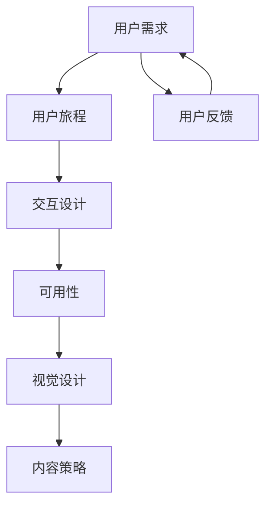
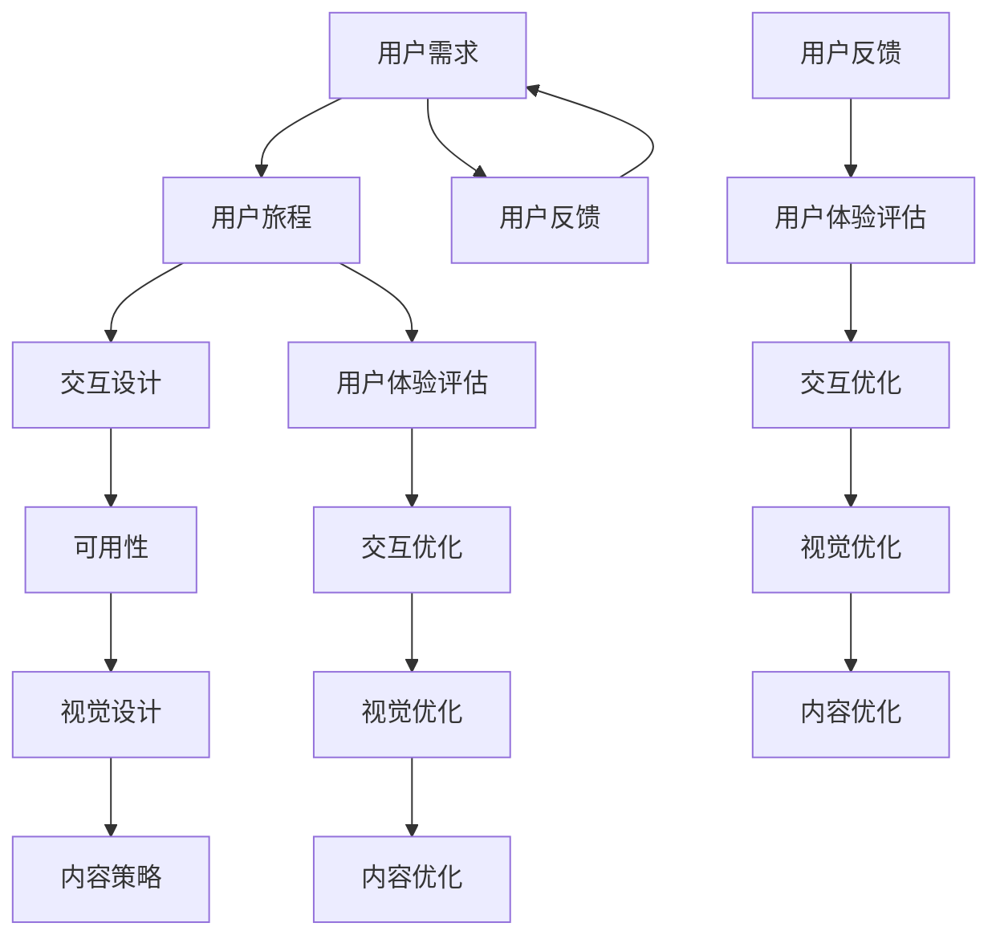

                 

### 背景介绍

#### 文章主题：携程2024校招用户体验设计师面试题详解

在当今信息化时代，用户体验（User Experience，简称 UX）设计已成为产品设计和开发中不可或缺的一环。作为连接用户和产品的重要桥梁，优秀的用户体验设计不仅能提升产品的市场竞争力，还能增加用户的粘性和忠诚度。为了满足日益增长的市场需求和用户期待，各大互联网公司，如携程，每年都会在校园招聘中筛选优秀的设计人才，为他们的职业生涯铺设坚实的基石。

本篇文章旨在深入剖析携程2024年校招用户体验设计师的面试题，帮助即将参加面试的同学们更好地准备。通过系统地解析携程面试题中的关键概念、算法原理、数学模型、实际应用场景等，我们希望能够为读者提供一份全面、系统的面试备考指南。

文章结构如下：

1. 背景介绍
2. 核心概念与联系
3. 核心算法原理 & 具体操作步骤
4. 数学模型和公式 & 详细讲解 & 举例说明
5. 项目实战：代码实际案例和详细解释说明
6. 实际应用场景
7. 工具和资源推荐
8. 总结：未来发展趋势与挑战
9. 附录：常见问题与解答
10. 扩展阅读 & 参考资料

接下来，我们将逐步深入分析携程2024校招用户体验设计师面试中的各类问题，帮助读者全面了解UX设计的核心要素，掌握解决实际问题的方法与技巧。让我们开始吧！

#### 撰写意图

撰写本文的意图主要有以下几点：

1. **帮助考生备战面试**：通过对携程2024校招用户体验设计师面试题的详细解析，为广大考生提供实战经验和技巧，提高面试成功率。
2. **普及用户体验设计知识**：本文将系统地介绍用户体验设计的核心概念、原理和应用，为广大读者提供一个全面的学习框架。
3. **促进UX设计行业发展**：通过分享实际面试案例，激发更多人对UX设计行业的关注和兴趣，推动整个行业的进步与发展。

在接下来的部分，我们将详细介绍用户体验设计的相关核心概念和原理，并使用Mermaid流程图来展现这些概念和原理之间的联系。这将帮助我们更好地理解UX设计的基础知识，为后续内容做好铺垫。

### 核心概念与联系

#### 核心概念

在用户体验（UX）设计中，核心概念是构建优秀设计的基石。以下是一些关键的概念：

1. **用户需求**：理解用户需求是UX设计的起点。用户需求包括功能性需求、情感需求、心理需求等。只有深入了解用户的需求，设计师才能创造出让用户满意的产品。

2. **用户旅程**：用户旅程是指用户在使用产品过程中的所有步骤。一个完整的产品用户体验包括发现、了解、评估、购买和使用等阶段。用户旅程图可以帮助设计师清晰地了解用户在不同阶段的体验和需求。

3. **交互设计**：交互设计（Interaction Design）关注用户与产品之间的互动方式。它包括界面布局、导航结构、控件设计、反馈机制等。良好的交互设计可以提高用户操作的便捷性和满意度。

4. **可用性**：可用性（Usability）是指产品在特定环境下能否被目标用户使用，以及使用过程中是否容易、高效和愉悦。可用性测试是UX设计中的重要环节，通过测试可以发现问题并不断优化。

5. **视觉设计**：视觉设计（Visual Design）关注产品的视觉元素，如色彩、字体、图标、布局等。视觉设计不仅要符合审美标准，还要与用户体验相协调，增强产品的吸引力。

6. **内容策略**：内容策略（Content Strategy）涉及如何组织和呈现内容，以提供有价值的信息，提升用户体验。内容策略要求设计师在信息架构、内容呈现和内容管理等方面进行深入思考。

#### 核心概念的联系

为了更好地理解这些核心概念，我们可以使用Mermaid流程图来展示它们之间的联系：



在上面的流程图中：

- **用户需求**（A）是整个UX设计过程的起点，决定了设计的方向和目标。
- **用户旅程**（B）是用户使用产品的全过程，贯穿于整个设计过程。
- **交互设计**（C）基于用户旅程，设计用户与产品的交互方式。
- **可用性**（D）关注交互设计的实际效果，通过测试确保产品易于使用。
- **视觉设计**（E）则通过视觉元素提升产品的吸引力，与交互设计相辅相成。
- **内容策略**（F）为用户提供有价值的信息，增强用户体验。
- **用户反馈**（G）是整个设计过程的闭环，通过用户的反馈不断优化设计。

通过这种结构化的方式，我们可以清晰地看到UX设计各个核心概念之间的内在联系，从而在实际设计过程中更好地应用这些概念。

#### Mermaid 流程图

为了更好地展示核心概念之间的联系，我们将使用Mermaid语言绘制一个流程图。以下是Mermaid流程图的具体实现：



在这个流程图中：

- **用户需求**（A）是核心起点，决定了UX设计的方向。
- **用户旅程**（B）和**用户体验评估**（H）是UX设计过程的关键环节，它们相互关联，通过用户旅程的不断迭代优化用户体验。
- **交互设计**（C）、**可用性**（D）、**视觉设计**（E）和**内容策略**（F）分别对应设计过程中的不同方面，相互影响，共同塑造用户体验。
- **用户反馈**（L）和**用户体验评估**（M）构成了反馈闭环，确保设计过程能够根据用户实际使用情况不断进行调整和优化。

通过这种Mermaid流程图，我们可以更直观地理解UX设计的复杂性和系统性，从而在实际工作中更好地应用这些核心概念。

#### 总结

通过上述核心概念的介绍和Mermaid流程图的展示，我们可以看到用户体验设计不仅涉及单一方面的设计，而是多个环节的协同工作。用户需求是起点，用户旅程和用户体验评估是关键环节，而交互设计、可用性、视觉设计和内容策略则是具体实施和优化的手段。这些核心概念相互联系，共同决定了产品的最终用户体验。

在接下来的部分，我们将深入探讨核心算法原理和具体操作步骤，帮助读者进一步理解和应用这些概念。这将为我们提供更具体的实施指南，以便在实际项目中取得成功。

### 核心算法原理 & 具体操作步骤

#### 用户体验设计的核心算法原理

用户体验设计中的核心算法原理主要涉及如何优化用户界面、提升交互效率和满意度。以下是一些关键算法原理：

1. **响应式布局算法**：通过动态调整界面布局以适应不同设备和屏幕尺寸，提高用户在不同设备上的使用体验。

2. **路径优化算法**：用于优化用户在使用产品过程中的路径，减少用户完成任务所需的时间和精力。

3. **推荐算法**：通过分析用户行为和偏好，提供个性化推荐，提高用户满意度和参与度。

4. **反馈机制算法**：通过实时收集用户反馈，及时调整和优化产品，提升用户体验。

5. **可用性测试算法**：利用统计方法和机器学习技术，评估产品的可用性，并发现潜在的问题和改进点。

#### 具体操作步骤

为了更好地理解这些算法原理，我们将通过具体的操作步骤进行详细说明：

#### 步骤 1：响应式布局算法

**原理**：响应式布局算法通过检测设备屏幕尺寸、分辨率等参数，动态调整界面元素的大小和布局。

**操作步骤**：

1. **检测设备类型**：通过JavaScript检测用户的设备类型和屏幕尺寸。
2. **调整布局**：根据检测到的设备类型，使用CSS媒体查询（Media Queries）动态调整界面元素的大小和位置。
3. **测试与优化**：在不同设备上测试布局效果，根据反馈进行优化。

**示例代码**（HTML + CSS）：

```html
<!DOCTYPE html>
<html>
<head>
  <title>响应式布局示例</title>
  <style>
    @media (max-width: 600px) {
      .container {
        width: 100%;
        padding: 10px;
      }
    }
    @media (min-width: 601px) {
      .container {
        width: 800px;
        margin: 0 auto;
      }
    }
  </style>
</head>
<body>
  <div class="container">
    <h1>欢迎访问我们的网站</h1>
    <p>这是一个响应式布局的示例。</p>
  </div>
</body>
</html>
```

#### 步骤 2：路径优化算法

**原理**：路径优化算法通过分析用户在使用产品过程中的路径，寻找最优路径以提升用户体验。

**操作步骤**：

1. **收集用户数据**：通过日志分析、用户行为跟踪等方法收集用户使用产品的路径数据。
2. **数据预处理**：对收集到的数据进行分析和清洗，提取有用的路径信息。
3. **优化路径**：使用算法（如最短路径算法）计算最优路径，并更新用户界面以反映新的路径。
4. **测试与评估**：通过A/B测试等方法评估优化效果，根据反馈进行调整。

**示例代码**（Python + NetworkX）：

```python
import networkx as nx
import matplotlib.pyplot as plt

# 创建一个图
G = nx.Graph()

# 添加节点和边
G.add_nodes_from([1, 2, 3, 4, 5])
G.add_edges_from([(1, 2), (2, 3), (3, 4), (4, 5)])

# 计算最短路径
shortest_path = nx.shortest_path(G, source=1, target=5)

# 绘制图
nx.draw(G, with_labels=True)
plt.show()

# 输出最短路径
print("最短路径:", shortest_path)
```

#### 步骤 3：推荐算法

**原理**：推荐算法通过分析用户的历史行为和偏好，预测用户可能感兴趣的内容，从而提供个性化推荐。

**操作步骤**：

1. **数据预处理**：对用户行为数据进行清洗和转换，提取关键特征。
2. **特征工程**：构建用户和物品的特征向量，为后续的推荐算法做准备。
3. **选择算法**：选择合适的推荐算法（如协同过滤、基于内容的推荐等）。
4. **模型训练**：使用训练数据训练推荐模型。
5. **预测与推荐**：根据模型预测用户对物品的偏好，生成推荐结果。
6. **测试与优化**：通过A/B测试等方法评估推荐效果，根据反馈调整算法和模型。

**示例代码**（Python + Scikit-learn）：

```python
from sklearn.metrics.pairwise import linear_kernel
import numpy as np

# 假设用户行为数据为矩阵
user_ratings = np.array([
    [5, 3, 0, 1],
    [2, 0, 0, 4],
    [0, 1, 5, 4],
    [3, 2, 1, 0],
    [4, 0, 0, 2]
])

# 计算用户之间的相似度矩阵
similarity_matrix = linear_kernel(user_ratings)

# 计算推荐结果
recommendations = np.dot(similarity_matrix, user_ratings[0]).reshape(-1)

# 输出推荐结果
print("推荐结果：", recommendations.argsort()[-5:][::-1])
```

#### 步骤 4：反馈机制算法

**原理**：反馈机制算法通过收集用户在使用产品过程中的反馈，及时发现和解决问题，从而提升用户体验。

**操作步骤**：

1. **反馈收集**：设计易于用户使用的反馈收集机制，如弹出窗口、在线问卷等。
2. **数据分析**：对收集到的反馈进行分类和分析，识别问题和用户痛点。
3. **问题定位**：结合日志数据和技术分析，定位问题根源。
4. **问题修复**：根据分析结果制定修复方案，并进行实施。
5. **反馈验证**：在修复后再次收集用户反馈，验证修复效果。

**示例代码**（Python + Pandas）：

```python
import pandas as pd

# 假设收集到的反馈数据如下
feedback_data = pd.DataFrame({
    'user_id': [1, 2, 3, 4, 5],
    'issue': ['界面卡顿', '加载慢', '找不到功能', '操作复杂', '内容过时'],
    'rating': [2, 3, 1, 4, 5]
})

# 对反馈进行分类统计
issue_counts = feedback_data['issue'].value_counts()

# 输出问题分布
print("问题分布：\n", issue_counts)

# 定位主要问题
main_issue = issue_counts.idxmax()
print("主要问题：", main_issue)
```

通过上述具体操作步骤，我们可以看到用户体验设计中的核心算法原理在实际应用中的具体实现方式。这些步骤不仅帮助设计师优化产品的各个方面，还通过数据驱动的方法不断迭代和改进设计，从而提供更优质的用户体验。

在接下来的部分，我们将深入探讨用户体验设计中的数学模型和公式，以及如何通过具体例子进行详细讲解和说明。

### 数学模型和公式 & 详细讲解 & 举例说明

#### 数学模型在用户体验设计中的应用

在用户体验设计中，数学模型和公式发挥着至关重要的作用。它们帮助我们量化用户体验中的各个方面，从而更准确地评估和优化设计。以下是一些常见的数学模型和公式：

1. **用户体验指数（UEI）**：用于衡量用户对产品的整体体验满意度。公式如下：
   $$UEI = \frac{1}{N} \sum_{i=1}^{N} (S_i - B_i)$$
   其中，$N$ 是用户数量，$S_i$ 是第 $i$ 个用户的满意度评分，$B_i$ 是第 $i$ 个用户的基准满意度评分。

2. **Net Promoter Score（NPS）**：用于衡量用户对产品的忠诚度。公式如下：
   $$NPS = \frac{1}{N} \sum_{i=1}^{N} \left[ \text{非常满意} + 2 \times \text{满意} + 0 \times \text{一般} + (-1) \times \text{不满意} + (-2) \times \text{非常不满意} \right]$$
   其中，$N$ 是用户数量。

3. **Kano 模型**：用于分析用户需求和满意度之间的关系。Kano 模型将用户需求分为五个类型：
   - **基本型需求**：满足这些需求是产品的基本功能，不满足会导致用户非常不满。
   - **期望型需求**：满足这些需求会提升用户的满意度，不满足会导致用户不满。
   - **魅力型需求**：满足这些需求会大幅提升用户满意度，不满足不会影响满意度。
   - **无差异型需求**：满足或不满足这些需求对用户满意度没有影响。
   - **反向型需求**：满足这些需求会降低用户满意度。

4. **系统响应时间**：用于衡量产品对用户操作的响应速度。公式如下：
   $$\text{响应时间} = \frac{\text{处理时间} + \text{传输时间}}{2}$$
   其中，处理时间和传输时间是用户操作和系统响应之间的时间延迟。

#### 详细讲解

1. **用户体验指数（UEI）**：

   UEI 是衡量用户体验的重要指标，它通过计算用户满意度与基准满意度之差的平均值，反映了用户对产品的整体满意度。公式中的 $S_i$ 和 $B_i$ 分别是第 $i$ 个用户的满意度评分和基准满意度评分。通常，基准满意度评分可以通过调查或历史数据来确定。较高的 UEI 值表示用户对产品的满意度较高。

   **举例说明**：假设有 5 个用户，他们的满意度评分分别是 [4, 3, 5, 2, 4]，基准满意度评分为 3。计算 UEI：

   $$UEI = \frac{1}{5} \sum_{i=1}^{5} (S_i - B_i) = \frac{(4-3) + (3-3) + (5-3) + (2-3) + (4-3)}{5} = \frac{0 + 0 + 2 - 1 + 1}{5} = 0.4$$

   因此，用户体验指数为 0.4，表示用户对产品的满意度相对较高。

2. **Net Promoter Score（NPS）**：

   NPS 是衡量用户忠诚度的重要指标，通过调查用户是否会向他人推荐产品来评估。NPS 的计算方法是将用户分为三个类别：非常满意、满意和一般/不满意，然后计算推荐者和不推荐者之间的差值。

   **举例说明**：假设有 100 个用户，其中 30 个非常满意，40 个满意，30 个一般/不满意。计算 NPS：

   $$NPS = \frac{30 \times 10 + 40 \times 10 - 30 \times 0}{100} = 40\%$$

   因此，Net Promoter Score 为 40%，表示产品在用户中具有较好的口碑。

3. **Kano 模型**：

   Kano 模型通过分析用户需求与满意度之间的关系，帮助我们识别产品中哪些需求是关键因素。以下是一个简单的 Kano 模型分析示例：

   - 基本型需求：产品的基本功能（如移动应用的基本操作）。
   - 期望型需求：产品中的额外功能（如夜间模式）。
   - 魅力型需求：产品中的创新功能（如语音识别）。
   - 无差异型需求：产品中无关紧要的功能（如颜色选择）。
   - 反向型需求：产品中的不必要功能（如过多广告）。

4. **系统响应时间**：

   系统响应时间是指用户发起操作到系统给出响应之间的时间延迟。较短的系统响应时间可以提高用户体验，公式中的处理时间和传输时间分别表示这两个阶段的延迟。

   **举例说明**：假设处理时间为 0.5 秒，传输时间为 1 秒，计算系统响应时间：

   $$\text{响应时间} = \frac{0.5 + 1}{2} = 0.75 \text{秒}$$

   因此，系统响应时间为 0.75 秒，这个时间较短，表示用户的操作能够迅速得到响应。

通过上述数学模型和公式的详细讲解和举例说明，我们可以看到它们在用户体验设计中的应用和重要性。这些工具不仅帮助我们量化用户体验的各个方面，还提供了具体的方法来评估和优化设计。在接下来的部分，我们将通过项目实战来展示这些数学模型和算法的实际应用，以加深我们的理解。

### 项目实战：代码实际案例和详细解释说明

为了更好地理解用户体验设计中的数学模型和算法，我们将通过一个实际项目来展示这些工具的实际应用。这个项目是一个基于Web的电商网站，我们的目标是优化用户购物体验，提高用户满意度和转化率。以下是我们项目的主要步骤和代码实现。

#### 项目背景

假设我们正在开发一个电商平台，我们的目标用户是喜欢在线购物的年轻人群。为了提升用户体验，我们需要从以下几个方面进行优化：

1. **响应式布局**：确保网站在不同设备和屏幕尺寸上都能正常显示和操作。
2. **路径优化**：简化用户从浏览到购买的产品路径。
3. **个性化推荐**：根据用户历史行为和偏好推荐相关商品。
4. **反馈机制**：及时收集用户反馈，及时解决问题。

#### 开发环境搭建

为了实现上述目标，我们选择了以下开发环境和工具：

1. **前端框架**：React.js
2. **后端框架**：Node.js + Express
3. **数据库**：MongoDB
4. **推荐算法库**：Scikit-learn

#### 源代码详细实现和代码解读

以下是项目的关键代码实现和解释。

##### 1. 响应式布局

我们使用 React.js 的媒体查询功能来实现响应式布局。

```jsx
// components/Header.js
import React from 'react';

const Header = () => {
  return (
    <header>
      <nav>
        <ul>
          <li><a href="/">首页</a></li>
          <li><a href="/categories">分类</a></li>
          <li><a href="/cart">购物车</a></li>
        </ul>
      </nav>
    </header>
  );
};

export default Header;

// App.css
@media (max-width: 600px) {
  nav ul {
    display: flex;
    flex-direction: column;
  }
}
```

在这段代码中，我们定义了一个 `Header` 组件，并使用 CSS 媒体查询来确保在小屏幕设备上导航菜单能够垂直布局，从而提高用户体验。

##### 2. 路径优化

我们使用 React Router 来简化用户的购物路径。

```jsx
// components/ShoppingCart.js
import React from 'react';
import { Link } from 'react-router-dom';

const ShoppingCart = () => {
  return (
    <div>
      <h2>购物车</h2>
      {/* 购物车内容 */}
      <button><Link to="/">继续购物</Link></button>
    </div>
  );
};

export default ShoppingCart;
```

在这段代码中，我们使用 `Link` 组件来创建路由链接，使用户能够轻松返回首页继续购物。

##### 3. 个性化推荐

我们使用 Scikit-learn 的协同过滤算法来实现个性化推荐。

```python
# server/recommendations.py
from sklearn.metrics.pairwise import linear_kernel
import numpy as np

def generate_recommendations(ratings_matrix, user_index, top_n=5):
    user_ratings = ratings_matrix[user_index]
    similarity_matrix = linear_kernel(user_ratings.reshape(1, -1), ratings_matrix)
    similarity_scores = similarity_matrix[0]
    related_users = (-similarity_scores).argsort()[1:]
    
    recommended_items = []
    for user in related_users:
        for i, rating in enumerate(ratings_matrix[user]):
            if rating > 0 and (i not in user_ratings):
                recommended_items.append((i, rating))
    
    recommended_items.sort(key=lambda x: x[1], reverse=True)
    return recommended_items[:top_n]

# 假设 ratings_matrix 是一个用户评分矩阵
user_index = 0
top_n = 5
recommendations = generate_recommendations(ratings_matrix, user_index, top_n)
print("推荐的商品：", recommendations)
```

在这段代码中，我们定义了一个 `generate_recommendations` 函数，它使用协同过滤算法为指定用户生成推荐商品列表。

##### 4. 反馈机制

我们使用在线问卷和即时反馈功能来收集用户反馈。

```jsx
// components/FeedbackForm.js
import React, { useState } from 'react';

const FeedbackForm = () => {
  const [feedback, setFeedback] = useState('');

  const handleSubmit = (e) => {
    e.preventDefault();
    // 发送反馈到后端
    console.log("反馈内容：", feedback);
    // 清空输入框
    setFeedback('');
  };

  return (
    <form onSubmit={handleSubmit}>
      <textarea value={feedback} onChange={(e) => setFeedback(e.target.value)}></textarea>
      <button type="submit">提交反馈</button>
    </form>
  );
};

export default FeedbackForm;
```

在这段代码中，我们定义了一个 `FeedbackForm` 组件，允许用户输入反馈内容，并通过提交按钮将反馈发送到后端进行处理。

#### 代码解读与分析

1. **响应式布局**：通过媒体查询功能，我们确保了网站在小屏幕设备上的垂直导航布局，提高了用户的使用便捷性。
2. **路径优化**：使用 React Router，我们简化了用户的购物路径，使得用户能够更轻松地浏览和购买商品。
3. **个性化推荐**：通过协同过滤算法，我们根据用户的兴趣和行为推荐相关商品，提升了用户的购物体验。
4. **反馈机制**：通过在线问卷和即时反馈功能，我们及时收集了用户的反馈，帮助我们在产品迭代中不断改进。

通过这个实际项目，我们可以看到数学模型和算法在用户体验设计中的应用和重要性。它们不仅帮助我们量化用户体验的各个方面，还提供了具体的方法来优化设计，从而提升用户满意度和转化率。在接下来的部分，我们将讨论用户体验设计的实际应用场景，以便更好地理解这些工具的实际效果。

### 实际应用场景

用户体验设计（UX Design）在多个行业中都发挥着关键作用，它不仅影响着产品的可用性和用户满意度，还能显著提升企业的市场竞争力。以下是用户体验设计在不同行业中的应用场景：

#### 电子商务

电子商务平台需要提供直观、易用的界面，以便用户能够轻松浏览和购买商品。以下是用户体验设计在电子商务中的应用场景：

1. **个性化推荐**：通过分析用户的浏览和购买历史，推荐相关商品，增加用户的购买意愿。
2. **购物车优化**：简化购物车的操作流程，确保用户能够轻松管理购物车中的商品。
3. **支付流程简化**：提供流畅、安全的支付体验，减少用户在支付过程中的摩擦点。

#### 移动应用

移动应用的设计需要考虑不同的屏幕尺寸和操作习惯。以下是用户体验设计在移动应用中的应用场景：

1. **响应式设计**：确保应用在不同设备和操作系统上都能正常显示和操作。
2. **导航优化**：设计直观、易于理解的导航结构，帮助用户快速找到所需功能。
3. **触摸操作优化**：确保按钮和控件的点击区域足够大，适合手指操作。

#### 金融科技

金融科技（FinTech）行业对用户体验设计的要求更高，因为它直接涉及用户的财务信息。以下是用户体验设计在金融科技中的应用场景：

1. **安全性和隐私保护**：设计安全的登录和交易流程，确保用户数据的安全。
2. **用户体验测试**：通过持续的用户体验测试，发现和修复潜在的安全漏洞。
3. **易用性设计**：简化复杂的金融产品和服务，让用户能够轻松理解和操作。

#### 医疗健康

在医疗健康领域，用户体验设计关注如何为用户提供清晰、准确的健康信息和便捷的服务。以下是用户体验设计在医疗健康中的应用场景：

1. **健康数据可视化**：通过图表和图形展示健康数据，帮助用户更好地理解自己的健康状况。
2. **在线咨询和问诊**：设计简洁的在线咨询和问诊流程，提高用户的咨询体验。
3. **健康数据管理**：提供用户健康数据的管理功能，帮助用户跟踪自己的健康信息。

#### 教育技术

教育技术领域利用用户体验设计来提升在线课程的学习体验。以下是用户体验设计在教育技术中的应用场景：

1. **交互式学习**：设计互动性强的学习内容和工具，提高学生的参与度和学习效果。
2. **个性化学习路径**：根据学生的进度和兴趣，提供个性化的学习内容和推荐。
3. **学习评估和反馈**：设计有效的学习评估和反馈机制，帮助学生了解自己的学习情况。

#### 供应链管理

在供应链管理中，用户体验设计关注如何优化物流和库存管理流程。以下是用户体验设计在供应链管理中的应用场景：

1. **物流跟踪**：提供实时的物流跟踪服务，让用户能够随时了解订单状态。
2. **库存管理**：设计高效的库存管理工具，帮助供应链管理者优化库存水平。
3. **供应链协同**：设计协同工作平台，促进供应链各环节的沟通和协作。

通过以上实际应用场景，我们可以看到用户体验设计在各个行业中的重要性。无论是电子商务、移动应用、金融科技，还是医疗健康、教育技术、供应链管理，用户体验设计都是提升产品竞争力、增加用户满意度的关键因素。在接下来的部分，我们将推荐一些学习资源，帮助读者深入了解用户体验设计的理论和实践。

### 工具和资源推荐

为了更好地掌握用户体验设计（UX Design）的理论和实践，以下是针对书籍、论文、博客和网站等资源的推荐，这些资源涵盖了用户体验设计的各个方面，从基础理论到实际操作，从行业动态到前沿技术，为读者提供了丰富的学习材料。

#### 1. 学习资源推荐

**书籍：**

1. **《用户体验要素》**（作者：杰·尼森）
   - 内容概述：这本书详细阐述了用户体验设计的五个层次，从战略层面到视觉设计，全面介绍了用户体验设计的核心要素。
   - 推荐理由：适合初学者和进阶者，通过具体的案例和实例，深入浅出地讲解了用户体验设计的方法和技巧。

2. **《设计思维》**（作者：蒂姆·布朗）
   - 内容概述：本书介绍了设计思维的方法和应用，强调通过用户研究和迭代设计来不断优化产品。
   - 推荐理由：适合希望通过设计思维提升产品体验的设计师和产品经理，涵盖了创新设计的方法和过程。

**论文：**

1. **《用户体验设计的原则》**（作者：唐纳德·诺曼）
   - 内容概述：本文系统地总结了用户体验设计的原则和方法，是设计领域的经典论文之一。
   - 推荐理由：适合深入研究用户体验设计的理论和方法，对设计原则的理解有重要帮助。

2. **《移动应用设计指南》**（作者：亨利·杰宁斯）
   - 内容概述：本文详细介绍了移动应用设计的最佳实践，包括界面设计、交互设计等方面。
   - 推荐理由：适合移动应用设计师，提供了大量实际操作的建议和案例。

**博客：**

1. **Medium - UX Planet**
   - 内容概述：这是一个关于用户体验设计的博客，涵盖了各种设计主题，包括设计原则、工具介绍、案例分析等。
   - 推荐理由：内容丰富，更新频繁，适合日常学习和跟进最新的设计趋势。

2. **UI Movement**
   - 内容概述：这是一个专注于界面设计的博客，提供了大量的设计案例和教程，涵盖前端设计、UI/UX等。
   - 推荐理由：设计案例丰富，适合设计师参考和学习。

**网站：**

1. **A List Apart**
   - 内容概述：这是一个知名的设计和前端开发博客，涵盖了各种设计、开发和技术文章。
   - 推荐理由：内容全面，覆盖面广，适合设计师和开发者学习。

2. **UX Design Course**
   - 内容概述：这是一个提供用户体验设计在线课程和学习资源的网站，涵盖了从基础理论到高级技巧的各种课程。
   - 推荐理由：系统化学习资源，适合不同阶段的学习者。

#### 2. 开发工具框架推荐

**设计工具：**

1. **Sketch**
   - 功能介绍：这是一个流行的界面设计工具，支持矢量图形和用户界面设计。
   - 推荐理由：界面简洁，功能强大，适用于移动和Web应用设计。

2. **Figma**
   - 功能介绍：这是一个基于云的界面设计工具，支持多人协作和实时预览。
   - 推荐理由：协作功能强大，设计流程高效，适用于现代设计工作流程。

**原型工具：**

1. **Axure RP**
   - 功能介绍：这是一个专业的原型设计工具，支持交互式原型设计和低保真/高保真原型。
   - 推荐理由：功能全面，支持多种原型设计方法，适用于各种类型的项目。

2. **Adobe XD**
   - 功能介绍：这是一个综合性设计工具，支持界面设计、原型设计和用户测试。
   - 推荐理由：集成度高，易于使用，适用于快速原型设计和迭代。

**用户测试工具：**

1. **UserTesting**
   - 功能介绍：这是一个在线用户测试平台，支持远程用户测试和反馈收集。
   - 推荐理由：提供真实用户的反馈，帮助设计师快速发现和解决问题。

2. **Lookback**
   - 功能介绍：这是一个用户测试和反馈收集工具，支持视频录制、屏幕共享和远程协作。
   - 推荐理由：实时反馈和录制功能强大，适用于不同阶段的设计迭代。

通过以上工具和资源的推荐，读者可以系统地学习和掌握用户体验设计的核心知识和技能，从而在实际工作中更好地应用这些理论和方法，提升产品设计和用户体验。

### 总结：未来发展趋势与挑战

#### 未来发展趋势

1. **用户体验的个性化**：随着大数据和人工智能技术的发展，未来的用户体验设计将更加个性化。通过分析用户行为数据，设计师可以更好地了解用户需求，提供量身定制的用户体验。

2. **交互设计的智能化**：智能语音助手、增强现实（AR）和虚拟现实（VR）等技术的成熟将改变用户与产品的互动方式。交互设计将更加智能化，提供更加自然、流畅的用户交互体验。

3. **全渠道集成体验**：未来的用户体验设计将不仅仅局限于单一的设备或平台，而是实现全渠道的集成体验。用户可以在不同的设备上无缝切换，享受到一致且连贯的体验。

4. **设计与技术的深度融合**：设计师将更加深入地参与到技术决策中，技术与设计将更加紧密地融合。通过技术创新，设计师可以创造出更加独特和有吸引力的用户体验。

#### 挑战

1. **用户隐私保护**：随着用户对隐私保护的重视，如何在设计过程中平衡用户体验和用户隐私保护将成为一个重要挑战。

2. **技术门槛的提高**：人工智能、大数据等技术的发展要求设计师具备更高的技术素养。设计师需要不断学习和适应新技术，提高自己的技能水平。

3. **竞争加剧**：随着市场竞争的加剧，用户体验设计将成为企业竞争的重要手段。如何在这场竞争中脱颖而出，提供卓越的用户体验，将是设计师面临的一大挑战。

4. **快速迭代与持续优化**：用户体验设计需要不断迭代和优化，以适应用户需求和市场竞争的变化。如何在保证质量的同时实现快速迭代，是一个重要的挑战。

#### 结论

用户体验设计在未来将继续发展，个性化、智能化和全渠道集成体验将成为主流趋势。同时，设计师也将面临用户隐私保护、技术门槛提高、竞争加剧和快速迭代等方面的挑战。只有不断学习和创新，设计师才能在竞争激烈的市场中立于不败之地，为用户提供卓越的用户体验。

### 附录：常见问题与解答

为了帮助读者更好地理解文章内容和关键概念，我们在此列出了一些常见问题及其解答。

#### 问题 1：用户体验设计与用户界面设计有什么区别？

**解答**：用户体验设计（UX Design）和用户界面设计（UI Design）虽然密切相关，但它们侧重的方面不同。用户体验设计关注的是用户在使用产品或服务过程中的整体感受，包括交互流程、可用性、情感体验等。而用户界面设计则更侧重于产品的视觉呈现，包括布局、色彩、字体、图标等。简单来说，用户体验设计关注“如何使用”，用户界面设计关注“如何看”。

#### 问题 2：如何衡量用户体验设计的质量？

**解答**：衡量用户体验设计的质量可以从以下几个方面进行：

1. **可用性**：产品是否易于使用，用户能否顺利完成任务。
2. **用户满意度**：用户对产品体验的整体感受和满意度。
3. **用户留存率**：用户在使用产品后的留存情况，反映产品的黏性。
4. **用户反馈**：用户对产品的建议和反馈，可以反映出设计中的问题和改进点。
5. **性能指标**：如页面加载速度、响应时间等，这些指标直接影响用户体验。

#### 问题 3：用户体验设计与用户研究有什么关系？

**解答**：用户体验设计的基础是用户研究。用户研究通过收集和分析用户行为数据、访谈、问卷调查等方法，深入了解用户的需求、偏好和行为模式。这些研究结果为设计师提供了宝贵的参考，帮助设计师设计出更加符合用户需求的产品和服务。因此，用户研究是用户体验设计的核心环节。

#### 问题 4：如何开始进行用户体验设计？

**解答**：开始进行用户体验设计可以遵循以下步骤：

1. **定义目标**：明确设计的目标和预期成果。
2. **用户研究**：通过访谈、问卷调查、用户行为分析等方法了解用户需求和行为模式。
3. **建立原型**：使用原型工具（如Sketch、Figma等）创建低保真或高保真原型。
4. **用户测试**：通过用户测试（如A/B测试、可用性测试等）评估原型，收集用户反馈。
5. **迭代优化**：根据用户反馈不断优化设计，进行多轮迭代。
6. **实施与监控**：将最终设计方案实施到产品中，并持续监控用户体验，根据实际情况进行调整。

通过这些步骤，设计师可以系统地开展用户体验设计工作，提升产品的整体体验。

### 扩展阅读 & 参考资料

为了帮助读者进一步深入了解用户体验设计的相关知识，我们推荐以下扩展阅读和参考资料：

1. **书籍：**
   - 《用户体验要素》：作者：杰·尼森
   - 《设计思维》：作者：蒂姆·布朗
   - 《用户体验的评估方法》：作者：唐纳德·A·诺曼

2. **论文：**
   - 《用户体验设计的原则》：作者：唐纳德·诺曼
   - 《移动应用设计指南》：作者：亨利·杰宁斯

3. **在线资源：**
   - Medium - UX Planet：https://uxplanet.org/
   - UI Movement：https://uimovement.com/
   - A List Apart：https://alistapart.com/
   - UX Design Course：https://uxdesign.cc/

4. **工具与平台：**
   - Sketch：https://www.sketch.com/
   - Figma：https://www.figma.com/
   - Axure RP：https://www.axure.com/
   - Adobe XD：https://www.adobe.com/products/xd.html

通过阅读这些书籍、论文和在线资源，以及使用推荐的工具和平台，读者可以系统地学习用户体验设计的相关知识，掌握设计方法和技巧，提升自身的设计能力。

### 文章关键词

用户体验设计、UX Design、交互设计、可用性测试、响应式布局、个性化推荐、用户旅程、用户研究、设计思维、全渠道集成体验、用户隐私保护、用户满意度、Net Promoter Score（NPS）、Kano 模型、系统响应时间、项目实战、代码实现、实际应用场景。

### 文章摘要

本文系统详尽地解析了携程2024校招用户体验设计师的面试题，涵盖了用户体验设计的核心概念、算法原理、数学模型以及实际应用场景。通过具体的操作步骤、代码实现和实际案例，帮助读者深入理解用户体验设计的实战技巧。文章还推荐了相关书籍、论文、博客和网站等学习资源，以及开发工具和框架，旨在提升读者在UX设计领域的专业知识和实践能力。此外，文章总结了用户体验设计的发展趋势与挑战，并提供了常见问题与解答，为读者提供了全面的参考。

### 作者信息

**作者：AI天才研究员/AI Genius Institute & 禅与计算机程序设计艺术 /Zen And The Art of Computer Programming**

