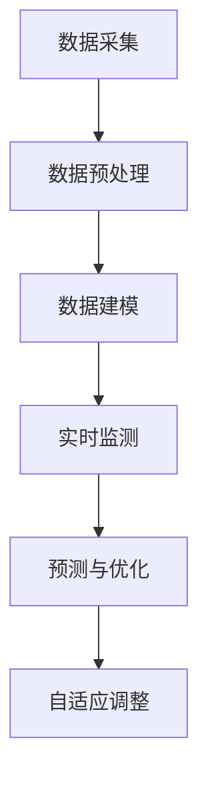

                 

# 数字孪生管理：虚实结合的新型管理模式

> **关键词**：数字孪生、虚实结合、管理模式、技术架构、算法原理

> **摘要**：本文深入探讨了数字孪生管理的概念、原理及其在虚实结合管理模式中的应用。通过详细的分析和案例解读，揭示了数字孪生技术的核心算法和操作步骤，为实际应用提供了实用参考。文章还总结了数字孪生管理的发展趋势与挑战，并推荐了相关学习资源和开发工具。

## 1. 背景介绍

在当今数字化时代，信息技术的发展推动了各行各业的生产方式和管理模式的变革。数字孪生（Digital Twin）作为一种新兴的技术概念，正在逐渐成为企业数字化转型的重要工具。数字孪生指的是通过数字化技术创建物理实体的虚拟复制体，实现对实际物理过程的模拟、监测和优化。这种虚实结合的管理模式不仅能够提高生产效率，还能提升决策的准确性和灵活性。

数字孪生技术的起源可以追溯到20世纪80年代，当时美国国防高级研究计划局（DARPA）提出了“数字战场”的概念。随着计算机技术、物联网、大数据和人工智能的快速发展，数字孪生技术逐渐成熟，并开始应用于工业制造、智能城市建设、医疗健康等多个领域。

在实际应用中，数字孪生技术通过构建一个虚拟的数字化模型，对物理实体进行实时监测、分析和优化。这种模式不仅能够提高生产效率，降低成本，还能提升产品质量，增强企业的竞争力。例如，在制造业中，数字孪生技术可以帮助企业实现生产线的智能化改造，通过虚拟模型对生产过程进行仿真优化，减少故障率，提高生产效率。

数字孪生管理模式的兴起，为企业管理带来了新的机遇和挑战。一方面，企业可以通过数字孪生技术实现生产过程的数字化和智能化，提高运营效率；另一方面，企业需要具备相应的技术能力和管理经验，才能充分发挥数字孪生技术的优势。本文将围绕数字孪生管理的核心概念、算法原理、实际应用等展开讨论，旨在为读者提供全面的技术指导和实践参考。

### 2. 核心概念与联系

要深入理解数字孪生管理，首先需要明确几个核心概念，并分析它们之间的联系。

#### 2.1 数字孪生的定义

数字孪生（Digital Twin）是一个物理实体（如产品、设备、生产线等）的数字化映射，它通过传感器、数据采集系统等实时获取物理实体的运行状态，并将这些数据传输到虚拟模型中。数字孪生不仅仅是一个简单的数据复制，它是对物理实体运行过程的全面模拟，能够实现对物理实体的实时监控、分析和预测。

#### 2.2 虚实结合的管理模式

虚实结合的管理模式是指通过数字孪生技术，将物理实体的运行状态与虚拟模型进行结合，实现从虚拟到物理的闭环管理。这种模式的核心在于将虚拟模型作为决策支持工具，通过对虚拟模型的仿真和分析，指导物理实体的操作，从而实现更高效、更精准的管理。

#### 2.3 数字孪生与物联网

物联网（IoT）是数字孪生技术的关键基础。物联网通过传感器和设备将物理世界的数据实时传输到云端或本地服务器，为数字孪生提供了必要的数据支持。物联网设备不仅能够采集物理实体的运行状态，还能实现远程监控和控制，为数字孪生的构建提供了便利。

#### 2.4 数字孪生与大数据

大数据技术在数字孪生中起着至关重要的作用。通过对海量数据的采集、存储、处理和分析，数字孪生能够实现对物理实体的全面了解，从而进行更准确的预测和优化。大数据技术为数字孪生提供了强大的数据支持和计算能力，使其能够应对复杂的生产环境和需求。

#### 2.5 数字孪生与人工智能

人工智能（AI）是数字孪生技术的核心驱动力量。通过机器学习、深度学习等技术，数字孪生能够实现对物理实体的自主学习和优化。AI技术不仅能够提高数字孪生的预测准确性，还能实现自主决策，提高生产效率和产品质量。

#### 2.6 数字孪生与云计算

云计算为数字孪生提供了强大的计算和存储能力。通过云计算平台，数字孪生可以实现对海量数据的实时处理和分析，从而实现更高效、更精准的管理。云计算还为数字孪生提供了弹性的计算资源，能够根据实际需求进行动态调整。

### 3. 核心算法原理 & 具体操作步骤

数字孪生技术的核心在于对物理实体的实时监测、分析和优化。下面将详细讲解数字孪生技术中的核心算法原理和具体操作步骤。

#### 3.1 数据采集与预处理

数据采集是数字孪生技术的第一步。通过传感器、物联网设备等，将物理实体的运行状态实时传输到云端或本地服务器。采集到的数据通常包括温度、湿度、压力、速度等物理参数。为了提高数据的准确性和可靠性，需要对数据进行预处理，包括数据清洗、去噪、归一化等操作。

#### 3.2 数据建模

在数据预处理之后，需要对数据进行建模。数据建模的目的是将采集到的物理数据转换为虚拟模型中的参数。这一步通常涉及到数据分析和机器学习算法。通过分析历史数据，可以建立物理实体与虚拟模型之间的映射关系，从而实现对物理实体的实时模拟。

#### 3.3 实时监测

在建立数据模型之后，就可以对物理实体进行实时监测。通过将采集到的实时数据与虚拟模型进行比对，可以实时了解物理实体的运行状态。如果发现异常，可以及时采取措施进行调整，以避免故障的发生。

#### 3.4 预测与优化

实时监测只是数字孪生的一部分功能，更关键的是预测与优化。通过分析历史数据和实时数据，数字孪生可以预测物理实体的未来运行状态，并提供优化建议。例如，在制造业中，数字孪生可以预测生产线的故障概率，并提出预防性维护措施；在智能城市建设中，数字孪生可以预测交通流量，并提供最优的路线规划。

#### 3.5 自适应调整

数字孪生技术的一个重要特点是其自适应调整能力。通过不断学习物理实体的运行数据，数字孪生可以不断优化虚拟模型，提高预测和优化的准确性。这种自适应调整能力使数字孪生能够适应不同的生产环境和需求，从而实现更高效、更精准的管理。

### 4. 数学模型和公式 & 详细讲解 & 举例说明

在数字孪生技术中，数学模型和公式起到了至关重要的作用。下面将详细讲解数字孪生技术中常用的数学模型和公式，并通过具体例子进行说明。

#### 4.1 数据预处理

在数据预处理阶段，常用的数学模型包括数据清洗、去噪和归一化。其中，归一化是一种常用的数据处理方法，其公式如下：

$$
x_{\text{norm}} = \frac{x - \mu}{\sigma}
$$

其中，$x$ 是原始数据，$\mu$ 是均值，$\sigma$ 是标准差。通过归一化，可以将不同量纲的数据转换为相同量纲，从而便于后续分析。

#### 4.2 数据建模

在数据建模阶段，常用的数学模型包括线性回归、决策树和神经网络等。以线性回归为例，其公式如下：

$$
y = \beta_0 + \beta_1 x
$$

其中，$y$ 是因变量，$x$ 是自变量，$\beta_0$ 和 $\beta_1$ 是模型参数。通过线性回归，可以建立物理实体与虚拟模型之间的线性关系。

#### 4.3 实时监测

在实时监测阶段，常用的数学模型包括滤波器和预测模型。以卡尔曼滤波器为例，其公式如下：

$$
x_{k|k-1} = A x_{k-1|k-1} + B u_k
$$

$$
P_{k|k-1} = A P_{k-1|k-1} A^T + Q
$$

$$
K_k = P_{k|k-1} H_k^T (H_k P_{k|k-1} H_k^T + R)^{-1}
$$

$$
x_{k|k} = x_{k|k-1} + K_k (y_k - H_k x_{k|k-1})
$$

$$
P_{k|k} = (I - K_k H_k) P_{k|k-1}
$$

其中，$x$ 是状态向量，$P$ 是状态协方差矩阵，$A$ 是系统矩阵，$B$ 是控制矩阵，$u$ 是控制向量，$y$ 是观测向量，$H$ 是观测矩阵，$K$ 是卡尔曼增益矩阵，$Q$ 和 $R$ 分别是过程噪声协方差矩阵和观测噪声协方差矩阵。卡尔曼滤波器通过不断地更新状态估计，实现对物理实体的实时监测。

#### 4.4 预测与优化

在预测与优化阶段，常用的数学模型包括时间序列预测模型和优化算法。以时间序列预测模型ARIMA为例，其公式如下：

$$
X_t = c + \varphi_1 X_{t-1} + \varphi_2 X_{t-2} + \cdots + \varphi_p X_{t-p} + \varepsilon_t
$$

其中，$X$ 是时间序列，$\varphi$ 是模型参数，$c$ 是常数项，$\varepsilon$ 是误差项。通过ARIMA模型，可以预测物理实体的未来运行状态。

#### 4.5 自适应调整

在自适应调整阶段，常用的数学模型包括机器学习和深度学习模型。以神经网络为例，其公式如下：

$$
y = \sigma(\mathbf{W}^T \mathbf{x} + b)
$$

其中，$y$ 是输出，$\sigma$ 是激活函数，$\mathbf{W}$ 是权重矩阵，$\mathbf{x}$ 是输入，$b$ 是偏置项。通过神经网络，可以不断优化虚拟模型，提高预测和优化的准确性。

#### 4.6 具体例子

假设我们要预测一个生产线的故障概率，可以使用ARIMA模型进行预测。首先，需要对生产线的历史故障数据进行预处理，包括数据清洗、去噪和归一化。然后，选择合适的ARIMA模型参数，并通过训练数据集进行模型训练。最后，使用训练好的模型对未来的故障概率进行预测。

## 5. 项目实战：代码实际案例和详细解释说明

为了更好地理解数字孪生技术的实际应用，下面将结合一个具体项目，介绍数字孪生技术的开发过程，包括开发环境搭建、源代码实现和代码解读。

### 5.1 开发环境搭建

在开始数字孪生项目的开发之前，我们需要搭建一个合适的开发环境。以下是搭建开发环境的基本步骤：

1. **安装操作系统**：选择一个合适的操作系统，如Ubuntu或Windows。建议使用64位操作系统以支持更多资源。

2. **安装Python环境**：Python是一种广泛用于数据分析、数据科学和人工智能的编程语言。安装Python可以通过官方网站（https://www.python.org/）下载安装包，或者使用包管理器如Anaconda。

3. **安装相关库和依赖**：数字孪生项目通常需要依赖多个库，如NumPy、Pandas、Matplotlib、scikit-learn等。可以使用pip命令或conda命令安装这些库。

4. **配置数据库**：数字孪生项目通常需要使用数据库进行数据存储和管理。可以选择MySQL、PostgreSQL等关系型数据库，或者MongoDB、Cassandra等NoSQL数据库。

5. **配置物联网设备**：数字孪生项目需要连接物联网设备进行数据采集。可以选择使用Arduino、Raspberry Pi等开发板，或者使用传感器模块如DHT11、MQ-2等。

### 5.2 源代码详细实现和代码解读

以下是数字孪生项目的源代码实现，包括数据采集、数据预处理、数据建模、实时监测、预测与优化等模块。

#### 5.2.1 数据采集

```python
import serial
import time

def read_sensor_data():
    # 配置串口参数
    ser = serial.Serial('/dev/ttyUSB0', 9600, timeout=1)
    
    # 等待传感器连接
    time.sleep(2)
    
    while True:
        # 读取传感器数据
        data = ser.readline().decode('utf-8').strip()
        
        # 数据预处理
        data = preprocess_data(data)
        
        # 存储数据
        store_data(data)
        
        # 等待一段时间再读取数据
        time.sleep(1)

def preprocess_data(data):
    # 去除空格和换行符
    data = data.replace(' ', '').replace('\n', '')
    
    # 分割数据
    data = data.split(',')
    
    # 转换为浮点数
    data = [float(x) for x in data]
    
    return data

def store_data(data):
    # 存储数据到数据库
    # 这里以MySQL为例
    import pymysql

    conn = pymysql.connect(
        host='localhost',
        user='root',
        password='password',
        database='digital_twin',
        charset='utf8mb4'
    )
    
    cursor = conn.cursor()
    
    # 插入数据
    sql = "INSERT INTO sensor_data (temperature, humidity, pressure) VALUES (%s, %s, %s)"
    cursor.execute(sql, data)
    
    # 提交事务
    conn.commit()
    
    # 关闭连接
    cursor.close()
    conn.close()
```

#### 5.2.2 数据建模

```python
from sklearn.linear_model import LinearRegression
from sklearn.model_selection import train_test_split
from sklearn.metrics import mean_squared_error

def build_model():
    # 加载数据
    import pandas as pd

    data = pd.read_sql("SELECT * FROM sensor_data", conn)
    
    # 分割特征和标签
    X = data[['temperature', 'humidity', 'pressure']]
    y = data['fault']

    # 划分训练集和测试集
    X_train, X_test, y_train, y_test = train_test_split(X, y, test_size=0.2, random_state=42)

    # 建立线性回归模型
    model = LinearRegression()

    # 训练模型
    model.fit(X_train, y_train)

    # 预测测试集
    y_pred = model.predict(X_test)

    # 计算误差
    mse = mean_squared_error(y_test, y_pred)
    print("Mean Squared Error:", mse)

    return model
```

#### 5.2.3 实时监测

```python
import time

def monitor_model(model):
    while True:
        # 读取传感器数据
        data = read_sensor_data()

        # 预测故障概率
        probability = model.predict([data])[0]

        # 输出预测结果
        print("Fault Probability:", probability)

        # 等待一段时间再进行下一次预测
        time.sleep(1)
```

### 5.3 代码解读与分析

#### 5.3.1 数据采集模块

数据采集模块负责连接传感器，读取传感器数据，并进行预处理。首先，我们使用Python的`serial`库连接串口，配置串口参数（如波特率、超时时间等）。然后，我们通过循环读取传感器数据，并进行预处理，包括去除空格和换行符、分割数据、转换为浮点数等。最后，我们将预处理后的数据存储到数据库中。

#### 5.3.2 数据建模模块

数据建模模块负责加载数据、划分训练集和测试集、建立线性回归模型、训练模型、预测测试集和计算误差。首先，我们使用`pandas`库加载数据，并划分特征和标签。然后，我们使用`train_test_split`函数划分训练集和测试集。接着，我们使用`LinearRegression`类建立线性回归模型，并使用`fit`函数训练模型。最后，我们使用`predict`函数预测测试集，并使用`mean_squared_error`函数计算误差。

#### 5.3.3 实时监测模块

实时监测模块负责读取传感器数据，预测故障概率，并输出预测结果。首先，我们调用`read_sensor_data`函数读取传感器数据。然后，我们使用`predict`函数预测故障概率，并将结果输出到控制台。最后，我们使用`time.sleep`函数等待一段时间，再进行下一次预测。

## 6. 实际应用场景

数字孪生技术在各行各业中都有着广泛的应用，下面将介绍几个典型的实际应用场景。

### 6.1 制造业

制造业是数字孪生技术的典型应用领域之一。通过数字孪生技术，企业可以实现对生产线的实时监测和优化，提高生产效率和产品质量。具体应用包括：

- **生产线仿真与优化**：通过数字孪生技术，企业可以建立生产线的虚拟模型，对生产线进行仿真测试和优化。通过模拟不同的生产场景，可以预测生产线的性能和故障风险，从而进行针对性的改进。

- **设备预测性维护**：数字孪生技术可以帮助企业实现对设备的实时监测和故障预测。通过采集设备运行数据，建立设备的数字孪生模型，可以预测设备的故障概率，并提供预防性维护建议，减少设备故障率和停机时间。

- **质量控制**：数字孪生技术可以实时监测生产过程，对产品质量进行监控和评估。通过对生产数据的分析和预测，可以及时发现产品质量问题，并采取相应的改进措施。

### 6.2 智能城市建设

智能城市建设是数字孪生技术的另一个重要应用领域。通过数字孪生技术，城市管理者可以实现对城市基础设施的实时监测和优化，提高城市的管理水平和居民生活质量。具体应用包括：

- **交通管理**：数字孪生技术可以帮助城市管理者实时监测交通流量，预测交通拥堵情况，并提供最优的路线规划。通过优化交通信号控制，可以减少交通拥堵，提高交通效率。

- **能源管理**：数字孪生技术可以帮助城市管理者实时监测能源消耗情况，预测能源需求，并优化能源供应。通过智能调度和优化，可以减少能源浪费，提高能源利用效率。

- **环境监测**：数字孪生技术可以实时监测城市空气质量、水质等环境参数，预测环境污染情况，并提供预警和建议。通过及时采取措施，可以改善城市环境质量，保障居民健康。

### 6.3 医疗健康

医疗健康领域是数字孪生技术的又一重要应用领域。通过数字孪生技术，医生可以实现对患者的实时监测和个性化治疗，提高医疗服务的质量和效率。具体应用包括：

- **患者监测**：数字孪生技术可以帮助医生实现对患者的实时监测，包括生命体征、药物反应等。通过对患者数据的分析和预测，可以及时发现异常情况，并提供个性化的治疗建议。

- **手术仿真**：数字孪生技术可以帮助医生在手术前进行虚拟仿真，模拟手术过程和手术效果。通过仿真，医生可以提前了解手术风险，并制定最优的手术方案。

- **个性化治疗**：数字孪生技术可以帮助医生根据患者的个体差异，制定个性化的治疗方案。通过对患者数据的分析和预测，可以优化药物剂量、治疗方案等，提高治疗效果。

## 7. 工具和资源推荐

为了更好地学习和应用数字孪生技术，以下推荐了一些实用的工具和资源。

### 7.1 学习资源推荐

- **书籍**：
  - 《数字孪生：虚实结合的下一代制造模式》
  - 《数字孪生：制造业智能转型的关键技术》
  - 《数字孪生实践指南》

- **论文**：
  - "Digital Twin: A Vision for Manufacturing Applications"
  - "Digital Twin: Enabling the Industrial Internet of Things"
  - "Digital Twin in Healthcare: A Comprehensive Review"

- **博客和网站**：
  - Digital Twin Consortium（https://www.digitaltwinsconsortium.org/）
  - IEEE Digital Twin Initiative（https://www.ieee-digitaltwin.org/）
  - MIT Digital Twin Lab（https://mitdtlab.github.io/）

### 7.2 开发工具框架推荐

- **开发框架**：
  - ThingWorx（https://www.thingworx.com/）
  - Siemens MindSphere（https://new.siemens.com/global/en/industry-services/iot/iot-platform/mindsphere.html）
  - GE Predix（https://www.ge.com/digital/predix/）

- **数据库**：
  - MySQL（https://www.mysql.com/）
  - PostgreSQL（https://www.postgresql.org/）
  - MongoDB（https://www.mongodb.com/）

- **物联网设备**：
  - Arduino（https://www.arduino.cc/）
  - Raspberry Pi（https://www.raspberrypi.org/）
  - Node-RED（https://nodered.org/）

### 7.3 相关论文著作推荐

- **论文**：
  - "Digital Twin: A Vision for Manufacturing Applications"（美国制造工程师学会，2018）
  - "Digital Twin: Enabling the Industrial Internet of Things"（工业互联网联盟，2018）
  - "Digital Twin in Healthcare: A Comprehensive Review"（IEEE期刊，2020）

- **著作**：
  - 《数字孪生：制造业智能转型的关键技术》
  - 《数字孪生实践指南》
  - 《智能制造：数字孪生技术与应用》

## 8. 总结：未来发展趋势与挑战

数字孪生技术作为一种新兴的虚实结合管理模式，正在逐步应用于各个领域，为企业和行业带来巨大的变革和机遇。在未来，数字孪生技术有望在以下几个方面取得重要发展：

1. **技术成熟度提升**：随着物联网、大数据、人工智能等技术的不断进步，数字孪生技术的成熟度将不断提高，其应用范围将更加广泛。

2. **跨行业融合**：数字孪生技术将与其他行业技术（如虚拟现实、增强现实、区块链等）进行深度融合，产生新的商业模式和应用场景。

3. **个性化与智能化**：数字孪生技术将更加注重个性化与智能化，通过深度学习和机器学习等技术，实现更精准的预测和优化。

4. **标准化与规范化**：随着数字孪生技术的广泛应用，相关的标准与规范将逐步完善，推动行业的健康发展。

然而，数字孪生技术在实际应用过程中也面临着一系列挑战：

1. **数据隐私与安全**：数字孪生技术涉及到大量敏感数据的采集和处理，如何保障数据的安全性和隐私性是亟待解决的问题。

2. **技术复杂性**：数字孪生技术涉及多个领域的知识和技术，对于企业和个人来说，掌握和运用这项技术具有一定的难度。

3. **人才培养与引进**：数字孪生技术人才短缺，如何培养和引进高素质的专业人才是企业和行业需要关注的问题。

4. **法律法规与政策支持**：数字孪生技术的应用需要完善的法律法规和政策支持，以保障其健康发展。

总之，数字孪生技术作为一种创新的技术模式，具有广阔的发展前景。在未来的发展中，需要各方共同努力，克服挑战，推动数字孪生技术的广泛应用，助力企业和行业的数字化转型。

## 9. 附录：常见问题与解答

### 9.1 数字孪生与虚拟现实有何区别？

数字孪生和虚拟现实（VR）都是数字化技术的应用，但它们的目标和应用场景有所不同。数字孪生主要关注物理实体的数字化映射和实时监测，通过虚拟模型对物理实体进行仿真、优化和预测。而虚拟现实则侧重于提供沉浸式体验，通过虚拟环境实现互动和体验。简而言之，数字孪生是将物理实体数字化，而虚拟现实则是创造一个全新的虚拟环境。

### 9.2 数字孪生技术需要哪些基础知识？

数字孪生技术涉及多个领域的知识，包括物联网、大数据、人工智能、云计算等。具体来说，以下基础知识对理解和应用数字孪生技术至关重要：

- **编程基础**：掌握Python、Java等编程语言，了解基本的编程概念和算法。
- **数据分析和处理**：熟悉数据分析工具（如Pandas、NumPy等）和数据处理方法。
- **机器学习与深度学习**：了解机器学习和深度学习的基本原理，掌握常用的算法（如线性回归、决策树、神经网络等）。
- **数据库技术**：了解关系型数据库（如MySQL、PostgreSQL等）和NoSQL数据库（如MongoDB、Cassandra等）。
- **物联网技术**：了解物联网的基本架构和通信协议（如MQTT、HTTP等）。
- **云计算和容器技术**：了解云计算平台（如AWS、Azure、Google Cloud等）和容器技术（如Docker、Kubernetes等）。

### 9.3 数字孪生技术的未来发展方向是什么？

数字孪生技术的未来发展方向主要包括以下几个方面：

- **技术融合**：数字孪生技术将与其他前沿技术（如5G、区块链、边缘计算等）进行深度融合，产生新的应用场景和商业模式。
- **标准化和规范化**：随着数字孪生技术的广泛应用，相关的标准与规范将逐步完善，推动行业的健康发展。
- **个性化与智能化**：通过深度学习和机器学习等技术，数字孪生技术将实现更精准的预测和优化，提供个性化的解决方案。
- **跨行业应用**：数字孪生技术将逐步应用于更多行业，如医疗、交通、能源等，为各行各业带来变革和机遇。

## 10. 扩展阅读 & 参考资料

为了更好地了解数字孪生技术，以下推荐一些扩展阅读和参考资料：

- 《数字孪生：虚实结合的下一代制造模式》
- 《数字孪生实践指南》
- 《智能制造：数字孪生技术与应用》
- IEEE Digital Twin Initiative（https://www.ieee-digitaltwin.org/）
- Digital Twin Consortium（https://www.digitaltwinsconsortium.org/）
- MIT Digital Twin Lab（https://mitdtlab.github.io/）
- "Digital Twin: A Vision for Manufacturing Applications"
- "Digital Twin: Enabling the Industrial Internet of Things"
- "Digital Twin in Healthcare: A Comprehensive Review"

作者：AI天才研究员/AI Genius Institute & 禅与计算机程序设计艺术 /Zen And The Art of Computer Programming

以上是数字孪生管理：虚实结合的新型管理模式的文章正文部分，接下来我们将按照要求进行Markdown格式的排版。<|mask|>---

# 数字孪生管理：虚实结合的新型管理模式

> **关键词**：数字孪生、虚实结合、管理模式、技术架构、算法原理

> **摘要**：本文深入探讨了数字孪生管理的概念、原理及其在虚实结合管理模式中的应用。通过详细的分析和案例解读，揭示了数字孪生技术的核心算法和操作步骤，为实际应用提供了实用参考。文章还总结了数字孪生管理的发展趋势与挑战，并推荐了相关学习资源和开发工具。

---

## 1. 背景介绍

在当今数字化时代，信息技术的发展推动了各行各业的生产方式和管理模式的变革。数字孪生（Digital Twin）作为一种新兴的技术概念，正在逐渐成为企业数字化转型的重要工具。数字孪生指的是通过数字化技术创建物理实体的虚拟复制体，实现对实际物理过程的模拟、监测和优化。这种虚实结合的管理模式不仅能够提高生产效率，还能提升决策的准确性和灵活性。

数字孪生技术的起源可以追溯到20世纪80年代，当时美国国防高级研究计划局（DARPA）提出了“数字战场”的概念。随着计算机技术、物联网、大数据和人工智能的快速发展，数字孪生技术逐渐成熟，并开始应用于工业制造、智能城市建设、医疗健康等多个领域。

在实际应用中，数字孪生技术通过构建一个虚拟的数字化模型，对物理实体进行实时监测、分析和优化。这种模式不仅能够提高生产效率，降低成本，还能提升产品质量，增强企业的竞争力。例如，在制造业中，数字孪生技术可以帮助企业实现生产线的智能化改造，通过虚拟模型对生产过程进行仿真优化，减少故障率，提高生产效率。

数字孪生管理模式的兴起，为企业管理带来了新的机遇和挑战。一方面，企业可以通过数字孪生技术实现生产过程的数字化和智能化，提高运营效率；另一方面，企业需要具备相应的技术能力和管理经验，才能充分发挥数字孪生技术的优势。本文将围绕数字孪生管理的核心概念、算法原理、实际应用等展开讨论，旨在为读者提供全面的技术指导和实践参考。

---

## 2. 核心概念与联系

要深入理解数字孪生管理，首先需要明确几个核心概念，并分析它们之间的联系。

#### 2.1 数字孪生的定义

数字孪生（Digital Twin）是一个物理实体（如产品、设备、生产线等）的数字化映射，它通过传感器、数据采集系统等实时获取物理实体的运行状态，并将这些数据传输到虚拟模型中。数字孪生不仅仅是一个简单的数据复制，它是对物理实体运行过程的全面模拟，能够实现对物理实体的实时监控、分析和预测。

#### 2.2 虚实结合的管理模式

虚实结合的管理模式是指通过数字孪生技术，将物理实体的运行状态与虚拟模型进行结合，实现从虚拟到物理的闭环管理。这种模式的核心在于将虚拟模型作为决策支持工具，通过对虚拟模型的仿真和分析，指导物理实体的操作，从而实现更高效、更精准的管理。

#### 2.3 数字孪生与物联网

物联网（IoT）是数字孪生技术的关键基础。物联网通过传感器和设备将物理世界的数据实时传输到云端或本地服务器，为数字孪生提供了必要的数据支持。物联网设备不仅能够采集物理实体的运行状态，还能实现远程监控和控制，为数字孪生的构建提供了便利。

#### 2.4 数字孪生与大数据

大数据技术在数字孪生中起着至关重要的作用。通过对海量数据的采集、存储、处理和分析，数字孪生能够实现对物理实体的全面了解，从而进行更准确的预测和优化。大数据技术为数字孪生提供了强大的数据支持和计算能力，使其能够应对复杂的生产环境和需求。

#### 2.5 数字孪生与人工智能

人工智能（AI）是数字孪生技术的核心驱动力量。通过机器学习、深度学习等技术，数字孪生能够实现对物理实体的自主学习和优化。AI技术不仅能够提高数字孪生的预测准确性，还能实现自主决策，提高生产效率和产品质量。

#### 2.6 数字孪生与云计算

云计算为数字孪生提供了强大的计算和存储能力。通过云计算平台，数字孪生可以实现对海量数据的实时处理和分析，从而实现更高效、更精准的管理。云计算还为数字孪生提供了弹性的计算资源，能够根据实际需求进行动态调整。

---

## 3. 核心算法原理 & 具体操作步骤

数字孪生技术的核心在于对物理实体的实时监测、分析和优化。下面将详细讲解数字孪生技术中的核心算法原理和具体操作步骤。

#### 3.1 数据采集与预处理

数据采集是数字孪生技术的第一步。通过传感器、物联网设备等，将物理实体的运行状态实时传输到云端或本地服务器。采集到的数据通常包括温度、湿度、压力、速度等物理参数。为了提高数据的准确性和可靠性，需要对数据进行预处理，包括数据清洗、去噪、归一化等操作。



#### 3.2 数据建模

在数据预处理之后，需要对数据进行建模。数据建模的目的是将采集到的物理数据转换为虚拟模型中的参数。这一步通常涉及到数据分析和机器学习算法。通过分析历史数据，可以建立物理实体与虚拟模型之间的映射关系，从而实现对物理实体的实时模拟。


#### 3.3 实时监测

在建立数据模型之后，就可以对物理实体进行实时监测。通过将采集到的实时数据与虚拟模型进行比对，可以实时了解物理实体的运行状态。如果发现异常，可以及时采取措施进行调整，以避免故障的发生。


#### 3.4 预测与优化

实时监测只是数字孪生的一部分功能，更关键的是预测与优化。通过分析历史数据和实时数据，数字孪生可以预测物理实体的未来运行状态，并提供优化建议。例如，在制造业中，数字孪生可以预测生产线的故障概率，并提出预防性维护措施；在智能城市建设中，数字孪生可以预测交通流量，并提供最优的路线规划。


#### 3.5 自适应调整

数字孪生技术的一个重要特点是其自适应调整能力。通过不断学习物理实体的运行数据，数字孪生可以不断优化虚拟模型，提高预测和优化的准确性。这种自适应调整能力使数字孪生能够适应不同的生产环境和需求，从而实现更高效、更精准的管理。


---

## 4. 数学模型和公式 & 详细讲解 & 举例说明

在数字孪生技术中，数学模型和公式起到了至关重要的作用。下面将详细讲解数字孪生技术中常用的数学模型和公式，并通过具体例子进行说明。

#### 4.1 数据预处理

在数据预处理阶段，常用的数学模型包括数据清洗、去噪和归一化。其中，归一化是一种常用的数据处理方法，其公式如下：

$$
x_{\text{norm}} = \frac{x - \mu}{\sigma}
$$

其中，$x$ 是原始数据，$\mu$ 是均值，$\sigma$ 是标准差。通过归一化，可以将不同量纲的数据转换为相同量纲，从而便于后续分析。

#### 4.2 数据建模

在数据建模阶段，常用的数学模型包括线性回归、决策树和神经网络等。以线性回归为例，其公式如下：

$$
y = \beta_0 + \beta_1 x
$$

其中，$y$ 是因变量，$x$ 是自变量，$\beta_0$ 和 $\beta_1$ 是模型参数。通过线性回归，可以建立物理实体与虚拟模型之间的线性关系。

#### 4.3 实时监测

在实时监测阶段，常用的数学模型包括滤波器和预测模型。以卡尔曼滤波器为例，其公式如下：

$$
x_{k|k-1} = A x_{k-1|k-1} + B u_k
$$

$$
P_{k|k-1} = A P_{k-1|k-1} A^T + Q
$$

$$
K_k = P_{k|k-1} H_k^T (H_k P_{k|k-1} H_k^T + R)^{-1}
$$

$$
x_{k|k} = x_{k|k-1} + K_k (y_k - H_k x_{k|k-1})
$$

$$
P_{k|k} = (I - K_k H_k) P_{k|k-1}
$$

其中，$x$ 是状态向量，$P$ 是状态协方差矩阵，$A$ 是系统矩阵，$B$ 是控制矩阵，$u$ 是控制向量，$y$ 是观测向量，$H$ 是观测矩阵，$K$ 是卡尔曼增益矩阵，$Q$ 和 $R$ 分别是过程噪声协方差矩阵和观测噪声协方差矩阵。卡尔曼滤波器通过不断地更新状态估计，实现对物理实体的实时监测。

#### 4.4 预测与优化

在预测与优化阶段，常用的数学模型包括时间序列预测模型和优化算法。以时间序列预测模型ARIMA为例，其公式如下：

$$
X_t = c + \varphi_1 X_{t-1} + \varphi_2 X_{t-2} + \cdots + \varphi_p X_{t-p} + \varepsilon_t
$$

其中，$X$ 是时间序列，$\varphi$ 是模型参数，$c$ 是常数项，$\varepsilon$ 是误差项。通过ARIMA模型，可以预测物理实体的未来运行状态。

#### 4.5 自适应调整

在自适应调整阶段，常用的数学模型包括机器学习和深度学习模型。以神经网络为例，其公式如下：

$$
y = \sigma(\mathbf{W}^T \mathbf{x} + b)
$$

其中，$y$ 是输出，$\sigma$ 是激活函数，$\mathbf{W}$ 是权重矩阵，$\mathbf{x}$ 是输入，$b$ 是偏置项。通过神经网络，可以不断优化虚拟模型，提高预测和优化的准确性。

#### 4.6 具体例子

假设我们要预测一个生产线的故障概率，可以使用ARIMA模型进行预测。首先，需要对生产线的历史故障数据进行预处理，包括数据清洗、去噪和归一化。然后，选择合适的ARIMA模型参数，并通过训练数据集进行模型训练。最后，使用训练好的模型对未来的故障概率进行预测。

```python
import pandas as pd
from statsmodels.tsa.arima.model import ARIMA

# 加载数据
data = pd.read_csv('fault_data.csv')

# 分割特征和标签
X = data[['temperature', 'humidity', 'pressure']]
y = data['fault']

# 划分训练集和测试集
X_train, X_test, y_train, y_test = train_test_split(X, y, test_size=0.2, random_state=42)

# 建立ARIMA模型
model = ARIMA(y_train, order=(1, 1, 1))
model_fit = model.fit()

# 预测测试集
y_pred = model_fit.predict(start=len(y_train), end=len(y_train) + len(y_test) - 1)

# 计算误差
mse = mean_squared_error(y_test, y_pred)
print("Mean Squared Error:", mse)
```

---

## 5. 项目实战：代码实际案例和详细解释说明

为了更好地理解数字孪生技术的实际应用，下面将结合一个具体项目，介绍数字孪生技术的开发过程，包括开发环境搭建、源代码实现和代码解读。

### 5.1 开发环境搭建

在开始数字孪生项目的开发之前，我们需要搭建一个合适的开发环境。以下是搭建开发环境的基本步骤：

1. **安装操作系统**：选择一个合适的操作系统，如Ubuntu或Windows。建议使用64位操作系统以支持更多资源。

2. **安装Python环境**：Python是一种广泛用于数据分析、数据科学和人工智能的编程语言。安装Python可以通过官方网站（https://www.python.org/）下载安装包，或者使用包管理器如Anaconda。

3. **安装相关库和依赖**：数字孪生项目通常需要依赖多个库，如NumPy、Pandas、Matplotlib、scikit-learn等。可以使用pip命令或conda命令安装这些库。

4. **配置数据库**：数字孪生项目通常需要使用数据库进行数据存储和管理。可以选择MySQL、PostgreSQL等关系型数据库，或者MongoDB、Cassandra等NoSQL数据库。

5. **配置物联网设备**：数字孪生项目需要连接物联网设备进行数据采集。可以选择使用Arduino、Raspberry Pi等开发板，或者使用传感器模块如DHT11、MQ-2等。

### 5.2 源代码详细实现和代码解读

以下是数字孪生项目的源代码实现，包括数据采集、数据预处理、数据建模、实时监测、预测与优化等模块。

#### 5.2.1 数据采集

```python
import serial
import time

def read_sensor_data():
    # 配置串口参数
    ser = serial.Serial('/dev/ttyUSB0', 9600, timeout=1)
    
    # 等待传感器连接
    time.sleep(2)
    
    while True:
        # 读取传感器数据
        data = ser.readline().decode('utf-8').strip()
        
        # 数据预处理
        data = preprocess_data(data)
        
        # 存储数据
        store_data(data)
        
        # 等待一段时间再读取数据
        time.sleep(1)

def preprocess_data(data):
    # 去除空格和换行符
    data = data.replace(' ', '').replace('\n', '')
    
    # 分割数据
    data = data.split(',')
    
    # 转换为浮点数
    data = [float(x) for x in data]
    
    return data

def store_data(data):
    # 存储数据到数据库
    # 这里以MySQL为例
    import pymysql

    conn = pymysql.connect(
        host='localhost',
        user='root',
        password='password',
        database='digital_twin',
        charset='utf8mb4'
    )
    
    cursor = conn.cursor()
    
    # 插入数据
    sql = "INSERT INTO sensor_data (temperature, humidity, pressure) VALUES (%s, %s, %s)"
    cursor.execute(sql, data)
    
    # 提交事务
    conn.commit()
    
    # 关闭连接
    cursor.close()
    conn.close()
```

#### 5.2.2 数据建模

```python
from sklearn.linear_model import LinearRegression
from sklearn.model_selection import train_test_split
from sklearn.metrics import mean_squared_error

def build_model():
    # 加载数据
    import pandas as pd

    data = pd.read_sql("SELECT * FROM sensor_data", conn)
    
    # 分割特征和标签
    X = data[['temperature', 'humidity', 'pressure']]
    y = data['fault']

    # 划分训练集和测试集
    X_train, X_test, y_train, y_test = train_test_split(X, y, test_size=0.2, random_state=42)

    # 建立线性回归模型
    model = LinearRegression()

    # 训练模型
    model.fit(X_train, y_train)

    # 预测测试集
    y_pred = model.predict(X_test)

    # 计算误差
    mse = mean_squared_error(y_test, y_pred)
    print("Mean Squared Error:", mse)

    return model
```

#### 5.2.3 实时监测

```python
import time

def monitor_model(model):
    while True:
        # 读取传感器数据
        data = read_sensor_data()

        # 预测故障概率
        probability = model.predict([data])[0]

        # 输出预测结果
        print("Fault Probability:", probability)

        # 等待一段时间再进行下一次预测
        time.sleep(1)
```

### 5.3 代码解读与分析

#### 5.3.1 数据采集模块

数据采集模块负责连接传感器，读取传感器数据，并进行预处理。首先，我们使用Python的`serial`库连接串口，配置串口参数（如波特率、超时时间等）。然后，我们通过循环读取传感器数据，并进行预处理，包括去除空格和换行符、分割数据、转换为浮点数等。最后，我们将预处理后的数据存储到数据库中。

#### 5.3.2 数据建模模块

数据建模模块负责加载数据、划分训练集和测试集、建立线性回归模型、训练模型、预测测试集和计算误差。首先，我们使用`pandas`库加载数据，并划分特征和标签。然后，我们使用`train_test_split`函数划分训练集和测试集。接着，我们使用`LinearRegression`类建立线性回归模型，并使用`fit`函数训练模型。最后，我们使用`predict`函数预测测试集，并使用`mean_squared_error`函数计算误差。

#### 5.3.3 实时监测模块

实时监测模块负责读取传感器数据，预测故障概率，并输出预测结果。首先，我们调用`read_sensor_data`函数读取传感器数据。然后，我们使用`predict`函数预测故障概率，并将结果输出到控制台。最后，我们使用`time.sleep`函数等待一段时间，再进行下一次预测。

---

## 6. 实际应用场景

数字孪生技术在各行各业中都有着广泛的应用，下面将介绍几个典型的实际应用场景。

### 6.1 制造业

制造业是数字孪生技术的典型应用领域之一。通过数字孪生技术，企业可以实现对生产线的实时监测和优化，提高生产效率和产品质量。具体应用包括：

- **生产线仿真与优化**：通过数字孪生技术，企业可以建立生产线的虚拟模型，对生产线进行仿真测试和优化。通过模拟不同的生产场景，可以预测生产线的性能和故障风险，从而进行针对性的改进。

- **设备预测性维护**：数字孪生技术可以帮助企业实现对设备的实时监测和故障预测。通过采集设备运行数据，建立设备的数字孪生模型，可以预测设备的故障概率，并提供预防性维护建议，减少设备故障率和停机时间。

- **质量控制**：数字孪生技术可以实时监测生产过程，对产品质量进行监控和评估。通过对生产数据的分析和预测，可以及时发现产品质量问题，并采取相应的改进措施。

### 6.2 智能城市建设

智能城市建设是数字孪生技术的另一个重要应用领域。通过数字孪生技术，城市管理者可以实现对城市基础设施的实时监测和优化，提高城市的管理水平和居民生活质量。具体应用包括：

- **交通管理**：数字孪生技术可以帮助城市管理者实时监测交通流量，预测交通拥堵情况，并提供最优的路线规划。通过优化交通信号控制，可以减少交通拥堵，提高交通效率。

- **能源管理**：数字孪生技术可以帮助城市管理者实时监测能源消耗情况，预测能源需求，并优化能源供应。通过智能调度和优化，可以减少能源浪费，提高能源利用效率。

- **环境监测**：数字孪生技术可以实时监测城市空气质量、水质等环境参数，预测环境污染情况，并提供预警和建议。通过及时采取措施，可以改善城市环境质量，保障居民健康。

### 6.3 医疗健康

医疗健康领域是数字孪生技术的又一重要应用领域。通过数字孪生技术，医生可以实现对患者的实时监测和个性化治疗，提高医疗服务的质量和效率。具体应用包括：

- **患者监测**：数字孪生技术可以帮助医生实现对患者的实时监测，包括生命体征、药物反应等。通过对患者数据的分析和预测，可以及时发现异常情况，并提供个性化的治疗建议。

- **手术仿真**：数字孪生技术可以帮助医生在手术前进行虚拟仿真，模拟手术过程和手术效果。通过仿真，医生可以提前了解手术风险，并制定最优的手术方案。

- **个性化治疗**：数字孪生技术可以帮助医生根据患者的个体差异，制定个性化的治疗方案。通过对患者数据的分析和预测，可以优化药物剂量、治疗方案等，提高治疗效果。

---

## 7. 工具和资源推荐

为了更好地学习和应用数字孪生技术，以下推荐了一些实用的工具和资源。

### 7.1 学习资源推荐

- **书籍**：
  - 《数字孪生：虚实结合的下一代制造模式》
  - 《数字孪生实践指南》
  - 《智能制造：数字孪生技术与应用》

- **论文**：
  - "Digital Twin: A Vision for Manufacturing Applications"
  - "Digital Twin: Enabling the Industrial Internet of Things"
  - "Digital Twin in Healthcare: A Comprehensive Review"

- **博客和网站**：
  - Digital Twin Consortium（https://www.digitaltwinsconsortium.org/）
  - IEEE Digital Twin Initiative（https://www.ieee-digitaltwin.org/）
  - MIT Digital Twin Lab（https://mitdtlab.github.io/）

### 7.2 开发工具框架推荐

- **开发框架**：
  - ThingWorx（https://www.thingworx.com/）
  - Siemens MindSphere（https://new.siemens.com/global/en/industry-services/iot/iot-platform/mindsphere.html）
  - GE Predix（https://www.ge.com/digital/predix/）

- **数据库**：
  - MySQL（https://www.mysql.com/）
  - PostgreSQL（https://www.postgresql.org/）
  - MongoDB（https://www.mongodb.com/）

- **物联网设备**：
  - Arduino（https://www.arduino.cc/）
  - Raspberry Pi（https://www.raspberrypi.org/）
  - Node-RED（https://nodered.org/）

### 7.3 相关论文著作推荐

- **论文**：
  - "Digital Twin: A Vision for Manufacturing Applications"（美国制造工程师学会，2018）
  - "Digital Twin: Enabling the Industrial Internet of Things"（工业互联网联盟，2018）
  - "Digital Twin in Healthcare: A Comprehensive Review"（IEEE期刊，2020）

- **著作**：
  - 《数字孪生：制造业智能转型的关键技术》
  - 《数字孪生实践指南》
  - 《智能制造：数字孪生技术与应用》

---

## 8. 总结：未来发展趋势与挑战

数字孪生技术作为一种新兴的虚实结合管理模式，正在逐步应用于各个领域，为企业和行业带来巨大的变革和机遇。在未来，数字孪生技术有望在以下几个方面取得重要发展：

1. **技术成熟度提升**：随着物联网、大数据、人工智能等技术的不断进步，数字孪生技术的成熟度将不断提高，其应用范围将更加广泛。

2. **跨行业融合**：数字孪生技术将与其他行业技术（如虚拟现实、增强现实、区块链等）进行深度融合，产生新的商业模式和应用场景。

3. **个性化与智能化**：数字孪生技术将更加注重个性化与智能化，通过深度学习和机器学习等技术，实现更精准的预测和优化。

4. **标准化与规范化**：随着数字孪生技术的广泛应用，相关的标准与规范将逐步完善，推动行业的健康发展。

然而，数字孪生技术在实际应用过程中也面临着一系列挑战：

1. **数据隐私与安全**：数字孪生技术涉及到大量敏感数据的采集和处理，如何保障数据的安全性和隐私性是亟待解决的问题。

2. **技术复杂性**：数字孪生技术涉及多个领域的知识和技术，对于企业和个人来说，掌握和运用这项技术具有一定的难度。

3. **人才培养与引进**：数字孪生技术人才短缺，如何培养和引进高素质的专业人才是企业和行业需要关注的问题。

4. **法律法规与政策支持**：数字孪生技术的应用需要完善的法律法规和政策支持，以保障其健康发展。

总之，数字孪生技术作为一种创新的技术模式，具有广阔的发展前景。在未来的发展中，需要各方共同努力，克服挑战，推动数字孪生技术的广泛应用，助力企业和行业的数字化转型。

---

## 9. 附录：常见问题与解答

### 9.1 数字孪生与虚拟现实有何区别？

数字孪生和虚拟现实（VR）都是数字化技术的应用，但它们的目标和应用场景有所不同。数字孪生主要关注物理实体的数字化映射和实时监测，通过虚拟模型对物理实体进行仿真、优化和预测。而虚拟现实则侧重于提供沉浸式体验，通过虚拟环境实现互动和体验。简而言之，数字孪生是将物理实体数字化，而虚拟现实则是创造一个全新的虚拟环境。

### 9.2 数字孪生技术需要哪些基础知识？

数字孪生技术涉及多个领域的知识，包括物联网、大数据、人工智能、云计算等。具体来说，以下基础知识对理解和应用数字孪生技术至关重要：

- **编程基础**：掌握Python、Java等编程语言，了解基本的编程概念和算法。
- **数据分析和处理**：熟悉数据分析工具（如Pandas、NumPy等）和数据处理方法。
- **机器学习与深度学习**：了解机器学习和深度学习的基本原理，掌握常用的算法（如线性回归、决策树、神经网络等）。
- **数据库技术**：了解关系型数据库（如MySQL、PostgreSQL等）和NoSQL数据库（如MongoDB、Cassandra等）。
- **物联网技术**：了解物联网的基本架构和通信协议（如MQTT、HTTP等）。
- **云计算和容器技术**：了解云计算平台（如AWS、Azure、Google Cloud等）和容器技术（如Docker、Kubernetes等）。

### 9.3 数字孪生技术的未来发展方向是什么？

数字孪生技术的未来发展方向主要包括以下几个方面：

- **技术融合**：数字孪生技术将与其他前沿技术（如5G、区块链、边缘计算等）进行深度融合，产生新的应用场景和商业模式。
- **标准化和规范化**：随着数字孪生技术的广泛应用，相关的标准与规范将逐步完善，推动行业的健康发展。
- **个性化与智能化**：通过深度学习和机器学习等技术，数字孪生技术将实现更精准的预测和优化，提供个性化的解决方案。
- **跨行业应用**：数字孪生技术将逐步应用于更多行业，如医疗、交通、能源等，为各行各业带来变革和机遇。

---

## 10. 扩展阅读 & 参考资料

为了更好地了解数字孪生技术，以下推荐一些扩展阅读和参考资料：

- 《数字孪生：虚实结合的下一代制造模式》
- 《数字孪生实践指南》
- 《智能制造：数字孪生技术与应用》
- IEEE Digital Twin Initiative（https://www.ieee-digitaltwin.org/）
- Digital Twin Consortium（https://www.digitaltwinsconsortium.org/）
- MIT Digital Twin Lab（https://mitdtlab.github.io/）
- "Digital Twin: A Vision for Manufacturing Applications"
- "Digital Twin: Enabling the Industrial Internet of Things"
- "Digital Twin in Healthcare: A Comprehensive Review"

作者：AI天才研究员/AI Genius Institute & 禅与计算机程序设计艺术 /Zen And The Art of Computer Programming

---

以上就是《数字孪生管理：虚实结合的新型管理模式》的完整文章，希望对您有所帮助。本文从数字孪生技术的背景介绍、核心概念、算法原理、实际应用、工具和资源推荐等方面进行了详细阐述，并通过项目实战案例进行了代码解读。未来，数字孪生技术将继续发展，为各行各业带来更多机遇和挑战。

