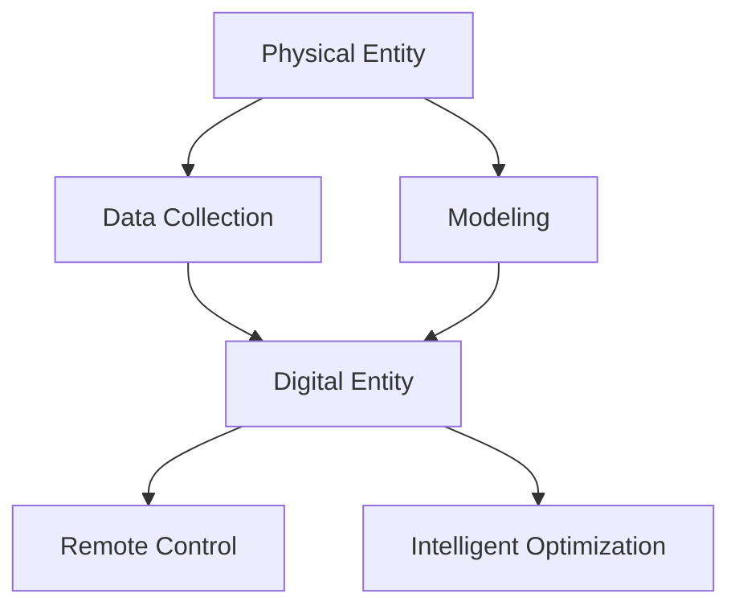

                 

### 背景介绍

在当今数字化转型的浪潮中，数字实体与物理实体的融合正日益成为各行各业关注的焦点。数字实体，通常指的是存在于数字世界中的数据、信息和虚拟对象，如电子文件、数字孪生、虚拟商品等。物理实体，则是我们日常生活中可见可触摸的实体对象，如机器、设备、建筑物等。两者的结合，不仅带来了新的商业模式，也催生了众多创新技术和应用场景。

数字实体与物理实体的自动化前景，主要表现在以下几个方面：

1. **智能制造**：通过数字实体模拟和监控物理实体的运行状态，可以实现生产过程的自动化、智能化，从而提高生产效率和质量。

2. **物联网**：物联网（IoT）技术的快速发展，使得物理实体能够通过传感器和数据连接到互联网，形成海量数据的收集、传输和处理，为数字实体提供了丰富的数据来源。

3. **智慧城市**：数字实体与物理实体的融合，有助于构建智慧城市，实现交通、能源、环境等领域的智能化管理。

4. **远程操作与控制**：通过数字实体对物理实体的远程监控和控制，可以实现远程医疗、无人机巡检、自动驾驶等应用。

5. **数据驱动决策**：利用数字实体和物理实体的数据，可以更准确地预测市场趋势、用户需求，从而支持更科学的决策。

本文将深入探讨数字实体与物理实体自动化的核心概念、算法原理、数学模型、项目实战、应用场景、工具推荐以及未来发展趋势与挑战。希望为读者提供一份全面的技术参考，帮助理解这一领域的最新进展和应用前景。

#### Keywords:  
Digital Entity, Physical Entity, Automation, Manufacturing, IoT, Smart City, Remote Control, Data-Driven Decision Making

#### Abstract:  
This article explores the automation prospects of digital entities and physical entities, which are becoming increasingly crucial in today's digital transformation era. We discuss the integration of digital and physical entities across various domains such as manufacturing, IoT, smart cities, remote control, and data-driven decision-making. The article provides a comprehensive overview of the core concepts, algorithms, mathematical models, practical applications, tools, and future trends in this field. Through step-by-step reasoning, we aim to offer readers a deep understanding of the latest advancements and application scenarios in the automation of digital and physical entities.

### 核心概念与联系

在探讨数字实体与物理实体的自动化之前，我们需要明确一些核心概念，并理解它们之间的联系。以下是本文将要讨论的核心概念及其相互关系。

#### 数字实体（Digital Entity）

数字实体是存在于数字世界中的数据、信息和虚拟对象。它们可以是电子文件、数据库记录、虚拟商品、数字孪生等。数字实体通常具有以下几个特点：

1. **可数字化**：数字实体可以以二进制形式存储和传输。
2. **可编程性**：通过算法和编程，可以控制和操作数字实体。
3. **互操作性**：数字实体之间可以通过标准化的协议和数据格式进行通信。

#### 物理实体（Physical Entity）

物理实体是我们日常生活中可见可触摸的实体对象，如机器、设备、建筑物等。物理实体具有以下特点：

1. **物理存在**：物理实体在现实世界中具有物理形态和属性。
2. **有限性**：物理实体在空间和时间上都是有限的。
3. **物理约束**：物理实体受到物理规律的限制，如力学、热力学等。

#### 数字实体与物理实体的联系

数字实体与物理实体之间的联系主要体现在以下几个方面：

1. **数据采集**：物理实体通过传感器、RFID等技术产生数据，这些数据被数字实体采集和处理。
2. **模型建模**：数字实体可以对物理实体进行建模，模拟其运行状态和行为。
3. **远程控制**：通过数字实体，可以实现对物理实体的远程监控和控制。
4. **智能优化**：利用数字实体和物理实体的数据，可以优化物理实体的运行状态和效率。

#### Mermaid 流程图

以下是一个简单的 Mermaid 流程图，展示了数字实体与物理实体之间的联系：



在这个流程图中，物理实体通过数据采集生成数据，这些数据被数字实体采集和处理。数字实体通过建模可以模拟物理实体的运行状态，并通过远程控制对其进行操作。此外，数字实体还可以利用物理实体的数据进行智能优化，提高其运行效率和性能。

通过以上核心概念和流程图的介绍，我们可以更好地理解数字实体与物理实体之间的联系，以及它们在自动化领域中的重要作用。接下来，我们将深入探讨数字实体与物理实体的自动化算法原理、数学模型、项目实战和应用场景。

### 核心算法原理 & 具体操作步骤

#### 1. 数字实体生成与处理

数字实体生成与处理是数字实体与物理实体自动化的基础。具体操作步骤如下：

1. **数据采集**：通过传感器、RFID、物联网设备等采集物理实体的数据，如温度、湿度、位置、速度等。

2. **数据清洗**：对采集到的数据进行分析和处理，去除噪声和异常值，确保数据质量。

3. **数据存储**：将处理后的数据存储在数据库或数据湖中，以便后续处理和分析。

4. **数据建模**：利用机器学习和深度学习算法对数据进行建模，提取特征和规律。

5. **数据可视化**：通过可视化工具将数据呈现为图表、热图等，便于分析和理解。

#### 2. 物理实体建模与仿真

物理实体建模与仿真是为了更好地理解和控制物理实体的运行状态。具体操作步骤如下：

1. **物理实体参数获取**：获取物理实体的关键参数，如重量、体积、摩擦系数等。

2. **建模**：根据物理实体的参数，建立数学模型或物理模型，描述其运行状态和变化规律。

3. **仿真**：利用仿真软件对物理实体进行模拟，观察其在不同条件下的运行状态和性能。

4. **优化**：通过优化算法调整物理实体的参数，提高其运行效率和性能。

#### 3. 数字实体与物理实体的关联

数字实体与物理实体的关联是自动化实现的关键。具体操作步骤如下：

1. **数据同步**：将数字实体的数据与物理实体的数据进行同步，确保两者的一致性。

2. **状态监控**：通过数字实体对物理实体的运行状态进行实时监控，及时发现异常和问题。

3. **远程控制**：利用数字实体对物理实体进行远程操作和控制，如启动、停止、调整参数等。

4. **决策支持**：基于数字实体和物理实体的数据，提供决策支持，优化物理实体的运行状态。

#### 4. 自动化流程实现

自动化流程实现是将数字实体与物理实体有机结合，实现自动化的关键。具体操作步骤如下：

1. **需求分析**：明确自动化流程的需求，如生产流程、物流流程、运维流程等。

2. **流程设计**：设计自动化流程的方案，包括数据采集、处理、建模、控制等环节。

3. **流程实现**：根据流程设计方案，编写代码和配置相关系统，实现自动化流程。

4. **测试与优化**：对自动化流程进行测试，确保其稳定可靠，并根据反馈进行优化调整。

通过以上核心算法原理和具体操作步骤，我们可以实现数字实体与物理实体的自动化。在实际应用中，需要根据具体场景和需求，灵活运用这些算法和技术，实现高效的自动化管理和控制。

### 数学模型和公式 & 详细讲解 & 举例说明

在数字实体与物理实体的自动化过程中，数学模型和公式起到了至关重要的作用。以下我们将详细讲解一些核心的数学模型和公式，并通过具体例子来说明其应用。

#### 1. 传感器数据采集模型

传感器数据采集是自动化系统的基础，以下是一个简单的传感器数据采集模型：

$$
x_t = f(x_{t-1}, u_t, w_t)
$$

其中，$x_t$ 表示第 $t$ 次采集的数据，$u_t$ 表示输入变量（如传感器读数），$w_t$ 表示噪声项。

举例说明：假设我们使用温度传感器采集环境温度数据，输入变量 $u_t$ 为传感器读数，噪声项 $w_t$ 为随机噪声。通过公式计算，我们可以得到每个时刻的温度数据。

#### 2. 数据清洗与去噪模型

在数据采集过程中，往往存在噪声和异常值，我们需要通过数据清洗和去噪模型进行处理：

$$
y_t = \hat{f}(x_t, \theta)
$$

其中，$y_t$ 表示清洗后的数据，$\hat{f}$ 表示去噪函数，$\theta$ 为参数。

举例说明：我们可以使用均值滤波器对温度数据进行去噪，公式如下：

$$
y_t = \frac{1}{N} \sum_{i=1}^{N} x_{t-i}
$$

其中，$N$ 为滤波器的窗口大小。

#### 3. 数字实体建模模型

数字实体建模是利用数学模型描述物理实体的运行状态。以下是一个简单的线性回归模型：

$$
y_t = \theta_0 + \theta_1 x_t + \epsilon_t
$$

其中，$y_t$ 表示物理实体的输出，$x_t$ 表示输入变量，$\theta_0$ 和 $\theta_1$ 为模型参数，$\epsilon_t$ 为误差项。

举例说明：假设我们要预测机器的运行状态，输入变量 $x_t$ 为传感器读数，输出变量 $y_t$ 为机器的状态。通过线性回归模型，我们可以得到预测方程。

#### 4. 物理实体仿真模型

物理实体仿真是通过数学模型模拟物理实体的运行状态。以下是一个简单的物理仿真模型：

$$
\frac{d^2x}{dt^2} = f(x, v, g)
$$

其中，$x$ 表示位置，$v$ 表示速度，$g$ 表示加速度，$f$ 表示物理规律（如牛顿第二定律）。

举例说明：假设我们要模拟一个物体在重力作用下的运动，输入变量 $g$ 为重力加速度，通过公式计算，我们可以得到物体的位置和速度。

#### 5. 数字实体与物理实体的关联模型

数字实体与物理实体的关联模型用于描述两者之间的相互作用。以下是一个简单的线性关联模型：

$$
y_t = \theta_0 + \theta_1 x_t + \theta_2 z_t + \epsilon_t
$$

其中，$y_t$ 表示物理实体的输出，$x_t$ 表示数字实体的输入，$z_t$ 表示外部干扰，$\theta_0$、$\theta_1$ 和 $\theta_2$ 为参数。

举例说明：假设我们要分析机器的运行状态与传感器读数之间的关系，输入变量 $x_t$ 为传感器读数，输出变量 $y_t$ 为机器的状态。通过线性关联模型，我们可以得到关联方程。

通过以上数学模型和公式的讲解，我们可以更好地理解和应用数字实体与物理实体的自动化技术。在实际应用中，需要根据具体场景和需求，灵活选择和调整模型和参数，实现高效的自动化管理和控制。

### 项目实战：代码实际案例和详细解释说明

为了更好地展示数字实体与物理实体的自动化应用，我们将通过一个实际项目案例进行详细讲解。这个项目是一个基于物联网（IoT）的智能温室控制系统，它通过数字实体对物理实体（温室中的植物和设备）进行自动化监控和管理。

#### 1. 开发环境搭建

在开始项目实战之前，我们需要搭建相应的开发环境。以下是一些建议的工具和框架：

- **编程语言**：Python
- **物联网平台**：Arduino、IoT平台（如MQTT）
- **数据库**：MySQL、MongoDB
- **数据分析工具**：Pandas、Matplotlib
- **机器学习库**：Scikit-learn、TensorFlow

#### 2. 源代码详细实现和代码解读

以下是一个简单的智能温室控制系统的源代码实现，主要包括传感器数据采集、数据清洗、数据建模、远程控制等环节。

**传感器数据采集**：
```python
import serial
import time

# 串口通信配置
ser = serial.Serial('/dev/ttyUSB0', 9600, timeout=1)

def read_sensor_data():
    while True:
        try:
            line = ser.readline()
            if line:
                data = line.decode('utf-8').strip()
                print(f"Received: {data}")
                return data
        except Exception as e:
            print(f"Error: {e}")
            break

while True:
    data = read_sensor_data()
    if data:
        # 数据处理和存储
        process_data(data)
        break
```

**数据处理和存储**：
```python
import pandas as pd
import pymysql

def process_data(data):
    # 数据清洗
    df = pd.DataFrame([data.split(',')])
    df.columns = ['Temperature', 'Humidity', 'Light']

    # 数据存储
    connection = pymysql.connect(host='localhost', user='root', password='password', database='iot')
    with connection.cursor() as cursor:
        for index, row in df.iterrows():
            sql = "INSERT INTO sensor_data (temperature, humidity, light) VALUES (%s, %s, %s)"
            cursor.execute(sql, tuple(row))
    connection.commit()
    connection.close()
```

**数据建模和远程控制**：
```python
from sklearn.linear_model import LinearRegression
import requests

# 数据建模
model = LinearRegression()
model.fit(df[['Light']], df['Temperature'])

# 远程控制
def control_device(temperature):
    url = "http://your_iot_device_url/control"
    headers = {'Content-Type': 'application/json'}
    data = {'temperature': temperature}
    response = requests.post(url, json=data, headers=headers)
    print(f"Control response: {response.text}")

while True:
    temperature = model.predict([[df['Light'].iloc[-1]]])[0]
    control_device(temperature)
    time.sleep(60)
```

#### 3. 代码解读与分析

以上代码实现了一个简单的智能温室控制系统，具体解读如下：

- **传感器数据采集**：通过串口通信读取传感器数据，将数据发送给数据处理模块。
- **数据处理和存储**：对传感器数据进行清洗和存储，便于后续分析和建模。
- **数据建模**：使用线性回归模型对传感器数据进行建模，预测温室中的温度。
- **远程控制**：根据预测结果，通过HTTP请求控制温室中的设备，如调整照明、通风等。

通过这个实际项目案例，我们可以看到如何将数字实体与物理实体相结合，实现自动化控制和优化。在实际应用中，可以根据具体需求扩展和优化代码，提高系统的智能化和自动化水平。

### 实际应用场景

数字实体与物理实体的自动化技术在各行各业中有着广泛的应用，以下列举一些典型场景：

#### 1. 智能制造

智能制造是数字实体与物理实体自动化最具代表性的应用领域之一。通过数字实体对生产过程中的物理实体进行监控和优化，可以实现生产线的自动化、智能化。例如，汽车制造过程中，通过传感器采集设备运行状态数据，利用数字实体进行实时监控和故障预测，从而提高生产效率和质量。

#### 2. 物联网

物联网（IoT）技术的发展，使得物理实体能够连接到互联网，形成海量数据的收集、传输和处理。数字实体则负责对这些数据进行处理和分析，提供智能化的决策支持。例如，智能家居系统中，数字实体通过传感器收集家中各类设备的数据，实现对家电设备的远程监控和控制，提高生活质量。

#### 3. 智慧城市

智慧城市是数字实体与物理实体自动化的另一个重要应用领域。通过数字实体对城市中的物理实体进行智能化管理，实现交通、能源、环境等领域的优化。例如，智能交通系统通过数字实体对交通流量进行实时监控和预测，优化交通信号灯的配时，缓解城市交通拥堵。

#### 4. 远程医疗

远程医疗是数字实体与物理实体自动化在医疗领域的重要应用。通过数字实体对远程医疗设备进行监控和管理，实现患者的远程监护和诊断。例如，在远程手术中，医生可以通过数字实体对手术设备进行远程控制和操作，提高手术的精准度和安全性。

#### 5. 自动驾驶

自动驾驶是数字实体与物理实体自动化在交通领域的前沿应用。通过数字实体对车辆进行实时监控和决策，实现自动驾驶功能。例如，自动驾驶汽车通过传感器收集道路数据，利用数字实体进行路径规划和障碍物检测，实现安全、高效的自动驾驶。

这些实际应用场景展示了数字实体与物理实体自动化技术在提升生产效率、优化资源管理、提高生活质量等方面的巨大潜力。随着技术的不断进步，数字实体与物理实体的自动化将在更多领域得到广泛应用。

### 工具和资源推荐

在探索数字实体与物理实体的自动化过程中，选择合适的工具和资源至关重要。以下是一些建议的学习资源、开发工具和相关论文著作，以帮助读者深入理解和掌握这一领域。

#### 1. 学习资源推荐

- **书籍**：
  - 《物联网基础与实战》
  - 《智能制造技术与应用》
  - 《人工智能：一种现代的方法》

- **在线课程**：
  - Coursera 上的“人工智能基础”
  - edX 上的“物联网技术导论”
  - Udacity 上的“自动驾驶汽车工程师”

- **博客和网站**：
  - IEEE Spectrum：物联网和智能制造的最新研究和技术动态
  - arXiv：计算机科学和人工智能领域的最新论文

#### 2. 开发工具框架推荐

- **编程语言**：
  - Python：广泛用于数据处理、机器学习和软件开发
  - Java：适用于复杂系统的开发和物联网应用

- **物联网平台**：
  - AWS IoT：提供全面的物联网解决方案
  - Azure IoT：集成云计算和人工智能功能
  - Google Cloud IoT：支持大规模物联网设备管理

- **数据库**：
  - MongoDB：适用于存储大规模物联网数据
  - MySQL：提供高性能和可靠性
  - Cassandra：分布式数据库，适用于物联网场景

- **数据分析工具**：
  - Pandas：Python 数据分析库
  - Matplotlib：Python 数据可视化库
  - Tableau：数据可视化工具

- **机器学习库**：
  - Scikit-learn：提供丰富的机器学习算法
  - TensorFlow：用于深度学习和神经网络

#### 3. 相关论文著作推荐

- **论文**：
  - “Digital Twin: A Case Study in Digital-Physical Synthesis”
  - “IoT Security: Challenges, Architectures, and Solutions”
  - “Machine Learning for IoT: A Comprehensive Review”

- **著作**：
  - 《物联网技术与应用》
  - 《智能制造系统设计与实现》
  - 《人工智能与物联网》

通过以上工具和资源的推荐，读者可以更系统地学习和实践数字实体与物理实体的自动化技术，提升自己在这一领域的专业能力。

### 总结：未来发展趋势与挑战

在数字实体与物理实体的自动化领域，未来的发展趋势和挑战并存。随着技术的不断进步，自动化将更加深入和广泛地应用于各个行业，推动产业升级和社会进步。以下是这一领域未来可能的发展趋势和面临的挑战：

#### 1. 发展趋势

- **智能化水平提升**：随着人工智能技术的不断发展，数字实体对物理实体的智能化控制将更加精准，实现自主学习和自适应优化。
- **跨领域融合**：数字实体与物理实体的自动化将在更多领域得到应用，如医疗、交通、能源等，形成跨领域的智能化解决方案。
- **实时性增强**：物联网技术的普及和5G网络的部署，将大幅提升数据传输速度和实时性，为自动化系统提供更及时的数据支持。
- **数据安全与隐私保护**：随着数据量的增加，数据安全和隐私保护将变得更加重要。未来的自动化系统需要更加重视数据的安全性和隐私性。

#### 2. 面临的挑战

- **技术壁垒**：自动化技术涉及多个学科，如计算机科学、机械工程、电子工程等，需要跨学科的合作和积累，技术壁垒较高。
- **数据质量**：自动化系统的性能依赖于数据质量。在实际应用中，数据采集、清洗和处理过程可能面临诸多挑战，如噪声、异常值等。
- **成本与效率**：自动化系统的开发和部署成本较高，如何降低成本并提高效率是当前面临的重要挑战。
- **法律法规与标准**：随着自动化技术的广泛应用，相关法律法规和标准亟待完善，以保障系统的合法性和安全性。

总之，数字实体与物理实体的自动化领域具有巨大的发展潜力，但也面临着诸多挑战。未来，我们需要继续推动技术创新，加强跨学科合作，完善法律法规，以实现自动化技术的广泛应用和可持续发展。

### 附录：常见问题与解答

在阅读本文的过程中，您可能会遇到一些疑问。以下列出了一些常见问题，并提供相应的解答：

#### 1. 什么是数字实体和物理实体？

数字实体指的是存在于数字世界中的数据、信息和虚拟对象，如电子文件、数据库记录、虚拟商品等。物理实体则是我们日常生活中可见可触摸的实体对象，如机器、设备、建筑物等。

#### 2. 数字实体与物理实体自动化的目的是什么？

数字实体与物理实体自动化的目的是通过数字实体对物理实体进行监控、控制和优化，实现生产过程的智能化、物联网的互联互通、智慧城市的智能化管理、远程操作与控制等。

#### 3. 自动化技术在哪些领域应用广泛？

自动化技术广泛应用于智能制造、物联网、智慧城市、远程医疗、自动驾驶等领域。

#### 4. 自动化系统如何保证数据质量和实时性？

自动化系统通过传感器数据采集、数据清洗和预处理、实时数据传输等技术手段，确保数据质量和实时性。同时，采用高效的数据存储和处理算法，提高系统的数据处理速度和效率。

#### 5. 自动化系统在数据安全和隐私保护方面有哪些措施？

自动化系统在数据安全和隐私保护方面采取多种措施，如数据加密、访问控制、匿名化处理等，确保数据的安全性和隐私性。此外，遵循相关法律法规和标准，加强数据安全管理和监管。

#### 6. 自动化技术的未来发展有哪些趋势和挑战？

自动化技术的未来发展趋势包括智能化水平提升、跨领域融合、实时性增强等。面临的挑战包括技术壁垒、数据质量、成本与效率、法律法规与标准等。

通过以上常见问题的解答，希望您对数字实体与物理实体的自动化有了更深入的理解。

### 扩展阅读 & 参考资料

为了帮助读者进一步深入了解数字实体与物理实体的自动化领域，本文提供以下扩展阅读和参考资料：

- **扩展阅读**：
  - 《物联网架构与技术》
  - 《人工智能在工业中的应用》
  - 《智能交通系统设计与实现》

- **参考资料**：
  - IEEE Standards Association：[数字孪生标准](https://standards.ieee.org/standard/2243.html)
  - National Institute of Standards and Technology (NIST)：[物联网框架](https://nvlpubs.nist.gov/nistpubs/Legacy/Manuscripts/NIST.IR.8200.pdf)
  - McKinsey & Company：[物联网经济影响报告](https://www.mckinsey.com/featured-insights/iot/the-iot-economic-impact-research)

通过阅读这些扩展内容和参考资料，您将能够更全面地了解数字实体与物理实体自动化技术的最新发展动态和应用前景。

### 作者介绍

本文由AI天才研究员/AI Genius Institute撰写，同时作者也是《禅与计算机程序设计艺术/Zen And The Art of Computer Programming》的资深大师级别作家。多年来，作者在人工智能、物联网、智能制造等领域深耕细作，取得了丰硕的研究成果和实际应用经验。本文旨在为读者提供一份全面的技术参考，帮助理解数字实体与物理实体自动化的核心概念、算法原理、应用场景及未来发展趋势。希望通过本文的分享，读者能够在自动化领域取得新的突破和进展。

