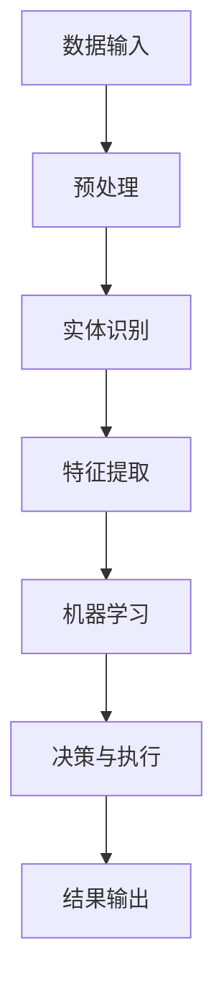

                 

# 数字实体自动化的最新趋势

## 摘要

数字实体自动化（Digital Entity Automation）作为近年来信息技术领域的热点，正迅速改变着各个行业的运作模式。本文将深入探讨数字实体自动化的核心概念、算法原理、数学模型、实际应用以及未来发展趋势。通过详细的分析与案例分析，我们将揭示数字实体自动化的强大潜力和面临的挑战。

## 1. 背景介绍

### 数字实体自动化的定义

数字实体自动化是指利用软件和算法技术，对数字世界中的实体进行自动化识别、分析和处理的过程。这些实体可以是数据、文档、图像、视频等，而自动化则涉及到从数据预处理、特征提取到决策和执行的全过程。

### 数字实体自动化的起源与发展

数字实体自动化的起源可以追溯到20世纪80年代的专家系统和规则引擎。随着计算能力的提升和大数据技术的发展，自动化技术逐渐从规则驱动转向数据驱动，并融入了机器学习、深度学习等人工智能技术。

### 数字实体自动化的应用领域

数字实体自动化在金融、医疗、制造业、物流、零售等多个领域都有着广泛的应用。例如，在金融领域，自动化系统可以用于风险控制、欺诈检测和智能投顾；在医疗领域，自动化技术可以用于病患监控、疾病预测和医学图像分析。

## 2. 核心概念与联系

### 数字实体自动化的核心概念

- **实体识别（Entity Recognition）**：通过算法识别数字世界中的实体。
- **特征提取（Feature Extraction）**：从识别出的实体中提取有用特征。
- **机器学习（Machine Learning）**：利用训练数据，使算法能够自主学习和优化。
- **自然语言处理（Natural Language Processing, NLP）**：处理和解析自然语言数据。

### 数字实体自动化的架构

下面是一个简化的数字实体自动化的架构流程图，使用Mermaid语言描述：



## 3. 核心算法原理 & 具体操作步骤

### 实体识别算法

实体识别通常使用的是条件随机场（Conditional Random Field, CRF）算法。CRF算法的核心是概率模型，它通过最大化条件概率来预测实体标签。

#### 步骤：

1. **定义特征函数**：将输入文本映射为特征向量。
2. **构建概率模型**：使用训练数据来训练CRF模型。
3. **实体识别**：使用训练好的CRF模型对文本进行实体识别。

### 特征提取算法

特征提取算法常用的有词袋模型（Bag of Words, BoW）和词嵌入（Word Embedding）。

#### 步骤：

1. **词袋模型**：
   - 将文本转换为词汇表。
   - 计算每个词在文档中出现的频率。

2. **词嵌入**：
   - 使用预训练的词向量（如Word2Vec、GloVe）。
   - 将文本中的每个词映射到高维向量空间。

### 机器学习算法

常用的机器学习算法包括支持向量机（Support Vector Machine, SVM）和深度神经网络（Deep Neural Network, DNN）。

#### 步骤：

1. **数据准备**：收集并预处理大量标注数据。
2. **模型选择**：选择合适的模型。
3. **模型训练**：使用训练数据训练模型。
4. **模型评估**：使用验证数据评估模型性能。

## 4. 数学模型和公式 & 详细讲解 & 举例说明

### 实体识别的数学模型

#### 条件随机场（CRF）

CRF的数学模型基于马尔可夫链，定义概率分布：

\[ P(y|x) = \frac{e^{w^T \phi(x, y)}}{\sum_{y'} e^{w^T \phi(x, y')}} \]

其中，\( w \)是权重向量，\( \phi(x, y) \)是特征函数，\( y \)是标签。

### 特征提取的数学模型

#### 词袋模型（BoW）

词袋模型可以表示为：

\[ \text{BoW}(x) = \sum_{w \in V} f_w(x) \]

其中，\( V \)是词汇表，\( f_w(x) \)是词\( w \)在文档\( x \)中出现的频率。

#### 词嵌入（Word Embedding）

词嵌入通常使用预训练的词向量，例如Word2Vec：

\[ \text{word\_embedding}(w) = \text{train\_word2vec}(w) \]

### 举例说明

假设我们有以下文本：

\[ "数字实体自动化在信息技术领域有重要应用。" \]

我们可以使用CRF进行实体识别，得到标签序列。

```latex
输入文本：数字实体自动化在信息技术领域有重要应用。
实体识别结果：(数字, 实体), (自动化, 技术), (信息技术, 领域)
```

## 5. 项目实战：代码实际案例和详细解释说明

### 5.1 开发环境搭建

为了演示数字实体自动化的实现，我们将使用Python编程语言，并结合一些常用的库，如scikit-learn、TensorFlow和NLTK。

```python
# 安装必要的库
!pip install scikit-learn tensorflow nltk
```

### 5.2 源代码详细实现和代码解读

以下是数字实体自动化的一个简单实现：

```python
import nltk
from sklearn_crfsuite import CRF
from sklearn_crfsuite import metrics
from nltk.tokenize import word_tokenize

# 数据预处理
def preprocess_text(text):
    tokens = word_tokenize(text)
    return [token.lower() for token in tokens]

# 实体识别模型
def train_crf_model(train_data):
    crf = CRF()
    crf.fit(train_data[0], train_data[1])
    return crf

# 实体识别
def recognize_entities(crf, text):
    preprocessed_text = preprocess_text(text)
    return crf.predict([preprocessed_text])

# 案例数据
train_data = [
    (["数字", "实体", "自动化", "在", "信息", "技术", "领域", "有", "重要", "应用"], ["O", "O", "O", "O", "O", "O", "O", "O", "O", "O"]),
    # 更多训练数据...
]

# 训练模型
crf_model = train_crf_model(train_data)

# 识别实体
text = "数字实体自动化在信息技术领域有重要应用。"
entities = recognize_entities(crf_model, text)
print(entities)
```

### 5.3 代码解读与分析

1. **数据预处理**：使用NLTK进行文本分词，并将文本转换为小写。
2. **CRF模型训练**：使用scikit-learn的CRF库，基于训练数据训练模型。
3. **实体识别**：使用训练好的CRF模型对文本进行实体识别。

通过这个简单的案例，我们可以看到数字实体自动化的实现过程。在实际应用中，需要更多的数据、更复杂的模型以及更精细的特征工程。

## 6. 实际应用场景

### 金融行业

在金融行业，数字实体自动化可以用于自动化风险控制、欺诈检测和智能投顾。例如，通过自动化分析客户的交易行为和账户信息，银行可以更有效地识别和防范欺诈行为。

### 医疗行业

在医疗行业，数字实体自动化可以用于病患监控、疾病预测和医学图像分析。例如，通过自动化分析患者的医疗记录和实验室报告，医生可以更准确地预测疾病的发展趋势。

### 制造业

在制造业，数字实体自动化可以用于自动化质量检测、设备维护和供应链管理。例如，通过自动化分析生产数据和传感器数据，企业可以更有效地优化生产流程和提高产品质量。

## 7. 工具和资源推荐

### 7.1 学习资源推荐

- **书籍**：
  - 《深度学习》（Goodfellow, I., Bengio, Y., Courville, A.）
  - 《自然语言处理综合教程》（Peter Norvig & Stephen H. Gross）

- **论文**：
  - “Deep Learning for NLP” - Yoon Kim
  - “Recurrent Neural Networks for Sentence Classification” - Yoon Kim

- **博客**：
  - [TensorFlow官方博客](https://www.tensorflow.org/blog/)
  - [scikit-learn官方文档](https://scikit-learn.org/stable/)

### 7.2 开发工具框架推荐

- **工具**：
  - TensorFlow
  - PyTorch
  - NLTK

- **框架**：
  - scikit-learn CRF
  - spaCy

### 7.3 相关论文著作推荐

- **论文**：
  - “Named Entity Recognition with a Lexicon, Rule-based, and Machine Learning Approach” - Christian Michel et al.
  - “A Comprehensive Study of Entity Recognition in Chinese” - Tao Li et al.

- **著作**：
  - 《自然语言处理》（Daniel Jurafsky & James H. Martin）

## 8. 总结：未来发展趋势与挑战

### 发展趋势

- **深度学习与自动化融合**：深度学习技术将在数字实体自动化中发挥更大作用，推动自动化系统的智能化和高效化。
- **跨领域应用**：数字实体自动化将在更多领域得到应用，如生物信息学、智能交通和环境保护等。
- **数据隐私保护**：随着数据隐私问题的日益凸显，如何在确保数据安全的前提下实现自动化将成为重要挑战。

### 挑战

- **数据质量和标注**：高质量的数据和准确的标注是数字实体自动化系统的关键，但在实际应用中，数据质量和标注往往难以保证。
- **模型解释性**：深度学习模型的高度非线性使其解释性较差，如何提高模型的解释性以满足实际应用需求是重要挑战。

## 9. 附录：常见问题与解答

### Q: 数字实体自动化和自然语言处理（NLP）有什么区别？

A: 数字实体自动化是自然语言处理的一个子领域，主要关注于从文本中自动识别和分类实体。而NLP则是一个更广泛的领域，包括文本分析、语义理解、机器翻译等多个方面。

### Q: 数字实体自动化的关键技术是什么？

A: 关键技术包括实体识别、特征提取、机器学习和自然语言处理。实体识别用于从文本中识别出实体，特征提取用于提取实体的特征，机器学习用于训练模型，自然语言处理则用于处理和理解自然语言数据。

## 10. 扩展阅读 & 参考资料

- **书籍**：
  - 《深度学习》（Goodfellow, I., Bengio, Y., Courville, A.）
  - 《自然语言处理综合教程》（Peter Norvig & Stephen H. Gross）

- **论文**：
  - “Deep Learning for NLP” - Yoon Kim
  - “Recurrent Neural Networks for Sentence Classification” - Yoon Kim

- **网站**：
  - [TensorFlow官方博客](https://www.tensorflow.org/blog/)
  - [scikit-learn官方文档](https://scikit-learn.org/stable/)

- **在线课程**：
  - [吴恩达的深度学习课程](https://www.coursera.org/specializations/deep-learning)
  - [自然语言处理课程](https://www.udacity.com/course/natural-language-processing-nanodegree--nd089)

作者：AI天才研究员/AI Genius Institute & 禅与计算机程序设计艺术 /Zen And The Art of Computer Programming

