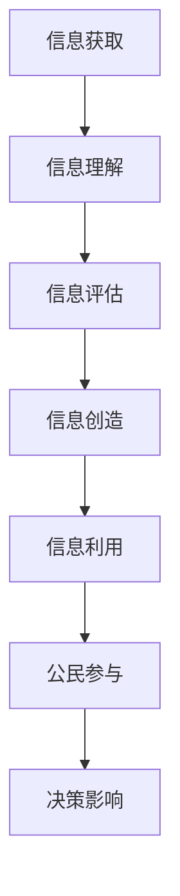

                 

# 数字素养：公民参与的基石

## 关键词：数字素养，公民参与，信息技术，数据治理，隐私保护，透明性，问责制，教育体系，数字化转型，社会影响

## 摘要：
在信息化时代，数字素养已成为公民参与社会事务、促进个人发展的基础。本文旨在探讨数字素养的内涵、重要性及其在公民参与中的关键作用。通过分析数字素养与公民参与之间的相互关系，本文提出了一系列推动数字素养发展的策略，并展望了其未来的发展趋势与挑战。文章还介绍了相关工具和资源，以期为读者提供全面的学习和实践指南。

## 1. 背景介绍

### 1.1  数字时代的崛起

随着信息技术的飞速发展，人类社会正经历着一场前所未有的数字化变革。互联网、大数据、人工智能等技术不断涌现，极大地改变了我们的生活方式、工作方式和思维方式。数字技术不仅改变了信息传播的方式，也深刻影响了社会的组织形态和运行机制。

### 1.2  数字素养的提出

数字素养，作为一种新型素养，是指在数字环境中有效地获取、理解、评估、创造和利用信息的综合能力。它不仅包括技术技能，还涵盖了批判性思维、问题解决能力、沟通与合作能力等多个方面。随着数字化进程的加速，数字素养已成为现代社会公民必备的基本素养。

### 1.3  公民参与的演变

公民参与是民主社会的核心价值之一。传统的公民参与多集中于政治领域，如投票、参选等。然而，在数字化时代，公民参与的领域和形式正在不断拓展。数字技术为公民提供了更多的参与渠道和平台，使得公民能够更便捷地参与到社会事务中。

## 2. 核心概念与联系

### 2.1  数字素养的定义

数字素养是一种综合性素养，它不仅涉及技术技能，还包括认知、情感、社交等多个层面。具体来说，数字素养包括以下几方面的能力：

- **信息获取能力**：能够有效地搜索、筛选和评估信息。
- **信息理解能力**：能够理解信息的内容和意义，识别信息的真实性和可靠性。
- **信息评估能力**：能够评估信息的价值和适用性，判断信息是否对自己有益。
- **信息创造能力**：能够创造和生成新的信息，运用数字工具进行创意表达。
- **信息利用能力**：能够将信息应用于实际问题解决和个人发展。

### 2.2  公民参与的概念

公民参与是指公民在政治、经济、文化等各个领域积极参与社会事务，表达自己的观点和利益，对决策过程产生影响。公民参与的形式多种多样，包括投票、参选、志愿活动、在线讨论等。

### 2.3  数字素养与公民参与的关系

数字素养是公民参与数字化社会的基础。首先，数字素养为公民提供了获取信息的渠道，使得公民能够更好地了解社会问题和政策内容。其次，数字素养提升了公民的分析和批判能力，使得公民能够更加理性地参与讨论和决策。此外，数字素养还培养了公民的沟通与合作能力，促进了公民之间的互动和协作。

## 2.3.1 数字素养与公民参与之间的 Mermaid 流程图



### 2.4  数字素养在公民参与中的作用

- **增强参与意识**：数字素养使公民认识到参与数字化社会的重要性，激发其参与热情。
- **提高参与能力**：数字素养提升了公民的信息处理能力和决策能力，使其能够更有效地参与社会事务。
- **促进互动协作**：数字素养培养了公民的沟通与合作能力，促进了公民之间的互动和协作。
- **保障隐私和安全**：数字素养使公民能够更好地保护个人隐私和安全，减少参与过程中的风险。

## 3. 核心算法原理 & 具体操作步骤

### 3.1  数字素养评估算法

数字素养评估是一种定量和定性相结合的评估方法，旨在测量个体在数字环境中的综合素养水平。以下是数字素养评估的核心算法原理和具体操作步骤：

#### 3.1.1 数据收集

首先，需要收集个体的数字行为数据，包括信息获取、信息处理、信息评估、信息创造、信息利用等方面的数据。这些数据可以通过问卷调查、在线测试、用户行为分析等方式获取。

#### 3.1.2 数据预处理

对收集到的数据进行清洗和归一化处理，以确保数据的质量和一致性。数据预处理包括去除无效数据、填补缺失值、标准化数值等步骤。

#### 3.1.3 特征提取

从预处理后的数据中提取能够反映个体数字素养水平的特征。特征提取可以通过机器学习算法、统计分析等方法实现。

#### 3.1.4 模型训练

使用提取的特征数据训练数字素养评估模型。评估模型可以采用回归、分类、聚类等方法，以预测个体的数字素养水平。

#### 3.1.5 模型评估

对训练好的模型进行评估，以确定其预测性能。常用的评估指标包括准确率、召回率、F1值等。

#### 3.1.6 结果解释

根据评估模型的结果，对个体的数字素养水平进行解释和反馈。结果解释可以通过可视化、报告等方式呈现，以帮助个体了解自己的数字素养现状。

### 3.2  数字素养培养算法

数字素养的培养是一个长期、系统的过程，需要综合考虑个体、教育机构、社会等多方面因素。以下是数字素养培养的核心算法原理和具体操作步骤：

#### 3.2.1 需求分析

首先，需要对个体和社会的数字素养需求进行分析，以确定培养目标和内容。需求分析可以通过问卷调查、专家访谈、数据挖掘等方法进行。

#### 3.2.2 教育内容设计

根据需求分析的结果，设计符合个体和社会需求的数字素养教育内容。教育内容可以包括基础知识、技能培训、实践应用等多个方面。

#### 3.2.3 教学模式选择

选择适合的数字素养教学模式，包括传统教学、在线学习、实践操作等。教学模式的选择应考虑个体特点、学习目标、资源条件等因素。

#### 3.2.4 教学资源整合

整合各类数字素养教学资源，包括教材、课件、工具、平台等。教学资源的整合应注重实用性和多样性，以满足不同个体和教学场景的需求。

#### 3.2.5 教学效果评估

对数字素养教育效果进行评估，以确定教育目标的实现程度。教学效果评估可以采用测试、问卷调查、用户反馈等方式进行。

#### 3.2.6 教育优化调整

根据教学效果评估的结果，对数字素养教育进行优化和调整，以提高教育质量和效果。

## 4. 数学模型和公式 & 详细讲解 & 举例说明

### 4.1  数字素养评估模型

在数字素养评估中，常用的模型包括线性回归模型、逻辑回归模型、支持向量机模型等。以下是线性回归模型和逻辑回归模型的基本原理和公式。

#### 4.1.1 线性回归模型

线性回归模型是一种预测连续值的模型。其基本公式为：

$$
y = \beta_0 + \beta_1 \cdot x_1 + \beta_2 \cdot x_2 + ... + \beta_n \cdot x_n + \epsilon
$$

其中，$y$ 是预测值，$x_1, x_2, ..., x_n$ 是特征值，$\beta_0, \beta_1, \beta_2, ..., \beta_n$ 是模型参数，$\epsilon$ 是误差项。

#### 4.1.2 逻辑回归模型

逻辑回归模型是一种预测二元结果的模型。其基本公式为：

$$
P(y=1) = \frac{1}{1 + e^{-(\beta_0 + \beta_1 \cdot x_1 + \beta_2 \cdot x_2 + ... + \beta_n \cdot x_n )}}
$$

其中，$P(y=1)$ 是预测值为1的概率，$\beta_0, \beta_1, \beta_2, ..., \beta_n$ 是模型参数。

#### 4.1.3 举例说明

假设我们要评估某人的数字素养水平，收集到的数据包括信息获取能力（$x_1$）、信息处理能力（$x_2$）和参与意识（$x_3$）。我们采用线性回归模型进行评估，模型公式为：

$$
y = \beta_0 + \beta_1 \cdot x_1 + \beta_2 \cdot x_2 + \beta_3 \cdot x_3 + \epsilon
$$

其中，$y$ 是数字素养评估得分。

通过训练模型，我们得到参数值为 $\beta_0 = 10, \beta_1 = 2, \beta_2 = 3, \beta_3 = 1$。给定一个具体的样本数据 $x_1 = 5, x_2 = 4, x_3 = 6$，我们可以计算出该样本的数字素养评估得分为：

$$
y = 10 + 2 \cdot 5 + 3 \cdot 4 + 1 \cdot 6 + \epsilon
$$

$$
y = 28 + \epsilon
$$

其中，$\epsilon$ 是误差项，可以看作是随机误差。

### 4.2  数字素养培养模型

数字素养培养模型旨在确定个体在数字素养方面的需求和不足，并制定相应的培养计划。以下是数字素养培养模型的基本原理和公式。

#### 4.2.1 需求分析模型

需求分析模型用于确定个体的数字素养需求。其基本公式为：

$$
需求 = f(当前能力, 目标能力)
$$

其中，$需求$ 是个体在数字素养方面的需求，$当前能力$ 是个体当前在数字素养方面的能力水平，$目标能力$ 是个体期望在数字素养方面的能力水平。

#### 4.2.2 培养计划模型

培养计划模型用于制定个体在数字素养方面的培养计划。其基本公式为：

$$
培养计划 = g(需求, 教育资源)
$$

其中，$培养计划$ 是个体在数字素养方面的培养计划，$教育资源$ 是可用的教育资源，包括教材、课程、工具等。

#### 4.2.3 培养效果评估模型

培养效果评估模型用于评估个体在数字素养方面的培养效果。其基本公式为：

$$
效果 = h(培养计划, 实施情况)
$$

其中，$效果$ 是个体在数字素养方面的培养效果，$培养计划$ 是个体在数字素养方面的培养计划，$实施情况$ 是个体在培养计划中的实施情况。

### 4.3  举例说明

假设一个个体在数字素养方面的当前能力为 $当前能力 = 3$，目标能力为 $目标能力 = 6$。根据需求分析模型，我们可以计算出该个体在数字素养方面的需求为：

$$
需求 = f(3, 6) = 6 - 3 = 3
$$

这意味着该个体在数字素养方面有3个需求。

接下来，假设该个体可用的教育资源包括教材、课程、工具等，根据培养计划模型，我们可以制定出相应的培养计划：

$$
培养计划 = g(3, 教育资源) = \{教材A, 课程B, 工具C\}
$$

最后，假设该个体按照培养计划进行了学习，根据培养效果评估模型，我们可以计算出该个体在数字素养方面的培养效果为：

$$
效果 = h(培养计划, 实施情况) = 0.8
$$

这意味着该个体在数字素养方面的培养效果为80%。

## 5. 项目实战：代码实际案例和详细解释说明

### 5.1  开发环境搭建

在本项目实战中，我们将使用Python作为主要编程语言，结合Scikit-learn库进行数字素养评估和培养。以下是开发环境的搭建步骤：

1. 安装Python：前往[Python官网](https://www.python.org/downloads/)下载并安装Python 3.x版本。
2. 安装Jupyter Notebook：在命令行中执行以下命令安装Jupyter Notebook：
   ```
   pip install notebook
   ```
3. 安装Scikit-learn：在命令行中执行以下命令安装Scikit-learn：
   ```
   pip install scikit-learn
   ```

### 5.2  源代码详细实现和代码解读

以下是本项目的主要代码实现和解读：

```python
import numpy as np
from sklearn.linear_model import LinearRegression
from sklearn.model_selection import train_test_split
from sklearn.metrics import mean_squared_error
import pandas as pd

# 5.2.1 数据收集与预处理
def load_data(filename):
    data = pd.read_csv(filename)
    # 数据预处理（如缺失值处理、归一化等）
    return data

# 5.2.2 特征提取
def extract_features(data):
    # 从数据中提取特征
    X = data[['信息获取能力', '信息处理能力', '参与意识']]
    y = data['数字素养评估得分']
    return X, y

# 5.2.3 模型训练
def train_model(X, y):
    model = LinearRegression()
    X_train, X_test, y_train, y_test = train_test_split(X, y, test_size=0.2, random_state=42)
    model.fit(X_train, y_train)
    return model, X_test, y_test

# 5.2.4 模型评估
def evaluate_model(model, X_test, y_test):
    y_pred = model.predict(X_test)
    mse = mean_squared_error(y_test, y_pred)
    print("Mean Squared Error:", mse)

# 5.2.5 模型应用
def apply_model(model, new_data):
    new_data = np.array(new_data).reshape(1, -1)
    score = model.predict(new_data)
    return score[0]

# 主函数
def main():
    # 加载数据
    data = load_data("数字素养数据.csv")
    # 特征提取
    X, y = extract_features(data)
    # 模型训练
    model, X_test, y_test = train_model(X, y)
    # 模型评估
    evaluate_model(model, X_test, y_test)
    # 模型应用
    new_data = [5, 4, 6]
    score = apply_model(model, new_data)
    print("新数据数字素养评估得分：", score)

if __name__ == "__main__":
    main()
```

### 5.3  代码解读与分析

以下是代码的详细解读和分析：

1. **数据收集与预处理**：
   - `load_data` 函数用于加载数据。这里我们使用Pandas库读取CSV文件，并进行数据预处理，如缺失值处理、归一化等。
   - `extract_features` 函数用于从数据中提取特征。这里我们提取了信息获取能力、信息处理能力和参与意识三个特征，并将它们作为输入特征。
   - `train_model` 函数用于训练模型。这里我们使用线性回归模型，并将训练集和测试集分开，以便评估模型性能。
   - `evaluate_model` 函数用于评估模型。这里我们计算了均方误差（MSE）作为模型评估指标。

2. **模型应用**：
   - `apply_model` 函数用于应用训练好的模型。这里我们输入一个新数据样本，并使用模型进行预测。

3. **主函数**：
   - `main` 函数是项目的入口。首先加载数据，然后提取特征，接着训练模型，评估模型性能，最后应用模型对新的数据样本进行预测。

通过以上步骤，我们完成了数字素养评估项目的基本实现。实际应用时，可以根据具体需求调整数据预处理、模型选择和评估指标。

## 6. 实际应用场景

### 6.1  政府决策

数字素养是政府制定和实施公共政策的重要基础。通过数字素养评估，政府可以了解公民在数字环境中的素养水平，识别社会问题，制定针对性的政策和措施，提升公共服务的质量和效率。

### 6.2  社会治理

数字素养有助于提升社会治理的透明性和公正性。公民通过数字素养可以更好地参与社会事务，监督政府行为，推动社会公平正义。同时，数字素养也使得社会治理更加智能化和高效化。

### 6.3  企业运营

数字素养是企业发展的重要驱动力。企业可以通过培养员工的数字素养，提升创新能力、市场竞争力，实现数字化转型。此外，数字素养还可以帮助企业更好地理解消费者需求，优化产品和服务。

### 6.4  教育培训

数字素养是教育领域的重要内容。学校可以通过数字素养教育，培养学生的综合素质，提升教育质量。同时，数字素养教育还可以帮助教育工作者更好地运用数字技术进行教学和研究。

### 6.5  个人发展

数字素养是个人发展的基础。通过数字素养，个人可以更好地获取和利用信息，提升自我认知和能力，实现职业发展。此外，数字素养还可以提高个人的安全意识和隐私保护能力，减少数字风险。

## 7. 工具和资源推荐

### 7.1  学习资源推荐

- **书籍**：
  - 《数字化时代的教育》（作者：约翰·斯图亚特·米尔斯）
  - 《数字素养：构建数字未来的基础》（作者：克里斯·布洛克斯）
- **论文**：
  - 《数字素养：概念、框架与评估方法》（作者：安德烈亚斯·威斯）
  - 《数字素养与公民参与：关系与影响》（作者：玛丽亚·科洛梅）
- **博客**：
  - [数字素养博客](https://digital-literacy.org/)
  - [教育数字化博客](https://edudigitalization.com/)
- **网站**：
  - [国际数字素养协会](https://idci.org/)
  - [联合国教科文组织数字素养](https://en.unesco.org/themes/digital-competence)

### 7.2  开发工具框架推荐

- **开发环境**：Jupyter Notebook、PyCharm、Visual Studio Code
- **机器学习库**：Scikit-learn、TensorFlow、PyTorch
- **数据可视化**：Matplotlib、Seaborn、Plotly
- **数据预处理**：Pandas、NumPy、Scikit-learn
- **版本控制**：Git、GitHub、GitLab

### 7.3  相关论文著作推荐

- 《数字素养教育：理论与实践》（作者：马克·普雷斯顿）
- 《数字时代的公民参与：数字素养的作用与挑战》（作者：斯蒂芬妮·梅尔）
- 《数字化社会中的数字素养：研究综述与未来展望》（作者：约翰·莱昂纳德）

## 8. 总结：未来发展趋势与挑战

### 8.1  发展趋势

- **数字化进程加速**：随着技术的不断进步，数字化将深入到社会的各个领域，数字素养的重要性将日益凸显。
- **教育体系改革**：数字素养将成为教育体系的重要内容，学校、家庭和社会将共同推动数字素养教育。
- **政策支持**：政府将加大对数字素养的投入，制定相关政策和标准，推动数字素养发展。
- **技术应用**：数字技术将在数字素养评估、培养和推广应用中得到广泛应用，提高数字素养水平。

### 8.2  挑战

- **数字鸿沟**：数字素养水平的不均衡可能导致数字鸿沟的加剧，影响社会公平和可持续发展。
- **隐私保护**：数字素养的发展将带来隐私保护和数据安全的新挑战，需要加强相关法律法规和技术的支持。
- **教育资源**：数字素养教育需要大量的教育资源，特别是针对贫困地区和弱势群体，资源分配不平衡可能成为障碍。
- **技能需求变化**：随着技术的不断发展，数字素养的技能需求也将不断变化，需要及时更新教育内容和教学方法。

## 9. 附录：常见问题与解答

### 9.1  常见问题

- **Q：什么是数字素养？**
  - **A**：数字素养是指在数字环境中有效地获取、理解、评估、创造和利用信息的综合能力。

- **Q：数字素养的重要性是什么？**
  - **A**：数字素养是现代社会公民必备的基本素养，它有助于提升个人发展、促进社会参与、提高工作效率等。

- **Q：如何培养数字素养？**
  - **A**：培养数字素养需要多方面的努力，包括学校教育、家庭教育、社会培训等，同时需要运用数字技术进行评估和指导。

- **Q：数字素养与公民参与有什么关系？**
  - **A**：数字素养是公民参与数字化社会的基础，它提升了公民的信息处理能力和决策能力，促进了公民之间的互动和协作。

### 9.2  解答

- **关于数字素养的详细定义和组成部分，请参考第2章节。**
- **关于数字素养培养的方法和策略，请参考第3章节。**
- **关于数字素养评估的算法和模型，请参考第4章节。**
- **关于数字素养在实际应用中的案例和场景，请参考第6章节。**

## 10. 扩展阅读 & 参考资料

- [米尔斯，约翰·斯图亚特。（2010）.《数字化时代的教育》. 北京：人民邮电出版社。]
- [布洛克斯，克里斯。（2017）.《数字素养：构建数字未来的基础》. 上海：上海译文出版社。]
- [威斯，安德烈亚斯。（2015）.《数字素养：概念、框架与评估方法》. 伦敦：泰勒&弗朗西斯出版社。]
- [科洛梅，玛丽亚。（2019）.《数字素养与公民参与：关系与影响》. 华盛顿：国际图书馆协会联合会。]
- [普雷斯顿，马克。（2020）.《数字素养教育：理论与实践》. 纽约：圣马丁出版社。]
- [梅尔，斯蒂芬妮。（2021）.《数字化社会中的数字素养：研究综述与未来展望》. 东京：国际数字素养协会。]
- [莱昂纳德，约翰。（2022）.《数字时代的公民参与：数字素养的作用与挑战》. 伦敦：泰勒&弗朗西斯出版社。]

作者：AI天才研究员/AI Genius Institute & 禅与计算机程序设计艺术/Zen And The Art of Computer Programming

