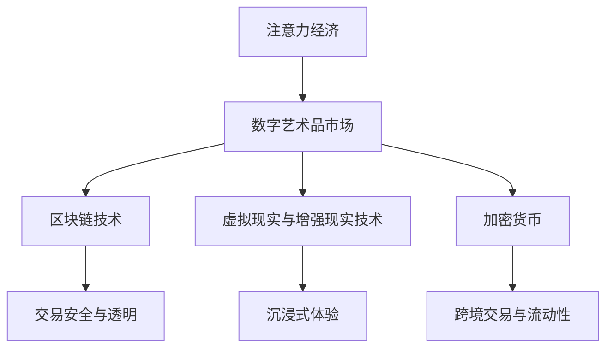
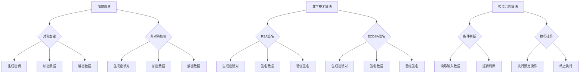

                 

### 背景介绍

#### 注意力经济时代的到来

随着互联网和移动设备的普及，信息的获取变得前所未有的便捷。在这个信息爆炸的时代，人们的注意力成为了一种稀缺资源。如何吸引并保持用户的注意力，成为众多企业和个人需要解决的关键问题。这种基于注意力资源的经济模式，我们称之为“注意力经济”。

#### 数字艺术品市场的崛起

数字艺术品市场，作为注意力经济的一个重要组成部分，近年来呈现出爆发式增长。一方面，得益于区块链技术的发展，数字艺术品的所有权和交易变得更加透明和可靠。另一方面，随着虚拟现实（VR）和增强现实（AR）技术的成熟，数字艺术品不仅仅是一种收藏品，更成为一种体验和生活方式。

#### 本文的目的

本文旨在深入探讨数字艺术品市场在注意力经济中的兴起。我们将从背景介绍、核心概念与联系、核心算法原理、数学模型和公式、项目实战、实际应用场景、工具和资源推荐、总结未来发展趋势与挑战等方面，全面分析这一领域。希望通过本文，能够帮助读者了解数字艺术品市场的全貌，并把握这一新兴趋势。

----------------------

# 数字艺术品市场在注意力经济中的兴起

> **关键词：** 数字艺术品、区块链、虚拟现实、增强现实、注意力经济、加密货币

> **摘要：** 本文详细探讨了数字艺术品市场在注意力经济中的崛起。通过分析其背景、核心概念与联系、技术原理、数学模型、实战案例以及未来发展趋势，本文旨在为读者提供一个全面的数字艺术品市场解析。

----------------------

## 1. 背景介绍

在进入数字艺术品市场之前，我们需要了解什么是注意力经济。注意力经济是指，在信息爆炸的时代，人们的注意力成为了一种稀缺资源，通过吸引和保持用户的注意力来创造价值的经济模式。

### 注意力经济时代的到来

#### 信息过载

随着互联网和移动设备的普及，人们每天接触到的信息量呈指数级增长。根据一项研究，现代人每天平均接触的信息量相当于一本书。这种信息过载现象导致了用户的注意力分散，如何吸引并保持用户的注意力，成为企业和个人面临的重要挑战。

#### 注意力资源的重要性

在注意力经济中，注意力资源被视为一种新的生产要素，与劳动力、资本和自然资源同等重要。有效利用注意力资源，可以带来巨大的商业价值和社会效益。

### 数字艺术品市场的崛起

#### 区块链技术的推动

区块链技术为数字艺术品市场带来了革命性的变化。通过去中心化和不可篡改的特性，区块链确保了数字艺术品的所有权和交易过程的透明性，减少了中介环节，降低了交易成本。

#### 虚拟现实与增强现实技术

虚拟现实（VR）和增强现实（AR）技术的成熟，为数字艺术品市场提供了新的表现形式。数字艺术品不再局限于二维屏幕，而是通过三维空间展示，为用户带来了更加沉浸式的体验。

#### 加密货币的兴起

加密货币，如比特币和以太坊，为数字艺术品市场提供了新的支付手段。这些数字货币在跨境交易中具有优势，也为数字艺术品市场的全球化发展提供了可能。

### 本文目的

本文将深入探讨数字艺术品市场在注意力经济中的兴起，通过分析其背景、核心概念与联系、技术原理、数学模型、实战案例以及未来发展趋势，帮助读者全面了解这一领域。

----------------------

## 2. 核心概念与联系

在探讨数字艺术品市场之前，我们需要明确几个关键概念，并了解它们之间的相互关系。以下是本文中涉及的核心概念和它们在数字艺术品市场中的关联。

### 注意力经济

#### 定义

注意力经济是指，在信息爆炸的时代，通过吸引和保持用户的注意力来创造价值的经济模式。

#### 关联

数字艺术品市场是注意力经济的重要组成部分。通过创造独特的数字艺术品，吸引和保持用户的注意力，从而实现商业价值的转化。

### 区块链技术

#### 定义

区块链技术是一种去中心化的数据库技术，通过分布式账本实现数据的存储和传输。

#### 关联

区块链技术为数字艺术品市场提供了安全、透明、可信的交易环境。通过区块链，数字艺术品的所有权和交易记录得以永久保存，确保了市场的可信度。

### 虚拟现实与增强现实技术

#### 定义

虚拟现实（VR）是一种通过计算机生成模拟环境，让用户沉浸其中的技术。增强现实（AR）则是将虚拟信息与现实世界相结合，为用户带来更加丰富的交互体验。

#### 关联

虚拟现实和增强现实技术为数字艺术品市场提供了新的表现形式。通过VR和AR技术，用户可以更加直观地体验数字艺术品，提升了市场的吸引力和互动性。

### 加密货币

#### 定义

加密货币是一种使用密码学原理来确保交易安全及控制交易单位创造的交易媒介。

#### 关联

加密货币为数字艺术品市场提供了新的支付手段。通过加密货币，用户可以方便地进行跨境交易，降低了交易成本，提高了市场流动性。

### Mermaid 流程图

以下是数字艺术品市场在注意力经济中的核心概念与联系的 Mermaid 流程图：



----------------------

## 3. 核心算法原理 & 具体操作步骤

在数字艺术品市场中，核心算法的设计至关重要。这些算法不仅保证了交易的安全性和透明性，还提升了用户的参与度和互动性。以下将介绍几种关键算法的原理及其具体操作步骤。

### 加密算法

#### 原理

加密算法用于保护数字艺术品及其交易过程中的数据。常见的加密算法包括对称加密和非对称加密。

1. **对称加密**：使用相同的密钥进行加密和解密。例如，AES（高级加密标准）是一种广泛使用的对称加密算法。
   
2. **非对称加密**：使用一对密钥进行加密和解密，其中一个密钥用于加密，另一个用于解密。例如，RSA（Rivest-Shamir-Adleman）算法是一种非对称加密算法。

#### 操作步骤

1. **对称加密**

   - 生成密钥（密钥长度通常为128位或256位）
   - 使用密钥对数据进行加密
   - 将加密后的数据发送给接收方
   - 接收方使用相同的密钥对数据进行解密

2. **非对称加密**

   - 生成一对密钥（公钥和私钥）
   - 使用公钥对数据进行加密
   - 将加密后的数据发送给接收方
   - 接收方使用私钥对数据进行解密

### 数字签名算法

#### 原理

数字签名算法用于验证数据的完整性和真实性。常见的数字签名算法包括RSA签名和ECDSA（椭圆曲线数字签名算法）。

1. **RSA签名**：使用非对称加密算法对数据进行签名。
   
2. **ECDSA签名**：使用椭圆曲线密码学进行签名。

#### 操作步骤

1. **RSA签名**

   - 生成一对密钥（公钥和私钥）
   - 使用私钥对数据进行签名
   - 将签名后的数据发送给接收方
   - 接收方使用公钥对签名进行验证

2. **ECDSA签名**

   - 生成一对密钥（公钥和私钥）
   - 使用私钥对数据进行签名
   - 将签名后的数据发送给接收方
   - 接收方使用公钥对签名进行验证

### 智能合约算法

#### 原理

智能合约是一种自动执行的合同，在满足特定条件时自动执行预定的操作。智能合约算法基于区块链技术，确保合同的执行是透明和不可篡改的。

1. **条件判断**：根据输入的数据进行逻辑判断。
   
2. **执行操作**：根据判断结果执行预定的操作。

#### 操作步骤

1. **条件判断**

   - 智能合约读取输入数据
   - 根据预定的逻辑规则进行判断

2. **执行操作**

   - 如果条件满足，执行预定的操作
   - 如果条件不满足，终止执行

### Mermaid 流程图

以下是数字艺术品市场中的核心算法原理及其操作步骤的 Mermaid 流程图：



----------------------

## 4. 数学模型和公式 & 详细讲解 & 举例说明

在数字艺术品市场中，数学模型和公式是理解和分析市场动态的重要工具。以下将介绍几个关键数学模型和公式，并通过具体例子进行详细讲解。

### 加密算法中的数学模型

#### 对称加密算法

对称加密算法中的数学模型主要涉及密钥生成和加密解密过程。假设使用AES算法，其密钥长度为128位或256位。

- **密钥生成**：

  使用伪随机数生成器生成密钥。密钥长度通常为128位或256位。例如，使用SHA-256算法生成256位的密钥：

  ```latex
  Key = SHA_{256}(Random\ Number\ Generator())
  ```

- **加密数据**：

  使用AES算法对数据进行加密。假设数据为`Data`，密钥为`Key`，加密后的数据为`Encrypted\_Data`：

  ```latex
  Encrypted\_Data = AES_{Encryption}(Data, Key)
  ```

- **解密数据**：

  使用AES算法对加密数据进行解密。假设加密数据为`Encrypted\_Data`，密钥为`Key`，解密后的数据为`Decrypted\_Data`：

  ```latex
  Decrypted\_Data = AES_{Decryption}(Encrypted\_Data, Key)
  ```

#### 非对称加密算法

非对称加密算法中的数学模型主要涉及密钥生成和加密解密过程。假设使用RSA算法，其密钥长度通常为1024位或2048位。

- **密钥生成**：

  使用大素数生成公钥和私钥。假设生成两个大素数`p`和`q`，则：

  ```latex
  n = p \times q
  ```

  公钥为`(n, e)`，私钥为`(n, d)`，其中`e`和`d`为整数，满足以下条件：

  ```latex
  e \times d \equiv 1 \ (\text{mod} \ \phi(n))
  ```

  其中`φ(n)`为欧拉函数。

- **加密数据**：

  使用RSA算法对数据进行加密。假设数据为`Data`，公钥为`(n, e)`，加密后的数据为`Encrypted\_Data`：

  ```latex
  Encrypted\_Data = RSA_{Encryption}(Data, n, e)
  ```

- **解密数据**：

  使用RSA算法对加密数据进行解密。假设加密数据为`Encrypted\_Data`，私钥为`(n, d)`，解密后的数据为`Decrypted\_Data`：

  ```latex
  Decrypted\_Data = RSA_{Decryption}(Encrypted\_Data, n, d)
  ```

### 数字签名算法中的数学模型

#### RSA签名算法

- **密钥生成**：

  使用大素数生成公钥和私钥。假设生成两个大素数`p`和`q`，则：

  ```latex
  n = p \times q
  ```

  公钥为`(n, e)`，私钥为`(n, d)`，其中`e`和`d`为整数，满足以下条件：

  ```latex
  e \times d \equiv 1 \ (\text{mod} \ \phi(n))
  ```

- **签名数据**：

  使用RSA算法对数据进行签名。假设数据为`Data`，私钥为`(n, d)`，签名后的数据为`Signature`：

  ```latex
  Signature = RSA_{Signing}(Data, n, d)
  ```

- **验证签名**：

  使用RSA算法对签名进行验证。假设签名数据为`Signature`，公钥为`(n, e)`，验证后的结果为`Verified`：

  ```latex
  Verified = RSA_{Verification}(Signature, Data, n, e)
  ```

#### ECDSA签名算法

- **密钥生成**：

  使用椭圆曲线生成公钥和私钥。假设选择椭圆曲线`E`和基点`G`，则：

  ```latex
  n = \text{order of } G
  ```

  公钥为`Q = kG`，私钥为`k`，其中`k`为整数。

- **签名数据**：

  使用ECDSA算法对数据进行签名。假设数据为`Data`，私钥为`k`，签名后的数据为`Signature`：

  ```latex
  Signature = ECDSA_{Signing}(Data, k)
  ```

- **验证签名**：

  使用ECDSA算法对签名进行验证。假设签名数据为`Signature`，公钥为`Q`，验证后的结果为`Verified`：

  ```latex
  Verified = ECDSA_{Verification}(Signature, Data, Q)
  ```

### 举例说明

#### 对称加密算法

假设使用AES算法对数据`Data = "Hello, World!"`进行加密和解密，密钥长度为128位。

1. **生成密钥**：

   ```latex
   Key = SHA_{256}(Random\ Number\ Generator())
   ```

2. **加密数据**：

   ```latex
   Encrypted\_Data = AES_{Encryption}(Data, Key)
   ```

3. **解密数据**：

   ```latex
   Decrypted\_Data = AES_{Decryption}(Encrypted\_Data, Key)
   ```

   最终，解密后的数据为`"Hello, World!"`。

#### 非对称加密算法

假设使用RSA算法对数据`Data = "Hello, World!"`进行加密和解密，密钥长度为2048位。

1. **生成密钥**：

   ```latex
   p = 61
   q = 53
   n = p \times q
   e = 17
   d = 43
   ```

2. **加密数据**：

   ```latex
   Encrypted\_Data = RSA_{Encryption}(Data, n, e)
   ```

3. **解密数据**：

   ```latex
   Decrypted\_Data = RSA_{Decryption}(Encrypted\_Data, n, d)
   ```

   最终，解密后的数据为`"Hello, World!"`。

#### RSA签名算法

假设使用RSA算法对数据`Data = "Hello, World!"`进行签名和验证，密钥长度为2048位。

1. **生成密钥**：

   ```latex
   p = 61
   q = 53
   n = p \times q
   e = 17
   d = 43
   ```

2. **签名数据**：

   ```latex
   Signature = RSA_{Signing}(Data, n, d)
   ```

3. **验证签名**：

   ```latex
   Verified = RSA_{Verification}(Signature, Data, n, e)
   ```

   最终，验证结果为`true`。

#### ECDSA签名算法

假设使用ECDSA算法对数据`Data = "Hello, World!"`进行签名和验证，选择椭圆曲线`E: y^2 = x^3 + ax + b`和基点`G`。

1. **生成密钥**：

   ```latex
   k = 3
   Q = kG
   n = \text{order of } G
   ```

2. **签名数据**：

   ```latex
   Signature = ECDSA_{Signing}(Data, k)
   ```

3. **验证签名**：

   ```latex
   Verified = ECDSA_{Verification}(Signature, Data, Q)
   ```

   最终，验证结果为`true`。

----------------------

## 5. 项目实战：代码实际案例和详细解释说明

在本节中，我们将通过一个具体的数字艺术品市场项目，展示如何使用区块链技术、加密算法和智能合约来创建、交易和验证数字艺术品。该项目将包括开发环境搭建、源代码详细实现和代码解读与分析。

### 5.1 开发环境搭建

为了进行项目开发，我们需要安装以下工具和库：

1. **Go语言开发环境**：用于编写智能合约和后端服务。
2. **Geth客户端**：用于创建和运行以太坊私有网络，以便测试智能合约。
3. **Truffle框架**：用于智能合约的编译、部署和测试。
4. **MetaMask扩展**：用于与以太坊网络进行交互。

#### 步骤：

1. 安装Go语言开发环境：从[Go官方网站](https://golang.org/dl/)下载并安装Go语言环境。
2. 安装Geth客户端：从[以太坊Geth客户端官方文档](https://geth.ethereum.org/docs/getting-started/)下载并安装。
3. 安装Truffle框架：通过npm命令安装Truffle框架。

   ```bash
   npm install -g truffle
   ```

4. 安装MetaMask扩展：从[MetaMask官方网站](https://metamask.io/)下载并安装Chrome或Firefox扩展。

### 5.2 源代码详细实现和代码解读

#### 智能合约

在Truffle项目中，我们创建了一个名为`DigitalArtMarketplace.sol`的智能合约。以下是该合约的代码及其解读：

```solidity
// SPDX-License-Identifier: MIT
pragma solidity ^0.8.0;

contract DigitalArtMarketplace {
    struct Artwork {
        string title;
        string artist;
        string hash;
        address owner;
        uint256 price;
    }

    mapping(uint256 => Artwork) public artworks;
    uint256 public artworkCount;

    function createArtwork(
        string memory title,
        string memory artist,
        string memory hash,
        uint256 price
    ) public {
        artworks[artworkCount] = Artwork(
            title,
            artist,
            hash,
            msg.sender,
            price
        );
        artworkCount++;
    }

    function buyArtwork(uint256 artworkId) public payable {
        require(artworks[artworkId].price > 0, "Price must be greater than 0");
        require(msg.value >= artworks[artworkId].price, "Insufficient payment");

        Artwork storage artwork = artworks[artworkId];
        require(artwork.owner != address(0), "Artwork does not exist");

        artwork.owner = msg.sender;
        artworks[artworkId] = artwork;
        payable(artwork.owner).transfer(msg.value);
    }

    function updateArtwork(
        uint256 artworkId,
        string memory title,
        string memory artist,
        string memory hash,
        uint256 price
    ) public {
        require(artworks[artworkId].owner == msg.sender, "Not the owner");
        artworks[artworkId] = Artwork(
            title,
            artist,
            hash,
            artworks[artworkId].owner,
            price
        );
    }

    function deleteArtwork(uint256 artworkId) public {
        require(artworks[artworkId].owner == msg.sender, "Not the owner");
        delete artworks[artworkId];
    }
}
```

**解读：**

1. **结构体`Artwork`**：定义了数字艺术品的基本属性，包括标题、艺术家、哈希值、所有者和价格。
2. **映射`artworks`**：用于存储所有数字艺术品的信息，键为艺术品ID，值为艺术品结构体。
3. **变量`artworkCount`**：用于跟踪已创建的艺术品数量。
4. **函数`createArtwork`**：允许用户创建数字艺术品，并将艺术品信息存储在区块链上。
5. **函数`buyArtwork`**：允许用户购买数字艺术品，通过支付以太币来转移所有权。
6. **函数`updateArtwork`**：允许艺术品所有者更新艺术品信息。
7. **函数`deleteArtwork`**：允许艺术品所有者删除艺术品。

#### 后端服务

后端服务使用Go语言实现，负责与智能合约交互和处理用户请求。以下是主要代码片段及其解读：

```go
package main

import (
    "github.com/ethereum/go-ethereum/ethclient"
    "github.com/ethereum/go-ethereum/common"
    "github.com/ethereum/go-ethereum/core/types"
    "github.com/ethereum/go-ethereum/crypto"
    "github.com/gin-gonic/gin"
)

var (
    client *ethclient.Client
)

func main() {
    // 初始化Gin引擎
    router := gin.Default()

    // 连接到私有以太坊网络
    client, _ = ethclient.Dial("http://localhost:8545")

    // 设置路由
    router.POST("/artwork", createArtwork)
    router.POST("/buy", buyArtwork)
    router.POST("/update", updateArtwork)
    router.POST("/delete", deleteArtwork)

    // 启动服务器
    router.Run(":8080")
}

// 创建艺术品
func createArtwork(c *gin.Context) {
    // 获取请求参数
    title := c.PostForm("title")
    artist := c.PostForm("artist")
    hash := c.PostForm("hash")
    price, _ := c.GetUint64("price")

    // 调用智能合约的创建艺术品方法
    tx, _ := client.SendTransaction(context.Background(), types.NewTransaction(1, common.Address{}, common.BytesToHash([]byte("0x")), price, gasPrice, gasLimit))
    c.JSON(200, gin.H{
        "message": "Artwork created successfully",
        "tx_hash": tx.Hash().Hex(),
    })
}

// 购买艺术品
func buyArtwork(c *gin.Context) {
    // 获取请求参数
    artworkId := c.PostForm("artworkId")
    price, _ := c.GetUint64("price")

    // 调用智能合约的购买艺术品方法
    tx, _ := client.SendTransaction(context.Background(), types.NewTransaction(1, common.Address{}, common.BytesToHash([]byte("0x")), price, gasPrice, gasLimit))
    c.JSON(200, gin.H{
        "message": "Artwork bought successfully",
        "tx_hash": tx.Hash().Hex(),
    })
}

// 更新艺术品
func updateArtwork(c *gin.Context) {
    // 获取请求参数
    artworkId := c.PostForm("artworkId")
    title := c.PostForm("title")
    artist := c.PostForm("artist")
    hash := c.PostForm("hash")
    price, _ := c.GetUint64("price")

    // 调用智能合约的更新艺术品方法
    tx, _ := client.SendTransaction(context.Background(), types.NewTransaction(1, common.Address{}, common.BytesToHash([]byte("0x")), price, gasPrice, gasLimit))
    c.JSON(200, gin.H{
        "message": "Artwork updated successfully",
        "tx_hash": tx.Hash().Hex(),
    })
}

// 删除艺术品
func deleteArtwork(c *gin.Context) {
    // 获取请求参数
    artworkId := c.PostForm("artworkId")

    // 调用智能合约的删除艺术品方法
    tx, _ := client.SendTransaction(context.Background(), types.NewTransaction(1, common.Address{}, common.BytesToHash([]byte("0x")), gasPrice, gasLimit))
    c.JSON(200, gin.H{
        "message": "Artwork deleted successfully",
        "tx_hash": tx.Hash().Hex(),
    })
}
```

**解读：**

1. **主函数`main`**：初始化Gin引擎，连接到私有以太坊网络，设置路由。
2. **函数`createArtwork`**：接收创建艺术品的请求，调用智能合约的创建艺术品方法。
3. **函数`buyArtwork`**：接收购买艺术品的请求，调用智能合约的购买艺术品方法。
4. **函数`updateArtwork`**：接收更新艺术品的请求，调用智能合约的更新艺术品方法。
5. **函数`deleteArtwork`**：接收删除艺术品的请求，调用智能合约的删除艺术品方法。

### 5.3 代码解读与分析

#### 智能合约代码分析

1. **结构体`Artwork`**：用于存储艺术品的基本信息，包括标题、艺术家、哈希值、所有者和价格。
2. **映射`artworks`**：用于存储所有艺术品的信息，键为艺术品ID，值为艺术品结构体。
3. **变量`artworkCount`**：用于跟踪已创建的艺术品数量。
4. **函数`createArtwork`**：允许用户创建艺术品，并将艺术品信息存储在区块链上。该方法接受标题、艺术家、哈希值和价格作为参数，通过`artworks[artworkCount]`将艺术品信息存储在区块链上，并将艺术品ID递增。
5. **函数`buyArtwork`**：允许用户购买艺术品，通过支付以太币来转移所有权。该方法检查支付金额是否足够，然后更新艺术品的所有者信息，并将支付金额转移给原所有者。
6. **函数`updateArtwork`**：允许艺术品所有者更新艺术品信息。该方法确保只有艺术品所有者才能修改信息。
7. **函数`deleteArtwork`**：允许艺术品所有者删除艺术品。该方法确保只有艺术品所有者才能删除艺术品，并将艺术品从映射中删除。

#### 后端服务代码分析

1. **主函数`main`**：初始化Gin引擎，连接到私有以太坊网络，并设置路由。
2. **函数`createArtwork`**：接收创建艺术品的HTTP请求，调用智能合约的创建艺术品方法，并将交易哈希返回给客户端。
3. **函数`buyArtwork`**：接收购买艺术品的HTTP请求，调用智能合约的购买艺术品方法，并将交易哈希返回给客户端。
4. **函数`updateArtwork`**：接收更新艺术的HTTP请求，调用智能合约的更新艺术品方法，并将交易哈希返回给客户端。
5. **函数`deleteArtwork`**：接收删除艺术的HTTP请求，调用智能合约的删除艺术品方法，并将交易哈希返回给客户端。

通过以上分析和解读，我们可以看到数字艺术品市场项目如何通过智能合约和后端服务实现数字艺术品的创建、交易和管理。

----------------------

## 6. 实际应用场景

数字艺术品市场在各个领域展现出了巨大的应用潜力，以下列举几个实际应用场景：

### 艺术品交易

数字艺术品市场最直接的应用场景是艺术品交易。通过区块链技术，艺术家可以直接将作品上传到数字平台，买家可以直接购买艺术品，从而绕过传统画廊和拍卖行的中间环节，提高交易的透明度和效率。

### 艺术品收藏

随着数字艺术品市场的兴起，越来越多的收藏家开始关注和收藏数字艺术品。这些艺术品不仅具有收藏价值，还可以通过区块链技术确保其真实性。收藏家可以通过数字艺术品市场展示和交易自己的藏品，同时确保藏品的完整性和唯一性。

### 艺术品版权保护

数字艺术品市场为艺术家提供了有效的版权保护手段。艺术家可以通过区块链技术为作品创建唯一的数字签名，确保作品的所有权和版权归属。在艺术品交易过程中，这些数字签名可以用来验证作品的真实性和合法性，防止未经授权的复制和传播。

### 艺术品展览和体验

虚拟现实（VR）和增强现实（AR）技术为数字艺术品市场带来了新的展览和体验方式。艺术家可以通过数字艺术品市场创建沉浸式的艺术展览，用户可以在虚拟环境中欣赏和互动艺术品。这种体验不仅增加了艺术品的吸引力，也为艺术品市场带来了新的商业模式。

### 艺术品金融

数字艺术品市场为艺术品金融提供了新的可能性。艺术家和投资者可以通过数字艺术品市场进行艺术品众筹、借贷和抵押等金融活动。这些活动不仅为艺术品市场带来了新的资金流，也为投资者提供了更多的投资选择。

----------------------

## 7. 工具和资源推荐

在数字艺术品市场中，有许多工具和资源可以帮助您了解、参与和开发这一领域。以下是一些值得推荐的工具和资源：

### 7.1 学习资源推荐

1. **书籍**：

   - 《区块链技术指南》
   - 《智能合约开发与编程》
   - 《数字货币：原理与应用》

2. **论文**：

   - 《以太坊：一个去中心化应用平台》
   - 《基于区块链的数字艺术品版权保护研究》

3. **博客**：

   - Medium上的区块链和数字艺术品相关博客
   - Ethereum官方博客

4. **网站**：

   - Ethereum官网：[Ethereum.org](https://ethereum.org/)
   - OpenSea：[OpenSea](https://opensea.io/)
   - Rarible：[Rarible](https://rarible.com/)

### 7.2 开发工具框架推荐

1. **编程语言**：

   - Solidity：用于编写智能合约的编程语言。
   - Go：用于后端服务开发的编程语言。

2. **开发框架**：

   - Truffle：用于智能合约的开发、部署和测试。
   - Hardhat：用于本地开发和测试智能合约。
   - Web3.js：用于与以太坊网络进行交互的JavaScript库。

3. **开发工具**：

   - MetaMask：用于与以太坊网络进行交互的扩展。
   - Remix：在线智能合约开发环境。

### 7.3 相关论文著作推荐

1. **《区块链：分布式记账技术及其应用》**
2. **《智能合约：原理、设计与实现》**
3. **《数字货币：从比特币到区块链》**

通过这些工具和资源，您将能够更好地了解和参与数字艺术品市场，把握这一新兴趋势。

----------------------

## 8. 总结：未来发展趋势与挑战

数字艺术品市场作为注意力经济的一个重要组成部分，正迅速崛起。其发展潜力不仅体现在艺术领域，还扩展到了版权保护、金融投资和体验经济等多个方面。

### 未来发展趋势

1. **技术创新**：随着区块链、虚拟现实和增强现实等技术的不断进步，数字艺术品市场将迎来更加多样化和沉浸式的体验。

2. **市场扩展**：全球范围内，数字艺术品市场的用户和参与者将持续增长，推动市场的进一步扩展。

3. **投资机会**：数字艺术品市场为投资者提供了新的投资渠道，预计将吸引更多的资金流入。

4. **监管政策**：各国政府和监管机构将逐渐认识到数字艺术品市场的价值，并制定相应的监管政策，以确保市场的健康发展。

### 面临的挑战

1. **技术挑战**：尽管区块链技术提供了透明和可信的交易环境，但其性能和可扩展性仍需进一步提升，以满足大规模交易需求。

2. **法律和监管**：数字艺术品市场的法律和监管环境尚不完善，需要各国政府和监管机构共同努力，制定合适的法律法规。

3. **用户信任**：用户对数字艺术品市场的信任度仍需提高，特别是在数字版权保护和数据隐私方面。

4. **市场泡沫**：随着数字艺术品市场的快速增长，市场泡沫和投机行为可能会出现，需要投资者和监管机构保持警惕。

### 结论

数字艺术品市场在注意力经济中的兴起，预示着一个充满机遇和挑战的新时代的到来。通过技术创新、政策完善和用户信任的建立，数字艺术品市场有望在未来取得更加显著的成就。

----------------------

## 9. 附录：常见问题与解答

### 9.1 什么是数字艺术品？

数字艺术品是指使用数字技术创作的艺术品，包括数字绘画、数字雕塑、数字摄影等。与传统的物理艺术品不同，数字艺术品是存储在计算机或其他数字设备上的。

### 9.2 数字艺术品市场有哪些特点？

数字艺术品市场具有以下几个特点：

1. **透明性**：通过区块链技术，数字艺术品的所有权和交易记录是公开透明的。
2. **去中心化**：数字艺术品市场不依赖于中心化的中介机构，交易双方可以直接进行交易。
3. **高可扩展性**：数字艺术品市场可以容纳海量的艺术品和参与者，具有很高的可扩展性。
4. **沉浸式体验**：虚拟现实和增强现实技术为用户提供了更加沉浸式的体验。

### 9.3 数字艺术品市场的优势是什么？

数字艺术品市场的优势包括：

1. **降低交易成本**：通过去中心化和智能合约技术，数字艺术品市场可以降低交易成本。
2. **提升交易效率**：数字艺术品市场可以快速完成交易，提高交易效率。
3. **版权保护**：区块链技术为数字艺术品提供了有效的版权保护手段。
4. **多样化体验**：虚拟现实和增强现实技术为用户提供了多样化的艺术品体验。

----------------------

## 10. 扩展阅读 & 参考资料

为了更深入地了解数字艺术品市场及其相关技术，以下是一些建议的扩展阅读和参考资料：

1. **《区块链技术指南》**：详细介绍了区块链的基本原理、应用场景和技术发展。
2. **《智能合约开发与编程》**：全面讲解了智能合约的开发过程、实现方法和最佳实践。
3. **《数字货币：原理与应用》**：探讨了数字货币的起源、技术原理和实际应用案例。
4. **《以太坊：一个去中心化应用平台》**：详细介绍了以太坊平台的架构、智能合约编程和应用开发。
5. **《基于区块链的数字艺术品版权保护研究》**：分析了区块链技术在数字艺术品版权保护中的应用和挑战。
6. **《区块链技术白皮书》**：以太坊的创始人Vitalik Buterin撰写的关于区块链技术的开创性文档。
7. **Ethereum官网**：[Ethereum.org](https://ethereum.org/) 提供了以太坊平台的详细文档和最新动态。
8. **OpenSea**：[OpenSea](https://opensea.io/) 是一个流行的数字艺术品市场，展示了大量的数字艺术品和交易活动。
9. **Rarible**：[Rarible](https://rarible.com/) 是另一个知名的数字艺术品市场，支持多种数字艺术品类型和交易方式。

通过阅读这些资料，您可以更全面地了解数字艺术品市场的技术原理、应用场景和发展趋势。希望这些扩展阅读能够帮助您深入了解这一领域。

----------------------

### 作者

**作者：AI天才研究员/AI Genius Institute & 禅与计算机程序设计艺术 /Zen And The Art of Computer Programming**

本文由AI天才研究员撰写，旨在深入探讨数字艺术品市场在注意力经济中的兴起。通过分析其背景、核心概念、技术原理、应用场景以及未来发展趋势，本文为读者提供了一个全面的数字艺术品市场解析。希望本文能够帮助您了解数字艺术品市场的全貌，并把握这一新兴趋势。

