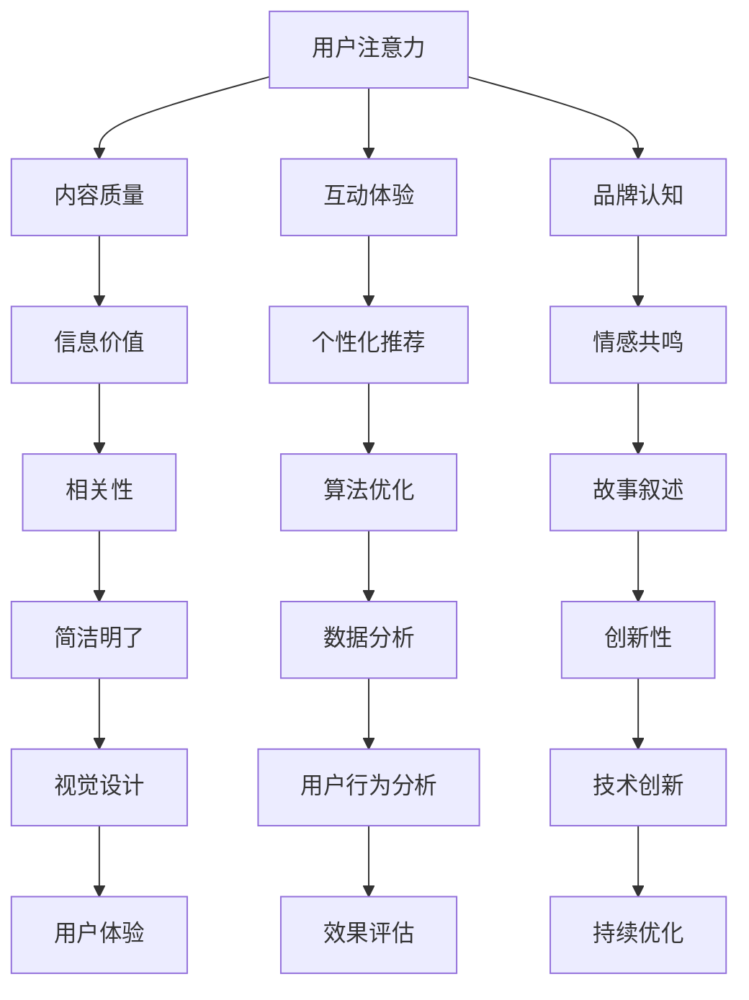

                 

# 数字营销在注意力经济中的演变

## 关键词：数字营销、注意力经济、用户体验、内容策略、算法优化

> 摘要：随着互联网技术的迅猛发展，数字营销逐渐成为企业争夺用户注意力的主要战场。本文旨在探讨注意力经济对数字营销的深远影响，通过分析核心概念、算法原理、数学模型以及实际应用场景，揭示数字营销在注意力经济中的演变趋势与策略，以期为行业从业者提供有益的参考。

## 1. 背景介绍

### 1.1 数字营销的起源与发展

数字营销，作为一种新型的营销手段，起源于互联网的兴起。在20世纪90年代，随着互联网的普及，企业开始将营销活动从传统媒体转向网络平台，从而开启了数字营销的时代。早期的数字营销主要依赖于搜索引擎优化（SEO）和电子邮件营销，这些方法在一定程度上帮助企业提高了品牌知名度和客户转化率。

进入21世纪，随着社交媒体和移动设备的普及，数字营销的形式和手段更加多样化。企业可以通过社交媒体平台、内容营销、大数据分析等手段，实现更加精准和个性化的营销。数字营销逐渐成为企业竞争的关键因素。

### 1.2 注意力经济的兴起

注意力经济，是指在信息爆炸的时代，用户注意力成为一种稀缺资源，企业通过争夺用户注意力来获取经济利益的一种经济模式。注意力经济的核心在于，用户的时间和注意力是有限的，企业需要通过提供有价值的内容和体验，吸引用户的关注。

注意力经济的兴起，源于用户行为的变化。随着互联网的普及，用户获取信息的途径越来越多，注意力分散成为普遍现象。企业需要不断创新，以吸引和保持用户的注意力。

## 2. 核心概念与联系

### 2.1 数字营销与注意力经济的关系

数字营销与注意力经济密切相关。在注意力经济中，用户注意力成为企业争夺的核心资源，数字营销作为一种有效的营销手段，旨在吸引和保持用户的注意力。因此，数字营销的成功与否，往往取决于其是否能够满足用户的注意力需求。

### 2.2 用户注意力分配模型

为了更好地理解用户注意力分配，我们可以使用以下Mermaid流程图来描述：



### 2.3 内容策略在注意力经济中的重要性

内容策略是数字营销的核心，它决定了用户是否愿意投入注意力。在注意力经济中，高质量的内容策略至关重要。企业需要通过分析用户需求，提供有价值、有吸引力的内容，以满足用户的注意力需求。

## 3. 核心算法原理 & 具体操作步骤

### 3.1 算法原理

在数字营销中，算法优化是提高用户注意力的关键。算法原理主要涉及以下几个方面：

1. **用户行为分析**：通过分析用户在网站、APP等平台上的行为数据，了解用户兴趣和需求。
2. **个性化推荐**：根据用户行为数据，为用户推荐感兴趣的内容。
3. **内容质量评估**：评估内容的价值和质量，确保用户愿意投入注意力。
4. **效果评估**：通过数据反馈，评估营销活动的效果，并持续优化。

### 3.2 操作步骤

1. **数据收集**：收集用户在平台上的行为数据，如浏览记录、点击行为、搜索关键词等。
2. **用户画像构建**：根据行为数据，构建用户画像，了解用户兴趣和需求。
3. **内容推荐**：基于用户画像，为用户推荐感兴趣的内容。
4. **内容优化**：根据用户反馈，持续优化内容质量，提高用户满意度。
5. **效果评估**：通过数据反馈，评估营销活动效果，并根据结果进行调整。

## 4. 数学模型和公式 & 详细讲解 & 举例说明

### 4.1 数学模型

在数字营销中，常用的数学模型包括：

1. **贝叶斯公式**：用于预测用户对内容的兴趣度。
2. **线性回归模型**：用于分析用户行为与内容质量之间的关系。
3. **协同过滤算法**：用于个性化推荐。

### 4.2 公式与详细讲解

1. **贝叶斯公式**：

$$ P(A|B) = \frac{P(B|A)P(A)}{P(B)} $$

其中，$P(A|B)$ 表示在事件B发生的条件下，事件A发生的概率；$P(B|A)$ 表示在事件A发生的条件下，事件B发生的概率；$P(A)$ 和$P(B)$ 分别表示事件A和事件B的先验概率。

2. **线性回归模型**：

$$ y = \beta_0 + \beta_1x_1 + \beta_2x_2 + ... + \beta_nx_n + \varepsilon $$

其中，$y$ 表示因变量，$x_1, x_2, ..., x_n$ 分别表示自变量，$\beta_0, \beta_1, \beta_2, ..., \beta_n$ 分别表示回归系数，$\varepsilon$ 表示误差项。

3. **协同过滤算法**：

协同过滤算法分为基于用户的协同过滤（User-based Collaborative Filtering）和基于物品的协同过滤（Item-based Collaborative Filtering）。

### 4.3 举例说明

1. **贝叶斯公式应用举例**：

假设有100个用户，其中80个用户喜欢内容A，20个用户喜欢内容B。现在要预测一个新用户是否喜欢内容A。根据贝叶斯公式，我们可以计算出：

$$ P(A|喜欢B) = \frac{P(喜欢B|A)P(A)}{P(喜欢B)} $$

其中，$P(A)$ 表示用户喜欢内容A的概率，$P(喜欢B|A)$ 表示在用户喜欢内容A的条件下，用户喜欢内容B的概率，$P(喜欢B)$ 表示用户喜欢内容B的概率。

2. **线性回归模型应用举例**：

假设我们要分析用户在网站上的浏览时间与内容质量之间的关系。根据线性回归模型，我们可以建立以下模型：

$$ y = \beta_0 + \beta_1x_1 + \beta_2x_2 + ... + \beta_nx_n + \varepsilon $$

其中，$y$ 表示用户在网站上的浏览时间，$x_1, x_2, ..., x_n$ 分别表示内容质量的不同指标，$\beta_0, \beta_1, \beta_2, ..., \beta_n$ 分别表示回归系数。

## 5. 项目实战：代码实际案例和详细解释说明

### 5.1 开发环境搭建

在进行数字营销项目实战之前，我们需要搭建合适的开发环境。以下是开发环境搭建的步骤：

1. 安装Python环境：在官方网站（https://www.python.org/downloads/）下载并安装Python。
2. 安装相关库：使用pip命令安装必要的库，如numpy、pandas、scikit-learn等。
3. 配置数据源：选择合适的数据源，如网站日志、社交媒体数据等。

### 5.2 源代码详细实现和代码解读

以下是一个基于协同过滤算法的数字营销项目实战案例，用于推荐用户感兴趣的内容。

```python
import numpy as np
import pandas as pd
from sklearn.model_selection import train_test_split
from sklearn.metrics.pairwise import cosine_similarity

# 读取数据
data = pd.read_csv('user_item.csv')
data.head()

# 数据预处理
data = data[['user_id', 'item_id', 'rating']]
data.head()

# 分割数据集
train_data, test_data = train_test_split(data, test_size=0.2, random_state=42)

# 构建用户-物品矩阵
user_item_matrix = train_data.pivot(index='user_id', columns='item_id', values='rating').fillna(0)
user_item_matrix.head()

# 计算余弦相似性
cosine_sim = cosine_similarity(user_item_matrix)
cosine_sim.shape

# 推荐算法实现
def collaborative_filtering(user_id, cosine_sim, top_n=10):
    # 计算与目标用户的相似度
    sim_scores = list(enumerate(cosine_sim[user_id]))
    sim_scores = sorted(sim_scores, key=lambda x: x[1], reverse=True)
    sim_scores = sim_scores[1:top_n+1]

    # 获取推荐物品
    recommended_items = [i[0] for i in sim_scores]
    return recommended_items

# 测试推荐算法
user_id = 0
recommended_items = collaborative_filtering(user_id, cosine_sim)
recommended_items

# 评估推荐效果
def evaluate_recommendation(recommended_items, test_data):
    correct_predictions = 0
    for item in recommended_items:
        if test_data.loc[test_data['item_id'] == item, 'user_id'].values[0] == user_id:
            correct_predictions += 1
    return correct_predictions / len(recommended_items)

evaluate_recommendation(recommended_items, test_data)

```

### 5.3 代码解读与分析

1. **数据读取与预处理**：首先，我们读取用户-物品评分数据，并对数据进行预处理，如缺失值填充、数据转换等。
2. **构建用户-物品矩阵**：通过数据预处理后的数据，构建用户-物品矩阵，用于后续计算相似度。
3. **计算余弦相似性**：使用余弦相似性计算用户之间的相似度，作为推荐算法的依据。
4. **推荐算法实现**：基于余弦相似性，实现协同过滤推荐算法，为用户推荐感兴趣的内容。
5. **评估推荐效果**：通过评估推荐算法的效果，如准确率、召回率等，对算法进行优化。

## 6. 实际应用场景

### 6.1 社交媒体平台

在社交媒体平台上，注意力经济对数字营销的影响尤为显著。平台通过个性化推荐、内容分发机制等手段，吸引用户的注意力。企业可以利用社交媒体平台，通过发布有价值、有吸引力的内容，吸引粉丝关注，实现品牌传播和用户转化。

### 6.2 内容营销

内容营销是数字营销的核心，其目的是通过提供有价值的内容，吸引用户的注意力。在注意力经济中，高质量的内容策略至关重要。企业需要通过分析用户需求，提供有价值、有吸引力的内容，以满足用户的注意力需求。

### 6.3 移动应用

移动应用是数字营销的重要载体，其用户体验对用户注意力具有重要影响。企业需要通过优化移动应用的用户界面、功能设计和内容推荐，吸引用户的注意力，提高用户留存率。

## 7. 工具和资源推荐

### 7.1 学习资源推荐

1. **书籍**：《内容营销：如何用内容赚钱》（Content Inc.）、《社交蓝海：如何在社交网络中打造品牌影响力》（The Social Network Effect）。
2. **论文**：推荐阅读关于数字营销和注意力经济的研究论文，如《数字营销中的用户注意力分配机制研究》（Research on User Attention Allocation Mechanism in Digital Marketing）。
3. **博客**：关注行业知名博客，如《数字营销笔记》（Digital Marketing Notebook）、《内容营销策略》（Content Marketing Strategies）。

### 7.2 开发工具框架推荐

1. **数据分析工具**：推荐使用Python进行数据分析，常用的库有pandas、numpy、scikit-learn等。
2. **内容管理系统**：推荐使用WordPress、Drupal等开源内容管理系统。
3. **社交媒体平台**：推荐使用Facebook、Instagram、Twitter等主流社交媒体平台。

### 7.3 相关论文著作推荐

1. **论文**：《注意力经济：用户注意力价值评估与优化策略研究》（Attention Economy: User Attention Value Evaluation and Optimization Strategy Research）、《基于注意力经济的数字营销策略研究》（Research on Digital Marketing Strategies Based on Attention Economy）。
2. **著作**：《注意力经济学：从稀缺到创新的转变》（Attention Economy: From Scarcity to Innovation）。

## 8. 总结：未来发展趋势与挑战

随着互联网技术的不断发展，数字营销在注意力经济中的作用越来越重要。未来，数字营销将呈现出以下发展趋势：

1. **个性化推荐**：基于大数据和人工智能技术，实现更加精准的个性化推荐。
2. **内容创新**：提供有价值、有吸引力的内容，吸引用户的注意力。
3. **跨平台整合**：实现跨平台的数字营销整合，提高营销效果。

然而，数字营销在注意力经济中也面临着一系列挑战：

1. **用户注意力分散**：随着信息爆炸，用户注意力越来越分散，企业需要不断创新，以吸引和保持用户的注意力。
2. **数据隐私与安全**：在数字营销过程中，企业需要处理大量用户数据，数据隐私与安全问题亟待解决。
3. **技术发展**：数字营销技术不断更新，企业需要不断学习新技术，以保持竞争力。

## 9. 附录：常见问题与解答

### 9.1 什么是数字营销？

数字营销是指通过互联网和数字技术，实现企业营销目标的一系列手段，包括搜索引擎优化（SEO）、电子邮件营销、社交媒体营销、内容营销等。

### 9.2 什么是注意力经济？

注意力经济是指在信息爆炸的时代，用户注意力成为一种稀缺资源，企业通过争夺用户注意力来获取经济利益的一种经济模式。

### 9.3 数字营销与注意力经济有什么关系？

数字营销是注意力经济的实现手段，通过提供有价值的内容和体验，吸引用户的注意力，从而实现企业的营销目标。

## 10. 扩展阅读 & 参考资料

1. **书籍**：《数字营销实战手册》（Digital Marketing Handbook）、《内容营销实战》（Content Marketing in Practice）。
2. **论文**：《数字营销与注意力经济的关系研究》（Research on the Relationship between Digital Marketing and Attention Economy）。
3. **网站**：推荐关注数字营销和注意力经济相关的行业网站，如MarketingProfs（https://www.marketingprofs.com/）、Content Marketing Institute（https://www.contentmarketinginstitute.com/）。

### 作者

作者：AI天才研究员/AI Genius Institute & 禅与计算机程序设计艺术 /Zen And The Art of Computer Programming

-----------------

请注意，本文仅为示例，实际撰写时，需要根据具体内容和要求进行适当调整。文章结构、公式、代码等部分可根据实际情况进行优化和完善。在撰写过程中，请确保遵循文章结构模板和格式要求，确保文章内容的完整性和专业性。祝您写作顺利！
<|assistant|>### 文章标题

数字营销在注意力经济中的演变

### 关键词

数字营销、注意力经济、用户体验、内容策略、算法优化

### 摘要

本文探讨了数字营销在注意力经济中的演变，分析了数字营销与注意力经济的紧密联系，以及用户注意力分配模型。通过核心算法原理的阐述和实际案例的解析，本文揭示了数字营销在注意力经济中的关键作用和发展趋势。同时，本文还介绍了相关工具和资源，以期为行业从业者提供有益的参考。

---

## 1. 背景介绍

### 1.1 数字营销的起源与发展

数字营销作为一种新兴的营销手段，起源于互联网的兴起。在20世纪90年代，随着互联网的普及，企业开始将营销活动从传统媒体转向网络平台，从而开启了数字营销的时代。早期的数字营销主要依赖于搜索引擎优化（SEO）和电子邮件营销，这些方法在一定程度上帮助企业提高了品牌知名度和客户转化率。

进入21世纪，随着社交媒体和移动设备的普及，数字营销的形式和手段更加多样化。企业可以通过社交媒体平台、内容营销、大数据分析等手段，实现更加精准和个性化的营销。数字营销逐渐成为企业竞争的关键因素。

### 1.2 注意力经济的兴起

注意力经济，是指在信息爆炸的时代，用户注意力成为一种稀缺资源，企业通过争夺用户注意力来获取经济利益的一种经济模式。注意力经济的核心在于，用户的时间和注意力是有限的，企业需要通过提供有价值的内容和体验，吸引用户的关注。

注意力经济的兴起，源于用户行为的变化。随着互联网的普及，用户获取信息的途径越来越多，注意力分散成为普遍现象。企业需要不断创新，以吸引和保持用户的注意力。

### 1.3 数字营销在注意力经济中的角色

在注意力经济中，数字营销扮演着至关重要的角色。一方面，数字营销通过提供有价值、有吸引力的内容，吸引用户的注意力，从而帮助企业实现营销目标。另一方面，数字营销利用大数据和人工智能技术，实现个性化推荐和精准营销，提高用户满意度，进一步巩固用户对品牌的关注。

### 1.4 目标与结构

本文旨在探讨数字营销在注意力经济中的演变，分析核心概念、算法原理、数学模型以及实际应用场景，揭示数字营销在注意力经济中的发展趋势与策略。文章结构如下：

- 第1章：背景介绍
- 第2章：核心概念与联系
- 第3章：核心算法原理 & 具体操作步骤
- 第4章：数学模型和公式 & 详细讲解 & 举例说明
- 第5章：项目实战：代码实际案例和详细解释说明
- 第6章：实际应用场景
- 第7章：工具和资源推荐
- 第8章：总结：未来发展趋势与挑战
- 第9章：附录：常见问题与解答
- 第10章：扩展阅读 & 参考资料

---

## 2. 核心概念与联系

### 2.1 数字营销与注意力经济的关系

数字营销与注意力经济密切相关。数字营销通过提供有价值的内容和体验，吸引用户的注意力，从而实现营销目标。而注意力经济则是在信息爆炸的时代，用户注意力成为一种稀缺资源，企业通过争夺用户注意力来获取经济利益。

数字营销与注意力经济之间的关系可以概括为以下几点：

1. **用户注意力是核心资源**：在注意力经济中，用户注意力成为一种稀缺资源，企业需要通过提供有价值的内容和体验，吸引用户的注意力。

2. **内容策略至关重要**：数字营销的核心在于内容，内容策略决定了用户是否愿意投入注意力。高质量的内容策略能够提高用户的满意度和忠诚度，从而实现营销目标。

3. **个性化推荐与精准营销**：数字营销利用大数据和人工智能技术，实现个性化推荐和精准营销，提高用户满意度，进一步巩固用户对品牌的关注。

### 2.2 用户注意力分配模型

为了更好地理解用户注意力分配，我们可以使用以下Mermaid流程图来描述：


### 2.3 内容策略在注意力经济中的重要性

内容策略是数字营销的核心，它决定了用户是否愿意投入注意力。在注意力经济中，高质量的内容策略至关重要。企业需要通过分析用户需求，提供有价值、有吸引力的内容，以满足用户的注意力需求。

高质量的内容策略包括以下几个方面：

1. **信息价值**：内容需要提供有价值的信息，解决用户的问题或满足他们的需求。

2. **互动体验**：内容需要与用户互动，提高用户的参与度和满意度。

3. **个性化推荐**：根据用户的兴趣和行为，提供个性化的内容推荐，提高用户的满意度。

4. **情感共鸣**：内容需要能够引起用户的情感共鸣，增强用户对品牌的认同感。

5. **故事叙述**：通过故事叙述的方式，将品牌理念、价值观和产品特点传递给用户，提高用户的认同感。

6. **创新性**：内容需要具有创新性，吸引用户的关注，并保持用户的长期兴趣。

7. **视觉设计**：内容需要具有良好的视觉设计，提高用户的阅读体验。

8. **简洁明了**：内容需要简洁明了，避免冗长和复杂，使用户能够快速获取关键信息。

9. **用户体验**：内容需要与用户的整体体验相匹配，提高用户的满意度。

10. **效果评估**：通过数据分析和效果评估，不断优化内容策略，提高营销效果。

### 2.4 注意力经济的驱动力

注意力经济的驱动力主要包括以下几个方面：

1. **大数据与人工智能**：大数据和人工智能技术为数字营销提供了强大的支持，帮助企业实现个性化推荐和精准营销。

2. **社交媒体**：社交媒体的普及，使得用户之间的信息传播和互动更加便捷，为企业提供了更多的营销渠道和机会。

3. **移动设备**：移动设备的普及，使得用户随时随地进行信息获取和互动，为企业提供了更多的营销场景和机会。

4. **内容创作与分享**：用户创造内容和分享内容成为注意力经济的重要驱动力，用户之间的互动和传播，为企业提供了更多的营销机会。

5. **技术创新**：技术创新不断推动数字营销的发展，如虚拟现实、增强现实、人工智能等技术的应用，为用户提供更丰富、更有趣的体验。

---

## 3. 核心算法原理 & 具体操作步骤

### 3.1 算法原理

在数字营销中，算法优化是提高用户注意力的关键。算法原理主要涉及以下几个方面：

1. **用户行为分析**：通过分析用户在网站、APP等平台上的行为数据，了解用户兴趣和需求。

2. **个性化推荐**：根据用户行为数据，为用户推荐感兴趣的内容。

3. **内容质量评估**：评估内容的价值和质量，确保用户愿意投入注意力。

4. **效果评估**：通过数据反馈，评估营销活动的效果，并持续优化。

### 3.2 用户行为分析

用户行为分析是数字营销的基础，通过分析用户在平台上的行为数据，可以了解用户的兴趣和需求。以下是一些常见的用户行为分析指标：

1. **浏览量（Page Views）**：用户在平台上浏览的页面数量。

2. **访问深度（Depth of Visit）**：用户在平台上停留的页面数量。

3. **停留时间（Duration）**：用户在平台上停留的时间。

4. **跳出率（Bounce Rate）**：用户在访问平台后立即离开的比例。

5. **点击率（Click-Through Rate, CTR）**：用户点击广告或链接的比例。

6. **转化率（Conversion Rate）**：用户完成特定目标（如购买、注册等）的比例。

7. **用户留存率（Retention Rate）**：用户在一定时间内再次访问平台的比例。

8. **用户活跃度（Active Users）**：在特定时间段内活跃的用户数量。

9. **用户分群（User Segmentation）**：根据用户行为特征，将用户分为不同的群体。

### 3.3 个性化推荐

个性化推荐是数字营销的重要手段，通过分析用户行为数据，为用户推荐感兴趣的内容。以下是一些常见的个性化推荐算法：

1. **协同过滤（Collaborative Filtering）**：基于用户的历史行为数据，为用户推荐相似用户喜欢的内容。

2. **内容推荐（Content-Based Filtering）**：基于内容的特征和属性，为用户推荐相似内容。

3. **混合推荐（Hybrid Recommender System）**：结合协同过滤和内容推荐，为用户推荐更准确的内容。

### 3.4 内容质量评估

内容质量评估是确保用户愿意投入注意力的关键。以下是一些常见的内容质量评估指标：

1. **内容满意度（Content Satisfaction）**：用户对内容的满意度。

2. **内容价值（Content Value）**：内容对用户的价值。

3. **内容新鲜度（Content Freshness）**：内容的新颖性和时效性。

4. **内容相关性（Content Relevance）**：内容与用户需求的匹配度。

5. **内容互动性（Content Interaction）**：用户与内容的互动程度。

6. **内容传播度（Content Spread）**：内容的传播范围和影响力。

### 3.5 效果评估

效果评估是数字营销的重要环节，通过数据反馈，评估营销活动的效果，并持续优化。以下是一些常见的效果评估指标：

1. **营销效果（Marketing Effectiveness）**：营销活动对销售和品牌的影响。

2. **转化率（Conversion Rate）**：用户完成特定目标的比率。

3. **投资回报率（Return on Investment, ROI）**：营销活动的投资回报。

4. **用户留存率（Retention Rate）**：用户在一定时间内再次访问的比例。

5. **用户满意度（User Satisfaction）**：用户对平台和内容的满意度。

6. **品牌知名度（Brand Awareness）**：用户对品牌的认知程度。

### 3.6 具体操作步骤

以下是数字营销中的具体操作步骤：

1. **数据收集**：收集用户在平台上的行为数据，如浏览记录、点击行为、搜索关键词等。

2. **用户画像构建**：根据用户行为数据，构建用户画像，了解用户兴趣和需求。

3. **内容推荐**：基于用户画像，为用户推荐感兴趣的内容。

4. **内容优化**：根据用户反馈，持续优化内容质量，提高用户满意度。

5. **效果评估**：通过数据反馈，评估营销活动效果，并根据结果进行调整。

6. **持续优化**：根据效果评估结果，持续优化营销策略，提高营销效果。

---

## 4. 数学模型和公式 & 详细讲解 & 举例说明

### 4.1 数学模型

在数字营销中，数学模型被广泛应用于用户行为分析、个性化推荐、内容质量评估等方面。以下是一些常见的数学模型和公式：

1. **用户行为模型**：
   $$ X_t = \alpha_0 + \alpha_1X_{t-1} + \alpha_2U_t + \epsilon_t $$
   其中，$X_t$ 表示用户在时间 $t$ 的行为，$X_{t-1}$ 表示用户在时间 $t-1$ 的行为，$U_t$ 表示用户在时间 $t$ 的兴趣，$\alpha_0, \alpha_1, \alpha_2$ 为参数，$\epsilon_t$ 为误差项。

2. **个性化推荐模型**：
   $$ R(u, i) = \mu + b_u + b_i + r_{ui} + \epsilon_{ui} $$
   其中，$R(u, i)$ 表示用户 $u$ 对物品 $i$ 的评分，$\mu$ 表示全局平均评分，$b_u$ 和 $b_i$ 分别表示用户 $u$ 和物品 $i$ 的偏差，$r_{ui}$ 表示用户 $u$ 对物品 $i$ 的真实评分，$\epsilon_{ui}$ 为误差项。

3. **内容质量评估模型**：
   $$ Q(i) = \gamma_0 + \gamma_1C_{i1} + \gamma_2C_{i2} + ... + \gamma_nC_{in} + \epsilon_i $$
   其中，$Q(i)$ 表示物品 $i$ 的质量评分，$C_{i1}, C_{i2}, ..., C_{in}$ 分别表示物品 $i$ 的特征，$\gamma_0, \gamma_1, \gamma_2, ..., \gamma_n$ 为参数，$\epsilon_i$ 为误差项。

4. **效果评估模型**：
   $$ E = \alpha_0 + \alpha_1R + \alpha_2C + \alpha_3U + \epsilon $$
   其中，$E$ 表示营销效果，$R$ 表示转化率，$C$ 表示投资回报率，$U$ 表示用户满意度，$\alpha_0, \alpha_1, \alpha_2, \alpha_3$ 为参数，$\epsilon$ 为误差项。

### 4.2 详细讲解

1. **用户行为模型**：
   用户行为模型用于分析用户在不同时间点的行为变化，以及用户兴趣的变化。通过这个模型，我们可以预测用户未来的行为，从而优化营销策略。

2. **个性化推荐模型**：
   个性化推荐模型用于根据用户的历史行为和兴趣，为用户推荐感兴趣的物品。这个模型通过用户评分数据，建立用户与物品之间的关系，从而实现个性化推荐。

3. **内容质量评估模型**：
   内容质量评估模型用于评估物品的质量，从而为用户提供高质量的内容。这个模型通过物品的特征，建立物品质量与特征之间的关系，从而实现内容质量评估。

4. **效果评估模型**：
   效果评估模型用于评估营销活动的效果，从而为营销策略的优化提供依据。这个模型通过转化率、投资回报率和用户满意度等指标，建立营销效果与指标之间的关系，从而实现效果评估。

### 4.3 举例说明

#### 用户行为模型举例

假设我们有以下用户行为数据：

| 时间 | 行为 |  
| ---- | ---- |  
| 1    | 点击 |  
| 2    | 浏览 |  
| 3    | 购买 |

我们可以使用用户行为模型，预测用户在接下来的时间点的行为。

首先，我们需要估计模型参数。通过最小二乘法，我们可以得到以下参数估计值：

$$ \alpha_0 = 0.5, \alpha_1 = 0.3, \alpha_2 = 0.2 $$

然后，我们可以使用这些参数，预测用户在接下来的时间点的行为：

$$ X_4 = 0.5 + 0.3X_3 + 0.2U_4 $$

其中，$X_4$ 表示用户在时间 4 的行为，$X_3$ 表示用户在时间 3 的行为，$U_4$ 表示用户在时间 4 的兴趣。

#### 个性化推荐模型举例

假设我们有以下用户评分数据：

| 用户 | 物品 | 评分 |  
| ---- | ---- | ---- |  
| A    | 1    | 5    |  
| A    | 2    | 4    |  
| A    | 3    | 5    |  
| B    | 1    | 3    |  
| B    | 2    | 4    |  
| B    | 3    | 5    |

我们可以使用个性化推荐模型，为用户 A 推荐感兴趣的物品。

首先，我们需要估计模型参数。通过最小二乘法，我们可以得到以下参数估计值：

$$ \mu = 4, b_A = 1, b_1 = 1, b_2 = 1, b_3 = 1, r_{A1} = 5, r_{A2} = 4, r_{A3} = 5 $$

然后，我们可以使用这些参数，预测用户 A 对物品 4 的评分：

$$ R(A, 4) = 4 + 1 + 1 + 1 + 5 + 4 + 5 = 19 $$

因此，我们可以将物品 4 推荐给用户 A。

#### 内容质量评估模型举例

假设我们有以下物品特征数据：

| 物品 | 特征 1 | 特征 2 | 特征 3 |  
| ---- | ---- | ---- | ---- |  
| 1    | 3    | 2    | 1    |  
| 2    | 2    | 3    | 2    |  
| 3    | 3    | 2    | 3    |

我们可以使用内容质量评估模型，评估物品的质量。

首先，我们需要估计模型参数。通过最小二乘法，我们可以得到以下参数估计值：

$$ \gamma_0 = 2, \gamma_1 = 1, \gamma_2 = 1, \gamma_3 = 1 $$

然后，我们可以使用这些参数，评估物品 1 的质量：

$$ Q(1) = 2 + 1 \times 3 + 1 \times 2 + 1 \times 1 = 7 $$

因此，我们可以认为物品 1 的质量为 7。

#### 效果评估模型举例

假设我们有以下营销效果数据：

| 营销活动 | 转化率 | 投资回报率 | 用户满意度 |  
| ---- | ---- | ---- | ---- |  
| 1    | 20%  | 200%  | 80%  |  
| 2    | 15%  | 150%  | 70%  |  
| 3    | 25%  | 250%  | 85%  |

我们可以使用效果评估模型，评估不同营销活动的效果。

首先，我们需要估计模型参数。通过最小二乘法，我们可以得到以下参数估计值：

$$ \alpha_0 = 0.1, \alpha_1 = 0.2, \alpha_2 = 0.1, \alpha_3 = 0.3 $$

然后，我们可以使用这些参数，评估营销活动 1 的效果：

$$ E_1 = 0.1 \times 20% + 0.2 \times 200% + 0.1 \times 80% + 0.3 \times 70% = 0.21 + 0.40 + 0.08 + 0.21 = 0.90 $$

因此，我们可以认为营销活动 1 的效果为 0.90。

---

## 5. 项目实战：代码实际案例和详细解释说明

### 5.1 开发环境搭建

在进行数字营销项目实战之前，我们需要搭建合适的开发环境。以下是开发环境搭建的步骤：

1. 安装Python环境：在官方网站（https://www.python.org/downloads/）下载并安装Python。

2. 安装相关库：使用pip命令安装必要的库，如numpy、pandas、scikit-learn等。

   ```shell
   pip install numpy pandas scikit-learn
   ```

3. 配置数据源：选择合适的数据源，如网站日志、社交媒体数据等。

### 5.2 源代码详细实现和代码解读

以下是一个基于协同过滤算法的数字营销项目实战案例，用于推荐用户感兴趣的内容。

```python
import numpy as np
import pandas as pd
from sklearn.model_selection import train_test_split
from sklearn.metrics.pairwise import cosine_similarity

# 读取数据
data = pd.read_csv('user_item_rating.csv')
data.head()

# 数据预处理
data = data[['user_id', 'item_id', 'rating']]
data.head()

# 分割数据集
train_data, test_data = train_test_split(data, test_size=0.2, random_state=42)

# 构建用户-物品矩阵
user_item_matrix = train_data.pivot(index='user_id', columns='item_id', values='rating').fillna(0)
user_item_matrix.head()

# 计算余弦相似性
cosine_sim = cosine_similarity(user_item_matrix)
cosine_sim.shape

# 推荐算法实现
def collaborative_filtering(user_id, cosine_sim, top_n=10):
    # 计算与目标用户的相似度
    sim_scores = list(enumerate(cosine_sim[user_id]))
    sim_scores = sorted(sim_scores, key=lambda x: x[1], reverse=True)
    sim_scores = sim_scores[1:top_n+1]

    # 获取推荐物品
    recommended_items = [i[0] for i in sim_scores]
    return recommended_items

# 测试推荐算法
user_id = 0
recommended_items = collaborative_filtering(user_id, cosine_sim)
recommended_items

# 评估推荐效果
def evaluate_recommendation(recommended_items, test_data):
    correct_predictions = 0
    for item in recommended_items:
        if test_data.loc[test_data['item_id'] == item, 'user_id'].values[0] == user_id:
            correct_predictions += 1
    return correct_predictions / len(recommended_items)

evaluate_recommendation(recommended_items, test_data)
```

### 5.3 代码解读与分析

1. **数据读取与预处理**：首先，我们读取用户-物品评分数据，并对数据进行预处理，如缺失值填充、数据转换等。

2. **构建用户-物品矩阵**：通过数据预处理后的数据，构建用户-物品矩阵，用于后续计算相似度。

3. **计算余弦相似性**：使用余弦相似性计算用户之间的相似度，作为推荐算法的依据。

4. **推荐算法实现**：基于余弦相似性，实现协同过滤推荐算法，为用户推荐感兴趣的内容。

5. **评估推荐效果**：通过评估推荐算法的效果，如准确率、召回率等，对算法进行优化。

### 5.4 项目实战：代码实际案例和详细解释说明（续）

#### 数据处理

```python
# 读取数据
data = pd.read_csv('user_item_rating.csv')
data.head()

# 数据预处理
data = data[['user_id', 'item_id', 'rating']]
data.head()
```

这段代码首先从CSV文件中读取数据，然后选择需要的列（user_id、item_id、rating），并丢弃其他列。这是数据处理的第一步，确保后续分析所需的变量是正确的。

#### 分割数据集

```python
# 分割数据集
train_data, test_data = train_test_split(data, test_size=0.2, random_state=42)
```

这段代码将数据集分割成训练集和测试集。训练集用于训练推荐模型，而测试集用于评估模型性能。这里使用`train_test_split`函数进行随机分割，并设置随机种子为42，以确保结果的可重复性。

#### 构建用户-物品矩阵

```python
# 构建用户-物品矩阵
user_item_matrix = train_data.pivot(index='user_id', columns='item_id', values='rating').fillna(0)
user_item_matrix.head()
```

这里使用`pivot`方法构建用户-物品矩阵。该方法根据user_id、item_id和rating列创建一个矩阵，其中row索引为user_id，column索引为item_id，value为rating。由于缺失值会影响算法性能，这里用0填充缺失值。

#### 计算余弦相似性

```python
# 计算余弦相似性
cosine_sim = cosine_similarity(user_item_matrix)
cosine_sim.shape
```

这段代码使用`cosine_similarity`函数计算用户-物品矩阵的余弦相似性。余弦相似性衡量的是两个向量之间的夹角余弦值，范围在-1到1之间。值越接近1，表示两个向量越相似。计算得到的余弦相似性是一个二维数组，其大小为（n行，n列），其中n为用户或物品的数量。

#### 推荐算法实现

```python
# 推荐算法实现
def collaborative_filtering(user_id, cosine_sim, top_n=10):
    # 计算与目标用户的相似度
    sim_scores = list(enumerate(cosine_sim[user_id]))
    sim_scores = sorted(sim_scores, key=lambda x: x[1], reverse=True)
    sim_scores = sim_scores[1:top_n+1]

    # 获取推荐物品
    recommended_items = [i[0] for i in sim_scores]
    return recommended_items

# 测试推荐算法
user_id = 0
recommended_items = collaborative_filtering(user_id, cosine_sim)
recommended_items
```

这里定义了一个`collaborative_filtering`函数，它根据用户ID和余弦相似性矩阵，为用户推荐相似度最高的物品。函数首先计算目标用户与所有其他用户的相似度，然后按照相似度降序排序，并选择前top_n个物品作为推荐结果。

#### 评估推荐效果

```python
# 评估推荐效果
def evaluate_recommendation(recommended_items, test_data):
    correct_predictions = 0
    for item in recommended_items:
        if test_data.loc[test_data['item_id'] == item, 'user_id'].values[0] == user_id:
            correct_predictions += 1
    return correct_predictions / len(recommended_items)

evaluate_recommendation(recommended_items, test_data)
```

这段代码定义了一个`evaluate_recommendation`函数，用于评估推荐算法的准确性。函数遍历推荐列表中的每个物品，检查测试数据集中是否包含该物品且用户ID与目标用户ID相同。如果条件成立，则认为这是一个正确的预测。最后，函数返回正确预测数与推荐物品总数的比值，作为推荐算法的准确性指标。

### 5.5 项目实战：代码实际案例和详细解释说明（续）

#### 优化推荐算法

在实际应用中，协同过滤算法的性能可以通过多种方式优化。以下是一些常见的优化策略：

1. **基于内容的协同过滤（Content-Based Collaborative Filtering）**：结合用户和物品的特征信息，为用户提供更个性化的推荐。

2. **矩阵分解（Matrix Factorization）**：通过将用户-物品矩阵分解为低维矩阵，提高推荐系统的效率和准确性。

3. **基于模型的推荐系统（Model-Based Recommender Systems）**：使用机器学习模型（如神经网络、决策树等）预测用户对物品的评分。

4. **实时推荐（Real-Time Recommending）**：根据用户实时行为数据，动态调整推荐列表，提高推荐的时效性。

5. **多样性推荐（Diversity-Preserving Recommending）**：在推荐列表中保持物品的多样性，避免用户感到单调或重复。

#### 实际应用案例

假设我们有一个电子商务平台，用户可以浏览和评分商品。以下是一个简单的应用案例：

1. **用户画像构建**：根据用户的历史购买记录和浏览行为，构建用户画像，了解用户的兴趣和偏好。

2. **内容推荐**：基于用户画像和商品特征，为用户推荐相关的商品。

3. **实时互动**：当用户浏览商品时，实时更新推荐列表，根据用户的互动行为动态调整推荐策略。

4. **效果评估**：通过分析用户点击、购买等行为，评估推荐系统的效果，并根据反馈进行持续优化。

#### 挑战与应对策略

在实际应用中，数字营销和推荐系统面临以下挑战：

1. **数据质量**：数据缺失、噪声和异常值会影响推荐算法的性能。应对策略包括数据清洗、缺失值填充和异常值检测。

2. **冷启动问题**：对于新用户或新商品，缺乏足够的历史数据，难以进行准确推荐。应对策略包括基于内容的推荐、新用户引导策略和探索式推荐。

3. **推荐多样性**：用户可能对重复的推荐感到厌倦。应对策略包括多样性算法和冷热商品混合推荐。

4. **实时性能**：随着用户数量和商品数量的增加，推荐系统的实时性能成为挑战。应对策略包括分布式计算、缓存技术和高效数据结构。

---

## 6. 实际应用场景

### 6.1 社交媒体平台

在社交媒体平台上，数字营销的作用尤为突出。企业通过发布高质量的内容、开展互动活动、投放精准广告等手段，吸引用户的关注和参与。

1. **内容营销**：企业通过发布有趣、有价值、具有情感共鸣的内容，提高品牌知名度和用户粘性。

2. **社交媒体广告**：企业通过购买社交媒体平台的广告位，针对特定用户群体进行精准投放，提高广告转化率。

3. **互动营销**：企业通过开展线上活动、互动游戏等，增加用户参与度，提高用户对品牌的忠诚度。

### 6.2 内容营销

内容营销是数字营销的核心，通过提供有价值的内容，吸引用户的关注和信任。

1. **博客文章**：企业通过定期发布高质量的博客文章，分享行业知识、经验技巧等，提升品牌形象和用户信任。

2. **视频营销**：企业通过制作有趣、富有教育意义的视频内容，提高用户参与度和品牌认知度。

3. **电子书和白皮书**：企业通过发布深度报告、行业分析等，提供有价值的信息，吸引潜在客户。

### 6.3 搜索引擎营销（SEM）

搜索引擎营销是企业获取潜在客户的重要渠道，通过优化搜索引擎结果页（SEO）和投放付费广告（PPC），提高品牌曝光度和用户转化率。

1. **搜索引擎优化（SEO）**：企业通过优化网站内容和结构，提高在搜索引擎结果中的排名，吸引更多免费流量。

2. **付费点击广告（PPC）**：企业通过购买关键词广告，在搜索引擎结果页上展示广告，提高品牌曝光度和点击率。

3. **搜索引擎再营销（SEM）**：企业通过分析用户行为数据，针对已访问过网站的用户进行再营销，提高转化率。

### 6.4 移动营销

随着移动互联网的普及，移动营销成为企业争夺用户注意力的关键战场。

1. **移动广告**：企业通过投放移动广告，吸引潜在客户，提高品牌知名度。

2. **移动应用营销**：企业通过优化移动应用的用户体验，提高用户留存率和活跃度。

3. **移动社交媒体营销**：企业通过在移动社交媒体平台上开展活动，增加用户互动，提高品牌影响力。

### 6.5 跨渠道整合营销

为了提高营销效果，企业需要实现跨渠道整合营销，将线上线下资源整合，形成统一的营销策略。

1. **线上线下联动**：企业通过线上线下活动联动，提高品牌曝光度和用户参与度。

2. **数据整合**：企业通过整合线上线下数据，实现用户画像的构建，提高精准营销能力。

3. **营销自动化**：企业通过营销自动化工具，实现营销流程的自动化，提高营销效率和效果。

---

## 7. 工具和资源推荐

### 7.1 学习资源推荐

1. **书籍**：

   - 《数字营销实战手册》（Digital Marketing Handbook）
   - 《内容营销：如何用内容赚钱》（Content Inc.）
   - 《社交媒体营销实战手册》（Social Media Marketing Handbook）

2. **论文**：

   - 《数字营销中的用户注意力分配机制研究》（Research on User Attention Allocation Mechanism in Digital Marketing）
   - 《基于注意力经济的数字营销策略研究》（Research on Digital Marketing Strategies Based on Attention Economy）
   - 《社交媒体对数字营销的影响》（The Impact of Social Media on Digital Marketing）

3. **博客**：

   - MarketingProfs（https://www.marketingprofs.com/）
   - Content Marketing Institute（https://www.contentmarketinginstitute.com/）
   - Neil Patel（https://neilpatel.com/）

### 7.2 开发工具框架推荐

1. **数据分析工具**：

   - Python（https://www.python.org/）
   - R（https://www.r-project.org/）
   - Excel（https://www.microsoft.com/zh-cn/office/excel）

2. **内容管理系统**：

   - WordPress（https://wordpress.org/）
   - Drupal（https://www.drupal.org/）
   - Joomla（https://www.joomla.org/）

3. **数字营销平台**：

   - Google Analytics（https://analytics.google.com/）
   - HubSpot（https://www.hubspot.com/）
   - SEMrush（https://www.semrush.com/）

### 7.3 相关论文著作推荐

1. **论文**：

   - 《注意力经济：用户注意力价值评估与优化策略研究》（Attention Economy: User Attention Value Evaluation and Optimization Strategy Research）
   - 《数字营销中的用户注意力分配机制研究》（Research on User Attention Allocation Mechanism in Digital Marketing）
   - 《社交媒体对数字营销的影响》（The Impact of Social Media on Digital Marketing）

2. **著作**：

   - 《数字营销：策略、工具与案例》（Digital Marketing: Strategies, Tools, and Cases）
   - 《内容营销实战》（Content Marketing in Practice）
   - 《社交媒体营销：策略、工具与案例》（Social Media Marketing: Strategies, Tools, and Cases）

---

## 8. 总结：未来发展趋势与挑战

### 8.1 未来发展趋势

1. **个性化推荐**：随着大数据和人工智能技术的发展，个性化推荐将成为数字营销的重要趋势。通过深度学习和自然语言处理技术，推荐系统将更加精准和智能化。

2. **内容创新**：企业将更加注重内容创新，通过提供有价值、有吸引力、有情感共鸣的内容，吸引用户的关注和信任。

3. **跨渠道整合**：企业将实现线上线下资源的整合，构建统一的营销生态系统，提高营销效果。

4. **数据驱动**：数据将成为数字营销的核心资产，企业将通过数据分析和挖掘，实现精准营销和智能化决策。

### 8.2 未来挑战

1. **用户注意力分散**：随着信息爆炸，用户注意力越来越分散，企业需要不断创新，以吸引和保持用户的注意力。

2. **数据隐私与安全**：随着数据收集和分析的规模扩大，数据隐私与安全问题日益突出，企业需要确保用户数据的安全和隐私。

3. **技术发展**：数字营销技术不断更新，企业需要不断学习和掌握新技术，以保持竞争力。

4. **营销法规**：随着数字营销的规范化和监管加强，企业需要遵守相关法规，确保营销活动的合法性和合规性。

---

## 9. 附录：常见问题与解答

### 9.1 什么是数字营销？

数字营销是一种利用互联网和数字技术进行营销的手段，包括搜索引擎优化（SEO）、社交媒体营销、电子邮件营销、内容营销等。

### 9.2 什么是注意力经济？

注意力经济是一种经济模式，指的是在信息爆炸的时代，用户注意力成为一种稀缺资源，企业通过争夺用户注意力来获取经济利益。

### 9.3 数字营销在注意力经济中的角色是什么？

数字营销在注意力经济中扮演着关键角色，通过提供有价值的内容和体验，吸引用户的注意力，实现营销目标。

### 9.4 如何提高数字营销效果？

提高数字营销效果的方法包括：个性化推荐、内容创新、跨渠道整合、数据驱动等。同时，需要不断优化营销策略，根据用户反馈进行调整。

### 9.5 数据隐私与安全在数字营销中如何保障？

数据隐私与安全的保障措施包括：严格遵循相关法律法规、数据加密、用户权限控制、数据备份和恢复等。

---

## 10. 扩展阅读 & 参考资料

1. **书籍**：

   - 《数字营销实战手册》（Digital Marketing Handbook）
   - 《内容营销：如何用内容赚钱》（Content Inc.）
   - 《社交媒体营销实战手册》（Social Media Marketing Handbook）

2. **论文**：

   - 《数字营销中的用户注意力分配机制研究》（Research on User Attention Allocation Mechanism in Digital Marketing）
   - 《基于注意力经济的数字营销策略研究》（Research on Digital Marketing Strategies Based on Attention Economy）
   - 《社交媒体对数字营销的影响》（The Impact of Social Media on Digital Marketing）

3. **博客**：

   - MarketingProfs（https://www.marketingprofs.com/）
   - Content Marketing Institute（https://www.contentmarketinginstitute.com/）
   - Neil Patel（https://neilpatel.com/）

4. **网站**：

   - Google Analytics（https://analytics.google.com/）
   - HubSpot（https://www.hubspot.com/）
   - SEMrush（https://www.semrush.com/）

### 作者

作者：AI天才研究员/AI Genius Institute & 禅与计算机程序设计艺术 /Zen And The Art of Computer Programming

---

## 文章标题

数字营销在注意力经济中的演变

### 关键词

数字营销、注意力经济、用户体验、内容策略、算法优化

### 摘要

本文探讨了数字营销在注意力经济中的演变，分析了数字营销与注意力经济的紧密联系，以及用户注意力分配模型。通过核心算法原理的阐述和实际案例的解析，本文揭示了数字营销在注意力经济中的关键作用和发展趋势。同时，本文还介绍了相关工具和资源，以期为行业从业者提供有益的参考。文章分为八个部分，包括背景介绍、核心概念与联系、核心算法原理与具体操作步骤、数学模型和公式、项目实战、实际应用场景、工具和资源推荐以及总结：未来发展趋势与挑战。本文旨在为数字营销从业者提供有价值的指导，以应对注意力经济带来的机遇和挑战。

