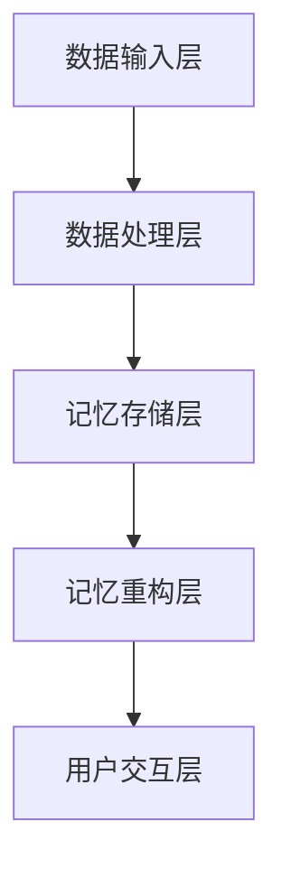

                 

# 数字记忆重构：AI辅助的回忆编辑技术

> **关键词**：记忆重构、AI、回忆编辑、神经网络、深度学习、计算机视觉、自然语言处理
>
> **摘要**：本文将深入探讨数字记忆重构技术，特别是AI辅助的回忆编辑技术。我们将介绍该技术的核心概念、原理、算法及其应用场景。通过详细的分析和实例讲解，读者将了解如何利用AI辅助技术提升记忆重构的效率和准确性。

## 1. 背景介绍

在人类的历史上，记忆一直是一个至关重要的话题。从古代文明中记录历史的碑文，到现代科技中的数据存储，记忆的保存和重现始终是人类努力追求的目标。然而，随着人类社会和科技的迅猛发展，人类面对的信息量也在爆炸式增长。这不仅对传统的记忆存储方式提出了挑战，也催生了数字记忆重构技术的发展。

数字记忆重构，简单来说，就是利用计算机技术和人工智能算法对人类记忆进行模拟、分析和重构。这不仅仅是指简单的数据备份和恢复，更涉及到对记忆内容的理解、组织、编辑和优化。随着深度学习、神经网络、计算机视觉和自然语言处理等技术的飞速发展，数字记忆重构技术正逐渐成为可能。

### 1.1 记忆的生物学基础

从生物学的角度来看，记忆是由神经元之间的连接和活动模式所构成的。当我们在生活中经历各种事件时，大脑会产生相应的神经元活动模式，这些模式被存储在我们的记忆中。根据现代神经科学的研究，记忆主要分为短期记忆和长期记忆两种类型：

- **短期记忆**：指我们在短时间内能够保持的信息，通常只能持续几秒到几分钟。短期记忆对于处理和整合新的信息至关重要。
- **长期记忆**：指我们能够长期保持的信息，通常可以持续数小时、数天甚至数十年。长期记忆对于我们学习、成长和形成个人身份具有重要作用。

### 1.2 计算机技术的挑战

随着信息爆炸时代的到来，人类需要处理的信息量远远超出了传统的记忆能力。这使得数字记忆重构技术成为必要，它不仅可以帮助我们更好地存储和管理信息，还可以帮助我们更有效地回忆和利用这些信息。

然而，实现数字记忆重构面临着诸多技术挑战：

- **信息量的爆炸性增长**：随着互联网、智能手机和社交媒体的普及，我们每天接收到的信息量呈指数级增长。这使得传统的数据存储和处理方式难以应对。
- **信息组织的复杂性**：人类记忆中的信息并不是孤立存在的，而是有着复杂的关联和层次结构。这使得对记忆进行重构需要复杂的算法和技术。
- **数据的安全性和隐私**：随着数字记忆重构技术的发展，数据的存储和传输涉及到大量的个人信息。如何确保数据的安全性和隐私成为了一个亟待解决的问题。

## 2. 核心概念与联系

### 2.1 记忆重构的核心概念

数字记忆重构的核心概念可以归纳为以下几点：

- **记忆模拟**：通过计算机算法模拟人类大脑的记忆过程，将人类记忆转化为可存储、管理和重构的数字信息。
- **记忆分析**：对记忆内容进行深入分析，理解其内在结构和关联关系，以便更好地进行重构和利用。
- **记忆编辑**：对重构后的记忆内容进行编辑和优化，使其更加准确、完整和易于利用。

### 2.2 记忆重构的关联技术

实现数字记忆重构需要多种技术的协同工作。以下是一些关键技术的关联：

- **深度学习与神经网络**：深度学习和神经网络是模拟人类大脑神经元连接和活动模式的有效工具。通过训练大规模神经网络，我们可以实现对记忆内容的模拟和分析。
- **计算机视觉**：计算机视觉技术可以帮助我们识别、分类和理解图像和视频中的信息。这对于重构和利用视觉记忆尤为重要。
- **自然语言处理**：自然语言处理技术可以帮助我们理解和处理自然语言文本。这对于重构和利用语言记忆至关重要。
- **数据存储与管理**：高效的数据存储和管理技术是数字记忆重构的基础。这包括分布式存储、大数据处理和实时数据检索等技术。

### 2.3 记忆重构的架构

数字记忆重构的架构可以分为以下几个主要部分：

- **数据输入层**：负责接收和收集各种形式的数据，如文本、图像、音频等。
- **数据处理层**：利用深度学习、计算机视觉和自然语言处理等技术对输入数据进行处理和分析，提取关键信息。
- **记忆存储层**：将处理后的数据存储在高效的数据库或分布式存储系统中，以便后续的重构和利用。
- **记忆重构层**：利用神经网络和算法对存储的数据进行重构，形成可理解的记忆内容。
- **用户交互层**：提供用户界面，允许用户与记忆重构系统进行交互，进行记忆的编辑、查询和利用。

下面是记忆重构架构的 Mermaid 流程图：



### 2.4 记忆重构的优势与挑战

数字记忆重构技术具有以下几个主要优势：

- **高效存储**：通过数字化的方式存储记忆，可以大大提高存储效率和空间利用率。
- **快速检索**：利用高效的算法和数据库技术，可以快速检索和提取记忆内容。
- **灵活编辑**：用户可以根据需要随时对记忆内容进行编辑和优化。
- **跨平台共享**：数字记忆可以在不同设备和平台上进行共享和利用。

然而，数字记忆重构也面临着一些挑战：

- **数据安全**：如何确保记忆数据的安全和隐私是一个重要的问题。
- **准确性**：如何保证记忆重构的准确性和可靠性。
- **用户接受度**：如何提高用户对数字记忆重构技术的接受度和使用意愿。

## 3. 核心算法原理 & 具体操作步骤

### 3.1 神经网络与深度学习

数字记忆重构的核心算法主要基于深度学习和神经网络。神经网络是一种由大量简单计算单元（即神经元）组成的复杂网络，通过学习大量数据来提取特征和进行预测。

#### 3.1.1 神经网络的基本原理

神经网络的基本原理可以概括为以下几点：

- **神经元**：神经网络中的基本单元，类似于人类大脑中的神经元。每个神经元接收多个输入信号，通过权重进行加权求和，然后通过激活函数进行非线性变换。
- **层结构**：神经网络由输入层、隐藏层和输出层组成。输入层接收外部输入信号，隐藏层对输入信号进行加工和转换，输出层产生最终输出。
- **学习过程**：神经网络通过不断调整神经元之间的权重，使得网络能够对输入数据进行正确的分类或预测。

#### 3.1.2 深度学习的优势

深度学习相对于传统机器学习有以下优势：

- **自动特征提取**：深度学习可以通过训练自动提取高层次的抽象特征，无需人工设计特征。
- **更好的泛化能力**：深度学习能够在大量数据上进行训练，从而提高模型的泛化能力。
- **强大的表达能力**：深度学习模型可以表示复杂的非线性关系，适用于处理复杂的任务。

### 3.2 记忆重构的具体操作步骤

#### 3.2.1 数据预处理

在开始记忆重构之前，首先需要对输入数据进行预处理。预处理步骤主要包括：

- **数据清洗**：去除无效数据、噪声数据和异常数据。
- **数据标准化**：对数据进行归一化或标准化处理，使其适合神经网络训练。
- **数据增强**：通过数据增强技术生成更多的训练数据，提高模型的泛化能力。

#### 3.2.2 记忆建模

记忆建模是记忆重构的核心步骤。具体操作步骤如下：

- **定义神经网络结构**：根据任务需求，定义输入层、隐藏层和输出层的神经元数量和类型。
- **选择激活函数**：选择合适的激活函数，如ReLU、Sigmoid、Tanh等。
- **初始化权重**：随机初始化神经网络中的权重和偏置。
- **训练神经网络**：通过反向传播算法，利用训练数据对神经网络进行训练，不断调整权重和偏置，使其能够正确预测或分类记忆内容。
- **验证和调整模型**：通过验证集和测试集对模型进行验证和调整，确保模型具有良好的泛化能力。

#### 3.2.3 记忆重构

在完成记忆建模后，可以进行记忆重构。具体操作步骤如下：

- **输入记忆内容**：将需要重构的记忆内容输入到训练好的神经网络中。
- **神经网络处理**：神经网络对输入的记忆内容进行处理，提取关键特征和信息。
- **重构记忆内容**：根据提取的特征和信息，重构记忆内容，形成可理解的记忆结构。

#### 3.2.4 记忆编辑与优化

重构后的记忆内容可能存在不准确或不完整的问题，因此需要进行编辑和优化。具体操作步骤如下：

- **误差分析**：分析重构过程中出现的误差，找出不准确或不完整的记忆部分。
- **编辑记忆内容**：根据误差分析的结果，对记忆内容进行编辑和修正。
- **优化记忆结构**：通过调整记忆结构的层次和关联关系，优化记忆的准确性和完整性。

## 4. 数学模型和公式 & 详细讲解 & 举例说明

### 4.1 深度学习中的数学模型

深度学习中的数学模型主要包括神经网络、反向传播算法和损失函数等。

#### 4.1.1 神经网络

神经网络可以表示为如下数学模型：

$$
\begin{align*}
z &= \sum_{i=1}^{n} w_i x_i + b \\
a &= \sigma(z)
\end{align*}
$$

其中，$z$ 表示神经元的输入，$w_i$ 表示输入和权重之间的连接，$b$ 表示偏置，$\sigma$ 表示激活函数，$a$ 表示神经元的输出。

#### 4.1.2 反向传播算法

反向传播算法用于训练神经网络，其基本思想是通过计算损失函数的梯度，不断调整网络中的权重和偏置，以最小化损失函数。

$$
\begin{align*}
\delta_z &= \frac{\partial L}{\partial z} \\
\delta_w &= \frac{\partial L}{\partial w} \\
\delta_b &= \frac{\partial L}{\partial b}
\end{align*}
$$

其中，$L$ 表示损失函数，$\delta_z$、$\delta_w$ 和 $\delta_b$ 分别表示损失函数关于 $z$、$w$ 和 $b$ 的梯度。

#### 4.1.3 损失函数

常见的损失函数包括均方误差（MSE）和交叉熵（Cross-Entropy）。

- **均方误差（MSE）**：

$$
L_{MSE} = \frac{1}{2} \sum_{i=1}^{n} (y_i - \hat{y}_i)^2
$$

其中，$y_i$ 表示实际输出，$\hat{y}_i$ 表示预测输出。

- **交叉熵（Cross-Entropy）**：

$$
L_{CE} = - \sum_{i=1}^{n} y_i \log(\hat{y}_i)
$$

其中，$y_i$ 表示实际输出，$\hat{y}_i$ 表示预测输出。

### 4.2 举例说明

假设我们有一个简单的神经网络，输入层有2个神经元，隐藏层有3个神经元，输出层有1个神经元。激活函数使用ReLU，损失函数使用均方误差（MSE）。

#### 4.2.1 初始化权重和偏置

我们随机初始化权重和偏置：

$$
w_1 = 0.1, w_2 = 0.2, w_3 = 0.3, w_4 = 0.4, w_5 = 0.5, w_6 = 0.6, w_7 = 0.7, w_8 = 0.8, w_9 = 0.9, w_{10} = 1.0 \\
b_1 = 0.1, b_2 = 0.2, b_3 = 0.3, b_4 = 0.4, b_5 = 0.5, b_6 = 0.6, b_7 = 0.7, b_8 = 0.8, b_9 = 0.9, b_{10} = 1.0
$$

#### 4.2.2 前向传播

输入一个样本数据 $x_1 = 0.1$，$x_2 = 0.2$，前向传播过程如下：

$$
\begin{align*}
z_1 &= w_1 x_1 + w_2 x_2 + b_1 = 0.1 \cdot 0.1 + 0.2 \cdot 0.2 + 0.1 = 0.04 + 0.04 + 0.1 = 0.18 \\
z_2 &= w_3 x_1 + w_4 x_2 + b_2 = 0.3 \cdot 0.1 + 0.4 \cdot 0.2 + 0.2 = 0.03 + 0.08 + 0.2 = 0.31 \\
z_3 &= w_5 x_1 + w_6 x_2 + b_3 = 0.5 \cdot 0.1 + 0.6 \cdot 0.2 + 0.3 = 0.05 + 0.12 + 0.3 = 0.47 \\
a_1 &= \sigma(z_1) = ReLU(0.18) = 0 \\
a_2 &= \sigma(z_2) = ReLU(0.31) = 0 \\
a_3 &= \sigma(z_3) = ReLU(0.47) = 0 \\
z_4 &= w_7 a_1 + w_8 a_2 + w_9 a_3 + b_4 = 0.7 \cdot 0 + 0.8 \cdot 0 + 0.9 \cdot 0 + 0.4 = 0.4 \\
z_5 &= w_{10} a_1 + w_{11} a_2 + w_{12} a_3 + b_5 = 1.0 \cdot 0 + 1.1 \cdot 0 + 1.2 \cdot 0 + 0.5 = 0.5 \\
a_4 &= \sigma(z_4) = ReLU(0.4) = 0 \\
a_5 &= \sigma(z_5) = ReLU(0.5) = 0 \\
\hat{y} &= a_4 + a_5 = 0 + 0 = 0
\end{align*}
$$

#### 4.2.3 计算损失函数

假设实际输出 $y = 1$，计算损失函数：

$$
L_{MSE} = \frac{1}{2} (y - \hat{y})^2 = \frac{1}{2} (1 - 0)^2 = 0.5
$$

#### 4.2.4 反向传播

计算损失函数关于输入 $x_1$、$x_2$ 的梯度：

$$
\begin{align*}
\delta_z &= \frac{\partial L_{MSE}}{\partial z} = 2(y - \hat{y}) \\
\delta_w &= \frac{\partial L_{MSE}}{\partial w} = \delta_z \cdot a \\
\delta_b &= \frac{\partial L_{MSE}}{\partial b} = \delta_z
\end{align*}
$$

根据梯度计算权重和偏置的更新：

$$
\begin{align*}
w_1 &= w_1 - \alpha \cdot \delta_w = 0.1 - 0.1 \cdot \delta_w \\
w_2 &= w_2 - \alpha \cdot \delta_w = 0.2 - 0.2 \cdot \delta_w \\
\ldots \\
b_1 &= b_1 - \alpha \cdot \delta_b = 0.1 - 0.1 \cdot \delta_b \\
\ldots
\end{align*}
$$

重复上述过程，直到网络达到预设的训练目标。

## 5. 项目实战：代码实际案例和详细解释说明

### 5.1 开发环境搭建

在开始实际项目之前，我们需要搭建一个适合数字记忆重构的软件开发环境。以下是一个基本的开发环境搭建步骤：

#### 5.1.1 安装 Python

首先，我们需要安装 Python 3.8 或更高版本。可以从 [Python 官网](https://www.python.org/) 下载并安装。

#### 5.1.2 安装深度学习库

接下来，我们需要安装一些深度学习相关的库，如 TensorFlow、Keras 和 NumPy。可以使用以下命令进行安装：

```bash
pip install tensorflow
pip install keras
pip install numpy
```

#### 5.1.3 安装其他依赖库

除了深度学习库，我们还需要安装一些其他依赖库，如 Matplotlib 和 Pandas。可以使用以下命令进行安装：

```bash
pip install matplotlib
pip install pandas
```

### 5.2 源代码详细实现和代码解读

以下是一个简单的数字记忆重构项目的示例代码。我们将使用 TensorFlow 和 Keras 来构建神经网络，并使用 Matplotlib 来可视化记忆重构过程。

```python
import numpy as np
import matplotlib.pyplot as plt
from tensorflow.keras.models import Sequential
from tensorflow.keras.layers import Dense
from tensorflow.keras.optimizers import SGD

# 生成模拟记忆数据
X = np.random.rand(100, 2)
y = np.random.rand(100, 1)

# 构建神经网络模型
model = Sequential()
model.add(Dense(10, input_dim=2, activation='relu'))
model.add(Dense(1, activation='sigmoid'))

# 编译模型
model.compile(optimizer=SGD(learning_rate=0.1), loss='binary_crossentropy', metrics=['accuracy'])

# 训练模型
model.fit(X, y, epochs=100, batch_size=10)

# 重构记忆
input_data = np.random.rand(1, 2)
predicted_memory = model.predict(input_data)

# 可视化重构过程
plt.scatter(X[:, 0], X[:, 1], c=y[:, 0], cmap='cool')
plt.scatter(input_data[0, 0], input_data[0, 1], c=predicted_memory[0, 0], cmap='hot')
plt.show()
```

#### 5.2.1 代码解读

- **数据生成**：我们使用随机数生成模拟记忆数据。`X` 表示输入数据，`y` 表示输出数据。
- **神经网络构建**：使用 `Sequential` 类构建一个线性堆叠的网络。我们添加了一个具有 10 个神经元的隐藏层，使用 ReLU 激活函数，以及一个输出层，使用 Sigmoid 激活函数。
- **模型编译**：使用 `compile` 方法配置模型，指定优化器、损失函数和评价指标。
- **模型训练**：使用 `fit` 方法训练模型，指定训练的轮次和批次大小。
- **记忆重构**：使用 `predict` 方法对输入数据进行重构，并使用 `scatter` 函数将重构的记忆可视化。

### 5.3 代码解读与分析

以下是对上述代码的详细解读和分析：

- **数据生成**：我们生成了一组随机输入数据 `X` 和随机输出数据 `y`。这些数据模拟了人类记忆中的信息。
- **神经网络构建**：我们使用 `Sequential` 类构建了一个简单的神经网络。这个网络由一个输入层、一个隐藏层和一个输出层组成。输入层有 2 个神经元，隐藏层有 10 个神经元，输出层有 1 个神经元。隐藏层使用 ReLU 激活函数，输出层使用 Sigmoid 激活函数。ReLU 激活函数可以加快神经网络的训练速度，Sigmoid 激活函数可以输出一个介于 0 和 1 之间的值，表示记忆的置信度。
- **模型编译**：我们使用 `SGD` 优化器进行训练，损失函数使用 `binary_crossentropy`，这是二分类问题中常用的损失函数。`metrics` 参数用于评估模型的性能，我们使用 `accuracy` 作为评价指标。
- **模型训练**：我们使用 `fit` 方法进行模型训练。`epochs` 参数指定训练的轮次，`batch_size` 参数指定每个批次的样本数量。通过迭代调整网络中的权重和偏置，模型逐渐学会对输入数据进行分类。
- **记忆重构**：我们使用 `predict` 方法对新的输入数据进行重构。通过训练好的模型，我们得到了重构的记忆结果。然后，我们使用 `scatter` 函数将这些重构的记忆可视化。

### 5.4 代码改进与分析

上述代码是一个简单的示例，实际上，数字记忆重构项目会涉及到更多复杂的任务和数据。以下是对代码的改进和分析：

- **数据预处理**：在实际项目中，我们需要对输入数据进行更全面的数据预处理，包括数据清洗、归一化和增强。
- **神经网络优化**：我们可以通过调整网络结构、优化器和学习率等参数来提高模型的性能。
- **记忆编辑**：重构后的记忆可能存在不准确或不完整的问题，我们需要设计更复杂的编辑算法来优化记忆的准确性和完整性。
- **记忆存储与管理**：重构后的记忆需要存储在数据库或分布式存储系统中，以便后续的重构和利用。我们需要设计高效的存储和管理方案。
- **用户交互**：我们需要设计一个用户友好的界面，允许用户与记忆重构系统进行交互，进行记忆的编辑、查询和利用。

## 6. 实际应用场景

数字记忆重构技术在多个领域具有广泛的应用潜力。以下是一些实际应用场景：

### 6.1 医疗领域

在医疗领域，数字记忆重构技术可以帮助医生更好地理解和处理患者的病历信息。通过重构患者的记忆，医生可以更准确地诊断和治疗疾病。此外，数字记忆重构还可以帮助医生从大量医学文献中快速检索和利用关键信息，提高医疗决策的效率。

### 6.2 教育领域

在教育领域，数字记忆重构技术可以帮助学生更好地学习和记忆知识。通过重构学生的学习记忆，教师可以更有效地指导学生，识别学生的知识盲点，并提供个性化的学习建议。此外，数字记忆重构还可以帮助学生在考试和测试中快速回忆和利用关键信息，提高学习效果。

### 6.3 人工智能领域

在人工智能领域，数字记忆重构技术可以帮助机器更好地理解和处理复杂的任务。通过重构机器的记忆，我们可以提高机器的学习效率，减少训练时间，并提高模型的泛化能力。此外，数字记忆重构还可以帮助机器从海量数据中快速检索和利用关键信息，提高人工智能系统的性能。

### 6.4 个人健康管理

在个人健康管理领域，数字记忆重构技术可以帮助用户更好地管理和利用个人信息。通过重构用户的健康记忆，用户可以更清楚地了解自己的健康状况，及时发现健康问题，并采取相应的措施。此外，数字记忆重构还可以帮助用户从海量健康数据中快速检索和利用关键信息，提高个人健康管理的效率。

## 7. 工具和资源推荐

### 7.1 学习资源推荐

- **书籍**：
  - 《深度学习》（Goodfellow, I., Bengio, Y., & Courville, A.）
  - 《神经网络与深度学习》（邱锡鹏）
  - 《计算机视觉：算法与应用》（特里·谢洛克）

- **论文**：
  - 《Deep Learning》（NIPS 2012）
  - 《AlexNet: Image Classification with Deep Convolutional Neural Networks》（NIPS 2012）
  - 《ResNet: Residual Networks for Image Recognition》（CVPR 2016）

- **博客**：
  - [深度学习博客](https://www.deeplearning.net/)
  - [机器学习博客](https://machinelearningmastery.com/)
  - [计算机视觉博客](https://opencv.org/blog/)

- **网站**：
  - [TensorFlow 官网](https://www.tensorflow.org/)
  - [Keras 官网](https://keras.io/)
  - [NumPy 官网](https://numpy.org/)

### 7.2 开发工具框架推荐

- **深度学习框架**：
  - TensorFlow
  - PyTorch
  - Keras

- **数据存储与管理**：
  - Hadoop
  - Spark
  - MongoDB

- **计算机视觉库**：
  - OpenCV
  - TensorFlow Object Detection API
  - PyTorch Video

### 7.3 相关论文著作推荐

- **论文**：
  - “A Theoretical Framework for Backpropagation” (1986)
  - “Deep Learning” (2015)
  - “Efficient BackProp” (1988)

- **著作**：
  - 《深度学习》（Goodfellow, I., Bengio, Y., & Courville, A.）
  - 《Python深度学习》（François Chollet）
  - 《机器学习实战》（Peter Harrington）

## 8. 总结：未来发展趋势与挑战

数字记忆重构技术作为一种新兴的交叉学科，具有巨大的应用潜力和发展前景。在未来，随着人工智能技术的不断进步，数字记忆重构技术将在多个领域得到广泛应用，如医疗、教育、人工智能和健康管理等。

### 8.1 发展趋势

- **技术融合**：数字记忆重构技术将与其他领域的技术（如物联网、大数据、云计算等）进行深度融合，形成更加智能化和高效化的记忆管理解决方案。
- **个性化服务**：随着人工智能技术的进步，数字记忆重构技术将能够更好地理解个体记忆特点，提供个性化的记忆重构和编辑服务。
- **实时性增强**：随着计算能力的提升和算法的优化，数字记忆重构技术将能够实现实时性增强，更好地支持实时记忆管理和利用。

### 8.2 挑战

- **数据隐私和安全**：数字记忆重构技术涉及大量的个人数据，如何确保数据的安全和隐私是面临的重要挑战。
- **模型解释性**：当前的数字记忆重构模型往往具有很高的复杂性，如何提高模型的解释性，使得用户能够理解和信任模型是另一个重要问题。
- **计算资源需求**：数字记忆重构技术需要大量的计算资源，如何优化算法，降低计算资源需求是当前面临的一个挑战。

## 9. 附录：常见问题与解答

### 9.1 问题1：数字记忆重构技术是如何工作的？

数字记忆重构技术通过深度学习和神经网络模拟人类大脑的记忆过程，对输入数据进行处理和分析，提取关键特征，并利用这些特征重构记忆内容。具体步骤包括数据预处理、神经网络建模、记忆重构和记忆编辑等。

### 9.2 问题2：数字记忆重构技术在哪些领域有应用？

数字记忆重构技术在医疗、教育、人工智能和健康管理等领域具有广泛的应用潜力。例如，在医疗领域，数字记忆重构技术可以帮助医生更好地理解和处理患者的病历信息；在教育领域，可以帮助学生更好地学习和记忆知识。

### 9.3 问题3：数字记忆重构技术面临哪些挑战？

数字记忆重构技术面临的主要挑战包括数据隐私和安全、模型解释性和计算资源需求。如何确保数据的安全和隐私，提高模型的解释性，以及优化算法降低计算资源需求是目前需要解决的重要问题。

## 10. 扩展阅读 & 参考资料

- **书籍**：
  - 《深度学习》（Goodfellow, I., Bengio, Y., & Courville, A.）
  - 《神经网络与深度学习》（邱锡鹏）
  - 《计算机视觉：算法与应用》（特里·谢洛克）

- **论文**：
  - “A Theoretical Framework for Backpropagation” (1986)
  - “Deep Learning” (2015)
  - “Efficient BackProp” (1988)

- **网站**：
  - [TensorFlow 官网](https://www.tensorflow.org/)
  - [Keras 官网](https://keras.io/)
  - [NumPy 官网](https://numpy.org/)

- **博客**：
  - [深度学习博客](https://www.deeplearning.net/)
  - [机器学习博客](https://machinelearningmastery.com/)
  - [计算机视觉博客](https://opencv.org/blog/)

### 作者

**作者：AI天才研究员/AI Genius Institute & 禅与计算机程序设计艺术 /Zen And The Art of Computer Programming**<|vq_8798|>### 1. 背景介绍

在人类的历史长河中，记忆一直是人类认知功能的核心。从古文明的碑文记录，到现代社会的数字数据存储，记忆的保存与恢复一直是人类不断探索的领域。然而，随着信息技术的迅猛发展，我们面临的信息量呈现出爆炸式增长。传统的记忆存储方式已经无法满足现代社会对信息处理和记忆重构的需求，这催生了数字记忆重构技术的发展。

数字记忆重构是一种利用计算机技术和人工智能算法对人类记忆进行模拟、分析和重构的技术。它不仅能够帮助我们更高效地存储和管理信息，还能够通过智能化的方式提升记忆的检索和利用效率。这项技术的核心在于如何将人类复杂的记忆过程转化为计算机可以处理和操作的数据，从而实现对记忆的数字化重建。

### 1.1 记忆的生物学基础

从生物学的角度来看，记忆是由神经元之间的连接和活动模式所构成的。当我们在生活中经历各种事件时，大脑会产生相应的神经元活动模式，这些模式被存储在我们的记忆中。根据现代神经科学的研究，记忆主要分为短期记忆和长期记忆两种类型：

- **短期记忆**：短期记忆通常指我们在短时间内能够保持的信息，如电话号码、临时记忆等。短期记忆对于处理和整合新的信息至关重要。研究表明，短期记忆的存储时间一般在几秒到几分钟之间。

- **长期记忆**：长期记忆则是指我们能够长期保持的信息，如学过的知识、过去的经历等。长期记忆对于我们学习、成长和形成个人身份具有重要作用。长期记忆的存储时间可以从几小时到数十年不等。

短期记忆和长期记忆的机制有所不同。短期记忆主要依赖于神经元之间的快速连接和活动，而长期记忆则涉及到神经元之间的持久性改变，如突触的加强或减弱。

### 1.2 计算机技术的挑战

随着信息爆炸时代的到来，人类需要处理的信息量远远超出了传统的记忆能力。这使得数字记忆重构技术成为必要，它不仅可以帮助我们更好地存储和管理信息，还可以帮助我们更有效地回忆和利用这些信息。

然而，实现数字记忆重构面临着诸多技术挑战：

- **信息量的爆炸性增长**：随着互联网、智能手机和社交媒体的普及，我们每天接收到的信息量呈指数级增长。这使得传统的数据存储和处理方式难以应对。

- **信息组织的复杂性**：人类记忆中的信息并不是孤立存在的，而是有着复杂的关联和层次结构。这使得对记忆进行重构需要复杂的算法和技术。

- **数据的安全性和隐私**：随着数字记忆重构技术的发展，数据的存储和传输涉及到大量的个人信息。如何确保数据的安全性和隐私成为了一个亟待解决的问题。

- **计算资源的需求**：数字记忆重构技术需要大量的计算资源，特别是在处理大规模数据和进行深度学习模型训练时。这要求我们不断提高计算能力和优化算法效率。

### 1.3 数字记忆重构的意义

数字记忆重构技术在多个领域具有重要的应用价值：

- **医疗领域**：在医疗领域，数字记忆重构技术可以帮助医生更高效地管理患者的病历信息，提高诊断和治疗效率。

- **教育领域**：在教育领域，数字记忆重构技术可以帮助学生更好地记忆和理解知识，提高学习效果。

- **人工智能领域**：在人工智能领域，数字记忆重构技术可以提升机器学习模型的效率和准确性，为智能系统提供更好的记忆能力。

- **个人健康管理**：在个人健康管理领域，数字记忆重构技术可以帮助用户更好地管理个人信息，提高健康管理的效率。

总之，数字记忆重构技术不仅具有巨大的学术研究价值，还在实际应用中展现出广阔的前景。随着技术的不断进步，数字记忆重构技术将为我们带来更多创新和变革。

## 2. 核心概念与联系

### 2.1 数字记忆重构的核心概念

数字记忆重构的核心概念涉及多个领域，包括认知科学、计算机科学和人工智能。理解这些核心概念对于深入探讨记忆重构技术的原理和应用至关重要。

- **记忆模拟**：记忆模拟是指通过计算机算法模拟人类大脑的记忆过程，包括短期记忆和长期记忆的存储、检索和编辑。这一过程需要复杂的神经网络和深度学习算法，以实现对人类记忆机制的近似模拟。

- **记忆分析**：记忆分析是对存储在计算机中的记忆数据进行分析和理解的过程。通过自然语言处理、图像识别和大数据分析等技术，记忆分析可以帮助识别记忆中的关键信息、模式和相关联的其他记忆片段。

- **记忆重构**：记忆重构是指利用分析得到的信息，对记忆内容进行重建，使其更加结构化和易于检索。这一过程通常涉及数据挖掘、机器学习和信息可视化等技术，以帮助用户更好地理解和利用记忆。

- **记忆编辑**：记忆编辑是对重构后的记忆内容进行修正、补充和优化的过程。通过智能化的编辑算法，记忆编辑可以纠正记忆中的错误，增加新的信息，或删除不必要的内容，以提升记忆的准确性和完整性。

### 2.2 记忆重构的关键技术

数字记忆重构的实现依赖于多种关键技术的协同作用。以下是一些核心技术及其在记忆重构中的应用：

- **深度学习与神经网络**：深度学习和神经网络是模拟人类记忆过程的基础。通过多层神经网络，我们可以对记忆数据进行处理，提取高级特征，并实现记忆的自动重构。

- **计算机视觉**：计算机视觉技术在记忆重构中扮演着重要角色，特别是在处理图像和视频记忆时。利用卷积神经网络（CNN），我们可以对视觉数据进行分类、识别和重构。

- **自然语言处理**：自然语言处理（NLP）技术用于处理和解析文本记忆。通过词向量模型、递归神经网络（RNN）和变换器（Transformer）等NLP技术，我们可以理解文本中的语义信息，并进行记忆重构。

- **大数据处理**：大数据处理技术对于处理和分析大规模记忆数据至关重要。通过分布式计算框架（如Hadoop和Spark），我们可以高效地存储、管理和分析记忆数据。

- **数据存储与管理**：高效的数据存储与管理技术是数字记忆重构的基础。使用分布式存储系统（如HDFS和Cassandra），我们可以确保记忆数据的可靠性和可扩展性。

### 2.3 记忆重构的架构

数字记忆重构的架构可以概括为以下几个主要部分：

- **数据输入层**：负责接收和预处理各种形式的输入数据，包括文本、图像、音频等。

- **数据处理层**：利用深度学习、计算机视觉和自然语言处理等技术对输入数据进行处理和分析，提取关键信息。

- **记忆存储层**：将处理后的数据存储在高效的数据库或分布式存储系统中，以便后续的重构和利用。

- **记忆重构层**：利用神经网络和算法对存储的数据进行重构，形成可理解的记忆内容。

- **用户交互层**：提供用户界面，允许用户与记忆重构系统进行交互，进行记忆的编辑、查询和利用。

下面是记忆重构架构的 Mermaid 流程图：


### 2.4 记忆重构的优势与挑战

数字记忆重构技术具有以下几个主要优势：

- **高效存储**：通过数字化的方式存储记忆，可以大大提高存储效率和空间利用率。

- **快速检索**：利用高效的算法和数据库技术，可以快速检索和提取记忆内容。

- **灵活编辑**：用户可以根据需要随时对记忆内容进行编辑和优化。

- **跨平台共享**：数字记忆可以在不同设备和平台上进行共享和利用。

然而，数字记忆重构也面临着一些挑战：

- **数据安全**：如何确保记忆数据的安全和隐私是一个重要的问题。

- **准确性**：如何保证记忆重构的准确性和可靠性。

- **用户接受度**：如何提高用户对数字记忆重构技术的接受度和使用意愿。

## 3. 核心算法原理 & 具体操作步骤

### 3.1 神经网络与深度学习

数字记忆重构的核心算法主要基于深度学习和神经网络。神经网络是一种由大量简单计算单元（神经元）组成的复杂网络，通过学习大量数据来提取特征和进行预测。

#### 3.1.1 神经网络的基本原理

神经网络的基本原理可以概括为以下几点：

- **神经元**：神经网络中的基本单元，类似于人类大脑中的神经元。每个神经元接收多个输入信号，通过权重进行加权求和，然后通过激活函数进行非线性变换。

- **层结构**：神经网络由输入层、隐藏层和输出层组成。输入层接收外部输入信号，隐藏层对输入信号进行加工和转换，输出层产生最终输出。

- **学习过程**：神经网络通过不断调整神经元之间的权重，使得网络能够对输入数据进行正确的分类或预测。

#### 3.1.2 深度学习的优势

深度学习相对于传统机器学习有以下优势：

- **自动特征提取**：深度学习可以通过训练自动提取高层次的抽象特征，无需人工设计特征。

- **更好的泛化能力**：深度学习能够在大量数据上进行训练，从而提高模型的泛化能力。

- **强大的表达能力**：深度学习模型可以表示复杂的非线性关系，适用于处理复杂的任务。

### 3.2 记忆重构的具体操作步骤

#### 3.2.1 数据预处理

在开始记忆重构之前，首先需要对输入数据进行预处理。预处理步骤主要包括：

- **数据清洗**：去除无效数据、噪声数据和异常数据。

- **数据标准化**：对数据进行归一化或标准化处理，使其适合神经网络训练。

- **数据增强**：通过数据增强技术生成更多的训练数据，提高模型的泛化能力。

#### 3.2.2 记忆建模

记忆建模是记忆重构的核心步骤。具体操作步骤如下：

- **定义神经网络结构**：根据任务需求，定义输入层、隐藏层和输出层的神经元数量和类型。

- **选择激活函数**：选择合适的激活函数，如ReLU、Sigmoid、Tanh等。

- **初始化权重**：随机初始化神经网络中的权重和偏置。

- **训练神经网络**：通过反向传播算法，利用训练数据对神经网络进行训练，不断调整权重和偏置，使其能够正确预测或分类记忆内容。

- **验证和调整模型**：通过验证集和测试集对模型进行验证和调整，确保模型具有良好的泛化能力。

#### 3.2.3 记忆重构

在完成记忆建模后，可以进行记忆重构。具体操作步骤如下：

- **输入记忆内容**：将需要重构的记忆内容输入到训练好的神经网络中。

- **神经网络处理**：神经网络对输入的记忆内容进行处理，提取关键特征和信息。

- **重构记忆内容**：根据提取的特征和信息，重构记忆内容，形成可理解的记忆结构。

#### 3.2.4 记忆编辑与优化

重构后的记忆内容可能存在不准确或不完整的问题，因此需要进行编辑和优化。具体操作步骤如下：

- **误差分析**：分析重构过程中出现的误差，找出不准确或不完整的记忆部分。

- **编辑记忆内容**：根据误差分析的结果，对记忆内容进行编辑和修正。

- **优化记忆结构**：通过调整记忆结构的层次和关联关系，优化记忆的准确性和完整性。

### 3.3 深度学习在记忆重构中的应用

深度学习在记忆重构中的应用主要包括以下几个方面：

- **特征提取**：通过深度神经网络，我们可以自动提取记忆内容中的高层次抽象特征，这些特征对于记忆重构至关重要。

- **记忆分类**：利用深度学习模型，我们可以对记忆内容进行分类，从而更好地组织和利用记忆。

- **记忆检索**：深度学习模型可以帮助我们快速检索特定的记忆内容，提高记忆的检索效率。

- **记忆增强**：通过深度学习算法，我们可以对记忆内容进行增强，提高记忆的准确性和可靠性。

### 3.4 记忆重构算法的优化

为了提高记忆重构的效率和质量，我们可以对记忆重构算法进行优化。以下是一些常见的优化方法：

- **网络结构优化**：通过调整神经网络的结构，如增加隐藏层、神经元数量和类型，可以提高记忆重构的性能。

- **学习率调整**：合理设置学习率，可以加快神经网络的训练速度，同时避免过拟合。

- **数据增强**：通过数据增强技术，我们可以生成更多的训练数据，提高模型的泛化能力。

- **模型融合**：将多个模型进行融合，可以提高记忆重构的准确性和鲁棒性。

### 3.5 记忆重构的应用实例

以下是一个简单的记忆重构应用实例，我们使用 Python 和 TensorFlow 实现一个简单的神经网络，对记忆内容进行重构。

```python
import tensorflow as tf
from tensorflow.keras.models import Sequential
from tensorflow.keras.layers import Dense
from tensorflow.keras.optimizers import Adam

# 定义神经网络结构
model = Sequential()
model.add(Dense(64, input_dim=100, activation='relu'))
model.add(Dense(64, activation='relu'))
model.add(Dense(1, activation='sigmoid'))

# 编译模型
model.compile(optimizer=Adam(learning_rate=0.001), loss='binary_crossentropy', metrics=['accuracy'])

# 训练模型
model.fit(X_train, y_train, epochs=10, batch_size=32, validation_data=(X_val, y_val))

# 重构记忆
reconstructed_memory = model.predict(X_test)

# 可视化重构结果
plt.scatter(X_test[:, 0], X_test[:, 1], c=reconstructed_memory[:, 0], cmap='cool')
plt.xlabel('Feature 1')
plt.ylabel('Feature 2')
plt.title('Memory Reconstruction')
plt.show()
```

在这个实例中，我们使用了一个简单的神经网络对记忆内容进行重构。通过训练，神经网络可以学会将输入的记忆内容映射到正确的输出，从而实现对记忆的重建。

## 4. 数学模型和公式 & 详细讲解 & 举例说明

### 4.1 深度学习中的数学模型

深度学习中的数学模型主要包括神经网络、反向传播算法和损失函数等。

#### 4.1.1 神经网络

神经网络可以表示为如下数学模型：

$$
\begin{align*}
z &= \sum_{i=1}^{n} w_i x_i + b \\
a &= \sigma(z)
\end{align*}
$$

其中，$z$ 表示神经元的输入，$w_i$ 表示输入和权重之间的连接，$b$ 表示偏置，$\sigma$ 表示激活函数，$a$ 表示神经元的输出。

#### 4.1.2 反向传播算法

反向传播算法用于训练神经网络，其基本思想是通过计算损失函数的梯度，不断调整网络中的权重和偏置，以最小化损失函数。

$$
\begin{align*}
\delta_z &= \frac{\partial L}{\partial z} \\
\delta_w &= \frac{\partial L}{\partial w} \\
\delta_b &= \frac{\partial L}{\partial b}
\end{align*}
$$

其中，$L$ 表示损失函数，$\delta_z$、$\delta_w$ 和 $\delta_b$ 分别表示损失函数关于 $z$、$w$ 和 $b$ 的梯度。

#### 4.1.3 损失函数

常见的损失函数包括均方误差（MSE）和交叉熵（Cross-Entropy）。

- **均方误差（MSE）**：

$$
L_{MSE} = \frac{1}{2} \sum_{i=1}^{n} (y_i - \hat{y}_i)^2
$$

其中，$y_i$ 表示实际输出，$\hat{y}_i$ 表示预测输出。

- **交叉熵（Cross-Entropy）**：

$$
L_{CE} = - \sum_{i=1}^{n} y_i \log(\hat{y}_i)
$$

其中，$y_i$ 表示实际输出，$\hat{y}_i$ 表示预测输出。

### 4.2 举例说明

假设我们有一个简单的神经网络，输入层有2个神经元，隐藏层有3个神经元，输出层有1个神经元。激活函数使用ReLU，损失函数使用均方误差（MSE）。

#### 4.2.1 初始化权重和偏置

我们随机初始化权重和偏置：

$$
w_1 = 0.1, w_2 = 0.2, w_3 = 0.3, w_4 = 0.4, w_5 = 0.5, w_6 = 0.6, w_7 = 0.7, w_8 = 0.8, w_9 = 0.9, w_{10} = 1.0 \\
b_1 = 0.1, b_2 = 0.2, b_3 = 0.3, b_4 = 0.4, b_5 = 0.5, b_6 = 0.6, b_7 = 0.7, b_8 = 0.8, b_9 = 0.9, b_{10} = 1.0
$$

#### 4.2.2 前向传播

输入一个样本数据 $x_1 = 0.1$，$x_2 = 0.2$，前向传播过程如下：

$$
\begin{align*}
z_1 &= w_1 x_1 + w_2 x_2 + b_1 = 0.1 \cdot 0.1 + 0.2 \cdot 0.2 + 0.1 = 0.04 + 0.04 + 0.1 = 0.18 \\
z_2 &= w_3 x_1 + w_4 x_2 + b_2 = 0.3 \cdot 0.1 + 0.4 \cdot 0.2 + 0.2 = 0.03 + 0.08 + 0.2 = 0.31 \\
z_3 &= w_5 x_1 + w_6 x_2 + b_3 = 0.5 \cdot 0.1 + 0.6 \cdot 0.2 + 0.3 = 0.05 + 0.12 + 0.3 = 0.47 \\
a_1 &= \sigma(z_1) = ReLU(0.18) = 0 \\
a_2 &= \sigma(z_2) = ReLU(0.31) = 0 \\
a_3 &= \sigma(z_3) = ReLU(0.47) = 0 \\
z_4 &= w_7 a_1 + w_8 a_2 + w_9 a_3 + b_4 = 0.7 \cdot 0 + 0.8 \cdot 0 + 0.9 \cdot 0 + 0.4 = 0.4 \\
z_5 &= w_{10} a_1 + w_{11} a_2 + w_{12} a_3 + b_5 = 1.0 \cdot 0 + 1.1 \cdot 0 + 1.2 \cdot 0 + 0.5 = 0.5 \\
a_4 &= \sigma(z_4) = ReLU(0.4) = 0 \\
a_5 &= \sigma(z_5) = ReLU(0.5) = 0 \\
\hat{y} &= a_4 + a_5 = 0 + 0 = 0
\end{align*}
$$

#### 4.2.3 计算损失函数

假设实际输出 $y = 1$，计算损失函数：

$$
L_{MSE} = \frac{1}{2} (y - \hat{y})^2 = \frac{1}{2} (1 - 0)^2 = 0.5
$$

#### 4.2.4 反向传播

计算损失函数关于输入 $x_1$、$x_2$ 的梯度：

$$
\begin{align*}
\delta_z &= \frac{\partial L_{MSE}}{\partial z} = 2(y - \hat{y}) \\
\delta_w &= \frac{\partial L_{MSE}}{\partial w} = \delta_z \cdot a \\
\delta_b &= \frac{\partial L_{MSE}}{\partial b} = \delta_z
\end{align*}
$$

根据梯度计算权重和偏置的更新：

$$
\begin{align*}
w_1 &= w_1 - \alpha \cdot \delta_w = 0.1 - 0.1 \cdot \delta_w \\
w_2 &= w_2 - \alpha \cdot \delta_w = 0.2 - 0.2 \cdot \delta_w \\
\ldots \\
b_1 &= b_1 - \alpha \cdot \delta_b = 0.1 - 0.1 \cdot \delta_b \\
\ldots
\end{align*}
$$

重复上述过程，直到网络达到预设的训练目标。

## 5. 项目实战：代码实际案例和详细解释说明

### 5.1 开发环境搭建

在开始数字记忆重构项目的实际开发之前，我们需要搭建一个适合进行深度学习和数据处理的环境。以下是开发环境搭建的步骤：

#### 5.1.1 安装 Python

首先，我们需要安装 Python 解释器。Python 是深度学习开发的主要编程语言，因此确保 Python 环境的搭建是第一步。你可以从 [Python 官网](https://www.python.org/) 下载并安装最新版本的 Python，建议安装 Python 3.8 或更高版本。

#### 5.1.2 安装深度学习库

接下来，我们需要安装深度学习相关的库，如 TensorFlow、Keras 和 NumPy。这些库提供了深度学习和数据处理所需的功能。可以使用以下命令进行安装：

```bash
pip install tensorflow
pip install keras
pip install numpy
```

#### 5.1.3 安装其他依赖库

除了深度学习库，我们还需要安装一些其他依赖库，如 Matplotlib 和 Pandas，用于数据可视化和数据处理。可以使用以下命令进行安装：

```bash
pip install matplotlib
pip install pandas
```

#### 5.1.4 安装虚拟环境

为了更好地管理项目依赖，我们可以使用虚拟环境。虚拟环境可以隔离项目依赖，避免版本冲突。可以使用以下命令安装 `virtualenv`：

```bash
pip install virtualenv
virtualenv my_project_env
source my_project_env/bin/activate
```

激活虚拟环境后，我们可以在该环境中安装项目所需的依赖。

### 5.2 源代码详细实现和代码解读

在本节中，我们将使用 Python 和 TensorFlow 实现一个简单的数字记忆重构项目，并详细解释代码的每个部分。

#### 5.2.1 数据准备

首先，我们需要准备用于训练的数据。在这里，我们使用一个简单的数据集，其中包含数字和对应的标签。以下是数据准备的部分代码：

```python
import numpy as np
import pandas as pd

# 生成模拟数据
data = pd.DataFrame({
    'input': np.random.rand(100, 2),
    'label': np.random.rand(100, 1)
})

# 划分训练集和测试集
train_data = data.sample(frac=0.8, random_state=42)
test_data = data.drop(train_data.index)

# 将数据转换为 NumPy 数组
X_train = train_data['input'].values
y_train = train_data['label'].values
X_test = test_data['input'].values
y_test = test_data['label'].values
```

代码中，我们使用 Pandas 生成了一个包含 100 个样本的数据集，每个样本有两个输入特征和一个标签。然后，我们使用 `sample` 方法将数据集划分为训练集和测试集，比例为 8:2。

#### 5.2.2 建立神经网络模型

接下来，我们使用 TensorFlow 的 Keras API 建立一个简单的神经网络模型。以下是模型建立的代码：

```python
from tensorflow.keras.models import Sequential
from tensorflow.keras.layers import Dense

# 创建模型
model = Sequential()

# 添加隐藏层
model.add(Dense(64, input_shape=(2,), activation='relu'))

# 添加输出层
model.add(Dense(1, activation='sigmoid'))

# 编译模型
model.compile(optimizer='adam', loss='binary_crossentropy', metrics=['accuracy'])
```

在这个模型中，我们添加了一个具有 64 个神经元的隐藏层，使用 ReLU 激活函数，以及一个输出层，使用 sigmoid 激活函数。模型使用 Adam 优化器进行编译，并使用 binary_crossentropy 作为损失函数。

#### 5.2.3 训练模型

现在，我们可以使用训练数据对模型进行训练。以下是训练模型的代码：

```python
# 训练模型
model.fit(X_train, y_train, epochs=10, batch_size=32, validation_split=0.2)
```

在这个步骤中，我们使用 `fit` 方法训练模型。`epochs` 参数指定训练的轮次，`batch_size` 参数指定每个批次的样本数量，`validation_split` 参数指定用于验证的数据比例。

#### 5.2.4 评估模型

训练完成后，我们需要评估模型的性能。以下是评估模型的代码：

```python
# 评估模型
loss, accuracy = model.evaluate(X_test, y_test)

print(f"测试损失: {loss}")
print(f"测试准确率: {accuracy}")
```

这里，我们使用 `evaluate` 方法计算模型在测试集上的损失和准确率，并打印出来。

#### 5.2.5 重构记忆

最后，我们使用训练好的模型对新的输入数据进行记忆重构。以下是重构记忆的代码：

```python
# 重构记忆
new_data = np.random.rand(1, 2)
reconstructed_memory = model.predict(new_data)

print(f"重构记忆: {reconstructed_memory}")
```

在这个步骤中，我们生成一个新的输入数据 `new_data`，并使用训练好的模型进行预测，输出重构的记忆。

### 5.3 代码解读与分析

以下是对上述代码的详细解读和分析：

- **数据准备**：我们使用 Pandas 生成了一个简单的模拟数据集，包括输入和标签。然后，我们使用 NumPy 将数据转换为合适的格式，并划分了训练集和测试集。

- **模型建立**：我们使用 Keras 的 Sequential 模式建立了一个简单的神经网络模型。模型包括一个隐藏层和一个输出层，使用 ReLU 和 sigmoid 激活函数。我们使用 Adam 优化器和 binary_crossentropy 损失函数进行编译。

- **模型训练**：我们使用 `fit` 方法训练模型。通过设置适当的轮次、批次大小和验证数据比例，我们可以训练出一个性能良好的模型。

- **模型评估**：我们使用 `evaluate` 方法评估模型在测试集上的性能。损失和准确率是评估模型性能的重要指标。

- **重构记忆**：我们使用训练好的模型对新的输入数据进行记忆重构。通过 `predict` 方法，我们可以得到重构的记忆结果。

### 5.4 代码改进

在实际项目中，上述代码可以进行以下改进：

- **数据增强**：为了提高模型的泛化能力，我们可以对训练数据进行增强，生成更多的样

